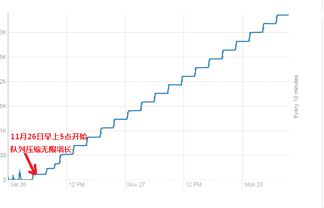
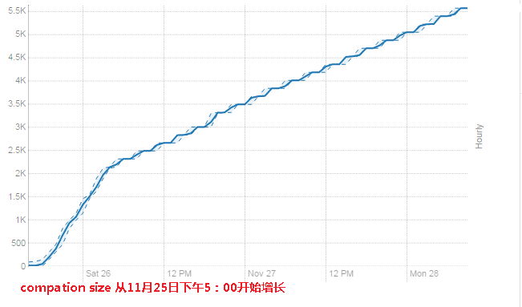
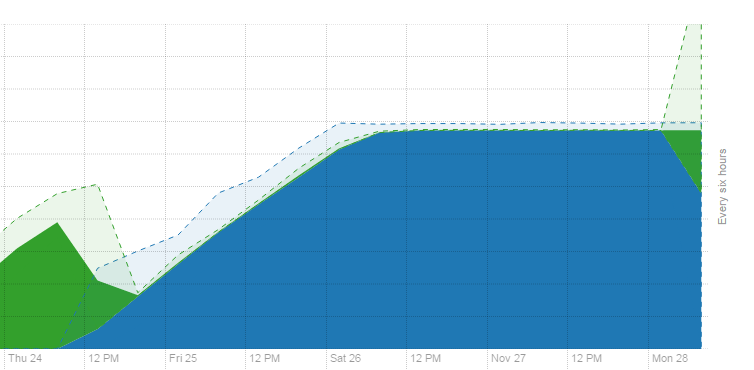
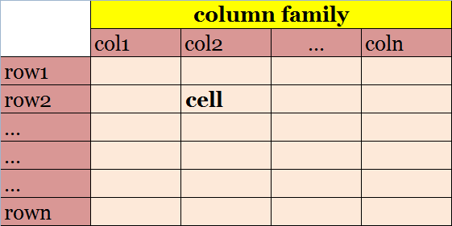
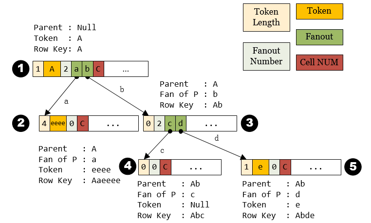

# 记 HBase的一次事故调研

11月24日（2016年）早上，发现 HBase-Common 集群的 **`某个`** region 长时间处于 RIT（Region-In-Transition）状态，于是决定重启：

1. 首先尝试重启 Region 所在的 RS（Region Sever）之后，发现没有效果。
2. 接着尝试重启Master，Master重启后报错。由于是早上高峰期，马上Google，然后按搜索到的内容快速修复问题，重启成功。

11月28日早上发现HBase Common快不能用了，该集群所有RS的Compaction 队列都到3000+以上，很快我们就推断出Compaction 队列持续增长的原因**大概率**是 compaction 出现死循环了。怀疑和『修复24日Master不能重启的操作』有关。

> Tips：
> Region 处于RIT时，HBase 的负载平衡不会工作。因此，一旦有 region 长时间处于 RIT状态，都需要及时处理。我们选择了重启来恢复，事实证明我们错了。

后续经过近一个月的调研，我们基本确定：

1. 死循环是HBase Prefix Tree的Bug，可以通过[代码](https://github.com/baibaichen/HBase-PrefixScan)重现，这个BUG目前仍没修复。
2. 24日Master没有重启成功，**大概率**是因为这个死循环导致的。

##HBase 前缀树的BUG

###为什么猜测 Compaction 过程出现了死循环?


28日早上发现HBase Common不能用了，该集群所有RS的Compaction 队列都到3000+以上的长度，下图是10.17.28.179的压缩队列：



下载10.17.28.179的日志，**仔细观察**发现：

> <u>**2016-11-26 04:57:48,679**</u> INFO org.apache.hadoop.hbase.regionserver.HStore: **Starting compaction** of 9 file(s) in F of PMS_SF_DAILY_FC_SALES,\x01\x80\x00\x00\x00\x03D\xFA\x17\x80\x00\x01U\xD6,1476150303969.3c15c3c1bb8835a5a1082c54eb0a49e2. into tmpdir=hdfs://nameservice2/hbasedata/hbase-common/data/default/PMS_SF_DAILY_FC_SALES/3c15c3c1bb8835a5a1082c54eb0a49e2/.tmp, totalSize=203.7 M
>
> <u>**2016-11-26 14:44:08**</u>,223 INFO org.apache.hadoop.hbase.regionserver.HStore: **Completed major compaction** of 9 (all) file(s) in F of PMS_SF_DAILY_FC_SALES,\x01\x80\x00\x00\x00\x03D\xFA\x17\x80\x00\x01U\xD6,1476150303969.3c15c3c1bb8835a5a1082c54eb0a49e2. into c08e05d9c5c14f9ebeda4cdd697d6ba8(size=153.7 M), total size for store is 153.7 M. This selection was in queue for 0sec, and took **9hrs, 46mins, 19sec** to execute.

日志上的时间和监控数据能对上。看HBase代码可知，`CompactSplitThread`启动时会创建两个线程池分别用于**major compaction** 和 **minor compaction** ，参数是 `hbase.regionserver.thread.compaction.large` 和 `hbase.regionserver.thread.compaction.small`，线上设置都是1，因此只要有**一个Compaction 任务不能完成，对应的compaction 队列就会不断增长**。显然这里是major compaction 的队列堵了。

这么长的Compaction时间肯定有问题，就在上面<u>2016-11-26 14:44:08,223<u>这条日志的前面发现如下异常：

> 2016-11-26 14:43:35,789 WARN org.apache.phoenix.coprocessor.UngroupedAggregateRegionObserver: Unable to collect stats for PMS_SF_DAILY_FC_SALES
> org.apache.hadoop.hbase.client.RetriesExhaustedWithDetailsException: Failed 1 action: ConnectionClosingException: 1 time, 
> ```java
> ... org.apache.phoenix.schema.stats.StatisticsWriter.commitLastStatsUpdatedTime(StatisticsWriter.java:282)
> at org.apache.phoenix.schema.stats.StatisticsWriter.newWriter(StatisticsWriter.java:79)
> at org.apache.phoenix.schema.stats.StatisticsCollector.<init>(StatisticsCollector.java:96)
> at org.apache.phoenix.schema.stats.StatisticsCollector.<init>(StatisticsCollector.java:84)
> at org.apache.phoenix.coprocessor.UngroupedAggregateRegionObserver.preCompact(UngroupedAggregateRegionObserver.java:628)
> at org.apache.hadoop.hbase.coprocessor.BaseRegionObserver.preCompact(BaseRegionObserver.java:191)
> ...
> at org.apache.hadoop.hbase.regionserver.HRegion.compact(HRegion.java:1724)
> at org.apache.hadoop.hbase.regionserver.CompactSplitThread$CompactionRunner.run(CompactSplitThread.java:511)
> at java.util.concurrent.ThreadPoolExecutor.runWorker(ThreadPoolExecutor.java:1145)
> at java.util.concurrent.ThreadPoolExecutor$Worker.run(ThreadPoolExecutor.java:615)
> at java.lang.Thread.run(Thread.java:745)
> ```

`PMS_SF_DAILY_FC_SALES` 表是Apache phoenix创建的，压缩这张表时需要更新System.stats表（Apache phoenix维护的表，从表名上看是收集统计信息的），从日志里看到更新这张表失败了。

> 2016-11-26 14:41:29,414 INFO org.apache.hadoop.hbase.client.AsyncProcess: #2705, table=SYSTEM.STATS, attempt=**349/350** failed=1ops, last exception: org.apache.hadoop.net.ConnectTimeoutException: 10000 millis timeout while waiting for channel to be ready for connect. ch : java.nio.channels.SocketChannel[connection-pending remote=yhd-jqhadoop204.int.yihaodian.com/**10.17.28.204**:60020] on yhd-jqhadoop204.int.yihaodian.com,60020,1479956235061, tracking started null, retrying after=20074ms, replay=1ops

不明白为什么更新失败**需要重试350次**，且重试的间隔不到两分钟，但整个重试时间刚好9个小时，更重要的问题是：**为什么更新System.stats表会失败**？这个问题把疑点指向了**10.17.28.204**。

10.17.28.204的压缩队列变化趋势如下图：



下载10.17.28.204的日志，**仔细观察**发现和10.17.28.179不同，并没有长时运行的major compaction，观察到的现象如下：

1. <u>某个时间点</u>之后，日志里再没有starting compaction的信息了，也就是只看见队列在增长，但是compaction线程不再从队列中取任务了。
2. CPU负载比平常高许多，不像是死锁。
   
3. 分析重启10.17.28.204之前dump的堆栈，major compaction的队列是空的，因为一旦调用 `sun.misc.Unsafe.park` 就意味着线程交出了控制权：

   ```java
   "regionserver/yhd-jqhadoop204.int.yihaodian.com/10.17.28.204:60020-longCompactions-1480066457887" daemon prio=10 tid=0x00007f78f6928000 nid=0x59c7 waiting on condition [0x00007f7906ed5000]
   java.lang.Thread.State: WAITING (parking)
   at sun.misc.Unsafe.park(Native Method)
   - parking to wait for  <0x000000053b872010> (a java.util.concurrent.locks.AbstractQueuedSynchronizer$ConditionObject)
   at java.util.concurrent.locks.LockSupport.park(LockSupport.java:186)
   at java.util.concurrent.locks.AbstractQueuedSynchronizer$ConditionObject.await(AbstractQueuedSynchronizer.java:2043)
   at java.util.concurrent.PriorityBlockingQueue.take(PriorityBlockingQueue.java:539)
   at java.util.concurrent.ThreadPoolExecutor.getTask(ThreadPoolExecutor.java:1068)
   at java.util.concurrent.ThreadPoolExecutor.runWorker(ThreadPoolExecutor.java:1130)
   at java.util.concurrent.ThreadPoolExecutor$Worker.run(ThreadPoolExecutor.java:615)
   at java.lang.Thread.run(Thread.java:745)
   ```
4. 而当时minor compaction 线程在work，应该是正在扫描文件。


因此我的猜测是minor compaction 死循环了，Google发现了这个jira： [HBASE-12949 Scanner can be stuck in infinite loop if the HFile is corrupted](https://issues.apache.org/jira/browse/HBASE-12949)。然而，我们根据 **HBASE-12949** 提供的方法检查数据文件，数据文件并没有被损坏

>死循环和死锁的区别
>1. **死锁**，指两个线程按相反的顺序获取同样的两个锁。由于相互持有对方需要的锁，不得不永远等待，所以CPU的利用率为 0%
>2. **死循环**，按字面意思，指不能从循环中跳出。此时CPU一直处于 **Busy** 状态。十多年前单核时代，表现为CPU利用率100%，不过现在服务端动辄24核，这就不能简单的判断是否死循环了。

### 定位BUG

至此，我们已经知道：

1. 大概率是死循环
2. 重启不能解决问题，可以稳定重现在某个Region上，说明是和“状态”相关的问题，不应该是并发导致的。

我直觉能通过 **Remote Debug** 才能定位问题。此时，集群只能通过不断重启RS才能对外提供服务，于是决定新建集群，将所有的表迁移出去，留下老集群用于定位BUG。

> 如何快速的构建新集群？
> HBase Common 集群上的导数平台，是经典的 Lambda 架构。新建集群（可以理解为容灾），并从HDFS恢复数据，理论上应该很容易，但是本次实战表现不好。

暂且不表新建集群过程遇到的各种情况，可以远程调试之后，很快我们就定位到这和 **Prefix tree** 压缩有关。

#### 一些背景

HBase的表可以看作一个稀疏的二维数组，用\<row,col\>定位每一个cell：



但在实际存储时，数据是按 **Block** 组织的。逻辑上，块内的数据按 row 排列的：

```
row1 col1 v
row1 col2 v
...
row1 coln v
row2 col1 v
...
rowm coln v
```

在引入 [HBase-4218 Data Block Encoding](https://issues.apache.org/jira/browse/HBASE-4218) 之前，块内的数据就是按这么 **native** 的方式存储，由于 key （即<row , col>）按**字节**排序，某些场景下，如 ，『cell 仅仅保存的是一个数值，而Key是UUID』，专用的压缩算法比通用的压缩算法较好。在[HBase-4218](https://issues.apache.org/jira/browse/HBASE-4218)里谈到两个优点：一是解压速度更快了，二是内存需求更少了，提高了 Block Cache 的利用率。但是引入的压缩算法存在两个问题：

1. 没有前缀压缩，仍然存在内存膨胀可能。
2. 在 Block 内只能顺序扫描，不能随机检索。如此，如果Block的大小从 4KB 变为 64KB，那么 Block 内的平均检索速度下降10倍。

如果Block的大小定为4KB又会在其它地方带来问题。因此在 [HBase-4676](https://issues.apache.org/jira/browse/HBASE-4676) 引入了前缀树压缩。

> Notes：
> 1. HBase-4218 其实引入了一个 `PrefixKeyDeltaEncoder` 压缩算法，HBase-4676既然说没有前缀压缩算法，那就没有吧。
> 2. 前缀树的介绍请参见

#### 实现

采用Prefix Tree 压缩的Block，数据结构如下：


Row trie中每一个 Row node 的数据结构如下：


几个重要的字段：
1. Token ：这里表示**前缀** ，如果**Token Length** 为0，则不会保存 Token 字段。
2. fan：**fanout Number**表示有几个子节点，如果为0，则表示为**叶子节点** ，同时不会保存 fanout 字段。
3. Cell numbers：表示该 row 有几列。

下面来看一个实际的例子：



1. ​

-----
HBase CDH 5.4.3 的 Compaction Queue Size  这个监控指标的计算方式如下（参见 `CompactSplitThread`）

````java
  public int getCompactionQueueSize() {
    return longCompactions.getQueue().size() + shortCompactions.getQueue().size();
  }
````

其它JIRA

1. [HFile intermediate block level indexes might recurse forever creating multi TB files](https://issues.apache.org/jira/browse/HBASE-16288)，[milliseconds metrics may cause the compaction hang and huge region tmp files and region server down](https://github.com/OpenTSDB/opentsdb/issues/490)


调试方法

> Log = debug
> org.apache.hadoop.hbase.regionserver.CompactSplitThread
> org.apache.hadoop.hbase.regionserver.compactions.Compactor


1. `PrefixTreeArraySearcher#positionAtQualifierTimestamp`  二叉搜索
2. `UVIntTool`，可变长度的编码（http://mingxinglai.com/cn/2013/01/leveldb-varint32/）

