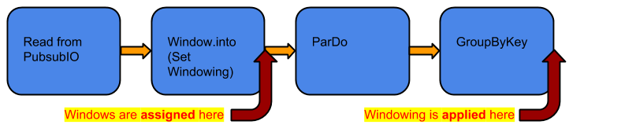
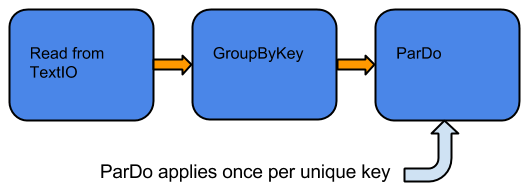
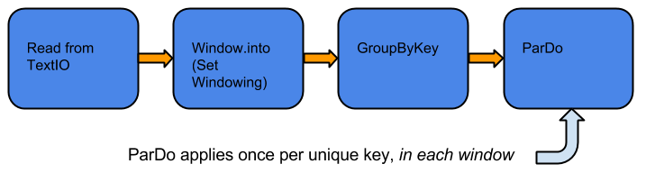
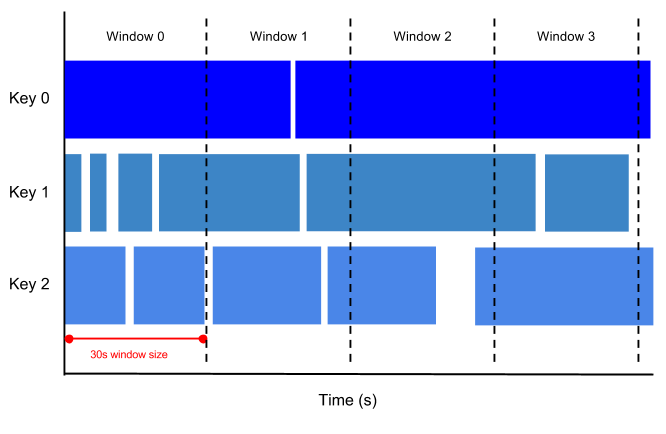
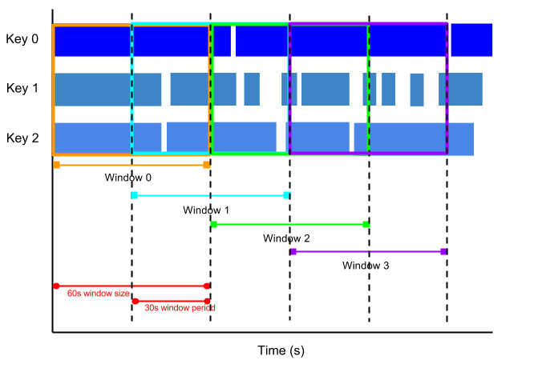
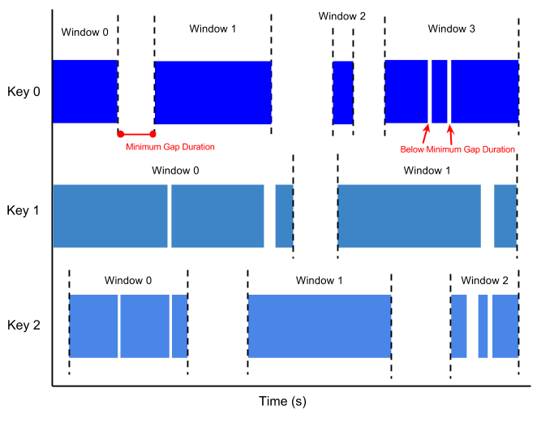
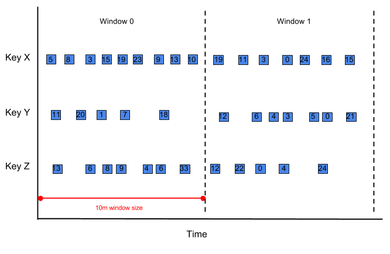
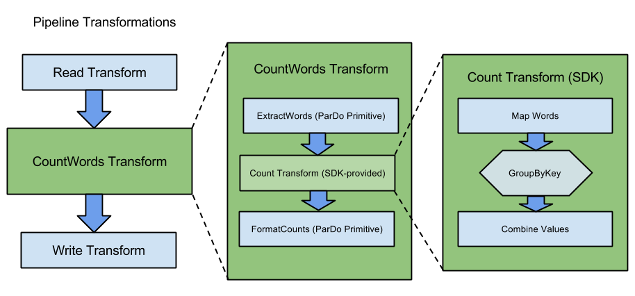

没有理解，要看代码
- [ ] [Side Inputs](#side-inputs)
- [ ] [Side Outputs](#side-outputs)
- [ ] [Data Encoding](#data-encoding)
- [ ] [Handling Multiple PCollections](#handling-multiple-pcollections)

# 编程模型

使用Beam处理数据，有四个主要的概念：
- Pipelines：封装了一系列计算，用于处理外部数据源数据。**`转换`**数据以提供有用的信息，并产生出一些输出数据。Each pipeline represents **a single, potentially repeatable job, from start to finish**, in the *Dataflow* service. 
- PCollections：代表**pipeline**中的数据，`PCollection`类是经过特殊设计的数据容器，用于表示**固定大小的数据文件**，也可用于表示**持续更新的、无限的数据源**。`PCollection`s是**pipeline**中每一步的输入和输出。
- Transforms：代表**pipeline**每一步的操作（计算）。
- I/O Sources 和 Sinks：输入源和输出目的。

> 看来都差不多，Pipeline 等价于DAG，


##Pipeline
**pipeline**代表了处理数据的job。<u>The data and transforms in a pipeline are unique to, and owned by, that pipeline. While your program can create multiple pipelines, pipelines cannot share data or transforms</u>

###Pipeline的组成部分
**pipeline**由两部分组成，数据和处理数据的**transforms**。

####Pipeline Data
In the Dataflow SDKs, pipelines use a specialized collection class called `PCollection` to represent their input, intermediate, and output data. **`PCollections` can be used to represent data sets of virtually any size**. Note that compared to typical collection classes such as Java's Collection, PCollections are specifically designed to support parallelized processing.

**A pipeline must create a PCollection for any data it needs to work with**. You can read data from an external source into a PCollection, or you can create a PCollection from local data in your Dataflow program. From there, each transform in your pipeline accepts one or more PCollections as input and produces one or more PCollections as output.

> See `PCollection` for a complete discussion of how a `PCollection` works and how to use one.

####Pipeline Transforms

A **transform** is a step in your pipeline. Each transform takes one or more `PCollection`s as input, changes or otherwise manipulates the elements of that `PCollection`, and produces one or more new `PCollection`s as output.

##### Core Transforms

The Dataflow SDKs contain a number of **core transforms**. A core transform is a generic operation that represents a basic or common processing operation that you perform on your pipeline data. Most core transforms provide a processing pattern, and require you to create and supply the actual processing logic that gets applied to the input `PCollection`.

For example, the [ParDo](https://cloud.google.com/dataflow/model/par-do) core transform provides a generic processing pattern: for every element in the input `PCollection`, perform a user-specified processing function on that element. The Dataflow SDKs supply core transforms such as [ParDo](https://cloud.google.com/dataflow/model/par-do) and [GroupByKey](https://cloud.google.com/dataflow/model/group-by-key), as well as other core transforms for combining, merging, and splitting data sets.

>  See [Transforms](https://cloud.google.com/dataflow/model/transforms.html) for a complete discussion of how to use transforms in your pipeline.

##### Composite Transforms

The Dataflow SDKs support combining multiple transforms into larger **composite transforms.** In a composite transform, multiple transforms are applied to a data set to perform a more complex data processing operation. Composite transforms are a good way to build modular, reusable combinations of transforms that do useful things.

The Dataflow SDKs contain libraries of pre-written composite transforms that handle common data processing use cases, including (but not limited to):

- Combining data, such as **summing** or **averaging** numerical data
- **Map/Shuffle/Reduce-style processing**, such as counting unique elements in a collection
- Statistical analysis, such as **finding the top *N* elements in a collectio**n

You can also create your own reusable composite transforms. See [Creating Composite Transforms](https://cloud.google.com/dataflow/model/composite-transforms.html) for a complete discussion.

##### Root Transforms

The Dataflow SDKs often use **root transforms** at the start of a pipeline to [create an initial PCollection](https://cloud.google.com/dataflow/model/pcollection#Creating). Root transforms frequently involve reading data from an external data source. See [Pipeline I/O](https://cloud.google.com/dataflow/model/pipeline-io#using-reads) for additional information.

###[设计pipeline时需要考虑的因素](https://cloud.google.com/dataflow/pipelines/design-principles)：

1. 数据存储在哪？
2. 数据的存储格式是啥？
3. 怎么处理数据？
4. 数据输出到那？

#### 不同的 Pipeline 形状

##### Branching `PCollection`s

It's important to understand that transforms do not consume `PCollection`s; instead, they consider each individual element of a `PCollection` and create a new `PCollection` as output. This way, you can do different things to different elements in the same `PCollection`.

###### Multiple transforms process the same `PCollection`

这里的意思是用**两个** `PTransform` 处理同一个 `PCollection` 。

第一个`PTransform`
```
if (starts with 'A') { outputToPCollectionA }
```
第一个`PTransform`
```
if (starts with 'B') { outputToPCollectionB }
```
###### A single transform that uses side outputs

[side outputs](https://cloud.google.com/dataflow/model/par-do#side-outputs) 的意思是用**一个**  `PTransform` 处理 `PCollection` ，但是**两（多）个** `PCollection` 输出。

`PTransform`按如下的写：
```
if (starts with 'A') { outputToPCollectionA } else if (starts with 'B') { outputToPCollectionB }
```

##### Merging `PCollection`s

- **Flatten** -  使用 [`Flatten`](https://cloud.google.com/dataflow/model/multiple-pcollections#flatten) ，只能合并同样类型的`PCollection`s。
- **Join** -  使用[`CoGroupByKey`](https://cloud.google.com/dataflow/model/group-by-key#join)。

##### Multiple sources

从多个源读取数据

## PCollection

###Overview

The Dataflow SDKs use a specialized class called `PCollection` to represent data in a pipeline. A `PCollection` represents a multi-element data set.

You can think of a `PCollection` as "pipeline" data. Dataflow's [transforms](https://cloud.google.com/dataflow/model/transforms) use `PCollection`s as inputs and outputs; as such, if you want to work with data in your pipeline, it must be in the form of a `PCollection`. **Each `PCollection` is owned by a specific `Pipeline` object, and only that `Pipeline` object can use it.**

> **IMPORTANT:** This document contains information about **unbounded** `PCollection`s and **Windowing**. These concepts refer to the Dataflow Java SDK only, and are not yet available in the Dataflow Python SDK.

#### PCollection Characteristics

**A `PCollection` represents a potentially large, immutable "bag" of elements**. There is **no upper limit** on how many elements a `PCollection` can contain; any given `PCollection` might fit in memory, or it might represent a very large data set backed by a persistent data store.

> The elements of a `PCollection` can be of any type, but must all be of the same type. However, Dataflow needs to be able to encode each individual element as a byte string in order to support distributed processing. The Dataflow SDKs provide a [Data Encoding](https://cloud.google.com/dataflow/model/data-encoding.html) mechanism that includes built in encodings for commonly used types and support for specifying custom encodings as needed. Creating a valid encoding for an aribitrary type can be challenging, but you can [construct](https://cloud.google.com/dataflow/model/pcollection#user-data-types) custom encoding for simple structured types.

##### PCollection Limitations

A `PCollection` has several key aspects in which it differs from a regular collection class:

- A `PCollection` is **immutable**. Once created, you cannot add, remove, or change individual elements.
- A `PCollection` does not support random access to individual elements.
- A `PCollection` belongs to the pipeline in which it is created. You **cannot** share a `PCollection` between `Pipeline` objects.

A `PCollection` may **be physically backed by data in existing storage**, or it may represent data that has not yet been computed. As such, the data in a `PCollection` is immutable. You can use a `PCollection` in computations that generate new pipeline data (as a new `PCollection`); however, you cannot change the elements of an existing `PCollection` once it has been created.

> A `PCollection` does not store data, per se; remember that a `PCollection` may have too many elements to fit in local memory where your Dataflow program is running. When you create or transform a `PCollection`, data isn't copied or moved in memory as with some regular container classes. Instead, a `PCollection` represents a potentially very large data set in the cloud.

#### Bounded and Unbounded PCollections

A `PCollection`'s size can be either **bounded** or **unbounded**, and the boundedness (or unboundedness) is determined when you create the `PCollection`. Some root transforms create bounded `PCollections`, while others create unbounded ones; it depends on the source of your input data.

##### Bounded PCollections

Your `PCollection` is bounded if it represents a *fixed data set*, which has a known size that doesn't change. An example of a fixed data set might be "*server logs from the month of October*", or "*all orders processed last week*." `TextIO` and `BigQueryIO`  root transforms create bounded `PCollection`s.

**Data sources that create bounded PCollections include:**
- TextIO
- `BigQueryIO`
- `DatastoreIO`
- Custom bounded data sources you create using the [Custom Source API](https://cloud.google.com/dataflow/model/custom-io-java)

**Data sinks that accept bounded PCollections include:**
- `TextIO`
- `BigQueryIO`
- `DatastoreIO`
- Custom bounded data sinks you create using the [Custom Sink API](https://cloud.google.com/dataflow/model/custom-io-python)

##### Unbounded PCollections

Your `PCollection` is unbounded if it represents a **continuously updating data set**, or streaming data. An example of a continuously updating data set might be "server logs as they are generated" or "all new orders as they are processed."`PubSubIO` root transforms create unbounded `PCollection`s.

Some sources, particularly those that create unbounded `PCollection`s (such as `PubsubIO`), automatically append a timestamp to each element of the collection.

**Data sources that create unbounded PCollections include:**

- `PubsubIO`
- Custom unbounded data sources you create using the [Custom Source API](https://cloud.google.com/dataflow/model/custom-io-java)

**Data sinks that accept unbounded PCollections include:**

- `PubsubIO`
- `BigQueryIO`

##### Processing Characteristics

The bounded (or unbounded) nature of your `PCollection` affects how Dataflow processes your data. **Bounded `PCollection`s can be processed using batch jobs**, which might read the entire data set once, and perform processing in a finite job. **Unbounded `PCollection`s must be processed using streaming jobs**, as the entire collection can never be available for processing at any one time.

When grouping unbounded `PCollection`s, Dataflow requires a concept called [Windowing](https://cloud.google.com/dataflow/model/windowing) to **divide a continuously updating data set into logical windows of finite size**. Dataflow processes each window as a bundle, and processing continues as the data set is generated. See the following section on [Timestamps and Windowing](https://cloud.google.com/dataflow/model/pcollection#Timestamps) for more information.

#### PCollection Element Timestamps

Each element in a `PCollection` has an associated **timestamp**. Timestamps are useful for `PCollection`s that contain elements *with an inherent notion of time*. For example, a `PCollection` of orders to process may use the time an order was created as the element timestamp.

**The timestamp for each element is initially assigned by the source that creates the `PCollection`**. **Sources** that create unbounded `PCollection` often *assign each new element a timestamp according to when it was added to the unbounded `PCollection`*.

> Data sources that produce fixed data sets, such as `BigQueryIO` or `TextIO`, also assign timestamps to each element; however, these data sources typically assign the same timestamp (`Long.MIN_VALUE`) to each element.
>
> You can manually assign timestamps to the elements of a `PCollection`. This is commonly done when elements have an inherent timestamp, but that timestamp must be calculated, for example by parsing it out of the structure of the element. To manually assign a timestamp, use a [ParDo](https://cloud.google.com/dataflow/model/par-do) transform; within the `ParDo` transform, your `DoFn` can produce output elements with timestamps. See [Assigning Timestamps](https://cloud.google.com/dataflow/model/windowing#TimeStamping) for more information.

##### Windowing

The timestamps associated with each element in a `PCollection` are used for a concept called **Windowing**. Windowing **divides the elements of a `PCollection` according to their timestamps**. Windowing can be used on all `PCollection`s, but **is required for some computations over unbounded `PCollection`s in order to divide the continuous data stream in finite chunks for processing.**

> **Caution:** Dataflow's default windowing behavior is to assign all elements of a `PCollection` to a single, global window, *even for unbounded PCollections.* Before you use a grouping transform such as `GroupByKey` on an **unbounded** `PCollection`, **you must set a non-global windowing function.** See [Setting Your PCollection's Windowing Function.](https://cloud.google.com/dataflow/model/windowing#Setting) <u>If you don't set a non-global windowing function for your unbounded `PCollection` and subsequently use a grouping transform such as `GroupByKey` or `Combine`, your pipeline will generate an error upon construction and your Dataflow job will fail</u>. You can alternatively set a non-default [Trigger](https://cloud.google.com/dataflow/model/triggers) for a `PCollection` to allow the global window to emit "early" results under some other conditions. Triggers can also be used to allow for conditions such as late-arriving data.

See the section on [Windowing](https://cloud.google.com/dataflow/model/windowing) for more information on how to use Dataflow's Windowing concepts in your pipeline.

#### 创建 `PCollection`

- [ ] Reading External Data
- [ ] Creating a PCollection from Data in Local Memory


#### Using PCollection with Custom Data Types

You can create a `PCollection` where the element type is a **custom data type** that you provide. This can be useful if you need to create a collection of your own class or structure with specific fields, like a Java class that holds a customer's name, address, and phone number.

When you create a `PCollection` of a custom type, you'll need to provide a `Coder` for that custom type. The `Coder` tells the [Dataflow service](https://cloud.google.com/dataflow/service/dataflow-service-desc) how to **serialize** and **deserialize** the elements of your `PCollection` as your dataset is parallelized and partitioned out to multiple pipeline worker instances; see [data encoding](https://cloud.google.com/dataflow/model/data-encoding) for more information.

Dataflow will attempt to infer a `Coder` for any `PCollection` for which you do not explictly set a `Coder`. The default `Coder` for a custom type is `SerializableCoder`, which uses Java serialization. However, Dataflow recommends using `AvroCoder` as the `Coder` when possible.

You can register `AvroCoder` as the default coder for your data type by using your `Pipeline` object's [CoderRegistry](https://cloud.google.com/dataflow/model/data-encoding#coder-registry). Annotate your class as follows:

```java
@DefaultCoder(AvroCoder.class)
public class MyClass {
  ...
}
```

To ensure that your custom class is compatible with `AvroCoder`, you might need to add some additional annotations—for example, you must annotate null fields in your data type with `org.apache.avro.reflect.Nullable`. See the API for Java reference documentation for [`AvroCoder`](https://cloud.google.com/dataflow/java-sdk/JavaDoc/com/google/cloud/dataflow/sdk/coders/AvroCoder) and the [package documentation for `org.apache.avro.reflect`](http://avro.apache.org/docs/current/api/java/org/apache/avro/reflect/package-summary.html) for more information.

Dataflow's [TrafficRoutes example pipeline](https://github.com/GoogleCloudPlatform/DataflowJavaSDK/blob/master/examples/src/main/java/com/google/cloud/dataflow/examples/complete/TrafficRoutes.java) creates a `PCollection` whose element type is a custom class called `StationSpeed`.  `StationSpeed` registers `AvroCoder` as its default coder as follows:

```java
/**
 * This class holds information about a station reading's average speed.
 */
@DefaultCoder(AvroCoder.class)
static class StationSpeed {
  @Nullable String stationId;
  @Nullable Double avgSpeed;

  public StationSpeed() {}

  public StationSpeed(String stationId, Double avgSpeed) {
    this.stationId = stationId;
    this.avgSpeed = avgSpeed;
  }

  public String getStationId() {
    return this.stationId;
  }
  public Double getAvgSpeed() {
    return this.avgSpeed;
  }
}
```

###Windowing

The Dataflow SDKs use a concept called **Windowing** to subdivide a [PCollection](https://cloud.google.com/dataflow/model/pcollection) according to the timestamps of its individual elements. Dataflow [transforms](https://cloud.google.com/dataflow/model/transforms) that aggregate multiple elements, such as [GroupByKey](https://cloud.google.com/dataflow/model/group-by-key) and [Combine](https://cloud.google.com/dataflow/model/combine), work implicitly on a per-window basis—that is, they process each `PCollection` as a succession of multiple, finite windows, though the entire collection itself may be of unlimited or infinite size.

>1.  a succession of :  一系列的、一连串、一个接一个

The Dataflow SDKs use a related concept called **Triggers** to determine when to "close" each finite window as unbounded data arrives. Using a trigger can help to refine the windowing strategy for your `PCollection` to deal with late-arriving data or to provide early results. See [Triggers](https://cloud.google.com/dataflow/model/triggers) for more information.

#### Windowing 基础

Windowing is most useful with an **unbounded** `PCollection`, which represents a *continuously updating data set of unknown/unlimited size* (e.g. streaming data). Some Dataflow transforms, such as [GroupByKey](https://cloud.google.com/dataflow/model/group-by-key) and [Combine](https://cloud.google.com/dataflow/model/combine), group multiple elements by a common key. Ordinarily, that grouping operation groups all of the elements that have the same key *in the entire data set*. With an unbounded data set, it is impossible to collect all of the elements, since new elements are constantly being added.

 In the Dataflow model, any `PCollection` can be subdivided into logical **windows**. Each element in a `PCollection` gets assigned to one or more windows according to the `PCollection`'s **windowing function**, and each individual window contains a finite number of elements. Grouping transforms then consider each `PCollection`'s elements on a per-window basis. `GroupByKey`, for example, implicitly groups the elements of a `PCollection` by *key and window*. Dataflow *only* groups data within the same window, and doesn't group data in other windows.

> **Caution:** Dataflow's default windowing behavior is to assign all elements of a `PCollection` to a single, global window, *even for unbounded PCollections.* Before you use a grouping transform such as `GroupByKey` on an unbounded `PCollection`, **you must set a non-global windowing function.** See [Setting Your PCollection's Windowing Function.](https://cloud.google.com/dataflow/model/windowing#Setting)
>
> If you don't set a non-global windowing function for your unbounded `PCollection` and subsequently use a grouping transform such as `GroupByKey` or `Combine`, your pipeline will generate an error upon construction and your Dataflow job will fail.
>
> You can alternatively set a non-default [Trigger](https://cloud.google.com/dataflow/model/triggers) for a `PCollection` to allow the global window to emit "early" results under some other conditions.

##### Windowing Constraints
Once you set the windowing function for a PCollection, the elements' windows are used the next time you apply a grouping transform to that PCollection. Dataflow performs the actual window grouping on an as-needed basis; if you set a windowing function using the Window transform, each element is assigned to a window, but the windows are not considered until you group the PCollection with GroupByKey or Combine. This can have different effects on your pipeline.

Consider the example pipeline in Figure 1 below:

 Figure 1: Pipeline Applying Windowing

In the above pipeline, we create an unbounded `PCollection` by reading a set of key/value pairs using [PubsubIO](https://cloud.google.com/dataflow/model/pubsub-io), and then apply a windowing function to that collection using the `Window` transform. We then apply a `ParDo` to the the collection, and then later group the result of that `ParDo` using `GroupByKey`. **The windowing function *has no effect on the ParDo transform*, because the windows are not actually used until they're needed for the `GroupByKey`.**

Subsequent transforms, however, are applied to the result of the `GroupByKey`--that is, data grouped by *both key and window.*

> 这张图重要

#####Using Windowing With Bounded PCollections

You can use windowing with fixed-size data sets in **bounded** `PCollection`s. Note, however, that **windowing considers only the implicit timestamps attached to each element of a `PCollection`, *and* data sources that create fixed data sets (such as `TextIO` and `BigQueryIO`) assign the same timestamp to every element**. This means that **all the elements are by default part of a single, global window**. Having all elements assigned to the same window will cause a pipeline to execute in classic MapReduce batch style.

To use windowing with fixed data sets, you can [**assign your own timestamps**](https://cloud.google.com/dataflow/model/windowing#TimeStamping) to each element. To assign timestamps to elements, you use a `ParDo` transform with a `DoFn` that outputs each element with a new timestamp.

Using windowing with a bounded `PCollection` can affect how your pipeline processes data. For example, consider the following pipeline:


*Figure 2: GroupByKey and ParDo without windowing, on a bounded collection*.

In the above pipeline, we create a **bounded** `PCollection` by reading a set of key/value pairs using [TextIO](https://cloud.google.com/dataflow/model/text-io). We then group the collection using `GroupByKey`, and apply a `ParDo` transform to the grouped `PCollection`. In this example, the `GroupByKey` creates a collection of unique keys, and then `ParDo` gets applied *exactly once per key*.

Now, consider the same pipeline, but using a windowing function:


*Figure 3: GroupByKey and ParDo with windowing, on a bounded collection*.

As before, the pipeline creates a bounded `PCollection` of key/value pairs. We then set a [windowing function](https://cloud.google.com/dataflow/model/windowing#Setting) for that `PCollection`. The `GroupByKey` transform now groups the elements of the `PCollection` *by both key and window*. The subsequent `ParDo` transform gets applied *multiple times per key*, once for each window.

####Windowing Functions

The Dataflow SDKs let you define different kinds of windows to divide the elements of your `PCollection`. The SDK provides several windowing functions, including:

- Fixed Time Windows
- Sliding Time Windows
- Per-Session Windows
- Single Global Window

> **Note** that each element can logically belong to *more than one window*, depending on the windowing function you use. **Sliding time windowing, for example, creates overlapping windows wherein a single element can be assigned to multiple windows**.

##### Fixed Time Windows

The most simple form of windowing is a **fixed time window**: given a timestamped `PCollection`, which might be continously updating, each window might capture (for example) five minutes worth of elements.

A fixed time window represents the time interval in the data stream that defines <u>a bundle of</u> data for processing. Consider a window that operates at five-minute intervals: all of the elements in your unbounded `PCollection` with timestamp values between 0:00:00 and 0:04:59 belong to the first window, elements with timestamp values between 0:05:00 and 0:09:59 belong to the second window, and so on.


*Figure 4: Fixed time windows, 30s in size*.

##### Sliding Time Windows

A **sliding time window** also uses time intervals in the data stream to define bundles of data; however, with sliding time windowing, **the windows overlap**. Each window might capture five minutes worth of data, but a new window starts every ten seconds. The frequency with which sliding windows begin is called the ***period***. Therefore, our example would have a window *size* of five minutes and a *period* of ten seconds.

Because multiple windows overlap, most elements in a data set will belong to more than one window. This kind of Windowing is useful for taking running averages of data; using sliding time windows, **you can compute a running average of the past five minutes' worth of data, updated every ten seconds**, in our example.

 
*Figure 5: Sliding time windows, with 1 minute window size and 30s window period*.

##### Session Windows

A **session window** function defines windows around areas of <u>concentration</u> in the data. **Session windowing is useful for data that is irregularly distributed with respect to time**; for example, a data stream representing user mouse activity may have long periods of idle time interspersed with high concentrations of clicks. Session windowing groups the high concentrations of data into separate windows and filters out the idle sections of the data stream.

Note that **session windowing applies on a per-key basis**; that is, grouping into sessions **only** takes into account data that has the same key. **Each key in your data collection will therefore be grouped into disjoint windows of differing sizes.**

The simplest kind of session windowing specifies a *minimum gap duration*. All data arriving below a minimum threshold of time delay is grouped into the same window. If data arrives after the minimum specified gap duration time, this initiates the start of a new window.


*Figure 5: Session windows, with a minimum gap duration. Note how each data key has different windows, according to its data distribution.*

##### Single Global Window

By default, all data in a `PCollection` is assigned to a single global window. If your data set is of a fixed size, you can leave the global window default for your `PCollection`. If the elements of your `PCollection` all belong to a single global window, your pipeline will execute much like a batch processing job (as in MapReduce-based processing).

>You can use a single global window if you are working with an unbounded data set, e.g. from a streaming data source; however, use caution when applying aggregating transforms such as [GroupByKey](https://cloud.google.com/dataflow/model/group-by-key) and [Combine](https://cloud.google.com/dataflow/model/combine). A single global window with a default trigger generally requires the entire data set to be available before processing, which is not possible with continuously updating data.
>
>To perform aggregations on an unbounded `PCollection` that uses global windowing, you should specify a **non-default** [trigger](https://cloud.google.com/dataflow/model/triggers) for that `PCollection`. If you attempt to perform an aggregation such as `GroupByKey` on an unbounded, globally windowed `PCollection` with default triggering, the Cloud Dataflow service will generate an exception when your pipeline is constructed.

##### Other Windowing Functions

The Dataflow SDKs provide more windowing functions beyond fixed, sliding, session, and global windows, such as **Calendar-based windows**.

#### Setting Your PCollection's Windowing Function

You can set the windowing function for a `PCollection` by applying the `Window` transform. When you apply the `Window` transform, you must provide a `WindowFn`. The `WindowFn` determines the windowing function your `PCollection` will use for subsequent grouping transforms, such as a fixed or sliding time window.

The Dataflow SDKs provide pre-defined `WindownFn`s for the basic [windowing functions](https://cloud.google.com/dataflow/model/windowing#Functions), or you can define your own `WindowFn` in advanced cases.

> Technically, like all transforms, `Window` takes an input `PCollection` and outputs a new `PCollection` with each element assigned to one or more logical, finite windows.
>
> When setting a windowing function, you may also want to set a trigger for your `PCollection`. The trigger determines when each individual window is aggregated and emitted, and helps refine how the windowing function performs with respect to late data and computing early results. See [Triggers](https://cloud.google.com/dataflow/model/triggers) for more information.

##### Setting Fixed-Time Windows

The following example code shows how to apply `Window` to divide a `PCollection` into fixed windows, each one minute in length:

```java
PCollection<String> items = ...;
PCollection<String> fixed_windowed_items = items.apply(
  Window.<String>into(FixedWindows.of(Duration.standardMinutes(1))));
```

##### Setting Sliding Time Windows

The following example code shows how to apply `Window` to divide a `PCollection` into sliding time windows. Each window is 30 minutes in length, and a new window begins every five seconds:

```java
PCollection<String> items = ...;
  PCollection<String> sliding_windowed_items = items.apply(
    Window.<String>into(SlidingWindows.of(Duration.standardMinutes(30)).
                          every(Duration.standardSeconds(5))));
```

##### Setting Session Windows

The following example code shows how to apply `Window` to divide a `PCollection` into session windows, where each session must be separated by a time gap of at least 10 minutes:

```java
PCollection<String> items = ...;
  PCollection<String> session_windowed_items = 
    items.apply(Window.<String>into(Sessions.withGapDuration(Duration.standardMinutes(10))));
```

##### Setting a Single Global Window

If your `PCollection` is **bounded** (the size is fixed), you can assign all the elements to a single global window. The following example code shows how to set a single global window for a `PCollection`:

To set a single global window for your `PCollection`, pass `new GlobalWindows()` as the `WindowFn` when you apply the `Window` transform. The following example code shows how to apply `Window` to assign a `PCollection` into a single global window:

```java
PCollection<String> items = ...;
  PCollection<String> batch_items = items.apply(Window.<String>into(new GlobalWindows()));
```

#### Time Skew, Data Lag, and Late Data

In any data processing system, there is a certain amount of lag between the time a data event occurs (the "event time", determined by the timestamp on the data element itself) and the time the actual data element gets processed at any stage in your pipeline (the "processing time", determined by the clock on the system processing the element).

> In a perfect system, the event time for each data element and the processing time would be equal, or at least have a *g*. However, in any real-world computing system, data generation and delivery are subject to any number of temporal limitations. In large or distributed systems, such as a distributed collection of web front-ends generating customer orders or log files, there are no guarantees that data events will appear in your pipeline in the same order that they were generated in various places on the web.

**For example**, let's say we have a `PCollection` that's using fixed-time windowing, with windows that are five minutes long. For each window, Dataflow must collect all the data with an *event time* timestamp in the given window range (between 0:00 and 4:59 in the first window, for instance). Data with timestamps outside that range (data from 5:00 or later) belong to a different window.

However, data isn't always guaranteed to arrive in a pipeline in correct time order, or to always arrive at predictable intervals. Dataflow tracks a *watermark*, which is the system's notion of when all data in a certain window can be expected to have arrived in the pipeline. <u>Data that arrives with a timestamp after the watermark is considered</u> **late data**.

From our example, suppose we have a simple watermark that assumes approximately 30s of lag time between the data timestamps (the event time) and the time the data appears in the pipeline (the processing time), then Dataflow would close the first window at 5:30. If a data record arrives at 5:34, but with a timestamp that would put it in the 0:00-4:59 window (say, 3:38), then that record is late data.

> **Note:** For simplicity, we've assumed that we're using a very straightforward watermark that estimates the lag time/time skew. In practice, your `PCollection`'s data source determines the watermark, and watermarks can be more precise or complex.

##### Managing Time Skew and Late Data

You can allow late data by invoking the `.withAllowedLateness` operation when you set your `PCollection`'s windowing strategy. The following code example demonstrates a windowing strategy that will allow late data up to two days after the end of a window.

```java
PCollection<String> items = ...;
PCollection<String> fixed_windowed_items = items.apply(
  Window.<String>into(FixedWindows.of(Duration.standardMinutes(1))).
         withAllowedLateness(Duration.standardDays(2)));
```

When you set `.withAllowedLateness` on a `PCollection`, that allowed lateness propagates forward to any subsequent `PCollection` derived from the first `PCollection` you applied allowed lateness to. If you want to change the allowed lateness later in your pipeline, you must do so explictly by applying `Window.withAllowedLateness()` again.

You can also use Dataflow's [Triggers](https://cloud.google.com/dataflow/model/triggers) API to help you refine the windowing strategy for a `PCollection`. You can use triggers to determine exactly when each individual window aggregates and reports its results, including how the window emits late elements.

> **Note:** Dataflow's default windowing and trigger strategies *discard* late data. If you want to ensure that your pipeline handles instances of late data, you'll need to explicitly set `.withAllowedLateness` when you set your `PCollection`'s windowing strategy and set triggers for your `PCollection`s accordingly.

#### Adding Timestamps To a PCollection's Elements

You can assign new timestamps to the elements of a `PCollection` by applying a [ParDo](https://cloud.google.com/dataflow/model/par-do) transform that outputs new elements with timestamps that you set. Assigning timestamps can be useful if you want to use Dataflow's windowing features, but your data set comes from a source without implicit timestamps (such as a file from [TextIO](https://cloud.google.com/dataflow/model/text-io)).

**This is a good pattern to follow when your data set includes timestamp data, but the timestamps are *not* generated by the Dataflow data source**. An example might be if your pipeline reads log records from an input file, and each log record includes a timestamp field; since your pipeline reads the records in from a file, the file source doesn't assign timestamps automatically. You can parse the timestamp field from each record and use a `ParDo` transform to attach the timestamps to each element in your `PCollection`.

To assign timestamps, your `ParDo` transform needs to use a `DoFn` that outputs elements using `ProcessContext.outputWithTimestamp` (rather than the usual `ProcessContext.output` used to emit elements to the main output collection). The following example code shows a `ParDo` with a `DoFn` that outputs elements with new timestamps:

```java
PCollection<LogEntry> unstampedLogs = ...;
PCollection<LogEntry> stampedLogs =
  unstampedLogs.apply(ParDo.of(new DoFn<LogEntry, LogEntry>() {
    public void processElement(ProcessContext c) {
      // Extract the timestamp from log entry we're currently processing.
      Instant logTimeStamp = extractTimeStampFromLogEntry(c.element());
      // Use outputWithTimestamp to emit the log entry with timestamp attached.
      c.outputWithTimestamp(c.element(), logTimeStamp);
    }
  }));
```

### Triggers

When collecting the data in a `PCollection` and grouping that data in finite windows, **Dataflow needs some way to determine when to emit the aggregated results of each window**. Given [time skew and data lag](https://cloud.google.com/dataflow/model/windowing#Advanced), Dataflow uses a mechanism called **triggers** to determine when "enough" data has been collected in a window, after which it emits the aggregated results of that window, each of which is referred to as a ***pane***.

Dataflow's triggers system provides several different ways to determine when to emit the aggregated results of a given window, depending on your system's data processing needs. **For example**, a system that requires prompt or time-sensitive updates might use *a strict time-based trigger that emits a window every N seconds*, valuing promptness over data completeness; a system that values data completeness more than the exact timing of results might use *a data-based trigger that waits for a certain number of data records* to accumulate before closing a window.

**Triggers** are particularly useful for handling two kinds of conditions in your pipeline:

- Triggers can help you handle instances of late data.
- Triggers can help you emit early results, before all the data in a given window has arrived.

> **Note:** You can set a trigger for an unbounded `PCollection` that uses a single global window for its windowing function. This can be useful when you want your pipeline to provide periodic updates on an unbounded data set—for example, a running average of all data provided to the present time, updated every *N* seconds or every *N* elements.
>
> promptness：及时性

#### Types of Triggers

Dataflow provides a number of pre-built triggers that you can set for your `PCollection`s. There are three major kinds of triggers:

- **Time-based triggers**. These triggers operate on a time reference--either event time (as indicated by the timestamp on each data element) or the processing time (the time when the data element is processed at any given stage in the pipeline).
- **Data-driven triggers**. These triggers operate by examining the data as it arrives in each window and firing when a data condition that you specify is met. For example, you can set a trigger to emit results from a window when that window has received a certain number of data elements.
- **Composite triggers**. These triggers combine multiple time-based or data-driven triggers in some logical way. You can set a composite trigger to fire when all triggers are met (logical AND), when any trigger is met (logical OR), etc.

##### Time-Based Triggers

Dataflow's time-based triggers include `AfterWatermark` and `AfterProcessingTime`. These triggers take a time reference in either event time or processing time, and set a timer based on that time reference.

###### AfterWatermark

**The `AfterWatermark` trigger operates on *event time***. The `AfterWatermark` trigger will emit the contents of a window after the watermark passes the end of the window, based on the timestamps attached to the data elements. **The watermark is a global progress metric, Dataflow's notion of input completeness within your pipeline at any given point.**

The `AfterWatermark` trigger ***only* fires when the watermark passes the end of the window**—it is the primary trigger that Dataflow uses to emit results when the system estimates that it has all the data in a given time-based window.

###### AfterProcessingTime

**The `AfterProcessingTime` trigger operates on *processing time***.  The `AfterProcessingTime` trigger emits a window after a certain amount of processing time has passed since the time reference, such as the start of a window. The processing time is determined by the system clock, rather than the data element's timestamp.

The `AfterProcessingTime` trigger is **useful for triggering early results from a window, particularly a window with a large time frame such as a single global window.**

##### Data-Driven Triggers

Dataflow currently provides only one data-driven trigger, `AfterPane.elementCountAtLeast`. This trigger works on a straight element count; it fires after the current pane has collected at least *N* elements.

The `AfterPane.elementCountAtLeast()` is a good way to cause a window to emit early results, before all the data has accumulated, especially in the case of a single global window.

##### Default Trigger

The default trigger for a `PCollection` is event time-based, and emits the results of the window when the system's watermark (Dataflow's notion of when it "should" have all the data) passes the end of the window. The default triggering configuration **emits exactly once, and late data is discarded**. This is because the default windowing and trigger configuration has an allowed lateness value of 0. See [Handling Late Data](https://cloud.google.com/dataflow/model/triggers#lateData) for information on modifying this behavior.

**The watermark depends on the data source**; in some cases, it is an estimate. In others, such as Pub/Sub with system-assigned timestamps, the watermark can provide an exact bound of what data the pipeline has processed.

##### Handling Late Data

If your pipeline needs to handle late data (data that arrives after the watermark passes the end of the window), you can apply an *allowed lateness* when setting your windowing and trigger configuration. This will give your trigger the opportunity to react to the late data; in the default triggering configuration it will emit new results immediately whenever late data arrives.

You set the allowed lateness by using `.withAllowedLateness()` when setting your window and trigger, as follows:

```java
PCollection<String> pc = ...;
pc.apply(
  Window<String>.into(FixedWindows.of(1,TimeUnit.MINUTES))
                .triggering(AfterProcessingTime.pastFirstElementInPane()
                                               .plusDelayOf(Duration.standardMinutes(1)))
                .withAllowedLateness(Duration.standardMinutes(30));
```

This allowed lateness propagates to all `PCollection`s derived as a result of applying transforms to the original `PCollection`. If you want to change the allowed lateness later in your pipeline, you can apply `Window.withAllowedLateness()` again, explicitly.

#### Setting a Trigger

When you set a windowing function for a `PCollection` by using the `Window` transform, you can also specify a trigger.

You set the trigger(s) for a `PCollection` by invoking the method `.triggering()` on the result of your `Window.into()`transform, as follows:

```java
PCollection<String> pc = ...;
pc.apply(Window<String>.into(FixedWindows.of(1, TimeUnit.MINUTES))
                       .triggering(AfterProcessingTime.pastFirstElementInPane()
                                                      .plusDelayOf(Duration.standardMinutes(1)))
                       .discardingFiredPanes());
```

The preceding code sample sets a trigger for a `PCollection`; the trigger is time-based, and emits each window one minute after the first element in that window has been processed. The last line in the code sample, `.discardingFiredPanes()`, is the window's **accumulation mode**.

##### Window Accumulation Modes

When you specify a trigger, you must also set the the window's **accumulation mode**. *When a trigger fires, it emits the current contents of the window as a pane*. Since a trigger can fire multiple times, the accumulation mode determines whether the system *accumulates* the window panes as the trigger fires, or *discards* them.

To set a window to accumulate the panes that are produced when the trigger fires, invoke `.accumulatingFiredPanes()` when you set the trigger. To set a window to discard fired panes, invoke `.discardingFiredPanes()`.

Let's look an an example that uses a `PCollection` with fixed-time windowing and a data-based trigger. (This is something you'd do if, for example, each window represented a ten-minute running average, but you wanted to display the current value of the average in a UI more frequently than every ten minutes.) We'll assume the following conditions:

- The `PCollection` uses 10-minute fixed-time windows.
- The `PCollection` has a repeating trigger that fires every time 3 elements arrive.

The following diagram shows data events as they arrive in the `PCollection` and are assigned to windows*:


*Figure 1: Data events in a PCollection with fixed-time windowing*.

> **Note:** To keep the diagram a bit simpler, we'll assume that the events all arrive in the pipeline in order.

For simplicity, let's only consider values associated with key X.

###### Accumulating Mode

If our trigger is set to `.accumulatingFiredPanes`, the trigger emits the following values each time it fires (remember, the trigger fires every time three elements arrive):

```properties
  Key X:
    First trigger firing:  [5, 8, 3]
    Second trigger firing: [5, 8, 3, 15, 19, 23]
    Third trigger firing:  [5, 8, 3, 15, 19, 23, 9, 13, 10]
```

###### Discarding Mode

If our trigger is set to `.discardingFiredPanes`, the trigger emits the following values on each firing:

```properties
  Key X:
    First trigger firing:  [5, 8, 3]
    Second trigger firing: [15, 19, 23]
    Third trigger firing:  [9, 13, 10]
```

###### Effects of Accumulating vs. Discarding

Now, let's add a per-key calculation to our pipeline. Every time the trigger fires, the pipeline applies a `Combine.perKey`that calculates a mean average for all values associated with each key in the window.

Again, let's just consider key X:

With the trigger set to `.accumulatingFiredPanes`:

```properties
  Key X:
    First trigger firing:  [5, 8, 3]
      Average after first trigger firing: 5.3
    Second trigger firing: [5, 8, 3, 15, 19, 23]
      Average after second trigger firing: 12.167
    Third trigger firing:  [5, 8, 3, 15, 19, 23, 9, 13, 10]
      Average after third trigger firing: 11.667
```

With the trigger set to `.discardingFiredPanes`:

```properties
  Key X:
    First trigger firing:  [5, 8, 3]
      Average after first trigger firing: 5.3
    Second trigger firing: [15, 19, 23]
      Average after second trigger firing: 19
    Third trigger firing:  [9, 13, 10]
      Average after third trigger firing: 10.667
```

Note that the `Combine.perKey` that computes the mean average produces different results in each case.

In general, a trigger set to `.accumulatingFiredPanes` always outputs all data in a given window, *including any elements previously triggered*. A trigger set to `.discardingFiredPanes` outputs incremental changes since the last time the trigger fired. **Accumulating mode is most appropriate before a grouping operation that combines or otherwise updates the elements; otherwise, use discarding mode**.

> **Note:** Using `.accumulatingFiredPanes` causes a trigger to output all data in a given window every time the trigger fires. If your pipeline performs successive grouping operations (i.e. more than one `GroupByKey` or `Combine.perKey` in succession), an accumulating trigger will cause elements to be counted twice. This can lead to potentially incorrect results when combining, or out-of-memory errors if your pipeline is continually grouping accumulating data without combining. To avoid these issues, you can set a trigger with `.discardingFiredPanes` on the `PCollection` resulting from your first `GroupByKey` or  `Combine.perKey` operation. Alternatively, you can set `.accumulatingFiredPanes` only on the `PCollection` just before the final `GroupByKey`.

##### Trigger Continuation

When you apply an aggregating transform such as [`GroupByKey`](https://cloud.google.com/dataflow/model/group-by-key) or [`Combine.perKey`](https://cloud.google.com/dataflow/model/combine) to a `PCollection` for which you've specified a trigger, ***keep in mind*** that the `GroupByKey` or `Combine.perKey` produces a new output `PCollection`; the trigger that you set for the input collection **does not** propagate onto the new output collection.

***Instead***, the Dataflow SDK creates <u>a comparable trigger</u> for the output `PCollection` based on the trigger that you specified for the input collection. The new trigger attempts to emit elements as fast as reasonably possible, at roughly the rate specified by the original trigger on the input `PCollection`. Dataflow determines the properties of the new trigger based on the parameters you provided for the input trigger:

- **`AfterWatermark`'s continuation trigger is identical to the original trigger by default**. If the `AfterWatermark`trigger has early or late firings specified, the early or late firings of the continuation will be the continuation of the original trigger's early or late firings.
- `AfterProcessingTime`'s default continuation trigger fires after the synchronized processing time for the amalgamated elements, and does not propagate any additional delays. For example, consider a trigger such as`AfterProcessingTime.pastFirstElementInPane().alignedTo(15 min).plusDelayOf(1 hour)`. After a `GroupByKey`, the trigger Dataflow supplies for the output collection will be synchronized to the same aligned time for each key, but will not retain the 1 hour delay.
- `AfterCount`'s default continuation trigger fires on every element. For example, `AfterCount(n)` on the input collection becomes `AfterCount(1)` on the output collection.

If you feel the trigger that Dataflow generates for a `PCollection` output from `GroupByKey` or `Combine.perKey` is not sufficient, you should **explicitly set a new trigger** for that collection.

> a comparable trigger：这里的意思是创建一个**同类的**触发器

#### Combining Triggers

In Dataflow, you can combine multiple triggers to form **composite triggers**. You can use Dataflow's composite triggers system to logically combine multiple triggers. You can also specify a trigger to emit results repeatedly, at most once, or under other custom conditions.

##### Composite Trigger Types

Dataflow includes the following composite triggers:

- You can add additional early firings or late firings to `AfterWatermark.pastEndOfWindow`.
- `Repeatedly.forever` specifies a trigger that executes forever. Any time the trigger's conditions are met, it causes a window to emit results, then resets and <u>starts over</u>. It can be useful to combine `Repeatedly.forever` with `.orFinally` to specify a condition to cause the repeating trigger to stop.
- `AfterEach.inOrder` combines multiple triggers to fire in a specific sequence. Each time a trigger in the sequence emits a window, the sequence advances to the next trigger.
- `AfterFirst` takes multiple triggers and emits the first time *any* of its argument triggers is satisfied. This is equivalent to a logical OR operation for multiple triggers.
- `AfterAll` takes multiple triggers and emits when *all* of its argument triggers are satisfied. This is equivalent to a logical AND operation for multiple triggers. 
- `orFinally` can serve as a final condition to cause any trigger to fire one final time and never fire again.

> Start over：重新开始

##### Composition with AfterWatermark.pastEndOfWindow

Some of the most useful composite triggers fire a single time when the system estimates that all the data has arrived (i.e. when the watermark passes the end of the window) combined with either, or both, of the following:

- **Speculative firings** that <u>precede</u> the watermark passing the end of the window to allow faster processing of partial results.
- **Late firings** that happen after the watermark passes the end of the window, to allow for handling late-arriving data

You can express this pattern using `AfterWatermark.pastEndOfWindow`. For example, the following example trigger code fires on the following conditions:

- On the system's estimate that all the data has arrived (the watermark passes the end of the window)
- Any time late data arrives, after a ten-minute delay
- After two days, we assume no more data of interest will arrive, and the trigger stops executing

```java
.apply(Window
       .triggering(AfterWatermark
                   .pastEndOfWindow()
                   .withLateFirings(AfterProcessingTime
                                    .pastFirstElementInPane()
                                    .plusDelayOf(Duration.standardMinutes(10))))
       .withAllowedLateness(Duration.standardDays(2)));
```

##### Other Composite Triggers

You can also build other sorts of composite triggers. The following example code shows a simple composite trigger that fires whenever the pane has at least 100 elements, or after a minute.

```java
Repeatedly.forever(AfterFirst.of(
                           AfterPane.elementCountAtLeast(100),
                           AfterProcessingTime.pastFirstElementInPane().
                               plusDelayOf(Duration.standardMinutes(1))))
```

##### Trigger Grammar

The following grammar describes the various ways that you can combine triggers into composite triggers:

```
TRIGGER ::=
   ONCE_TRIGGER
   Repeatedly.forever(TRIGGER)
   TRIGGER.orFinally(ONCE_TRIGGER)
   AfterEach.inOrder(TRIGGER, TRIGGER, ...)

ONCE_TRIGGER ::=
  TIME_TRIGGER
  WATERMARK_TRIGGER
  AfterPane.elementCountAtLeast(Integer)
  AfterFirst.of(ONCE_TRIGGER, ONCE_TRIGGER, ...)
  AfterAll.of(ONCE_TRIGGER, ONCE_TRIGGER, ...)

TIME_TRIGGER ::=
  AfterProcessingTime.pastFirstElementInPane()
  TIME_TRIGGER.alignedTo(Duration)
  TIME_TRIGGER.alignedTo(Duration, Instant)
  TIME_TRIGGER.plusDelayOf(Duration)
  TIME_TRIGGER.mappedBy(Instant -> Instant)

WATERMARK_TRIGGER ::=
  AfterWatermark.pastEndOfWindow()
  WATERMARK_TRIGGER.withEarlyFirings(ONCE_TRIGGER)
  WATERMARK_TRIGGER.withLateFirings(ONCE_TRIGGER)

Default = Repeatedly.forever(AfterWatermark.pastEndOfWindow())
```
###Handling Multiple PCollections

Some Dataflow SDK [transforms](https://cloud.google.com/dataflow/model/transforms) can take multiple `PCollection` objects as input or produce multiple `PCollection`objects as output. The Dataflow SDKs provide several different ways to bundle together multiple `PCollection` objects.

For `PCollection` objects storing the same data type, the Dataflow SDKs also provide the [Flatten](https://cloud.google.com/dataflow/model/multiple-pcollections#flatten) or [Partition](https://cloud.google.com/dataflow/model/multiple-pcollections#partition) transforms. `Flatten` merges multiple `PCollection` objects into a single logical `PCollection`, while `Partition` splits a single `PCollection` into a fixed number of smaller collections.

- [ ] [Handling Multiple PCollections](https://cloud.google.com/dataflow/model/multiple-pcollections)

### Data Encoding

When you create or output pipeline data, you'll need to specify how the elements in your `PCollection`s are encoded and decoded to and from byte strings. **Byte strings** are used for intermediate storage as well reading from sources and writing to sinks. The Dataflow SDKs use objects called **coders** to describe how the elements of a given `PCollection`should be encoded and decoded.

- [ ] [Data Encoding](https://cloud.google.com/dataflow/model/data-encoding)

##Transforms

###Overview of transform

In a Dataflow pipeline, a **transform** represents a step, or a processing operation that transforms data. A transform can perform nearly any kind of processing operation, including *performing mathematical computations on data*, *converting data from one format to another*, *grouping data together*, *reading and writing data*, *filtering data to output only the elements you want*, or *combining data elements into single values*.

Transforms in the Dataflow model can be nested—that is, transforms can contain and invoke other transforms, thus forming **composite transforms**.

> 可以理解为Map Reduce

#### How Transforms Work

Transforms represent your pipeline's processing logic. Each transform accepts one (or multiple) `PCollection`s as input, performs an operation on the elements in the input `PCollection`(s), and produces one (or multiple) new `PCollection`s as output.

To use a transform, you **apply** the transform to the input `PCollection` that you want to process by calling the `apply` method on the input `PCollection`. When you call `PCollection.apply`, you pass the transform you want to use as an argument. The output `PCollection` is the return value from `PCollection.apply`.

**For example**, the following code sample shows how to `apply` a user-defined transform called `ComputeWordLengths` to a `PCollection<String>.ComputeWordLengths` returns a new `PCollection<Integer>` containing the length of each `String` in the input collection:

```java
// The input PCollection of word strings.
PCollection<String> words = ...;

// The ComputeWordLengths transform, which takes a PCollection of Strings as input and
// returns a PCollection of Integers as output.
static class ComputeWordLengths
  extends PTransform<PCollection<String>, PCollection<Integer>> { ... }

// Apply ComputeWordLengths, capturing the results as the PCollection wordLengths.
PCollection<Integer> wordLengths = words.apply(new ComputeWordLengths());
```

>  When you build a pipeline with a Dataflow program, the transforms you include might not be executed precisely in the order you specify them. The Cloud Dataflow managed service, for example, performs [optimized execution](https://cloud.google.com/dataflow/service/dataflow-service-desc#Optimization). In optimized execution, the Dataflow service orders transforms in *dependency order*, inferring the exact sequence from the inputs and outputs defined in your pipeline. Certain transforms may be merged or executed in a different order to provide the most efficient execution.

#### Types of Transforms in the Dataflow SDKs

##### Core Transforms

The Dataflow SDK contains a small group of core transforms that are the foundation of the Cloud Dataflow parallel processing model. Core transforms form the basic building blocks of pipeline processing. **Each core transform provides a generic *processing framework* for applying business logic *that you provide* to the elements of a `PCollection`.**

When you use a core transform, **you provide the processing logic as a function object**. The function you provide gets applied to the elements of the input `PCollection`(s). Instances of the function may be executed in parallel across multiple Google Compute Engine instances, given a large enough data set, and pending optimizations performed by the pipeline runner service. The worker code function produces the output elements, if any, that are added to the output `PCollection`(s).

###### Requirements for User-Provided Function Objects

The **function objects** you provide for a transform might have many copies executing in parallel across multiple Compute Engine instances in your Cloud Platform project. As such, you should consider a few factors when creating such a function:

- Your function object must be serializable.
- Your function object must be thread-compatible, and be aware that the Dataflow SDKs are not thread-safe.
- We recommend making your function object idempotent.

These requirements apply to subclasses of `DoFn` (used with the [ParDo](https://cloud.google.com/dataflow/model/par-do) core transform), `CombineFn` (used with the [Combine](https://cloud.google.com/dataflow/model/combine) core transform), and `WindowFn` (used with the [Window](https://cloud.google.com/dataflow/model/windowing) transform).

**Serializability** **可序列化**

**The function object you provide to a core transform must be fully serializable**. The base classes for user code, such as`DoFn`, `CombineFn`, and `WindowFn`, already implement `Serializable`. *However, your subclass must not add any non-serializable members*.

Some other serializability factors for which you must account:

- **Transient fields** in your function object are **not** carried down to worker instances in your Cloud Platform project, because they are not automatically serialized.
- **Avoid** loading large amounts of data into a field before serialization.
- Individual instances of function objects **cannot share data**.
- Mutating a function object after it gets applied **has no effect**.
- **Take care when you declare your function object inline by using an anonymous inner class instance**. In a non-static context, your inner class instance will implicitly contain a pointer to the enclosing class and its state. That enclosing class will also be serialized, and thus the same considerations that apply to the function object itself also apply to this outer class.

**Thread-Compatibility** **线程兼容**

**Your function object should be thread-compatible**. Each instance of your function object is accessed by a single thread on a worker instance, unless you explicitly create your own threads. Note, however, that **the Dataflow SDKs are not thread-safe.** If you create your own threads in your function object, you must provide your own synchronization. Note that static members are not passed to worker instances and that multiple instances of your function may be accessed from different threads.

**Idempotency** **幂等**

**We recommend making your function object idempotent**— that is, for any given input, your function always provides the same output. Idempotency is *not* required, but making your functions idempotent makes your output deterministic and can make debugging and troubleshooting your transforms easier.

######Types of Core Transforms

You will often use the core transforms directly in your pipeline. In addition, many of the other transforms provided in the Dataflow SDKs are implemented in terms of the core transforms.

The Dataflow SDKs define the following core transforms:

- [ParDo](https://cloud.google.com/dataflow/model/par-do) for generic parallel processing
- [GroupByKey](https://cloud.google.com/dataflow/model/group-by-key) for Key-Grouping Key/Value pairs
- [Combine](https://cloud.google.com/dataflow/model/combine) for combining collections or grouped values
- [Flatten](https://cloud.google.com/dataflow/model/multiple-pcollections#flatten) for merging collections

##### Composite Transforms

The Dataflow SDKs support **composite transforms**, which are transforms built from multiple sub-transforms. *The model of transforms in the Dataflow SDKs is modular, in that you can build a transform that is implemented in terms of other transforms*. You can think of a composite transform as a complex step in your pipeline that contains several nested steps.

Composite transforms are useful when you want to create a repeatable operation that involves multiple steps. Many of the built-in transforms included in the Dataflow SDKs, such as `Count` and `Top`, are this sort of composite transform. They are used in exactly the same manner as any other transform.

See [Creating Composite Transforms](https://cloud.google.com/dataflow/model/composite-transforms) for more information.

##### Pre-Written Transforms in the Dataflow SDKs

The Dataflow SDKs provide a number of pre-written transforms, which are both core and composite transforms where the processing logic is *already written for you*. These are more complex transforms for combining, splitting, manipulating, and performing statistical analysis on data.

> You can find these transforms in the `com.google.cloud.dataflow.sdk.transforms` package and its subpackages.

For a discussion on using the transforms provided in the Dataflow SDKs, see [Transforms Included in the SDKs](https://cloud.google.com/dataflow/model/library-transforms).

##### Root Transforms for Reading and Writing Data

The Dataflow SDKs provide specialized transforms, called **root transforms**, for getting data into and out of your pipeline. These transforms can be used at any time in your pipeline, but most often serve as your pipeline's root and endpoints. They include **read** transforms, **write** transforms, and **create** transforms.

**Read transforms**, which can serve as the root of your pipeline to create an initial `PCollection`, are used to create pipeline data from various sources. These sources can include text files in Google Cloud Storage, data stored in BigQuery or Pub/Sub, and other cloud storage sources. The Dataflow SDKs also provide an extensible API for working with your own custom data sources.

**Write transforms** can serve as pipeline endpoints to write `PCollection`s containing processed output data to external storage. External data storage sinks can include text files in Google Cloud Storage, BigQuery tables, Pub/Sub, or other cloud storage mechanisms.

**Create transforms** are useful for creating a `PCollection` from in-memory data. See [Creating a PCollection](https://cloud.google.com/dataflow/model/pcollection#Creating) for more information.

For more information on read and write transforms, see [Pipeline I/O](https://cloud.google.com/dataflow/model/pipeline-io).

##### Transforms with Multiple Inputs and Outputs

Some transforms accept multiple `PCollection` inputs, or specialized side inputs. A transform can also produce multiple `PCollection` outputs and side outputs. The Dataflow SDKs provide a tagging API to help you track and pass multiple inputs and outputs of different types.

To learn about transforms with multiple inputs and outputs and the details of the tagging system, see [Handling Multiple PCollections](https://cloud.google.com/dataflow/model/multiple-pcollections).

### Parallel Processing with ParDo

`ParDo` is the core parallel processing operation in the Dataflow SDKs. You use `ParDo` for generic parallel processing. The `ParDo` processing style is similar to what happens inside the "Mapper" class of a Map/Shuffle/Reduce-style algorithm: `ParDo` takes each element in an input `PCollection`, performs some processing function on that element, and then emits zero, one, or multiple elements to an output `PCollection`.

You provide the function that `ParDo` performs on each of the elements of the input `PCollection`. The function you provide is invoked independently, and [in parallel](https://cloud.google.com/dataflow/service/dataflow-service-desc#Parallelization), on multiple worker instances in your Dataflow job.

`ParDo` is useful for a variety of data processing operations, including:

- **Filtering a data set.** You can use `ParDo` to consider each element in a `PCollection` and either output that element to a new collection or discard it.
- **Formatting or converting the type of each element in a data set.** You can use `ParDo` to format the elements in your `PCollection`, such as formatting key/value pairs into printable strings.
- **Extracting parts of each element in a data set.** You can use `ParDo` to extract just a part of each element in your `PCollection`. This can be particularly useful for extracting individual fields from [BigQuery](https://cloud.google.com/bigquery/docs) table rows.
- **Performing computations on each element in a data set.** You can use `ParDo` to perform simple or complex computations on every element, or certain elements, of a `PCollection`.

`ParDo` is also a common intermediate step in a pipeline. For example, you can use `ParDo` to assign keys to each element in a `PCollection`, creating key/value pairs. You can group the pairs later using a `GroupByKey` transform.

#### Applying a ParDo Transform

To use `ParDo`, you apply it to the `PCollection` you want to transform, and save the return value as a `PCollection` of the appropriate type.

**The argument that you provide to `ParDo` must be a subclass of a specific type provided by the Dataflow SDK, called `DoFn`**. For more information on `DoFn`, see [Creating and Specifying Processing Logic](#creating-and-specifying-processing-logic) later in this section.

The following code sample shows a basic `ParDo` applied to a `PCollection` of strings, passing a `DoFn`-based function to compute the length of each string, and outputting the string lengths to a `PCollection` of integers.

```java
// The input PCollection of Strings.
PCollection<String> words = ...;

// The DoFn to perform on each element in the input PCollection.
static class ComputeWordLengthFn extends DoFn<String, Integer> { ... }

// Apply a ParDo to the PCollection "words" to compute lengths for each word.
PCollection<Integer> wordLengths = words.apply(
  ParDo
  .of(new ComputeWordLengthFn()));  // The DoFn to perform on each element, which
                                    // we define above.
```

In the example, the code calls `apply` on the input collection (called "words"). `ParDo` is the `PTransform` argument. The `.of`operation is where you specify the `DoFn` to perform on each element, called, in this case, `ComputeWordLengthFn()`.

#### Creating and Specifying Processing Logic

The processing logic you provide for `ParDo` must be of a specific type required by the Dataflow SDK that you're using to create your pipeline.

> You must build a subclass of the SDK class `DoFn`.

The function you provide is invoked independently and across multiple Google Compute Engine instances.

> Any `DoFn` you provide is subject to certain [general requirements for user-provided function objects](#requirements-for-user-provided-function-objects) as well as [specific requirements for any `DoFn`](https://cloud.google.com/dataflow/model/par-do#DoFnReqs). If your `DoFn` doesn't meet these requirements, your pipeline might fail with an error or fail to produce correct results.

In addition, your `DoFn` **should not rely on any persistent state** from invocation to invocation. Any given instance of your processing function in Cloud Platform might not have access to state information in any other instance of that function.

> **Note:** The Dataflow SDK provides a variant of `ParDo` which you can use to pass immutable persistent data to each invocation of your user code as a [side input](#side-inputs).

A `DoFn` processes one element at a time from the input `PCollection`. When you create a subclass of `DoFn`, **you specify the type of input element and the type of output element(s) as type parameters**. The following code sample shows how we might define the `ComputeWordLengthFn()` function from the previous example, which accepts an input `String` and produces an output `Integer`:

```java
static class ComputeWordLengthFn extends DoFn<String, Integer> { ... }
```

Your subclass of `DoFn` must override the element-processing method, `processElement`, where you provide the code to actually work with the input element. The following code sample shows the complete `ComputeWordLengthFn()`:

```java
static class ComputeWordLengthFn extends DoFn<String, Integer> {
  @Override
  public void processElement(ProcessContext c) {
    String word = c.element();
    c.output(word.length());
  }
}
```

**You don't need to manually extract the elements from the input collection**; the Dataflow Java SDK handles extracting each element and passing it to your `DoFn` subclass. When you override `processElement`, your override method must accept an object of type `ProcessContext`, which allows you to access the element that you want to process. You access the element that's passed to your `DoFn` by using the method `ProcessContext.element()`.

> If the elements in your `PCollection` are key/value pairs, you can access the key by using `ProcessContext.element().getKey()`, and the value by using `ProcessContext.element().getValue()`.

> The Dataflow SDK invokes an individual instance of your `DoFn` one or more times to process an arbitrary bundle of elements. Each element gets passed to your `DoFn` in a separate invocation. You can cache information across multiple calls to the element-processing method, but make sure your implementation of it **does not depend on the number of invocations**. Dataflow does not guarantee the number of times any `DoFn` instance gets invoked.

The Dataflow SDK for Java automatically handles gathering the output elements into a result `PCollection`. You use the `ProcessContext` object to output the resulting element from `processElement` to the output collection. To output an element for the result collection, use the method `ProcessContext.output()`.

> Your implementation of `processElement` must **obey the following immutability requirements**:
>
> - You should not in any way modify an element returned by `ProcessContext.element()` or `ProcessContext.sideInput()`.
> - Once you output a value using `ProcessContext.output()` or `ProcessContext.sideOutput()`, you should not modify that value in any way.
>
> The Dataflow SDK for Java and service also will never modify any of the above values in any way. Together, these restrictions ensure that values may be cached, serialized, or used in other unspecified ways to efficiently execute your pipeline.

##### Lightweight DoFns

The Dataflow SDKs provide language-specific ways to simplify how you provide your `DoFn` implementation.

Often, you can create a simple `DoFn` argument to `ParDo` as an anonymous inner class instance. If your `DoFn` is only a few lines, it might be cleaner to specify it inline. The following code sample shows how to apply a `ParDo` with the `ComputeWordLengthFn` function as an anonymous `DoFn`:

```java
// The input PCollection.
PCollection<String> words = ...;

// Apply a ParDo with an anonymous DoFn to the PCollection words.
// Save the result as the PCollection wordLengths.
PCollection<Integer> wordLengths = words.apply(
  ParDo
  .named("ComputeWordLengths")        // the transform name
  .of(new DoFn<String, Integer>() {   // a DoFn as an anonymous inner class instance
    @Override
    public void processElement(ProcessContext c) {
      c.output(c.element().length());
    }
  }));
```

For transforms like the one above that apply a function to each element in the input to produce exactly one output per element, you can use the **higher-level `MapElements` transform**. This is especially <u>concise</u> in Java 8, as `MapElements` accepts a lambda function.

```java
// The input PCollection.
PCollection<String> words = ...;

// Apply a MapElements with an anonymous lambda function to the PCollection words.
// Save the result as the PCollection wordLengths.
PCollection<Integer> wordLengths = words.apply(
  MapElements.via((String word) -> word.length())
  .withOutputType(new TypeDescriptor<Integer>() {});
```

Similarly, you can use Java 8 lambda functions with the `Filter`, `FlatMapElements`, and `Partition` transforms. See [Pre-Written Transforms in the Dataflow SDKs](https://cloud.google.com/dataflow/model/library-transforms) for details on these transforms.

##### Transform Names

Transform names appear in the execution graph when you view your pipeline in the [Dataflow Monitoring Interface](https://cloud.google.com/dataflow/pipelines/dataflow-monitoring-intf). It is particularly important to specify an explicit name for your transform in order to recognize them in the graph.

The `.named` operation specifies the **transform name** for this step in your pipeline. Transform names appear in the execution graph when you view your pipeline in the [Dataflow Monitoring Interface](https://cloud.google.com/dataflow/pipelines/dataflow-monitoring-intf). It is particularly important to specify an explicit name when you're using an anonymous `DoFn` instance with `ParDo`, so that you can see an easily-readable name for your step in the monitoring interface.

#### Side Inputs

In addition to the main input `PCollection`, you can provide additional inputs to a `ParDo` transform in the form of **side inputs**. A side input is an additional input that your `DoFn` can access each time it processes an element in the input`PCollection`. When you specify a side input, you create a view of some other data that can be read from within the `ParDo` transform's `DoFn` while procesing each element.

Side inputs are useful if your `ParDo` needs to inject additional data when processing each element in the input `PCollection`, but the additional data needs to be determined at runtime (and not hard-coded). Such values might be determined by the input data, or depend on a different branch of your pipeline. **For example, you can obtain a value from a remote service while your pipeline is running and use it as a side input.** Or, **you can use a value computed by a separate branch of your pipeline and add it as a side input to another branch's** `ParDo`.

> There is a fundamental difference between side inputs and main inputs. Main inputs are **sharded** across multiple worker instances in your Dataflow job, so each element is read only once for the entire job. With side inputs, each worker may **read the same elements multiple times**.
>
> By default, Dataflow uses a small cache size for keeping side inputs in memory. Having elements of a side input cached in memory makes fetching the elements quite faster. If you have large side inputs, you should specify a cache size that is appropriate based on the working set size required by your pipeline. To do this, specify the pipeline option:
>
> ```shell
> --workerCacheMb=<XXX>
> ```

#####Representing a Side Input

Side inputs are always of type [`PCollectionView`](https://cloud.google.com/dataflow/java-sdk/JavaDoc/com/google/cloud/dataflow/sdk/values/PCollectionView). `PCollectionView` is a way of representing a `PCollection` as a single entity, which you can then pass as a side input to a `ParDo`. You can make a `PCollectionView` that expresses a `PCollection` as one of the following types:

| View Type          | Usage                                    |
| ------------------ | ---------------------------------------- |
| `View.asSingleton` | Represents a **`PCollection`** as an individual value; generally you'd use this after combining a **`PCollection`** using [`Combine.globally`](https://cloud.google.com/dataflow/model/combine). **Use this when your side input is a single computed value**. You should typically create a singleton view using `Combine.globally(...).asSingletonView()`. |
| `View.asList`      | Represents a **`PCollection`** as a `List`. Use this view when your side input is a collection of individual values. |
| `View.asMap`       | Represents a `PCollection` as a `Map`. Use this view when your side input consists of key/value pairs (`PCollection<K,V>`), and has a single value for each key. |
| `View.asMultimap`  | Represents a `PCollection` as a `MultiMap`. Use this view when your side input consists of key/value pairs (`PCollection<K,V>`), and has multiple values for each key. |

> In streaming pipelines, `View.asList`, `View.asMap`, and `View.asMultimap` all represent an entire `PCollection` **in memory on a single machine**. This is so that when the view is used as a side input, it is cached in memory and not re-read during each iteration of the `ParDo`.To avoid out-of-memory errors, you should only use these views with `PCollection`s that can fit in memory on a single Compute Engine instance.

> **Note:** Like other pipeline data, `PCollectionView` is immutable once created.

#####Passing Side Inputs to ParDo

You pass side inputs to your `ParDo` transform by invoking `.withSideInputs`. Inside your `DoFn`, you access the side input by using the method `DoFn.ProcessContext.sideInput`.

The following example code creates a singleton side input from a `PCollection` and passes it to a subsequent `ParDo`.

In the example, we have a `PCollection` called `words` that represents a collection of individual words, and a `PCollection` that represents word lengths; we can use the latter to compute a maximum word length <u>cutoff</u> as a singleton value, and then pass that computed value as a side input to a `ParDo` that filters `words` based on the cutoff.

```java
// The input PCollection to ParDo.
PCollection<String> words = ...;

// A PCollection of word lengths that we'll combine into a single value.
PCollection<Integer> wordLengths = ...; // Singleton PCollection

// Create a singleton PCollectionView from wordLengths using Combine.globally 
// and View.asSingleton.
final PCollectionView<Integer> maxWordLengthCutOffView =
  wordLengths.apply(Combine.globally(new Max.MaxIntFn()).asSingletonView());

// Apply a ParDo that takes maxWordLengthCutOffView as a side input.
PCollection<String> wordsBelowCutOff =
  words.apply(ParDo.withSideInputs(maxWordLengthCutOffView)
              .of(new DoFn<String, String>() {
                public void processElement(ProcessContext c) {
                  String word = c.element();
                  // In our DoFn, access the side input.
                  int lengthCutOff = c.sideInput(maxWordLengthCutOffView);
                  if (word.length() <= lengthCutOff) {
                    c.output(word);
                  }
                }}));
```

#####Side Inputs and Windowing
When you create a `PCollectionView` of a **windowed** `PCollection`, which may be infinite and thus cannot be compressed into a single value (or single collection class), the `PCollectionView` represents a single entity per [window](https://cloud.google.com/dataflow/model/windowing). That is, the `PCollectionView` represents one singleton per window, one list per window, etc.

Dataflow uses the window(s) for the main input element to look up the appropriate window for the side input element. Dataflow projects the main input element's window into the side input's window set, and then uses the side input from the resulting window. If the main input and side inputs have identical windows, the projection provides the exact corresponding window; however, if the inputs have different windows, Dataflow uses the projection to choose the most appropriate side input window.

> **Note:** Dataflow projects the main element's window into the side input's window set using the side input's `WindowFn.getSideInputWindow()` method. See the [API reference for `WindowFn`](https://cloud.google.com/dataflow/java-sdk/JavaDoc/com/google/cloud/dataflow/sdk/transforms/windowing/WindowFn) for more information.

For example, if the main input is windowed using fixed-time windows of one minute, and the side input is windowed using fixed-time windows of one hour, Dataflow projects the main input window against the side input window set and selects the side input value from the appropriate hour-long side input window.

> **Note:** If the main input element exists in more than one window, then `processElement` gets called multiple times, once for each window. Each call to `processElement` projects the "current" window for the main input element, and thus might provide a different view of the side input each time.

If the side input has multiple trigger firings, Dataflow uses the value from the latest trigger firing. This is particularly useful if you use a side input with a single global window and specify a trigger.

#### Side Outputs
While `ParDo` always produces a main output `PCollection` (as the return value from `apply`), you can also have your `ParDo` produce any number of additional output `PCollection`s. If you choose to have multiple outputs, your `ParDo` will return all of the output `PCollection`s (**including the main output**) bundled together. For example, in Java, the output `PCollection`s are bundled in a type-safe [PCollectionTuple](https://cloud.google.com/dataflow/model/multiple-pcollections#Heterogenous).

##### Tags for Side Outputs

To emit elements to a side output `PCollection`, you'll need to create a `TupleTag` object to identify each collection your `ParDo`produces. For example, if your `ParDo` produces three output `PCollection`s (the main output and two side outputs), you'll need to create three associated `TupleTag`s.

The following example code shows how to create `TupleTag`s for a `ParDo` with a main output and two side outputs:

```java
// Input PCollection to our ParDo.
PCollection<String> words = ...;

// The ParDo will filter words whose length is below a cutoff and add them to
// the main ouput PCollection<String>.
// If a word is above the cutoff, the ParDo will add the word length to a side output
// PCollection<Integer>.
// If a word starts with the string "MARKER", the ParDo will add that word to a different
// side output PCollection<String>.
final int wordLengthCutOff = 10;

// Create the TupleTags for the main and side outputs.
// Main output.
final TupleTag<String> wordsBelowCutOffTag =
  new TupleTag<String>(){};
// Word lengths side output.
final TupleTag<Integer> wordLengthsAboveCutOffTag =
  new TupleTag<Integer>(){};
// "MARKER" words side output.
final TupleTag<String> markedWordsTag =
  new TupleTag<String>(){};
```

######Passing Output Tags to ParDo

Once you have specified the `TupleTag`s for each of your `ParDo` outputs, you'll need to pass those tags to your `ParDo` by invoking `.withOutputTags`. You pass the tag for the main output first, and then the tags for any side outputs in a `TupleTagList`.

Building on our previous example, here's how we pass the three `TupleTag`s (one for the main output and two for the side outputs) to our `ParDo`:

```java
PCollectionTuple results =
  words.apply(
    ParDo
      // Specify the tag for the main output, wordsBelowCutoffTag.
      .withOutputTags(wordsBelowCutOffTag,
                      // Specify the tags for the two side outputs as a TupleTagList.
                      TupleTagList.of(wordLengthsAboveCutOffTag).and(markedWordsTag))
      .of(new DoFn<String, String>() {
        // DoFn continues here.
        ...
      })))
```

Note that *all* of the outputs (including the main output `PCollection`) are bundled into the returned `PCollectionTuple` called `results.`.

##### Emitting to Side Outputs In Your DoFn

Inside your `ParDo`'s `DoFn`, you can emit an element to a side output by using the method `ProcessContext.sideOutput`. You'll need to pass the appropriate `TupleTag` for the target side output collection when you call `ProcessContext.sideOutput`.

From our previous example, here's the `DoFn` emitting to the main and side outputs:

```java
.of(new DoFn<String, String>() {
  public void processElement(ProcessContext c) {
    String word = c.element();
    if (word.length() <= wordLengthCutOff) {
      // Emit this short word to the main output.
      c.output(word);
    } else {
      // Emit this long word's length to a side output.
      c.sideOutput(wordLengthsAboveCutOffTag, word.length());
    }
    if (word.startsWith("MARKER")) {
      // Emit this word to a different side output.
      c.sideOutput(markedWordsTag, word);
    }
  }}));
```

After your `ParDo`, you'll need to extract the resulting main and side output `PCollection`s from the returned `PCollectionTuple`. See the section on [`PCollectionTuple`](https://cloud.google.com/dataflow/model/multiple-pcollections#Heterogenous)s for some examples that show how to extract individual `PCollection`s from a tuple.

### GroupByKey and Join

The `GroupByKey` **core** transform is a parallel **<u>reduction</u> operation** used to process collections of key/value pairs. You use `GroupByKey` with an input `PCollection` of key/value pairs *that represents a multimap*, where the collection contains multiple pairs that have the same key, but different values. The `GroupByKey` transform lets you gather together all of the values in the multimap that share the same key.

`GroupByKey` is **analogous to the Shuffle phase of a Map/Shuffle/Reduce-style algorithm**. You use `GroupByKey` to collect all of the values associated with a unique key.

`GroupByKey` is a good way to aggregate data that has something in common. For example, you might want to group together customer orders from the same postal code (wherein the "key" would be the zip code of each individual order, and the "value" would be the remainder of the order). Or, perhaps you might want to group together all user queries by user ID, or by the time of day they occurred.

You can also **join** multiple collections of key/value pairs, when those collections share a common key (even if the value types are different). There are two ways to perform a join. One way is by [using the CoGroupByKey transform](https://cloud.google.com/dataflow/model/group-by-key#join), which lets you group together all of the values (of any type) in multiple collections that share a common key. The other way is to join multiple collections of key/value pairs by [using a ParDo with one or more side inputs](https://cloud.google.com/dataflow/model/group-by-key#join-side-inputs). In some cases, this second way can be more efficient than using a `CoGroupByKey`.

**Joins are useful when you have multiple data sets, possibly from multiple sources, that provide information about related things**. For example, let's say you have two different files with auction data: one file has the <u>auction</u> ID, bid data, and pricing data; the other file has the auction ID and an item description. You can join those two data sets, using the auction ID as a common key and the other attached data as the associated values. After the join, you have one data set that contains all the information (bid, price, and item) associated with each auction ID.

> 1. reduction
> 2. auction
>
> ANSI 标准一共有5种 **join** 类型：`LEFT OUTER`、`RIGHT OUTER`、`FULL OUTER` 和 `CROSS`（`CROSS`也可称为`CARTESIAN`）。参见[Beyond traditional join with Apache Spark](http://kirillpavlov.com/blog/2016/04/23/beyond-traditional-join-with-apache-spark/)，这些类型的join，Beam都支持吗？

#### GroupByKey

Let's examine the mechanics of `GroupByKey` with a simple example case, where our data set consists of words from a text file and the line on which they appear. We want to group together all the line numbers (values) that share the same word (key), letting us see all the places in the text where one particular word appears.

Our input is a `PCollection` of key/value pairs where each word is a key, and the value is a line number in the file where the word appears. Here's a list of the key/value pairs in our input collection:

```spreadsheet
  cat, 1
  dog, 5
  and, 1
  jump, 3
  tree, 2
  cat, 5
  dog, 2
  and, 2
  cat, 9
  and, 6
  ...
```

The `GroupByKey` transform gathers up all of the values with the same key, and creates a new pair consisting of the unique key and a collection of all the values that were associated with that key in the input `PCollection`. If we were to apply `GroupByKey` on the collection of key/value pairs above, the output collection would look like this:

```spreadsheet
  cat, [1,5,9]
  dog, [5,2]
  and, [1,2,6]
  jump, [3]
  tree, [2]
  ...
```

Thus, `GroupByKey` represents a transform from a **multi-map**, which is a map of multiple keys to individual values, to a **uni-map**, which is a map of unique keys to collections of values.

> **A Note on Representing Key/Value Pairs:**
> In the Dataflow Java SDK, you represent a key/value pair with an object of type `KV<K,V>.KV` is a specialty class with keys of type `K` and values of type `V`.

A common processing pattern for key-grouped collections (the result of a `GroupByKey` transform) is to combine the values associated with each key into a single, merged value associated with that key. The Dataflow SDKs encapsulate this entire pattern (key-grouping, and then combining the values for each key) as the  `Combine` transform. See [Combining Collections and Values](https://cloud.google.com/dataflow/model/combine.html) for more information.

##### Applying a GroupByKey Transform

You must apply a `GroupByKey` to **an input `PCollection` of key/value pairs**. `GroupByKey` returns a new `PCollection`of key/value pairs; in the new collection, the keys are unique, and each associated value element is actually a value stream that contains one or more values associated with the key.

- The following example code shows how to apply `GroupByKey` to a `PCollection` of `KV<K,v>` objects, ***where*** each element pair represents a key of type `K` and a single value of type `V`.
- The return value of `GroupByKey` is a new `PCollection` of type `KV<K, Iterable<V>>`, ***where*** each element pair represents a key and a collection of values as a Java `Iterable`.

```java
// A PCollection of key/value pairs: words and line numbers.
PCollection<KV<String, Integer>> wordsAndLines = ...;

// Apply a GroupByKey transform to the PCollection "wordsAndLines".
PCollection<KV<String, Iterable<Integer>>> groupedWords = wordsAndLines.apply(
  GroupByKey.<String, Integer>create());
```
Java 8 is able to infer the parameter types of `GroupByKey.create`, but they may need to be specified explicitly in earlier versions of Java.

##### GroupByKey with Windowing

`GroupByKey` behaves a bit differently when the input `PCollection` is divided [into multiple windows](#windowing)— instead of a single global window.

The `GroupByKey` transform also considers the window to which each element belongs when performing the reduction. **The window(s) (as determined by each key/value pair's timestamp) essentially acts as a secondary key**.  `GroupByKey` with windowing thus **groups by both key and window**. When all elements are part of a single global window, `GroupByKey` degenerates to the simple semantics [described above](#groupbykey).

While an element's window(s) acts as a **secondary** key for grouping, it can be potentially more powerful. Elements might belong to more than one window, and overlapping windows may be merged. This allows you to create [more complex groupings](#windowing-functions).

Let's apply windowing to our previous example:

```spreadsheet
  cat, 1 (window 0)
  dog, 5 (window 0)
  and, 1 (window 0)

  jump, 3 (window 1)
  tree, 2 (window 1)
  cat, 5  (window 1)

  dog, 2 (window 2)
  and, 2 (window 2)
  cat, 9 (window 2)
  and, 6 (window 2)
  ...
```

`GroupByKey` gathers up all the elements with the same key *and window*, generating an output collection like this:

```spreadsheet
  cat, [1] (window 0)
  dog, [5] (window 0)
  and, [1] (window 0)

  jump, [3] (window 1)
  tree, [2] (window 1)
  cat, [5]  (window 1)

  dog, [2]   (window 2)
  and, [2,6] (window 2)
  cat, [9]   (window 2)
```

Note that the window now affects the output groups; key/value pairs in different windows **are not** grouped together.

> **Note:** Either non-global [Windowing](https://cloud.google.com/dataflow/model/windowing) or an [aggregation trigger](#triggers) is required in order to perform a `GroupByKey` on an unbounded `PCollection`. This is because a bounded `GroupByKey` must wait for all the data with a certain key to be collected; but with an unbounded collection, the data is unlimited. Windowing and/or Triggers allow grouping to operate on logical, finite bundles of data within the unbounded data stream.
>
> If you apply `GroupByKey` to an unbounded `PCollection` without setting either a non-global windowing strategy, a trigger strategy, or both, Dataflow will generate an `IllegalStateException` error when your pipeline is constructed.

#### Joins with CoGroupByKey

The `CoGroupByKey` transform performs a **relational join** of two or more data sets. `CoGroupByKey` groups together the values from multiple `PCollection`s of key/value pairs, where each `PCollection` in the input has the same key type.

For type safety, Dataflow requires you to pass each `PCollection` as part of a `KeyedPCollectionTuple`. You'll need to declare a [`TupleTag`](https://cloud.google.com/dataflow/model/multiple-pcollections#Heterogenous) for each input `PCollection` that you want to pass to `CoGroupByKey`.

`CoGroupByKey` bundles the joined output together in a [`CoGbkResult`](https://cloud.google.com/dataflow/java-sdk/JavaDoc/com/google/cloud/dataflow/sdk/transforms/join/CoGbkResult) object.

Let's use a simple example to demonstrate the mechanics of a `CoGroupByKey`. We have two input collections to bundle into a `KeyedPCollectionTuple`. The first is a `PCollection<K,V1>`, so we'll assign a `TupleTag<V1>` called `tag1`. The key-value pairs in this `PCollection` are:

```
  key1 ↦ v1
  key2 ↦ v2
  key2 ↦ v3
```

The second is a `PCollection`, so we'll assign a `TupleTag` called `tag2`. This collection contains:

```
  key1 ↦ x1
  key1 ↦ x2
  key3 ↦ x3
```

The resulting `CoGbkResult` collection contains **all** the data associated with each unique key from **any** of the input collections. The returned data type is `PCollection>`, with the following contents:

```json
  key1 -> {
    tag1 ↦ [v1]
    tag2 ↦ [x1, x2]
  }
  key2 -> {
    tag1 ↦ [v2, v3]
    tag2 ↦ []
  }
  key3 -> {
    tag1 ↦ []
    tag2 ↦ [x3]
  }
```

> After applying `CoGroupByKey`, you can look up the data from each collection by using the appropriate **`TupleTag`**.

##### Applying CoGroupByKey

`CoGroupByKey` accepts a tuple of keyed `PCollection`s (`PCollection<KV<K,V>`) as input. As output, `CoGroupByKey` returns a special type called `CoGbkResult`s, which groups values from all the input `PCollection`s by their common keys. You index the `CoGbkResult`s using the `TupleTag` mechanism for [multiple collections](#handling-multiple-pcollections). You can access a specific collection in the `CoGbkResult`s object by using the `TupleTag` that you supplied with the initial collection.

Here's an example that joins two different data sets (perhaps from different sources) that have been read into separate `PCollection`s:

```java
// Each data set is represented by key-value pairs in separate PCollections.
// Both data sets share a common key type ("K").
PCollection<KV<K, V1>> pc1 = ...;
PCollection<KV<K, V2>> pc2 = ...;

// Create tuple tags for the value types in each collection.
final TupleTag<V1> tag1 = new TupleTag<V1>();
final TupleTag<V2> tag2 = new TupleTag<V2>();

// Merge collection values into a CoGbkResult collection.
PCollection<KV<K, CoGbkResult>> coGbkResultCollection =
  KeyedPCollectionTuple.of(tag1, pc1)
                       .and(tag2, pc2)
                       .apply(CoGroupByKey.<K>create());
```

> In the resulting `PCollection>` each key (all of type K) will have a different `CoGbkResult`. In other words, `CoGbkResult` is a map from `TupleTag` to `Iterable`.

Here is another example of using `CoGroupByKey`, followed by a `ParDo` that consumes the resulting `CoGbkResult`; the `ParDo` might, for example, format the data for later processing:

```java
// Each BigQuery table of key-value pairs is read into separate PCollections.
// Each shares a common key ("K").
PCollection<KV<K, V1>> pt1 = ...;
PCollection<KV<K, V2>> pt2 = ...;

// Create tuple tags for the value types in each collection.
final TupleTag<V1> t1 = new TupleTag<V1>();
final TupleTag<V2> t2 = new TupleTag<V2>();

//Merge collection values into a CoGbkResult collection
PCollection<KV<K, CoGbkResult>> coGbkResultCollection =
  KeyedPCollectionTuple.of(t1, pt1)
  .and(t2, pt2)
  .apply(CoGroupByKey.<K>create());

// Access results and do something.
PCollection<T> finalResultCollection =
  coGbkResultCollection.apply(ParDo.of(
    new DoFn<KV<K, CoGbkResult>, T>() {
      @Override
      public void processElement(ProcessContext c) {
        KV<K, CoGbkResult> e = c.element();
        // Get all collection 1 values
        Iterable<V1> pt1Vals = e.getValue().getAll(t1);
        // Now get collection 2 values
        V2 pt2Val = e.getValue().getOnly(t2);
        ... Do Something ....
          c.output(...some T...);
      }
    }));
```

##### Using CoGroupByKey with Unbounded PCollections

>**Note:** Either non-global [Windowing](https://cloud.google.com/dataflow/model/windowing) or an [aggregation trigger](#triggers) is required in order to perform a `CoGroupByKey` with unbounded `PCollection`s. This is because a bounded `CoGroupByKey` must wait for all the data with a certain key to be collected; but with unbounded collections, the data is unlimited. Windowing and/or Triggers allow grouping to operate on logical, finite bundles of data within the unbounded data streams.
>
>If you apply `CoGroupByKey` to a group of unbounded `PCollection` without setting either a non-global windowing strategy, a trigger strategy, or both for each collection, Dataflow will generate an `IllegalStateException` error when your pipeline is constructed.

When using `CoGroupByKey` to group `PCollection`s that have a [windowing strategy](https://cloud.google.com/dataflow/model/windowing) applied, **all of** the `PCollection`s you want to group *must use the same windowing strategy* and window sizing. For example, all the collections you're merging must use (hypothetically) identical 5-minute fixed windows or 4-minute sliding windows starting every 30 seconds. 

>  注意：用于join 的 `PCollection`s，它们窗口的定义要一致

If your pipeline attempts to use `CoGroupByKey` to merge `PCollection`s with incompatible windows, Dataflow will generate an `IllegalStateException` error when your pipeline is constructed.

#### Joins with ParDo and Side Inputs

Instead of using `CoGroupByKey`, you can apply a `ParDo` with one or more [side inputs](#side-inputs) to perform a join. A side input is an additional input, other than the main input, that you can provide to your `PCollection` . Your `DoFn` can access the side input each time it processes an element in the input `PCollection`.

Performing a join this way can be more efficient than using `CoGroupByKey` in some cases, such as:

- The `PCollection`s you are joining are <u>disproportionate</u> in size and the smaller `PCollection`s could fit into memory. （这个类似于Spark中的**broadcast join**）
- You have a large table which you want to join against multiple times at different places in the pipeline. Instead of doing a `CoGroupByKey` several times, you can create one side input and pass it to multiple `ParDo`s. For example, you'd like to join two tables to generate a third. Then you'd like to join the first table with the third and so on.

To perform a join this way, apply a `ParDo` to one of the `PCollection`s and pass the other `PCollection`(s) as side inputs. The following code sample shows how to perform such a join.

```java
// Each BigQuery table of key-value pairs is read into separate PCollections.
PCollection<KV<K1, V1>> mainInput = ...
PCollection<KV<K2, V2>> sideInput = ...

// Create a view from your side input data
final PCollectionView<Map<K2, V2>> view = sideInput.apply(View.<K2, V2>asMap());

// Access side input and perform join logic
PCollection<T> joinedData =
mainInput.apply("SideInputJoin", ParDo.withSideInputs(view).of(new DoFn<KV<K1, V1>, T>() {
  @Override
  public void processElement(ProcessContext c) {
    K2 sideInputKey = ... transform c.element().getKey() into K2 ...
    V2 sideInputValue = c.sideInput(view).get(sideInputKey);
    V1 mainInputValue = c.element().getValue();
    ... Do Something ...
    c.output(...some T...);
  }
}));
```
### Combining Collections and Values

Often in the course of a pipeline, you'll want to combine or otherwise merge collections of values in your data. For example, you may have a collection of sales data consisting of orders for a given month, each with a dollar value. In your pipeline, you might want to combine all of the order values into a single value that represents the total dollar value of orders for that month, or the largest order, or the average dollar value per order. To obtain this kind of data, you **combine** the values in your collection.

The Dataflow SDKs contains a number of operations you can use to combine the values in your pipeline's  `PCollection` objects or to combine [key-grouped](#groupbykey-and-join) values.

The `Combine` core transform encapsulates various generic methods you can use to combine the elements or values in a `PCollection`. `Combine` has variants that work on entire `PCollection`s, and some that combine the individual value streams in `PCollection`s of key/value pairs. `Combine` also has subclasses for specific [numeric combining operations](#using-the-included-statistical-combination-functions), such as sums, minimums, maximums, and mean averages.

When you apply a `Combine` transform, you must provide the function that **contains the actual logic for combining the elements or values**. See [Creating and Specifying a Combine Function](https://cloud.google.com/dataflow/model/combine#Creating-a-CombineFn) later in this section for more information.

> In this sense, `Combine` transforms are similar to the `ParDo` transform that applies the logic in a processing function you provide to each element.

#### Combining a PCollection into a Single Value

You can combine all of the elements in a given `PCollection` into a single value, represented in your pipeline as a new `PCollection` containing one element. To combine the elements of a `PCollection`, you use the global combine transform.

> `Combine` behaves differently if the input `PCollection` is divided using [windowing](https://cloud.google.com/dataflow/model/windowing). **In that case, global combine returns a *single element per window***.

Global combine uses a combining function that you supply to combine each element value. See [Creating and Specifying a Combine Function](https://cloud.google.com/dataflow/model/combine#Creating-a-CombineFn) later in this section for more details.

> The Dataflow SDKs provide some pre-built combine functions for common numeric combination operations, such as sums, minimums, maximums, and mean averages. You can use these functions with global combine instead of creating your own combine function. See [Using the Included Statistical Combine Operations](#using-the-included-statistical-combination-functions) for more information.

The following example code shows how to `apply` a `Combine.globally` transform to produce a single sum value for a `PCollection` of type `Integer`:

```java
  PCollection<Integer> pc = ...;
  PCollection<Integer> sum = pc.apply(
    Combine.globally(new Sum.SumIntegerFn()));
```

In the example, `Sum.SumIntegerFn()` is the `CombineFn` that the transform uses to combine the elements in the input `PCollection`. The resulting `PCollection`, called `sum`, will contain one value: the sum of all the elements in the input `PCollection`.

> **Combine with Empty Input:** When you apply a global `Combine` transform (or any other Dataflow transform built on `Combine`, such as `Top`) you should consider cases in which the input is empty. This could either mean that the entire input `PCollection` is empty, or that some windows in a non-globally [windowed](https://cloud.google.com/dataflow/model/windowing)  `PCollection` are empty.

##### Global Windowing

If your input `PCollection` uses the default [global windowing](https://cloud.google.com/dataflow/model/windowing#Functions), Dataflow's default behavior is to return **a `PCollection` containing one item**. That item's value comes from the **accumulator** in the [combine function](https://cloud.google.com/dataflow/model/combine#combFn) that you specified when applying `Combine`. For example, Dataflow's `Sum` combine function returns a zero value (the sum of an empty input), while `Min` combine function returns a maximal or infinite value.

To have `Combine` instead return an empty `PCollection` if the input is empty, specify `.withoutDefaults` when you apply your `Combine` transform, as in the following code example:

```java
  PCollection<Integer> pc = ...;
  PCollection<Integer> sum = pc.apply(
    Combine.globally(new Sum.SumIntegerFn()).withoutDefaults());
```

##### Non-Global Windowing

If your `PCollection` uses any [non-global windowing](#windowing-functions) function, Dataflow does not provide the default behavior. You **must** specify one of the following options when applying `Combine`:

- Specify `.withoutDefaults`, where windows that are empty in the input `PCollection` will likewise be empty in the output collection.
- Specify `.asSingletonView`, in which the output is immediately converted to a `PCollectionView`, which will provide a default value for each empty window when used as a [side input](#side-inputs). You'll generally only need to use this option if the result of your pipeline's `Combine` is to be used as a side input later in the pipeline.

#### Creating and Specifying a Combine Function

When you use a `Combine` transform, regardless of variant, you'll need to provide some processing logic that specifies how to combine the multiple elements into a single value.

**When you design a combine function, note that the function is not necessarily invoked exactly once on all values with a given key**. Because the input data (including the value collection) may be distributed across multiple worker instances, the combining function might be called multiple times to perform partial combining on subsets of the value collection. **Generally speaking, the combine might be repeatedly applied in a tree structure**. Because the tree structure is unspecified, ***your combining function should be commutative and associative***.

> 组合函数需要满足结合律和交换律

>  Much like `ParDo`'s `DoFn`, any `CombineFn` you create is subject to [requirements for user-provided function objects](#requirements-for-user-provided-function-objects). If your `CombineFn` doesn't meet these requirements, your pipeline might fail with an error or fail to produce correct results.

You have a few options when creating a combine function. Simple combine operations, such as sums, can usually be implemented as a simple function from a set of values to a single value of the same type. Your function must be associative and commutative. In other words, for a combining function *f* and a set of values *v1, ..., vn*, it should be the case that, logically, *f(v1, v2, ... , vn) = f(v1, v2, ... , f(vk, ... , vn)) = f(f(v1, v2), ... , f(vk, ... , vn)) = f(f(vk, ... , vn), ... , f(v2, v1))* etc.

More complex combination operations might require you to create a subclass of `CombineFn` that has an accumulation type distinct from the input/output type. Finally, the Dataflow SDK provides some common functions that handle different statistical combinations, such as `Sum`, `Min`, `Max`, and `Mean`. See [Using the Included Statistical Combine Operations](#using-the-included-statistical-combination-functions) for more information.

##### Simple Combinations Using Simple Functions

For **simple combine functions**, such as summing a collection of `Integer` values into a single `Integer`, you can create a simple function that implements the `SerializableFunction` interface. Your `SerializableFunction` should convert an `Iterable<v>` to a single value of type `V`.

The following example code shows a simple combine function to sum a collection of `Integer` values; the function `SumInts`implements the interface `SerializableFunction`:

```java
public static class SumInts implements SerializableFunction<Iterable<Integer>, Integer> {
  @Override
  public Integer apply(Iterable<Integer> input) {
    int sum = 0;
    for (int item : input) {
      sum += item;
    }
    return sum;
  }
}
```
##### Advanced Combinations using CombineFn

For more complex combine functions, you can define a subclass of the SDK class `CombineFn`. You should use `CombineFn` when your combining function must perform additional pre- or post-processing, which might change the output type, require a more sophisticated accumulator, or take the key into account.

> Consider the distributed nature of the computation. The full key/collection-of-values for each element might not exist on the same Compute Engine instance at any given moment. **You should use `CombineFn` for any calculation that cannot be performed properly without considering all of the values**.
>
> For example, consider computing the mean average of the collection of values associated with a given key. To compute the mean, your combine function must sum all of the values, and then divide the resulting sum by the number of values it has added. However, if the division were to take place in multiple distributed locations, the resulting mean average would be incorrect. Using `CombineFn` lets the Cloud Dataflow service accumulate both the running sum and the number of elements seen, and save the final computation (in this case, the division) until all of the elements have been accumulated.

A general combining operation consistes of four operations When you create a subclass of `CombineFn`, you'll need to provide four operations by overriding the corresponding methods:

- Create Accumulator
- Add Input
- Merge Accumulators
- Extract Output

> If, for any reason, your combine function needs access to the key in the key/collection-of-values pair, you can use `KeyedCombineFn` instead. `KeyedCombineFn` passes in the key as an additional type parameter.

**Create Accumulator** creates a new "local" accumulator. In the example case, taking a mean average, a local accumulator tracks the running sum of values (the numerator value for our final average division) and the number of values summed so far (the denomintator value). It may be called any number of times in a distributed fashion.

**Add Input** adds an input element to an accumulator, returning the accumulator value. In our example, it would update the sum and increment the count. It may also be invoked in parallel.

**Merge Accumultators** merges several accumulators into a single accumulator; this is how data in multiple accumulators is combined before the final calculation. In the case of the mean average computation, the accumulators representing each portion of the division are merged together. It may be called again on its outputs any number of times.

**Extract Output** performs the final computation. In the case of computing a mean average, this means dividing the combined sum of all the values by the number of values summed. It is called once on the final, merged accumulator.

The following example code shows how to define a `CombineFn` to compute a mean average:

```java
public class AverageFn extends CombineFn<Integer, AverageFn.Accum, Double> {
  public static class Accum {
    int sum = 0;
    int count = 0;
  }

  @Override
  public Accum createAccumulator() { return new Accum(); }

  @Override
  public Accum addInput(Accum accum, Integer input) {
      accum.sum += input;
      accum.count++;
      return accum;
  }

  @Override
  public Accum mergeAccumulators(Iterable<Accum> accums) {
    Accum merged = createAccumulator();
    for (Accum accum : accums) {
      merged.sum += accum.sum;
      merged.count += accum.count;
    }
    return merged;
  }

  @Override
  public Double extractOutput(Accum accum) {
    return ((double) accum.sum) / accum.count;
  }
}
PCollection<Integer> pc = ...;
PCollection<Double> average = pc.apply(Combine.globally(new AverageFn()));
```

See the [API for Java reference documentation for CombineFn](https://cloud.google.com/dataflow/java-sdk/JavaDoc/com/google/cloud/dataflow/sdk/transforms/Combine.CombineFn) for full details on the required type parameters and generics you'll need to subclass `CombineFn`.

The accumulator type `AccumT` must be encodable. See [Data Encoding](#data-encoding) for details on how to specify a default coder for a data type.

##### Using the Included Statistical Combination Functions

The Dataflow SDKs contain several classes that provide basic mathematical combination functions. You can use combine functions from these classes as the combine function when using `Combine.globally` or `Combine.perKey`. The functions include:

- `Sum`: add all values together to produce a single sum value.
- `Min`: keep only the minimum value from all available values
- `Max`: keep only the maximum value from all available values
- `Mean`: compute a single mean average value from all available values

Each class defines combine functions for `Integer`, `Long`, and `Double` types (excepting the `Mean` class, which defines a generic accumulating combine function, to which you'll need to pass a type parameter).

For example, you can use the `Sum.SumIntegerFn` to sum a collection of `Integer` values (per key, in this example):

```java
  PCollection<KV<String, Integer>> playerScores = ...;
  PCollection<KV<String, Integer>> totalPointsPerPlayer =
    playerScores.apply(Combine.<String, Integer, Integer>perKey(
      new Sum.SumIntegerFn()));
```

Likewise, you can use `Max.MaxLongFn` to compute the maximum `Long` value in a `PCollection` as shown:

```java
  PCollection<Long> waitTimes = ...;
  PCollection<Long> longestWaitTime = waitTimes.apply(
    Combine.globally(new Max.MaxLongFn()));
```

The `Sum`, `Min`, `Max`, and `Mean` classes are all defined in the package [com.google.cloud.dataflow.sdk.transforms](https://cloud.google.com/dataflow/java-sdk/JavaDoc/com/google/cloud/dataflow/sdk/transforms/package-summary). See the [Cloud Dataflow Java API reference](https://cloud.google.com/dataflow/java-sdk/JavaDoc/index) for more information.

### Creating Composite Transforms

**Transforms in the Dataflow SDK can have a nested structure, in which you can compose a complex transform from multiple simpler transforms**. Such a transform might be composed of multiple other transform operations (i.e., they might perform more than one `ParDo`, `Combine`, or `GroupByKey`). These transforms are called **composite transforms**. Composite transforms are useful if you want to create a reusable transform consisting of multiple steps.

Nesting multiple transforms inside a single composite transform can provide multiple benefits to your Dataflow pipeline:

- **Composite transforms can make your code more modular and easier to understand, promoting code reuse**.
- The [Dataflow Monitoring Interface](https://cloud.google.com/dataflow/pipelines/dataflow-monitoring-intf) can refer to composite transforms by name, making it easier for you to track and understand your pipeline's progress at runtime.

#### An Example of a Composite Transform

Many of the [pre-written transforms](https://cloud.google.com/dataflow/model/library-transforms) in the Dataflow SDKs are composite transforms.

The `CountWords` transform in the Dataflow SDK [WordCount example program](https://cloud.google.com/dataflow/examples/wordcount-example.html) is an example of a composite transform. `CountWords` is a `PTransform` subclass that is made up of multiple nested transforms.

In its  `apply` method, the `CountWords` transform applies the following transform operations:

1. It applies a `ParDo` on the input `PCollection` of text lines, producing an output `PCollection` of individual words.
2. It applies the Dataflow SDK library transform `Count`* on the `PCollection` of words, producing a `PCollection` of key/value pairs. Each key represents a word in the text, and each value represents the number of times that word appeared in the original data.
3. It applies a final `ParDo` to the `PCollection` of key/value pairs to produce a `PCollection` of printable strings suitable for writing to an output file.

Figure 1 shows a diagram of how the pipeline containing `CountWords` is structured using composite transforms.

Figure 1: A breakdown of the composite CountWords transform

**Your composite transform's parameters and return value must match the initial input type and final return type for the entire transform**. For example, `CountWords.apply` accepts an input `PCollection<String>` and returns a  `PCollection<String>`, even though the transform's intermediate data changes type multiple times:

```java
static class CountWords
  extends PTransform<PCollection<String>, PCollection<String>> {
  @Override
  public PCollection<String> apply(PCollection<String> lines) {
    PCollection<String> words = lines.apply(
      ParDo
      .named("ExtractWords")
      .of(new ExtractWordsFn()));

    PCollection<KV<String, Integer>> wordCounts =
      words.apply(Count.<String>perElement());

    PCollection<String> results = wordCounts.apply(
      ParDo
      .named("FormatCounts")
      .of(new DoFn<KV<String, Integer>, String>() {
        @Override
        public void processElement(ProcessContext c) {
          c.output(c.element().getKey() + ": " + c.element().getValue());
        }
      }));

    return results;
  }
}
```

#### Creating a Composite Transform

You can create your own composite transform by creating a subclass of the `Ptransform` class in the Dataflow SDK and overriding the `apply` method to specify the actual processing logic. You can then use this transform just as you would a built-in transform from the SDK.

For the `PTransform` class type parameters, you pass the `PCollection` types that your transform takes as input and produces as output. To take multiple PCollections as input, or produce multiple PCollections as output, use one of the [multi-collection types](#handling-multiple-pcollections) for the relevant type parameter.

The following code sample shows how to declare a `PTransform` that accepts a `PCollection` of  `String`s for input and outputs a`PCollection` of `Integer`s:

```java
static class ComputeWordLengths
  extends PTransform<PCollection<String>, PCollection<Integer>> {
  ...
}
```

##### Overriding the Apply Method

Within your `PTransform` subclass, you'll need to override the `apply` method. **`apply` is where you add the processing logic for the `PTransform`**. Your override of  `apply`  must accept the appropriate type of input `PCollection` as a parameter, and specify the output `PCollection` as the return value.

The following code sample shows how to override `apply` for the `ComputeWordLengths` class declared in the previous example:

```java
static class ComputeWordLengths
  extends PTransform<PCollection<String>, PCollection<Integer>> {
  @Override
  public PCollection<Integer> apply(PCollection<String>) {
    ...
      // transform logic goes here
      ...
  }
```

As long as you override the `apply` method in your `PTransform` subclass to accept the appropriate input `PCollection`(s) and return the corresponding output `PCollection`(s), you can include as many transforms as you want. These transforms can include core transforms, composite transforms, or the transforms included in the libraries in the Dataflow SDKs.

> The `apply` method of a `PTransform` is not meant to be invoked directly by the user of a transform. Instead, you should [call the `apply` method](#overview-of-transform) on the `PCollection` itself with the transform as an argument. This allows transforms to be nested within the structure of your pipeline.
>
> **注意**：`PTransform.apply` 已经被重命名为 `PTransform.expamd`，参见[Rename one of PTransform.apply and PInput.apply](https://issues.apache.org/jira/browse/BEAM-438)

### Pre-Written Transforms in the Cloud Dataflow SDK

The Dataflow SDKs provide a library of pre-written transforms that represent common and useful data processing operations. These transforms are either [core transforms](#types-of-transforms-in-the-dataflow-sdks) with generic processing functions already written for you, or [composite transforms](#creating-composite-transforms) that combine simple pre-written transforms to perform useful processing functions.

> In the Dataflow SDK for Java, you can find these transforms in the package  [com.google.cloud.dataflow.sdk.transforms](https://cloud.google.com/dataflow/java-sdk/JavaDoc/com/google/cloud/dataflow/sdk/transforms/package-summary).

You can use any of the pre-written transforms in the Dataflow SDKs as-is in your own pipelines. These transforms are generic and convenient operations that can perform common data processing steps, such as counting elements in a collection, <u>dividing a collection into quantiles</u>, finding the top (or bottom) *N* elements in a collection, and performing basic mathematical combinations on numerical data.

Many of the pre-written transforms in the Dataflow SDKs are genericized [composite transforms](#creating-composite-transforms) that can take different data types. They are made up of nested core transforms like [ParDo](#parallel-processing-with-parDo), [GroupByKey](#groupbykey-and-join), and [Combine](#combining-collections-and-values).

> The Dataflow SDK for Java can represent most common data processing operations using core transforms. The pre-written transforms provided in the SDKs are essentially pre-built wrappers for generic `ParDo`, `Combine`, etc. transforms organized in such a way that they count elements or do basic mathematical combinations. `Sum.integersGlobally`, for example, wraps the `Combine.Globally` core transform for `Integer` types, and provides a pre-written `CombineFn` that computes the sum of all input elements. Rather than writing your own version of `Combine.Globally` with a sum`CombineFn`, you can use the pre-built provided in the SDK.

If the transforms included in the Dataflow SDKs don't fit your pipeline's use case exactly, you can create your own generic, reusable composite transforms. The source code for the included transforms can serve as a model for creating your own composite transforms using `ParDo`, `Combine`, and other core transforms. See [Creating Composite Transforms](#creating-composite-transforms) for more information.

#### Common Processing Patterns

The transforms included in the Dataflow SDKs provide convenient mechanisms to perform common data processing operations in your pipelines. The source code for these transforms illustrate how the core transforms like `ParDo` can be used (or re-used) for various operations.

##### Simple ParDo Wrappers

Some of the simplest transforms provided in the Dataflow SDKs are utility transforms for dealing with key/value pairs. Given a `PCollection` of key/value pairs, the `Keys` transform returns a `PCollection` containing only the keys; the `Values` transform returns a `PCollection` containing only the values. The `KvSwap` transform swaps the key element and the value element for each key/value pair, and returns a `PCollection` of the reversed pairs.

`Keys`, `Values`, `KvSwap`, `MapElements`, `FlatMapElements`, `Filter`, and `Partition` are simple transforms composed of a single `ParDo`. In each case, the `ParDo` invokes a relatively simple `DoFn` to produce the elements of the output `PCollection`.

Here's the `apply` method for the [`Keys`](https://cloud.google.com/dataflow/java-sdk/JavaDoc/com/google/cloud/dataflow/sdk/transforms/Keys) transform, which accepts a generic `PCollection` of `KV` elements, and returns a `PCollection` of only the keys from the key/value pairs:

```java
@Override
public PCollection<K> apply(PCollection<? extends KV<K, ?>> in) {
  return
    in.apply(ParDo.named("Keys")
             .of(new DoFn<KV<K, ?>, K>() {
               @Override
               public void processElement(ProcessContext c) {
                 c.output(c.element().getKey());
               }
             }));
}
```

In the example, the `apply` method applies a `ParDo` transform to the input collection (`in`). That `ParDo` invokes a simple `DoFn` to output the key part of the key/value pair. The `DoFn` is trivial, and can be defined as an anonymous inner class instance.

##### Patterns That Combine Elements

The Dataflow SDKs contain a number of convenient transforms that perform common statistical and mathematical combinations on elements. For example, there are transforms that accept a `PCollection` of numerical data (such as integers) and perform a mathematical combination: finding the sum of all elements, the mean average of all elements, or the largest/smallest of all elements in the collection. Examples of transforms of this kind are `Sum` and `Mean`.

Other transforms perform basic statistical analysis on a collection: finding the top *N* elements, for example, or returning a random sample of every *N* elements in a given `PCollection`. Examples of transforms of this kind include `Top` and `Sample`.

These transforms are based on the [Combine](#combining-collections-and-values) core transform. They include variants that work on `PCollection`s of individual values (using `Combine.globally`) and `PCollection`s of key/value pairs (using `Combine.perKey`).

See the source and API for Java reference documentation for the [Top](https://cloud.google.com/dataflow/java-sdk/JavaDoc/com/google/cloud/dataflow/sdk/transforms/Top) transform for an example of a combining transform with both global and per-key variants.

##### Map/Shuffle/Reduce-Style Processing

Some of the transforms included in the Dataflow SDKs perform processing similar to a Map/Shuffle/Reduce-style algorithm. These transforms include `Count`, which accepts a potentially non-unique collection of elements and returns a reduced collection of just the unique elements paired with an occurrence count for each. The `RemoveDuplicates`transform likewise reduces a non-unique collection to just the unique elements, but does not provide an occurrence count.

These transforms make use of the core `ParDo` and `Combine.perKey` transforms. `Combine.perKey` is itself a composite operation that performs a `GroupByKey` and combines the resulting value stream for each key into a single value. The `ParDo` represents the Map phase of Map/Shuffle/Reduce; `Combine.perKey` represents the Shuffle and Reduce phases.

Here's the `apply` method for the [Count](https://cloud.google.com/dataflow/java-sdk/JavaDoc/com/google/cloud/dataflow/sdk/transforms/Count) transform, showing the processing logic in the nested `ParDo` and `Combine.perKey`transforms:

```java
@Override
public PCollection<KV<T, Long>> apply(PCollection<T> in) {
  return
    in
    .apply(ParDo.named("Init")
           .of(new DoFn<T, KV<T, Long>>() {
             @Override
             public void processElement(ProcessContext c) {
               c.output(KV.of(c.element(), 1L));
             }
           }))

    .apply(Combine.<T, Long>perKey(
      new SerializableFunction<Iterable<Long>, Long>() {
        @Override
        public Long apply(Iterable<Long> values) {
          long sum = 0;
          for (Long value : values) {
            sum += value;
          }
          return sum;
        }
      }));
}
```

In the example, the `apply` method uses a `ParDo` transform to attach an occurrence count to each element in the input `PCollection`, creating a key/value pair for each element—this is the Map phase of Map/Shuffle/Reduce. `Count` then applies a `Combine.perKey`transform to perform the Shuffle and Reduce logic, and produce a `PCollection` of unique elements with a combined count of occurrences.

------

#Beam用到的 JAVA 语法和模式

## java静态类
感觉就是模拟了 `C++` `namespace`的功能，可参考

1. [Java内部类和嵌套静态类](https://github.com/giantray/stackoverflow-java-top-qa/blob/master/contents/java-inner-class-and-static-nested-class.md)
2. [Is it true that every inner class requires an enclosing instance?](http://stackoverflow.com/questions/20468856/is-it-true-that-every-inner-class-requires-an-enclosing-instance)
3. [建议38： 使用静态内部类提高封装性](http://book.51cto.com/art/201202/317517.htm)

## 关于WithXXX

Google "java naming convention withXXX"

Here's another example you'll see for builder patterns.

```java
public class Thing {
    String name;

    public Thing () {
    }

    public void setName(String name) {
        this.name = name;
    }

    public Thing withName(String name) {
        this.name = name;
        return this;
    }
}
```

The "withName(String name)" method allows you to do stuff like this:

```java
Thing t = new Thing().withName("bob");
```

This becomes especially useful when there are lots of properties to set:

```java
Thing t = new Thing()
             .withName("bob")
             .withAge(40)
             .withGender("M");
```

**The reason you can do this kind of chaining, is because each "withXXX(...)" method itself returns the "new Thing()" you just created (using the "this" keyword)**. Think of it as a way for the method to say "*Okay you called me. Now I'll return a pointer to the object you used to call me so you can call it right back if you want instead of having to use a new line of code after a colon (;)*."

You'll see this a lot for complex objects which can be instantiated various different ways (e.g. query objects). You'll also see this in mocking frameworks. Generally, the chaining makes creating objects more **versatile** and easier to read.

**Note, in the examples above I use the method naming convention "withXXX(...)" so as to not violate POJO specifications which certain frameworks rely on (e.g. Spring).**

There are some other edge cases where usage of "this" gets weird when using anonymous classes, but that's a whole other topic.