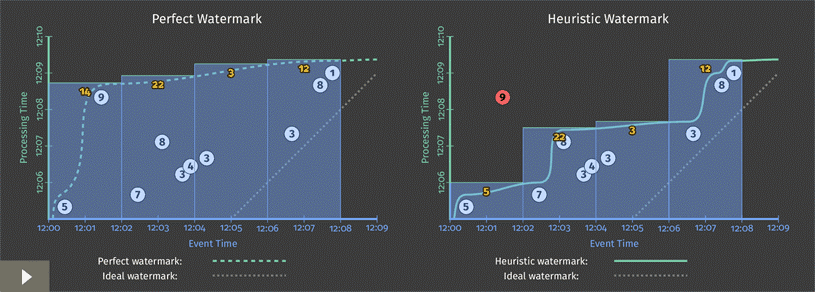

# The world beyond batch: Streaming 102

> 术语
>
> 1. Bounded data： 有穷数据
> 2. Unbounded data：无穷数据
> 3. Pipeline：管道
> 4. ==transformation==：转换
> 5. windowing：窗口，分窗
> 6. pane ：窗格
> 7. observe
> 8. speculative

## 简介

欢迎回来！如果你错过了我上次的文章， [The world beyond batch: Streaming 101](https://www.oreilly.com/ideas/the-world-beyond-batch-streaming-101)，我强烈建议你先花时间读读。那篇文章为本文讨论的主题奠定了必要的基础，我会假设你已经熟悉这里介绍的术语和概念。==读者们请知道这点==。

另外，请注意，这篇文章包含许多动画，所以尝试打印它们的人将会丢失一些最好的部分。打印机请知道这点 :haha:

免责声明结束，派对开始。 简要回顾一下，上次主要集中在三个方面：**精确定义术语**，比如像“Streaming”这样滥用术语的含义；**对比批处理系统和流式系统**，比较它们的理论能力，总结出只需要==完整性和时间工具==这两样东西，就可以让流式系统超越批处理系统；**分析了数据处理模式**，处理有界和无界数据时，批处理系统和流系统使用的基本方法。

在本文中，我想以具体的例子，通过更多的细节，深入分析上次讲过的数据理模式。主要分为两部分：

- Streaming 101 重温：简要介绍Streaming 101中引入的概念，并增加了一个运行的例子来突出显示要点。
- Streaming 102：Streaming 101的姊妹篇，详细介绍了处理无穷数据时其它的重要概念，并继续使用具体示例作为解释它们的工具。

本文覆盖的核心原则和概念，即，==推论时间的工具==，用于处理乱序数据，它们让流式系统真正超越批处理系统。

为了让读者理解这些概念在实战中的使用方式，我将利用Dataflow SDK中的代码片段（即Google Cloud Dataflow的API），再加上动画来可视化地表示。使用Dataflow SDK，而不用人们更熟悉的系统，比如Spark Streaming或Storm，是因为现在，其他系统无法表达本文涉及的所有例子。好消息是它们正朝着这个方向发展。更好的消息是，我们（Google）今天向Apache软件基金会提交了一项建议，以创建一个Apache Dataflow孵化器项目（与data Artisans，Cloudera，Talend等几家公司合作），希望能够基于Dataflow模型，围绕其强大的**乱序处理语义**，构建 一个开放的社区和生态系统。这应该会让2016年变得非常有趣，好吧，我有点离题。

抱歉，本文缺少了比较部分，我上次承诺过，但我错误地低估^[1]^了我想在本文包含的内容，以及完成的时间。现在，我不能再拖了，也不能为了它扩充更多的内容。如果要算安慰，我最终在2015年新加坡Strata + Hadoop World 大会上发表了一个演讲，标题是『[大规模数据处理的演进](http://conferences.oreilly.com/strata/big-data-conference-sg-2015/public/schedule/detail/44947)』（在[2016年6月的Strata + Hadoop World 的大会上](https://www.youtube.com/watch?v=9J_cWustI-A)也有更新），很多我想在比较部分中讨论的材料，都涵盖其中，幻灯片很漂亮，可为你提供阅读乐趣。内容不完全一样，但可以肯定的是，有干货。

现在，到流处理了。

## 回顾和展望

在Streaming 101中，我首先澄清了一些术语。以区分有穷数据和无穷数据开始：有穷数据源的数据量有限，常称为“批量”数据；无穷数据源则可能有无限数据量，常称为“流式”数据。涉及到数据源时，我尝试避免使用术语批量和流式，因为它们带有一些误导性的含义，且常有限制。

接着，我定义了批处理引擎和流式处理引擎的区别：批处理引擎的设计只考虑了有穷数据，而流式处理引擎则是针对无穷数据设计。我的目标是在引用执行引擎时才使用术语批处理和流式处理。

澄清完术语之后，我介绍了两个重要的基本概念，与处理无穷数据有关。我首先建立了事件时间（事件发生的时间）和处理时间（在处理过程中观察到事件的时间）之间的关键区别。这为Streaming 101中的一个==主要论题==提供了基础：如果你关心正确性和事件发生的上下文，你必须基于数据自带的事件时间，而不能以分析过程中处理数据时的时间（即处理时间）来分析数据。

接下来，我引入了分窗的概念（沿着时间边界划分数据集），==理论上==，无穷数据源可能永远不会结束，因此这是处理无穷数据源一种常用的方法。较为简单的分窗策略是固定窗口和滑动窗口，但更复杂的窗口类型，例如Session窗口（其中窗口由数据本身的特征定义，例如捕获每个用户的活动Session，如果用户随后不活动**==的间隙达到某个阀值，则Session结束==**）也有广泛的用途。

除了这两个，本文又多出三个概念：

- **水位**（Watermark）：**水位是在事件时间维度表示输入完整性的概念**。水位的值是X，表示的意思是“所有事件时间小于X的输入数据，都已经被观察到”。因此，当观察没有已知结束点的无穷数据源时。
- **触发器**（Trigger）：**触发器作为一种机制，用于声明在怎样的外部信号下，窗口应该有输出**。触发器提供了选择何时输出的灵活性。这也使得，随着时间的推移，窗口可能会输出多次。这反过来又打开了完善结果的大门，这样可以在数据到达时就提供一个猜测性的结果，随后当上游数据发生改变（有修订），或者相对于当前水位延迟的数据到达时（例如，移动的场景，在手机离线时记录各种动作及其对应的事件时间，恢复连接后再继续上载这些事件以便进行处理），==再输出完善后的结果==。
- **累积**（Accumulation）：**累积模式指定了同一窗口多次输出的关系**。<u>这些输出结果可能完全不相关（即随着时间的推移代表独立的变化），或者可能存在重叠。</u> 不同的累积模式具有不同的语义和与之相关的成本，因此要找到适用于自身场景的累计模式。


最后，为了更容易理解这些概念之间的关系，我们将回答四个==不同维度的==问题，借此重新审视旧的，并同时探索新的内容，对于处理无穷数据时遇到的每一个难题，每个维度都至关重要：

- ***What***：计算逻辑是**什么**？这个问题由管道内**transformation**的类型来回答，包括计算总和，构建直方图，训练机器学习模型等。这也基本上是传统批处理引擎要回答的问题。
- ***Where***：计算**什么时候**（事件时间维度上）的数据？这个问题通过在管道中使用基于事件时间的窗口来回答。包括Streaming 101中的常规窗口示例（固定窗口、滑动窗口，Session窗口），似乎不存在窗口概念的场景（例如，Streaming 101中描述的与时间无关的场景，传统批处理一般也属于此类），和其他更复杂的窗口类型，例如限时拍卖。还要注意，如果将记录进入系统时的处理时间作为其事件时间，那么窗口就是基于处理时间的。
- ***When***：在**什么时候**（处理时间维度上）进行计算，并输出结果？这个问题由水位和触发器来回答。这个主题有无限的变化，但是最常见的模式是，对于给定窗口，使用水位来描述其输入完成度，使用触发器允许输出早期结果（在窗口的输入结束之前，输出猜测性的，或者部分结果）和处理晚到的数据并输出晚期结果（在水位仅仅是窗口输入完整性估计的情况下，对于给定窗口，即使水位声明该窗口的输入已经结束，仍然可能会有更多的数据进入该窗口）。
- ***How***：**如何**细化**窗口多次输出**的结果？这个问题由用到的累积类型来回答：**丢弃**（每次输出的结果独立且不相关），**累积**（后续的结果建立在先前的结果上），或**累积且回收**（输出累积值，并回收上次触发时输出的结果）。

本文后面的文章中将会详细地讨论这些问题。是的，我将在本文中一直使用这种==配色方案==，试图让大家清楚地知道哪些概念与What / Where / When / How 中的哪个问题有关。不用谢<眨眼笑/>^[2]^。

### Streaming 101 重温

首先，我们来回顾一下Streaming 101中提出的一些概念，但是这次多了一些详细的例子，有助于使这些概念更加具体。

#### *What*：转换

传统批处理使用转换回答“计算逻辑是**什么**？”这个问题。尽管许多人可能早就熟悉，但我们还是从传统的批处理开始，因为我们将以它为基础，逐步添加其他概念。

本节，我们看一个简单的例子：在一个由10个值组成的简单数据集上，按键值分组并求和。如果想稍微务实一点的话，你可以假设团队正在玩某种手机游戏，要为他们计算总分，需要将团队中个人成绩综合起来。可以想象，这也同样适用于计费和==使用监控==的场景。

为了使管道的定义更具体，每个示例将包含一段简短的Dataflow伪码片段。我有时会修改规则以使示例更加清晰，清除细节（比如没有引入具体的I / O 数据源）或简化名称（当前Java触发器的名称太TM冗长了，为了清晰起见，将使用更简单的名称）。除了这些小修改（大部分我在后记中有明确列举）之外，它几乎就是真正的Dataflow代码。稍后，我还将提供[代码走读的链接](https://cloud.google.com/dataflow/examples/gaming-example)，如果对类似例子感兴趣，可以自己可以编译和运行。

如果你至少熟悉Spark Streaming或Flink，那么理解Dataflow代码在做什么就要相对轻松些。为了让你速成，Dataflow有两个基本的原语：

- `PCollection`s，表示数据集（可能是海量数据集），可以并行执行转换（名字开头“P”的由来，即表示parallel）。
- `PTransform`s：应用于`PCollection`s，以创建新的`PCollection`s。`PTransform`s可以执行元素级别的转换，也可以把多个元素聚合到一起，或是其它`PTransform`s的复合组合。

*图1，转换的类型*

如果发现自己越发不能理解例子，或者只是想要查查参考手册，可以去看看[Dataflow Java SDK]()的官方文档。

对于我们的例子而言，假设从一个`PCollection <KV<String，Integer>>`开始，命名为`input`（即，包含字符串和整数的键/值对的`PCollection`，其中字符串类似于团队名称，整数是相应团队中的个人得分）。但构建真实管道时，可能从I / O源（如日志文件）读取数据以获得原始输入数据集（`PCollection <String>`），然后解析日志记录将其转换为相应的键/值对（`PCollection <KV <String，Integer >>`）。为了在第一个例子中清楚起见，我将包括所有这些步骤的伪码，但是在随后的例子中，我删除了I / O和解析部分。

因此从I / O源读取数据，解析出团队/分数这样的键/值对，并计算每队总分，这个简单管道的伪码如下：

```java
PCollection<String> raw = IO.read(...);
PCollection<KV<String, Integer>> input = raw.apply(ParDo.of(new ParseFn());
PCollection<KV<String, Integer>> scores = input.apply(Sum.integersPerKey());
// 代码清单1 求和管道。从I / O源读取键/值数据，其中字符串（例如，团队名称）作为键，
// 整数（例如，团队成员的得分）作为值。 然后将每个键的值相加在一起以产生输出
// 集合中每个键的总和（例如，团队的总得分）。
```

对于所有示例，会先分析构建管道的代码片段，然后用动画演示管道在具体数据集上的执行情况。更具体地说，管道的输入数据集有10条不同的记录，**一个键**（即每条记录的键一样）。你可以想象在真实的管道中，类似的操作将会在多台机器上并行执行，但对于示例而言，越简单越清晰。

每个动画在两个维度上绘制输入和输出：事件时间（X轴）和处理时间（Y轴）。这样，管道的处理进度从底部向上移动，且代表了当前真实的处理时间，如图中的白色粗线所示。输入用圆圈表示，圆圈内的数字表示该条记录的值。圆圈开始是灰色，一旦管道处理了某条记录，圆圈就会变色。

当管道处理记录时，会将其累积到管道的内部状态中，并最终输出聚合的结果。状态和输出由矩形表示，聚合值靠近顶部显示，矩形由事件时间和处理时间组成，其覆盖区域里的数值会被累积到结果中。对于列表1中的管道，在传统的批处理引擎上执行的效果如下图：
> 译注：
> 1. 这里贴出的是静态图像，要看动图请点击<u>动画</u>
> 2. 输出最终结果时，靠近顶部显示的聚合值会变色

 *图2，传统的批处理*，[动画](https://embedwistia-a.akamaihd.net/deliveries/3116f7c9159e25b3bd5ff05fa6a3adf1f53c6252/file.mp4)

由于是批处理管道，因此会将输入值累积在管道的中间状态中，直到看到所有的输入（顶部的绿色虚线处）才产生单个输出51。本例没有使用窗口转换，是对事件时间维度出现的所有值求和，因此，表示『状态和输出』的矩形覆盖了整个X轴。传统的批处理引擎无法处理无穷数据，因为不可能等到输入结束再计算，然而，无穷数据实际上永远不会结束。因此，我们需要窗口这一概念（在Streaming 101中引入）。这样，就要回答第二个问题：计算**什么时候**（事件时间维度上）的数据？现在，简要回顾一下窗口。

#### *Where*：窗口

如上次讨论的那样，分窗是沿着时间边界分割数据源的过程。 常见的分窗策略包括固定窗口，滑动窗口和Session窗口：

 *图3 分窗策略示例。 每个例子显示了三个不同的键，突出显示了对齐窗口（适用于所有数据）和不对齐窗口（适用于数据子集）之间的差异。 授权：Tyler Akidau，灵感来自Robert Bradshaw的插图。*

为了更好的理解窗口在实践中看起像啥，我们用『时长2分钟的固定窗口』切分整数求和的管道。使用Dataflow SDK，只需要简单地添加`Window.into`转换即可（==蓝色部分的文本==）：

```java
PCollection<KV<String, Integer>> scores = input
  .apply(Window.into(FixedWindows.of(Duration.standardMinutes(2))))
  .apply(Sum.integersPerKey());
//代码清单2：分窗求和的代码
```
回想一下，Dataflow为批处理和流式处理提供了统一模型，语义上，批处理只是流式处理的一个子集。因此，我们首先在机制更简单的批处理引擎上执行此管道，当我们切换到流式处理引擎时，==~~这会给我们一些直接比较的东西~~==。

 *图4. 在批处理引擎中执行分窗求和*，[动画](https://embedwistia-a.akamaihd.net/deliveries/c525f1a06e7cfd19e37001d7c47fe33454591cfe/file.mp4)

如前所述，在管道的内部状态中累积输入，直到消费完所有的输入之后产生输出。不过此时，不再是一个而是四个输出：每个『事件时间维度、时长2分钟的』窗口都有一个相关的输出。

至此，我们重新回顾了Streaming 101中引入的两个主要概念：事件时间和处理时间之间的关系，以及分窗。要想再进一步，就需要在管道中加入本节开头提到的新概念：水位，触发器和累积。Streaming 102出场。

## Streaming 102

刚才，在批处理引擎上执行带有窗口的管道。如果引擎能产生低延迟的结果且支持无穷数据源，那就理想了，切换到流式引擎是迈出了正确的一步。然而，批处理引擎知道每个窗口何时具有完整的输入（即，消费完有穷输入源所有数据的时刻），目前，我们缺乏确定无穷数据源输入完整性的实用方法。因此，引入水位。

### *When*: watermarks

“在什么时候（处理时间维度上）进行计算？”的前半部分答案是**水位**。在事件时间维度上，用时间表示输入完整性。换句话说，基于事件流中正被处理记录的事件时间（有穷或无穷数据源皆可，尽管对无穷数据源的用处更明显），用**水位**衡量系统进度和输入完整性 。

Recall this diagram from Streaming 101, slightly modified here, where I described the skew between event time and processing time as an ever-changing function of time for most real-world distributed data processing systems.

回忆一下Streaming 101中的这幅图，这里稍作修改，它描述了事件时间和处理时间之间的偏差，==在大多数真实世界分布式数据处理系统中==，这类偏差会随着时间不断变化。

*图5. 事件时间进度，偏差和水位*


That meandering red line that I claimed represented reality is essentially the watermark; it captures the progress of event time completeness as processing time progresses. Conceptually, you can think of the watermark as a function, F(P) -> E, which takes a point in processing time and returns a point in event time. (More accurately, the input to the function is really the current state of everything upstream of the point in the pipeline where the watermark is being observed: the input source, buffered data, data actively being processed, etc.; but conceptually, it’s simpler to think of it as a mapping from processing time to event time.) That point in event time, E, is the point up to which the system believes all inputs with event times less than E have been observed. In other words, it’s an assertion that no more data with event times less than E will ever be seen again. Depending upon the type of watermark, perfect or heuristic, that assertion may be a strict guarantee or an educated guess, respectively:

我声称的代表真实情况的那条蜿蜒的红线本质上就是水位，随着处理时间的推移，它捕获事件时间维度上输入完整性的进度。概念上，可以将水位视为函数`F(P)->E`，传入处理时间维度上的变量，返回事件时间维度上的值（更准确地说，为了返回管道下游当前的水位，函数的输入实际上是上游当前的状态：输入源，缓冲数据，正在处理的数据等；但在概念上，将其视为从处理时间到事件时间的映射更为简单）。事件时间维度上的这个值，`E`，表示系统认为事件时间小于`E`的所有输入都已经被观察到。换个角度，这表示系统**断言**不会再看到事件时间少于`E`的数据。根据水位是完美型还是启发式，断言可能会有严格的保障或只是凭经验所作的猜测。

- **Perfect watermarks**: In the case where we have perfect knowledge of all of the input data, it’s possible to construct a perfect watermark; in such a case, there is no such thing as late data; all data are early or on time.
- **完美型水位**：在我们完全了解所有输入数据的情况下，可以构建完美型水位，此时，不存在延迟数据，所有数据要么早到，要么准时。
- **Heuristic watermarks**: For many distributed input sources, perfect knowledge of the input data is impractical, in which case the next best option is to provide a heuristic watermark. Heuristic watermarks use whatever information is available about the inputs (partitions, ordering within partitions if any, growth rates of files, etc.) to provide an estimate of progress that is as accurate as possible. In many cases, such watermarks can be remarkably accurate in their predictions. Even so, the use of a heuristic watermark means it may sometimes be wrong, which will lead to late data. We’ll learn about ways to deal with late data in the triggers section below.
- **启发式水位**：对于许多分布式输入源，完全了解输入数据是不切实际的，此时最好的选择就是提供启发式水位。为了尽可能准确地估计进度，所有关于输入的可用信息（分区，分区内的排序，文件的增长率等），启发式水位都会利用。许多情况下，这样的预估可以非常准确。即便如此，使用启发式水位意味有时可能出错，因此会出现延迟数据。我们将在后面触发器那节中了解如何处理延迟数据。


Watermarks are a fascinating and complex topic, with far more to talk about than I can reasonably fit here or in the margin, so a further deep dive on them will have to wait for a future post. For now, to get a better sense of the role that watermarks play as well as some of their shortcomings, let’s look at two examples of a streaming engine using watermarks alone to determine when to materialize output while executing the windowed pipeline from Listing 2. The example on the left uses a perfect watermark; the one on the right uses a heuristic watermark.

水位是一个令人着迷和复杂的话题，有太多的内容可以讨论，一篇文章根本不够，因此，对它们进一步深入的了解将不得不等待未来的文章。现在，为了更好地了解水位的作用以及它们缺点，我们来看看两个例子，执行列表2中定义了窗口的管道，流式引擎仅仅使用水位以确定何时实现输出，左边的例子使用完美型水位，右边的例子使用启发式水位。

 *图6. 在流式处理引擎中执行分窗求和，左边使用完美型水位，右边使用启发式水位*，[动画](https://embedwistia-a.akamaihd.net/deliveries/29b524c8d427de5db2b7e80d4e0964bcfa546ab8/file.mp4)

In both cases, windows are materialized as the watermark passes the end of the window. The primary difference between the two executions is that the heuristic algorithm used in watermark calculation on the right fails to take the value of 9 into account, which drastically changes the shape of the watermark^[3]^. These examples highlight two shortcomings of watermarks (and any other notion of completeness), specifically that they can be:

两种情况下，当水位通过窗口末尾时，输出窗口结果。两次执行的主要区别是：右侧的启发式算法计算水位时没有考虑9，从而大大改变了水位的形状^[3]^。这些例子突出了水印（以及任何其他完整性概念）的两个缺点，具体是：

- Too slow: When a watermark of any type is correctly delayed due to known unprocessed data (e.g., slowly growing input logs due to network bandwidth constraints), that translates directly into delays in output if advancement of the watermark is the only thing you depend on for stimulating results.

  This is most obvious in the left diagram, where the late arriving 9 holds back the watermark for all the subsequent windows, even though the input data for those windows become complete earlier. This is particularly apparent for the second window, [12:02, 12:04), where it takes nearly seven minutes from the time the first value in the window occurs until we see any results for the window whatsoever. The heuristic watermark in this example doesn’t suffer the same issue quite so badly (five minutes until output), but don’t take that to mean heuristic watermarks never suffer from watermark lag; that’s really just a consequence of the record I chose to omit from the heuristic watermark in this specific example.

  The important point here is the following: while watermarks provide a very useful notion of completeness, depending upon completeness for producing output is often not ideal from a latency perspective. Imagine a dashboard that contains valuable metrics, windowed by hour or day. It’s unlikely you’d want to wait a full hour or day to begin seeing results for the current window; that’s one of the pain points of using classic batch systems to power such systems. Instead, it’d be much nicer to see the results for those windows refine over time as the inputs evolve and eventually become complete.

- **太慢**：当任何类型的水位由于已知的未处理数据而被正确地延迟时（例如，由于网络带宽限制而缓慢导入的输入日志），如果系统仅仅依靠水位的提升来输出结果，那么将直接转换为输出延迟。

  这在左图中最明显，延迟抵达的9阻碍了水位的前进，因此，即使后续窗口的输入数据早就完整，也不能及时输出结果。这对于第二个窗口[12:02，12:04)尤其明显，从窗口中的第一个值发生到我们看到窗口结果，耗时将近7分钟。这个例子中，启发式水位的延迟没那么严重（从窗口中的第一个值发生到我们看到窗口结果，耗时5分钟），但不要认为这意味着启发式算法不会滞后，在这个特定的例子中，是我选择忽略的记录才导致了这样的结果。

  这里的重点是：水位位输入完整性提供了一个非常有用的概念，但是依赖完整性产生输出，从延迟的角度来看通常不是很理想。设想一个仪表板，包含了有价值的指标，按小时或天分窗显示。不可能说等待一整个小时或者一整天，才能看到当前窗口的结果，而这正是传统批处理系统的痛点之一。相反，随着时间的推移，窗口的结果随着输入的变化而逐渐完善，将会更好一些。

- Too fast: When a heuristic watermark is incorrectly advanced earlier than it should be, it’s possible for data with event times before the watermark to arrive some time later, creating late data. This is what happened in the example on the right: the watermark advanced past the end of the first window before all the input data for that window had been observed, resulting in an incorrect output value of 5 instead of 14. This shortcoming is strictly a problem with heuristic watermarks; their heuristic nature implies they will sometimes be wrong. As a result, relying on them alone for determining when to materialize output is insufficient if you care about correctness.

- **太快**：当启发式水位错误地前进，早于它应该处于的位置，那么，水位之前的数据仍可能出现，这导致延迟数据。右边的例子就是一例：在观察到第一个窗口的所有输入数据之前，水位就已通过了该窗口，导致输出错误的结果5而不是14。这个缺点严格说来就是启发式水位的问题，启发式的本质意味着总有出错的时候。因此，如果你关心正确性，单独依靠启发式水位，确定何时输出结果是不够的。

In Streaming 101, I made some rather emphatic statements about notions of completeness being insufficient for robust out-of-order processing of unbounded data streams. These two shortcomings, watermarks being too slow or too fast, are the foundations for those arguments. You simply cannot get both low latency and correctness out of a system that relies solely on notions of completeness. Addressing these shortcomings is where triggers come into play.

在Streaming 101中，我强调完整性的概念并不足以处理无穷数据流中的乱序。这两个缺点，水位太慢或太快，是这些论据的基础。如果系统只依赖于完整性的概念，那么无法同时满足低延迟和正确性。解决这些缺点是触发器发挥作用的地方。

### *When*: ==触发器的奇妙之处是触发器是奇妙的东西!==

Triggers are the second half of the answer to the question: “When in processing time are results materialized?” Triggers declare when output for a window should happen in processing time (though the triggers themselves may make those decisions based off of things that happen in other time domains, such as watermarks progressing in the event time domain). Each specific output for a window is referred to as a pane of the window.

触发器是“在**什么时候**（处理时间维度上）进行计算？”的==答案的后半部分==，触发器声明窗口应在何时（处理时间维度，但触发器自身可以根据发生在其他时间维度的事情做出触发决定，例如，在事件时间维度上，水位前进了）输出结果。窗口的每个特定输出被称之为窗口的一个窗格。

Examples of signals used for triggering include:

触发信号的例子包括：

- Watermark progress (i.e., event time progress), an implicit version of which we already saw in Figure 6, where outputs were materialized when the watermark passed the end of the window^[4]^. Another use case is triggering garbage collection when the lifetime of a window exceeds some useful horizon, an example of which we’ll see a little later on.
- **水位进度（即，事件时间进度）**，我们已经在图6中看到的一个隐式版本，当水位通过窗口时，输出结果^[4]^。另一个使用水位进度的场景是，当窗口的生命周期超出一定的范围，触发垃圾回收，稍后我们将看到一个例子。
- Processing time progress, which is useful for providing regular, periodic updates since processing time (unlike event time) always progresses more or less uniformly and without delay.
- **处理时间进度**，对于提供周期性更新是有用的，因为处理时间（不像事件时间）总是大致均匀地进行，而不会延迟。
- Element counts, which are useful for triggering after some finite number of elements have been observed in a window.
- **元素数量**，用于在窗口中观察到一定数量的元素后触发。
- Punctuations, or other data-dependent triggers, where some record or feature of a record (e.g., an EOF element or a flush event) indicates that output should be generated.
- **特殊标记或者其它数据依赖的触发器**，某些记录或者记录的某个标记（例如，EOF元素或者表示刷新的事件）指示系统应该输出结果。

In addition to simple triggers that fire based off of concrete signals, there are also composite triggers that allow for the creation of more sophisticated triggering logic. Example composite triggers include:

除了基于具体信号触发的简单触发器，你还可以创建组合触发器，获得更复杂的触发逻辑。复合触发器的例子有：

- Repetitions, which are particularly useful in conjunction with processing time triggers for providing regular, periodic updates.
- 重复，特别有用于和处理时间触发器一起提供有规律的定期更新。
- Conjunctions (logical AND), which fire only once all child triggers have fired (e.g., after the watermark passes the end of the window AND we observe a terminating punctuation record).
- 逻辑与（联合），所有子触发器满足条件时，只触发一次（例如，水印通过通过窗口尾端，并且，观察到一个终止符号记录）。
- Disjunctions (logical OR), which fire after any child triggers fire (e.g., after the watermark passes the end of the window OR we observe a terminating punctuation record).
- 逻辑或（析取），任一子触发器满足条件时触发（例如，水印通过通过窗口尾端，或者，观察到一个终止符号记录）。
- Sequences, which fire a progression of child triggers in a predefined order.
- 序列，以预定义的顺序，子触发器依次触发。

To make the notion of triggers a bit more concrete (and give us something to build upon), let’s go ahead and make explicit the implicit default trigger used in Figure 6 by adding it to the code from Listing 2:

为了稍微具体化触发器的概念（以便后续基于此构建更复杂的触发器），我们在图6的基础上修改，把图6隐含使用的默认触发器明确地写出来，将其添加到列表2的代码中：

```java
PCollection<KV<String, Integer>> scores = input
  .apply(Window.into(FixedWindows.of(Duration.standardMinutes(2)))
               .triggering(AtWatermark()))
  .apply(Sum.integersPerKey());
//Listing 3. Explicit default trigger.
```
With that in mind, and a basic understanding of what triggers have to offer, we can look at tackling the problems of watermarks being too slow or too fast. In both cases, we essentially want to provide some sort of regular, materialized updates for a given window, either before or after the watermark advances past the end of the window (in addition to the update we’ll receive at the threshold of the watermark passing the end of the window). So, we’ll want some sort of repetition trigger. The question then becomes: what are we repeating?

记住这一点，以及对触发器的基本理解，我们可以研究解决水位过慢或过快的问题。两种情况下，基本的想法是，对于一个给定的窗口，无论是在水位通过窗口的尾端之前还是之后，以某种形式提供有规律的更新（除了更新，我们将收到水位通过窗口尾端的消息）。因此，我们需要重复触发。现在问题就变成了：我们在重复什么？

In the too slow case (i.e., providing early, speculative results), we probably should assume that there may be a steady amount of incoming data for any given window since we know (by definition of being in the early stage for the window) that the input we’ve observed for the window is thus far incomplete. As such, triggering periodically when processing time advances (e.g., once per minute) is probably wise because the number of trigger firings won’t be dependent upon the amount of data actually observed for the window; at worst, we’ll just get a steady flow of periodic trigger firings.

太慢的场景（即，提供早期猜测性的结果），对于任意给定的窗口，应该可以假设它有稳定的输入数据，因为我们知道（根据定义，窗口处于早期阶段）离输入结束还为时尚早。因此，随着处理时间的前进，周期性（例如，每分钟一次）触发或许是明智的，因为触发的数量并不依赖于实际观察到的数据量，在最坏的情况下，我们只会得到稳定的定时触发消息流。

In the too fast case (i.e., providing updated results in response to late data due to a heuristic watermark), let’s assume our watermark is based on a relatively accurate heuristic (often a reasonably safe assumption). In that case, we don’t expect to see late data very often, but when we do, it’d be nice to amend our results quickly. Triggering after observing an element count of 1 will give us quick updates to our results (i.e., immediately any time we see late data), but is not likely to overwhelm the system given the expected infrequency of late data.

太快的场景（即，由于启发式水位会产生延迟数据，需要为延迟时间提供更新后的结果）。假设我们的启发式水位相对比较准确（通常是一个相当安全的假设）。在这种情况下，我们预计不会频繁看到延迟数据，但是如果我们这么做，最好能快速更新结果。即观察到1个元素就触发，使得我们可以快速更新结果（观察到延迟数据后立即触发），考虑到预期的延迟数据并不频繁，触发消息不太可能淹没系统。

Note that these are just examples: we’re free to choose different triggers (or to choose not to trigger at all for one or both of them) if appropriate for the use case at hand.

注意，上面只是示例：我们可以根据实际情况选择不同的触发器（也可以选择在上述两种场景下都不触发，或者只在一种场景下触发）。

Lastly, we need to orchestrate the timing of these various triggers: early, on-time, and late. We can do this with a `Sequence` trigger and a special `OrFinally` trigger, which installs a child trigger that terminates the parent trigger when the child fires.

最后，我们需要好好规划各种触发器触发的时机：早期（），准时（）和晚期（）。我们可以使用`Sequence`触发器和特殊的`OrFinally`触发器来完成。`OrFinally`作为子触发器，触发之后会终止其父触发器。

```java
PCollection<KV<String, Integer>> scores = input
  .apply(Window.into(FixedWindows.of(Duration.standardMinutes(2)))
               .triggering(Sequence(
                 Repeat(AtPeriod(Duration.standardMinutes(1)))
                   .OrFinally(AtWatermark()),
                 Repeat(AtCount(1))))
  .apply(Sum.integersPerKey());
//Listing 4. Manually specified early and late firings.
```
However, that’s pretty wordy. And given that the pattern of repeated-early | on-time | repeated-late firings is so common, we provide a custom (but semantically equivalent) API in Dataflow to make specifying such triggers simpler and clearer:

不过这相当烦琐。考虑到，早期重复触发|准时触发一次|晚期重复触发，这样的模式很常见，Dataflow提供了一个自定义API（语义等价），可以更加简单清晰地声明这样的触发器。

```java
PCollection<KV<String, Integer>> scores = input
  .apply(Window.into(FixedWindows.of(Duration.standardMinutes(2)))
               .triggering(
                 AtWatermark()
                   .withEarlyFirings(AtPeriod(Duration.standardMinutes(1)))
                   .withLateFirings(AtCount(1))))
  .apply(Sum.integersPerKey());
//Listing 5. Early and late firings via the early/late API.
```
Executing either Listing 4 or 5 on a streaming engine (with both perfect and heuristic watermarks, as before) then yields results that look like this:

在流式引擎上执行代码清单4或5（像以前一样，左边完美型水位，右边启发式水印位），产生的结果看起来像这样：

 *图7.*，[动画](https://embedwistia-a.akamaihd.net/deliveries/a956f3a2e3da28718444e303672bfebf450b3437/file.mp4)

This version has two clear improvements over Figure 6:

- For the “watermarks too slow” case in the second window, [12:02, 12:04): we now provide periodic early updates once per minute. The difference is most stark in the perfect watermark case, where time-to-first-output is reduced from almost seven minutes down to three and a half; but it’s also clearly improved in the heuristic case as well. Both versions now provide steady refinements over time (panes with values 7, 14, then 22), with relatively minimal latency between the input becoming complete and materialization of the final output pane for the window.
- For the “heuristic watermarks too fast” case in the first window, [12:00, 12:02): when the value of 9 shows up late, we immediately incorporate it into a new, corrected pane with value of 14.

这个版本有==两个明显的提高超过图6==：

- 对于[12:02, 12:04)这个窗口水位太慢的问题：我们现在提供每分钟一次的早期更新。完美型水位的差异最显著，第一次输出的时间从近七分钟下降到三分钟半，启发式水位也有明显提高。现在，随着时间的推移，两种水位都能持续完善输出结果（窗格值7，14，然后22），在输入逐步完整的过程中，提供相对最实时的输出结果。
- 对于[12:00, 12:02)这个窗口，启发式水位太快的问题：当值9最后出现，我立即将它纳入一个新的窗格，修正后值为14。

One interesting side effect of these new triggers is that they effectively normalize the output pattern between the perfect and heuristic watermark versions. Whereas the two versions in Figure 6 were starkly different, the two versions here look quite similar.

这些新触发器有个有趣的副作用，它事实上规范了完美型水位和启发式水印的输出模式。图6两种水位的执行结果截然不同，而这里看起来很相似。

The biggest remaining difference at this point is window lifetime bounds. In the perfect watermark case, we know we’ll never see any more data for a window once the watermark has passed the end of it, hence we can drop all of our state for the window at that time. In the heuristic watermark case, we still need to hold on to the state for a window for some amount of time to account for late data. But as of yet, our system doesn’t have any good way of knowing just how long state needs to be kept around for each window. That’s where allowed lateness comes in.

剩下的最大差异是在窗口的生命周期结束的时刻，使用完美型水位，我们知道一旦水位通过窗口的尾部，窗口就不会再有任何输入数据，因此可以丢弃窗口的所有状态。而使用启发式水位，为了计算延迟数据，我们仍需要在相当一段时间内保存内部状态。但目前为止，系统还没有方法知道每个窗口需要保存多长时间。这就是需要引入允许延迟的地方。

### *When*:  允许的延迟（即，垃圾回收）

Before moving on to our last question (“How do refinements of results relate?”), I’d like to touch on a practical necessity within long-lived, out-of-order stream processing systems: garbage collection. In the heuristic watermarks example in Figure 7, the persistent state for each window lingers around for the entire lifetime of the example; this is necessary to allow us to appropriately deal with late data when/if they arrive. But while it’d be great to be able to keep around all of our persistent state until the end of time, in reality, when dealing with an unbounded data source, it’s often not practical to keep state (including metadata) for a given window indefinitely; we’ll eventually run out of disk space.

进入最后一个问题（如何细化窗口多次输出的结果？）之前，我想先谈谈垃圾回收，这是处理乱序流的系统长期运行的必备工具。图7的启发式水位示例，在管道执行的整个生命周期内，会一直保存每个窗口的持久化状态。这是必要的，只有这样，当（或如果）延迟的数据到达时，才能做正确地处理。尽管保存状态到管道执行结束很酷，但实际上处理无穷数据源时，一直保存给定窗口的状态（包括元数据）通常不切实际，最终会用尽磁盘空间。

As a result, any real-world, out-of-order processing system needs to provide some way to bound the lifetimes of the windows it’s processing. A clean and concise way of doing this is by defining a horizon on the allowed lateness within the system—i.e., placing a bound on how late any given record may be (relative to the watermark) for the system to bothers processing it; any data that arrive after this horizon are simply dropped. Once you’ve bounded how late individual data may be, you’ve also established precisely how long the state for windows must be kept around: until the watermark exceeds the lateness horizon for the end of the window[5]. But in addition, you’ve also given the system the liberty to immediately drop any data later than the horizon as soon as they’re observed, which means the system doesn’t waste resources processing data that no one cares about.

因此，现实中处理乱序的系统都需要提供一些方法来约束窗口的生命周期。整洁简练实现这一点的方法是，在允许延迟的系统内定义一个界限。为任意给定的记录，设置一个可以延迟多久的区间（相对于水位），以便系统处理它。超过这个区间到达的任何数据，系统只需简单地丢弃。一旦你定义了单个数据可延迟的区间，你就精确地确定了窗口的状态必须保持多久，即水位超过窗口尾部的延迟区间^[5]^。但除此之外，你也给了系统丢弃延迟数据的自由，即观察到延迟数据就可以立即丢弃，这意味着系统不会浪费资源，处理没有人关心的数据。

Since the interaction between allowed lateness and the watermark is a little subtle, it’s worth looking at an example. Let’s take the heuristic watermark pipeline from Listing 5/Figure 7 and add a lateness horizon of one minute (note that this particular horizon has been chosen strictly because it fits nicely into the diagram; for real-world use cases, a larger horizon would likely be much more practical):

由于允许的延迟和水位之间的相互作用==有点微妙==，值得看一看例子。我们给代码清单5/图7中启发式水位的管道，加上一分钟的延迟区间（请注意，这个特别选定的小区间能很好地在图中演示，真实场景下，更大的延迟区间可能更实用）：

```java
PCollection<KV<String, Integer>> scores = input
  .apply(Window.into(FixedWindows.of(Duration.standardMinutes(2)))
               .triggering(
                 AtWatermark()
                   .withEarlyFirings(AtPeriod(Duration.standardMinutes(1)))
                   .withLateFirings(AtCount(1)))
               .withAllowedLateness(Duration.standardMinutes(1)))
  .apply(Sum.integersPerKey());
//Listing 6. Early and late firings with allowed lateness.
```

The execution of this pipeline would look something like Figure 8 below, where I’ve added the following features to highlight the effects of allowed lateness:

这个管道看起来像图8演示的那样执行，在这里我添加了以下功能以突出延迟区间的影响：

The thick white line denoting the current position in processing time is now annotated with ticks indicating the lateness horizon (in event time) for all active windows.

为所有的活动窗口，在表示当前处理时间的白色粗线上，加上记号标志其允许的延迟区间（在事件时间维度）。

Once the watermark passes the lateness horizon for a window, that window is closed, which means all state for the window is discarded. I leave around a dotted rectangle showing the extent of time (in both domains) that the window covered when it was closed, with a little tail extending to the right to denote the lateness horizon for the window (for contrasting against the watermark).

一旦水位通过窗口允许的延迟区间，该窗口即被关闭，这意味着窗口所有的状态可被丢弃。窗口关闭时，我保留了一个虚线矩形显示它覆盖的时间范围（在两个时间维度上），有一个小尾巴延伸到右边表示窗口允许的延迟区间（用于和水位对比）。

For this diagram only, I’ve added an additional late datum for the first window with value 6. The 6 is late, but still within the allowed lateness horizon, so it gets incorporated into an updated result with value 11. The 9, however, arrives beyond the lateness horizon, so it is simply dropped.

只在这幅图为第一个窗口增加了一个额外的延迟数据6。尽管数据6延迟了，但仍在允许的延迟区间内，所以它被纳入更新，输出结果11。然而，数值9到达时，超出了延迟区间，因此简单地丢弃。

 *图8 Windowed summation on a streaming engine with early and late firings and allowed lateness.*，[动画](https://embedwistia-a.akamaihd.net/deliveries/0fe570080208aa6b0b2a44790a95813e08889fdc/file.mp4)

Two final side notes about lateness horizons:

- To be absolutely clear, if you happen to be consuming data from sources for which perfect watermarks are available, then there’s no need to deal with late data, and an allowed lateness horizon of zero seconds will be optimal. This is what we saw in the perfect watermark portion of Figure 7.

- One noteworthy exception to the rule of needing to specify lateness horizons, even when heuristic watermarks are in use, would be something like computing global aggregates over all time for a tractably finite number of keys (e.g., computing the total number of visits to your site over all time, grouped by Web browser family). In this case, the number of active windows in the system is bounded by the limited keyspace in use. As long as the number of keys remains manageably low, there’s no need to worry about limiting the lifetime of windows via allowed lateness.

关于允许的延迟区间，最后两点注解：

- 非常明确，如果你消费的数据源，碰巧支持完美型水位，那么就没有处理延迟数据的必要，延迟区间设置为零秒最优。正如图7所示（见左边完美型水位的示例）。
- 值得一提的是，即使是启发式水位的场景，需要指定延迟区间，==随着时间推移，计算有限数量键值的聚合值是一个例外==（例如按Web浏览器家族分组，计算站点的访问总数）。这种情况下，系统中活动窗口的数量受限于有限的键值空间。只要需要维护的键值数量很少，就不必通过允许的延迟来限制窗口的生命周期。

Practicality sated, let’s move on to our fourth and final question.

垃圾回收讲完，继续讨论第四个，也是最后一个问题。

### How：累计模式

When triggers are used to produce multiple panes for a single window over time, we find ourselves confronted with the last question: “How do refinements of results relate?” In the examples we’ve seen so far, each successive pane built upon the one immediately preceding it. However, there are actually three different modes of accumulation[6]:

使用触发器，随着时间推移，一个窗口生成多个窗格后，我们将面临最后一个问题：如何细化窗口多次输出的结果？在迄今为止我们看到的所有例子中，后续的窗格总是基于其前面一个窗格构建。不过，实际上有三种不同的累积方式^[6]^：

- **Discarding**: Every time a pane is materialized, any stored state is discarded. This means each successive pane is independent from any that came before. Discarding mode is useful when the downstream consumer is performing some sort of accumulation itself—e.g., when sending integers into a system that expects to receive deltas that it will sum together to produce a final count.
- **丢弃**：每次实体化窗格时，丢弃所有的中间状态。这意味着后续窗格和其前面的窗格相互独立。丢弃模式用于下游用户自身会执行某种累积操作时（例如求和），==发送这意味着数增量即可，系统自己相加以产生最后的结果==。
- **Accumulating**: As in Figure 7, every time a pane is materialized, any stored state is retained, and future inputs are accumulated into the existing state. This means each successive pane builds upon the previous panes. Accumulating mode is useful when later results can simply overwrite previous results, such as when storing output in a key/value store like BigTable or HBase.
- **累积**：如图7每次实体化窗格时，仍然保留中间状态，后续的输入也会被累积到现有的状态中去。这意味着后续的窗格基于其前面的窗格构建。累积模式用于后面的结果可以简单地覆盖以前的结果，例如，将输出存入像Bigtable或HBase这样的键值存储中。
- **Accumulating & retracting:** Like accumulating mode, but when producing a new pane, also produces independent retractions for the previous pane(s). Retractions (combined with the new accumulated result) are essentially an explicit way of saying, “I previously told you the result was X, but I was wrong. Get rid of the X I told you last time, and replace it with Y.” There are two cases where retractions are particularly helpful:
- **累积且回收**：类似于累积模式，但是每次产生新窗格时，同时为前面的窗格产生独立的回收值。回收（并结合新累积的结果）本质上是明确表达，‘’我以前告诉你结果是X，但我错了。把我上次告诉你的X去掉，用Y替换‘’。有两种场景，回收特别有帮助：
  - When consumers downstream are re-grouping data by a different dimension, it’s entirely possible the new value may end up keyed differently from the previous value, and thus end up in a different group. In that case, the new value can’t just overwrite the old value; you instead need the retraction to remove the old value from the oldgroup, while the new value is incorporated the new group.
  - 当下游消费者按不同的维度重新分组数据时，新值和旧值完全可能由于键值不同，因此最终被分到不同的组。这种情况下，新值不能只覆盖旧值，而是需要从旧组中移除旧值，再将新值将并入新组。
  - When dynamic windows (e.g., sessions, which we’ll look at more closely below) are in use, the new value may be replacing more than one previous window, due to window merging. In this case, it can be difficult to determine from the new window alone which old windows are being replaced. Having explicit retractions for the old windows makes the task straightforward.
  - 使用动态窗口（例如，Session，我们后面会再细看）时，由于窗口合并，新值可能会替代前面好几个窗口的值。这种情况下，只有新窗口的值，很难确定需要替换的老窗口。有旧窗口的回收值，可使得任务变简单。

The different semantics for each group are somewhat clearer when seen side-by-side. Consider the three panes for the second window in Figure 7(the one with event time range [12:02, 12:04)). The table below shows what the values for each pane would look like across the three supported accumulation modes (with Accumulating mode being the specific mode used in Figure 7):

并排对比每种模式，它们之间不同的语义会更加清晰。考虑图7中第二个窗口的三个窗格（事件时间范围[12:02，12:04））。 下表显示了三种累积模式下，每个窗格的值是多少（在图7的管道中使用三种特定的累积模式）：

 *表1. Comparing accumulation modes using the second window from Figure 7.*

- **Discarding**: Each pane incorporates only the values that arrived during that specific pane. As such, the final value observed does not fully capture the total sum. However, if you were to sum all the independent panes themselves, you would arrive at a correct answer of 22. This is why discarding mode is useful when the downstream consumer itself is performing some sort of aggregation on the materialized panes.
- **丢弃**：每个窗格仅包含当前窗格中到达的值。因此，观察到的最终值不能完全==捕获总和==。 但是，如果自己基于所有独立的窗格求和，将得到正确答案22。当实体化窗格，下游消费者自身会执行某种聚合操作时，是丢弃模式有用的场景。
- **Accumulating**: As in Figure 7, each pane incorporates the values that arrived during that specific pane, plus all the values from previous panes. As such, the final value observed correctly captures the total sum of 22. If you were to sum up the individual panes themselves, however, you’d effectively be double- and triple-counting the inputs from panes 2 and 1, respectively, giving you an incorrect total sum of 51. This is why accumulating mode is most useful when you can simply overwrite previous values with new values: the new value already incorporates all the data seen thus far.
- **累积**：如图7所示，每个窗格除包含当前窗格中到达的值，还会包含前面窗格中的所有值。因此，观察到的最终值正确地捕获了总和22。但是，如果你自己基于单个窗格求和，那么实际上对窗格2和1中的输入，分别进行了两次和三次重复计算，得到不正确的总和44。当你可以简单地用新值覆盖以前的旧值时，是积累模式是最有用的场景：此时，新值已经集成了迄今为止看到的所有数据。
- **Accumulating & retracting**: Each pane includes both a new accumulating mode value as well as a retraction of the previous pane’s value. As such, both the last (non-retraction) value observed as well as the total sum of all materialized panes (including retractions) provide you with the correct answer of 22. This is why retractions are so powerful.
- **累积和回收**：每个窗格都包含新的累积值以及前一个窗格累积值用于回收。因此，观察到的最后一个窗格的值（非回收）以及所有实体化窗格（包括回收）的总和，都为正确的答案22。这就是为什么回收如此强大的原因。

To see discarding mode in action, we would make the following change to Listing 5:
使用丢弃模式，需要对代码清单5做如下修改：

```java
PCollection<KV<String, Integer>> scores = input
  .apply(Window.into(FixedWindows.of(Duration.standardMinutes(2)))
               .triggering(
                 AtWatermark()
                   .withEarlyFirings(AtPeriod(Duration.standardMinutes(1)))
                   .withLateFirings(AtCount(1)))
               .discardingFiredPanes())
  .apply(Sum.integersPerKey());
//Listing 7. Discarding mode version of early/late firings.
```
Running again on a streaming engine with a heuristic watermark would produce output like the following:
在具有启发式水位的流式引擎上再次运行，将产生如下所示的输出：

 *图9 Discarding mode version of early/late firings on a streaming engine.*，[动画](https://embedwistia-a.akamaihd.net/deliveries/4a74df3fe91c2aeb1e77a96218c08c6d25fd7632/file.mp4)

While the overall shape of the output is similar to the accumulating mode version from Figure 7, note how none of the panes in this discarding version overlap. As a result, each output is independent from the others.

虽然输出的整体形状和图7中累积模式版本类似，但请注意，在这个丢弃版本中没有一个窗格重叠，因此每个窗格输出是独立的。

If we want to look at retractions in action, the change would be similar (note, however, that retractions are still in development for Google Cloud Dataflow at this point, so the naming in this API is somewhat speculative, though unlikely to differ wildly from what we end up shipping):

使用累积和回收模式，代码的修改类似（注意：目前还未实现，API可能会变）：

```java
PCollection<KV<String, Integer>> scores = input
  .apply(Window.into(FixedWindows.of(Duration.standardMinutes(2)))
               .triggering(
                 AtWatermark()
                   .withEarlyFirings(AtPeriod(Duration.standardMinutes(1)))
                   .withLateFirings(AtCount(1)))
               .accumulatingAndRetractingFiredPanes())
  .apply(Sum.integersPerKey());
//Listing 8. Accumulating & retracting mode version of early/late firings.
```
And run on a streaming engine, this would yield output like the following:
在流式引擎上运行，产生如下输出：

 *图10 Accumulating & retracting mode version of early/late firings on a streaming engine.*，[动画](https://embedwistia-a.akamaihd.net/deliveries/69dc164b3c205a742ee4fa663312dc5f74358cb5/file.mp4)

Since the panes for each window all overlap, it’s a little tricky to see the retractions clearly. The retractions are indicated in red, which combines with the overlapping blue panes to yield a slightly purplish color. I’ve also horizontally shifted the values of the two outputs within a given pane slightly (and separated them with a comma) to make them easier to differentiate.

由于窗口的窗格都重叠，因此不太容易看清楚回收的值，用红色显示它，蓝色的窗格覆盖其上产生略带紫颜色的效果。我也在窗格中向两边平移了两个输出值（用逗号分隔），使它们更容易区分。

Comparing the final frames of Figures 9, 7 (heuristic only), and 10 side-by-side provides a nice visual contrast of the three modes:
并排比较图9，图7（启发式水位）和图10的最后一帧，为对比这三种模式提供了很好的视觉效果：

 *图11 Side-by-side comparison of accumulation modes: discarding (left), accumulating (center), and accumulating & retracting (right).*，[动画]()

As you can imagine, the modes in the order presented (discarding, accumulating, accumulating & retracting) are each successively more expensive in terms of storage and computation costs. To that end, choice of accumulation mode provides yet another dimension for making tradeoffs along the axes of correctness, latency, and cost.

你可以想象，在存储和计算成本方面，按模式呈现的先后顺序（丢弃，累积，累积和收回）一个比一个更贵。为此，累积模式提供了另一个维度，用于在正确性，延迟和成本之间进行权衡。

## **转场插曲**

At this point, we’ve touched upon all four questions:

- *What* results are calculated? Answered via transformations.
- *Where* in event time are results calculated? Answered via windowing.
- *When* in processing time are results materialized? Answered via watermarks and triggers.
- *How* do refinements of results relate? Answered via accumulation modes.

However, we’ve really only looked at one type of windowing: fixed windowing in event-time. As you know from Streaming 101, there are a number of dimensions to windowing, two of which I’d like to visit before we call it day: fixed windowing in processing-time and session windowing in event-time.

至此，我们已经触及了所有四个问题：

- 计算逻辑是什么？由转换回答。

- 计算什么时候（事件时间维度上）的数据？由窗口回答
- 在什么时候（处理时间维度上）进行计算，并输出结果？由水位和触发器回答
- 如何细化窗口多次输出的结果？由聚合模式回答

不过，我们只看了一种类型的窗口：事件时间维度上的固定窗口。正如你所知道，Streaming 101中还有一些其它类型的窗口。今天要讨论的其中两个是：处理时间维度上的固定窗口和事件时间维度上的Session窗口。

## *When/Where*：处理时间窗口

Processing-time windowing is important for two reasons:
有两个原因，处理时间窗口很重要：

- For certain use cases, such as usage monitoring (e.g., Web service traffic QPS), where you want to analyze an incoming stream of data as it’s observed, processing-time windowing is absolutely the appropriate approach to take.
- 某些特定场景，像使用监控（例如，Web服务流量QPS），此时，以观察到数据进入系统的处理时间窗口来分析输流，是绝对适当的方法。
- For use cases where the time that events happened is important (e.g., analyzing user behavior trends, billing, scoring, etc), processing time windowing is absolutely the wrong approach to take, and being able to recognize these cases is critical.
- 对于发生事件时的时间很重要（例如，分析用户行为的趋势，计费，评分等）的情况，==至关重要的是，使用处理时间窗口，有助于识别出这是绝对错误的做法==。

As such, it’s worth gaining a solid understanding of the differences between processing-time windowing and event-time windowing, particularly given the prevalence of processing-time windowing in most streaming systems today.
因此值得深入了解处理时间窗口和事件时间窗口之间的差异，特别是考虑到，当今大多数流式系统普及的是处理时间窗口。

When working within a model, such as the one presented in this post, where windowing as a first-class notion is strictly event-time based, there are two methods one can use to achieve processing-time windowing:
在以窗口作为第一类概念的模型中，例如本文描述的模型，窗口严格基于事件时间。实现处理时间窗口有两种方法：

- **Triggers**: Ignore event time (i.e., use a global window spanning all of event time) and use triggers to provide snapshots of that window in the processing-time axis.
- **触发器**：忽略事件时间（即，使用全局窗口覆盖所有事件时间），使用触发器在处理时间维度上提供该窗口的快照。
- **Ingress time**: Assign ingress times as the event times for data as they arrive, and use normal event time windowing from there on. This is essentially what something like Spark Streaming does currently.
- **数据进入时间**：当数据到达时，指定进入时间作为其事件时间，此后使用正常的事件时间窗口。这基本上是Spark Streaming目前的做法。

Note that the two methods are more or less equivalent, although they differ slightly in the case of multi-stage pipelines: **in the triggers version**, each stage slices up the processing time “windows” independently, so for example, data in window X for one stage may end up in window X-1 or X+1 in the next stage; **in the ingress time version**, once a datum is incorporated into window X, it will remain in window X for the duration of the pipeline due to synchronization of progress between stages via watermarks (in the Dataflow case), micro-batch boundaries (in the Spark Streaming case), or whatever other coordinating factor is involved at the engine level.
请注意，这两种方法或多或少是等价的。但是在多阶段管道下，它们略有不同：触发器版本，每个阶段各自独立地切分处理时间窗口，例如，在某个阶段，数据出现在窗口X，而在下一个阶段，可能最终出现在窗口X-1或窗口X+1；进入时间版本，一旦数据被纳入窗口X，那么在管道的整个生命周期，会一直在窗口X，==这是因为各阶段之间进度的同步，通过水位（Dataflow），micro-batch（Spark），或任何在引擎层的其它同步机制。==

==As I’ve noted to death==, the big downside of processing time-windowing is that the contents of the windows change when the observation order of the inputs changes. To drive this point home in a more concrete manner, we’re going to look at these three use cases:
处理时间窗口的最大缺点是，输入的顺序一旦改变，窗口内容会发生变化。为了真正理解这一点，我们来看三个场景：

-   Event-time windowing
-   Processing-time windowing via triggers
-   Processing-time windowing via ingress time
-   事件时间
-   处理时间窗口，使用触发器
-   处理时间窗口，使用进入时间

We'll apply each to two different input sets (so, six variations total). **The two input sets will be for the exact same events** (i.e., same values, occurring at the same event times), **but with different observation orders**. The first set will be the observation order we’ve seen all along, colored white; the second one will have all the values shifted in the processing-time axis as in Figure 12 below, colored purple. You can simply imagine that the purple example is another way reality could have happened if the winds had been blowing in from the east instead of the west (i.e., the underlying set of complex distributed systems had played things out in a slightly different order).
每个场景应用两个不同的输入集（总共执行六次）。两个输入集有相同的事件（即，相同的值和事件时间），但系统观察到的顺序不同。如图12所示，第一组白色，是我们一直使用的观察顺序；第二组紫色，所有的值沿着处理时间维度（Y轴）移动了位置。你可以简单地认为，紫色例子是现实中另一种可能发生的事实，比如今天刮东风，而不是西风（也就是说，底层复杂的分布式系统以稍微不同的顺序发挥了作用）。

 *图12 Shifting input observation order in processing time, holding values and event times constant.*，[动画](https://embedwistia-a.akamaihd.net/deliveries/30831a9ed334cdb87d247d2a21a0be53e729e869/file.mp4)

### 事件时间窗口

To establish a baseline, let’s first compare fixed windowing in event-time with a heuristic watermark over these two observation orderings. We’ll reuse the early/late code from Listing 5/Figure 7 to get the results below. The left-hand side is essentially what we saw before; the right-hand side is the results over the second observation order. The important thing to note here is: even though the overall shape of the outputs differs (due to the different orders of observation in processing time), **the final results for the four windows remain the sam**e: 14, 22, 3, and 12:
为了建立基准，让我们先看看使用事件时间窗口和启发式水位，在观察顺序不同的两个数据集上的执行情况。我们重用代码清单5（图7）中早期和延迟的触发器，得到下面的结果。左边本质上就是我们前面看到的，右边是在另一个观察顺序数据集上执行的结果。这里的重点是：即使输出的整体形状不同（由于在处理时间观察到的顺序不同），四个窗口的最终结果保持不变：14，22，3，和12：

 *图13 Event-time windowing over two different processing-time orderings of the same inputs.*，[动画](https://embedwistia-a.akamaihd.net/deliveries/1c4b79c3f318b6873c417d10f0fdc16418176e9d/file.mp4)

### 处理时间窗口：使用触发器

Let’s now compare this to the two processing time methods described above. First, we’ll try the triggers method. There are three aspects to making processing-time “windowing” work in this manner:
现在，我们开始比较前述两种使用处理时间的方法。首先尝试触发器。要以这种方式使得处理时间“分窗”可以工作，要考虑三个方面：

- **Windowing**: We use the global event-time window since we’re essentially emulating processing-time windows with event-time panes.
- **窗口**：我们使用全局事件时间窗口，本质上是用事件时间窗格模拟处理时间窗口
- **Triggering**: We trigger periodically in the processing-time domain, based off of the desired size of the processing-time windows.
- **触发器**：我们根据所需处理时间窗口的大小，在处理时间维度定期触发。
- **Accumulation:** We use discarding mode to keep the panes independent from one     another, thus letting each of them act like an independent processing-time “window.”
- **累积**：我们使用丢弃模式，以保持窗格彼此独立，从而让每个窗口都像一个独立的处理时间“窗口”。

The corresponding code looks something like Listing 9; note that global windowing is the default, hence there is no specific override of the windowing strategy:
参考代码清单9，注意全局窗口是默认的，因此没有明确指定分窗策略：

```java
PCollection<KV<String, Integer>> scores = input
  .apply(Window.triggering(
                  Repeatedly(AtPeriod(Duration.standardMinutes(2))))
               .discardingFiredPanes())
  .apply(Sum.integersPerKey());
//Listing 9. Processing-time windowing via repeated, discarding panes of a global event-time window.
```

When executed on a streaming runner against our two different orderings of the input data, the results look like Figure 14 below. Interesting notes with this figure:
在流式引擎上执行上述代码，在==观察顺序不同的两个数据集上==的运行结果如下图14，此图有趣的注释如下：

- Since we’re emulating processing time windows via event-time panes, the “windows” are delineated in the processing-time axis, which means their width is measured on the Y axis instead of the X axis.
- 由于我们通过事件时间窗格来模拟处理时间窗口，所以在处理时间轴定义“窗口”，这意味着窗口宽度是在Y轴，而不是X轴上测量的。
- Since processing-time windowing is sensitive to the order that input data are encountered, the results for each of the “windows” differs for each of the two observation orders, even though the events themselves technically happened at the same times in each version. On the left we get 12, 21, 18, whereas on the right we get 7, 36, 4.
- 由于处理时间窗口对数据输入顺序敏感，不同的观察顺序，即使技术上两个数据集的事件发生在同一时间，但对应窗口的结果不同。左边是12，21，18，而右边是7，36，4。

 *图14 Processing-time “windowing” via triggers, over two different processing-time orderings of the same inputs.*，[动画](https://embedwistia-a.akamaihd.net/deliveries/3d49514e2689726da73c2ef1a96dd53dd5d829a6/file.mp4)

### 处理时间窗口：使用进入时间

Lastly, let’s look at processing-time windowing achieved by mapping the event times of input data to be their ingress times. Code-wise, there are four aspects worth mentioning here:
最后，让我们来看看实现处理时间窗口的另一个方法，==输入数据的事件时间就是它们的进入时间==。代码层面，这里有四个方面值得一提：

- **Time-shifting**: When elements arrive, their event times need to be overwritten with the time of ingress. Note that we don’t currently have a standard API for this in Dataflow, although we may in the future (hence the use of a fictional method on the pseudo-code I/O source to represent this in the code below). For Google Cloud Pub/Sub, you simply need to leave the timestampLabel field of the message empty when publishing messages; for other sources, you’d need to consult the source-specific documentation.
- **时间偏移**：当记录到达时，用进入时间覆盖事件时间。请注意尽管未来可能实现，但目前Dataflow没有标准API来做到这点（下面伪码中的I / O源使用的是虚构方法来表示这点）。对于Google Cloud Pub/Sub服务，发消息时，只需要让`timestampLabel`字段为空即可；对于其他数据源，需要查阅它们的具体文档。
- **Windowing**: Return to using standard fixed event-time windowing.
- **窗口**：回到标准的、事件时间维度上的固定窗口。
- **Triggering**: Since ingress time affords the ability to calculate a perfect watermark, we can use the default trigger, which in this case implicitly fires exactly once when the watermark passes the end of the window.
- **触发器**：由于==进入时间提供了计算完美水位的能力==，可使用默认触发器，在这种情况下，当水位通过**窗口末端**时，隐式地触发一次
- **Accumulation mode**: Since we only ever have one output per window, the accumulation mode is irrelevant.
- **累积模式**：因为每个窗口只有一个输出（使用缺省触发器，只触发一次），不需要设置累积模式。

The actual code might thus looks something like this:
代码看起来如下：

```java
PCollection<String> raw = IO.read().withIngressTimeAsTimestamp();
PCollection<KV<String, Integer>> input = raw.apply(ParDo.of(new ParseFn());
PCollection<KV<String, Integer>> scores = input
  .apply(Window.into(FixedWindows.of(Duration.standardMinutes(2))))
  .apply(Sum.integersPerKey());
//Listing 10. Explicit default trigger.
```

And execution on a streaming engine would look like Figure 15 below. As data arrive, their event times are updated to match their ingress times (i.e., the processing times at arrival), resulting in a rightward horizontal shift onto the ideal watermark line. Interesting notes in this figure:
流式引擎上的执行效果如下图15。数据到达后，用进入时间覆盖事件时间（即到达时的处理时间），导致向右水平移动到理想的水位线。此图有趣的注释如下：

- As with the other processing-time windowing example, we get different results when the ordering of inputs change, even though the values and event times for the input stay constant.
- 与上一个例子一样的是，即使输入值和事件时间保持不变，但输入顺序有变化，我们得到的结果不同了。
- Unlike the other example, the windows are once again delineated in the event-time domain (and thus along the X axis). Despite this, they aren’t bonafide event-time windows; we’ve simply mapped processing time onto the event-time domain, erasing the original record of occurrence for each input and replacing it with a new one that instead represents the time the datum was first observed by the pipeline.
- 与上一个例子不同的是，窗口再次被划定在事件时间维度（因此沿X轴）。尽管如此，这并不是真正的事件时间窗口；我们只是在处理时间和事件发生时间之间做了简单地映射，删除每个输入原始发生的时间，更换成新的、表示首次在管道观察到数据的时间。
- Despite this, thanks to the watermark, trigger firings still happen at exactly the same time as in the previous processing-time example. Furthermore, the output values produced are identical to that example, as predicted: 12, 21, 18 on the left, and 7, 36, 4 on the right.
- 尽管这样，由于水位，触发器触发的时间和上一个例子的触发时间完全一至。此外，产生的输出值也和上例一样，如预测：左边12、21、18和右边7、36、4。
- Since perfect watermarks are possible when using ingress time, the actual watermark matches the ideal watermark, ascending up and to the right with a slope of one.
- 使用进入时间，完美水位成为可能。此时，实际水位和理想水位匹配，是一条向右上升的斜线。

 *图15 Processing-time windowing via the use of ingress time, over two different processing-time orderings of the same inputs.*，[动画](https://embedwistia-a.akamaihd.net/deliveries/c0b1c7b54a3d17cc417e3250d55b5b4c1197f04b/file.mp4)

While it’s interesting to see the different ways one can implement processing-time windowing, the big takeaway here is the one I’ve been harping on since the first post: event-time windowing is order-agnostic, at least in the limit (actual panes along the way may differ until the input becomes complete); processing-time windowing is not. If you care about the times at which your events actually happened, you must use event-time windowing or your results will be meaningless. I will get off my soapbox now.

尽管用不同的方式实现处理时间窗口很有趣，但这里的核心关键点，正是我在第一篇文章中反复唠叨的：至少在某个时限内，事件时间窗口是顺序无关的（事实上，在输入变得完整之前，整个过程中窗格的输出可能会有所不同）；处理时间窗口是顺序相关的。如果你关心的是事件发生的实际时间，那就必须使用事件时间窗口，否则结果将毫无意义。好了，唠叨结束。

## Where：Session 窗口

We are soooooooo close to being done with examples. If you’ve made it this far, you are a very patient reader. The good news is, your patience has not been for naught. We’re now going to look at one of my favorite features: the dynamic, data-driven windows called sessions. Hold on to your hats and glasses.
我们如如如如此接近完成。读到这，你真是一个非常有耐心的读者。好消息是，你的耐心并没有白费。现在来看一个我最喜欢的功能：动态的、数据驱动的Session 窗口。准备好，我们继续了。

Sessions are a special type of window that captures a period of activity in the data that is terminated by a gap of inactivity. They’re particularly useful in data analysis because they can provide a view of the activities for a specific user over a specific period of time where they were engaged in some activity. This allows for the correlation of activities within the session, drawing inferences about levels of engagement based off of the lengths of the sessions, etc.
Session是一种特殊类型的窗口，它**捕获**数据中的活动周期，由不活动的间隔终止。在数据分析中Session特别有用，因为它们可以为特定用户在特定时间内从事某些活动提供==活跃视图==。例如，支持Session内活动的相关性分析，可基于Session的长度推论用户的参与度，等等。

From a windowing perspective, sessions are particularly interesting in two ways:
从窗口的角度，Session在两个方面特别有趣：

- They are an example of a data-driven window: the location and sizes of the windows are a direct consequence of the input data themselves, rather than being based off of some predefined pattern within time, like fixed and sliding windows are.
- 它是数据驱动窗口的一个例子：窗口的位置和大小是输入数据自身的直接结果，而不是像固定窗口和滑动窗口那样，基于某些预定义的时间模式。
- They are also an example of an unaligned window, i.e., a window that does not apply uniformly across the data, but instead only to a specific subset of the data (e.g., per user). This is in contrast to aligned windows like fixed and sliding windows, which typically apply uniformly across the data.
- 它也是非对齐窗口的一个例子：即，并不是一致地切分所有数据，不同的数据子集（例如，按用户）有不同地切分方式。对比对齐窗口，例如固定窗口和滑动窗口总是一致地切分所有数据。

For some use cases, it’s possible to tag the data within a single session with a common identifier ahead of time (e.g., a video player that emits heartbeat pings with quality of service information; for any given viewing, all of the pings can be tagged ahead of time with a single session ID). In this case, sessions are much easier to construct since it’s basically just a form of grouping by key.
某些情况下，可以事先为单个Session里的数据用共同的标识符打标签（例如，视频播放器的心跳带有服务质量信息；对于任何给定的观察，所有的心跳信息可以提前标记单个Session ID）。此时，构造Session更容易，因为它基本上只是一种按键分组的形式。

However, in the more general case (i.e., where the actual session itself is not known ahead of time), the sessions must be constructed from the locations of the data within time alone. When dealing with out-of-order data, this becomes particularly tricky.
然而，更一般的情况下（即，无法提前知道实际的Session），只能通过事件发生的时间独自构造Session。处理乱序数据时，这变得特别棘手。

They key insight in providing general session support is that a complete session window is, by definition, a composition of a set of smaller, overlapping windows, each containing a single record, with each record in the sequence separated from the next by a gap of inactivity no larger than a predefined timeout. Thus, even if we observe the data in the session out of order, we can build up the final session simply by merging together any overlapping windows for individual data as they arrive.
提供通用Session支持的关键直觉是：根据定义，完整的Session窗口由一组重叠的小窗口序列组成，每个窗口包含一个记录，序列中前后两个记录的不活跃间隔小于预定义的超时。这样，即使在Session中观察到乱序数据，当单独的延迟数据到达时，也只需简单地将所有重叠的窗口合并起来。

 *图16 Unmerged proto-session windows, and the resultant merged sessions.*

Let’s look at an example, by taking the early/late code with retractions enabled from Listing 8 and updating the windowing to build sessions instead:
让我们看一个例子，修改代码清单8的分窗策略以构建Session，早期和延迟的触发器配置不变，使用带有回收值得累积模式。

```java
PCollection<KV<String, Integer>> scores = input;
  .apply(Window.into(Sessions.withGapDuration(Duration.standardMinutes(1)))
               .triggering(
                 AtWatermark()
                   .withEarlyFirings(AtPeriod(Duration.standardMinutes(1)))
                   .withLateFirings(AtCount(1)))
               .accumulatingAndRetractingFiredPanes())
  .apply(Sum.integersPerKey());
//Listing 11. Early and late firings with session windows and retractions.
```

Executed on a streaming engine, you’d get something like Figure 17 below:
流式引擎上的执行效果如下图17：

 *图17 Early and late firings with sessions windows and retractions on a streaming engine*，[动画](https://embedwistia-a.akamaihd.net/deliveries/b4113a985cb18a945fb0fc0306dd2d100bb529bf/file.mp4)

There’s quite a lot going on here, so I’ll walk you through some of it:
这幅图有太多的内容，我只讲一些：

- When the first record with value 5 is encountered, it’s placed into a single proto-session window that begins at that record’s event-time and spans the width of the session gap duration—e.g., one minute beyond the point at which that datum occurred. Any windows we encounter in the future that overlap this window should be part of the same session, and will be merged into it as such.
- 遇到的第一个记录是5，被放到一个原始的Session窗口中。窗口以记录的事件时间为起点，宽度是Session的间隔时间 —— 即一分钟。后续遇到的任何窗口，如果与之重叠，那就应该是整个Session的一部分，并将被合并到一起。
- The second record to arrive is the 7, which similarly is placed into its own proto-session window, since it doesn’t overlap with the window for the 5.
- 第二个到达的记录是7，同样被放置在它自己的原始Session窗口中，因为它与包含记录5的窗口没有重叠。
- In the meantime, the watermark has passed the end of the first window, so the value of 5 is materialized as an on-time result just before 12:06. Shortly thereafter, the second window is also materialized as a speculative result with value 7, right as processing time hits 12:06.
- 同时，水位通过了第一个窗口的末端，因此就在12:06之前，作为准时的结果输出值5。不久，就在处理时间走到12:06，第二个窗口也被实体化，输出预测结果7。
- We next observe a sequence of records, 3, 4, and 3, the proto-sessions for which all overlap. As a result, they are all merged together, and by the time the early trigger for 12:07 fires, a single window with value 10 is emitted.
- 接下来，我们观察到一系列的记录，3，4，和3，它们的原始Session相互重叠，因此，合并在一起，同时，12:07的早期触发器触发，输出一个包含值10的窗口。
- When the 8 arrives shortly thereafter, it overlaps with both the proto-session with value 7, and the session with value 10. All three are thus merged together, forming a new combined session with value 25. When the watermark then passes the end of this session, it materializes both the new session with value 25 as well as retractions for the two windows that were previously emitted, but later incorporated into it: the 7 and the 10.
- 记录8不久后到达，它和值7，值10的两个原始Session重叠。这三个Session合并在一起组成一个新的Session，值为25。当水位通过这个Session窗口的末端，实体化一个值为25的新Session，以及前面两个窗口的回收值7和10，它们已被后面的窗口纳入。
- **A similar dance occurs when the 9 arrives late**, joining the proto-session with value 5 and session with value 25 into a single larger session of value 39. The 39 and the retractions for the 5 and 25 windows are all emitted immediately by the late data trigger.
- 当记录9延迟到达时，重复做类似的事情，新Session，值为5的Session，以及值为25的Session合并在一起，组成一个更大的、值为39的Session。由于延迟触发器，立即输出39以及回收值5和25。

This is some pretty powerful stuff. And what’s really awesome is how easy it is to describe something like this within a model that breaks apart the dimensions of stream processing into distinct, composable pieces. In the end, you can focus more on the interesting business logic at hand and less on the minutiae of shaping the data into some usable form.

Session窗口非常强大。真正棒的是：我们的模型把流式处理问题分割成独立的、可组合的不同部分；在我们的模型里描述像Session窗口这样的东西是如此简单。最后，你可以把注意力更多地放在手边有趣的业务逻辑上，而较少关注在将数据转换成==可用形式==这样的细枝末节上。

If you don’t believe me, check out this blog post describing how to manually build up sessions on Spark Streaming (note that this is not done to point fingers at them; the Spark folks have just done a good enough job with everything else that someone’s actually bothered to go to the trouble of documenting what it takes to build a specific variety of sessions support on top of them; I can’t say the same for most other systems out there). It’s quite involved, and they’re not even doing proper event-time sessions, or providing speculative or late firings, nor retractions.
如果你不相信，看看这篇博客：[如何用Spark Streaming手动建立Session](http://blog.cloudera.com/blog/2014/11/how-to-do-near-real-time-sessionization-with-spark-streaming-and-apache-hadoop/)（请注意，这不是为了指责他们；Spark的伙计们做得足够好了，但是如何基于Spark Streaming构建特定的Session，则需要人不辞辛劳去记录一些繁琐的细节；我不太清楚其它大多数系统）。相当复杂，他们甚至没有正确地实现事件时间维度上的Session窗口，没有早期和延迟触发，也没有回收值。

## It’s the end of the blog as we know it, and I feel fine

That’s it! I am done with examples. Applause, applause! You are now well steeped in the foundations of robust stream processing, and ready to go forth into the world and do amazing things. But before you leave, I’d like to recap quickly what we’ve covered, lest you forget any of it in your haste. Firstly, the major concepts we touched upon:

就这些！ 例子演示完了。 掌声，掌声！ ==你现在已经很好地沉浸在强大的流式处理的基础之上，并准备进入世界，做出惊人的事情。== 但在结束之前，我想快速回顾一下本文所涵盖的内容，以免你在匆忙中忘了。 首先，我们所涉及的主要概念：

- **Event-time versus processing-time**: The all-important distinction between when events occurred and when they are observed by your data processing system.
- **事件时间与处理时间**：最重要的区别是事件**发生的时间**和事件**被数据处理系统观察到的时间**。
- **Windowing**: The commonly utilized approach to managing unbounded data by slicing it up along temporal boundaries (in either processing-time or event-time, though we narrow the definition of windowing in the Dataflow model to mean only within event-time).
- **窗口**：管理无穷数据的常用方法是沿着时间边界（处理时间维度或事件时间维度皆可，不过Dataflow模型中的窗口**只在事件时间维度定义**）对数据进行切片。
- **Watermarks**: The powerful notion of progress in event-time that provides a means of reasoning about completeness in an out-of-order processing system operating on unbounded data.
- **水位**：事件时间维度表示数据进度的强大概念，为处理乱序、无穷数据的流式系统提供了一种推断数据完整性的手段。
- **Triggers**: The declarative mechanism for specifying precisely when materialization of output makes sense for your particular use case.
- **触发器**：一种声明式机制，用于精确表达何时实体化输出有意义。
- **Accumulation**: The relationship between refinements of results for a single window in cases where it’s materialized multiple times as it evolves.
- **累积模式**：如果窗口随着时间推移实体化输出多次，累积模式用于细化单个窗口多次输出的结果。

Secondly, the four questions we used to frame our exploration (and which I promise I will not make you read any more after this):
其次，用于探索流式处理引擎的四个问题（我保证再不会提了）：

- **计算逻辑是什么？**= 转换。
- **计算什么时候（事件时间维度上）的数据？**= 窗口
- **在什么时候（处理时间维度上）进行计算，并输出结果？**= 水位 + 触发器
- **如何细化窗口多次输出的结果？**= 聚合模式

Thirdly and lastly, to drive home the flexibility afforded by this model of stream processing (since in the end, that’s really what this is all about: balancing competing tensions like correctness, latency, and cost), a recap of the major variations in output we were able to achieve over the same data set with only a minimal amount of code change:
第三，也是最后一点，这种流式处理模式提供了巨大的灵活性（最终在相互冲突的关系，如正确性，延迟和成本之间，取得平衡），我们只需要修改少量代码，在相同的数据集上输出结果的各种变化如下：

 *图18 Nine variations in output over the same input set.*

Thank you for your patience and interest. I’ll see you all next time!
谢谢你的耐心和兴趣。下次再见！

## 后记

### 其他资源

If you’re curious to learn more about Dataflow, we happen to have a big pile of excellent documentation waiting for you. And as noted above, we also have a very nice code walkthrough that covers four example pipelines analyzing data in a mobile gaming scenario, with full code available on GitHub; if you’re interested in seeing bonafide Dataflow code in action, that’s your ticket.

If you’re more the video watching type, Frances Perry gave an excellent presentation on the Dataflow Model at the @Scale 2015 conference, modulo the part where she says that we call retractions “backsies”; that part is right out <exasperated-tongue-sticking-out- smiley/>.

And if for some reason you have a craving to hear me wax academic, I wrote a paper on the subject that the fine folks at VLDB were kind enough to publish last year. While these blog posts are arguably more comprehensive (no artificial page limits!) and notably prettier (colors! animations!), there are some interesting details about motivating use cases from our experiences at Google in that paper which you won’t find anywhere else. Plus, it very clearly and concisely motivates the need for these sorts of semantics, while also providing a nice jumping-off point for exploring some of the related academic literature.

### 与现实的偏差
For the sake of completeness, I wanted to point a few deviations from reality (by which I mean the current Google Cloud Dataflow implementation at the time of publication) in the examples provided in this post:
为了完整起见，我想在本文提供的示例中指出一些偏离现实的情况（我的意思是该文发表时，Google Cloud Dataflow的实现）

1. In Listings 4, 5, and 6, no accumulation mode is specified, but accumulating mode is what we get upon execution. In reality, there is currently no default accumulation mode in Dataflow: you must either specify discarding or accumulating mode. We’re reserving the default for accumulating and retracting mode once that feature is released.
2. 在代码清单4、5、6中，没有指定累积模式，但累积模式是在执行时获到。 实际上，Dataflow当前没有默认的累积模式：您必须指定丢弃或累积模式。 没有实现累积和回收模式之前，我们将保留它作为缺省的累积模式。
3. Retractions aren’t supported yet. We’re working on it.
4. 我们正在努力支持累积和回收模式，
5. The default allowed lateness is in fact 0. Thus, for all of the examples where allowed lateness is unspecified, we would never see any late panes since state for each window would be dropped immediately after the watermark passed the end of it.
6. 允许的默认延迟实际上是0。因此，对于未指定允许延迟的所有示例，永远不会看到任何延迟的窗格，因为每个窗口的状态在水位通过其末端之后立即被丢弃。
7. The default trigger is actually a repeated watermark trigger bounded by the default allowed lateness of 0. In Listing 3, I claim (equivalently) that it’s a single watermark trigger, for the sake of simplicity.
8. 默认触发器实际上是一个重复触发器，由允许的默认延迟为0。在代码清单3中，为了简单起见，我声明它是一个（等价于）触发一次的水位触发器。

## 感谢

balabala....

------

1. Please note that the O’Reilly editors are technically opposed to the use of this otherwise cromulent word, but have graciously conceded its inclusion at my emphatic request. (Return)
2. Bear with me here. Fine-grained emotional expressions via composite punctuation (i.e. emoticons) are strictly forbidden on oreilly.com <winky-smiley/>. (Return)
3. Note that I specifically chose to omit the value of 9 from the heuristic watermark because it will help me to make some important points about late data and watermark lag; in reality, a heuristic watermark might be just as likely to omit some other value(s) instead, which in turn could have significantly less drastic effect on the watermark. If winnowing late-arriving data from the watermark is your goal (which is very valid in some cases, such as abuse detection, where you just want to see a significant majority of the data as quickly as possible), you don’t necessarily want a heuristic watermark rather than a perfect watermark; what you really want is a percentile watermark, which explicitly drops some percentile of late-arriving data from its calculations. (Return)
4. Truth be told, we actually saw such an implicit trigger in use in all of the examples thus far, even the batch ones; in batch processing, the watermark conceptually advances to infinity at the end of the batch, thus triggering all active windows, even global ones spanning all of event time. (Return)
5. It may seem a little odd to be specifying a horizon for handling late data using the very metric that resulted in the late data in the first place (i.e., the heuristic watermark). And in some sense it is. But of the options available, it’s arguably the best. The only other practical option would be to specify the horizon in processing time (e.g., keep windows around for 10 minutes of processing time after the watermark passes the end of the window), but using processing time would leave the garbage collection policy vulnerable to issues within the pipeline itself (e.g., workers crashing, causing the pipeline to stall for a few minutes), which could lead to windows that didn’t actually have a chance to handle late data that they otherwise should have. By specifying the horizon in the event time domain, garbage collection is directly tied to the actual progress of the pipeline, which decreases the likelihood that a window will miss its opportunity to handle late data appropriately. (Return)
6. One might note that there should logically be a fourth mode, discarding and retracting; that mode isn’t terribly useful in most cases, so I won’t discuss it further here. (Return)