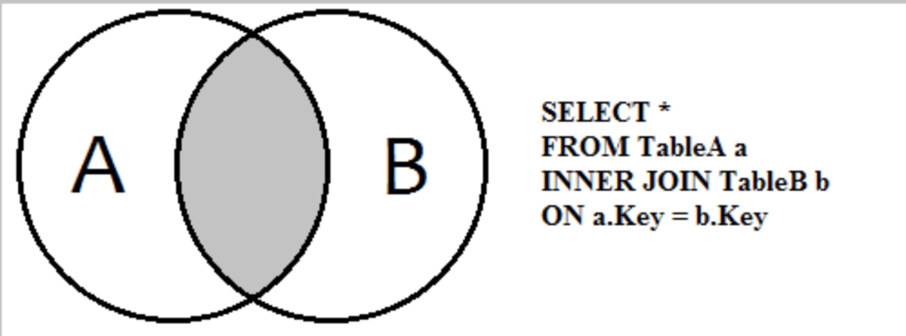
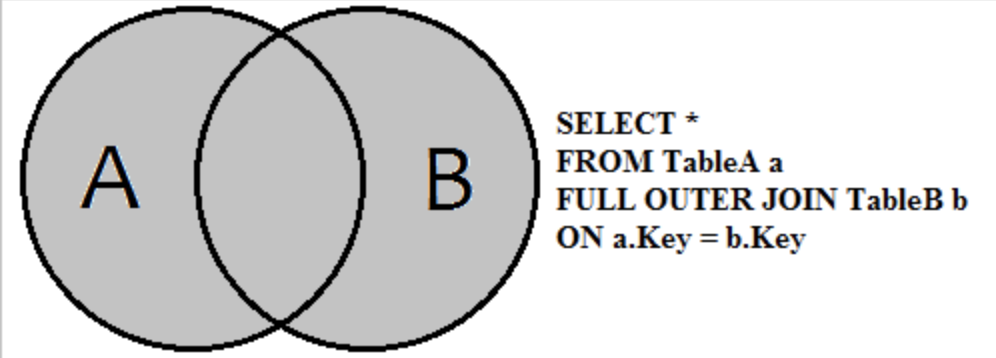
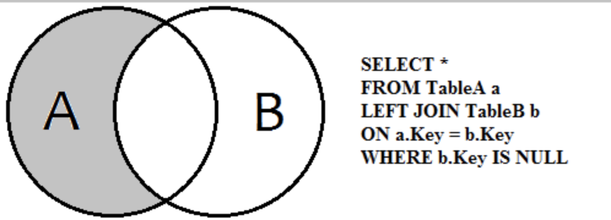
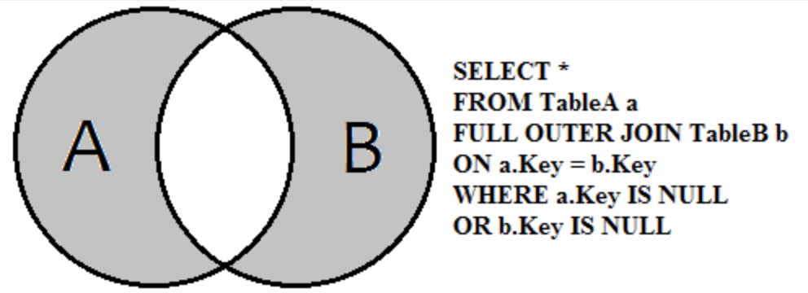

# Roaring Bitmaps: Implementation of an Optimized Software Library

##  Summary

We present an optimized software library written in C implementing Roaring bitmaps: CRoaring. It benefits from several algorithms designed for the single-instruction-multiple-data (SIMD) instructions available on commodity processors. <u>In particular, we present vectorized algorithms to compute the intersection, union, difference and symmetric difference between arrays</u>. We benchmark the library against a wide range of competitive alternatives, identifying weaknesses and strengths in our software. Our work is available under a liberal open-source license.

## 1. INTRODUCTION

**==Contemporary==** computing hardware offers performance opportunities through improved parallelism, by having more cores and better single-instruction-multiple-data (SIMD) instructions. Meanwhile, software indexes often determine the performance of big-data applications. Efficient indexes not only improve latency and throughput, but they also reduce energy usage [[1]](#_bookmark44) .

> 现代计算硬件拥有更多的 core ，更好的单指令多数据指令(SIMD)，因此有机会通过改进并行性来提高性能。同时，软件索引通常确定了大数据应用的性能。高效的索引不仅可以提高延迟和吞吐量，还可以减少能耗 [[1]](#_bookmark44)。

Indexes are often made of sets of numerical identifiers (stored as integers). For instance, **inverted indexes** map query **==terms==** to document identifiers in search engines, and conventional database indexes map column values to record identifiers. We often need efficient computation of the intersection $(A \bigcap B)$, the union $(A \bigcup B)$, the difference $(A \setminus B)$, or the **==symmetric difference==** $((A \setminus B)\bigcup (B \setminus A))$ of these sets.

> 索引通常由一组数字标识符（存储为整数）组成。例如，**反向索引**将**查询项**映射到搜索引擎中的文档标识符，而常规数据库索引将列值映射到记录标识符。我们经常需要快速计算这些集合（指这些索引）的交集 $(A \bigcap B)$，并集 $(A \bigcup B)$，差 $(A \setminus B)$ 或对称差 $((A \setminus B)\bigcup (B \setminus A))$。
>
> | 集合                                       | 位运算   | Join                                                        |
> | ------------------------------------------ | -------- | ----------------------------------------------------------- |
> | $(A \bigcap B)$                            | `AND`    |                              |
> | $(A \bigcup B)$                            | `OR`     |                                |
> | $(A \setminus B)$                          | `ANDNOT` |            |
> | $((A \setminus B)\bigcup (B \setminus A))$ | `XOR`    |  |
>
> 1. 集合对称差：**两个集合中不重复的元素集合，即会移除两个集合中都存在的元素**

The bitmap (or bitset) is a **==time-honored==** strategy to represent sets of integers concisely. Given a universe of *n* possible integers, we use a vector of *n* bits to represent any one set. On a 64-bit processor, $\ulcorner n/64 \urcorner$ inexpensive bitwise operations suffice to compute set operations between two bitmaps:

- the intersection corresponds to the bitwise `AND`;
- the union corresponds to the bitwise OR;
- the difference corresponds to the bitwise ANDNOT;
- the symmetric difference corresponds to the bitwise XOR.

Unfortunately, when the range of possible values (*n*) is too wide, bitmaps can be too large to be practical. For example, it might be impractical to represent the set {1*,* 2^31^} using a bitset. For this reason, we often use compressed bitmaps.

> 位图（或位集）是一种历史悠久的策略，可以简洁地表示整数集。假设全集为n个可能的整数，使用n位向量来表示任意一个集合。在64位处理器上，$\ulcorner n/64 \urcorner$ 个廉价的按位操作足以计算两个位图之间的集合运算：
>
> - 交集对应于 `AND`
> - 并集对应于 `OR`
> - 集合差对应于 `ANDNOT`
> - 集合对称差对应于 `XOR`
>
> 不幸的是，当 n 的取值范围太宽时，位图可能太大而不实用。例如，使用位集表示集合{1*，*2^31^} 不切实际。因此，我们经常使用压缩位图。
>
> 1. 表示整个整数集需要128M

Though there are many ways to compress bitmaps (see § [2.1), ](#_bookmark4)several systems rely on an approach called Roaring including Elasticsearch [[2](#_bookmark45)], Metamarkets’ Druid [[3](#_bookmark46)], eBay’s Apache Kylin [[4](#_bookmark47)], Netflix’s Atlas [[5](#_bookmark48)], LinkedIn’s Pinot [[6](#_bookmark49)], Pilosa [[7](#_bookmark50)], Apache Hive, Apache Tez, Microsoft Visual Studio Team Services [[8](#_bookmark51)], and Apache Spark [[9](#_bookmark52), [10](#_bookmark53)]. In turn, these systems are in widespread use: e.g., Elasticsearch provides the search capabilities of Wikipedia [[11](#_bookmark54)]. Additionally, Roaring is used in machine learning [[12](#_bookmark55)], in data visualization [[13](#_bookmark56)], in natural language processing [[14](#_bookmark57)], in RDF databases [[15](#_bookmark58)], and in geographical information systems [[16](#_bookmark59)]. Wang et al. recommend Roaring bitmaps as a superior alternative [[17\] ](#_bookmark60)to other compressed bitmaps.

Roaring partitions the space  [0,  2^32^)  into  *chunks*  consisting  of  ranges  of  2^16^  integers ([0,  2^16^), [2^16^, 2^17^), . . .) [[18](#_bookmark61), [19](#_bookmark62)]^†^. For a value in the set, its least significant sixteen bits are stored in  a container corresponding to its chunk (as determined by its most significant sixteen bits), using one of three possible container types:

- **bitset containers** made of 2^16^ bits or 8 kB;
- **array containers** made of up to 4096 sorted 16-bit integers;
- **run containers** made of a series of sorted $\langle s, l \rangle$ pairs indicating that all integers in the range `[s, s + l]`are present^‡^.

> - † There are 64-bit extensions to Roaring [[20]](#_bookmark63).
> - ‡ The Roaring implementation [[2](#_bookmark45)] found in Elasticsearch lacks run containers but has “**==negated==**” array containers, where all but the missing values are stored.

>Roaring 将整数空间 [0，2 ^32^) 划分为**块**，每块 2^16^ 个整数，即 ([0，2^16^)，[2^16^，2^17^)，. . .) [[18](#_ bookmark61)，[19](#_ bookmark62)] ^†^。 集合中的值，其**最低有效十六位**存储在由其**最高十六位**确定的对应块中，块有三种容器类型：
>
>- **位集容器**：由 2^16^ 位或8 kB组成；
>- **数组容器**：由最多4096个排序的16位整数组成；
>- **行程容器**：由一系列排序后的 $\langle s, l \rangle$ 对组成的容器，表示 `[s, s + l]` 范围内的所有整数都在集合中^‡^。
>> - † Roaring 有64位的容器 [[20]](#_bookmark63).
>> - ‡ Elasticsearch 中 Roaring 的实现 [[2](#_bookmark45)] 缺少**行程容器**，但有 “**==否定==**” 数组容器，其中存储了所有缺失值。

At a high level, we can view a Roaring bitmap as a list of 16-bit numbers (corresponding to the most-significant 2 B of the values present in the set), each of which is coupled with a reference to a container holding another set of 16-bit numbers corresponding to the least-significant 2 B of the elements sharing the same prefix. See Fig. [1](#_bookmark2).

> 简单地说，我们可以将 Roaring 位图看做 16-bit 整数的列表（集合中存在的值的**最高两个字节**），每个值都关联到一个容器，容器中值的前缀（即最高两字节）相等，因此只保存最低 16-bit 。参见图[1](#_ bookmark2)。

We dynamically pick the container type to minimize memory usage. For example, when intersecting two bitset containers, we determine whether the result is an array or a bitset container on-the-fly. As we add or remove values, a container’s type might change. No bitset container may store fewer than 4097 distinct values; no array container may store more than 4096 distinct values. If a run container has more than 4096 distinct values, **==then it must have no more than 2047 runs, otherwise the number of runs must be less than half the number of distinct values==**.

> 我们动态地选择容器类型以最小化内存使用。例如，当两个位集容器相交时，我们会动态确定结果是数组还是位集容器。添加或移除值时，可能会更改容器类型。任何位集容器都不能存储少于 4097 个唯一值；任何数组容器都不能存储多于 4096 个唯一值。如果行程容器的非重复值超过4096，**==则其行程数不超过2047，否则行程数必须小于非重复值的一半==**。

Roaring offers logarithmic-time random access: to check for the presence of a 32-bit integer, we seek the container corresponding to the sixteen most-significant bits using a binary search. If this prefix is not in the list, we know that the integer is not present. If a bitmap container is found, we check the corresponding bit; if an array or run container is found, we use a binary search.

The early implementations of Roaring are in Java [[18](#_bookmark61), [21](#_bookmark64)]. Though Java offers high performance, it also abstracts away the hardware, making it more difficult for the programmer to tune the software to the microarchitecture. As an experiment, we built an optimized Roaring bitmap library in C (CRoaring). Based on this work, we make two main contributions:

- We present several **==non-trivial==** algorithmic optimizations. See Table [1](#_bookmark3). In particular, we show that a collection of algorithms exploiting single-instruction-multiple-data (SIMD) instructions can enhance the performance of a data structure like Roaring in some cases, above and beyond what state-of-the-art optimizing compilers can achieve. To our knowledge, it is the first work to report on the benefits of advanced SIMD-based algorithms for compressed bitmaps. Though the approach we use to compute array intersections using SIMD instructions in § [4.2](#_bookmark17) is not new [[22](#_bookmark65), [23](#_bookmark66)], our work on the computation of the union (§ [4.3](#_bookmark20)), difference (§ [4.4](#_bookmark22)) and symmetric difference (§ [4.4](#_bookmark22)) of arrays using SIMD instructions might be novel and of general interest.
- We benchmark our C library against a wide range of alternatives in C and C++. Our results **==provide guidance==** as to the strengths and weaknesses of our implementation.

We focus primarily on our novel implementation and the lessons we learned: we refer to earlier work for details regarding the high-level algorithmic design of Roaring bitmaps [[18](#_bookmark61), [19](#_bookmark62)]. Because our library is freely available under a liberal open-source license, we hope that our work will be used to accelerate information systems.

> Roaring 提供对数时间随机访问：为了检查32位整数的存在，使用二叉搜索寻找与16位最高有效位相对应的容器。如果找不到此前缀，那么该整数不存在。如果找到位图容器，则检查对应的位；如果找到数组或行程容器，则使用二叉搜索。
>
> Roaring 早期使用 Java 实现[[18](#_bookmark61), [21](#_bookmark64)]。尽管Java提供了高性能，但也抽象了硬件，这使程序员更难以为微体系结构调整软件。作为实验，我们在C（CRoaring）中建立了一个优化的 Roaring 位图库。这项工作主要有两项贡献：
>
> - 我们提出了一些**==非平凡的==**算法优化。参见表[1 ](#_ bookmark3)。特别是我们表明，利用单指令多数据（SIMD）指令的算法集合可以提高数据结构的性能，例如在某些情况下，比最先进的优化编译器所能达到的性能还要高。据我们所知，这是第一份基于 SIMD 高级算法对压缩位图有好处的报告。虽然我们在 § [4.2](#_bookmark17) 中使用 SIMD 指令计算数组交集的方法，并不是最新的[[22](#_bookmark65), [23](#_bookmark66)]，但我们在计算数组容器的并集(§ [4.3](#_bookmark20))，差(§ [4.4](#_bookmark22))，对称差(§ [4.4](#_bookmark22)) 中使用的 SIMD 指令可能是新颖的，并具有普遍意义。
> - 我们测试了 CRoaring 和 C/C++ 中的其他实现。测试结果对于实现的优缺点提供了指引。
>
> 我们主要关注新的实现和学到的教训：有关Roaring位图的高级算法设计的详细信息，请参阅早期工作[[18](#_bookmark61), [19](#_bookmark62)]。

Table 1. Our Roaring Optimizations and how they relate to prior work.

| containers      | optimization                                                 | section                 | prior work            |
| --------------- | ------------------------------------------------------------ | ----------------------- | --------------------- |
| bitset→array    | converting bitsets to arrays                                 | § [3.1](#_bookmark7)    |                       |
| bitset+array    | setting, flipping or resetting the bits of a bitset  at indexes specified by an array,  with and  without cardinality tracking | § [3.2](#_bookmark8)    |                       |
| bitset + bitset | computing the cardinality using a vectrized Harley-Seal algorithm | § [4.1.1](#_bookmark10) | [[24]](#_bookmark67) |
| array+array | computing the **intersection** between two arrays using a vectorized algorithm | § [4.2](#_bookmark17) | [[22](), [23]()] |
| array+array | computing the **union** between two arrays using a vectorized algorithm | § [4.3](#_bookmark20) |                       |
| array+array | computing the **difference** between two arrays using a vectorized algorithm | § [4.4](#_bookmark22) |                       |
| array+array | computing the **sysmmetric difference** between two arrays using a vectorized algorithm | § [4.5](#_bookmark24) |                       |


## 2. INTEGER-SET DATA STRUCTURES

The simplest way to represent a set of integers is as a sorted array, leading to an easy implementation. Querying for the presence of a given value can be done in logarithmic time using a binary search. Efficient set operations are already supported in standard libraries (e.g., in C++ through the Standard Template Library or STL). We can compute the intersection, union, difference, and symmetric difference between two sorted arrays in linear time: *O*(*n*1 + *n*2) where *n*1 and *n*2 are the cardinalities of the two arrays. The intersection and difference can also be computed in time *O*(*n*1 log *n*2), which  is advantageous when one array is small.

> ==More==

## 3. FASTER ARRAY-BITSET OPERATIONS WITH BIT-MANIPULATION INSTRUCTIONS
Like most commodity processors, Intel and AMD processors benefit from *bit-manipulation instructions* [43]. Optimizing compilers often use them, but not always in an optimal manner.

> 与大多数商用处理器一样，Intel 和 AMD 处理器也从**位操作指令**中受益[43]。编译器的优化器经常使用它们，但并不总是以最佳方式使用它们。

### 3.1. Converting Bitsets To Arrays

Two useful bit-manipulation instructions are `blsi`, which sets all but the least significant 1-bit to zero (i.e., `x & -x` in C), and `tzcnt`, which counts the number of trailing zeroes (largest *i* such as that *x/*2^i^ is an integer). Using the corresponding Intel intrinsics (`_blsi_u64` and `_mm_tzcnti_64`), we can extract the locations of all 1-bits in a 64-bit word (`w`) to an array (`out`) efficiently.

> 两条有用的位操作指令是 `blsi`，将除最低有效 1 位以外的所有位设置为零（即 C 中的 `x & -x`），及 `tzcnt`，计算尾随零的数量（即求最大的 *i*，使得 *x/*2^i^ 是整数）。使用相应的 Inte l内部函数（`_blsi_u64`和`_mm_tzcnti_64`），我们可以将64位字（`w`）中所有1位的位置有效地提取到数组（`out`）中。
>
> > `blsi`：找到最右边的1位，并将所有其他位设置为0。最终结果只有一个最右边的1位集。例如，01010**==1==**00（最右边的位以粗体显示）将变为00000100。

```c
pos = 0
while( w != 0) {
  uint64_t  temp  = _blsi_u64(w); 
  out[pos ++] = _mm_tzcnti_64(w); 
  w  ˆ= temp ;
}
```

Such code is useful when we need to convert a bitset container to an array container. We can ensure that only a handful of instructions are needed per bit set in the bitset container.

> 当我们需要将位集容器转换为数组容器时，这样的代码非常有用。我们可以确保位集容器中设置的每个位只需要少量指令。
>
> ```C
> 
> /*
>  * Write out the 16-bit integers contained in this container as a list
>  * of 32-bit integers using base as the starting value (it might be
>  * expected that base has zeros in its 16 least significant bits).
>  *
>  * The function returns the number of values written.
>  * The caller is responsible for allocating enough memory in out.
>  * The out pointer should point to enough memory (the cardinality times 
>  * 32 bits).
>  */
> int bitset_container_to_uint32_array(void *out, 
>                                      const bitset_container_t *cont,
>                                      uint32_t base)
> ```


### 3.2. Array-Bitset Aggregets

Several other such instructions are useful when implementing Roaring. For example, the `bt` (bittest) instruction returns the value of a bit whereas other bit-manipulation instructions can set (`bts`), clear (`btr`) and flip bits (`btc`) as they query their value. On a Pentium 4, these instructions had a throughput of one instruction every two cycles and a latency of six cycles. However, starting with the Intel Sandy Bridge microarchitecture (2011), they became much faster with a throughput of two instructions every cycle and a latency of one cycle [[44] ](#_bookmark87)for data in registers.

> 实现 Roaring 时，有些指令也很有用。例如，`bt`（位测试）指令返回位的值，而其他位操作指令可以在查询值时设置（`bts`）、清除（`btr`）和翻转位（`btc`）。这些指令在奔腾4上的吞吐量是每两个周期 1 条指令，延迟则为 6 个周期。但从 Intel Sandy Bridge 微体系结构（2011）开始，它们变得更快了，对于寄存器中的数据，吞吐量是每个周期 2 条指令，延迟为 1 个周期的[[44]](#_ bookmark87)。

> `bt`, `bts`, `btr`, `btc` => [Bit Test](https://en.wikipedia.org/wiki/Bit_Test) 或者  [BT、BTS、BTR、BTC: 位测试指令](https://blog.csdn.net/goingstudy/article/details/9346597)

Roaring has bitset containers, which are implemented as arrays of 64-bit words. Some of the most common operations on bitsets involve getting, setting, flipping or clearing the value of a single bit in one of the words. Sometimes it is also necessary to determine whether the value of the bit was changed.

> Roaring 的位集容器，实现为64位字的数组。位集上最常见的一些操作包括获取、设置、翻转或清除其中一个字中的某位。有时还需要确定该位的值是否已更改。

We are interested in the following scenario: given a bitset and an array of 16-bit values, we wish to set (or clear or flip) all bits at the indexes corresponding to the 16-bit values. For example, if the array is made of the values `{1,3,7,96,130}` , then we might want to set the bits at indexes *1*, *3*, *7*, *96*, *130* to 1. **This operation is equivalent to computing the union between a bitset and an array container**.

> 我们对以下场景感兴趣：给定一个位集和一个16位值数组，我们希望在与16位值对应的索引处设置（或清除或翻转）所有位。例如，如果数组的值为 `{1,3,7,96,130}` ，那么我们可能希望将索引 *1*、*3*、*7*、*96*、*130* 处的位设置为1。**此操作等价于计算位集和数组容器**之间的并集。

- If we do not care about the cardinality, and merely want to set the bit, we can use the simple C expression `(w[pos >> 6] |= UINT64_C(1) << (pos & 63)`. Compilers can translate this expression into two shifts (one to identify the word index and one to shift the single set bit) and a bitwise `OR`.

  On a recent x64 processor (see § [5.2) ](#_bookmark33)and using a recent popular C compiler (see § [5.1](#_bookmark29)), we estimate that we can set one bit every ≈ 3*.*6 cycles, taking into account the time required to read the positions of the bits to be set from an array. 

  We can do better by using a single shift (to identify the word index) followed by the instruction `bts` (“bit test and set”). Indeed, if the position of the bit in the bitset is given by the `pos` variable, then we shift `pos` right by 6 bits and store the result in `offset`. With the help of `offset`, we fetch the affected word from memory into a variable `load`. We call `bts` with `pos` and `load`. This sets the corresponding bit in `load`, so we can store it back in memory at index `offset`. Thus we generate a total of four instructions (one load, one shift, one `bts` and one store)—assuming that the position of the bit to set is already in a register. We find that we are able to set bits about twice as fast (one every ≈ 1*.*7 cycles). **We benefit from the fact that processors are superscalar, so that they can execute more than one instruction per cycle**.

  > 如只设置位，不考虑基数，用 `(w[pos >> 6] |= UINT64_C(1) << (pos & 63)`这样简单的 C 表达式即可。编译器可将此表达式转换为两个移位（一个用于位集中的索引，另一个用于移位 1 ）和一个按位 `OR`。
  >
  > 在最新的 x6 4处理器上（见§[5.2](##u bookmark33)），并使用最新流行的C编译器（见§[5.1](#u bookmark29)），我们估计可以≈每 3.6 个周期设置一个位，已考虑从数组读取**要设置位**的位置所需的时间。
  >
  > 可以通过使用一个移位（用于位集中的索引）和指令 `bts`（位测试和设置）来提高性能。实际上，如果`pos` 变量给出位在位集中的位置 ，那将 `pos` 右移6位，结果则放在`offset` 中。借助 `offset`，将受影响的字从内存中提取到 `load` 变量。 `bts`的操作数是 `pos` 和 `load` ，将在 `load` 中设置相应的位，因此我们可以将其存回`offset`处的内存。这样，假设要设置的位的位置已经在寄存器中，我们总共生成四条指令（一个加载、一个移位、一个 `bts` 和一个存储）。我们发现，能够将设置位的速度提高到大约是原来的两倍（≈ 每 1.7 个周期一位）。我们受益于以下事实：处理器是超标量的，因此它们每个周期可以执行多个指令。
  >
  > ```C
  > /*
  >  * Given a bitset, set all bit values in the list (there
  >  * are length of them).
  >  */
  > void bitset_set_list(void *bitset,
  >                      const uint16_t *list, 
  >                      uint64_t length) {
  >   // ...
  >   __asm volatile(
  >     "shrx %[shift], %[pos], %[offset]\n"
  >     "mov (%[bitset],%[offset],8), %[load]\n"
  >     "bts %[pos], %[load]\n"
  >     "mov %[load], (%[bitset],%[offset],8)"
  >     : [load] "=&r"(load), [offset] "=&r"(offset)
  >     : [bitset] "r"(bitset), [shift] "r"(shift), [pos] "r"(pos));
  > }
  > ```

- We could set bits and track the cardinality but we expect branch predictions to be sometimes difficult, and branch mispredictions can be expensive (e.g., over 10 cycles of penalty per misprediction). Using the following C code, we set bits and track the cardinality while avoiding branches.
  
  > 我们也可以在设置位时，同时更新基数，但估计**分支预测**可能会有问题，分支预测错误的代价可能会很高（例如，每个预测错误大约会导致超过10个周期的惩罚）。使用下面的C代码，我们设置位并更新基数，可避免分支。
  
```C
  uint64_t old_w = words [pos >> 6];
  uint64_t new_w = old_w | ( UINT64_C (1) << ( pos & 63) );
  cardinality += ( old_w ˆ new_w ) >> ( pos & 63) ; // 更新基数
  words [pos >> 6] = new_w ;
```

  This code first retrieves the word `old_w` at index `pos/64` (or equivalently `pos >> 6`) in an array of 64-bit words `words`. We then set the bit at index `pos % 64` (or equivalently `pos & 63`)  to 1, and call the result `new_w`. We can write back `new_w` to the array `words`, and use the bitwise **XOR** between `old_w` and (`new_w`) to determine whether the bit value was changed. We get about ≈ 3.6 cycles per bit set, or ab7 the same speed we get when we use similar C code without tracking the cardinality.

  > 这段代码首先取出数组位置为`pos/64`（即`pos >> 6`）处的字，存入`old_w`。然后设置在位集索引`pos % 64`（即`pos & 63`）处的位，结果存入`new_w`。我们可以在 `old_w` 和 `new_w` 之间用 **XOR** 来确定是否更改了位集中的位，然后把 `new_w`写回数组`words`。这个方法设置每个位平均需  ≈ 3.6 个周期，和不更新基数的 C 代码的速度类似。

 We can also achieve the same result, set the bit, and adjust the cardinality counter as follows: Use a shift (to identify the word index), the instruction `bts`, then an instruction like `sbb` (“integer subtraction with borrow”) to modify the cardinality counter according to the carry flag eventually set by `bts`. Indeed, if the position of the bit in the bitset is given by the `pos` variable, then we can proceed as follows:
  - We shift `pos` right by 6 bits (e.g., `shrx`) and store the result in `offset`.
- We load the 64-bit word at index `offset` and store it in `load`.
  - We call `bts` with `pos` and `load`. This sets the corresponding bit in `load`, so we can store it back in memory at index `offset`.
  - The call to `bts` stored the value of the bit in the carry (**CF**) flag. If the bit was set, then the carry flag has value 1, otherwise it has value 0. We want to increment our counter when the carry flag has value 1, and leave it unchanged when it has value 0. Thus we can call the subtract with borrow (`sbb`) instruction, passing our cardinality counter as well as the parameter -1. It will add -1 to the carry flag (getting 0 and -1), and then subtract this value from the counter, effectively adding 0 or 1 to it.
  
  In total, we need five instructions (one load, one shift, one `bts`, one store and one sbb), which is one more instruction than if we did not have to track the cardinality.
  
  With this approach, we find that we can set a bit while maintaining a cardinality counter every ≈ 1.8 cycles on our processor. It is only 0.1 cycles per bit set slower than if we do not track the cardinality.
  
  > 下面的方法有相同的结果，即设置位同时调整基数：使用**移位**获得字的索引，使用指令 `bts`，然后使用类似 `sbb` 的指令（带借位的整数减法），根据 `bts` 最终设置的**进位标志**（CF）修改基数计数器。实际上，如果位在位集中的位置是由`pos`变量指定，那么我们可以进行如下操作：
  >
  > - 将 `pos` 右移6位（例如，`shrx`），并将结果存储在 `offset` 中
  > - 加载位于`offset`处64位的字，将其存储于 `load` 中
  > - 

According to our experiments, you can set a bit, or set a bit while maintaining the cardinality, with almost the same throughput—even when all the data is in L1 processor cache. A similar conclusion holds for bit flipping or bit clearing. Thus it is inexpensive to track the cardinality of bitset containers as we modify individual bits on recent x64 processors.

We also find that if we use bit-manipulation instructions and hand-tuned assembly, we can roughly double the speed at which we can change bits in a bitset, compared to compiler-generated machine code with all optimization flags activated. It is true not only when setting bits, but also when clearing or flipping them—in which cases we need to use the `btr` and `btc` instructions instead. Informally, we tested various C compilers and could not find any that could perform nearly as well as hand-tuned assembly code. This may, of course, change in the future.

> 根据我们的实验，设置位同时维护基数，和仅仅设置位的吞吐量也几乎相同，即使所有数据都在 L1 缓存中一样。对于翻转位或清除位也有类似的结论。因此，当我们在最新的x64处理器上修改单个位时，跟踪位集容器的基数成本不高。
>
> > 这里 L1 cache 是在和**寄存器**相比
>
> 我们还发现，如果使用位操作指令和手工调试的汇编，与激活了所有优化标志的编译器生成的机器代码相比，我们可将位集中的位更改速度提高大约一倍。不仅在设置位时，而且在清除或翻转位时也是如此，此时需要使用`btr`和`btc`指令。我们非正式地测试了各种 C 编译器，没有一个能和手工调整的汇编码的性能相媲美。 当然这在未来可能会有改变。

## 4.	VECTORIZED PROCESSING

> 向量化处理

Modern commodity processors use parallelism to accelerate processing. SIMD instructions offer a particular form of processor parallelism [[45]](#_bookmark88) that proves advantageous for processing large volumes of data [[46]](#_bookmark89). Whereas regular instructions operate on a single machine word (e.g., 64 bits), SIMD instructions operate on large registers (e.g., 256 bits) that can be used to represent “vectors” containing several distinct values. For example, a single SIMD instruction can add sixteen 16-bit integers in one 32 B vector register to the corresponding 16-bit integers in another vector register using a single cycle. Moreover, modern processors are capable of superscalar execution of certain vector instructions, allowing the execution of several SIMD instructions per cycle. For example, an Intel Skylake processor is capable of executing two vector additions every cycle [[44]](#_bookmark87).

>现代商用处理器通过并行性来加速。SIMD 指令提供一种特殊形式的处理器并行性[[45]](#_ bookmark88)，证明对处理大量数据[[46]](#_ bookmark89)有利。常规指令在单个机器字（如64位）上操作，而SIMD指令操作于大型寄存器（如256位）上，这些寄存器可用于表示包含几个不同值的“**==向量==**”。例如，单个SIMD指令可以在单个周期内，将一个 32B 向量寄存器中的16个16位整数添加到另一个向量寄存器中相应的16位整数。此外，现代处理器能够超标量执行某些矢量指令，允许每个周期执行几个SIMD指令。例如，英特尔 Skylake 处理器能够在每个周期执行两次矢量加法[[44]](#u bookmark87)。

SIMD instructions are ideally suited for operations between bitset containers. When computing the **intersection**, **union**, **difference** or **symmetric difference** between two (uncompressed) bitsets, we only have to load the data in registers, apply a logical operation between two words (`AND`, `OR`, `AND NOT`, or `XOR`) and, optionally, save the result to memory. All of these operations have corresponding SIMD instructions. So, instead of working over 64-bit words, we work over larger words (e.g.,   256 bits), <u>**==dividing the number of instruction (e.g., ÷ 4) and giving significantly faster processing==**</u>.

> SIMD 指令非常适合位集容器之间的操作。计算两个未压缩位集之间的**交集**、**并集**、**差**或**对称差**时，将数据加载到寄存器，在两个字之间使用逻辑运算（`AND`、`OR`、`AND NOT`、`XOR`）即可，且**==可以选择是否将==**结果保存到内存中。所有这些操作都有对应的 SIMD 指令。因此我们并是不处理 64 位字，而是处理更大（例如256位）的字，<u>**==划分指令数（例如 ÷ 4），且显著加快处理速度==**</u>。
>

Historically, SIMD instructions have gotten wider and increasingly powerful. The Pentium 4 was limited to 128-bit instructions. Later x64 processors introduced increasingly powerful 128-bit instruction sets: SSSE3, SSE4, SSE4.1, SSE4.2. Today, we find rich support for 256-bit vector registers in the AVX2 instruction set available in recent x64 processors from Intel (starting with the Haswell microarchitecture, 2013) and AMD (starting with the Excavator microarchitecture, 2015). Upcoming Intel commodity processors will support 512-bit SIMD instructions (AVX-512). In many cases, the benefits of SIMD instructions increase as they get wider, which means that SIMD instructions tend to become more compelling with time.

> 从历史上看，SIMD指令已变得越来越广泛且功能越来越强大。奔腾4仅限于128位指令。 后来的 x64 处理器引入了功能越来越强大的128位指令集：SSSE3，SSE4，SSE4.1，SSE4.2。现在，Intel（从2013年的 Haswell 微体系结构开始）和 AMD（从2015年的 Excavator 微体系结构开始）最新的 x64 处理器中的 **AVX2** 指令集，对 256 位矢量寄存器提供了丰富支持。即将上市的英特尔商用处理器将支持512位SIMD指令（AVX-512）。 在许多情况下，SIMD指令的优势随着宽度的增加而增加，这意味着SIMD指令随着时间的流逝会变得越来越引人注目。

Compilers can automatically translate C or C++ code into the appropriate SIMD instructions, even when the code does not take into account vectorization (scalar code). However, for greater gains, it is also possible to design algorithms and code that take into account the vector instructions. In these instances, we can use the SIMD intrinsics available in C and C++ to call SIMD instructions without having to use assembly code. See Table [2](#_bookmark11). These intrinsics are supported across several compilers (LLVM’s Clang, GNU GCC, Intel’s compiler, Visual Studio).

> 即使代码不考虑向量化（标量代码），编译器也可以自动将 C 或 C + +代码转换为适当的SIMD指令。但是为了获得更大的收益，还可以设计考虑到向量指令的算法和代码。在这些情况下，我们可以使用 C 和 C++ 中可用的 SIMD 内部函数来调用SIMD指令，而不必使用汇编代码，见表[2](#u bookmark11)。多个编译器（LLVM的Clang，GNU GCC，英特尔的编译器，Visual Studio）都支持这些内部函数。

> **Table 2**. Some relevant AVX and AVX2 instructions with **==reciprocal throughput==**^1^ in CPU cycles on recent (Skylake) Intel processors.
>
> | instruction | C intrinsic           | description                                                  | rec. through- put [[44]](#_bookmark87) |
> | ----------- | --------------------- | ------------------------------------------------------------ | --------------------------------------- |
> | `vpand`     | `_mm256_and_si256`    | 256-bit AND                                                  | 0.33                                    |
> | `vpor`      | `_mm256_or_si256`     | 256-bit OR                                                   | 0.33                                    |
> | `vpxor`     | `_mm256_xor_si256`    | 256-bit XOR                                                  | 0.33                                    |
> | `vpsadbw`   | `_mm256_sad_epu8`     | sum of the absolute differences of the byte values to the low 16 bits of each 64-bit word | 1                                       |
> | `vpaddq`    | `_mm256_add_epi64`    | add 64-bit integers                                          | 0.5                                     |
> | `vpshufb`   | `_mm256_shuffle_epi8` | shuffle bytes  within 128-bit lanes                          | 1                                       |
> 1. The reciprocal throughput is the number of processor clocks it takes for an instruction to execute. A reciprocal throughput of 0.5 means that we execute two such instructions per clock.

### 4.1. Vectorized Population Count Over Bitsets

We can trivially vectorize operations between bitsets. Indeed, it suffices to compute bitwise operations over vectors instead of machine words. **By aggressively unrolling the resulting loop, we can produce highly efficient code. Optimizing compilers can often automatically vectorize such code**. It is more difficult, however, to also compute the cardinality of the result efficiently. Ideally, we would like to vectorize simultaneously the operations between bitsets and the computation of the cardinality of the result.

> 我们可以简单地将位集之间的操作向量化。实际上，基于向量而非机器字做按位运算就足够了。**通过积极地循环展开，可以生成高效的代码。编译器优化通常可以自动向量化此类代码**。然而比较难的是要同时高效地计算结果基数。理想情况下，我们希望在使用向量化指令进行位集运算的同时，还能获得计算结果的基数。

#### 4.1.1. Vectorized Harley-Seal Population Count

Commodity processors have dedicated instructions to count the 1-bits in a word (the “**==population count==**”): `popcnt` for x64 processors and `cnt` for the 64-bit ARM architecture. On recent Intel processors, `popcnt` has a throughput of one instruction per cycle for both 32-bit and 64-bit registers [[44]](#_bookmark87).

Maybe surprisingly, Muła et al. found that it is possible to do better [[24]](#_bookmark67). We can use a vectorized approach based on the circuit-based Harley-Seal algorithm [[47]](#_bookmark90). It is inspired by **==a carry-save adder (CSA) circuit==**: given 3 bit values (*a, b, c*  ∈ {0*,* 1} ), we can sum them up into the two-bit `(a XOR b) XOR c` (least significant) and `(a AND b) OR ((a XOR b) AND c)` (most significant). We can sum 3 individual bit values to a 2-bit counter using 5 logical operations, and we can generalize this approach to 256-bit vectors. Starting with 3 input vectors, we can generate two new output vectors, one containing the least significant bits and one containing the most significant (or *carry*) bits with 5 bitwise logical operations (two `XOR`s, two `AND`s and one `OR`):

>商用处理器有专门的指令来对一个字中有多少位为1进行计数（**==填充计数==**）：x64处理器是 `popcnt`，64位ARM架构是 `cnt`。 在最新的 Intel 处理器上，对于 32 位和 64 位寄存器[[44]](#_ bookmark87)，`popcnt` 的吞吐量为每个周期一条指令。
>
>也许令人惊讶的是，Muła 等人发现能做得更好[[24]](#bookmark67)。这里使用的向量化方法是基于电路的 Harley-Seal 算法[[47]](#_ bookmark90)，灵感来自于**==进位保存加法器（CSA）电路==**：给定3个位（*a，b，c* ∈ {0，1}），对它们求和可以分为：`(a XOR b) XOR c` （最低有效位）和  `(a AND b) OR ((a XOR b) AND c)`（最高有效位）。我们可以使用 5 个逻辑运算（两个 `XOR`，两个 `AND`  和 一个 `OR`），将对 **3 个单独位**的求和结果放到一个 2 位计数器，并且可将此方法扩展到 256 位向量，从 3 个输入向量开始，生成两个新的输出向量，一个包含最低有效位，另一个包含最高有效位（或**进位**）和：

```C
void CSA ( __m256i *h, __m256i *l, __m256i a, __m256i b, __m256i c) {
  // starts with a,b,c, sets H,L, u is temp .
  __m256i u = _mm256_xor_si256 (a, b);
  *h = _mm256_or_si256 ( _mm256_and_si256 (a, b),_mm256_and_si256 (u, c));
  *l = _mm256_xor_si256 (u, c);
}
```

From such an adder function, we can derive an efficient **==population-count function==**, <u>**==effectively composing 3-input adders into a circuit with 16 inputs, which encodes the population count of its 16 inputs as a 5-bit binary number==**</u>. For instance, Knuth presents a construction [[48](#_bookmark91)] requiring only 63 logical operations in the case of a 16-input circuit. Although using slightly more logical operations (75), **<u>==the iterated Harley-Seal approach goes further: it increments the existing contents of a 5-bit binary number by the population count==</u>**.

> 从这个加法器函数，我们可以导出一个高效的**==填充计数函数==**，<u>**==将 3 个输入加法器组成一个有16路输入的电路，将其16路输入的填充计数编码为5位二进制数==**</u>。例如，Knuth 提出了一种结构[[48](#_ bookmark91)]，在 16 路输入的情况下只需要63个逻辑操作。尽管我们稍微多用了一些（75个）逻辑操作，但**<u>==迭代的 Harley-Seal 方法更进一步：它通过填充计数增加 5 个二进制计数器现有的内容==</u>**。

In a SIMD **==setting==**, our Harley-Seal circuit takes sixteen 256-bit vectors and updates five 256- bit vectors serving as a **bit-sliced accumulator** [[49](#_bookmark92)]: in other words, if one counts the number of 1s amongst the least-significant bits of the 16 inputs, the population count (0 to 16) affects the least-significant bits of the 5 accumulator vectors. Similarly, the population count of the second-least- significant bits of the 16 inputs affects the second-least-significant bits of the accumulator vectors. Equivalently, the 5 accumulator vectors can be viewed as providing 256 different 5-bit accumulators. The accumulator vectors are named `ones`, `twos`, `fours`, `eights`, and `sixteens`, reflecting their use in the accumulator: if the least significant bits of the accumulator vectors are all initially zero and the population count of the least-significant bits of the 16 input vectors is 9, then our Harley-Seal approach will result in the least-significant bits of `eights` and `ones` being set, whereas the least-significant bits of `sixteens`, `fours` and `twos` would be clear. (The accumulator went from storing 0 to storing 9.) If the accumulator updated a second time with the same inputs, then the least-significant bits of `sixteens` and `twos` (only) would be set.

> 在 SIMD **==设置==**中，Harley-Seal 电路接受 16 路 256 位的向量，并更新 5 个 256 位的向量（用作**位切片累加器**[[49](#_ bookmark92)]）：换言之，如果在16路输入的最低有效位中统计 1 的数目，则填充计数（0到16）影响5个累加器向量的最低有效位。类似地，16路输入的第二个最低有效位的填充计数影响累加器向量的第二个最低有效位。等效地，5个累加器向量可以被视为提供256个不同的5位累加器。累加器向量命名为 `ones`， `twos`， `fours`， `eights`和 `sixteens`，反映了它们在累加器中的用法：如果累加器向量的最低有效位最初全为 0，而16个输入向量的[**最低有效位**](https://baike.baidu.com/item/%E6%9C%80%E4%BD%8E%E6%9C%89%E6%95%88%E4%BD%8D/4487937)的填充计数为9，那么我们的 Harley-Seal 方法将设置 `eights` 和 `ones` 的最低有效位，而`sixteens` 、`fours` 和 `twos` 的最低有效位将会被清除（累加器从存储0变为存储9）。如果累加器使用相同的输入进行第二次更新，则将只设置 `sixteens` 和 `twos` 的最低有效位。

```C
// Figure 2. A C function using AVX2 intrinsics to compute the 
// four population counts of the four 64-bit words in a 256-bit vector.

// _mm256_setr_epi8 => Initialize a vector with integers in reverse order
// _mm256_set1_epi8 => Fill a vector with an integer
// _mm256_srli_epi16 => logical right shift
__m256i popcount256 ( __m256i v) {
  __m256i lookuppos = _mm256_setr_epi8 (
    4 + 0, 4 + 1, 4 + 1, 4 + 2,
    4 + 1, 4 + 2, 4 + 2, 4 + 3,
    4 + 1, 4 + 2, 4 + 2, 4 + 3,
    4 + 2, 4 + 3, 4 + 3, 4 + 4,
    4 + 0, 4 + 1, 4 + 1, 4 + 2,
    4 + 1, 4 + 2, 4 + 2, 4 + 3,
    4 + 1, 4 + 2, 4 + 2, 4 + 3,
    4 + 2, 4 + 3, 4 + 3, 4 + 4);
  
  __m256i lookupneg = _mm256_setr_epi8 (
    4 - 0, 4 - 1, 4 - 1, 4 - 2,
    4 - 1, 4 - 2, 4 - 2, 4 - 3,
    4 - 1, 4 - 2, 4 - 2, 4 - 3,
    4 - 2, 4 - 3, 4 - 3, 4 - 4,
    4 - 0, 4 - 1, 4 - 1, 4 - 2,
    4 - 1, 4 - 2, 4 - 2, 4 - 3,
    4 - 1, 4 - 2, 4 - 2, 4 - 3,
    4 - 2, 4 - 3, 4 - 3, 4 - 4);
  
  __m256i low_mask = _mm256_set1_epi8 (0x0f);
  __m256i lo = _mm256_and_si256(v, low_mask );
  __m256i hi = _mm256_and_si256(_mm256_srli_epi16(v, 4) ,
                                 low_mask);
  __m256i popcnt1 = _mm256_shuffle_epi8(lookuppos, lo);
  __m256i popcnt2 = _mm256_shuffle_epi8(lookupneg, hi);
  return _mm256_sad_epu8 (popcnt1, popcnt2);
}
```

Fig. [4 ](#_bookmark14)(from [[24](#_bookmark67)]) illustrates a simplified case with only `ones`, `twos` and `fours`. Fig. [5 ](#_bookmark15)shows the high-level process: We load 16 vectors from the source bitset, we compute the bitwise operations, and obtain the result in `ones`, `twos`, `fours`, `eights` and `sixteens`. This processes a 4 kb block of an input bitset using approximately 75 **==AVX==** operations, not considering any data-movement instructions (see Fig. [3](#_bookmark13)). We can compute the total value of all 256 accumulators as `16 × count(sixteens) + 8 × count(eights) + 4 × count(fours) + 2 × count(twos) + count(ones)` (13 more operations), where `count(b)` denotes <u>the population count of *b*</u>. **Iterated** 16 times, we can process the entire input bitset. Moreover, it is only necessary to read the total value of all 256 accumulators after the last iteration. **However**, we need to ensure that, at the beginning of each iteration, none of our 5-bit accumulators ever begins with a count above 15 — otherwise, an accumulator might need to store a value exceeding 31. Therefore, at the end of each block we count the 1-bits in each of the four 64-bit words of `sixteens` and add the result to a vector counter ***c*** before zeroing `sixteens`. To count the 1-bits in `sixteens` quickly, we use vector registers as lookup tables mapping 4-bit values (integers in [0*,* 16)) to their corresponding population counts, and the `vpshufb` can effectively look up 32 byte values at once. Thus we can divide each byte of `sixteens` into its low nibble and high nibble and look up the population count of each. To get a population count for the 64-bit words, we use the instruction `vpsadbw` (with the intrinsic `_mm256_sad_epu8`): this instruction adds the absolute values of the differences between byte values within 64-bit subwords. We illustrate the code in Fig. [2](#_bookmark12): the vectors `lookuppos` and `lookupneg` store the positives and negatives of the population counts with a canceling offset of 4 so that their subtraction is the sum of the population counts. After the 16^th^ iteration, the population count of the entire input bitset is computed as `16 × c + 8 × count(eights) + 4 × count(fours) + 2 × count(twos) + count(ones).`

```C
// Figure 3. Accumulator circuit over sixteen inputs (A[i+0], . . . , A[i+15])
CSA(&twosA, &ones, ones, A[i], A[i + 1]) ;
CSA(&twosB, &ones, ones, A[i + 2], A[i + 3]) ;
CSA(&foursA, &twos, twos, twosA, twosB);
CSA(&twosA, &ones, ones, A[i + 4], A[i + 5]) ;
CSA(&twosB, &ones, ones, A[i + 6], A[i + 7]) ;
CSA(&foursB, &twos, twos, twosA, twosB);
CSA(&eightsA, &fours, fours, foursA, foursB);
CSA(&twosA, &ones, ones, A[i + 8], A[i + 9]) ;
CSA(&twosB, &ones, ones, A[i + 10], A[i + 11]) ;
CSA(&foursA, &twos, twos, twosA, twosB);
CSA(&twosA, &ones, ones, A[i + 12], A[i + 13]) ;
CSA(&twosB, &ones, ones, A[i + 14], A[i + 15]) ;
CSA(&foursB, &twos, twos, twosA , twosB );
CSA(&eightsB, &fours, fours, foursA, foursB);
CSA(&sixteens,&eights, eights, eightsA, eightsB);
```

> **==Figure 4. Figure 5.==**

By contrast, in the approach using the dedicated population-count instruction, the compiler generates one load, one `popcnt` and one add per input 64-bit word. Current x64 processors decompose complex machine instructions into low-level instructions called ***µ*ops**. The `popcnt` approach generates three ***µ*ops** per word. For the SIMD approach, we process sixteen 256-bit vectors using 98 ***µ*ops** including 16 loads, 32 bitwise ANDs (`vpand`), 15 bitwise ORs (`vpor`) and 30 bitwise XORs (`vpxor`)— or about 1.5 ***µ*ops** to process each 64-bit word. That is, the vectorized approach generates half the number of *µ*ops. We analyzed our implementations with the IACA code analyser [[50](#_bookmark93)] for our target x64 microarchitecture (§ [5.2](#_bookmark33)). Unsurprisingly, IACA predicts a throughput of one word per cycle with the dedicated population-count function, and a throughput of slightly more than two words per cycle with the vectorized approach. Microbenchmarking agrees with IACA and shows that our approach is roughly twice as fast as relying exclusively on dedicated population-count instructions.

> 相反，使用专用的填充计数指令，编译器为每个输入的 64 位字生成一个 load、一个 `popcnt` 和一个 `add`。当前 x64 处理器将复杂的机器指令分解为称为 ***µ*ops **的低级指令。`popcnt` 方法为每个字会产生 3 个 ***µ*ops **。对于 SIMD 方法，用 98 个 ***µ*ops** 处理 16 个 256 位向量，包括 16 个 `load`，32 个AND（`vpand`），15 个 OR（`vpor`）和 30 个 XOR（`vpxor` ）或大约 1.5 ***µ*ops** 以处理每个64位字。也就是说，向量化方法生成 ***µ*ops** 的数量只有专用指令的一半。针对我们的目标x64微体系结构（§[5.2](#_ bookmark33)），我们使用IACA代码分析器[[50](#_ bookmark93)]分析了我们的实现。毫不奇怪，对于专用的统计指令，IACA预测吞吐量为每个周期一个字；而使用向量化方法，预测吞吐量每个周期略大于两个字。微基准测试与IACA一致，表明我们的方法大约是完全依靠专用统计指令的两倍。
>

#### 4.1.2.  Vectorized Operations Over Bitsets With Population Counts

To aggregate two bitsets (e.g., with the intersection/AND, union/OR, etc.) while maintaining the cardinality, we found that an efficient approach is to load two machine words from each bitset, compute the bitwise operation, apply the population-count instruction on the two resulting words, and write them out before processing the next words. To benefit from vectorization, we could compute the bitwise logical operations using SIMD instructions, and then reload the result from memory and apply the population-count instructions. The interplay between SIMD instructions and a population-count function operating over 64-bit words would not be ideal.

Though an obvious application of the vectorized population count is the efficient computation of the cardinality of a bitset container, we put also it to good use whenever we need to compute the intersection, union, difference or symmetric difference between two bitset containers, while, at the same time, gathering the cardinality of the result. We can also use it to compute the cardinality of the intersection, union, difference or symmetric difference, without materializing them. As reported by Muła et al. [[24](#_bookmark67)], in these cases, the benefits of the vectorized approach can exceed a factor of two. Indeed, if we use a vectorized approach to the population count, we can count the bits directly on the vector registers, without additional data transfer.

### 4.2.  Vectorized Intersections Between Arrays

Because array containers represent integers values as sorted arrays of 16-bit integers, we can put   to good use an algorithm based on a vectorized string comparison function present in recent x64 processors [[22](#_bookmark65), [23](#_bookmark66)] (SSE 4.1’s `pcmpistrm`). While intended for string comparisons, we can **==repurpose==** the instruction to compute intersections. Each input array is divided into blocks of eight 16-bit integers. There are two block pointers (one for each array) initialized to the first blocks. We use the `pcmpistrm` instruction to conduct an all-against-all comparison of 16-bit integers between these two blocks and we extract matching integers from a mask produced by the instruction. The number of  1s in the resulting mask indicates the number of matching integers. To avoid the cost of comparing pairs of blocks that cannot match, a merge-like process considers the maximum element within each block to find those block-pairs to which `pcmpistrm` should be applied. That is, whenever the current maximum value in the block of one array is smaller or equal to the maximum of the other block, we load the next block. In particular, when the maxima of the two blocks are equal, we load a new block in each array. See Algorithm [1](#_bookmark18).

> 由于数组容器是 16 位整数的排序数组，因此，我们的算法可以充分利用基于向量化字符串的比较函数，该函数存在于最新的x64处理器中[[22](#u bookmark65)、[23](#u bookmark66)]（SSE 4.1的 `pcmpistrm`）。虽然是使用**字符串比较**，但我们可以重新调整指令的用途以计算交集。两个输入数组按 **8 × 16 位整数**来分块，每个块指针首先初始化到各自的第一块。使用 `pcmpistrm` 指令对这两个块之间的16位整数进行全比较，并从该指令产生的掩码中提取匹配的整数，结果掩码中为 1 的数量表示匹配整数的数量。为避免比较没有匹配的块，类似于合并的代码会考虑每个块中的最大值，以找到那些需要应用 `pcmpistrm` 的块对。也就是说，当一个数组当前块中的最大值**小于等于**另一个数组当前块的最大值时，我们加载该数组的下一个块。当两个块的最大值相等时，为每个数组加载一个新块。见算法[1](#u bookmark18)。

|      | Algorithm 1 Generic block-based intersection algorithm.      |
| ---- | ------------------------------------------------------------ |
|      | **Require**: two non-empty arrays made of a multiple of K distinct values in sorted order |
| 1    | load a block B~1~ of K elements from the first array         |
| 2    | load a block B~2~ of K elements from the second array        |
| 3    | **while** true **do**                                        |
| 4    | ____write the intersection between the two  blocks $B_{1} \bigcap B_{2}$ to the output |
| 5    | **____if** max B~1~ = max B~2~ **then**                      |
| 6    | ____ ____load a new block B~1~ of K elements from the first array, or terminate if exhausted |
| 7    | ____ ____load a new block B~2~ of K elements from the second array, or terminate if exhausted |
| 8    | **____else if** max B~1~ < max B~2~ **then**                 |
| 9    | ____ ____load a new block B~1~ of K elements from the first array, or terminate if exhausted |
| 10   | **____else if** maxB~2~ < maxB~1~ **then**                   |
| 11   | ____ ____load a new block B~2~ of K elements from the second array, or terminate if exhausted |

We illustrate a simplified function in Fig. [6](#_bookmark19). The `_mm_cmpistrm` intrinsic compares all 16-bit integers from one 128-bit vector with all 16-bit integers from another vector, returning a mask. From this mask, we compute the number of matching values (using the `_mm_popcnt_u32` intrinsic to call the `popcnt` instruction). Moreover, we can shuffle the values in one of the vectors (vA) using a shuffling intrinsic (`_mm_shuffle_epi8`) and a table of precomputed shuffling masks (`mask16`). We could design an equivalent AVX2 function [[22]](#_bookmark65) using 256-bit vectors, but AVX2 lacks the equivalent of the `_mm_cmpistrm` intrinsic.

> 图[6](#_ bookmark19) 中展示了一个简化的函数。 内部函数 `_mm_cmpistrm` 将一个 128 位向量中的所有 16 位整数与另一个向量中的所有 16 位整数进行比较，并返回一个掩码，根据它算出匹配的数量（使用内部函数 `_mm_popcnt_u32` 调用 `popcnt`指令）。此外，可以使用内部函数 `_mm_shuffle_epi8`和预先计算的 shuffle 掩码表 `mask16` shuffle 向量 `vA` 中的值。我们可以使用 256 位向量设计一个等价的 AVX 2函数[[22]](#_ bookmark65)，但 AVX2 缺少等价的 `_mm_cmpistrm` 内部函数。
>

```c
/** Figure 6. Optimized intersection function between two 
 *  sorted 16-bit arrays using SSE4.1 intrinsics.
*/

int32_t intersect (uint16_t *A, size_t lengthA,
                   uint16_t *B, size_t lengthB,
                   uint16_t * out) {
  size_t count = 0; // size of intersection
  size_t i = 0, j = 0;
  int vectorlength = sizeof(__m128i) / sizeof(uint16_t);
  __m128i vA , vB , rv , sm16 ;
  while (i < lengthA ) && (j < lengthB ) {
    vA = _mm_loadu_si128 ((__m128i *)&A[i]);
    vB = _mm_loadu_si128 ((__m128i *)&B[j]);
    rv = _mm_cmpistrm (vB, vA,
                   _SIDD_UWORD_OPS | _SIDD_CMP_EQUAL_ANY | _SIDD_BIT_MASK );
    int r = _mm_extract_epi32 (rv , 0);
    sm16 = _mm_load_si128 (mask16 + r);
    __m128i p = _mm_shuffle_epi8(vA , sm16);
    _mm_storeu_si128 (( __m128i *)(out + count),p);
    count += _mm_popcnt_u32 (r);
    uint16_t a_max = A[i + vectorlength - 1];
    uint16_t b_max = B[j + vectorlength - 1];
    if ( a_max <= b_max ) i += vectorlength ;
    if ( b_max <= a_max ) j += vectorlength ;
  }
  return count ;
}
```

Special-case processing is required when our arrays do not have lengths divisible by eight: we need to finish the algorithm with a small scalar intersection algorithm. Special processing is also required if an array starts with zero, because the `pcmpistrm` instruction is designed for string values and it processes null values as special (string ending) values.

Evidently, we can easily modify this function if we only wish to get the cardinality. For the most part, we merely skip the memory store instructions.

When the `pcmpistrm` instruction is available, as it is on all recent x64 processors, it is advantageous to replace a conventional list intersection function by such a vectorized approach. However, we still rely on a **==galloping intersection==** when one of the two input arrays is much smaller. For example, the vectorized approach is obviously not helpful to intersect an array made of 1000 values with one made of two values. There are vectorized versions of the galloping intersection [[22](#_bookmark65)] which could further improve our performance in these cases, but we leave such an optimization for future work.

> 当数组长度不能被 8 整除时，需要进行特殊处理：用一个基于标量的交集算法来结束该算法。如果数组以零开始，也需要特殊处理，因为 `pcmpistrm` 指令是为字符串值设计的，它将空值作为特殊（字符串结尾）值处理。
>
> 显然，如果只为了获取基数，可以简单地修改此函数。大多数情况下，只是跳过内存存储指令。
>
> 当 `pcmpistrm` 指令可用时，比如在所有最新的 x64 处理器上，用这种向量化方法替换传统的列表交集函数是有利的。不过，当两个输入数组中的一个小得多时，仍然使用**==跳跃交集==**的算法。比如一个数组有 1000 个不同的值，另一个数组只有 2 个不同的值，向量化方法显然不靠谱。 [[22](#_bookmark65)] 有个向量化的**==跳跃交集==**算法，可以提高这种场景下的性能，咋们留待以后优化。

### 4.3.  Vectorized Unions Between Arrays

To compute the union between two array containers, we adapt an approach originally developed for **merge sort** using SIMD instructions [[51](#_bookmark94)]. Given two sorted vectors, we can generate two sorted output vectors that are the result of a “merger” between the two input vectors, by using a sorting network [[52](#_bookmark95), [53](#_bookmark96)] whose branch-free implementation uses SIMD minimum and maximum instructions. We can compute such a merger with eight minimum instructions and eight maximum instructions, given two vectors made of eight 16-bit integers (see Fig. [7](#_bookmark23)).

> 为了计算两个数组容器之间的并集，我们采用了一种最初为**归并排序**使用 SIMD 指令而开发的方法[[51](#_bookmark94)]。给定两个有序向量，使用排序网络[[52](#_bookmark95), [53](#_bookmark96)]，输出排序后的两个向量，是两个输入向量**==归并==**的结果。排序网络的无分支实现使用 SIMD 的最小和最大指令，给定由 8 个 16 位整数组成的两个向量，用 8 个最小指令和 8 个最大指令计算出这样的结果（见图 [7](#_bookmark23)）。
>
> - `_mm_min_epu16`： Compares the corresponding elements of two 128-bit vectors of [8 x u16] and returns a 128-bit vector of [8 x u16] containing the lesser value of the two.
>- `_mm_max_epu16`：Compares the corresponding elements of two 128-bit vectors of [8 x u16] and returns a 128-bit vector of [8 x u16] containing the greater value of the two.
> - `_mm_alignr_epi8`：Concatenates the two 128-bit integer vector operands, and right-shifts the result by the number of bytes specified in the immediate operand.

```C
/**
Figure 7. Fast merge function using Intel SIMD instrinsics, takes two sorted arrays of eight 16-bit integers and produces two vectors (vecMin, vecMax) containing the sixteen integer inputs in a sorted sequence, with the eight smallest integers in vecMin, and eight largest in vecMax.
*/
void sse_merge ( const __m128i * vInput1 ,
                const __m128i * vInput2 ,// input 1 & 2
                __m128i * vecMin , __m128i * vecMax ) {
  vecTmp = _mm_min_epu16 (* vInput1 , * vInput2 );
  * vecMax = _mm_max_epu16 (* vInput1 , * vInput2 );
  vecTmp = _mm_alignr_epi8 (vecTmp , vecTmp , 2);
  * vecMin = _mm_min_epu16 (vecTmp , * vecMax );
  * vecMax = _mm_max_epu16 (vecTmp , * vecMax );
  vecTmp = _mm_alignr_epi8 (* vecMin , * vecMin , 2);
  * vecMin = _mm_min_epu16 (vecTmp , * vecMax );
  * vecMax = _mm_max_epu16 (vecTmp , * vecMax );
  vecTmp = _mm_alignr_epi8 (* vecMin , * vecMin , 2);
  * vecMin = _mm_min_epu16 (vecTmp , * vecMax );
  * vecMax = _mm_max_epu16 (vecTmp , * vecMax );
  vecTmp = _mm_alignr_epi8 (* vecMin , *vecMin , 2);
  * vecMin = _mm_min_epu16 (vecTmp , * vecMax );
  * vecMax = _mm_max_epu16 (vecTmp , * vecMax );
  vecTmp = _mm_alignr_epi8 (* vecMin , *vecMin , 2);
  * vecMin = _mm_min_epu16 (vecTmp , * vecMax );
  * vecMax = _mm_max_epu16 (vecTmp , * vecMax );
  vecTmp = _mm_alignr_epi8 (* vecMin , * vecMin , 2);
  * vecMin = _mm_min_epu16 (vecTmp , * vecMax );
  * vecMax = _mm_max_epu16 (vecTmp , * vecMax );
  vecTmp = _mm_alignr_epi8 (* vecMin , * vecMin , 2);
  * vecMin = _mm_min_epu16 (vecTmp , * vecMax );
  * vecMax = _mm_max_epu16 (vecTmp , * vecMax );
  * vecMin = _mm_alignr_epi8 (* vecMin , * vecMin , 2);
}
```

We can put this fast merge function to good use by initially loading one vector from each sorted array and merging them, so that the small values go into one vector (*B*1) and the large values go into the other (*B*2). Vector *B*1 can be queued for output. We then advance a pointer in one of the two arrays, choosing the array with a smallest new value, and then load a new vector. We merge this new vector with *B*2. We repeat this process; see Algorithm [2](#_bookmark21). We terminate with a scalar merge because the arrays’ lengths might not be a multiple of the vector size.

> 我们可以很好地使用这个快速归并函数，首先从每个排序数组中加载一个向量并将它们合并，这样小的值进入一个向量（*B*1），大的值进入另一个向量（*B*2）。向量 *B*1 可以排队等待输出。然后，我们在两个数组中选择具有最小新值的数组，前进其指针，加载一个新向量到*B*1，将这个新向量与 *B*2 合并，一直重复该过程，参见算法[2](#_bookmark21)。因为数组的长度可能不是向量大小的倍数，最终以标量归并的算法终止。

|      | Algorithm 2 Generic block-based union algorithm.             |
| ---- | ------------------------------------------------------------ |
|      | **Require**: two non-empty arrays made of a multiple of K distinct values in sorted order |
| 1    | load a block B~1~ of K elements from the first array         |
| 2    | load a block B~2~ of K elements from the second array        |
| 3    | Merge blocks B~1~ and B~2~ so that the smallest elements are in block B~1~ and the largest are in block B~2~. Output the elements from B~1~, after removing the duplicates |
| 4    | **while** there is more data in both lists **do**            |
| 5    | ____**if** the next value loaded from the first array would be smaller than the next value<br />____in the second array **then** |
| 6    | ____ ____load a new block B~1~ of *K* elements from the **first** array |
| 7    | ____**else**                                                 |
| 8    | ____ ____load a new block B~1~ of K elements from the **second** array |
| 9    | ____ Merge blocks B~1~ and B~2~ so that the smallest elements are in block B~1~ and the <br />____ largest are in block B~2~ |
| 10   | ____ output the elements from B~1~, after removing the duplicates while taking into <br />____ account the last value written to output |
| 11   | **while** there is more data in one list **do**              |
| 12   | ____load a new block B~1~ of K elements from the remaining array |
| 13   | ____Merge blocks B~1~ and B~2~ so that the smallest elements are in block B~1~ and the <br />____largest are in block B~2~, |
| 14   | ____output the elements from B~1~, after removing the duplicates while taking into <br />____account the last value written to output |
| 15   | Output the elements from B~2~, after removing the duplicates |

The queued vector might include duplicate values. To “deduplicate” them we use a single vectorized comparison between each new vector with a version of itself offset back by one element (taking care to handle the final previously stored value). For the mask resulting from this comparison, we can quickly extract the integers that need to be written, using a look-up table and an appropriate permutation. See Fig. [8](#_bookmark25).

Our vectorized approach is implemented to minimize mispredicted branches. We use 128-bit SIMD vectors instead of 256-bit AVX vectors. Larger vectors would further reduce the number of branches, but informal experiments indicate that the gains are modest. A downside of using larger vectors is that more of the processing occurs using scalar code, when the array lengths are not divisible by the vector lengths.

> 排队的向量可能包含重复值。为了消除重复数据，我们在**==新向量==**和**==前一个向量的最后一个值加上新向量的前 7 个值的向量==**之间，做一次向量化的比较。对于此比较产生的掩码，我们可以通过查表和适当的排列来快速提取需要写入的整数。参见图[8](#_ bookmark25)。
>
> > 1. 新向量： 图8 中的 `__m128i n`
> > 2. 前一个向量的最后一个值加上新向量的前 7 个值的向量： 图8 中的 `__m128i v`
>
> 我们向量化方法最大程度地减少了错误的分支预测。我们使用 128 位 SIMD 向量而不是 256 位AVX向量。较大的向量将进一步减少分支的数量，但是非正式实验表明，收益是适度的。使用较大向量的一个缺点是，当数组长度不能被向量长度整除时，更多的处理是使用标量代码进行的。

```C
/**
Figure 8. Fast function that takes an vector containing sorted values with duplicates, and stores the values with the duplicates removed, returning how many values were written. We provide a second vector containing the last value written as its last component.
*/

// returns how many unique values are  found  in n, 
// the last integer of ”o” is last written value
int store_unique( __m128i o , __m128i n , uint16_t *output ) {
  // new vector v starting with last value of ”o”
  // and containing the 7 first values of ”n”
  __m128i v  =	_mm_alignr_epi 8(n, o,  16 - 2) ;
  // compare v and n and create a mask
  int M =	_mm_movemask_epi8 (
    _mm_packs_epi16(_mm_cmpeq_epi16(v, n) ,	_mm_setzero_ si128())) ;
  // ”number” represents the number of unique values
  int number =  8 -	_mm_popcnt_u32(M);
  // load a ”shuffling” mask
  __m128i key =	_mm_loadu_si128(uniqshuf + M);
  // the first ”number” values of ”val” are the unique values
  __m128i val =	_mm_shuffle_epi8(n , key);
  // we store the result to ”output”
  _mm_storeu_si128((__m128i *)output , val) ;
  return number ;
}
```
### 4.4.  Vectorized Differences Between Arrays

Unlike union and intersection, the difference operator is an asymmetric operation: $A \setminus B$ differs from $B \setminus A$ . We remove the elements of the second array from the first array.

If we can compute the intersection quickly between blocks of data (e.g., with the `_mm_cmpistrm` intrinsic), we can also quickly obtain the difference. In our vectorized intersection algorithm (§ [4.2),](#_bookmark17) we identify the elements that are part of the intersection using a bitset. In a difference algorithm, picking blocks of values from the first array, we can successively remove the elements that are present in the second array, by iterating through its data in blocks. The intersection, expressed as a bitset, marks the elements for deletion, and we can conveniently accumulate these indications by taking the bitwise OR of the bitsets. Indeed, suppose that we want to compute $A \setminus B$  where *A* = {1*,* 3*,* 5*,* 7} and *B* = {1*,* 2*,* 3*,* 4*,* 6*,* 7*,* 8*,* 9} using blocks of 4 integers:

- We compute the intersection between the first (and only) block from *A* given by {1*,* 3*,* 5*,* 7} and the first block from *B* given by {1*,* 2*,* 3*,* 4}. We find that 1*,* 3 are part of the intersection, but not 5*,* 7. We can represent this result with the bitset `0b0011` (or `0x3`).

- We advance to the next block in the second array, loading {6*,* 7*,* 8*,* 9}. The intersection between the two blocks is {1*,* 3*,* 5*,* 7} ∩ {6*,* 7*,* 8*,* 9} = {7} which we can represent with the bitset 0b1000.

- We can compute the bitwise `OR` between the two bitsets `0b0011` and `0b1000` to get `0b1011`. It indicates that all but the third value in the block {1*,* 3*,* 5*,* 7} must be removed. So we output {3}.

Algorithm [3 ](#_bookmark26)describes the difference algorithm at a high level.

|      | Algorithm 3 Generic block-based difference algorithm.        |
| ---- | ------------------------------------------------------------ |
|      | **Require**: two non-empty arrays made of a multiple of K distinct values in sorted order |
| 1    | load a block B~1~ of K elements from the first array         |
| 2    | load a block B~2~ of K elements from the second array        |
| 3    | **while** true **do**                                        |
| 4    | ____write the intersection between the two  blocks $B_{1} \bigcap B_{2}$ to the output |
| 5    | ____**if** max B~1~ = max B~2~ **then**                      |
| 6    | ____ ____write B~1~ to the output after removing the elements marked for deletion |
| 7    | ____ ____load a new block B~1~ of K elements from the first array, or terminate if exhausted |
| 8    | ____ ____load a new block B~2~ of K elements from the second array, or break the loop if exhausted |
| 9    | **____else if** max B~1~ < max B~2~ **then**                 |
| 10   | ____ ____write B~1~ to the output after removing the elements marked for deletion |
| 11   | ____ ____load a new block B~1~ of K elements from the first array, or terminate if exhausted |
| 12   | **____else if** maxB~2~ < maxB~1~ **then**                   |
| 13   | ____ ____load a new block B~2~ of K elements from the second array, or break the loop if exhausted |
| 14   | write B~1~ after removing the elements marked for deletion as well as all unprocessed data from the first array to the output |

As with our other algorithms, we need to finish the computation using scalar code because the inputs may not be divisible by the vector size. Moreover, if we only need to compute the size of the difference, we can use the same algorithm, but we simply do not store the result, only tracking the cardinality.

### 4.5.  Vectorized Symmetric Differences Between Arrays

The symmetric difference can be computed using a block-based algorithm similar to the union algorithm (Algorithm [2](#_bookmark21)). When computing the union, we remove duplicates, keeping just one instance of a value repeated twice. E.g., given {1*,* 1*,* 2*,* 2*,* 3} , we want to output {1*,* 2*,* 3} . When computing the symmetric difference, we need to entirely remove a value if it is repeated. Thus, given {1*,* 1*,* 2*,* 2*,* 3} , we want to get the set {3} . We can use a fast vectorized function for this purpose (see Fig. [9](#_bookmark28)), and it is similar to the corresponding deduplication function used for the vectorized union (Fig. [8](#_bookmark25)).

```C
int store_xor(__m128i o, __m128i n , uint16_t * output ){
  __m128i v1 = _mm_alignr_epi8(n, o, 16 - 4);
  __m128i v2 = _mm_alignr_epi8(n, o, 16 - 2);
  __m128i el = _mm_cmpeq_epi16(v1, v2) ;
  __m128i er = _mm_cmpeq_epi16(v2, n) ;
  __m128i erl = _mm_or_si128 (el, er) ;
  int M = _mm_movemask_epi8(
      _mm_packs_epi16(erl, _mm_setzero_si128())) ;
  int nv = 8 - _mm_popcnt_u32(M);
  __m128i key = _mm_lddqu_si128(uniqshuf + M) ;
  __m128i val = _mm_shuffle_epi8(v2, key) ;
  _mm_storeu_si128((__m128i *)output, val) ;
  return nv ;
}
```

In the union, we can immediately write all values after removing duplicates. With the symmetric difference, the largest value in the current block should not be written immediately. Indeed, we need to account for the fact that the next block might start with this largest value, and that it may become necessary to omit it. Thus, we never write the current largest value of the current block when computing the symmetric difference. Instead, it is (potentially) added when the next block is processed — note that `val` in Fig. [9](#_bookmark28) is computed from `v2` (which has this value), rather than from `n`. 

Of course, when the algorithm terminates, we must write the largest value encountered if it were not repeated. In any case, we need to terminate the algorithm with scalar code given that the size of our input lists may not be divisible by the vector size.

## 5.  EXPERIMENTS
We present experiments on realistic datasets. Our benchmarks directly carry out operations on collections of in-memory sets. These original sets are immutable: they are not modified during the benchmarks. For a validation of Roaring in a database system with external memory processing, see for example Chambi et al. [3] where they showed that switching to Roaring from Concise improved system-level benchmarks.

### 5.1.  Software
### 5.2.  Hardware
### 5.3.  Data
### 5.4.  Memory Usage

Data structures that fail to fit in memory must be retrieved from slower storage media. Thus, everything else being equal, we want our data structures to use as little memory as possible.

> 无法装入内存的数据结构必须从速度较慢的存储介质中检索。因此，在其他条件相同的情况下，我们希望数据结构使用尽可能少的内存。

Exactly computing the memory usage of complex data structures in C and C++ can be difficult; the same C code running with different libraries or a different operating system might use memory differently. Thus we need to proceed with care.

> 在 C 和 C ++ 中精确计算复杂数据结构的内存使用情况可能很困难。在不同的库或不同的操作系统上运行相同的 C 代码可能使用不同的内存。因此，我们需要谨慎进行。

For the `std::vector` implementation, we know from **==first principles==** that the memory usage (when ignoring a small amount of constant overhead) is 32 bits per entry. For the hash sets (`std::unordered_set`), we use a custom memory allocator that keeps track of allocation requests and record the provided byte counts, assuming for simplicity that memory allocations carry no overhead. For continuous storage, this estimate should be accurate, but <u>==for a hash set (where there are numerous allocations), we underestimate the true memory usage. Because our custom memory allocation might add an unnecessary computational overhead, we run the timing tests without it==</u>.

> 对于 `std::vector` 实现，我们从第一条原则知道，内存使用量（忽略少量常量开销时）是每个条目32位。对于哈希集合 `std::unordered_set`，我们使用自定义内存分配器来跟踪分配请求并记录提供的字节数，简单起见，假设内存分配不产生任何开销。对于连续存储，此估计应该是准确的，<u>==但是对于哈希集合（有许多内存分配），因为自定义的内存分配器可能会增加不必要的计算开销，所以测试性能的时候并没有开启它，所以我们低估了实际的内存使用量==</u>。

We proceed similarly with Roaring. Because we implemented Roaring using the C language, we instrument the malloc/free calls so that they register the memory allocated and freed. We also run our experiments with and without this instrumentation, to make sure that we can record the speed without undue overhead. The CRoaring library supports a compact and portable serialization format. For most of our datasets, the in-memory size and the compact serialized size are nearly identical. There are only three datasets where there were noteworthy differences between in-memory and serialized sizes: CENSUS1881^sort^ (2.77 bits per value vs. 2.16 bits per value), WIKILEAKS (2.58 bits per value vs. 1.63 bits per value), and WIKILEAKS^sort^ (7.04 bits per value vs. 5.89 bits per value). Not coincidentally, these are our datasets with the fewest values per set. The difference can be explained by the overhead introduced by each new container. It suggests that the memory layout in the CRoaring library could be improved in some cases, by reducing the memory overhead of the containers.

> 我们对 Roaring 采用了类似的方法。因为我们使用 C 语言实现 Roaring，所以我们对 `malloc` / `free` 调用进行检测，以便它们记录分配和释放的内存。为了确保性能测试的时候不要产生不必要的开销，我们也可以在不记录内存分配的情况下进行实验。CRoaring 库支持紧凑且可移植的序列化格式。大多数数据集的内存大小和紧凑序列化大小几乎相同。只有三个数据集的内存大小和序列化大小之间存在显着差异：CENSUS1881^sort^（每个值 2.77 位 vs 2.16 位），WIKILEAKS（每个值 2.58 位 vs 1.63 位）和 WIKILEAKS^sort^（每个值 7.04 位 vs 5.89 位）。并非巧合的是，在我们所有的数据集中，它们是容器中值最少的数据集。内存大小和序列化大小之间的差异可以通过每个新容器引入的开销来解释。这表明，在某些情况下可以通过减少容器的内存开销，来改善 CRoaring 库中的内存布局。

For uncompressed bitsets, EWAH, WAH, and Concise, we rely on the memory usage in bytes reported by the corresponding software libraries. Because they store all their data in a single array, we can be confident that this approach provides a reliable count.

For the BitMagic library, we rely on the numbers provided by the `calc_stat` method, retrieving the `memory_used` attribute. An examination of the source code reveals that it should provide **==a fair estimate==** of the memory usage.

> 对于未压缩的位集、EWAH、WAH 和 Concise，我们依赖于其软件库报告的内存使用量（以字节为单位）。因为它们将所有数据存储在一个数组中，所以可以确信这种方法提供了可靠的计数。
>
> 对于 BitMagic 库，我们依赖由 `calc_stat` 方法提供的数字，以获取 `memory_used` 属性。对源代码的检查表明，它应该提供对内存使用的**==合理估计==**。

We present the estimated memory usage in Table [4](#_bookmark38):

- The memory usage of the uncompressed bitset approach can be excessive (up to 888 bits per 32-bit value). However, it is less than 32 bits per value in four datasets: CENSUSINC, CENSUSINCsort, WEATHER and WEATHERsort.
- The chosen hash-set implementation is clearly not economical memory-wise, using 195 bits per 32-bit integer. The underlying data structure is a hash table composed of an array of buckets. Because the maximum load factor is 1.0 by default, we have at least as many buckets as we have values. Each bucket is a singly linked list starting with a 64-bit pointer to the first value node. Each value node uses 128 bits: 64 bits for a pointer to the next value node, and 64 bits to store the actual integer value. Though we use 32-bit integers as values, the implementation pads the node size to 128 bits for for memory alignment. Thus at least 192 bits (64 + 128) are necessary to store each value, which explains the 195 bits encountered in practice in our datasets.
- The memory usage of EWAH, WAH, and Concise are similar to one another (within 20%). Concise is slightly more economical in most cases. Roaring uses less memory than Concise in all datasets except CENSUSINC^sort^, where Concise uses 10% less memory. In two cases (CENSUS1881 and WIKILEAKS), Roaring uses much less memory than Concise (30–40%).
- In some cases, BitMagic uses a surprising amount of memory (up to 46.3 bits per 32-bit integer). Something similar was observed by Pieterse et al. [[59](#_bookmark102)] who wrote that “although it [BitMagic] maintained acceptable performance times, its memory usage is exorbitant.” The BitMagic library does not appear to be optimized for low memory usage.

> 我们在表[4](#u bookmark38) 中给出了估计的内存使用情况：
>
> - 未压缩的位集方法的内存使用可能过多（每个32位值最多888位）。 但在 CENSUSINC，CENSUSINC^sort^，WEATHER 和 WEATHER^sort^ 这四个数据集中，每个值小于32位。
> - <u>==所选择的哈希集实现显然不经济，每32位整数使用195位。底层数据结构是一个哈希表，由一个桶数组组成。因为默认情况下最大负载因子是1.0，所以我们至少有和值一样多的bucket。每个bucket是一个单独链接的列表，从指向第一个值节点的64位指针开始。每个值节点使用128位：64位用于指向下一个值节点的指针，64位用于存储实际整数值。尽管我们使用32位整数作为值，但实现将节点大小填充到128位以进行内存对齐。因此，至少需要192位（64+128）来存储每个值，这解释了在我们的数据集中实际遇到的195位==</u>。
> - EWAH，WAH 和 Concise 的内存使用彼此相似（不到20％），大多数情况下 Concise 更好。 在所有数据集中，除 CENSUSINC ^sort^，Concise 少用10％的内存外，Roaring 都比 Concise 使用更少的内存，其中对于 CENSUS1881 和 WIKILEAKS ，Roaring 比 Concise 少用 30-40％的内存。
> - 在某些情况下，BitMagic 使用了惊人的内存量（每 32 位整数最多46.3位）。Pieterse 等人也观察到了类似的现象，在[[59](##ubookmark102)] 中，他写道，“尽管 BitMagic 保持了可接受的性能时间，但它的内存使用率过高”。BitMagic 库似乎没有针对低内存使用率进行优化。

### 5.5.  Sequential Access
### 5.6.  Membership Queries
### 5.7.  Intersections, Unions, Differences, and Symmetric Differences
### 5.8.  Wide Unions

In applications, it is not uncommon that we need to compute the union of many sets at once. Thus we benchmark the computation of the union of all 200 sets within a dataset. Though various optimizations of this problem are possible, we proceed sequentially, taking the first set, computing the union with the second set and so forth. This simple approach uses little memory and provides good performance. In earlier work, this sequential approach was compared to other strategies in some detail [[19]](#_bookmark62).

Though we leave the inputs unchanged, the bitset, BitMagic, and Roaring implementations can do some of the operations in-place. For example, we can copy the first bitset, and then compute the bitwise OR operation in-place with the following bitsets. Roaring has a convenience function to compute the union of several bitmaps at once (`roaring_bitmap_or_many`).

We present our result in Table [8](#_bookmark43). Roaring is generally faster, except for two cases:

- On CENSUSIN^sort^, the uncompressed bitset is slightly faster (by about 20%).
- On CENSUS1881, BitMagic is slightly faster than Roaring (by about 10%).

 In several instances, Roaring is several times faster than any other alternative.

> 应用程序中，通常同时 **union** 多个集合的情况并不少见。因此，我们评测了同时 **union** 数据集中的 200个集合。尽管对这个问题可能有各种优化，我们还是按顺序进行，取第一个集合，计算与第二个集合的并集，依此类推。这种简单的方法使用很少的内存并提供良好的性能。在较早的工作 [[19]](#_bookmark62) 中，对此方法与其他策略进行了比较详细的比较。
>
> 尽管我们保持输入不变，但是 **bitset**、**BitMagic** 和 **Roaring** 实现可就地执行一些操作。例如，我们可以复制第一个位集，然后就地计算与余下位集的**按位或**运算。Roaring 有一个方便的功能，可以同时计算多个位图的并集（`roaring_bitmap_or_many`）。
>
> 结果在表 [8](#u bookmark43) 中，Roaring 通常更快，除了两种情况：
>
> - 在 CENSUSINC^sort^ 上，未压缩的 **bitset** 稍快（大约20%）。
>
> - 在 CENSUS1881 上，**BitMagic**的速度略快于 **Roaring**（大约10%）。
>
>   在某些情况下，**Roaring** 比其他任何方式都要快几倍。

### 5.9.  Fast Counts

Sometimes, we do not wish the materialize the result of an intersection or of a union, we merely want to compute the cardinality of the result as fast as possible. For example, one might want to compute the Jaccard index (Tanimoto similarity) between two sets, (|*A* ∩ *B*|*/*|*A* ∪ *B*|) or the cosine similarity $(|A \bigcap B| / \sqrt{(|A| |B| )})$ 

Given a Roaring data structure, we can compute the total cardinality efficiently. For all bitset and array containers, we can simply look up the cardinality, whereas a simple sum over the length of all runs can determine the cardinality of a run container. The same is true with other data structures such as BitMagic, the vector, and so forth.

With this in mind, we can reduce the problem of computing the resulting cardinalities of various operations to the problem of computing the size of the intersection:

- The size of the union is |*A*| + |*B*| − |*A* ∩ *B*|.
- The size of the difference is |*A*| − |*A* ∩ *B*|.
- The size of the symmetric difference is |*A*| + |*B*| − |*A* ∩ *B*|.

We present the time required to compute the size of the intersection in Table [9a. ](#_bookmark107)Compared to Table [7a ](#_bookmark42)where we present the time necessary to compute the full intersection and measure its size, these new timings can be twice as small or better. Unsurprisingly, it is efficient to avoid materializing the intersection.

The results are otherwise somewhat similar: except for a few datasets, Roaring is best. However, we observe that BitMagic is much closer in performance to Roaring, even surpassing it slightly in one dataset, than in Table [7a. ](#_bookmark42)As reported in § [2.2, ](#_bookmark5)the BitMagic library includes optimizations specific to the computation of the cardinality.

In Table [9, ](#_bookmark106)we also present results for the computation of the sizes of the unions, differences and symmetric differences of integer sets. We can compare these timings with Table [7 ](#_bookmark41)where we compute the complete results.

### 5.10.  Effect of our Optimizations

When compiling scalar C code, the compiler and its standard library use advanced (e.g., SIMD) instructions. However, we are interested in the effect of our specific SIMD optimizations (see § [3 ](#_bookmark6)and § [4). ](#_bookmark9)Within the CRoaring library, we can deactivate these optimizations at compile time, falling back on portable C code. The compiler still uses advanced instructions, but without our direct assistance. In Table [10, ](#_bookmark108)we present a comparison, using two datasets where the optimizations were especially helpful. In some cases, we double the speed, or better. In these datasets, the functions to compute the size (or count) of the intersection, union, difference and symmetric differences were all similarly helped. In other datasets, our optimizations had smaller benefits or no benefit at all (though they did no harm).

We find that these results stress the value of our optimizations for several reasons:

- As already stated, even when our optimizations are disabled, the compiler still relies on advanced (SIMD) instructions.
- We are attempting to optimize already efficient code: without our optimizations, CRoaring is already faster than most alternatives in our benchmarks.
- Our optimizations focus on only some specific cases (see § [4). ](#_bookmark9)The bulk of the code base remains the same when we deactivate our optimizations. For this reason, we should not expect them to help in all or even most benchmarks. For example, none of the operations involving run containers have received specific optimizations.

## 参考

- [原码, 反码, 补码 详解](https://www.cnblogs.com/zhangziqiu/archive/2011/03/30/ComputerCode.html)
- [Bit Manipulation Instruction Sets](https://en.wikipedia.org/wiki/Bit_Manipulation_Instruction_Sets)
- [Basics of Bit Manipulation](https://www.hackerearth.com/zh/practice/basic-programming/bit-manipulation/basics-of-bit-manipulation/tutorial/)
- [Introduction to Low Level Bit Hacks](https://catonmat.net/low-level-bit-hacks)
- [Population Count算法](https://gaomf.cn/2016/02/24/Population%20Count%E7%AE%97%E6%B3%95/)
- [popcount 算法分析](https://www.cnblogs.com/Martinium/archive/2013/03/01/popcount.html)
- 3.2 => [计算机体系结构——流水线技术（Pipelining）](https://www.cnblogs.com/CorePower/p/CorePower.html)
- [Fundamentals of AVX Programming](https://blog.triplez.cn/avx-avx2-learning-notes/)

# Faster Population Counts Using AVX2 Instructions

Counting the number of ones in a binary stream is a common operation in database, information-retrieval, cryptographic and machine-learning applications. Most processors have dedicated instructions to count the number of ones in a word (e.g.,** **popcnt** **on x64 processors). Maybe surprisingly, we show that a vectorized approach using SIMD instructions can be twice as fast as using the dedicated instructions on recent Intel processors. The beneftts can be even greater for applications such as similarity measures (e.g., the Jaccard index) that require additional Boolean operations. Our approach has been adopted by LLVM: it is used by its popular C compiler (Clang).

## 1.   INTRODUCTION

> More

## 2.   EXISTING ALGORITHMS AND RELATED WORK

Conceptually, one could compute the population count by checking the value of each bit individually by calling `count += (word >> i) & 1` for `i` ranging from 0 to 63, given that word is a 64-bit word. While this approach scales linearly in the number of input words, we expect it to be slow since it requires multiple operations for each bit in each word. It is `O(n)` —the best that we can do—but with a high constant factor.

> Figure 1 A tree of adders to compute the population count of four bits in two steps

Instead, we should prefer approaches with fewer operations per word. We can achieve the desired result with a tree of adders and bit-level parallelism. In Fig. [1,](#_bookmark1) we illustrate the idea over words of 4 bits (for simplicity). We implement this approach with two lines of code.

1. We can sum the individual bits to 2-bit subwords with the line of C code: `( x & 0b0101 ) + ( ( x >> 1 ) & 0b0101 )`. This takes us from the bottom of the tree to the second level. We say to this step exhibits *bit-level parallelism* since two sums are executed at once, within the same 4-bit word.
2. We can then sum the values  stored in the 2- bit subwords into a single 4-bit subword with another line of C code: `( x & 0b0011 ) +  ( ( x >> 2 ) & 0b0011 )`.

Fig. [2 ](#_bookmark2)illustrates a non-optimized (naive) function that computes the population count of a 64-bit word in this manner.

```C
// FIGURE 2.  A naive tree-of-adders function in C

uint64_t c1 = UINT64_C (0 x5555555555555555 );
uint64_t c2 = UINT64_C (0 x3333333333333333 );
uint64_t c4 = UINT64_C (0 x0F0F0F0F0F0F0F0F );
uint64_t c8 = UINT64_C (0 x00FF00FF00FF00FF );
uint64_t c16 = UINT64_C (0 x0000FFFF0000FFFF );
uint64_t c32 = UINT64_C (0 x00000000FFFFFFFF );

uint64_t count ( uint64_t x) {
  x = (x & c1) + ((x >> 1) & c1);
  x = (x & c2) + ((x >> 2) & c2);
  x = (x & c4) + ((x >> 4) & c4);
  x = (x & c8) + ((x >> 8) & c8);
  x = (x & c16 )+ ((x >> 16) ) & c16 );
return (x & c32 ) + ((x >> 32) & c32 );
}
```

```C
// FIGURE 3. The Wilkes-Wheeler-Gill function in C

uint64_t c1 = UINT64_C (0 x5555555555555555 );
uint64_t c2 = UINT64_C (0 x3333333333333333 );
uint64_t c4 = UINT64_C (0 x0F0F0F0F0F0F0F0F );

uint64_t count ( uint64_t x) {
  x -= (x >> 1) & c1;
  x = (( x >> 2) & c2) + (x & c2);
  x = ( x + (x >> 4) ) & c4;
  x *= UINT64_C (0 x0101010101010101 );
return x >> 56;
}
```

A fast and widely used tree-of-adder function to compute the population count has been attributed by Knuth [[18](#_bookmark38)] to a 1957 textbook by Wilkes, Wheeler and Gill [[19](#_bookmark39)]: see Fig. [3.](#_bookmark3) It involves far fewer than 64 instructions and we expect it to be several times faster than a naive function checking the values of each bit and faster than the naive tree-of-adder approach on processor with a sufficiently fast 64-bit integer multiplication (which includes all x64 processors).

- The first two lines in the count function correspond to the first two levels of our simplified tree-of-adders count function from Fig. [1.](#_bookmark1) The first line has been optimized. We can verify the optimization by checking that for each possible 2-bit word, we get the sum of the bit values:

  **–**   0b11 - 0b01 = 0b10 = 2,

  **–**   0b10 - 0b01 = 0b01 = 1,

  **–**   0b01 - 0b00 = 0b01 = 1,

  **–**   0b00 - 0b00 = 0b00 = 0.

- After the first two lines, we have 4-bit population counts (in  `{0b0000, 0b0001, 0b0010, 0b0011, 0b0100}` ) stored in 4-bit subwords. The next line sums consecutive 4-bit subwords to bytes. We use the fact that the most significant bit of each 4-bit subword is zero.

- The multiplication and final shift sum all bytes in an efficient way. Multiplying x by `0x0101010101010101` is equivalent to summing up `x, x << 8, x << 16, . . . , x << 56`. The total population count is less than 64, so that the sum of all bytes from x fits in a single byte value (in [0*,* 256)). In that case, the most significant 8 bits from the product is the sum of all eight byte values

Knuth also attributes another common technique to Wegner [[20](#_bookmark40)] (see Fig. [4) ](#_bookmark4)that could be competitive when the population count is relatively low (e.g., less than 4 one bit per 64-bit word). When the population count is expected to be high (e.g., more than 60 one bit per 64-bit words), one could simply negate the words prior to using the function so as to count the number of zeros instead. The core insight behind the Wegner function is that the line of C code `x &= x - 1` sets to zero the least significant bit of x, as one can readily check. On an x64 processor, the expression x &= x - 1 might be compiled to the blsr (reset lowest set bit) instruction. On current generation processors, this instruction achieves a throughput of two instructions per cycle with a latency of one cycle [[16](#_bookmark36)]. The downside of the Wegner approach for modern processors is that the unpredictable loop termination adds a mispredicted branch penalty of at least 10 cycles [[21](#_bookmark41)], which for short loops can be more expensive than the operations performed by the loop.

```C
// FIGURE 4. The Wegner function in C.
int count ( uint64_t x) {
  int v = 0;
  while (x != 0) {
    x &= x - 1;
    v++;
  }
  return v;
}
```

Another simple and common technique is based on tabulation. For example, one might create a table that contains the corresponding population count for each possible byte value, and then look up and sum the count for each byte. Such a table would require only 256 bytes. A population count for a 64-bit word would require only eight table look-ups and seven additions. On more powerful processor, with more cache, it might be beneficial to create a larger table, such as one that has a population count for each possible short value (2 bytes) using 64 KB. Each doubling of the bit-width covered by the table halves the number of table lookups, but squares the memory required for the table.                     

We can improve the efficiency of tree-of-adders techniques by *merging* the trees across words [[22](#_bookmark42)]. To gain an intuition for this approach, consider that in the Wilkes-Wheeler-Gill approach, we use 4-bit subwords to store the population count of four consecutive bits. Such a population count takes a value in { 0*,* 1*,* 2*,* 3*,* 4} , yet a 4-bit integer can represent all integers in [0*,* 16). Thus, as a simple optimization, we could accumulate the 4-bit counts across three different words instead of a single one. Next consider that if you sum two 4-bit subwords (representing integers in [0*,* 16)) the result is in [0*,* 32) whereas an 8-bit subword (a byte) can represent all integers in [0*,* 256), a range that is four times larger. Hence, we can accumulate the counts over four triple of words. These two optimizations combined lead to a function to compute the population count of twelve words at once (see Fig. [5) ](#_bookmark5)faster than would be possible if we processed each word individually.

```c
// FIGURE 5. The Lauradoux population count in C for sets of 12 words.

uint64_t count ( uint64_t * input ) {
  uint64_t m1 = UINT64_C (0 x5555555555555555 );
  uint64_t m2 = UINT64_C (0 x3333333333333333 );
  uint64_t m4 = UINT64_C (0 x0F0F0F0F0F0F0F0F );
  uint64_t m8 = UINT64_C (0 x00FF00FF00FF00FF );
  uint64_t m16 = UINT64_C (0 x0000FFFF0000FFFF );
  uint64_t acc = 0;
  for ( int j = 0; j < 12; j += 3) {
    uint64_t count1 = input [j + 0];
    uint64_t count2 = input [j + 1];
    uint64_t half1 = input [j + 2];
    uint64_t half2 = input [j + 2];
    half1 &= m1;
    half2 = ( half2 >> 1) & m1;
    count1 -= ( count1 >> 1) & m1;
    count2 -= ( count2 >> 1) & m1;
    count1 += half1 ;
    count2 += half2 ;
    count1 = ( count1 & m2) + (( count1 >> 2) & m2);
    count1 += ( count2 & m2) + (( count2 >> 2) & m2);
    acc += ( count1 & m4) + (( count1 >> 4) & m4);
  }
  acc = ( acc & m8) + (( acc >> 8) & m8);
  acc = ( acc + (acc >> 16) ) & m16 ;
  acc = acc + (acc >> 32) ;
  return acc ;
}
```
However, even before Lauradoux proposed this improved function, Warren [[23](#_bookmark43)] had presented a superior alternative attributed to a newsgroup posting from 1997 by Seal, inspired from earlier work by Harley. This approach, henceforth called Harley-Seal, is based on a carry-save adder (CSA). Suppose you are given three bit values (*a,* *b,* *c* ∈ {0*,* 1} ) and you want to compute their sum (*a* + *b* + *c* ∈ {0*,* 1*,* 2*,* 3} ). Such a sum fits in a 2-bit word. The value of the least significant bit is given by (*a* XOR *b*) XOR *c* whereas the most significant bit is given by (*a* AND *b*) OR((*a* XOR *b*) AND *c*). Table [1](#_bookmark7) illustrates these expressions: the least significant bit ((*a* XOR *b*) XOR *c*) takes value 1 only when *a* + *b* + *c* is odd and the most significant bit takes value 1 only when two or three of the input bits (*a,* *b,* *c*) are set  to 1. There are many possible expressions to compute the most significant bit, but the chosen expression is convenient because it reuses the *a* XOR *b* expression from the computation of the least significant bit. <u>Thus, we can sum three bit values to a 2-bit counter using 5 logical operations</u>. **We can generalize this approach to work on all 64-bits in parallel. Starting with three 64-bit input words, we can generate two new output words: `h`, which holds the 64 most significant bits, and `l`, which contains the corresponding 64 least significant bits**. We effectively compute 64 sums in parallel using bit-level parallelism. Fig. [6 ](#_bookmark6)presents an efficient implementation in C of this idea. The function uses 5 bitwise logical operations (two XORs, two ANDs and one OR): it is optimal with respect to the number of such operations [[24](#_bookmark44), 7.1.2]. <u>However, it requires at least three cycles to complete due to data dependencies</u>.

> Table 1.

```C
// FIGURE 6. A C function implementing a bitwise parallel carry-save adder (CSA). Given three input words a, b, c, it generates two new words h, l in which each bit represents the high and low bits in the bitwise sum of the bits from a, b, and c.

void CSA ( uint64_t * h, uint64_t * l, uint64_t a, uint64_t b, uint64_t c) {
  uint64_t u = a ˆ b;
  *h = (a & b) | (u & c);
  *l = u ˆ c;
}
```

From such a CSA function, we can derive an efficient population count. Suppose we start with three words serving as counters (initialized at zero): one for the least significant bits (henceforth ones), another one for the second least significant bits (twos, so named because each bit set represents 2 input bits), and another for the third least significant bits (fours, representing 4 input bits). We can proceed as follows; the first few steps are illustrated in Fig. [7.](#_bookmark8) We start with a word serving as a population counter *c* (initialized at zero). Assume with we have a number of words *d*1*,* *d*2*,* *. . .* divisible by 8.  Start with *i* = 0.

- Load two new words (*d**i**,* *d*i*+1).  Use the CSA function to sum ones, *d**i* and *d**i*+1, write the least significant bit of the sum to ones and store the carry bits in a temporary register (noted twosA). We repeat with the next two input words. Load *d**i*+2*, d**i*+3, use the CSA function to sum ones, *d**i* and *d**a*+*i*, write the least significant bit of the sum to ones and store the carry bits in a temporary register (noted twosB).
- At this point, we have three words containing second least significant bits (twos, twosA, twosB). We sum them up using a CSA, writing back the result to twos and the carry bits to a temporary register foursA.
- We do with *di*+4*, di*+5 and *di*+6*, di*+7 as we did with *di, di*+1 and *di*+2*, di*+3. Again we have three words containing second least significant bits (twos, twosA, twosB). We sum them up with CSA, writing the result to twos and to a carry-bit temporary register foursB.
- At this point, we have three words containing third least significant bits (fours, foursA, foursB). We can sum them up with a CSA, write the result back to fours, storing the carry bits in a temporary register eights.
- We compute the population count of the word eights (e.g, using the Wilkes-Wheeler-Gill population count) and increment the counter *c* by the population count.
- Increment *i* by 8 and continue for as long as we have new words

> Figure 7.

When the algorithm terminates, multiply *c* by 8. Compute the population count of fours, multiply the result by 4 and add to *c*. Do similarly with twos and ones. The counter *c* contains the population count. If the number of input words is not divisible by 8, adjust accordingly with the leftover words (e.g, using the Wilkes-Wheeler-Gill population count).

In that particular implementation of this idea, we used blocks of eight words. More generally, the Harley- Seal approach works with blocks of 2*n* words for *n* = 3*,* 4*,* 5*, . . .* (8, 16, 32, . . . ). We need 2^n^ − 1 CSA function calls when using 2*n* words, and one call to an auxiliary function (e.g., Wilkes-Wheeler-Gill). If we expect the auxiliary function to be significantly more expensive than the CSA function calls, then larger blocks should lead to higher performance, as long as we have enough input data and many available registers. In practice, we found that using blocks of sixteen words works well on current processors (see Fig. [8).](#_bookmark9) This approach is only worthwhile if we have at least 16 input words (64- bits/word × 16 words = 128 bytes).

```C
// FIGURE 8. A C function implementing the Harley-Seal population count over an array of 64-bit words. The count function could be the Wilkes-Wheeler-Gill function.
uint64_t harley_seal ( uint64_t * d, size_t size ) { 
  uint64_t total = 0, ones = 0, twos = 0, fours = 0, eights = 0, sixteens = 0;
  uint64_t twosA , twosB , foursA , foursB , eightsA , eightsB ;
  for ( size_t i = 0; i < size - size % 16; i += 16) {
    CSA(&twosA , &ones , ones , d[i+0] , d[i +1]) ;
    CSA(&twosB , &ones , ones , d[i+2] , d[i +3]) ;
    CSA(&foursA , &twos , twos , twosA , twosB );
    CSA(&twosA , &ones , ones , d[i+4] , d[i +5]) ;
    CSA(&twosB , &ones , ones , d[i+6] , d[i +7]) ;
    CSA(&foursB , &twos , twos , twosA , twosB );
    CSA(&eightsA , &fours , fours , foursA , foursB );
    CSA(&twosA , &ones , ones , d[i+8] , d[i +9]) ;
    CSA(&twosB , &ones , ones , d[i+10] ,d[i +11]) ;
    CSA(&foursA , &twos , twos , twosA , twosB );
    CSA(&twosA , &ones , ones , d[i+12] ,d[i +13]) ;
    CSA(&twosB , &ones , ones , d[i+14] ,d[i +15]) ;
    CSA(&foursB , &twos , twos , twosA , twosB );
    CSA(&eightsB , &fours , fours , foursA , foursB );
    CSA(&sixteens , & eights , eights , eightsA , eightsB );
    total += count ( sixteens );
  }
  total = 16 * total + 8 * count ( eights ) + 
          4 * count ( fours ) + 2 * count ( twos ) + count ( ones );
  for ( size_t i = size - size % 16 ; i < size ; i++)
    total += count (d[i]);
  return total ;
}
```

The functions we presented thus far still have their uses when programming with high-level languages without convenient access to dedicated functions (e.g., JavaScript, Go) or on limited hardware. However, they are otherwise obsolete when a sufficiently fast instruction is available, as is the case on recent x64 processors with popcnt. The popcnt instruction has a reciprocal throughput[2](#_bookmark10) of one instruction per cycle. With a properly constructed loop, the load-popcnt-add sequence can be executed in a single cycle, allowing for a population count function that processes 64-bits per cycle.

### 2.1.    Existing Vectorized Algorithms

To our knowledge, the first published vectorized population count on Intel processor was proposed by Mu-la in 2008 [[25](#_bookmark45)]. It is a vectorized form of tabulation on 4-bit subwords. Its key ingredient is the SSSE3 vector instruction pshufb (see Table [2).](#_bookmark16) The pshufb instruction shuffles the input bytes into a new vector containing the same byte values in a (potentially) different order. It takes an input register *v* and a control mask *m*, treating both as vectors of sixteen bytes. Starting from *v*0*, v*1*,* *. . . , v*16, it outputs a new vector (*v**m*0 *, v**m*1 *, v**m*2 *, v**m*3 *, . . . , v**m*15 ) (assuming that 0  *m**i* *<* 16 for *i* = 0*,* 1*, . . . ,* 15). Thus, for example, if the mask *m* is 0*,* 1*,* 2*, . . . ,* 15, then we have the identify function. If the mask *m* is 15*,* 14*, . . . ,* 0, then the byte order is reversed. Bytes are allowed to be repeated in the output vector, thus the mask 0*,* 0*, . . . ,* 0 would produce a vector containing only the first input byte, repeated sixteen times. It is a fast instruction with a reciprocal throughput and latency of one cycle on current Intel processors, yet it effectively “looks up” 16 values at once. In our case, we use a fixed input register made of the input bytes 0*,* 1*,* 1*,* 2*,* 1*,* 2*,* 2*,* 3*,* 1*,* 2*,* 2*,* 3*,* 2*,* 3*,* 3*,* 4 corresponding to the population counts of all possible 4-bit integers 0*,* 1*,* 2*,* 3*, . . . ,* 15. Given an array of sixteen bytes, we can call pshufb once, after selecting the least significant 4 bits of each byte (using a bitwise AND) to gather sixteen population counts on sixteen 4-bit subwords. Next, we right shift by four bits each byte value, and call pshufb again to gather sixteen counts of the most significant 4 bits of each byte. We can sum the two results to obtain sixteen population counts, each corresponding to one of the sixteen initial byte values. See Fig. [9 ](#_bookmark11)for a C implementation. If we ignore loads and stores as well as control instructions, Mu-la’s approach requires two pshufb, two pand, one paddb, and one psrlw instruction, so six inexpensive instructions to compute the population counts of sixteen bytes. The Mu-la algorithm requires fewer instructions than the part of Wilkes-Wheel-Gill that does the same work (see Fig. [3),](#_bookmark3) but works on twice as many input bytes per iteration.

```C
// FIGURE 9. A C function using SSE intrinsics implementing Mu-la’s algorithm to compute sixteen population counts, corresponding to sixteen input bytes.
__m128i count_bytes (__m128i v) {
  __m128i lookup = _mm_setr_epi8
    (0 ,1 ,1 ,2 ,1 ,2 ,2 ,3 ,1 ,2 ,2 ,3 ,2 ,3 ,3 ,4);
  __m128i low_mask = _mm_set1_epi8 (0 x0f );
  __m128i lo = _mm_and_si128 (v, low_mask );
  __m128i hi = _mm_and_si128 (_mm_srli_epi16 (v, 4) , low_mask );
  __m128i cnt1 = _mm_shuffle_epi8 (lookup , lo);
  __m128i cnt2 = _mm_shuffle_epi8 (lookup , hi);
  return _mm_add_epi8 (cnt1 , cnt2 );
}
```

The count_bytes function from Fig. [9](#_bookmark11) separately computes the population count for each of the sixteen input bytes, storing each in a separate byte of the result. As each of these bytes will be in [0, 8], we can sum the result vectors from up to 31 calls to `count_bytes`  using the `_mm_add_epi8` intrinsic without risk of overflow before using the psadbw instruction (using the `_mm_sad_epu8` intrinsic) to horizontally sum the individual bytes into two 64-bit counters. In our implementation, we found it adequate to call the count_bytes function eight times between each call to psadbw.

Morancho observed that we can use both a vector approach, like Mu-la’s, and the popcnt in a hybrid approach [[26](#_bookmark46)]. Morancho proposed a family of hybrid schemes that could be up to 22% faster than an implementation based on popcnt for sufficiently large input arrays.

## 3.   NOVEL VECTORIZED ALGORITHMS

Starting with the Haswell microarchiture released in 2013, Intel processors support the AVX2 instruction set with 256-bit vectors, instead of the shorter 128-bit vectors. It supports instructions and intrinsics that are analogous to the SSE intrinsics (see Table [2](#_bookmark16)).^3^

> **==Table 2==**.
>
> 3. To our knowledge, Mul-a was first to document the benefits of AVX2 for the population count problem in March 2016 [[25]](#_bookmark45).

The Mu-la function provides an effective approach to compute population counts at a speed close to an x64 processor’s popcnt instruction when using 128- bit vectors, but after upgrading to AVX2’s 256-bit vectors, it becomes faster than functions using the popcnt instruction. We present the basis of such a function in Fig. [10](#_bookmark13) using AVX2 intrinsics; the AVX2 intrinsics are analogous to the SSE intrinsics (see Fig. [2).](#_bookmark16) It returns a 256-bit word that can be interpreted as four 64-bit counts (each having value in [0*,* 64]). We can then add the result of repeated calls with the _mm256_add_- epi64 intrinsic to sum 64-bit counts.

```C
// FIGURE 10. A C function using AVX2 intrinsics implementing Mu-la’s algorithm to compute the four population counts of the four 64-bit words in a 256-bit vector. The 32 B output vector should be interpreted as four separate 64-bit counts that need to be summed to obtain the final  population count.

__m256i count(__m256i v) {
  __m256i lookup = _mm256_setr_epi8(0, 1, 1, 2, 1, 2, 2, 3, 1, 2,
                                    2, 3, 2, 3, 3, 4, 0, 1, 1, 2, 
                                 1, 2, 2, 3,1, 2, 2, 3, 2, 3, 3, 4);
  __m256i low_mask = _mm256_set1_epi8 (0x0f);
  __m256i lo = _mm256_and_si256(v, low_mask);
  __m256i hi = _mm256_and_si256(_mm256_srli_epi32(v, 4), low_mask);
  __m256i popcnt1 = _mm256_shuffle_epi8(lookup ,lo);
  __m256i popcnt2 = _mm256_shuffle_epi8(lookup ,hi);
  __m256i total = _mm256_add_epi8(popcnt1 , popcnt2);
  return _mm256_sad_epu8(total , _mm256_setzero_si256());
}
```

For a slight gain in performance, we can call the Mu la function several times while skipping the call to `_mm256_sad_epu8`, adding the byte values with `_mm256_add_epi8` before calling `_mm256_sad_epu8` once. Each time we call the Mu-la function, we process 32 input bytes and get 32 byte values in [0, 8]. We can add sixteen totals before calling `_mm256_sad_epu8` to sum the results into four 64-bit words (since 8 × 16 = 128 < 28), thus processing a block of 512 bytes per call.^4^

> 4. We could call the Mu-la  function up to 31 times, since 8 × 31 = 248 *<* 2^8^.

Of all the non-vectorized (or *scalar* ) functions, Harley- Seal approaches are fastest. Thus we were motivated to port the approach to AVX2. The carry-save adder that worked on 64-bit words (see Fig. [6) ](#_bookmark6)can be adapted in a straight-forward manner to work with AVX2 intrinsics (see Fig. [11).](#_bookmark12)

```C
// FIGURE 11. A C function using AVX2 intrinsics implementing a bitwise parallel carry-save adder (CSA).
void CSA(__m256i* h, __m256i* l, __m256i a, __m256i b, __m256i c) {
  __m256i u = _mm256_xor_si256(a, b);
  *h = _mm256_or_si256(_mm256_and_si256(a, b), 
                       _mm256_and_si256(u, c));
  *l = _mm256_xor_si256 (u , c);
}
```

Fig. [12](#_bookmark17) presents an efficient Harley-Seal function using an AVX2 carry-save adder. The function processes the data in blocks of sixteen 256-bit vectors (512 B). It calls Mula’s AVX2 function (see Fig. [10](#_bookmark13)).

```C
// FIGURE 12. A C function using AVX2 intrinsics implementing Harley-Seal’s algorithm. It assumes, for simplicity, that the input size in 256-bit vectors is divisible by 16. See Fig. 10 for the count function.

uint64_t avx_hs(__m256i * d, uint64_t size ) {
  __m256i total = _mm256_setzero_si256();
  __m256i ones = _mm256_setzero_si256();
  __m256i twos = _mm256_setzero_si256();
  __m256i fours = _mm256_setzero_si256();
  __m256i eights = _mm256_setzero_si256();
  __m256i sixteens = _mm256_setzero_si256();
  __m256i twosA , twosB , foursA , foursB , eightsA , eightsB ;
  
  for ( uint64_t i = 0; i < size ; i += 16) {
    CSA(&twosA, &ones , ones , d[i], d[i +1]) ;
    CSA(&twosB , &ones , ones , d[i+2] , d[i +3]) ;
    CSA(&foursA, &twos , twos , twosA , twosB );
    CSA(&twosA, &ones , ones , d[i+4] , d[i +5]) ;
    CSA(&twosB, &ones , ones , d[i+6] , d[i +7]) ;
    CSA(&foursB, &twos , twos , twosA , twosB );
    CSA(&eightsA, &fours , fours , foursA , foursB );
    CSA(&twosA, &ones , ones , d[i+8] , d[i +9]) ;
    CSA(&twosB, &ones , ones , d[i+10] ,d[i +11]) ;
    CSA(&foursA, &twos , twos , twosA , twosB );
    CSA(&twosA, &ones , ones , d[i+12] ,d[i +13]) ;
    CSA(&twosB, &ones , ones , d[i+14] ,d[i +15]) ;
    CSA(&foursB, &twos , twos , twosA , twosB );
    CSA(&eightsB, &fours , fours , foursA , foursB );
    CSA(&sixteens, & eights , eights , eightsA ,eightsB );
    total = _mm256_add_epi64 (total , count ( sixteens ));
  }
  total = _mm256_slli_epi64 (total , 4);
  total = _mm256_add_epi64(total,
                           _mm256_slli_epi64(count(eights), 3));
  total = _mm256_add_epi64(total,
                           _mm256_slli_epi64(count(fours), 2));
  total = _mm256_add_epi64(total,
                           _mm256_slli_epi64(count(twos), 1));
  total = _mm256_add_epi64(total , count(ones));
  
  return _mm256_extract_epi64(total, 0) + 
    _mm256_extract_epi64(total, 1) + 
    _mm256_extract_epi64(total, 2) + 
    _mm256_extract_epi64(total, 3);
}
```

Processors execute complex machine instructions using low-level instructions called *µ*ops.

- Using the dedicated popcnt instruction for the population of an array of words requires loading the word (movq), counting the bits (popcnt), and then adding the result to the total (addq). The load and the popcnt can be combined into a single assembly instruction, but internally they are executed as separate *µ*ops, and thus each 64-bit word requires three *µ*ops.  Apart from minimal loop overhead, these three operations can be executed in a  single cycle on a modern x64 superscalar processor, for a throughput of just over one cycle per 8 B word.

- The AVX2 Harley-Seal function processes sixteen 256-bit vectors (512 B) with 98 *µ*ops: 16 loads (vpmov), 32 bitwise ANDs (vpand), 15 bitwise ORs (vpor), and 30 bitwise XORs (vpxor). Each 64-bit word (8 B) thus takes just over 1.5 *µ*ops—about half as many as required to use the builtin popcnt instruction on the same input.

While fewer *µ*ops does does not guarantee faster execution, for computationally intensive tasks such as this it often proves to be a significant advantage. In this case, we find that it does in fact result in approximately twice the speed.

## 4.   BEYOND POPULATION COUNTS

In practice, we often want to compute population counts on the result of some operations. For example, given two bitsets, we might want to determine the cardinality of their intersection (computed as the bit-wise logical AND) or the cardinality of their union (computed as the bit-wise logical OR). In such instances, we need to load input bytes from the two bitsets, generate a temporary word, process it to determine its population count, and so forth. When computing the Jaccard index, given that we have no prior knowledge of the population counts, we need to compute both the intersection and the union, and then we need to compute the two corresponding population counts (see Fig. [13](#_bookmark18)).

```C
// FIGURE 13. A C function using the _mm_popcnt_u64 intrinsic to compute the Jaccard index of a pair of 64-bit  inputs.
void popcnt_jaccard_index ( uint64_t* A, uint64_t *B, size_t n) {
  double s = 0;
  double i = 0;
  for ( size_t k = 0; k < n; k ++) {
    s += _mm_popcnt_u64 (A[k] | B[k]);
    i += _mm_popcnt_u64 (A[k] & B[k]);
  }
  return i / s;
}
```

Both loads and logical operations benefit greatly from vectorization, and hybrid scalar/vector approaches can be difficult because inserting and extracting elements into and from vectors adds overhead. With AVX2, in one operation, we can load a 256-bit register or compute the logical AND between two 256-bit registers. This is four times the performance of the corresponding 64-bit operations. Thus we can expect good results from fast population count functions based on AVX2 adapted for the computation of the Jaccard index, the cardinality of the intersection or union, or similar operations.

## 5.   EXPERIMENTAL RESULTS

We implemented our software in C. We use a Linux server with an Intel i7-4770 processor running at 3*.*4 GHz. This Haswell processor has 32 kB of L1 cache and 256 kB of L2 cache per core with 8 MB of L3 cache. The machine has 32 GB of RAM (DDR3-1600 with double-channel). We disabled Turbo Boost and set the processor to run at its highest clock speed. Our software is freely available (https://github.com/CountOnes/hamming_weight) and was compiled using the GNU GCC 5.3 compiler with the “-O3 -march=native” flags.

For all experiments, we use randomized input bits. However, we find that the performance results are insensitive to the data values.

Table [3](#_bookmark32) presents our results in number of cycles per word, for single-threaded execution. To make sure our results are reliable, we repeat each test 500 times and check that the minimum and the average cycle counts are within 1% of each other. We report the minimum cycle count divided by the number of words in the input. All the scalar methods (WWG, Laradoux, and HS) are significantly slower than the native popcnt- based function. We omit tabulation-based approaches from Table [3 ](#_bookmark32)because they are not competitive: 16-bit tabulation uses over 5 cycles even for large arrays. We can see that for inputs larger than 4 kB, the AVX2-based Harley-Seal approach is twice as fast as our optimized popcnt-based function, while for small arrays (fewer 64 words) the popcnt-based function is fastest.

We present the results for Jaccard index computations in Table [4.](#_bookmark33) Contrary to straight population counts, the Jaccard-index AVX2 Mu-la remains faster than the popcnt-based function even for small blocks (256 B). AVX2 HS provides the best speed, requiring only  1.15 cycles to calculate the Jaccard similarity between each pair of 64-bit inputs.  This is more than twice  as fast (2*.*4×) as the popcnt-based function. Since the population count is done for each input of the pair, the speed of the similarity is only slightly greater than the speed of calculating the two population counts individually. That is, using AVX2 for both the Boolean operation and both population counts gives us the Boolean operation almost for free.

## 6.   CONCLUSION

On recent Intel processors, the fastest approach to compute the population count on moderately large arrays (e.g., 4 kB) relies on a vectorized version of the Harley-Seal function. It is twice as fast as functions based on the dedicated instruction (popcnt). For the computation of similarity functions between two bitsets, a vectorized approach based on the Harley-Seal function is more than twice as fast (2*.*4 ×) as an optimized approach based on the popcnt instruction.

Future work should consider other computer architectures. Building on our work [[25](#_bookmark45)], Sun and del Mundo tested various population-count functions on an Nvidia GPU and found that its popcount intrinsic gave the best results [[27]](#_bookmark47).