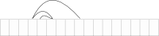
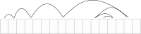
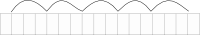
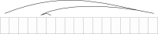
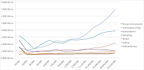
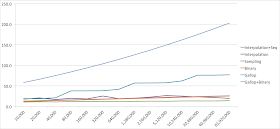

## 2 ROARING Bitmap

我们将32位索引`[0, n)`的范围划分为2^16^个整数块，这些整数共享相同的16位**最高有效位**（most significant digits）。我们使用专门的容器来存储它们的16位**最低有效位**（least significant bits）。

> When a chunk contains no more than 4096 integers, we use a sorted array of **==packed==** 16-bit integers. When there are more than 4096 integers, we use a 2^16^-bit bitmap. Thus, we have two types of containers: an array container for sparse chunks and a bitmap container for dense chunks. The 4096 threshold insures that at the level of the containers, each integer uses no more than 16 bits: we either use 2^16^ bits for more than 4096 integers, using less than 16 bits/integer, or else we use exactly 16 bits/integer.

当一个块包含的整数不超过4096个时，我们使用一个**==压缩的== 16 位整数的有序数组**。当超过4096个整数时，我们使用2^16^位**位图**。因此，我们有两种类型的容器：用于稀疏块的数组容器和用于密集块的位图容器。==<u>4096阈值确保在容器级别，每个整数使用不超过16位：对于4096个以上的整数，我们使用2^16^位，使用少于16位/整数，或者我们正好使用16位/整数</u>==。

> The containers are stored in a dynamic array with the shared 16 most-significant bits: this serves as a first-level index. The array keeps the containers sorted by the 16 most-significant bits.We expect this first-level index to be typically small: when n = 1 000 000, it contains at most 16 entries. Thus it should often remain in the CPU cache. The containers themselves should never use much more than 8 kB.

**容器存储在动态数组中，共享的 <u>16 位</u>最高有效位作为第一级索引**。该数组使容器按16位**最高有效位**排序。我们期望这个第一级索引通常很小：当`n = 1,000,000`时，它最多包含16个==<u>条目</u>==。 因此它应该经常保留在CPU缓存中。 容器本身不应该使用超过8kB（的内存）。

> To illustrate the data structure, consider the list of the first 1000 multiples of 62, all integers [2^16^, 2^16^ + 100) and all even numbers in  [2 × 2^16^, 3 × 2^16^). When encoding this list using the Concise format, we use one 32-bit fill word for each of the 1000 multiples of 62, we use two additional fill words to include the list of numbers between 2^16^ and 2^16^ + 100, and the even numbers in [2 × 2^16^, 3 × 2^16^) are stored as literal words. In the Roaring format, both the multiples of 62 and the integers in [216; 216 + 100) are stored using an array container using 16-bit per integer. The even numbers in  [2 × 2^16^, 3 × 2^16^)are stored in a 2^16^-bit bitmap container. See Fig. 1.

为了说明数据结构，考虑前1000个62倍数的列表、[2^16^, 2^16^ + 100)之间所有的整数和 [2 × 2^16^, 3 × 2^16^)之间所有的偶数。当使用 **Concise** 的格式编码此列表时，对1000个62的倍数使用一个32位的填充字，使用两个额外的填充字来包括2^16^到2^16^ + 100之间的数字列表，[2 × 2^16^, 3 × 2^16^)中的偶数存储为文字。在**Roaring**的格式中，用**16位整数**的数组（`short []`）来存储1000个62的倍数和[2^16^, 2^16^ + 100)中的所有整数。 [2 × 2^16^, 3 × 2^16^)中的偶数存储在2^16^位的位图容器中。见图1。

> ==TODO：==Figure 1. Roaring bitmap containing the list of the first 1000 multiples of 62, all integers [2^16^,  2^16^ + 100)  and all even numbers in [2 × 2^16^, 3 × 2^16^). 

> Each Roaring container keeps track of its cardinality (number of integers) using a counter. Thus computing the cardinality of a Roaring bitmap can be done quickly: it suffices to sum at most  $\lceil n/2^{16} \rceil$ counters. It also makes it possible to support rank and select queries faster than with a typical bitmap: rank queries count the number of set bits in a range [0, i] whereas select queries seek the location of the ith set bit.

每个Roaring容器使用计数器跟踪其基数（整数的个数）。 因此，可以快速完成计算Roaring 位图的基数：它最多对  $\lceil n/2^{16} \rceil$ 个计数器求和。与传统的位图相比，它还可以更快地支持排名和选择查询：**排名查询**计算[0, i]中的设置位数，而**选择查询**返回第 i 个设置位的整数。

>  **rank query（排名查询）**：给定一个整数 `x`，返回集合内 `<=x`  的整数个数。

> The overhead due to the containers and the dynamic array means that our memory usage can exceed 16 bits/integer. However, as long as the number of containers is small compared to the total number of integers, we should never use much more than 16 bits/integer. We assume that there are far fewer containers than integers. More precisely, we assume that the density typically exceeds 0.1% or that `n/|S| > 0.001`. When applications encounter integer sets with lower density (less than 0.1%), a bitmap is unlikely to be the proper data structure.

由容器和动态数组引起的开销意味着我们的内存使用量可能超过16位/整数。但是，只要容器的数量比整数的总数少，我们就不应该使用超过16位/整数。我们假设容器远少于整数个数。更确切地说，我们假设密度通常超过**0:1%**，或者`n/|S| > 0.001`。当应用程序遇到密度较低（小于**0:1%**）的整数集时，位图可能不是正确的数据结构。

> The presented Roaring data layout is intentionally simple. Several variations are possible. For very dense bitmaps, when there are more than 2^16^ - 4096 integers per container, we could store the locations of the zero bits instead of a 2^16^-bit bitmap. Moreover, we could better compress sequences of consecutive integers. We leave the investigation of these possibilities as future work.

呈现的Roaring数据布局非常简单，有几种可能的变化。对于非常密集的位图，当每个容器的整数个数超过2^16^ - 4096时，可以存储零位的位置而不是2^16^位的位图。而且，我们可以更好地压缩连续整数的序列。对这些可能性的调查是我们未来的工作。

---
## 4. ROARING BITMAP

> For a detailed presentation of the original Roaring model, we refer the interested reader to Chambi et al. [7]. We summarize the main points and focus on the new algorithms and their implementations.

有关原始Roaring模型的详细介绍，请感兴趣的读者参阅 Chambi 等人的论文[7]。 这里总结了要点，但重点关注新算法及其实现。

> Roaring bitmaps are used to represent sets of 32-bit unsigned integers. At a high level, a Roaring bitmap implementation is a key-value data structure where each key-value pair represents the set S of all 32-bit integers that share the same most significant 16 bits. The key is made of the shared 16 bits, whereas the value is a container storing the remaining 16 least significant bits for each member of S. No container ever uses much more than 8 kB of memory. Thus, several such small containers fit in the L1 CPU cache of most processors: the last Intel desktop processor to have less than 64 kB of total (data and code) L1 cache was the P6 created in 1995, whereas most mobile processors have 32 kB (e.g., NVidia, Qualcomm) or 64 kB (e.g., Apple) of total L1 cache.

Roaring位图用于表示**32位无符号整数**的集合。在高层，Roaring位图实现了一个键值数据结构，每个**键值对**（key-value）表示**最高16位相同**的**32位整数的集合**。**键**（key）由共享的16位组成，而**值**（value）是一个容器，用于存储S中每个成员剩下的16个最低有效位。任何容器都不会使用超过**8KB**的内存。因此，几个这样的小容器适合大多数CPU的**L1缓存**，**最后一个L1缓存的总和（数据和代码）小于64 KB的英特尔台式机处理器是1995年的P6**，而大多数移动处理器的L1缓存总和有**32KB**（例如NVidia，Qualcomm）或**64KB**（例如Apple）。

> In our actual implementation, the key-value store is implemented as two arrays: an array of packed 16-bit values representing the keys and an array of containers. The arrays expand dynamically in a standard manner when there are insertions. Alternatively, we could use a tree structure for faster insertions, but we expect Roaring bitmaps to be immutable for most of the life of an application. An array minimizes storage.

在我们的实际实现中，键值存储实现为两个数组：一个16位的整数数组表示键（`short[] keys`）和一个容器数组（Container[] values）。插入时，数组以标准方式动态扩展。尽管可以使用树结构来加快插入速度，但我们预计Roaring位图在应用程序的大部分生命周期中都是不可变的，数组最大限度地减少了内存需求。

> 实际代码是 `char[] keys`，Java 中 [char 是 16 位](https://stackoverflow.com/questions/24095187/char-size-8-bit-or-16-bit)。

> In a system such as Druid, the bitmaps are created, stored on disk and then memory-mapped as needed. When we serialize the bitmaps, we interleave with the 16-bit keys, the cardinalities of the corresponding containers: cardinalities are stored as 16-bit values (indicating the cardinality minus one). If needed, we also use an uncompressed bitmap containing at least one bit per container to indicate whether the corresponding container is a run container.

像Druid这样的系统，创建位图，存储在磁盘上，然后根据需要进行内存映射。序列化位图时，16位的键值和对应容器的基数交错存储，基数存储为16位值（表示基数减去1）。如果需要，我们还使用一个压缩的位图，其中每个容器至少用一位，以指示相应的容器是否为行程容器。

> ==TODO==： keys 和 基数是如何存储的？

> The structure of each container is straightforward (by design):
>
> - A bitmap container is an object made of 1024 64-bit words (using 8 kB) representing an uncompressed bitmap, able to store all sets of 16-bit integers. The container can be serialized as an array of 64-bit words. We also maintain a counter to record how many bits are set to 1. 
>
>    **In some cases**, the range of values might not cover the full range [0, 216) and a smaller bitmap might be sufficient—thus improving compression. However, the bitmap containers would then need to grow and shrink dynamically. For simplicity, we use fixed-size bitmap containers. 
>
>    **Counting the number of 1-bits** in a word can be relatively expensive if done naïvely, but modern processors have bit-count instructions—such as popcnt for x64 processors and cnt for the 64-bit ARM architecture—that can do this count using sometimes as little as a single clock cycle. According to our tests, using dedicated processor instructions can be several times faster than using either tabulation or other conventional alternatives [20]. Henceforth, we refer to such a function as bitCount: it is provided in Java as the Long.bitCount intrinsic. We assume that the platform has a fast bitCount function.
> - An array container is an object containing a counter keeping track of the number of integers,followed by a packed array of sorted 16-bit unsigned integers. It can be serialized as an array of 16-bit values. 
>
>    **We implement array** containers as dynamic arrays that grow their capacity using a standard approach. That is, we keep a count of the used entries in an underlying array that has typically some excess capacity. When the array needs to grow beyond its capacity, we allocate a larger array and copy the data to this new array. Our allocation heuristic is as follow: when the capacity is small (fewer than 64 entries), we double the capacity; when the capacity is moderate (between 64 and 1067 entries), we multiply the capacity by 3/2; when the capacity is large (1067 entries and more), we multiply the capacity by 5/4. Furthermore, we never allocate more than the maximum needed (4096) and if we are within one sixteenth of the maximum (> 3840), then we allocate the maximum right away (4096) to avoid any future reallocation. A simpler heuristic where we double the capacity whenever it is insufficient would be faster, but it would allocate on average (over all possible sizes) a capacity that exceeds the size by 50% whereas the capacity exceeds the size by only 13% in our model. In this sense, we trade speed for reduced memory usage. When the array container is no longer expected to grow, the programmer can use a trim function to copy the data to a new array with no excess capacity.
> - Our new addition, the run container, is made of a packed array of pairs of 16-bit integers. The first value of each pair represents a starting value, whereas the second value is the length of a run. For example, we would store the values 11, 12, 13, 14, 15 as the pair 11, 4 where 4 means that beyond 11 itself, there are 4 contiguous values that follow. In addition to this packed array, we need to maintain the number of runs stored in the packed array. Like the array container, the run container is stored in a dynamic array. During serialization, we write out the number of runs, followed by the corresponding packed array. 
>
>    **Unlike an array or bitmap container**, a run container does not keep track of its cardinality; its cardinality can be computed on the fly by summing the lengths of the runs. In most applications, we expect the number of runs to be often small: the computation of the cardinality should not be a bottleneck. 
>
>    **However**, as part of the serialization process, the cardinality of the run container is computed and stored. Hence, if we access the Roaring+Run bitmaps in their serialized form (as memorymapped bitmaps), the cardinality of run containers is pre-computed.
>

每个容器的结构都很简单（按设计）：

- **位图容器**是由1024个64位字（8 kB）组成的对象，表示未压缩的位图，能够存储全体16位整数。 容器以64位字数组的方式序列化。 还维护了一个计数器来记录多少位被设为1。
  
  某些情况，值的范围不会覆盖整个区间[0,2^16^)，小位图就够了，可以提高压缩率。 但位图容器需要动态增长和缩小。简单起见，我们使用固定大小的位图容器。
  
  简单地计算一个字中1的位数可能相对比较昂贵，但现代处理器有位计数指令，如，用于x64的`popcnt`和用于64位ARM的`cnt`，这些指令有时只需一个时钟周期就可以完成计数。根据测试，使用专用处理器指令比查表法和或其他传统替代方案[20]快几倍。后面我们称这样的函数为`bitCount`，Java以内置函数的方式（**intrinsic**）提供：`Long.bitCount`。我们假设平台有快速的`bitCount`功能。
- **数组容器**包含一个计数器，用于跟踪容器内整数的个数；一个有序的16位无符号整数的数组，按16位整数数组的方式序列化。
  
  我们将数组容器实现为动态数组，使用标准方法增加容量。也就是说，我们在底层数组中保留已使用条目的计数，这个数组通常具有一些冗余的容量。当数组需要超出其容量时，我们会分配一个更大的数组，并将数据复制到这个新数组。我们启发式的分配方法如下：容量很小（少于64）时，加倍容量；容量适中时（64到1067之间），容量乘以3/2；容量很大（大于等于1067）时，容量乘以5/4。此外，容量永远不会超过所需的最大值（4096），在最大值的十六分之一之内（>3840）时，按最大值（4096）分配，以避免后续的重新分配。<u>==更简单的启发式方法是，每次容量不足时翻倍会更快，但（在所有可能的大小上）会平均分配超过50％的容量；在我们的模型中，仅分配超过大小13%容量==</u>。从这个意义上讲，我们用速度来交换内存。数组容器不再增长时，可使用`trim`函数将数据复制到一个没有多余容量的新数组中。
- 新增的**行程容器**由16位**整数数组**组成，每两个一对，每对第一个值表示起始值，第二个值表示行程长度。例如，我们将值11、12、13、14、15存储为11、4，其中4表示除11之外，后面还有4个连续的值。除了这个数组之外，我们还需维护数组里的**行程数**。与数组容器一样，行程容器使用动态数组。序列化时，先输出行程数，再输出数组。
  
  与数组或位图容器不同，行程容器不跟踪其基数；通过对所有行程的长度求和，可以动态计算出其基数，预计在大多数应用程序中，行程数量通常很小，基数计算不应该成为瓶颈。
  
  但序列化时，会计算并存储行程容器的基数。因此，如果我们以序列化形式访问Roaring 行程位图（作为内存映射位图）时，行程容器的基数是预先计算好的。

> When starting from an empty Roaring bitmap, if a value is added, an array container is created. When inserting a new value in an array container, if the cardinality exceeds 4096, then the container is transformed into a bitmap container. On the other hand, if a value is removed from a bitmap container so that its size falls to 4096 integers, then it is transformed into an array container. Whenever a container becomes empty, it is removed from the top-level key-value structure along with the corresponding key.

从空的Roaring位图开始时，新增一个值，则会创建一个数组容器。向数组容器插入新值时，如果基数超过4096，则将容器转换为位图容器。另一方面，如果从位图容器中删除一个值，使其大小降至4096个整数，则将其转换为数组容器。每当容器变空时，它将与相应的键一起从顶层键值结构中删除。

> Thus, when first creating a Roaring bitmap, it is usually made of array and bitmap containers. Runs are not compressed. Upon request, the storage of the Roaring bitmap can be optimized using the runOptimize function. This triggers a scan through the array and bitmap containers that converts them, if helpful, to run containers. In a given application, this might be done prior to storing the bitmaps as immutable objects to be queried. Run containers may also arise from calling a function to add a range of values.

因此，首次创建 Roaring 位图时，通常由数组和位图容器组成，连续的整数不会压缩。 根据需要，使用 `runOptimize` 函数优化 Roaring 位图的存储。这会触发对数组和位图容器的扫描，如果有收益，将会把这些容器转换为行程容器。**在给定的应用程序中，可以在位图做为不可变对象、用于查询之前完成优化。调用函数添加一组连续区间内的值，也可能会产生行程容器**。

> To decide the best container type, we are motivated to minimize storage. In serialized form, a run container uses 2 + 4r bytes given r runs, a bitmap container always uses 8192 bytes and an array container uses 2c + 2 bytes, where c is the cardinality. Therefore, we apply the following rules:

为了确定最佳容器类型，我们要最小化存储。在序列化形式中，给定 r 个行程，行程容器使用**2 + 4r**字节；位图容器总是使用**8192**字节，数组容器使用**2c + 2**字节，其中c是基数。因此，我们采用以下规则：

> - **All array containers** are such that they use no more space than they would as a bitmap container: they contain no more than 4096 values. 
> - **Bitmap containers** use less space than they would as array containers: they contain more than 4096 values.
> - **A run container** is only allowed to exist if it is smaller than either the array container or the bitmap container that could equivalently store the same values. If the run container has cardinality greater than 4096 values, then it must contain no more than **⌈(8192 − 2)/4⌉ = 2047** runs. If the run container has cardinality no more than 4096, then the number of runs must be less than half the cardinality.
>

 - **所有数组容器**使用的空间都不会超过位图容器使用的空间：它们包含的值不超过4096。

 - **位图容器**中每个整数使用的空间比数组容器少：它们包含4096个以上的值。

 - **行程容器**允许存在的情况，可以等效存储相同的值，但使用的空间小于数组或位图容器时。如果行程容器的基数大于4096，则它的行程数不能超过**⌈(8192 − 2)/4⌉ = 2047** 。如果行程容器的基数不超过4096，则行程数必须小于基数的一半。

> **Counting the number of runs** A critical step in deciding whether an array or bitmap container should be converted to a run container is to count the number of runs of consecutive numbers it contains. For array containers, we count this number by iterating through the 16-bit integers and comparing them two by two in a straightforward manner. Because array containers have at most 4096 integers, this computation is expected to be fast. For bitmap containers, Algorithm 1 shows how to compute the number of runs. We can illustrate the core operation of the algorithm using a single 32-bit word containing 6 runs of consecutive ones:

**计算行程数**：决定是否应将数组或位图容器转换为行程容器的关键步骤是，它包含多少个**连续整数**。对于数组容器，我们通过迭代16位整数数组，并以简单的方式逐个比较它们来计算这个数字。 因为数组容器最多有4096个整数，所以预计这个计算会很快。对于位图容器，算法1显示如何计算行程个数，我们可以用包含6组连续整数的32位字来说明算法的核心操作：

```shell
                Ci = 000111101111001011111011111000001,
            Ci ≪ 1 = 001111011110010111110111110000010,
(Ci ≪ 1) ANDNOT Ci = 001000010000010100000100000000010.
```

> We can verify that bitCount((Ci ≪ 1) ANDNOT Ci) = 6, that is, we have effectively computed the number of runs. In the case where a run continues up to the left-most bit, and does not continue in the next word, it does not get counted, but we add another term ((Ci ≫ 63) ANDNOT Ci+1 when using 64-bit words) to check for this case. We use only a few instructions for each word. Nevertheless, the computation may be expensive—exceeding the cost of computing the union or intersection between two bitmap containers. Thus, instead of always computing the number of runs exactly, we rely on the observation that no bitmap container with more than 2047 runs should be converted. As soon as we can produce a lower bound exceeding 2047 on the number of runs, we can stop. An exact computation of the number of runs is important only when our lower bound is less than 2048. We found that a good heuristic is to compute the number of runs in blocks of 128 words using a function inspired by Algorithm 1. We proceed block by block. As soon as the number of runs exceeds the threshold, we conclude that converting to a run container is counterproductive and abort the computation of the number of runs. We could also have applied the optimization to array containers as well, stopping the count of the number of runs at 2047, but this optimization is likely less useful because array containers have small cardinality compared to bitmap containers. A further possible optimization is to omit the last term from the sum in line 5 of Algorithm 1, thus underestimating the number of runs, typically by a few percent, but by up to 1023 in the worst case. Computing this lower bound is nearly twice as fast as computing the exact count in our tests using a recent Intel processor (Haswell microarchitecture).

可以验证 **bitCount((C~i~ ≪ 1) ANDNOT C~i~) = 6**，也就是说，我们已经有效地计算了行程个数。如果连续整数持续到最高有效位，但没在下一个字中继续，则丢失了一个计数。但是我们添加另一个算式（假设使用64位字，**(C~i~ ≫ 63) ANDNOT C~i+1~**）检查这种情况。每个字只需要使用几条指令，然而计算成本可能比较高，超过计算两个位图容器之间并集或交集的成本。因此，并不是每次都精确地计算行程个数，而是依赖于这样的观察：行程个数超过2047的位图容器不应该被转换。一旦行程个数的下限超过2047，算法就可以停止了。只有当下限小于2048时，精确计算行程个数才重要。我们发现一个好的启发式方法来使用算法1中的函数：每次计数128个字（1KB）的行程个数，一块块地计算。一旦行程个数超过阈值，就得出结论：转换为行程容器会适得其反，中止计算。我们也可以将该优化应用于数组容器，在到达2047个行程个时停止，但这种优化可能不太有用，因为与位图容器相比，数组容器具有较小的基数。另一种可能的优化方法是从算法1第5行的求和中省略最后一项，少估行程个数，通常为百分之几，最坏的情况是最多少算1023，使用最近的英特尔处理器（Haswell微架构）测试，计算这个下限的速度几乎是精确计数的两倍。

```bash
# 算法1. 用于计算位图中行程个数的函数。
# 左移和右移运算符（≪ 和≫ ）将字中的所有位移动指定的位数，以零补位。
# 按照惯例，C≫63是该字最后一位的值（1或0）。我们使用按位AND NOT运算符。
1: input: bitmap B as an array 1024 64-bit integers, C1 to C1024.
2: output: the number of runs r
3: r ← 0
4: for i ∈ {1, 2, . . . , 1023} do
5:   r ← r + bitCount((Ci ≪ 1) ANDNOT Ci)+(Ci ≫ 63) ANDNOT Ci+1
6: r ← r + bitCount((C1024 ≪ 1) ANDNOT C1024)+C1024 ≫ 63
7: return r
```

> Efficient conversions between containers are generally straightforward, except for conversions from a bitmap container to another container type. Converting from a bitmap to an array container is reviewed in Chambi et al. [7]. As for the conversion to run containers, we use Algorithm 2 to extract runs from a bitmap. It is efficient as long as locating the least significant 1-bit in a word is fast. Thankfully, recent processors include fast instructions to find the index of the least significant 1-bit in a word or, equivalently, of the number of trailing zeros (bsf or tzcnt on x64 processors, rbit followed by clz on ARM processors). They are accessible in Java through the Long.numberOfTrailingZeroes intrinsic. To locate the index of the least significant 0-bit, we negate the word, and then seek the least significant 1-bit. Otherwise the algorithm relies on inexpensive bit-manipulation techniques.

除了从位图容器转换为其他容器类型之外，容器之间的有效转换通常很简单。Chambi等人回顾了从位图到数组容器的转换[7]。至于转换为行程容器，我们使用算法2从位图中提取连续整数。只要能快速定位一个字中为1的最低有效位，它就有效。庆幸的是，最近的处理器包含快速指令，可用于查找一个字中为1的最低有效位，或者等效于求**尾随零**的数量（x64上的bsf或tzcnt，ARM上的rbit，后面跟着clz）。在Java中，通过内在函数`Long.numberOfTrailingZeroes`访问这些指令。为了找到为0的最低有效位，我们对字求反，然后查找为1的最低有效位。否则，算法依赖于廉价的位操作技术。

```bash
# 算法2 将位图中为1的位转换为行程列表的算法。
# 我们假设两个补码的64位算术。使用按位AND和OR运算符
1: input: a bitmap B, as an array of 64-bit words C1 to C1024
2: output: an array S containing runs of 1-bits found in the bitmap B
3: Let S be an initially empty list
4: Let i ← 1
5: T ← C1
6: while i ≤ 1024 do
7:   if T = 0 then
8:      i ← i + 1
9:      T ← Ci
10:  else
11:    j ← index of least significant 1-bit in T (j ∈ [0, 64))
12:    x ← j + 64 × (i − 1)
13:    T ← T OR (T − 1)             # {all bits with indexes < j are set to 1}
14:    while i + 1 ≤ 1024 and T = 0xFFFFFFFFFFFFFFFF do
15:      i ← i + 1
16:      T ← Ci
17:    if T = 0xFFFFFFFFFFFFFFFF then
18:      y ← 64 × i = 65536         # {we have i = 1024}
19:    else
20:      k ← index of least significant 0-bit in T (k ∈ [0, 64))
21:      y ← k + 64 × (i − 1)
22:    append to S a run that goes from x (inclusively) to y (exclusively)
23:    T ← T AND T + 1              # {all bits with indexes < k are set to 0}
24: return S
```
## 5. 逻辑运算

### 5.1并集和交集

> There are many necessary logical operations, but we present primarily the union and intersection.They are the most often used, and the most likely operations to cause performance bottlenecks.

虽然有许多必要的逻辑运算，但我们主要介绍最常用的并集和交集，也是最可能导致性能瓶颈的操作。

> An important algorithm for our purposes is the **galloping intersection** (also called exponential intersection) to compute the intersection between two sorted arrays of sizes c1, c2. It has complexity O(min(c1, c2) log max(c1, c2)) [21]. In this approach, we pick the next available integer i from the smaller array and seek an integer at least as big in the larger array, looking first at the next available value, then looking twice as far, and so on, until we find an integer that is not smaller than i. We then use a binary search in the larger array to find the exact location of the first integer not lower than i. We call this process a galloping search, and repeat it with each value from the smaller array.

我们使用的一个重要算法是跳跃交集（**galloping intersection**，也称为**exponential intersection**，指数交集），用来计算两个大小分别为c1、c2的有序数组之间的交集。 复杂度**O(min(c1, c2) log max(c1, c2))** [21]。在这种方法中，从**较小的数组**中选择**第一个**可用的整数**i**，在**较大的数组**中查找一个不比**i**小的的整数：**首先**查看**第一个**可用值，然后翻倍查找距离，依此类推，直到找到一个不小于**i**的整数；然后在大数组查找第一个不小于**i**的整数的精确位置，我们称此过程为跳跃搜索（galloping search）。并用较小数组中的每个值重复此过程。

> A galloping search makes repeated random accesses in a container, and it could therefore cause expensive cache misses. However, in our case, the potential problem is mitigated by the fact that all our containers fit in CPU cache.

跳跃搜索在容器中进行重复的随机访问，因此可能导致昂贵的缓存丢失。然而，在我们的例子中，由于所有容器都可以装入CPU缓存，缓解了潜在的问题。

> Intersections between two input Roaring bitmaps start by visiting the keys from both bitmaps, starting from the beginning. If a key is found in both input bitmaps, the corresponding containers are intersected and the result (if non-empty) is added to the output. Otherwise, we advance in the bitmap corresponding to the smallest key, up to the next key that is no smaller than the key of the other bitmap, using galloping search.When one bitmap runs out of keys, the intersection terminates.

两个Roaring位图之间的交集操作，从访问两个位图的**第一个键**开始。如果在两个输入位图中都找到了一个键，则对应的容器将相交，并将结果（如果非空）添加到输出中。否则在对应最小键的位图中前进一步，在另一个位图中使用跳跃搜索，找到下一个不小于该值的键。当一个位图的键用完时，交集终止。

> ==TODO：==在这个场景下，galloping search的好处是什么？

> Unions between Roaring data structures are handled in the conventional manner: we iterate through the keys in sorted order; if a key is in both input Roaring bitmaps, we merge the two containers, add the result to the output and advance in the two bitmaps. Otherwise, we clone the container corresponding to the smaller key, add it to the output and advance in this bitmap. When one bitmap runs out of keys, we append all the remaining content of the other bitmap to the output.

Roaring数据结构之间的并集操作以传统方式处理：按排序顺序遍历键；如果一个键在两个Roaring位图中都存在，我们合并两个容器，将结果添加到输出中，两个位图都前进一步。否则，克隆较小键对应的容器，添加到输出中，并在此位图中前进。当一个位图的键用完时，将另一个位图剩余的所有内容追加到输出中。

> Though we do not use this technique, instead of cloning the containers during unions, we could use a copy-on-write approach whereas a reference to container is stored and used, and a copy is only made if an attempt is made to modify the container further. This approach can be implemented by adding a bit vector containing one bit per container. Initially, this bit is set to 0, but when the container cannot be safely modified without making a copy, it is set to 1. Each time the container needs to be modified, this bit needs to be checked. Whether the copy-on-write approach is worth the added complexity is a subject for future study. However, container cloning was never found to a significant computational bottleneck in the course of our development. It is also not clear whether there are applications where it would lead to substantial reduction of the memory usage. In any case, merely copying a container in memory can be several times faster than computing the union between two containers: copying containers is unlikely to be a major bottleneck.

虽然我们没使用copy-on-write方法来代替并集期间的容器克隆，此时存储容器的引用并使用之，只有在尝试进一步修改容器时才进行复制。可以通过添加一个位向量来实现该方法，每个容器1位，最初设置为0，但是当容器只有在复制后才能安全地修改时，此位设置为1。每次需要修改容器时，都需要检查该位。是否值得为了写时复制而增加复杂性是未来研究的主题。但是，在我们的开发过程中，从未发现克隆容器存在显着的计算瓶颈。还不清楚是否存在会导致内存使用量大幅减少的应用程序。在任何情况下，仅仅在内存中复制容器比在两个容器之间计算并集要快几倍：复制容器不太可能成为主要的瓶颈。

> 论文嘛，总有扯犊子的地方。

> We first briefly review the logical operations between bitmap and array containers, referring the reader to Chambi et al. [7] for algorithmic details.

我们首先简要回顾位图和数组容器之间的逻辑操作，读者参阅Chambi等人的论文[7]，以了解算法细节。

> - **Bitmap vs Bitmap**: To compute the intersection between two bitmaps, we first compute the cardinality of the result using the bitCount function over the bitwise AND of the corresponding pairs of words. If the intersection exceeds 4096, we materialize a bitmap container by recomputing the bitwise AND between the words and storing them in a new bitmap container. Otherwise, we generate a new array container by, once again, recomputing the bitwise ANDs, and iterating over their 1-bits. We find it important to first determine the right container type as, otherwise, we would sometimes generate the wrong container and then have to convert it—an expensive process. The performance of the intersection operation between two bitmaps depends crucially on the performance of the bitCount function.
>
>   ==**A union between**== two bitmap containers is straightforward: we execute the bitwise OR between all pairs of corresponding words. There are 1024 words in each container, so 1024 bitwise OR operations are needed. At the same time, we compute the cardinality of the result using the bitCount function on the generated words.
>

- **位图 vs 位图**：为了计算两个位图之间的交集，我们首先**按位AND**对应的字，然后使用`bitCount`函数计算其结果的基数。如果交集基数超过4096，重新按位AND对应的字，并将结果存储在新的位图容器中，否则，我们生成新的数组容器，仍然重新按位AND对应的字，遍历位图，将位为1对应的整数写回数组。我们发现首先确定正确的容器类型很重要，否则，我们有时会生成错误的容器，然后必须再转换它，这是一个昂贵的过程。 两个位图之间交集的性能主要取决于`bitCount`函数的性能。

  两个位图容器之间的并集很简单：在所有对应的字之间执行**按位OR**。每个容器有1024个字，因此需要1024个**按位OR**操作。同时，我们对生成的字使用`bitCount`函数计算结果的基数。

> - **Bitmap vs Array**: The intersection between an array and a bitmap container can be computed quickly: we iterate over the values in the array container, checking the presence of each 16-bit integer in the bitmap container and generating a new array container that has as much capacity as the input array container. The running time of this operation depends on the cardinality of the array container. Unions are also efficient: we create a copy of the bitmap and iterate over the array, setting the corresponding bits.

- **位图 vs 数组**：数组和位图容器之间的交集可以快速计算：遍历数组容器中每个16位整数，在位图容器中检查是否存在，并生成一个新数组容器，容量与输入数组容器相同。此操作的运行时间取决于数组容器的基数。并集也很有效：创建位图容器的副本，然后遍历数组容器设置相应的位。

> - **Array vs Array**: The intersection between two array containers is always a new array container.We allocate a new array container that has its capacity set to the minimum of the cardinalities of the input arrays. When the two input array containers have similar cardinalities c~1~ and c~2~ (c~1~/64 < c~2~ < 64c~1~), we use a straightforward merge algorithm with algorithmic complexity O(c~1~ + c~2~), otherwise we use a galloping intersection with complexity O(min(c~1~, c~2~) log max(c~1~, c~2~)) [21]. We arrived at this threshold (c~1~/64 < c~2~ < 64c~1~) empirically as a reasonable choice, but it has not been finely tuned. 
>
>   ==**For unions**==, if the sum of the cardinalities of the array containers is 4096 or less, we merge the two sorted arrays into a new array container that has its capacity set to the sum of the cardinalities of the input arrays. Otherwise, we generate an initially empty bitmap container. Though we cannot know whether the result will be a bitmap container (i.e., whether the cardinality is larger than 4096), as a heuristic, we suppose that it will be so. Iterating through the values of both arrays, we set the corresponding bits in the bitmap to 1. Using the `bitCount` function, we compute cardinality, and then convert the bitmap into an array container if the cardinality is at most 4096.
>
>   ==**Alternatively**==, we could be more conservative and predict the cardinality of the union on the assumption that the two containers have independently distributed values over the whole chunk range (2^16^ values). Besides making the code slightly more complicated, it is not likely to change the performance characteristics, as the naïve model is close to an independencebased model. Indeed, under such a model the expected cardinality of the intersection would be $\frac{c_1}{2^{16}}\times\frac{c_2}{2^{16}}\times2^{16} = \frac{c_1c_2}{2^{16}}$. The expected cardinality of the union would be $c_1+c_2-\frac{c_1c_2}{2^{16}}$. The maximal threshold for an array container is 4096, so we can set $c_1+c_2-\frac{c_1c_2}{2^{16}} = 4096$ and solve for $ c_1 $ as a function of c~2~: $c_1 = \frac{2^{16}(4096-c_2)}{2^{16}-c_2} $. In contrast, our simplistic model predicts a cardinality of $c_1 + c_2$ and thus a threshold at $c_1 = 4096 − c_2$. However, since $c_2 \leq 4096$, we have that $\frac{2^{16}}{2^{16}-c_2} = 1 + \frac{c_2}{2^{16}-c_2} \leq 1 + \frac{4096}{2^{16}-4096} = 1.0667$. That is, for any fixed value of one container (c~2~ here), the threshold on the cardinality of the other container, beyond which we predict a bitmap container, is at most 6.67% larger under an independence-based estimate, compared with our naïve approach.
>

- **数组 vs 数组：**两个数组容器之间的交集始终是一个新的数组容器。我们分配一个新的数组容器，其容量设置为输入数组基数的最小值。当两个输入数组容器具有相似的基数c1和c2（c~1~/64 < c~2~ < 64c~1~）时，我们使用一个直接的合并算法，算法复杂度 O(c~1~ + c~2~)，否则我们使用跳跃交集[21]，复杂度O(min(c~1~, c~2~) log max(c~1~, c~2~)) 。我们根据经验得出的阈值（c~1~/64 < c~2~ < 64c~1~）是一个合理的选择，但没有经过精心调整。

  对于并集，如果数组容器的基数之和小于等于4096，我们将两个已排序的数组合并为一个新的数组容器，其容量设置为输入数组的基数之和。否则，我们生成一个最初为空的位图容器。虽然我们不知道结果是否是位图容器（即基数是否大于4096），<u>==但作为一种启发式方法，我们认为是这样==</u>。遍历两个数组，将位图中相应位设置为1。使用`bitCount`函数计算基数，如果基数最多为4096，则将位图转换为数组容器。

  或者，我们可以更保守，在假设两个容器在整个块范围内具有独立分布（2^16^个）值的情况下，预测并集的基数。除了使代码稍微复杂一点之外，不太可能改变性能特征，因为简单模型接近于基于独立的模型。实际在独立模型下，交集的期望基数为$\frac{c_1}{2^{16}}\times\frac{c_2}{2^{16}}\times2^{16} = \frac{c_1c_2}{2^{16}}$。并集的预期基数为 $c_1+c_2-\frac{c_1c_2}{2^{16}}$。数组容器最大阈值是4096，因此我们可以设置$c_1+c_2-\frac{c_1c_2}{2^{16}} = 4096$，将c~1~作为c~2~函数$c_1 = \frac{2^{16}(4096-c_2)}{2^{16}-c_2} $求解。相反，我们的简化模型预测基数为$c_1 + c_2$，因此$c_1 = 4096 − c_2$，然而，因为 $c_2 \leq 4096$，我们有 $\frac{2^{16}}{2^{16}-c_2} = 1 + \frac{c_2}{2^{16}-c_2} \leq 1 + \frac{4096}{2^{16}-4096} = 1.0667$。也就是说对于一个基数是c~2~的容器，与基于独立性的估计相比，简单方法（预测位图容器超过此阈值）预测的另一个容器的基数阈值最多增加了6.67％。

> Given array and bitmap containers, we need to have them interact with run containers. For this purpose, we introduced several new algorithms and heuristics.

数组和位图容器需要和行程容器交互。 为此，我们引入了几种新算法和启发式算法。

> - **Run vs Run**: When computing the intersection between two run containers, we first produce a new run container by a simple intersection algorithm. This new run container has its capacity set to the sum of the number of runs in both input containers. The algorithm starts by considering the first run, in each container. If they do not overlap, we advance in the container where the run occurs earlier until they do overlap, or we run out of runs in one of the containers. When we run out of runs in either container, the algorithm terminates. When two runs overlap, we always output their intersection. If the two runs end at the same value, then we advance in the two run containers. Otherwise, we advance only in the run container that ends first. Once we have computed the answer, after exhausting the runs in at least one container, we check whether the run container should be converted to either a bitmap (if it has too many runs) or to an array container (if its cardinality is too small compared to the number of runs). 
> 
>   ==**The union algorithm**== is also conceptually simple. We create a new, initially empty, run container that has its capacity set to the sum of the number of runs in both input containers. We iterate over the runs, starting from the first run in each container. Each time, we pick a run that has a minimal starting point. We append it to the output either as a new run, or as an extension of the previous run. We then advance in the container where we picked the run. Once a container has no more runs, all runs remaining in the other container are appended to the answer. After we have computed the resulting run container, we convert the run container into a bitmap container if too many runs were created. Checking whether such a conversion is needed is fast, since it can be decided only by checking the number of runs. There is no need to consider conversion to an array container, because every run present in the original inputs is either present in its entirety, or as part of an even larger run. Thus the average run length (essentially our criterion for conversion) is at least as large as in the input run containers.

- **行程 vs 行程**：计算两个行程容器之间的交集时，我们首先通过简单的交集算法生成一个新的行程容器。新行程容器的容量设置为两个行程容器中行程个数的总和。算法首先考虑每个容器中的第一个行程，如果它们没有重叠，我们在行程值较小的容器中前进，直到它们重叠为止，或者其中一个容器中遍历结束。任一个行程容器遍历结束，算法终止。当两个行程重叠时，我们总是输出它们的交集。如果两个运行以相同的值结束，那么两个行程容器都前进一步。否则，行程首先结束的容器前进一步。至少一个容器遍历结束后，计算交集过程结束，我们检查行程容器是否应该转换为位图（如果有太多的行程）或者转换为数组容器（如果与行程数相比，基数太小）。

  并集算法在概念上也很简单。我们创建一个新的，最初为空的行程容器，其容量设置为两个输入容器的行程数之和。从每个容器的第一个行程开始遍历，每次，选择一个起始值最小的行程，将它**作为新行程，或作为前一个行程的扩展**追加到新行程容器中。然后，在选择了行程的容器中前进一步。一旦遍历完一个容器中的所有行程，输出另一个容器中剩余的所有行程。在计算得到行程容器后，如果创建了太多的行程，我们会将行程容器转换为位图容器。检查是否需要这样的转换很快，因为只需检查行程数就可确定。<u>无需考虑转换为数组容器，因为原始输入中存在的每个行程，要么完整存在，要么作为更大行程的一部分存在。因此，平均行程长度（基本上是我们的转换标准）至少与输入行程容器中的一样大</u>。

>  - **Run vs Array**: The intersection between a run container and an array container always outputs an array container. This choice is easily justified: the result of the intersection has cardinality no larger than the array container, and it cannot contain more runs than the array container. We can allocate a new array container that has its capacity set to the cardinality of the input array container. Our algorithm is straightforward. We iterate over the values of the array, simultaneously advancing in the run container. Initially, we point at the first value in the array container and the first run in the run container. While the run ends before the array value, we advance in the run container. If the run overlaps the array value, the array value is included in the intersection, otherwise it is omitted.
>
>    ==**Determining the best container**== for storing the union between a run container and an array is less straightforward. We could process the run container as if it were an array container, iterating through its integers and re-use our heuristic for the union between two array containers. Unfortunately, this would always result in either an array or bitmap container. We found that it is often better to predict that the outcome of the union is a run container, and to convert the result to a bitmap container, if we must. Thus, we follow the heuristic for the union between two run containers, effectively treating the array container as a run container where all runs have length one. However, once we have computed the union, we must not only check whether to convert the result to a bitmap container, but also, possibly, to an array container. This check is slightly more expensive, as we must compute the cardinality of the result.

- **行程 vs 数组**：行程容器和数组容器之间的交集总是输出数组容器。这种选择很容易证明：交集的基数不大于数组容器，并且它不能包含比数组容器更多的行程。分配一个新的数组容器，容量设置为输入数组容器的基数。算法很简单，遍历数组，同时在行程容器中前进。最初，指向数组容器中的第一个值和行程容器中的第一个行程。如果行程的最大值小于数组值，行程容器前进一步。如果行程与数组值重叠，则数组值包含在交集中，否则将省略。

  确定行程容器和数组容器之间并集的最佳容器不那么简单。可以像处理数组容器一样处理行程容器，遍历容器的每个整数，并重用两个数组容器并集的启发式算法。不幸的是，总是导致为数组或位图容器。我们发现预测并集的结果为行程容器通常更好，如果必须的话，还可以将结果转换为位图容器。因此，我们遵循两个运行容器之间并集的启发式方法，将数组容器视之为等效的运行容器，所有行程的长度都为1。然而一旦计算了并集，不仅要检查是否要将结果转换为位图容器，还要检查是否可能转换为数组容器。 这个检查稍贵一些，因为我们必须计算结果的基数。

>  - **Run vs Bitmap**: The intersection between a run container and a bitmap container begins by checking the cardinality of the run container. If it is no larger than 4096, then we create an initially empty array container. We then iterate over all integers contained in the run container, and check, one by one, whether they are contained in the bitmap container: when an integer is found to be in the intersection, it is appended to the output in the array container. The running time of this operation is determined by the cardinality of the run container. Otherwise, if the input run container is larger than 4096, then we create a copy of the input bitmap container. Using fast bitwise operations, we set to zero all bits corresponding to the complement of the run container (see Algorithm 3). We then check the cardinality of the result, converting to an array container if needed.

>    ==**The union between**== a run container and a bitmap container is computed by first cloning the bitmap container.We then set to one all bits corresponding to the integers in the run container, using fast bitwise OR operations (see again Algorithm 3).

>    ==**In some instances**==, the result of an intersection or union between two containers could be most economically represented as a run container, even if we generate an array or bitmap container. It is the case when considering the intersection or union between a run container and a bitmap container. We could possibly save memory and accelerate later computations by checking whether the result should be converted to a run container. However, this would involve keeping track of the number of runs—a relatively expensive process.

- **行程 vs 位图**：行程容器和位图容器之间的交集从检查行程容器的基数开始，如果不大于4096，那么将创建一个空数组容器。然后，我们遍历行程容器中包含的所有整数，并逐个检查是否包含在位图容器中，当发现一个整数在交集中时，输出到数组容器。此操作的运行时间由行行程容器的基数决定。如果行程容器的基数大于4096，则创建输入位图容器的副本。<u>使用快速按位操作，我们将行程容器两个行程之间空隙对应的所有位设置为零</u>（参见算法3）。然后检查结果的基数，需要时转换为数组容器。

  行程容器和位图容器之间的并集，首先克隆位图容器。然后，使用快速按位OR操作将行程容器中的整数对应的所有位设置为1（请参见算法3）。

  在某些情况下，两个容器之间的交集或并集的结果可以最经济地表示为行程容器，即使我们生成一个数组或位图容器也是如此。考虑行程容器和位图容器之间的交集或并集时就是这样情况。我们可以通过检查结果是否应该转换为运行容器来节省内存并加速后面的计算。<u>然而，这需要跟踪行程的数量——一个相对昂贵的过程</u>。


> ==TODO：==  算法3

> Furthermore, we added the following optimization. Whenever we compute the union between a run container and any other container, we first check whether the run container contains a single run filling up the whole space of 16-bit values ([0, 2^16^)). In that case, the union must be the other container and we can produce optimized code accordingly. The check itself can be computed in a few inexpensive operations. This simple optimization accelerates the possibly common case where there are extremely long runs of ones that span multiple containers.

此外，我们添加以下优化。每当我们计算一个行程容器和任何其他容器之间做并集时，我们首先检查行程容器是否只包含一个行程，即填充了16位整数[0，2^16^)的整个空间。在这种情况下，并集必须是行程容器，可以相应地生成优化的代码。检查本身是廉价的操作，这种简单的优化加速了可能的常见情况，即存在跨越多个容器，极长行程的情况。

> The computation of the intersection is particularly efficient in Roaring when it involves a bitmap container and either an array container or a run container of small cardinality. It is also efficient when intersecting two array containers, with one having small cardinality compared to the other, as we use galloping intersections. Moreover, by design, Roaring can skip over entire chunks of integers, by skipping over keys that are present in only one of the two input bitmaps. Therefore, Roaring is well suited to the problem of intersecting a bitmap having a small cardinality with bitmaps having larger cardinalities. In contrast, RLE-based compression (as in WAH or Concise) offers fewer opportunities to skip input data.

当位图容器和数组容器或者基数较少的行程容器做交集时，在Roaring中的计算特别有效。两个数组容器做交集，其中一个与另一个相比基数较小时，也很有效，因为我们使用跳跃相交。此外按设计，Roaring可以跳过整块整数，跳过仅存在于一个输入位图中的键。 因此，Roaring非常适合于小基数的位图与较大基数的位图相交， 相比之下，基于RLE的压缩（如WAH或Concise）跳过输入数据的机会更少。

> The computation of the union between two Roaring bitmaps is particularly efficient when it involves run containers or array containers being intersected with bitmap containers. Indeed, these computations involve almost no branching and minimal data dependency, and they are therefore likely to be executed efficiently on superscalar processors. RLE-based compression often causes many data dependencies and much branching.

当涉及运行容器或数组容器与位图容器相遇时，计算两个Roaring位图之间的并集特别有效。 实际上，这些计算几乎不涉及分支和最小数据依赖性，因此它们很可能在超标量处理器上有效地执行。 基于RLE的压缩通常会导致许多数据依赖性和大量分支。

> Another feature of Roaring is that some of these logical operations can be executed in place. In-place computations avoid unnecessary memory allocations and improve data locality.

Roaring的另一个特点是，其中一些逻辑操作可以**就地执行**。**就地计算**避免了不必要的内存分配，并改善数据局部性。

> - The union of a bitmap container with any other container can be written out in the input bitmap container. The intersection between two bitmap containers, or between a bitmap container and some run containers, can also be written out to an input bitmap container.
- 位图容器与任何其他容器做并集，可以在输入位图容器中写入。两个位图容器之间的交集，或者位图容器和某些行程容器之间的交集，也可以写到一个输入位图容器中。
> - Though array containers do not support in-place operations, we find it efficient to support in-place unions in a run container with respect to either another run container or an array container. In these cases, it is common that the result of the union is either smaller or not much larger than combined sizes of the inputs. The runs in a run container are stored in a dynamic array that grows as needed and typically has some excess capacity. So we first check whether it would be possible to store both the input run container and the output (whose size is bounded by the sum of the inputs). Otherwise, we allocate the necessary capacity. We then shift the data corresponding to the input run container from the beginning of the array to the end. That is, if the input run container had r runs, they would be stored in the first 4r bytes of an array, and we would copy them to the last 4r bytes of the array—freeing the beginning of the array. We write the result of the union at the beginning of the array, as usual. Thus, given enough capacity, this approach enables repeated unions to the same run container without new memory allocation. We trade the new allocation for a copy within the same array. Since our containers can fit in CPU cache, such a copy can be expected to be fast. We could, similarly, enable in-place intersections within run or array containers.
- **虽然数组容器不支持就地操作**，但我们发现，行程容器和数组容器与另一个行程容器做并集时，就地并集是有效的。在这些情况下，并集的结果通常比输入的组合大小更小或大得不多。行程容器中的行程保存在动态数组中，该数组根据需要增长，并且通常具有一些过剩容量。因此，我们首先检查是否可以存储行程容器的输入和输出（输出大小受输入==总和==限制）。否则，我们分配必要的容量。然后，将输入行程容器相对应的数据从数组头移动到数组尾。也就是说，如果输入运行容器有r个行程，它们将存储在数组的前4r个字节中，把它们复制到数组的最后4r字节，释放数组头。像往常一样，我们在数组的开头写入并集的结果。因此，如果有足够的容量，这种方法可以在没有分配新内存的情况下，重复使用同一个行程容器。我们用**在同个一数组中的拷贝**交换**新内存分配**，因为我们的容器可以放在CPU缓存中，所以这样的复制可能会很快。类似地，我们可以在行程或数组容器中启用就地交集。

> A common operation in applications is the aggregation of a long list of bitmaps. When the problem is to compute the intersection of many bitmaps, we can expect a naïve algorithm to work well with Roaring: we can compute the intersection of the first two bitmaps, then intersect the result with the third bitmap, and so forth. With each new intersection, the result might become smaller, and Roaring can often efficiently compute the intersection between bitmap having small cardinality and bitmaps having larger cardinalities, as already stated. Computing the union of many bitmaps requires more care. As already remarked in Chambi et al. [7], it is wasteful to update the cardinality each and every time when computing the union between several bitmap containers. Though the bitCount function is fast, it can still use a significant fraction of the running time: Chambi et al. [7] report that it reduces the speed by about 30%. Instead, we proceed with what we call a “lazy union”. We compute the union as usual, except that some unions between containers are handled differently:

应用程序中的一个常见操作是聚合一长串位图。当计算多个位图的交集时，可以期望一个简单的算法与Roaring很好地协作：我们可以计算前两个位图的交集，然后将结果与第三个位图做交集，等等。对于每个新的交集，结果可能会变小，并且如前所述，Roaring通常可以有效地计算小基数位图与更大基数位图之间的交集。计算多个位图的并集需要更多的注意。如Chambi等人[7]所述，在计算多个位图容器之间的并集时，每次都更新基数是浪费的。虽然`bitCount`功能很快，但它仍然可以占用大部分的运行时间：Chambi等人 [7]报告其速度降低了约30%。相反，我们继续进行所谓的“延迟并集”，像往常一样计算并集，只是容器之间的一些并集的处理方式不同：

> - The union between a bitmap container and any other container type is done as usual, that is, we compute the resulting bitmap container, except that we do not attempt to compute the cardinality of the result. Internally, the cardinality is set to the flag value “-1”, indicating that the cardinality is currently unknown.
> - When computing the union of a run container with an array container, we always output a run container or, if the number of runs is too great, a bitmap container—even when an array container might be smaller.

- 位图容器和任何其他容器类型之间的并集照常完成，也就是说并集得到位图容器，只是不尝试计算结果的基数。在内部，基数设置为标志值“-1”，表示基数当前未知。

- 在计算行程容器与数组容器的并集时，我们总是输出一个行程容器；或者，如果行程数太大，即使数组容器可能更小，都只输出一个位图容器。

> After the final answer is generated, we “repair it” by computing the cardinality of any bitmap container, and by checking whether any run container should be converted to an array container. For even greater speed, we could even make this repair phase optional and skip the computation of the cardinality of the bitmap containers.

生成最终答案后，通过计算位图容器的基数来“修复它”，并检查是否应将行程容器转换为数组容器。 为了更快的速度，我们甚至可以使这个修复阶段成为可选，即跳过对位图容器基数的计算。

> We consider two strategies to compute the union of many bitmaps. One approach is a naïve two-by-two union: we first compute the union of the first two bitmaps, then the union of the result and the third bitmap and so forth, doing the computation in-place if possible. The benefit of this approach is that we always keep just one intermediate result in memory. In some instances, however, we can get better results with other algorithms. For example, we can use a heap: put all original bitmaps in a min-heap, and repeatedly poll the two smallest bitmaps, compute their union, and put them back in the heap, as long as the heap contains more than one bitmap. This approach may create many more intermediate bitmaps, but it can also be faster in some instances. To see why that must be the case, consider that the complexity of the union between two bitmaps of size B is O(B), generating a result that might be of size 2B. Thus, given N bitmaps of size B, the naïve approach has complexity O(BN^2^), whereas the heap-based approach has complexity O(BN logN). However, this computational model, favourable to the heap-based approach, does not always apply. Indeed, suppose that the bitmaps are uncompressed bitmaps over the same range of values—as is sometimes the case when Roaring bitmaps are made of bitmap containers. In that case, the computation of a union between two bitmaps of size B has complexity O(B), and the output has size B. We have that both algorithms, naïve and heap-based, have the same optimal O(BN) complexity. However, the naive algorithm has storage requirements in O(B) whereas the heap-based algorithm’s storage requirements are in O(BN), indicating that the latter might have worse performance. We expect that whether one algorithm or the other has better running time is data and format dependent, but in actual application, it might be advantageous to use the naïve algorithm if one wishes to have reduced memory usage.

我们考虑两种策略来计算大量位图的并集。一种方法是简单的“两个两个”的并集：我们首先计算前两个位图的并集，然后计算结果和第三个位图的并集，依此类推，如果可能的话进行**就地计算**。这种方法的好处是我们总是在内存中只保留一个中间结果。然而，在某些情况下，我们可以用其他算法得到更好的结果。例如，我们可以使用堆：将所有原始位图放在**最小堆**中，并重复轮询两个最小的位图，计算它们的并集，然后将它们放回堆中，只要堆包含多个位图。这种方法可以创建更多中间位图，但在某些情况下也可以更快。要了解为什么必须如此，请考虑大小为B的两个位图之间的并集的复杂性为O(B)，从而生成可能大小为2B的结果。因此，大小为B的N个位图，简单方法的复杂度O(BN^2^)，而基于堆的方法复杂度O(BN logN)。然而，这种有利于基于堆的方法的计算模型并不总是适用。实际上，假设位图是在相同值范围内的未压缩位图，Roaring位图有时就是由位图容器构成。在这种情况下，计算大小为B的两个位图之间并集的计算复杂度O(B)，并且输出具有大小B，我们已经知道两种算法（简单的和基于堆的）具有相同的最优O(BN) 复杂度。然而，简单算法的存储要求是O(B)，而基于堆的算法的存储要求是O(BN)，表明后者可能具有更差的性能。我们预期一种算法或另一种算法具有更好的运行时间是依赖于数据和格式的，但是在实际应用中，如果希望减少内存使用，则使用简单算法可能是有利的。

### 5.2 其它操作

> We make available a single software library encompassing both the original Roaring and Roaring+Run (see § 6.2). We provide optimized implementations of many useful functions.

我们提供一个包含原始 Roaring 和 Roaring + 行程容器的软件库（见第6.2节）。 我们提供了许多有用函数的优化实现。

> A logically complete set of operations enables Roaring to be used, via the **bit-slicing** approach [22], to realize arbitrary Boolean operations. Thus, our Roaring software supports negation, although it uses the more general flip approach of Java’s BitSet class, wherein negation occurs only within a range. Besides adding more flexibility, this approach means that there is no need to know the actual **universe size**, in the case when the bitset is intended to be over a smaller **universe** than 0 to 2^32^ − 1. The flip function in Roaring first determines the affected containers. The containers found are flipped; those becoming empty are removed. Missing containers that fall entirely within the range are replaced by “full” run containers (a single run from 0 to 2^16^). When applied to an array container, the flip function uses a binary search to first determine all values contained in the range. We can then determine whether the result of the flip should be an array container or a bitmap container. If the output is an array container, then the flip can be done inplace, assuming that there is enough capacity in the container, otherwise a new buffer is allocated. ==If the output must be a bitmap container, the array container is converted to a bitmap container and flipped. Flipping a bitmap container can be done in-place, if needed, using a procedure similar to Algorithm 3.== In flipping a run container, we always first compute the result as a run container. ==When the container’s capacity permits, an in-place flip avoids memory allocation. This should be a common situation, because flipping increases the number of runs by at most one.== Thus, there is a capacity problem only when the number of runs increases and the original runs fit exactly within the array. **A simple case-based analysis reveals whether the flipped run container requires an extra run. Suppose we flip the range [a, b) within a container.** We can prove that the number of runs is increased by one if and only if the following two conditions hold:

通过位切片（**bit-slicing** ）方法[22]，逻辑上完整的一组操作使 Roaring 可以用于实现任意布尔运算。==<u>因此，Roaring库支持**否定**，尽管它使用类似于Java `BitSet`类更通用的`flip`方法，其中否定仅在一个范围内发生</u>==。除了增加更多的灵活性之外，如果集合的全集比[0, 2^32^ − 1]小，按设计，这种方法意味着不需要知道实际全集的大小。Roaring 中的 `flip` 的函数首先确定受影响的容器。找到被翻转的容器：变空的容器被删除；完全落在范围内缺失的容器将被替换为“完整”行程容器（从0到2^16^的单个行程）。应用于数组容器时，`flip`函数使用二进制搜索，首先确定范围中包含的所有值，然后我们可以确定`flip`的结果应该是数组容器还是位图容器。如果输出是一个数组容器，且容器中有足够的容量，那么可以就地`flip`，否则将分配一个新的缓冲区。如果输出必须是位图容器，则数组容器将转换为位图容器再`flip`。如果需要，可以使用类似于算法3的方法就地`flip`位图容器。`flip`行程容器时，总是首先按行程容器计算结果。当容器的容量允许时，就地`flip`避免了内存分配。这应该是一种常见的情况，因为`flip`最多会增加一个行程数。因此，只有当行程数增加并且原始容器正好没有冗余空间时，才会出现容量问题。基于案例的一个简单分析，揭示了行程容器被翻转后是否会增加一个额外的行程。假设我们翻转容器中的范围[a，b)，当且仅当以下两个条件成立时，可以证明增加了一次行程数：

> - both a − 1 and a are contained in the run container, or both values are missing from the run container,
> - both b − 1 and b are contained in the run container, or both values are missing from the run container.

- a  -  1和a都包含在行程容器中，或者行程容器中缺少这两个值，
- a  -  1和b都包含在行程容器中，或者行程容器中缺少这两个值。

> After computing the new run container, we check whether it needs to be converted to a bitmap or array container. Conversion to a bitmap container is rare, as it occurs only when the number of runs has increased from 2047 to 2048.

当新的行程容器生成之后，检查是否需要将其转换为位图或数组容器。转换为位图容器是罕见的，因为只有当运行次数从2047增加到2048时才会发生这种情况。

> Although adding negation to intersection and union gives us logical completeness, efficiency is gained by supporting other Boolean operations directly. For instance, our Roaring software provides an XOR operation that is frequently useful for bit-sliced arithmetic[16] and that provides symmetric difference between sets. Roaring also provides an AND NOT operation that implements set difference, which is important in some applications. The implementation of the symmetric difference is similar to that of the union, with the added difficulty that the cardinality might be lower than that of either of the two inputs. The implementation of the difference is similar to that of the intersection.

在交集和并集中加上否定可以得到逻辑完整性，但直接支持其他布尔运算可以提高效率。例如，Roaring提供的XOR运算，这通常对位切片算法（**bit-sliced arithmetic**）[16]有用，并提供了集合之间的对称差异。 Roaring还提供了一个AND NOT操作来实现集合差异，这在某些应用中很重要。对称差异的实现类似于并集的实现，并且基数可能低于两个输入中任何一个的基数。集合 差异的实现类似于交集的实现。

> ==TODO：==对称差异和集合差异的解释

> Our software also supports fast rank and select functions: rank queries count the number of values present in a range whereas select queries seek the ith value. These queries are accelerated because array and bitmap containers maintain their cardinality as a value that can be quickly queried. Moreover, when accessing serialized bitmaps (e.g., through memory-mapped files), the cardinality of all containers is readily available.

Roaring 还支持快速排名和选择功能：**排名查询**统计范围内存在的值的数量，而**选择查询**搜索第 i 个位置的值。由于数组和位图容器将其基数保存为可快速查询的值，所以会加速这些查询。 此外，当访问序列化的位图（例如，通过内存映射文件），所有容器的基数都是现成的。

> Our software also supports the ability to add or remove all values in an interval, to check efficiently whether two bitmaps intersect (without computing the intersection) and so forth. We allow users to quickly iterate over the values contained in a Roaring bitmap. Internally, these iterators are implemented by on-the-fly creation of iterators over containers. We also found it useful to apply the flyweight design patterns and to allow programmers to reuse iterator objects—to minimize memory allocation [23].

Roaring还支持添加或删除一个区间中所有的值，有效检查两个位图是否相交（不计算交集）等等。 允许用户快速遍历Roaring位图中包含的值。通过在内部容器上动态创建迭代器来实现。我们还发现应用**flyweight**设计模式，并允许程序员重用迭代器对象是有用的——最小化内存分配[23]。

---

### Beating the binary search algorithm – interpolation search, galloping search

Binary search is one of the simplest yet most efficient algorithms out there for looking up data in sorted arrays. The question is, can it be beaten by more sophisticated methods? Let’s have a look at the alternatives.

In some cases hashing the whole dataset is not feasible or the search needs to find the location as well as the data itself. In these cases the O(1) runtime cannot be achieved with hash tables, but O(log(n)) worst case runtime is generally available on sorted arrays with different divide and conquer approaches.

Before jumping to conclusions, it is worth to note that there are a lot of ways to “beat” an algorithm: required space, required runtime, and required accesses to the underlying data structure can be different priorities. For the following runtime and comparison tests different random arrays between 10,000 and 81,920,000 items were created with 4 byte integer elements. The keys were evenly distributed with an average increment of 5 between them.

> 二叉搜索是用于在排序数组中查找数据的最简单最有效的算法之一。问题是，有没有更复杂，但性能更好的方法？ 让我们来看看替代方案。
>
> 在某些情况下，散列整个数据集是不可行的，或者搜索需要找到数据所在位置以及数据本身。此时，使用哈希表不能获得 O(1) 的运行复杂度，但在在排序数组上使用各种分治法，可以实现最坏情况下 O(log(n)) 的运行复杂度。
>
> 在下结论前，有一点值得注意，那就是可以从很多方面“击败”一个算法：所需的空间，所需的运行时间，对底层数据结构的访问需求。接下来我们做一个运行时对比实验，实验中创建多个不同的随机数组，其元素个数均在10,000到81,920,000之间，元素均为4字节整型数据。

## Binary search



The binary search is a guaranteed runtime algorithm, whereas the search space is always halved at each step. Searching for a specific item in an array guaranteed to finish in O(log(n)) time, and if the middle point was selected luckily even sooner. It means that an array with 81,920,000 elements only needs 27 or less iterations to find the element’s location in the array. 

Because of the random jumps of the binary search, this algorithm is not cache friendly so some fine tuned versions would switch back to linear search as long as the size of the search space is less than a specified value (64 or less typically). However, this final size is very much architecture dependent, so most frameworks don’t have this optimization.

> 二分检索算法的每一步，搜索空间总会减半，因此保证了运行时间。在数组中查找一个特定元素，可以保证在 O(log(n))时间内完成，而且如果找的正好是中间元素就更快了。也就是说，要从81,920,000个元素的数组中找某个元素的位置，只需要27个甚至更少的迭代。
>
> 由于二分检索的随机跳跃性，该算法并非缓存友好的，因此只要搜索空间小于特定值（64或者更少），一些微调的二分检索算法就会切换回线性检索继续查找。然而，这个最终的空间值是极其架构相关的，因此大部分框架都没有做这个优化。


## Galloping search; galloping search with binary search fallback



If the length of the array is unknown for some reason, the galloping search can identify the initial range of the search scope. This algorithm starts at the first element and keeps doubling the upper limit of the search range until the value there is larger than the searched key. After this, depending on the implementation, the search either falls back to a standard binary search on the selected range, or restarts another galloping search. The former one guarantees an O(log(n)) runtime, the latter one is closer to O(n) runtime.

**Galloping search is efficient if we expect to find the element closer to the beginning of the array.**

> 如果由于某些原因，数组长度未知，快速检索可以识别初始的搜索域。这个算法从第一个元素开始，一直**加倍**搜索域的上界，直到这个上界已经大于待查关键字。之后，根据实现不同，或者采用标准的二分检索查找，保证**O(log(n))** 的运行时间；或者开始另一轮的快速检索。更接近**O(n)**的运行时间。
>
> **如果我们要找的元素比较接近数组的开头，快速检索就非常有效**。

## Sampling search



The sampling search is somewhat similar to the binary search but takes several samples across the array before deciding which region to focus on. As a final step, if the range is small enough, it falls back to a standard binary search to identify the exact location of the element.

The theory is quite interesting but in practice the algorithm doesn’t perform too well.

## Interpolation search; interpolation search with sequential fallback



The interpolation search supposed to be the “smartest” among the tested algorithms. It resembles the way humans are using phonebooks, as it tries to guess the location of the element by assuming that the elements are evenly distributed in the array.

As a first step it samples the beginning and the end of the search space and then guesses the element’s location. It keeps repeating this step until the element is found. If the guesses are accurate, the number of comparisons can be around O(log(log(n)), runtime around O(log(n)), but unlucky guesses easily push it up to O(n).

The smarter version switches back to linear search as soon as the guessed location of the element is presumably close to the final location. As every iteration is computationally expensive compared to binary search, falling back to linear search as the last step can easily outperform the complex calculations needed to guess the elements location on a short (around 10 elements) region.

One of the big confusions around interpolation search is that the O(log(log(n)) number of comparisons may yield O(log(log(n)) runtime. This is not the case, as there is a big tradeoff between storage access time versus CPU time needed to calculate the next guess. If the data is huge and storage access time is significant, like on an actual disk, interpolation search will easily beat binary search. However, as the tests show, if access time is very short, as in RAM, it may not yield any benefit at all.

## Test results
All the code was hand written for the tests in Java (source code at the end); each test was run 10 times on the same array; the arrays were random, in memory integer arrays.

The interpolation search fell back to linear search if the assumed distance was 10 or fewer items, while the sampling search took 20 samples across the search space before deciding where to continue the search. Also, when the key space was less than 2000 items, it fell back to standard binary search.

As a reference, Java’s default Arrays.binarySearch was added to compare its runtime to the custom implementations.





Despite of the high expectations for interpolation search, the actual runtime did not really beat the default binary search. When storage access time is long, a combination of some kind of hashing and B+ tree probably would be a better choice, but it is worth to note that on uniformly distributed arrays the interpolation search combined with sequential search always beats the binary search on the number of comparisons required. It’s also interesting how efficient the platform’s binary search was, so for most cases it’s probably not worth it to replace it with something more sophisticated.

### Raw data – average runtime per search

| Size       | Arrays. binarySearch | Interpolation +Seq | Interpolation | Sampling    | Binary      | Gallop      | Gallop +Binary |
| ---------- | -------------------- | ------------------ | ------------- | ----------- | ----------- | ----------- | -------------- |
| 10,000     | 1.50E-04 ms          | 1.60E-04 ms        | 2.50E-04 ms   | 3.20E-04 ms | 5.00E-05 ms | 1.50E-04 ms | 1.00E-04 ms    |
| 20,000     | 5.00E-05 ms          | 5.50E-05 ms        | 1.05E-04 ms   | 2.35E-04 ms | 7.00E-05 ms | 1.15E-04 ms | 6.50E-05 ms    |
| 40,000     | 4.75E-05 ms          | 5.00E-05 ms        | 9.00E-05 ms   | 1.30E-04 ms | 5.25E-05 ms | 1.33E-04 ms | 8.75E-05 ms    |
| 80,000     | 4.88E-05 ms          | 5.88E-05 ms        | 9.88E-05 ms   | 1.95E-04 ms | 6.38E-05 ms | 1.53E-04 ms | 9.00E-05 ms    |
| 160,000    | 5.25E-05 ms          | 5.94E-05 ms        | 1.01E-04 ms   | 2.53E-04 ms | 6.56E-05 ms | 1.81E-04 ms | 9.38E-05 ms    |
| 320,000    | 5.16E-05 ms          | 6.13E-05 ms        | 1.22E-04 ms   | 2.19E-04 ms | 6.31E-05 ms | 2.45E-04 ms | 1.04E-04 ms    |
| 640,000    | 5.30E-05 ms          | 6.06E-05 ms        | 9.61E-05 ms   | 2.12E-04 ms | 7.27E-05 ms | 2.31E-04 ms | 1.16E-04 ms    |
| 1,280,000  | 5.39E-05 ms          | 6.06E-05 ms        | 9.72E-05 ms   | 2.59E-04 ms | 7.52E-05 ms | 2.72E-04 ms | 1.18E-04 ms    |
| 2,560,000  | 5.53E-05 ms          | 6.40E-05 ms        | 1.11E-04 ms   | 2.57E-04 ms | 7.37E-05 ms | 2.75E-04 ms | 1.05E-04 ms    |
| 5,120,000  | 5.53E-05 ms          | 6.30E-05 ms        | 1.26E-04 ms   | 2.69E-04 ms | 7.66E-05 ms | 3.32E-04 ms | 1.18E-04 ms    |
| 10,240,000 | 5.66E-05 ms          | 6.59E-05 ms        | 1.22E-04 ms   | 2.92E-04 ms | 8.07E-05 ms | 4.27E-04 ms | 1.42E-04 ms    |
| 20,480,000 | 5.95E-05 ms          | 6.54E-05 ms        | 1.18E-04 ms   | 3.50E-04 ms | 8.31E-05 ms | 4.88E-04 ms | 1.49E-04 ms    |
| 40,960,000 | 5.87E-05 ms          | 6.58E-05 ms        | 1.15E-04 ms   | 3.76E-04 ms | 8.59E-05 ms | 5.72E-04 ms | 1.75E-04 ms    |
| 81,920,000 | 6.75E-05 ms          | 6.83E-05 ms        | 1.04E-04 ms   | 3.86E-04 ms | 8.66E-05 ms | 6.89E-04 ms | 2.15E-04 ms    |

### Raw data – average number of comparisons per search

| Size       | Arrays. binarySearch | Interpolation +Seq | Interpolation | Sampling | Binary | Gallop | Gallop +Binary |
| ---------- | -------------------- | ------------------ | ------------- | -------- | ------ | ------ | -------------- |
| 10,000     | ?                    | 10.6               | 17.6          | 19.0     | 12.2   | 58.2   | 13.2           |
| 20,000     | ?                    | 11.3               | 20.7          | 19.0     | 13.2   | 66.3   | 14.2           |
| 40,000     | ?                    | 11.0               | 16.9          | 20.9     | 14.2   | 74.9   | 15.2           |
| 80,000     | ?                    | 12.1               | 19.9          | 38.0     | 15.2   | 84.0   | 16.2           |
| 160,000    | ?                    | 11.7               | 18.3          | 38.0     | 16.2   | 93.6   | 17.2           |
| 320,000    | ?                    | 12.4               | 25.3          | 38.2     | 17.2   | 103.8  | 18.2           |
| 640,000    | ?                    | 12.4               | 19.0          | 41.6     | 18.2   | 114.4  | 19.2           |
| 1,280,000  | ?                    | 12.5               | 20.2          | 57.0     | 19.2   | 125.5  | 20.2           |
| 2,560,000  | ?                    | 12.8               | 22.7          | 57.0     | 20.2   | 137.1  | 21.2           |
| 5,120,000  | ?                    | 12.7               | 26.5          | 57.5     | 21.2   | 149.2  | 22.2           |
| 10,240,000 | ?                    | 13.2               | 25.2          | 62.1     | 22.2   | 161.8  | 23.2           |
| 20,480,000 | ?                    | 13.4               | 23.4          | 76.0     | 23.2   | 175.0  | 24.2           |
| 40,960,000 | ?                    | 13.4               | 21.9          | 76.1     | 24.2   | 188.6  | 25.2           |
| 81,920,000 | ?                    | 14.0               | 19.7          | 77.0     | 25.2   | 202.7  | 26.2           |

## Source code

[The full Java source code for the search algorithms can be found here](https://github.com/adam-ho/misc/tree/master/searchPerformance/src/main/java/com/search). Keep in mind, the code is not production quality; for instance, it may have too many or too few range checks in some cases!