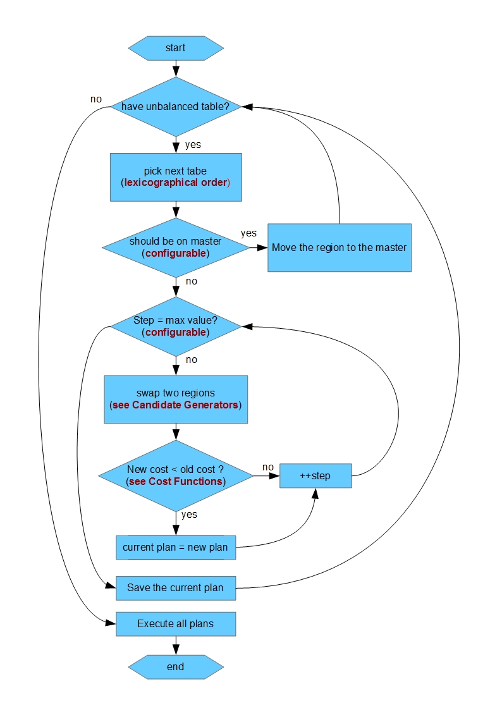

# HBase Region Balance实践

Jun 21, 2016

HBase是一种支持自动负载均衡的分布式KV数据库，在开启balance的开关(balance_switch)后，HBase的HMaster进程会自动根据 **指定策略** 挑选出一些Region，并将这些Region分配给负载比较低的RegionServer上。官方目前支持两种挑选Region的策略，一种叫做DefaultLoadBalancer，另一种叫做StochasticLoadBalancer，这两种策略后面会具体讲到。由于HBase的所有数据(包括HLog/Meta/HStoreFile等)都是写入到HDFS文件系统中的， 因此HBase的Region移动其实非常轻量级。在做Region移动的时候，保持这个Region对应的HDFS文件位置不变，只需要将Region的Meta数据分配到相关的RegionServer即可，整个Region移动的过程取决于RegionClose以及RegionOpen的耗时，这个时间一般都很短。

本文来讲讲hbase的balance实现。

### balance的流程

- 首先通过LoadBalancer找出所有需要移动的region plan，一个region plan包括region/原始RegionServer/目的RegionServer三个属性。
- unassign region , 将region从原来的RegionServer上解除绑定；
- assign region ，将region绑定到目标RegionServer上;

其中， unassign region的具体流程为：

- create zk closing node . 该节点在/unassigned路径下， 包含(znode状态，region名字，原始RS名，payload)这些数据。
- hmaster 调用rpc服务关闭region server。region-close的流程大致为先获取region的writeLock ， 然后flush memstore, 再并发关闭该region下的所有的store file文件(注意一个region有多个store，每个store又有多个store file , 所以可以实现并发close store file) 。最后释放region的writeLock.
- 设置zk closing node的znode状态为closed.

assgin region的具体流程为:

- 获取到对应的Region Plan.
- HMaster调用rpc服务去Region Plan对应的RegionServer上open region. 这里会先更新/unassigned节点为opening. 然后并发Load HStore，再更行zk/ROOT/META表信息，这里是为了client下次能获取到正确的路由信息， 最后更新region状态为OPEN.

### DefaultLoadBalancer策略

这种策略能够保证每个RS的regions个数基本上都相等，确切来说，假设一共有n个RS，第i个RS有Ai个region，记average=sigma(Ai)/n , 那么这种策略能够保证所有的RS的region个数都在[floor(average), ceil(average)]之间。这种策略的实现简单，应用广泛。

但是，这种策略考虑的因素比较单一， 没有考虑到每台region server的读写qps/负载压力等等，这样就可能导致出现一种情况：虽然每个region server的regions都非常接近，但是90%的请求还是落在了一台RS上，因为这台RS上的region全部都是热点数据，这样还是没有达到负载均衡的目的。 但我觉得balance的首要目的是保证数据均衡，如果在数据均衡的情况下，负载还是集中，这时候就要考虑下rowKey的选择是否有问题了。因此, 我个人还是比较推荐采用DefaultLoadBalancer的。

### StochasticLoadBalancer策略

StochasticLoadBalancer 这种策略真的是非常复杂，简单来讲，是一种综合权衡一下6个因素的均衡策略：

- 每台RegionServer读请求数(ReadRequestCostFunction)
- 每台RegionServer写请求数(WriteRequestCostFunction)
- 每台RegionServer的Region个数(RegionCountSkewCostFunction)
- 移动代价(MoveCostFunction)
- 数据locality(TableSkewCostFunction)
- 每张表占据RegionServer中region个数上限(LocalityCostFunction)

对于cluster的每一种region分布， 采用6个因素加权的方式算出一个代价值，这个代价值就用来评估当前region分布是否均衡，越均衡则代价值越低。然后通过成千上万次随机迭代来找到一组RegionMove的序列，使得最终的代价值严格递减。 得到的这一组RegionMove就是HMaster最终执行的region迁移方案。

这里用一段伪代码来描述这个迭代的过程：

```java
currentCost = MAX ; 
plans  = []
for(step = 0 ; step < 1000000; step ++ ){
    action = cluster.generateMove() 
    doAction( action );
    newCost  = computeCost(action) ;
    if (newCost < currentCost){
        currentCost = newCost;
        plans.add( action );
    }else{
        undoAction(action);
    }
}
```

其中generateMove()每次随机选择以下3种策略中的一种来生成RegionMove:

1. 随机选择两个RS, 从每个RS中随机选择两个Region，然后生成一个Action, 这个Action有一半概率做RegionMove（从Region多的RS迁移到Region少的RS）, 另一半概率做RegionSwap(两个RS之间做Region的交换)。
2. 选择Region最多的RS和Region最少的RS，然后生成一个Action, 这个Action一半概率做RegionMove, 一半概率做RegionSwap。
3. 随机找一个RS，然后找到该RS上数据locality最差的Region，再找到Region大部分数据落在的RS，然后生成一个Action，该Action用来把Region迁移到它应该所在的RS，用来提高locality.

对于这种策略，JavaDoc上说效果比较好，但其中的合理性个人觉得有待测试数据的证明(官方基本没有给出这方面的测试结果)。如果6个因素每个参数占据的权重如果没有调好的话，会导致线上的Region大量不均衡。按照我的一次线上经历，采用如下blance配置，出现过每次balance都只选择60个左右的plan去移动， 但真实的情况是145个RS，其中region数量最多的有700+个， 最少的region数量有2个，然后其他RS的region数量在2~700不等，这时候按理来讲应该需要进行大量的balance，但HMaster每隔一个period只生成60个plan左右去移动，这样balance太慢导致很长一段时间内负载不均，有的RS非常清闲，有的RS非常繁忙经常超时。

```properties
hbase.master.loadbalancer.class=\
    org.apache.hadoop.hbase.master.StochasticLoadBalancer
hbase.master.balancer.stochastic.regionCountCost=10
hbase.master.balancer.stochastic.tableSkewCost=5
hbase.master.balancer.stochastic.readRequestCost=5
hbase.master.balancer.stochastic.writeRequestCost=5
hbase.master.balancer.stochastic.localityCost=10
hbase.master.balancer.stochastic.moveCost=4
hbase.master.balancer.stochastic.maxMovePercent=1
```

后面对比了下了官方的默认配置，应该是regionCountCost一项权重太低， 但是，我想说的是除非线下有一个测试结果支撑具体的权重配置下 balance是符合预期的，否则线上操作时一般对权重很难有一个准确的把握，所以像这么复杂的策略还是要比较谨慎的选择，最好有过历史测试数据来评估balance的效果



**Cost Functions**：All different costs will be combined with their multipliers to produce a double cost

| **Description**                          | **Multiplier name**                      | **Default multiplier value** | **補充**                                   |
| ---------------------------------------- | ---------------------------------------- | ---------------------------- | ---------------------------------------- |
| Compute the cost of a potential cluster state from skew in number of regions on a cluster | hbase.master.balancer.stochastic.regionCountCost | 500                          |                                          |
| Given the starting state of the regions and a potential ending state compute cost based upon the number of regions that have moved. | hbase.master.balancer.stochastic.moveCost | 100                          | 由hbase.master.balancer.stochastic.maxMovePercent定義可移動的最大region數量（預設不能超過1/4），當要移動的region數量超過限制，則此成本會變成1000000，遠大於其他cost function |
| Compute a cost of a potential cluster configuration based upon where HFile are located | hbase.master.balancer.stochastic.localityCost | 25                           |                                          |
| Compute the cost of a potential cluster configuration based upon how evenly distributed tables are | hbase.master.balancer.stochastic.tableSkewCost | 35                           |                                          |
| A cost function for region replicas      | hbase.master.balancer.stochastic.regionReplicaHostCostKey | 100000                       | 盡量避免讓region replica在相同region server      |
| A cost function for region replicas for the rack distribution | hbase.master.balancer.stochastic.regionReplicaRackCostKey | 10000                        | 盡量避免讓region replica在相同rack               |
| Compute the cost of total number of write requests | hbase.master.balancer.stochastic.writeRequestCost | 5                            |                                          |
| Compute the cost of total memstore size  | hbase.master.balancer.stochastic.memstoreSizeCost | 5                            |                                          |
| Compute the cost of total open storefiles size | hbase.master.balancer.stochastic.storefileSizeCost | 5                            |                                          |
| Compute the cost of total number of read requests | hbase.master.balancer.stochastic.readRequestCost | 5                            |                                          |

****

------

**Candidate Generators**：

| **Funcation name**                  | 說明                                       |
| ----------------------------------- | ---------------------------------------- |
| RandomCandidateGenerator            | 隨機挑兩個regionserver，並且從regionserver A（擁有較多region）中隨機移動一個region給regionserver B（擁有較少region） |
| LoadCandidateGenerator              | 選擁有最多region和擁有最少region，並且從regionserver A（擁有較多region）中隨機移動一個region給regionserver B（擁有較少region） |
| LocalityBasedCandidateGenerator     | 隨機挑regionserver A中的一個region，然後移動到擁有該region最多檔案的regionserver B，另外有50%的機率regionserver B會還一個region給regionserver A。 |
| RegionReplicaRackCandidateGenerator | 隨機挑region replica（in reguionserver A） ，並移動到隨機的不同rack的regionserver B，另外有90%的機率regionserver B會還一個region給regionserver A。 |