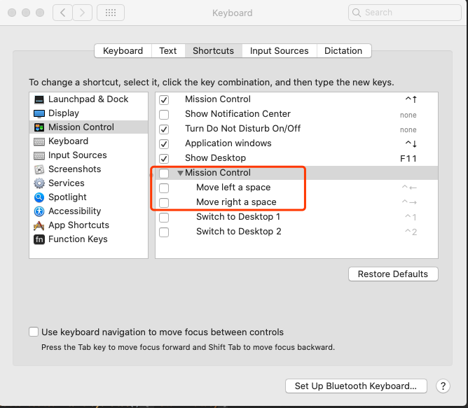

#环境设置

## 系统

- [x] 增加[输入法](https://support.apple.com/zh-cn/guide/chinese-input-method/cim6023ab944/104/mac/10.15)

  - [x] [搜狗拼音](https://pinyin.sogou.com/mac/)
- [x] [Chrome](https://www.google.cn/chrome/thank-you.html?statcb=0&installdataindex=empty&defaultbrowser=0)
- [x] typora
- [x] Sublime text3
- [x] [翻墙](https://olapio.atlassian.net/wiki/spaces/IT/pages/66224174/VPN)
- [x] [ShadowsocksX-NG](https://github.com/shadowsocks/ShadowsocksX-NG)，账号在[这]([https://github.com/Alvin9999/new-pac/wiki/ss%E5%85%8D%E8%B4%B9%E8%B4%A6%E5%8F%B7](https://github.com/Alvin9999/new-pac/wiki/ss免费账号))
- [ ] [远程办公](https://olapio.atlassian.net/wiki/spaces/IT/pages/63012970/VPN) ，连不上？？
- [x] github 配置
  - [x] [enable 2fa]( https://help.github.com/articles/securing-your-account-with-two-factor-authentication-2fa/ )
  - [x] 手机安装 FreeOTP
  - [x] 进入Github Organization for kylin

## 开发

https://olapio.atlassian.net/wiki/spaces/PD/pages/2883590

- [x] [Iterm2](https://www.iterm2.com/)
  - [x] 配置 see https://blog.biezhi.me/2018/11/build-a-beautiful-mac-terminal-environment.html
- [x] Idea
- [x] Smartgit
  - [x] [github 集成](http://www.syntevo.com/doc/display/SG191/GitHub+integration)
  - [x] 配置 `open in terminal`，[在ITerm2中打开](https://gist.github.com/vuchau/e977bc1934984e8e859b8ddd8ddd3b38)。
  - [x] 私有repo要使用[使用 SSH 连接到 GitHub](https://help.github.com/cn/github/authenticating-to-github/connecting-to-github-with-ssh)
- [x] [jdk 8](http://www.oracle.com/technetwork/java/javase/downloads/jdk8-downloads-2133151.html)，注：jdk8 已经无法用brew 安装
- [x] [Home-brew](https://brew.sh/)
  - [x] MVN `brew install maven`mvn
- [x] Spark build
  - [x] `mvn -Pyarn -Phadoop-2.7 -Dhadoop.version=2.7.3 -Phive -Phive-thriftserver -DskipTests clean package`注：**spark 2.4.4 OK**
  - [ ] master 分支 编译有问题（后续再跟进下）
- [x] Kylin build
  - [x] [KAP]()，必须用wiki上的setting.xml

## 快捷键

- [x] [Home 和 End key](https://www.jvandemo.com/how-to-fix-home-and-end-keys-on-mac-os-x/)

### IntelliJ IDEA 

>  现在**Visual Stduio**的快捷键导致：
>
> 1. 拷贝和粘贴仍然使用：**Ctrl+C** 和 **Ctrl+V**，但是系统使用**⌘+C**和**⌘+V**不一致
> 2. 某些快捷键和系统冲突，比如 **Ctrl+→** 和 **Ctrl+←**

#### 几个重要对的快捷键

| 功能                           | 快捷键 |
| ------------------------------ | ------ |
| Move Caret to Previous Word^1^ | ⌃→     |
| Move Caret to Next Word^1^     | ⌃←     |
|                                |        |

1. 和系统有冲突，需要在系统中禁止