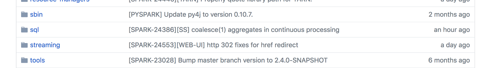

# A Journey Through Spark

## Extending SparkSQL

As one of the first steps of my [Insight project](https://github.com/bastihaase/Insight18b-SparkSQL-Array), I wanted to compute the intersection of two columns of a Spark SQL DataFrame containing arrays of strings. I thought I could just use a code snippet that looks something like:

```sql
SELECT ARRAY_INTERSECTION(col1, col2) FROM table
```

Unfortunately, the open source version currently doesn’t support such a function (although Databricks has already added [higher order functions](https://databricks.com/blog/2017/05/24/working-with-nested-data-using-higher-order-functions-in-sql-on-databricks.html) to their Spark distribution). I didn’t want to give up just yet, so I started to investigate the code base and tried to add this functionality myself. After all, I wanted to understand how Spark and SparkSQL work anyway!

> In this blog post, I’d like to share my experiences and give some advice for anyone trying to work on open source software.

We will start by discussing how we can approach a big code base and understand it on a higher level. We will do so by implementing a function My_Add that takes two columns `col1` and `col2` of numeric type and outputs a column containing `col1 + 2 * col2`. While this is a silly function to implement, it will allow us to focus on the big picture.

### Starting Our Adventure

Looking at a huge codebase can be daunting. I usually start by randomly browsing the codebase to get an idea of what is out there. Then, to get a bird’s eye view of the internals, I read related articles and blog posts. I can then identify the pieces of the code that I want to understand in detail. Let me demonstrate this approach with SparkSQL.

Navigating through Spark’s GitHub source, we can start browsing the folders and files to see what is going on. On the highest level, we see a bunch of folders, but we should surely focus on the sql folder.



Unfortunately, our next view is very overwhelming.


At this stage, it is helpful to try to understand how Spark SQL works conceptually. I highly recommend the article [Deep dive into SparkSQL](https://databricks.com/blog/2015/04/13/deep-dive-into-spark-sqls-catalyst-optimizer.html), but the gist for us is that

> Catalyst is the component that works on the parsed SQL statements and produces the JVM bytecode. Within Catalyst, there are classes extending the Expression class that, among other things, implement SQL functions working on columns by producing quasi-quotes that essentially contain Java code.

When we move into `catalyst` and then further to the `src/main/scala/org/apache/spark/sql/catalyst/expressions` folder to look at those expressions, we are again greeted by a huge number of files.


The file names seem promising, though. Let’s check out [arithmetic.scala](http://github.com/apache/spark/blob/db538b25ae9016c624ed7c70a34dee2036d80d3a/sql/catalyst/src/main/scala/org/apache/spark/sql/catalyst/expressions/arithmetic.scala#L149-L176)! In this file, there is a class Add that might be close to what we need to implement. Let’s look at the code in more detail:

``` scala
case class Add(left: Expression, right: Expression) extends BinaryArithmetic {
  override def inputType: AbstractDataType = TypeCollection.NumericAndInterval
  override def symbol: String = "+"
  private lazy val numeric = TypeUtils.getNumeric(dataType)
  protected override def nullSafeEval(input1: Any, input2: Any): Any = {
    if (dataType.isInstanceOf[CalendarIntervalType]) {
      input1.asInstanceOf[CalendarInterval].add(input2.asInstanceOf[CalendarInterval])
    } else {
      numeric.plus(input1, input2)
    }
  }
  override def doGenCode(ctx: CodegenContext, ev: ExprCode): ExprCode= dataType match {
    case dt: DecimalType =>
      defineCodeGen(ctx, ev, (eval1, eval2) => s"$eval1.$$plus($eval2)")
    case ByteType | ShortType =>
      defineCodeGen(ctx, ev,
        (eval1, eval2) => s"(${ctx.javaType(dataType)})($eval1 $symbol $eval2)")
    case CalendarIntervalType =>
      defineCodeGen(ctx, ev, (eval1, eval2) => s"$eval1.add($eval2)")
    case _ =>
      defineCodeGen(ctx, ev, (eval1, eval2) => s"$eval1 $symbol $eval2")
  }
}
```

Let me highlight some key points:

- It extends the [BinaryArithmetic](https://github.com/apache/spark/blob/f825847c82042a9eee7bd5cfab106310d279fc32/sql/catalyst/src/main/scala/org/apache/spark/sql/catalyst/expressions/arithmetic.scala#L117-L143) class; looking at its source code, we can see that it is a descendant of the class Expression via 
    ```scala
      Add extends BinaryArithmetic 
        extends BinaryOperator  
        extends BinaryExpression 
        extends Expression
    ```
- It is a **case class**; case classes are an advanced Scala feature for pattern matching used by the query optimizer. (That’s all we need to know about this for now.)
- The `inputType` determines what type of columns we accept as input. In this case, we accept columns containing a numeric type or a calendar type (that is what Interval refers to).
- There is a method `nullSafeEval`; this method seems to implement the core idea of Add: take two inputs and return their sum (**nullSafe tells Spark that this can operate on columns that allow null values**). This method will be used when we are in ==interpreted== mode.
- The method `doGenCode` is responsible for generating [quasiquotes](https://docs.scala-lang.org/overviews/quasiquotes/intro.html) that will be used to produce the JVM bytecode. Those quasiquotes essentially contain the Java code we want to execute.

At this stage, it can be also useful to look at the [Expression](https://github.com/apache/spark/blob/db538b25ae9016c624ed7c70a34dee2036d80d3a/sql/catalyst/src/main/scala/org/apache/spark/sql/catalyst/expressions/Expression.scala) class in more detail to understand what components make up an expression. If we want to add a function like My_Add, we will certainly have to create a case class extending `BinaryArithmetic` that resembles the case class Add from above.

Let us zoom out again and see what else we have to do to add our own function. What happens if we just try to use a function that does not exist? We get the following error message:


What does this tell us? In order for SparkSQL to include a function in the analysis phase (compare `AnalysisException` in the error message), we have to register it; a quick look in the [analysis subfolder](https://github.com/apache/spark/tree/master/sql/catalyst/src/main/scala/org/apache/spark/sql/catalyst/analysis) reveals the file [FunctionRegistry.scala](https://github.com/apache/spark/blob/db538b25ae9016c624ed7c70a34dee2036d80d3a/sql/catalyst/src/main/scala/org/apache/spark/sql/catalyst/analysis/FunctionRegistry.scala#L264-L273) containing the following code snippet:

```scala
    expression[Add]("+"),
    expression[Subtract]("-"),
    expression[Multiply]("*"),
    expression[Divide]("/"),
    expression[Remainder]("%"),
```

We will add a line for our new expression as well.

Lastly, we turn our attention to the [core module](https://github.com/apache/spark/tree/master/sql/core) of SparkSQL. Searching for the keyword `Add` reveals that there is a function in the [core module](https://github.com/apache/spark/blob/db538b25ae9016c624ed7c70a34dee2036d80d3a/sql/core/src/main/scala/org/apache/spark/sql/Column.scala#L654) of Spark that defines a function ‘+’ for columns. It takes another column and returns their sum.

```scala
  def + (other: Any): Column = withExpr { Add(expr, lit(other).expr) }
```

For our own function, it might be more instructive to look at how the absolute function is defined in [core](https://github.com/apache/spark/blob/db538b25ae9016c624ed7c70a34dee2036d80d3a/sql/core/src/main/scala/org/apache/spark/sql/functions.scala#L1003) (the expression Abs is also defined in [arithmetic.scala](https://github.com/apache/spark/blob/db538b25ae9016c624ed7c70a34dee2036d80d3a/sql/catalyst/src/main/scala/org/apache/spark/sql/catalyst/expressions/arithmetic.scala)). This function operates on a column and returns a column containing the absolute values of the original entries.

```scala
  def abs(e: Column): Column = withExpr { Abs(e.expr) }
```

Now we know everything there is to do to add our own function:

- Add case class `My_Add` in **arithmetic.scala**
- Register function in **FunctionsRegistry.scala**
- Add a function in the core module, e.g. in **functions.scala**

While the doGenCode function can certainly get trickier for more involved expressions, the overall complexity does not seem as bad anymore! I want to emphasize that these changes are the bare minimum to get things running. For instance, I will leave the topic of writing your own optimization rules for the query optimizer for a future post.

> 虽然涉及更多的表达式，`doGenCode`函数肯定会变得更复杂，但总体的复杂性似乎不再那么糟糕了！我想强调的是，这些变化是让事情顺利进行的最低限度。例如，为查询优化器定制优化规则的主题将在未来发布。

### Unit Tests

Now that we understand the codebase a little bit better, it is relatively straightforward to find the corresponding unit tests. For expressions in [arithmetic.scala](https://github.com/apache/spark/blob/db538b25ae9016c624ed7c70a34dee2036d80d3a/sql/catalyst/src/main/scala/org/apache/spark/sql/catalyst/expressions/arithmetic.scala), all unit tests can be found in [ArithmeticExpressionSuite.scala](https://github.com/apache/spark/blob/db538b25ae9016c624ed7c70a34dee2036d80d3a/sql/catalyst/src/test/scala/org/apache/spark/sql/catalyst/expressions/ArithmeticExpressionSuite.scala#L49-L64*). These are the tests for the Add function:

```scala
  test("+ (Add)") {
    testNumericDataTypes { convert =>
      val left = Literal(convert(1))
      val right = Literal(convert(2))
      checkEvaluation(Add(left, right), convert(3))
      checkEvaluation(Add(Literal.create(null, left.dataType), right), null)
      checkEvaluation(Add(left, Literal.create(null, right.dataType)), null)
    }
    checkEvaluation(Add(positiveShortLit, negativeShortLit), -1.toShort)
    checkEvaluation(Add(positiveIntLit, negativeIntLit), -1)
    checkEvaluation(Add(positiveLongLit, negativeLongLit), -1L)

    DataTypeTestUtils.numericAndInterval.foreach { tpe =>
      checkConsistencyBetweenInterpretedAndCodegen(Add, tpe, tpe)
    }
  }
```

For the abs function, a quick browse through the test suite reveals that the tests can be found in [MathFunctionsSuite](https://github.com/apache/spark/blob/db538b25ae9016c624ed7c70a34dee2036d80d3a/sql/core/src/test/scala/org/apache/spark/sql/MathFunctionsSuite.scala):

```scala
test("abs") {
  val input =
    Seq[(java.lang.Double, java.lang.Double)]((null, null), (0.0, 0.0), (1.5, 1.5), (-2.5, 2.5))

  checkAnswer(
    input.toDF("key", "value").select(abs($"key").alias("a")).sort("a"),
    input.map(pair => Row(pair._2)))

  checkAnswer(
    input.toDF("key", "value").selectExpr("abs(key) a").sort("a"),
    input.map(pair => Row(pair._2)))

  checkAnswer(
    sql("select abs(0), abs(-1), abs(123), abs(-9223372036854775807), abs(9223372036854775807)"),
    Row(0, 1, 123, 9223372036854775807L, 9223372036854775807L)
  )

  checkAnswer(
    sql("select abs(0.0), abs(-3.14159265), abs(3.14159265)"),
    Row(BigDecimal("0.0"), BigDecimal("3.14159265"), BigDecimal("3.14159265"))
  )
}
```

### Compiling and Building

Even though we are eager to code at this point, we should first compile and build Spark without making any changes to get familiar with the process. Otherwise, after having made changes, we might have a harder time fixing errors when we are not comfortable with compiling and testing yet.

We have two options for compiling and building Spark: Maven or sbt. We will use sbt for this tutorial. While we are in the main folder, start the sbt shell by executing

```bash
spark$ ./build/sbt
```

from within the main directory. We can now execute

```bash
> package
```

to build Spark.

To run all unit tests, try typing

```
> test
```

in the sbt shell.

In practice, you might only want to run one test suite at a time. To only run the tests in the ArithmeticExpressionsSuite, run the command

```
> testOnly *.ArithmeticExpressionSuite
```

Once you want to build a runnable distribution that you want to deploy in the wild, you can use the script /build/make-distribution.sh to make this process very convenient.

For more information, compare [building-spark](http://spark.apache.org/docs/latest/building-spark.html) and [running-individual-tests](http://spark.apache.org/developer-tools.html#running-individual-tests).

### How to Avoid Long Coffee Breaks

As you might have noticed, building Spark takes a long time. Luckily, we can set up incremental builds where sbt (or Maven) smartly recompiles only what has changed since the last build. It even automatically detects when we changed the code and will run every time we save a change.

This does not just work with builds, but with any command. All we have to do is add a tilde in front of the command, i.e.

```
> ~testOnly *.ArithmeticSuite
```

will continually run those tests whenever we make a change to the source code. This can be very helpful during development.

### Making a Fresh Footprint

Let’s start to code! We will first write unit tests for the expression class that we want to add, following [TDD](https://en.wikipedia.org/wiki/Test-driven_development).

To write those unit tests, we can closely follow the structure of the unit tests for add. In the [ArithmeticExpressionSuite](https://github.com/apache/spark/blob/master/sql/catalyst/src/test/scala/org/apache/spark/sql/catalyst/expressions/ArithmeticExpressionSuite.scala), we could add the following tests:

```scala
  test("my_Add") {
    testNumericDataTypes { convert =>
      val left = Literal(convert(1))
      val right = Literal(convert(2))
      checkEvaluation(My_Add(left, right), convert(5))
      checkEvaluation(My_Add(Literal.create(null, left.dataType), right), null)
      checkEvaluation(My_Add(left, Literal.create(null, right.dataType)), null)
    }

    DataTypeTestUtils.numericAndInterval.foreach { tpe =>
      checkConsistencyBetweenInterpretedAndCodegen(My_Add, tpe, tpe)
    }
  }
```

It is a good idea to run the unit tests for this suite; it should fail at this point as we have not implemented the My_Add class yet.

With this in place, we can implement the expression My_Add, closely following the Add expression.

```scala
case class My_Add(left: Expression, right: Expression) extends BinaryArithmetic {

  override def inputType: AbstractDataType = TypeCollection.NumericAndInterval
  override def symbol: String = "+"
  private lazy val numeric = TypeUtils.getNumeric(dataType)
  protected override def nullSafeEval(input1: Any, input2: Any): Any = {
    if (dataType.isInstanceOf[CalendarIntervalType]) {
      input1.asInstanceOf[CalendarInterval].
        add(input2.asInstanceOf[CalendarInterval].
          add(input2.asInstanceOf[CalendarInterval]))
    } else {
      numeric.plus(input1, numeric.plus(input2, input2))
    }
  }
  override def doGenCode(ctx: CodegenContext, ev: ExprCode): ExprCode =dataType match {
    case dt: DecimalType =>
      defineCodeGen(ctx, ev, (eval1, eval2) => s"$eval1.$$plus($eval2.$$plus($eval2))")
    case ByteType | ShortType =>
      defineCodeGen(ctx, ev,
        (eval1, eval2) => s"(${ctx.javaType(dataType)})($eval1 $symbol $eval2 $symbol $eval2)")
    case CalendarIntervalType =>
      defineCodeGen(ctx, ev, (eval1, eval2) => s"$eval1.add($eval2.add($eval2))")
    case _ =>
      defineCodeGen(ctx, ev, (eval1, eval2) => s"$eval1 $symbol $eval2 $symbol $eval2")
  }
}
```

We can now move on and write unit tests in [DataFrameSuite.scala](https://github.com/apache/spark/blob/master/sql/core/src/test/scala/org/apache/spark/sql/DataFrameSuite.scala), which will test whether we registered the function analysis and core correctly.

```scala
  test("my_add") {
    val df1 = Seq((1, 2)).toDF("a", "b")
    val ans1 = Row(5)
    checkAnswer(df1.select(my_add($"a", $"b")), ans1)
    checkAnswer(df1.selectExpr("my_add(a, b)"), ans1)
  }
```

With the unit tests written, be sure to register our expression both in `catalyst/analysis/FunctionRegistry.scala` and` /core/../functions.scala`:

```scala
expression[My_Add]("my_add"),
```

```scala
def my_add(col1: Column, col2: Column): Column = withExpr {
  My_Add(col1.expr, col2.expr)
}
```

### Our Custom Spark in the Wild!

Now that we have modified, tested and built our very own Spark, let’s take it for a spin! Once we have built Spark, we can jump into the Spark shell via

```bash
spark$ ./bin/spark-shell
```

and start playing around. For instance, if table corresponds to a DataFrame with a two columns `col1` and `col2`, then we can execute the following code:


Yay, our custom Spark works: its output equals `col1 + 2 * col2`! I hope this journey will be useful for people interested in making their own modifications to Spark or their favorite open source framework. For information on how to actually contribute to Spark’s codebase see [*Contributing to Spark*](https://spark.apache.org/contributing.html), in particular under *Contributing Code Changes*. There is also a [nice beginner’s guide to contributing to a GitHub project](https://akrabat.com/the-beginners-guide-to-contributing-to-a-github-project/).