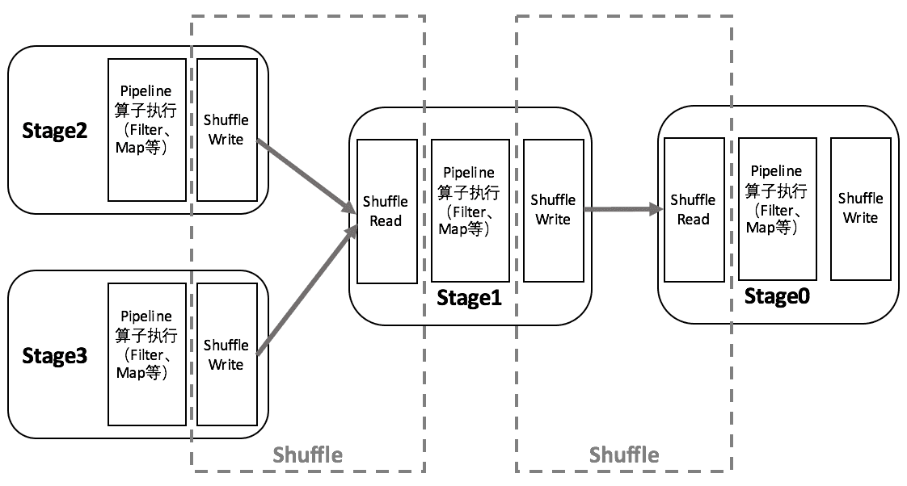
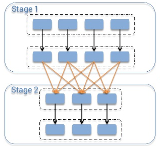
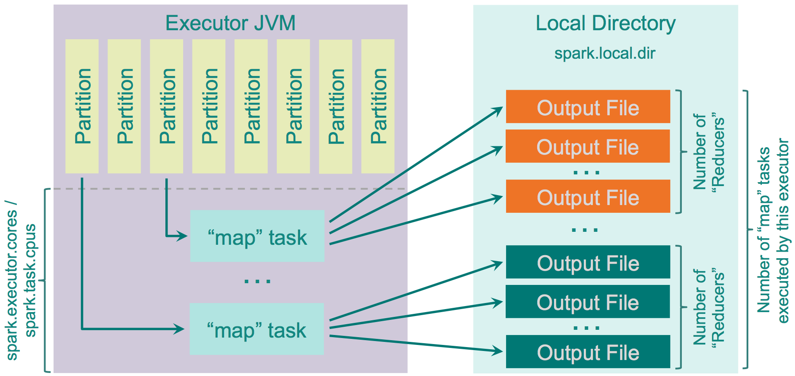
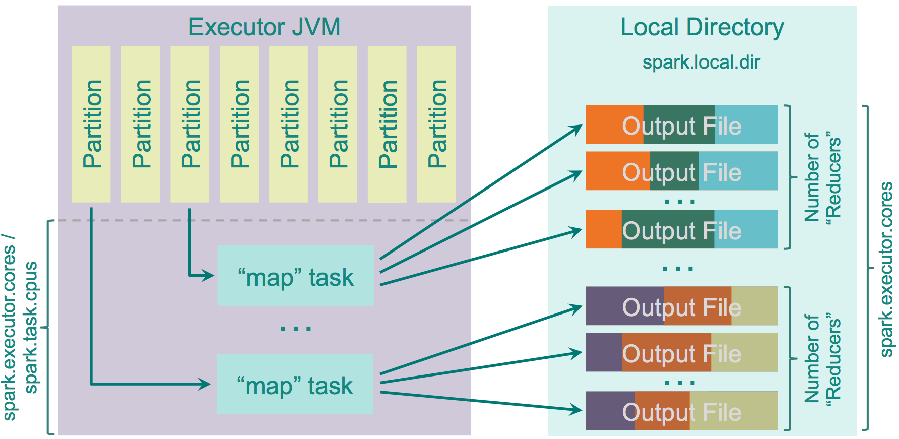
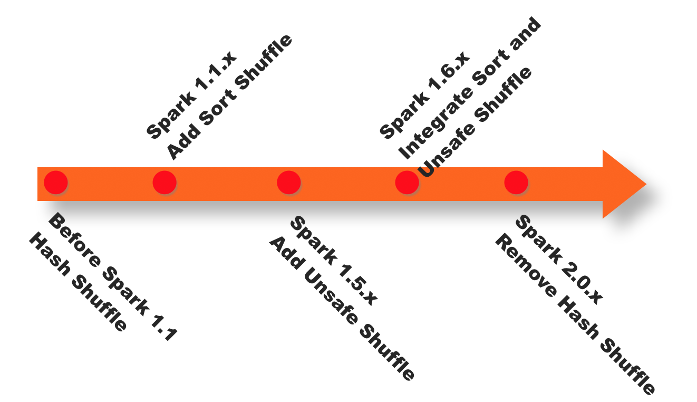
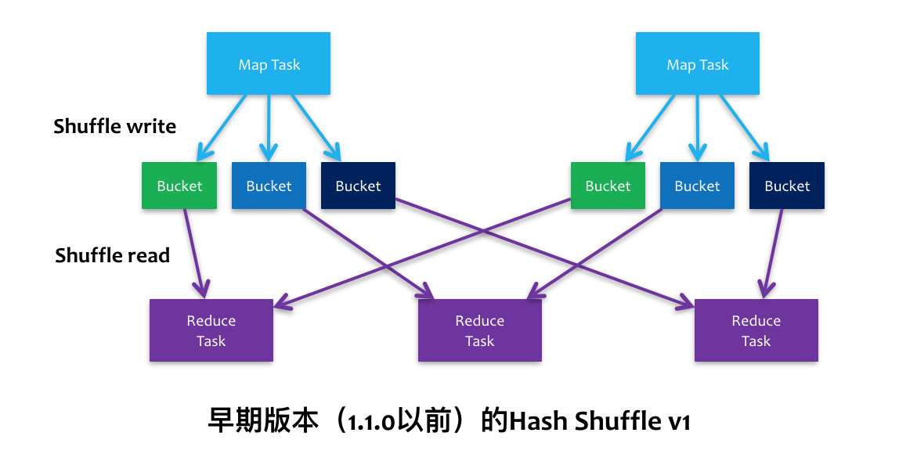
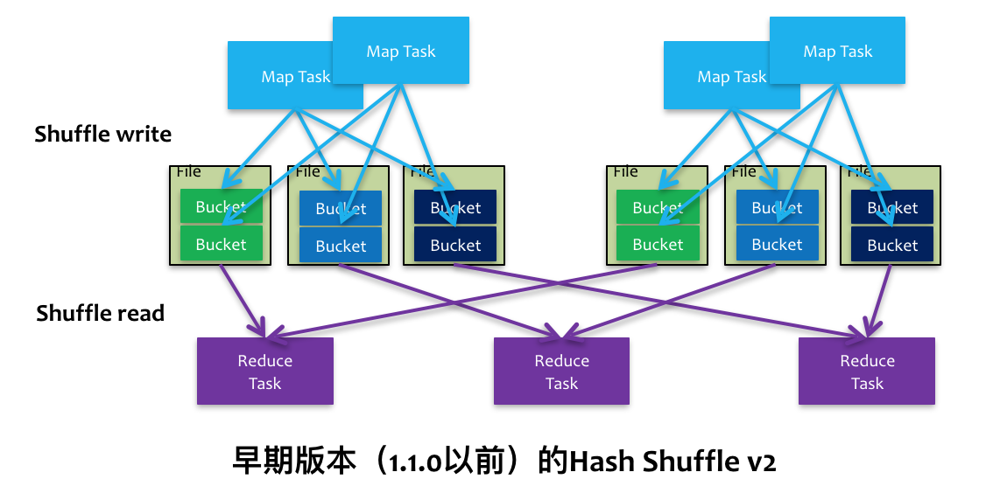
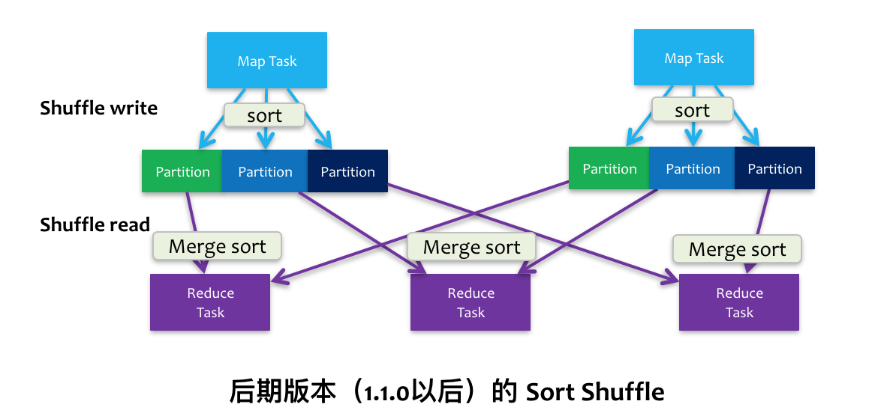

# Spark Shuffle的技术演进

在Spark或Hadoop MapReduce的分布式计算框架中，数据被按照key分成一块一块的分区，打散分布在集群中各个节点的物理存储或内存空间中，每个计算任务一次处理一个分区，但map端和reduce端的计算任务并非按照一种方式对相同的分区进行计算，例如，当需要对数据进行排序时，就需要将key相同的数据分布到同一个分区中，原分区的数据需要被打乱重组，这个**按照一定的规则对数据重新分区的过程就是Shuffle（洗牌）**。

#### Spark Shuffle的两阶段

对于Spark来讲，一些Transformation或Action算子会让RDD产生宽依赖，即parent RDD中的每个Partition被child RDD中的多个Partition使用，这时便需要进行Shuffle，根据Record的key对parent RDD进行重新分区。如果对这些概念还有一些疑问，可以参考我的另一篇文章[《Spark基本概念快速入门》](http://www.jianshu.com/p/e41b18a7e202)。

以Shuffle为边界，Spark将一个Job划分为不同的Stage，这些Stage构成了一个大粒度的DAG。Spark的Shuffle分为Write和Read两个阶段，分属于两个不同的Stage，前者是Parent Stage的最后一步，后者是Child Stage的第一步。如下图所示:



**执行Shuffle的主体是Stage中的并发任务，这些任务分ShuffleMapTask和ResultTask两种，ShuffleMapTask要进行Shuffle，ResultTask负责返回计算结果，一个Job中只有最后的Stage采用ResultTask，其他的均为ShuffleMapTask。如果要按照map端和reduce端来分析的话，ShuffleMapTask可以即是map端任务，又是reduce端任务，==因为Spark中的Shuffle是可以串行的；ResultTask则只能充当reduce端任务的角色。==**

我把Spark Shuffle的流程简单抽象为以下几步以便于理解：

- Shuffle Write
  1. Map side combine (if needed)
  2. Write to local output file
- Shuffle Read
  1. Block fetch
  2. Reduce side combine
  3. Sort (if needed)

Write阶段发生于`ShuffleMapTask`对该Stage的最后一个RDD完成了map端的计算之后，首先会判断是否需要对计算结果进行聚合，然后将最终结果按照不同的reduce端进行区分，写入当前节点的本地磁盘。
Read阶段开始于reduce端的任务读取ShuffledRDD之时，首先通过远程或本地数据拉取获得Write阶段各个节点中属于当前任务的数据，根据数据的Key进行聚合，然后判断是否需要排序，最后生成新的RDD。

#### Spark Shuffle具体实现的演进

在具体的实现上，Shuffle经历了Hash、Sort、Tungsten-Sort三阶段：

- `Spark 0.8及以前` **Hash Based Shuffle**
  在Shuffle Write过程按照Hash的方式重组Partition的数据，不进行排序。每个map端的任务为每个reduce端的Task生成一个文件，通常会产生大量的文件（即对应为`M*R`个中间文件，其中M表示map端的Task个数，R表示reduce端的Task个数），伴随大量的随机磁盘IO操作与大量的内存开销。
  Shuffle Read过程如果有combiner操作，那么它会把拉到的数据保存在一个Spark封装的哈希表（AppendOnlyMap）中进行合并。
  在代码结构上：
  - org.apache.spark.storage.ShuffleBlockManager负责Shuffle Write
  - org.apache.spark.BlockStoreShuffleFetcher负责Shuffle Read
  - org.apache.spark.Aggregator负责combine，依赖于AppendOnlyMap
- `Spark 0.8.1` **为Hash Based Shuffle引入File Consolidation机制**
  通过文件合并，中间文件的生成方式修改为每个执行单位（一个Executor中的执行单位等于Core的个数除以每个Task所需的Core数）为每个reduce端的任务生成一个文件。最终可以将文件个数从`M*R`修改为`E*C/T*R`，其中，E表示Executor的个数，C表示每个Executor中可用Core的个数，T表示Task所分配的Core的个数。
  是否采用Consolidate机制，需要配置`spark.shuffle.consolidateFiles`参数
- `Spark 0.9` **引入ExternalAppendOnlyMap**
  在combine的时候，可以将数据spill到磁盘，然后通过堆排序merge（可以参考这篇[文章](https://github.com/JerryLead/SparkInternals/blob/master/markdown/4-shuffleDetails.md)，了解其具体实现）
- `Spark 1.1` **引入Sort Based Shuffle，但默认仍为Hash Based Shuffle**
  在Sort Based Shuffle的Shuffle Write阶段，map端的任务会按照Partition id以及key对记录进行排序。同时将全部结果写到一个数据文件中，同时生成一个索引文件，reduce端的Task可以通过该索引文件获取相关的数据。
  在代码结构上：
  - 从以前的`ShuffleBlockManager`中分离出`ShuffleManager`来专门管理Shuffle Writer和Shuffle Reader。两种Shuffle方式分别对应`HashShuffleManager`和`SortShuffleManager`，可通过`spark.shuffle.manager`参数配置。两种Shuffle方式有各自的**ShuffleWriter**：`HashShuffle`和`SortShuffleWriter`；但共用一个**ShuffleReader**，即`HashShuffleReader`。
  - `ExternalSorter`实现排序功能。可通过对`spark.shuffle.spill`参数配置，决定是否可以在排序时将临时数据Spill到磁盘。
- `Spark 1.2` **默认的Shuffle方式改为Sort Based Shuffle**
- `Spark 1.4` **引入Tungsten-Sort Based Shuffle**
  将数据记录用序列化的二进制方式存储，把排序转化成指针数组的排序，引入堆外内存空间和新的内存管理模型，这些技术决定了使用Tungsten-Sort要符合一些严格的限制，==比如Shuffle dependency不能带有aggregation、输出不能排序等。由于堆外内存的管理基于JDK Sun Unsafe API，故Tungsten-Sort Based Shuffle也被称为Unsafe Shuffle。==
  在代码层面：
  - 新增org.apache.spark.shuffle.unsafe.UnsafeShuffleManager
  - 新增org.apache.spark.shuffle.unsafe.UnsafeShuffleWriter(用java实现)
  - ShuffleReader复用HashShuffleReader
- `Spark 1.6` **Tungsten-sort并入Sort Based Shuffle**
  由SortShuffleManager自动判断选择最佳Shuffle方式，如果检测到满足Tungsten-sort条件会自动采用Tungsten-sort Based Shuffle，否则采用Sort Based Shuffle。在代码方面：
  - UnsafeShuffleManager[合并](https://github.com/apache/spark/commit/f6d06adf05afa9c5386dc2396c94e7a98730289f)到SortShuffleManager
  - HashShuffleReader 重命名为BlockStoreShuffleReader，Sort Based Shuffle和Hash Based Shuffle仍共用ShuffleReader。
- `Spark 2.0` **Hash Based Shuffle退出历史舞台**
  从此Spark只有Sort Based Shuffle。

#### Spark Shuffle源码结构

这里以最新的Spark 2.1为例简单介绍一下Spark Shuffle相关部分的代码结构

- Shuffle Write

  - ShuffleWriter的入口链路

    ```
    org.apache.spark.scheduler.ShuffleMapTask#runTask
      ---> org.apache.spark.shuffle.sort.SortShuffleManager#getWriter
          ---> org.apache.spark.shuffle.sort.SortShuffleWriter#write(如果是普通sort)
          ---> org.apache.spark.shuffle.sort.UnsafeShuffleWriter#write (如果是Tungsten-sort)
    ```

  - SortShuffleWriter的主要依赖

    ```
    org.apache.spark.util.collection.ExternalSorter 负责按照(partition id, key)排序，如果需要Map side combine，需要提供aggregator
      ---> org.apache.spark.util.collection.PartitionedAppendOnlyMap
    ```

  - UnsafeShuffleWriter的主要依赖

    ```
    org.apache.spark.shuffle.sort.ShuffleExternalSorter (Java实现)
    ```

- Shuffle Read

  - ShuffleReader的入口链路

    ```
    org.apache.spark.rdd.ShuffledRDD#compute
      ---> org.apache.spark.shuffle.sort.SortShuffleManager#getReader
          ---> org.apache.spark.shuffle.BlockStoreShuffleReader#read
    ```

  - ShuffleReader主要依赖

    ```
    org.apache.spark.Aggregator 负责combine
      ---> org.apache.spark.util.collection.ExternalAppendOnlyMap
    org.apache.spark.util.collection.ExternalSorter 取决于是否需要对最终结果进行排序
    ```

#### 参考资料及推荐阅读

1. Spark 1.0之前Hash Based Shuffle的原理
   - [Apache Spark的设计与实现——Shuffle 过程](https://github.com/JerryLead/SparkInternals/blob/master/markdown/4-shuffleDetails.md)
   - [《Spark大数据处理：技术、应用与性能优化》第4.6节Shuffle机制](https://book.douban.com/subject/26261153/)
2. Spark 1.1时Sort Based Shuffle的资料
   - [Spark Shuffle Comparison](https://github.com/hustnn/SparkShuffleComparison)
3. Spark 1.2之前两种Shuffle方式的分析和对比
   - [《Spark技术内幕：深入解析Spark内核架构于实现原理》第7章Shuffle模块详解](https://book.douban.com/subject/26649141/)
4. Spark 1.6之前三种Shuffle方式的分析和对比
   - [Spark Architecture: Shuffle](https://0x0fff.com/spark-architecture-shuffle/)
   - [深入理解Spark(三)：Spark Shuffle原理及相关调优](http://sharkdtu.com/posts/spark-shuffle.html)
5. Spark 1.6之前Sort Based Shuffle的源码和原理
   - [Spark Core源码解读（十）－shuffle write](http://www.jianshu.com/p/ac41682c5d16)
   - [Spark Core源码解读（十二）－shuffle read](http://www.jianshu.com/p/913db058962e)
   - [Spark Sort Based Shuffle内存分析](http://www.jianshu.com/p/c83bb237caa8)
   - [Shuffle的框架之框架演进与框架内核](http://www.webzmt.com/IT/1296308.shtml)
6. Spark 1.6之前Tungsten-sort Based Shuffle的原理
   - [Spark Tungsten-sort Based Shuffle 分析](http://www.jianshu.com/p/d328c96aebfd)
   - [探索Spark Tungsten的秘密](https://github.com/hustnn/TungstenSecret/tree/master)


# Spark Architecture: Shuffle

https://0x0fff.com/spark-architecture-shuffle

This is my second article about Apache Spark architecture and today I will be more specific and tell you about the shuffle, one of the most interesting topics in the overall Spark design. The previous part was mostly about general Spark architecture and its memory management. It can be [accessed here](https://0x0fff.com/spark-architecture/). The next one is about Spark memory management and it [is available here](https://0x0fff.com/spark-memory-management/).



What is the shuffle in general? Imagine that you have a list of phone call detail records in a table and you want to calculate amount of calls happened each day. This way you would set the “day” as your key, and for each record (i.e. for each call) you would emit “1” as a value. After this you would sum up values for each key, which would be an answer to your question – total amount of records for each day. But when you store the data across the cluster, how can you sum up the values for the same key stored on different machines? The only way to do so is to make all the values for the same key be on the same machine, after this you would be able to sum them up.

There are many different tasks that require shuffling of the data across the cluster, for instance table join – to join two tables on the field “id”, you must be sure that all the data for the same values of “id” for both of the tables are stored in the same chunks. Imagine the tables with integer keys ranging from 1 to 1’000’000. By storing the data in same chunks I mean that for instance for both tables values of the key 1-100 are stored in a single partition/chunk, this way instead of going through the whole second table for each partition of the first one, we can join partition with partition directly, because we know that the key values 1-100 are stored only in these two partitions. To achieve this both tables should have the same number of partitions, this way their join would require much less computations. So now you can understand how important shuffling is.

Discussing this topic, I would follow the MapReduce naming convention. In the shuffle operation, the task that emits the data in the source executor is “mapper”, the task that consumes the data into the target executor is “reducer”, and what happens between them is “shuffle”.

Shuffling in general has 2 important compression parameters: **spark.shuffle.compress** – whether the engine would compress shuffle outputs or not, and **spark.shuffle.spill.compress** – whether to compress intermediate shuffle spill files or not. Both have the value “true” by default, and both would use **spark.io.compression.codec** codec for compressing the data, which is [snappy](https://en.wikipedia.org/wiki/Snappy_(software)) by default.

As you might know, there are a number of shuffle implementations available in Spark. Which implementation would be used in your particular case is determined by the value of **spark.shuffle.manager** parameter. Three possible options are: hash, sort, tungsten-sort, and the “sort” option is default starting from Spark 1.2.0.

## Hash Shuffle

Prior to Spark 1.2.0 this was the default option of shuffle (**spark.shuffle.manager ***= hash*). But it has many drawbacks, mostly caused by the [amount of files it creates](http://www.cs.berkeley.edu/~kubitron/courses/cs262a-F13/projects/reports/project16_report.pdf) – each mapper task creates separate file for each separate reducer, resulting in **M \* R** total files on the cluster, where **M** is the number of “mappers” and **R** is the number of “reducers”. With high amount of mappers and reducers this causes big problems, both with the output buffer size, amount of open files on the filesystem, speed of creating and dropping all these files. [Here’s a good example of how Yahoo faced all these problems](http://spark-summit.org/2013/wp-content/uploads/2013/10/Li-AEX-Spark-yahoo.pdf), with 46k mappers and 46k reducers generating 2 billion files on the cluster.

The logic of this shuffler is pretty dumb: it calculates the amount of “reducers” as the amount of partitions on the “reduce” side, creates a separate file for each of them, and looping through the records it needs to output, it calculates target partition for each of them and outputs the record to the corresponding file.

Here is how it looks like:



There is an optimization implemented for this shuffler, controlled by the parameter “**spark.shuffle.consolidateFiles**” (default is “false”). When it is set to “true”, the “mapper” output files would be consolidated. If your cluster has **E** executors (“**–num-executors**” for YARN) and each of them has **C** cores (“**\*spark.executor.cores***” or “**\*–executor-cores***” for YARN) and each task asks for **T **CPUs (*“\**spark.task.cpus**“*), then the amount of execution slots on the cluster would be **E \* C / T**, and the amount of files created during shuffle would be **E \* C / T * R**. With 100 executors 10 cores each allocating 1 core for each task and 46000 “reducers” it would allow you to go from 2 billion files down to 46 million files, which is much better in terms of performance. This feature is implemented in a [rather straightforward way](https://github.com/apache/spark/blob/branch-1.6/core/src/main/scala/org/apache/spark/shuffle/FileShuffleBlockResolver.scala): instead of creating new file for each of the reducers, it creates a pool of output files. When map task starts outputting the data, it requests a group of **R** files from this pool. When it is finished, it returns this **R** files group back to the pool. As each executor can execute only **C / T** tasks in parallel, it would create only** C / T** groups of output files, each group is of **R** files. After the first **C / T** parallel “map” tasks has finished, each next “map” task would reuse an existing group from this pool.

Here’s a general diagram of how it works:



Pros:

1. Fast – no sorting is required at all, no hash table maintained;
2. No memory overhead for sorting the data;
3. No IO overhead – data is written to HDD exactly once and read exactly once.

Cons:

1. When the amount of partitions is big, performance starts to degrade due to big amount of output files
2. Big amount of files written to the filesystem causes IO skew towards random IO, which is in general up to 100x slower than sequential IO

Just for the reference, IO operation slowness at the scale of [millions of files on a single filesystem](http://events.linuxfoundation.org/slides/2010/linuxcon2010_wheeler.pdf).

And of course, when data is written to files it is serialized and optionally compressed. When it is read, the process is opposite – it is uncompressed and deserialized. Important parameter on the fetch side is “**spark.reducer.maxSizeInFlight**“ (48MB by default), which determines the amount of data requested from the remote executors by each reducer. This size is split equally by 5 parallel requests from different executors to speed up the process. If you would increase this size, your reducers would request the data from “map” task outputs in bigger chunks, which would improve performance, but also increase memory usage by “reducer” processes.

If the record order on the reduce side is not enforced, then the “reducer” will just return an iterator with dependency on the “map” outputs, but if the ordering is required it would fetch all the data and sort it on the “reduce” side with [ExternalSorter](https://github.com/apache/spark/blob/master/core/src/main/scala/org/apache/spark/util/collection/ExternalSorter.scala).

## Sort Shuffle

Starting Spark 1.2.0, this is the default shuffle algorithm used by Spark (**spark.shuffle.manager***= sort*). In general, this is an attempt to implement the shuffle logic similar to the one used by [Hadoop MapReduce](https://0x0fff.com/hadoop-mapreduce-comprehensive-description/). With hash shuffle you output one separate file for each of the “reducers”, while with sort shuffle you’re doing a smarted thing: you output a single file ordered by “reducer” id and indexed, this way you can easily fetch the chunk of the data related to “reducer x” by just getting information about the position of related data block in the file and doing a single fseek before fread. But of course for small amount of “reducers” it is obvious that hashing to separate files would work faster than sorting, so the sort shuffle has a “fallback” plan: when the amount of “reducers” is smaller than “**spark.shuffle.sort.bypassMergeThreshold**” (200 by default) we use the “fallback” plan with hashing the data to separate files and then joining these files together in a single file. This logic is implemented in a separate class [BypassMergeSortShuffleWriter](https://github.com/apache/spark/blob/master/core/src/main/java/org/apache/spark/shuffle/sort/BypassMergeSortShuffleWriter.java).

The funny thing about this implementation is that it sorts the data on the “map” side, but does not merge the results of this sort on “reduce” side – in case the ordering of data is needed it just re-sorts the data. Cloudera has put itself in a fun position with this idea: [Improving Sort Performance in Apache Spark: It’s a Double](http://blog.cloudera.com/blog/2015/01/improving-sort-performance-in-apache-spark-its-a-double/). They started a process of implementing the logic that takes advantage of pre-sorted outputs of “mappers” to merge them together on the “reduce” side instead of resorting. As you might know, sorting in Spark on reduce side is done using [TimSort](https://en.wikipedia.org/wiki/Timsort), and this is a wonderful sorting algorithm which in fact by itself takes advantage of pre-sorted inputs (by calculating minruns and then merging them together). A bit of math here, you can skip if you’d like to. Complexity of merging **M** sorted arrays of **N** elements each is **O(MNlogM)** when we use the most efficient way to do it, using Min Heap. With TimSort, we make a pass through the data to find MinRuns and then merge them together pair-by-pair. It is obvious that it would identify **M** MinRuns. First **M/2** merges would result in **M/2** sorted groups, next **M/4** merges would give **M/4**sorted groups and so on, so its quite straightforward that the complexity of all these merges would be **O(MNlogM)** in the very end. Same complexity as the direct merge! The difference here is only in constants, and constants depend on implementation. So [the patch by Cloudera engineers](https://issues.apache.org/jira/browse/SPARK-2926) has been pending on its approval for already one year, and unlikely it would be approved without the push from Cloudera management, because performance impact of this thing is very minimal or even none, you can see this in JIRA ticket discussion. Maybe they would workaround it by introducing separate shuffle implementation instead of “improving” the main one, we’ll see this soon.

Fine with this. What if you don’t have enough memory to store the whole “map” output? You might need to spill intermediate data to the disk. Parameter **spark.shuffle.spill** is responsible for enabling/disabling spilling, and by default spilling is enabled. If you would disable it and there is not enough memory to store the “map” output, you would simply get OOM error, so be careful with this.

The amount of memory that can be used for storing “map” outputs before spilling them to disk is “JVM Heap Size” * **spark.shuffle.memoryFraction** * **spark.shuffle.safetyFraction**, with default values it is “JVM Heap Size” * 0.2 * 0.8 = “JVM Heap Size” * 0.16. Be aware that if you run many threads within the same executor (setting the ratio of **spark.executor.cores / spark.task.cpus** to more than 1), average memory available for storing “map” output for each task would be “JVM Heap Size” * **spark.shuffle.memoryFraction** * **spark.shuffle.safetyFraction** / **spark.executor.cores \* spark.task.cpus**, for 2 cores with other defaults it would give 0.08 * “JVM Heap Size”.

Spark internally uses [AppendOnlyMap](https://github.com/apache/spark/blob/branch-1.5/core/src/main/scala/org/apache/spark/util/collection/AppendOnlyMap.scala) structure to store the “map” output data in memory. Interestingly, Spark uses their own Scala implementation of hash table that uses open hashing and stores both keys and values in the same array using [quadratic probing](http://en.wikipedia.org/wiki/Quadratic_probing). As a hash function they use murmur3_32 from Google Guava library, which is [MurmurHash3](https://en.wikipedia.org/wiki/MurmurHash).

This hash table allows Spark to apply “combiner” logic in place on this table – each new value added for existing key is getting through “combine” logic with existing value, and the output of “combine” is stored as the new value.

When the spilling occurs, it just calls “sorter” on top of the data stored in this AppendOnlyMap, which executes TimSort on top of it, and this data is getting written to disk.

Sorted output is written to the disk when the spilling occurs or when there is no more mapper output, i.e. the data is guaranteed to hit the disk. Whether it will really hit the disk depends on OS settings like file buffer cache, but it is up to OS to decide, Spark just sends it “write” instructions.

Each spill file is written to the disk separately, their merging is performed only when the data is requested by “reducer” and the merging is real-time, i.e. it does not call somewhat “on-disk merger” like it happens in [Hadoop MapReduce](https://0x0fff.com/hadoop-mapreduce-comprehensive-description/), it just dynamically collects the data from a number of separate spill files and merges them together using [Min Heap](https://en.wikipedia.org/wiki/Binary_heap) implemented by Java PriorityQueue class.

This is how it works:


So regarding this shuffle:

Pros:

1. Smaller amount of files created on “map” side
2. Smaller amount of random IO operations, mostly sequential writes and reads

Cons:

1. Sorting is slower than hashing. It might worth tuning the bypassMergeThreshold parameter for your own cluster to find a sweet spot, but in general for most of the clusters it is even too high with its default
2. In case you use SSD drives for the temporary data of Spark shuffles, hash shuffle might work better for you

## Unsafe Shuffle or Tungsten Sort

Can be enabled with setting **spark.shuffle.manager*** = tungsten-sort* in Spark 1.4.0+. This code is the part of [project “Tungsten”](https://issues.apache.org/jira/browse/SPARK-7075). The idea is [described here](https://issues.apache.org/jira/browse/SPARK-7081), and it is pretty interesting. The optimizations implemented in this shuffle are:

1. Operate directly on serialized binary data without the need to deserialize it. It uses unsafe (sun.misc.Unsafe) memory copy functions to directly copy the data itself, which works fine for serialized data as in fact it is just a byte array
2. Uses special cache-efficient sorter [ShuffleExternalSorter](https://github.com/apache/spark/blob/master/core/src/main/java/org/apache/spark/shuffle/sort/ShuffleExternalSorter.java) that sorts arrays of compressed record pointers and partition ids. By using only 8 bytes of space per record in the sorting array, it works more efficienly with CPU cache
3. As the records are not deserialized, spilling of the serialized data is performed directly (no deserialize-compare-serialize-spill logic)
4. Extra spill-merging optimizations are automatically applied when the shuffle compression codec supports concatenation of serialized streams (i.e. to merge separate spilled outputs just concatenate them). This is currently supported by Spark’s LZF serializer, and only if fast merging is enabled by parameter “**shuffle.unsafe.fastMergeEnabled**”

As a next step of optimization, this algorithm would also introduce [off-heap storage buffer](https://issues.apache.org/jira/browse/SPARK-7542).

This shuffle implementation would be used only when all of the following conditions hold:

- The shuffle dependency specifies no aggregation. Applying aggregation means the need to store deserialized value to be able to aggregate new incoming values to it. This way you lose the main advantage of this shuffle with its operations on serialized data
- The shuffle serializer supports relocation of serialized values (this is currently supported by KryoSerializer and Spark SQL’s custom serializer)
- The shuffle produces less than 16777216 output partitions
- No individual record is larger than 128 MB in serialized form

Also you must understand that at the moment sorting with this shuffle is performed only by partition id, it means that the optimization with merging pre-sorted data on “reduce” side and taking advantage of pre-sorted data by TimSort on “reduce” side is no longer possible. Sorting in this operation is performed based on the 8-byte values, each value encodes both link to the serialized data item and the partition number, here is how we get a limitation of 1.6b output partitions.

Here’s how it looks like:


First for each spill of the data it sorts the described pointer array and outputs an indexed partition file, then it merges these partition files together into a single indexed output file.

Pros:

1. Many performance optimizations described above

Cons:

1. Not yet handling data ordering on mapper side
2. Not yet offer off-heap sorting buffer
3. Not yet stable

But in my opinion this sort is a big advancement in the Spark design and I would like to see how this will turn out and what new performance benchmarks Databricks team would offer us to show how cool the performance because with these new features.

This is all what I wanted to say about Spark shuffles. It is a very interesting piece of the code and if you have some time I’d recommend you to read it by yourself.

# Spark Shuffle原理及相关调优

发表于 2016-11-04   |   分类于 [spark ](http://sharkdtu.com/categories/spark/)  |   阅读量 1244次

[spark](http://sharkdtu.com/tags/spark/) [大数据](http://sharkdtu.com/tags/big-data/) [分布式计算](http://sharkdtu.com/tags/distributed-computation/) [shuffle](http://sharkdtu.com/tags/shuffle/)

通过文章[“Spark Scheduler内部原理剖析”](http://sharkdtu.com/posts/spark-scheduler.html)我们知道，Spark在DAG调度阶段会将一个Job划分为多个Stage，上游Stage做map工作，下游Stage做reduce工作，其本质上还是MapReduce计算框架。Shuffle是连接map和reduce之间的桥梁，它将map的输出对应到reduce输入中，这期间涉及到序列化反序列化、跨节点网络IO以及磁盘读写IO等，所以说Shuffle是整个应用程序运行过程中非常昂贵的一个阶段，理解Spark Shuffle原理有助于优化Spark应用程序。

## Spark Shuffle的基本原理与特性

与MapReduce计算框架一样，Spark的Shuffle实现大致如下图所示，在DAG阶段以shuffle为界，划分stage，上游stage做map task，每个map task将计算结果数据分成多份，每一份对应到下游stage的每个partition中，并将其临时写到磁盘，该过程叫做shuffle write；下游stage做reduce task，每个reduce task通过网络拉取上游stage中所有map task的指定分区结果数据，该过程叫做shuffle read，最后完成reduce的业务逻辑。举个栗子，假如上游stage有100个map task，下游stage有1000个reduce task，那么这100个map task中每个map task都会得到1000份数据，而1000个reduce task中的每个reduce task都会拉取上游100个map task对应的那份数据，即第一个reduce task会拉取所有map task结果数据的第一份，以此类推。


在map阶段，除了map的业务逻辑外，还有shuffle write的过程，这个过程涉及到序列化、磁盘IO等耗时操作；在reduce阶段，除了reduce的业务逻辑外，还有前面shuffle read过程，这个过程涉及到网络IO、反序列化等耗时操作。所以整个shuffle过程是极其昂贵的，spark在shuffle的实现上也做了很多优化改进，随着版本的迭代发布，spark shuffle的实现也逐步得到改进。下面详细介绍spark shuffle的实现演进过程。

## Spark Shuffle实现演进

Spark在1.1以前的版本一直是采用Hash Shuffle的实现的方式，到1.1版本时参考Hadoop MapReduce的实现开始引入Sort Shuffle，在1.5版本时开始Tungsten钨丝计划，引入UnSafe Shuffle优化内存及CPU的使用，在1.6中将Tungsten统一到Sort Shuffle中，实现自我感知选择最佳Shuffle方式，到最近的2.0版本，Hash Shuffle已被删除，所有Shuffle方式全部统一到Sort Shuffle一个实现中。下图是spark shuffle实现的一个版本演进。



### Hash Shuffle v1

在spark-1.1版本以前，spark内部实现的是Hash Shuffle，其大致原理与前面基本原理介绍中提到的基本一样，如下图所示。



在map阶段(shuffle write)，每个map都会为下游stage的每个partition写一个临时文件，假如下游stage有1000个partition，那么每个map都会生成1000个临时文件，一般来说一个executor上会运行多个map task，这样下来，一个executor上会有非常多的临时文件，假如一个executor上运行M个map task，下游stage有N个partition，那么一个executor上会生成M*N个文件。另一方面，如果一个executor上有K个core，那么executor同时可运行K个task，这样一来，就会同时申请K*N个文件描述符，一旦partition数较多，势必会耗尽executor上的文件描述符，同时生成K*N个write handler也会带来大量内存的消耗。

在reduce阶段(shuffle read)，每个reduce task都会拉取所有map对应的那部分partition数据，那么executor会打开所有临时文件准备网络传输，这里又涉及到大量文件描述符，另外，如果reduce阶段有combiner操作，那么它会把网络中拉到的数据保存在一个`HashMap`中进行合并操作，如果数据量较大，很容易引发OOM操作。

综上所述，Hash Shuffle实现简单但是特别naive，在小数据量下运行比较快，一旦数据量较大，基本就垮了。当然这个版本的shuffle也是在spark早期版本中，随着版本迭代的进行，shuffle的实现也越来越成熟。

### Hash Shuffle v2

在上一节讲到每个map task都要生成N个partition文件，为了减少文件数，后面引进了，目的是减少单个executor上的文件数。如下图所示，一个executor上所有的map task生成的分区文件只有一份，即将所有的map task相同的分区文件合并，这样每个executor上最多只生成N个分区文件。



表面上看是减少了文件数，但是假如下游stage的分区数N很大，还是会在每个executor上生成N个文件，同样，如果一个executor上有K个core，还是会开K*N个writer handler，总体上来说基本没太解决问题。对于shuffle read阶段跟v1版一样没改进，仍然容易导致OOM。

### Sort Shuffle v1

针对上述Hash Shuffle的弊端，在spark 1.1.0版本中引入Sort Shuffle，它参考了Hadoop MapReduce中的shuffle实现，对记录进行排序来做shuffle，如下图所示。



在map阶段(shuffle write)，会按照partition id以及key对记录进行排序，将所有partition的数据写在同一个文件中，该文件中的记录首先是按照partition id排序一个一个分区的顺序排列，每个partition内部是按照key进行排序存放，map task运行期间会顺序写每个partition的数据，并通过一个索引文件记录每个partition的大小和偏移量。这样一来，每个map task一次只开两个文件描述符，一个写数据，一个写索引，大大减轻了Hash Shuffle大量文件描述符的问题，即使一个executor有K个core，那么最多一次性开K*2个文件描述符。

在reduce阶段(shuffle read)，reduce task拉取数据做combine时不再是采用`HashMap`，而是采用`ExternalAppendOnlyMap`，该数据结构在做combine时，如果内存不足，会刷写磁盘，很大程度的保证了鲁棒性，避免大数据情况下的OOM。

总体上看来Sort Shuffle解决了Hash Shuffle的所有弊端，但是因为需要其shuffle过程需要对记录进行排序，所以在性能上有所损失。

### Unsafe Shuffle

从spark 1.5.0开始，spark开始了钨丝计划(Tungsten)，目的是优化内存和CPU的使用，进一步提升spark的性能。为此，引入Unsafe Shuffle，它的做法是将数据记录用二进制的方式存储，直接在序列化的二进制数据上sort而不是在java 对象上，这样一方面可以减少memory的使用和GC的开销，另一方面避免shuffle过程中频繁的序列化以及反序列化。在排序过程中，它提供cache-efficient sorter，使用一个8 bytes的指针，把排序转化成了一个指针数组的排序，极大的优化了排序性能。更多Tungsten详细介绍请移步[databricks博客](https://databricks.com/blog/2015/04/28/project-tungsten-bringing-spark-closer-to-bare-metal.html)。

但是使用Unsafe Shuffle有几个限制，shuffle阶段不能有aggregate操作，分区数不能超过一定大小(224−1224−1，这是可编码的最大parition id)，所以像reduceByKey这类有aggregate操作的算子是不能使用Unsafe Shuffle，它会退化采用Sort Shuffle。

### Sort Shuffle v2

从spark-1.6.0开始，把Sort Shuffle和Unsafe Shuffle全部统一到Sort Shuffle中，如果检测到满足Unsafe Shuffle条件会自动采用Unsafe Shuffle，否则采用Sort Shuffle。从spark-2.0.0开始，spark把Hash Shuffle移除，可以说目前spark-2.0中只有一种Shuffle，即为Sort Shuffle。

## Spark Shuffle相关调优

从上述shuffle的原理介绍可以知道，shuffle是一个涉及到CPU(序列化反序列化)、网络IO(跨节点数据传输)以及磁盘IO(shuffle中间结果落地)的操作，用户在编写spark应用程序的时候应当尽可能考虑shuffle相关的优化，提升spark应用程序的性能。下面简单列举几点关于spark shuffle调优的参考。

- 尽量减少shuffle次数

```Scala
// 两次shuffle
rdd.map(...).repartition(1000).reduceByKey(_ + _, 3000)

// 一次shuffle
rdd.map(...).repartition(3000).reduceByKey(_ + _)
```

- 必要时主动shuffle，通常用于改变并行度，提高后续分布式运行速度

```Scala
rdd.repartiton(largerNumPartition).map(...)...
```

- 使用treeReduce & treeAggregate替换reduce & aggregate。数据量较大时，reduce & aggregate一次性聚合，shuffle量太大，而treeReduce & treeAggregate是分批聚合，更为保险。

## 小结

本文详细阐述了spark shuffle的原理以及实现演进，清楚地知道shuffle原理有助于调优应用程序，并了解应用程序执行的每个过程。