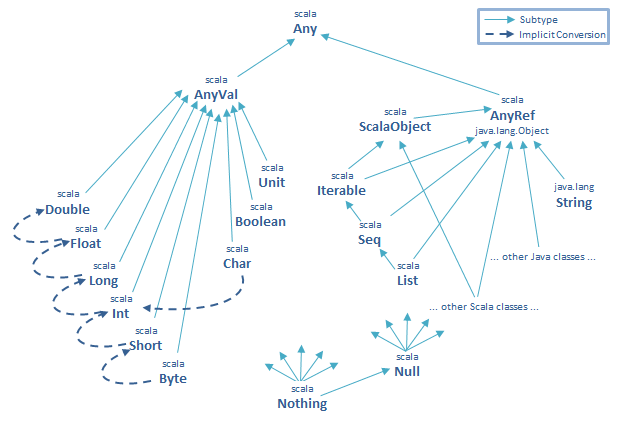

# 和Java比较

1. [很像Java](#1-很像Java)
2. 统一的对象模型
3. 函数也是**第一等级的值**
4. [统一的抽象模型【Scala has uniform and powerful abstraction concepts for both types and values】](#4-统一的抽象模型【Scala has uniform and powerful abstraction concepts for both types and values】)
5. OOP，特征混入（trait mixin）
6. 模式匹配
7. 隐式转换

> TODO：
> - [ ] 知乎上 [[Scala 是一门怎样的语言，具有哪些优缺点？]](https://www.zhihu.com/question/19748408) 得票最高的答案中的如下链接
>   * **Scala集合库的性能**，[视频在这](https://www.youtube.com/watch?v=tRiv35gNPoI&spfreload=10)。 讲的是Scala集合的运行速度，是一个来自Goldman Sachs的程序员讲他们为Java写的集合库（GSCollection）速度和内存消耗，但同时比较了[gs-collection](https://github.com/goldmansachs/gs-collections)，Java，和Scala库的速度。最后Scala的可变集合mutable原生库完爆Java，和gs-collection基本持平。
>   * **为了追求速度**，Scala社区是绝对不会管所谓的“简单”或者是“好玩”，怎样有效率就怎样弄。与其专注于JVM的改进，Scala社区大部分在编译器上下功夫，比如很著名的 [Miniboxing](http://scala-miniboxing.org/)，这是一个编译器增进器。Miniboxing做的是什么呢？只做一件事：防止auto-boxing和auto-unboxing。所有的泛型，尤其是原生类泛型（Primitive Types），诸如Int、Double等等，在进行各种操作的时候会自动取出和装回它们所属的类中去——这个我解释的不太好，但是可以看[这里(Java 的自动装箱与拆箱)](http://www.cnblogs.com/danne823/archive/2011/04/22/2025332.html)
> - 『自动装箱和拆箱』引出来 `@specialized`（可以参考 [Specializing for primitive types](http://www.scala-notes.org/2011/04/specializing-for-primitive-types/)），但这个功能用的并不多（泛型集合库没用，参见 *Programming Scala 2nd* 的8.2和12.4节，以及 [Why are so few things @specialized in Scala's standard library?](http://stackoverflow.com/questions/5477675/why-are-so-few-things-specialized-in-scalas-standard-library)），因此引出了 [Miniboxing](http://scala-miniboxing.org/)。
> - Java不允许使用**原语类型**（如 `int`）做参数类型，Scala 则**在语法层面**允许
>   ```scala
>      def doubleInt(x: Int) = x * 2
>      
>      class Reference[T] {
>        private var contents: T = _
>        def set(value: T) { contents = value }
>        def get: T = contents
>      }
>   ```
>   语法层面上，确实可以用 Scala.Int（对应 Java 的 int）做为类型参数，但在运行时还是会『自动装箱和拆箱』
>   ```scala
>      val cell = new Reference[Int]     // 实际上对应的是 Reference<Integer>
>      cell.set(13)                      // 运行时会分别调用 boxToInteger
>      doubleInt(cell.get)               // 和 unboxToInt
>   ```
>   上面的代码实际是：
>   ```scala
>      cell.set(BoxesRunTime.boxToInteger(13))
>      doubleInt(BoxesRunTime.unboxToInt(cell.get()))
>   ```

## 1 很像Java

- [Java to Scala cheatsheet](http://rea.tech/java-to-scala-cheatsheet/) 
- [Java developer's Scala cheatsheet](http://mbonaci.github.io/scala/)
- [谈谈Scala中的枚举](http://kubicode.me/2015/06/06/Scala/Enum-in-Scala/)

### 语句和表达式

语句没有值，比如`Class`定义，`Object`定义，`trait`定义，以及变量声明。反之，表达式有值，下面的几个语法构造在其它语言里是语句，在Scala中是表达式
- if-else
- while 和 for 循环
- throw

## 2 统一的对象模型



    AnyRef
      ==
      !=
      eq
      ne

## 3 函数也是**第一等级的值**

## 4 统一的抽象模型【Scala has uniform and powerful abstraction concepts for both types and values】

1. 参数化类型，即，泛型
2. 抽象类型

> Progamming Scala 第14.5节

**`参数化类型`**可以很好地用于**集合这类**容器中，此时，**类型参数所表示的元素类型和容器并没有什么联系**。举例来说，字符串列表、浮点数列表和整数列表的工作方式都相同。如果我们将其换成`抽象类型`会如何？以下 `Some` 的声明是从标准库中摘录的：
```scala
case final class Some[+A](val value : A) { ... }
```
如果我们试图将其换成`抽象类型`，那么
```scala
case final class Some(val value : ???) {
  type A
  ... 
}
```
由于类型 `A` 不在`构造函数`参数列表的作用域内，所以，我们无法表达参数 `value` 的类型。当需要在`构造函数`中使用类型的参数时，唯一合适的就是选择就是`参数化类型`

相反，`抽象类型`在相互联系密切的“类型家族”中则非常有用

> [Scala类型系统的目的——Martin Odersky访谈（三）](http://www.infoq.com/cn/articles/scala-type-system)，搜索**抽象类型成员**
>
> **Bill Venners**: 在Scala中，一个类型可以是另一种类型的内部成员，正如方法和字段可以是类型的内部成员。而且，Scala中的这些类型成员可以是抽象成员，就像Java方法那样抽象。那么抽象类型成员和泛型参数不就成了重复功能吗？为什么Scala两个功能都支持？抽象类型，相比泛型，能额外给你们带来什么好处？
>
> **Martin Odersky**: 抽象类型，相比泛型，的确有些额外好处。不过还是让我先说几句通用原理吧。对于抽象，业界一直有两套不同机制：参数化和抽象成员。Java也一样支持两套抽象，只不过Java的两套抽象取决于对什么进行抽象。**Java支持抽象方法，但不支持把方法作为参数；Java不支持抽象字段，但支持把值作为参数；Java不支持抽象类型成员，但支持把类型作为参数**。所以，在Java中，三者都可以抽象。但是对三者进行抽象时，原理有所区别。所以，你可以批判Java，三者区别太过武断。
>
> 我们在Scala中，试图把这些抽象支持得更完备、更正交。我们决定对上述三类成员都采用相同的构造原理。**所以，你既可以使用抽象字段，也可以使用值参数；既可以把方法（即“函数”）作为参数，也可以声明抽象方法；既可以指定类型参数也可以声明抽象类型**。总之，我们找到了三者的统一概念，可以按某一类成员的相同用法来使用另一类成员。至少在原则上，我们可以用同一种面向对象抽象成员的形式，表达全部三类参数。因此，在某种意义上可以说Scala是一种更正交、更完备的语言。
>
> 现在的问题来了，这对你有什么好处？具体到抽象类型，能带来的好处是，它能很好地处理我们先前谈到的协变问题。举个老生常谈的例子：动物和食物的问题。**这道题是这样的：从前有个Animal类，其中有个eat方法，可以用来吃东西。问题是，如果从Animal派生出一个类，比如Cow，那么就只能吃某一种食物，比如Grass。Cow不可以吃Fish之类的其他食物。你希望有办法可以声明，Cow拥有一个eat方法，且该方法只能用来吃Grass，而不能吃其他东西**。实际上，这个需求在Java中实现不了，因为你最终一定会构造出有矛盾的情形，类似我先前讲过的把Fruit赋值给Apple一样。
>
> 请问你该怎么做？Scala的答案是，在Animal类中增加一个抽象类型成员。比方说，Scala版的Animal类内部可以声明一个SuitableFood类型，但不定义它具体是什么。那么这就是抽象类型。你不给出类型实现，直接让Animal的eat方法吃下SuitableFood即可。然后，在Cow中声明：“好！这是一只Cow，派生自Animal。对Cow来说，其SuitableFood是Grass。”所以，抽象类型提供了一种机制：先在父类中声明未知类型，稍后再在子类中填上某种已知类型。
>
> 现在你可能会说，哎呀，我用参数也可以实现同样功能。确实可以。你可以给Animal增加参数，表示它能吃的食物。但实践中，当你需要支持许多不同功能时，就会导致参数爆炸。而且通常情况下，更要命的问题是，参数的边界。在1998年的ECOOP（欧洲面向对象编程会议）上，我和Kim Bruce、Phil Wadler发表了一篇论文。我们证明，当你线性增加未知概念数量时，一般来说程序规模会呈二次方增长。所以，我们有了很好的理由不用参数而用抽象成员，即为了避免二次方级别的代码膨胀。

## 5 OOP

> Patterns -> Abstractions
> Constraints -> Specifications | Contracts | Types

### 快学Scala的第5章和第6章

> TODO，根据 Spark 的 `Dataset` 来整理内容

### 单例对象

|       | 静态成员        |
| ----- | ----------- |
| Scala | 不支持，以单例对象替代 |
| Java  | 支持          |

-   Scala **不能定义静态成员**，这是比 Java 更为面向对象的地方
-   除了用 **`object`** 关键字替换 `class` 关键字之外，定义单例对象看上去和定义类一致
-   和『类同名的单例对象』称之为**伴生对象**，类和它的伴生对象
  * 必须定义在一个源文件里
  * 可以互相访问私有成员
-   单例对象不带参数，而类可以。这是因为单例对象不是用 `new` 关键字实例化的，所以没有机会给它传参数


> TODO 例子
> - [ ] 每个单例对象都被实现为虚构类（**synthetic class**）的实例，并指向静态的变量，因此它们与 Java 静态类有着相同的初始化语义
> - [ ] 虚构类（**synthetic class**）是对象名加上一个美元符号 **$**

### Cake Pattern(DI)

> TODO:
> - [ ] [Dependency Injection in Scala](http://blog.yunglinho.com/blog/2012/04/22/dependency-injection-in-scala/)
> - [ ] [Cake Pattern Resources](http://scabl.blogspot.com/p/cbdi.html)
> - [ ] Cake Pattern 现在还在用吗？Spark里能找到对应的例子吗？

### 特征混入（`trait` mixin）

Spark的 `StructType` 混入了 `Seq[StrcutField]`

```scala
case class StructType(fields: Array[StructField]) extends DataType with Seq[StructField] {
    override def apply(fieldIndex: Int): StructField = fields(fieldIndex)
    override def length: Int = fields.length
    override def iterator: Iterator[StructField] = fields.iterator
}
```

#### `trait` 可以从 `class` 继承

- [ ] 参见 [How to limit which classes can use a trait by inheritance](https://alvinalexander.com/scala/how-to-limit-which-classes-can-use-traits-inheritance-in-scala)
- [ ] [2 ways to limit classes that can extend traits in Scala](https://backtobazics.com/scala/2-ways-to-limit-classes-that-can-extend-traits-in-scala/)
- [ ] [Why can a Scala trait extend a class?](https://stackoverflow.com/questions/12854941/why-can-a-scala-trait-extend-a-class)

目前看来就是为了限制可以从`trait` 继承的类，从一个类继承的`trait`限制了哪些类可以从该`trait`继承——也就是说，所有混入了这个`trait`的类都必须继承自`trait扩展的类。

```scala
scala> class Foo
defined class Foo

scala> trait FooTrait extends Foo
defined trait FooTrait

scala> val good = new Foo with FooTrait
good: Foo with FooTrait = $anon$1@773d3f62

scala> class Bar
defined class Bar

scala> val bad = new Bar with FooTrait
<console>:10: error: illegal inheritance; superclass Bar
 is not a subclass of the superclass Foo
 of the mixin trait FooTrait
       val bad = new Bar with FooTrait
                              ^
```

## 6 模式匹配

> TODO：整理下面的内容
> - [ ] [An Introduction to Pattern Matching in Scala](https://newcircle.com/s/post/1696/an_Introduction_to_pattern_matching_in_scala_brian_clapper_tutorial)
> - [ ] [Case Classes and Pattern Matching](http://www.artima.com/pins1ed/case-classes-and-pattern-matching.html)（*Scala 编程*的第15章）
> - [ ] Case语句的中置表式法（参见**快学 Scala**的**14.11**节）
> - [ ] [[PDF] Matching Objects with patterns](https://infoscience.epfl.ch/record/98468/files/MatchingObjectsWithPatterns-TR.pdf)，特别是这篇PDF需要认真整理
> - [ ] [探索Scala（4）-- Case Classes](http://blog.csdn.net/zxhoo/article/details/40454075)
> - [ ] [如何在Scala中使用正则表达式进行模式匹配？](https://cloud.tencent.com/developer/ask/93649)
>

### PDF 里的内容

> Here, we take a very general view of patterns. **A pattern is simply some way of characterizing a group of objects and binding local names to objects that match some property in the classification.**
>
> The reason why patterns have so far played a lesser role in object-oriented languages might have to do with the object-oriented principle which states that behavior should be bundled with data and that the only form of differentiation should be through virtual method calls. This principle works well as long as (1) one can plan from the start for all patterns that will arise in an application, and (2) one only needs to decompose one object at a time.
>
> However, these two assumptions do not always hold. The extensive literature on the expression problem [5–8] has explored many situations where access patterns are constructed a-posteriori, after the interface of the base class is fixed. Furthermore, there are access patterns where the result depends on the kinds of several objects.

这里，我们对模式有一个非常一般的看法。模式**不过是描述一组对象的某种方式，并将==与分类中某些属性匹配的对象绑定到本地名称==**。

迄今为止，模式在面向对象语言中所起的作用较小的原因可能与面向对象原则有关，该原则规定行为应与数据捆绑在一起，<u>唯一的区分形式应该是通过虚拟方法调用</u>。这个原则可以很好地工作，只要（1）一开始就可以为应用程序中出现的所有模式进行计划，（2）每次只需要分解一个对象。

然而，这两个假设并不总是成立。关于表达式问题[5–8]的大量文献探讨了许多情况，即，访问模式是在基类接口固定之后构建的。此外，还有一些访问模式，其结果取决于几个对象的类型。

### 模式的种类

1. 通配模式
2. 常量模式
3. 变量模式
4. 构造器模式，scala 支持深度匹配（deep match）
5. 序列模式
6. 元组模式
7. 类型模式
8. 变量绑定

其它特性：

1. 模式守卫
2. 模式重叠
3. 中缀法

#### 无处不在的模式

在scala中，模式可以出现在很多地方，而不是单单出现在`match`表达式里。下面几个场景也是使用模式的地方：

1. 变量定义中的模式
2. 大括号里的case语句是偏函数，注意这里没有`match`关键字了。
3. `for`表达式里的模式

### 样例类

[Scala之Case Class](http://blog.csdn.net/bluishglc/article/details/50914001)

当一个类被声名为case class的时候，scala会帮助我们做下面几件事情： 

1. 构造器中的参数如果不被声明为var的话，它默认的话是val类型的，但一般不推荐将构造器中的参数声明为var 
2. 实现自己的`toString`、`hashCode`、`copy`、`equals`方法 
3. 编译器对case类混入了`Product`特质
4. 编译器对case类增加了`copy`方法
5. **自动创建伴生对象**：
   - 工厂方法：自动实现`apply`方法，使得我们在使用的时候可以不直接显示地`new`对象 
   - 析构方法：实现`unapply`方法，从而可以将`case class`应用于模式匹配，该方法是进行==构造器模式匹配==时的关键
   - 伴生对象继承了`AbstractFunction`[这意味着什么]()？

除此之此，case class与其它普通的scala类没有区别。

#### Generating auxiliary constructors for case classes

A *case class* is a special type of class that generates a *lot* of boilerplate code for you. Because of the way they work, adding what appears to be an auxiliary constructor to a `case class` is different than adding an auxiliary constructor to a **regular** class. ==This is because they are not really constructors: they are `apply` methods in the companion object of the class.==

To demonstrate this, assume that you start with this case class in a file named *Person.scala*:

```Scala
// initial case class
case class Person (var name: String, var age: Int)
```

This lets you create a new `Person` instance without using the `new` keyword, like this:

```scala
val p = Person("John Smith", 30)
```

**This appears to be a different form of a constructor, but in fact, it's a little syntactic sugar—a factory method, to be precise. When you write this line of code:**

```Scala
val p = Person("John Smith", 30)
```

behind the scenes, the Scala compiler converts it into this:

```Scala
val p = Person.apply("John Smith", 30)
```

This is a call to an `apply` method in the companion object of the `Person` class. You don't see this, you just see the line that you wrote, but this is how the compiler translates your code. As a result, if you want to add new “constructors” to your case class, you write new `apply` methods. (To be clear, the word “constructor” is used loosely here.)****

**For instance,** if you decide that you want to add auxiliary constructors to let you create new `Person` instances (a) without specifying any parameters, and (b) by only specifying their `name`, the solution is to add `apply` methods to the companion object of the `Person` case class in the *Person.scala* file:

```scala
// the case class
case class Person (var name: String, var age: Int)

// the companion object
object Person {

  def apply() = new Person("<no name>", 0)
  def apply(name: String) = new Person(name, 0)

}
```

The following test code demonstrates that this works as desired:

```scala
object CaseClassTest extends App {

  val a = Person()         // corresponds to apply()
  val b = Person("Pam")    // corresponds to apply(name: String)
  val c = Person("William Shatner", 82)

  println(a)
  println(b)
  println(c)

  // verify the setter methods work
  a.name = "Leonard Nimoy"
  a.age = 82
  println(a)
}
```

This code results in the following output:

```Scala
Person(<no name>,0)
Person(Pam,0)
Person(William Shatner,82)
Person(Leonard Nimoy,82)
```

> TODO：
>
> - [x] ~~为`样例类`手写伴生对象会是什么情况？比如Spark的`LocalRelation`~~。[见上面](#generating-auxiliary-constructors-for-case-classes)，简单的说就是为`case class`创建<u>多个构造器</u>

### 提取器

```scala
object EMail {
  // The injection method (optional)
  def apply(user: String, domain: String): String = user + "@" + domain
  // The extraction method (mandatory)
  def unapply(str: String): Option[(String, String)] = {
    val parts = str split "@"
    if (parts.length == 2) Some(parts(0), parts(1)) else None
  }
}
```

`var EMail(u, d) = "baibaichen@gmail.com"` 等价于：

```java
Option localOption = EMail.upapply("baibaichen@gmail.com");
Tuple2 localTuple = localOption.get();
String u = localTuple21._1;
String d = localTuple21._2;
```

> TODO:
>
> - [ ] `unapplySeq`的情况要解释下

## 7 隐式转换

> TODO：
>
> - [ ] 隐式转换的作用域

# 其它

## 错误处理

- [Error Handling in Scala](https://tersesystems.com/blog/2012/12/27/error-handling-in-scala/)
  - [aother one](https://gist.github.com/davegurnell/8e7a4b671f21a7636152)
- [Option](https://windor.gitbooks.io/beginners-guide-to-scala/content/chp5-the-option-type.html)
- [Try](https://windor.gitbooks.io/beginners-guide-to-scala/content/chp6-error-handling-with-try.html)
- [Either](https://windor.gitbooks.io/beginners-guide-to-scala/content/chp7-the-either-type.html)

## 集合

Scala的集合很复杂，因此2.13引入了新的设计：

1. [当前的设计](https://docs.scala-lang.org/zh-cn/overviews/core/architecture-of-scala-collections.html)，也可以看*Programming in Scala 3rd Edition*中文版的第25章。*Programming Scala 2nd Edition*中文版第12章。
2. 为什么要重新设计
   1. [SCALA 2.13 COLLECTIONS REWORK](https://www.scala-lang.org/blog/2017/02/28/collections-rework.html)
   2. [Wanted: Strawman proposals for new collections architecture](https://github.com/lampepfl/dotty/issues/818)
   3. [Ongoing work on standard collections redesign](https://contributors.scala-lang.org/t/ongoing-work-on-standard-collections-redesign/293)
   4. 一些讨论，[Fixing scala.collection.Iterator](https://alexn.org/blog/2017/01/16/iterator.html)，[What should go in an iterator](https://github.com/scala/collection-strawman/issues/17)
   5. 中间代码：https://github.com/scala/collection-strawman
3. 当前的设计
   1. [THE ARCHITECTURE OF SCALA 2.13’S COLLECTIONS](https://docs.scala-lang.org/overviews/core/architecture-of-scala-213-collections.html)

### 集合的架构

- [ ] 


### [数组](http://docs.scala-lang.org/zh-cn/overviews/collections/arrays)

在Scala中，数组是一种特殊的collection。一方面，Scala数组与Java数组是一一对应的。即Scala数组`Array[Int]`可看作Java的`Int[]`，`Array[Double]`可看作Java的`double[]`，以及`Array[String]`可看作Java的`String[]`。但Scala数组比Java数组提供了更多内容。
- 首先，Scala数组是==一种泛型==。即可以定义一个Array[T]，T可以是一种类型参数或抽象类型。
- 其次，Scala数组与Scala序列是兼容的 - 在需要Seq[T]的地方可由Array[T]代替。
- 最后，Scala数组支持所有的序列操作

#### 创建【编译器有特殊支持】

如果**类型已知**，比如下面的代码：

```scala
val a1 = new Array[Int](10)
val a2 = Array(1, 2, 3)
a1(1)=a2(2)
```

编译器会直接翻译成如下的Java代码

```java
int[] a1 = new int[10];
int[] a2 = { 1, 2, 3, 4 };
a1[1] = a2[2];
```

如果**类型未知**，比如：

```scala
def evenElems[T: ClassTag](xs: Vector[T]): Array[T] = {
  val arr = new Array[T]((xs.length + 1) / 2) // 代码1
  for (i <- 0 until xs.length by 2)           // 这个代码有可读性吗?
    arr(i / 2) = xs(i)                        // 代码2
  arr
}
```

函数必须要声明一个`ClassTag[T]`的隐式参数（具体的隐式值由编译器提供），这时代码会被翻译成:

```java
// evidence$1 的类型是 ClassTag[T]
//代码1，注意evidence$1就是传进来的隐式值
final Object arr = evidence$1.newArray((xs.length() + 1) / 2); 
//代码2，并不是arr.update(i/2)这样的标准语法
ScalaRunTime.array_update(arr, i/2, xs.apply(2))               
```

`ClassTag.newArry()`会根据**类型T的运行时信息**，在**运行时**选择恰当的方法创建数组

> 参考
>   1 . [Java为什么不支持泛型数组？](https://www.zhihu.com/question/20928981)
> 2. [Java泛型：类型擦除](https://segmentfault.com/a/1190000003831229)中的[代码片段七](https://segmentfault.com/a/1190000003831229#articleHeader9)。
>
>       > 本质方法还是通过显示地传递类型标签，通过`Array.newInstance(type, size)`来生成数组，同时也是最为推荐的在泛型内部生成数组的方法。

### 不变集合的数据结构
> TODO：
> - [ ] 调研 Spark 中的 `TreeNode`
>   * `TreeNode` 为什么要从 `Product` 扩展？
>   * `TreeNode` 类层次是什么？
>   * `makeCopy`的实现原理，用到了那些和 runtime 相关的方法？
>   * **persistent data structure** 是如何实现的？

## 枚举

1. [Scala Enumerations](http://underscore.io/blog/posts/2014/09/03/enumerations.html)
2. http://stackoverflow.com/questions/1898932/case-objects-vs-enumerations-in-scala

## 注解

Scala 使用 `@transient` 注解不需要序列化的字段。

> TODO：
> - [ ] 为什么没有 `transient` 关键字？
> - [x] [Scala and the `@transient lazy val` pattern](http://fdahms.com/2015/10/14/scala-and-the-transient-lazy-val-pattern/)
>       ```scala
>       // 比如 Spark 中 Dataset的几个字段
>       @transient private[sql] val logicalPlan: LogicalPlan = ...
>       @transient lazy val sqlContext: SQLContext = ...
>       ```

## 字面量

### Symbol 字面量

字面量`'id` 是表达式 `scala.Symbol("id")` 的简写方式。Spark中也有使用，如下：

```scala
testData3.groupBy('a).agg(count('b))
```

>  注意：这里还涉及到**隐式转换**。定义在[`SQLImplicits`](https://spark.apache.org/docs/latest/api/scala/#org.apache.spark.sql.SQLImplicits)
>
>  ```scala
>  implicit def symbolToColumn(s: Symbol): ColumnName = new ColumnName(s.name)
>  ```
>
>  不过，`SQLImplicits` 是一个抽象类，`SparkSession`定义了`object`
>
>  ```scala
>    object implicits extends SQLImplicits with Serializable {
>      protected override def _sqlContext: SQLContext = SparkSession.this.sqlContext
>    }
>  ```
>
>  所以一般的用法是：
>
>  ```scala
>  val spark:SparkSession = ...// create SparkSession
>  
>  // 在需要的地方
>  import spark.implicits._
>  ```

## 下划线( `_` ) 的使用场景

### 参考
1. [浅谈 Scala 中下划线的用途](https://my.oschina.net/leejun2005/blog/405305)

2. [Scala基础 - 下划线使用指南](https://my.oschina.net/joymufeng/blog/863823)

3. [知乎](https://www.zhihu.com/question/21622725)

4. 导入类型和成员时，取代（`*`）作为 `import` 的通配符，`*` 在 `scala` 中被允许用作**函数名**。（这特么脑子有毛病）。

5. 用于消除歧义：
   - 定义部分应用函数（**Partially Applied Functions**）时。参见*Scala程序设计（Programming Scala）***6.5**节。
   - 使用函数的“meta 方法”，如调用 `Function.curried`，参见*Scala程序设计（Programming Scala）***6.6**节。
   
6. [Meaning of underscore in lift[A,B](f: A => B): Option[A\] => Option[B] = _ map f](https://stackoverflow.com/questions/28375449/meaning-of-underscore-in-lifta-bf-a-b-optiona-optionb-map-f)
  
   ```scala
   def lift[A,B](f: A => B): Option[A] => Option[B] = _ map f

   // 
   // 这里的下划线是函数的简写。编译器足够智能，可以根据方法签名的返回类型推断出的含义是：
   def lift[A,B](f: A => B): Option[A] => Option[B] = (_: Option[A]).map(f)
   
   // 进而扩展到：
   def lift[A,B](f: A => B): Option[A] => Option[B] = (o: Option[A]) => o.map(f)
   ```
   
7. xcd

8. 

    

    

### Spark中的例子

1. 对变量进行默认初始化，比如：

    ```scala
         private[parquet] class ParquetReadSupport extends ReadSupport[UnsafeRow] with Logging {
           private var catalystRequestedSchema: StructType = _
           //...
         }
    ```
2. 占位符语法：

    ```scala
    /*
      testNumericDataTypes 的参数testFunc是一个没有返回值（Unit）的函数。  
      testFunc 的参数是一个 Int => Any 的函数，即，将整数转换为另一种数据类型的转换函数。
    */
    class ArithmeticExpressionSuite {
      private def testNumericDataTypes(testFunc: (Int => Any) => Unit): Unit = {
        testFunc(_.toByte)  // 这个等价于 testFunc((x:int) => x.toByte)
        testFunc(_.toShort)
        testFunc(identity)
        testFunc(_.toLong)
        testFunc(_.toFloat)
        testFunc(_.toDouble)
        testFunc(Decimal(_))
      }
      test("+ (Add)") {
        testNumericDataTypes { convert =>
          val left = Literal(convert(1))
          val right = Literal(convert(2))
          checkEvaluation(Add(left, right), convert(3))
          checkEvaluation(Add(Literal.create(null, left.dataType), right), null)
          checkEvaluation(Add(left, Literal.create(null, right.dataType)), null)
        }  
      }
    }
    ```

## Scala的反射机制

- [ ] [Scala的反射机制](https://github.com/slamke/blog/wiki/Scala%E7%9A%84%E5%8F%8D%E5%B0%84%E6%9C%BA%E5%88%B6)

##对象
### 伴生对象

[Scala 伴生对象的细节](https://ooon.me/2016/09/scala-object-static-forwarders/)

伴生对象首先是一个`单例对象`，单例对象用关键字object定义。在Scala中，单例对象分为两种，一种是并未自动关联到特定类上的单例对象，称为独立对象（Standalone Object）；另一种是关联到一个类上的单例对象，该单例对象与该类共有相同名字，则这种单例对象称为伴生对象（**Companion Object**），对应类称为伴生类。

1. **类**和它的**伴生对象**可以相互访问私有特性。

2. 通常将`伴生对象`作为工厂使用

   > Putting an `apply` method on a companion object is the conventional idiom for defining a factory method for the class.

3. 把隐式转换放在伴生对象中。

### 单例对象

1. 创建单例对象的时候，需要传参数[Best way to create singleton object with parameter](https://users.scala-lang.org/t/best-way-to-create-singleton-object-with-parameter/538)，重点：**Singletons are initialized lazily**.

   |                                          | Pros                                     | Cons                                     |
   | ---------------------------------------- | ---------------------------------------- | ---------------------------------------- |
   | Make it a class, have the client construct it, give the value in the parameter | Preserves immutability                   | Having only a single instance might be hard to manage |
   | Add a variable for the parameter to the object, add a setter. | You still have a singleton               | There is mutable state now               |
   | Implement a [multiton](http://en.wikipedia.org/wiki/Multiton_pattern) | Gives you (apparent) immutability and singleton (per param) | More code to implement                   |

   参考`SQLImplicits`的实现

## 函数

### [在Scala中，多个参数列表和每个列表的多个参数有什么区别](https://stackoverflow.com/questions/6803211/whats-the-difference-between-multiple-parameters-lists-and-multiple-parameters)？

在Scala中，可以这样定义函数：

```scala
def curriedFunc(arg1: Int) (arg2: String) = { ... }
```

上述curriedFunc函数定义与**两个参数列表**和**单个参数列表中具有多个参数**的函数之间的区别是什么？

```scala
def curriedFunc(arg1: Int, arg2: String) = { ... }
```

从数学的角度来看是`(curriedFunc(x))(y)`和`curriedFunc(x，y)`，但我可以定义成`def sum(x)(y)= x+y`，或是`def sum2(x，y) = x+y`，这两种定义一样。我知道只有一个区别 – 这是 **partially applied functions**，两种方式对我都是等效的，是否有其他差异？

------

<u>严格地说，这不是一个curried函数</u>，而是一个有多个参数列表的方法，虽然它看起来像一个函数。正如你所说，多个参数列表允许使用该方法代替**==部分应用的函数==**。

> 我不理解<u>严格地说，这不是一个curried函数</u>这句话，`def curriedFunc(arg1: Int) (arg2: String) = { ... }`这个在scala里就是柯里化，参见[多参数列表（柯里化）](https://docs.scala-lang.org/zh-cn/tour/multiple-parameter-lists.html)：方法可以定义多个参数列表，当使用较少的参数列表调用多参数列表的方法时，会产生一个新的函数，该函数接收剩余的参数列表作为其参数，这被称为**柯里化**。换言之，**柯里化**是支持多个参数列表的一种函数编写方式。
>

```scala
object NonCurr {
  def tabulate[A](n: Int, fun: Int => A) = IndexedSeq.tabulate(n)(fun)
}

NonCurr.tabulate[Double](10, _)            // 不允许
val x = IndexedSeq.tabulate[Double](10) _  // 允许. x 现在是Function1
x(math.exp(_))                             // 完整应用
```

另一个好处是，如果第二个参数列表由单个函数或**thunk**组成，您可以使用**大括号**而不是**圆括号**，例如：

```scala
NonCurr.tabulate(10, { i => val j = util.Random.nextInt(i + 1); i - i % 2 })
```

与

```scala
IndexedSeq.tabulate(10) { i =>
  val j = util.Random.nextInt(i + 1)
  i - i % 2
}
```

或者代码块：

```scala
IndexedSeq.fill(10) {
  println("debug: operating the random number generator")
  util.Random.nextInt(99)
}
```

另一个优点是，你可以引用**上一个参数列表的参数**来定义**默认参数值**（虽然你也可以说它是一个缺点，你不能在单个列表中这样做）

```scala
def doSomething(f: java.io.File)(modDate: Long = f.lastModified) = ???
```

最后，在这个相关的帖子[Why does Scala provide both multiple parameters lists and multiple parameters per list?](https://stackoverflow.com/questions/4684185/why-does-scala-provide-both-multiple-parameters-lists-and-multiple-parameters-per)里有三个回答。我把它们复制在这里：。

**首先**：你可以有多个var args，这在单个参数列表中是不可能的：

```scala
def foo(as: Int*)(bs: Int*)(cs: Int*) = as.sum * bs.sum * cs.sum
```

**第二**，它有助于**类型推理**：

```scala
def foo[T](a: T, b: T)(op: (T,T) => T) = op(a, b)
foo(1, 2){_ + _}   // compiler can infer the type of the op function

def foo2[T](a: T, b: T, op: (T,T) => T) = op(a, b)
foo2(1, 2, _ + _)  // compiler too stupid, unfortunately
```

**最后**，这是你可以同时拥有有**隐式**和**非隐式**参数的唯一方法，因为`implicit`修饰符是针对整个参数列表的：

```scala
def gaga [A](x: A)(implicit mf: Manifest[A]) = ???   // 可以
def gaga2[A](x: A, implicit mf: Manifest[A]) = ???   // 不行
```
### [Scala之小括号和花括号](https://blog.csdn.net/bluishglc/article/details/52946575)

（Parentheses & Crurly Braces）

尽管这是一个非常基础的问题，但是如果不仔细梳理一下，还是会导致在某些场景下误读代码。原因是Scala对这两兄弟的使用实在是太灵活了，甚至可以说有些“随便”，本文将况逐一讨论下两者在不同场景的使用方法和区别

#### 在调用函数时
人们会笼统地说在函数调用时，小括号和花括号是通用的，但实际上，情况会复杂的多。

##### 如果你要调用的函数有两个或两个以上的参数，那么你只能使用“小括号”

请看下面的示例：
```scala
scala> var add = (x: Int,y: Int) => x + y
add: (Int, Int) => Int = <function2>

scala> add(1,2)
res0: Int = 3

scala> add{1,2}
<console>:1: error: ';' expected but ',' found.
add{1,2}
     ^
```

##### 如果你要调用的函数只有单一参数，那么“通常”情况下小括号和花括号是可以互换的

请看下面的示例：
``` scala
scala> var increase = (x: Int) => x + 1
increase: Int => Int = <function1>

scala> increase(10)
res0: Int = 11

scala> increase{10}
res1: Int = 11
```

##### 在调用单一参数函数时，小括号和花括号虽然等效，但还是有差异的
如果使用==小括号==，意味着你告诉编译器：它只接受单一的一行，因此，如果你意外地输入2行或更多，编译器就会报错。但对==花括号==来说则不然，如果你在花括号里忘记了一个操作符，代码是可以编译的，但是会得到出乎意料的结果，进而导致难以追踪的Bug. 看如下的例子：
```scala
scala> def method(x: Int) = {
     |     x + 1
     | }
method: (x: Int)Int

scala> method {
     |   1 +
     |   2
     |   3
     | }
<console>:14: warning: a pure expression does nothing in statement position; you may be omitting necessary parentheses
         1 +
           ^
res14: Int = 4

scala> method(
     |   1 +
     |   2
     |   3
<console>:4: error: ')' expected but integer literal found.
  3
  ^
```
花括号的调用虽然有warning，但是可以编译通过，小括号的调用会编译报错，但是花括号版本的返回值4是一个超出预期的结果。注意，1+2是一行，它们合在一起才是一个完整的表达式，3是独立的表达式，算第二行。
> 注：难道这里想表达的是 `1+2+3`?

所以，在调用单一参数函数时，特别是高阶函数， 如果函数参数用一行可以表达，通常我们推荐还是使用小括号，这样我们可以借助编译器获得更好的错误检查。

##### 在调用一个单一参数函数时，如果参数本身是一个通过case语句实现的 “偏函数”，你只能使用“花括号”
究其原因，我觉得scala对小括号和花括号的使用还是有一种“习惯上”的定位的：**通常人们还是会认为小括号是面向单行的，花括号面向多行的**。在使用case实现偏函数时，通常都会是多个case语句，小括号不能满足这种场合，只是说在只有一个case语句时，会让人产生误解，认为只有一行，为什么不使用case语句。
```scala
scala> val tupleList = List[(String, String)]()
tupleList: List[(String, String)] = List()

scala> val filtered = tupleList.takeWhile( case (s1, s2) => s1 == s2 )
<console>:1: error: illegal start of simple expression
val filtered = tupleList.takeWhile( case (s1, s2) => s1 == s2 )
                                    ^
// List[(String, String)] 中的(String, String)是个二元组。
scala> val filtered = tupleList.takeWhile{ case (s1, s2) => s1 == s2 }
filtered: List[(String, String)] = List()
```

#### 作为表达式（expression）和语句块（code blocks）时

如果需要声明、多个语句、导入或类似的内容，则需要大括号。**由于表达式是一个语句，括号可能出现在大括号内**。但有趣的是，代码块也是表达式，因此可以在表达式内的任何位置使用它们。

**在非函数调用时，小括号可以用于界定表达式，花括号可以用于界定代码块**。代码块由多条语句(statement)组成，每一条语句可以是一个”import”语句，一个变量或函数的声明，或者是一个表达式（expression），而一个表达式必定也是一条语句（statement），所以小括号可能出现在花括号里面，同时，语句块里可以出现表达式，所以花括号也可能出现在小括号里。看看下面的例子：

```scala
1       // literal - 字面量
(1)     // expression - 表达式
{1}     // block of code - 代码块
({1})   // expression with a block of code - 表达式里是一个语句块
{(1)}   // block of code with an expression - 语句块里是一个表达式
({(1)}) // you get the drift... - 你懂的。。。。
```
## 例子

### val 可以 `override` 方法

    RuleExecutor/*...*/ {
       abstract class Strategy { def maxIterations: Int }
       
       case class FixedPoint(maxIterations: Int) extends Strategy
    }

在超类中实际定义的是 `maxIterations` 方法，但是在 `FixedPoint` 子类中，我们定义的是一个**val 变量**！

#### Spark中的例子

```scala
FileSourceScanExec extends DataSourceScanExec with ColumnarBatchScan {
  override lazy val (outputPartitioning, outputOrdering): (Partitioning, Seq[SortOrder]) = ...
}

```

#### 在`trait`中使用 `def` 的更多动机

`def`可以通过`def`，`val`，`lazy val`或`object`来实现。所以这是定义成员最抽象的形式。由于`trait`通常是抽象接口，所以在`trait`用`val`定义，就说明了应该如何实现。

> 在[Stack Overflow页面](https://stackoverflow.com/questions/19642053/when-to-use-val-or-def-in-scala-traits)的这个注释，为在`trait`中使用`def`字段的原因提供了一些更好的观点：
>
> > `def`可以通过`def`，`val`，`lazy val`或`object`来实现。所以这是定义成员最抽象的形式。由于`trait`通常是抽象接口，所以在`trait`用`val`定义，就说明了应该如何实现。
>
> 编写真正有意义的代码的角度来看，该段中最后两个句子说得不错。他们了解了在一个`trait`中创造这样一个字段的本质：
>
> - 我的意图是什么？
> - 在`trait`中暴露`id`字段，我试图表达什么？
>
> 我以前在Java中非常随意地编程 - 比如不担心将字段标记为`private`或 `final`等等 - 但随着我变老（并且希望更加明智），我已经了解到，使用Scala你可以非常清楚地知道，你试图通过自己的方式来传达给自己和其他开发人员的信息。花一些时间来思考这样的问题。你应该能够对其他开发者说：“我故意这样做，这就是为什么......”

#### 参考

1. [On Using `def` vs `val` To Define Abstract Members in Scala Traits](https://alvinalexander.com/scala/fp-book/def-vs-val-abstract-members-traits-classes-override)
2. [Choices with def and val in Scala](https://blog.jessitron.com/2012/07/10/choices-with-def-and-val-in-scala/)，**这个有货**。

### Loop没有`break`和`continue`

首先，Scala的 `for` **和Java不一样，其次语言本身不推荐使用手写的循环，所以没有 `break` 和 `continue`， 目的是使之不好用。 但有时候需要 `break` 或者 `continue`，一般用 `while` 模拟实现，参见[`RuleExecutor.execute`]()，摘取的代码如下：

    var continue = true
    while(continue){
      if( ... ){
        ....
        continue = false  // 如果是Java 使用break
      }
    }

### 语法糖，大括号里的case语句是[偏函数]()

注意，Scala集合中的`flodLeft`的声明是这样的：

    /* 
     * 1. 按科里化方式声明flodLeft
     * 2. 第一个参数：类型为B的初始值
     * 3. 第二个参数：类型是二元函数，其参数类型分别为B，A，返回类型是B
     */
    def foldLeft[B](z: B)(op: (B, A) => B): B 

参见[`RuleExecutor.execute`]()，摘取的代码如下

    curPlan = batch.rules.foldLeft(curPlan) {
      case (plan, rule) =>
        ...
        val result = rule(plan)
        ...
        result
    }

去除语法糖之后，其实是这样的

    curPlan = batch.rules.foldLeft(curPlan) { 
      new AbstractFunction2(){
        public final TreeType apply(TreeType plan, Rule<TreeType> rule){
          ....
          //偏函数，如果前面不能匹配成功，运行到这会抛除 MatchError 异常
          throw new MatchError(localTuple2);
        }
      }
    }

注意这里是**多态**的

| class           | plan的类型           | rule的类型                 | 阶段     |
| --------------- | ----------------- | ----------------------- | ------ |
| [`Analyzer`]()  | [`LogicalPlan`]() | [`Rule[LogicalPlan]`]() | 分析阶段   |
| [`Optimizer`]() | [`LogicalPlan`]() | [`Rule[LogicalPlan]`]() | 逻辑优化阶段 |

> 物理优化阶段没有用这个类，原因是这里是 `LogicalPlan => LogicalPlan` 的转化，而那里是`LogicalPlan => SparkPlan`的转化


### 和JAVA的互操作
> TODO 
>
> - [ ] 解释 `val func: (T) => Iterator[U] = x => f.call(x).`**`asScala`**

```scala
    /**
    * :: Experimental ::
    * (Scala-specific)
    * Returns a new Dataset by first applying a function to all elements of this Dataset,
    * and then flattening the results.
    *
    * @group typedrel
    * @since 1.6.0
    */
    @Experimental
    def flatMap[U : Encoder](func: T => TraversableOnce[U]): Dataset[U] =
      mapPartitions(_.flatMap(func))

    /**
    * :: Experimental ::
    * (Java-specific)
    * Returns a new Dataset by first applying a function to all elements of this Dataset,
    * and then flattening the results.
    *
    * @group typedrel
    * @since 1.6.0
    */
    def flatMap[U](f: FlatMapFunction[T, U], encoder: Encoder[U]): Dataset[U] = {
      val func: (T) => Iterator[U] = x => f.call(x).asScala
      flatMap(func)(encoder)
    }
```

注意 `flatMap` 的定义
- scala的版本需要一个隐式参数
- java的版本则需要两个参数，注意是如何传隐式参数的 `flatMap(func)`*`(encoder)`*

### 如何实现一个集合


> TODO 
>
> - [ ] 调研[`StreamProgress`](https://github.com/apache/spark/blob/master/sql/core/src/main/scala/org/apache/spark/sql/execution/streaming/StreamProgress.scala)是如何实现的


### 字面量
**字面量就是写在代码里的常量**

> TODO 
> - [ ] 函数字面量
>

### 相等性

Scala的 `==` 与Java的有何差别? **Java里的 `==` 既可以比较原始类型也可以比较引用类型。**
- 首先，Scala的 `==` **不是操作符！！！**，它是**定义在 `Any` 中的 `final` 方法（即不可重载）**。
- 对于原始类型（**值类型**），Scala和Java一样，`==` 用于比较**值的相等性**。
- 对于引用类型，Java的 `==` 用于比较**引用相等性**，也就是说这两个变量是否都指向于JVM堆里的同一个对象。Scala也提供了这种机制，名字是**`eq`**，是**定义在 `AnyRef` 中的 `final` 方法**。但是，`eq` 和它的反义词，`ne`，仅仅应用于可以直接映射到Java的对象。此外，Java的 `Object` 有一个 **`equals`** 方法，用于『让用户定义引用类型』的逻辑相等性，**缺省使用`==`来实现**，因此Java中对象的每个实例**只与它自身相等**。Scala的 `==` 是这样实现的：

```scala
  //定义在Any中
  final def==(that: Any): Boolean =
    if (this eq null ) that eq null
    else this.equals(that)
```

> TODO
> - [ ] [如何用Java语言编写相等方法](http://www.artima.com/lejava/articles/equality.html)，相关的内容包含在*Programming in Scala* 的中文版的第28章
> - [ ]*Effective Java* 中文版的 [条款8]() 和 [条款9]()

对于样例类，除非**显式地定义**，将自动生成 `toString` **`equals`** `hashCode` 和 `copy` 方法。Spark的 `Literal`

```scala
case class Literal protected (value: Any, dataType: DataType)
  extends LeafExpression with CodegenFallback {
  ...
  override def toString: String = if (value != null) value.toString else "null"
  override def hashCode(): Int = 
    31 * (31 * Objects.hashCode(dataType)) + Objects.hashCode(value)
  override def equals(other: Any): Boolean = other match {
    case o: Literal =>
      dataType.equals(o.dataType) &&
        (value == null && null == o.value || value != null && value.equals(o.value))
    case _ => false
  }
}
```

> TODO `Literal` 为什么要显式定义这些方法？

### 中置类型 `Predef.<:<`

中置类型是指以**中置语法**表示『带有两个类型参数』的类型，此时，类型名称写在两个类型参数之间。比如：

```scala
Map[String,Int]
```

可以写成

```scala
String Map Int
```
#### 类型证明（中置类型的应用）
在 `Predef` 对象中，定义了这么如下两个抽象类，用于类型约束

| 类型证明      | 含义                    |
| --------- | --------------------- |
| `T =:= U` | 类型 `T` 是否等于类型 `U`     |
| `T <:< U` | 类型 `T` 是否是类型 `U` 的子类型 |


抽象类（Scala 2.11.8） `<:<` 的的定义如下
```scala
  /**
   * An instance of `A <:< B` witnesses that `A` is a subtype of `B`.
   * Requiring an implicit argument of the type `A <:< B` encodes
   * the generalized constraint `A <: B`.
   *
   * @note we need a new type constructor `<:<` and evidence `conforms`,
   * as reusing `Function1` and `identity` leads to ambiguities in
   * case of type errors (`any2stringadd` is inferred)
   *
   * To constrain any abstract type T that's in scope in a method's
   * argument list (not just the method's own type parameters) simply
   * add an implicit argument of type `T <:< U`, where `U` is the required
   * upper bound; or for lower-bounds, use: `L <:< T`, where `L` is the
   * required lower bound.
   *
   * In part contributed by Jason Zaugg.
   */
  @implicitNotFound(msg = "Cannot prove that ${From} <:< ${To}.")
  sealed abstract class <:<[-From, +To] extends (From => To) with Serializable
  private[this] final val singleton_<:< = new <:<[Any,Any] { def apply(x: Any): Any = x }
  // The dollar prefix is to dodge accidental shadowing of this method
  // by a user-defined method of the same name (SI-7788).
  // The collections rely on this method.
  implicit def $conforms[A]: A <:< A = singleton_<:<.asInstanceOf[A <:< A]
```
一般的使用方式是为『方法』增加一个类型为 `T <:< U` 的隐式参数，比如：

    def firstLast[A,C](it : C)(implicit ev : C <:< Iterable[A]) = 
      (it.head, it.last)

注意到，`<:<` 对 `From` 是逆变，对 `To` 是协变，因此** `String <:< AnyRef` 是 `String <:< String` 的父类**，即

```scala
var  evChild : <:<[String,String] = $conforms[String]  
val evParent : <:<[String,AnyRef] = evChild
```

所以编译器在处理**约束** `implicit ev : C <:< Iterable[A]` 时，实际上是在看『能否将函数 `$conforms[C]` 的返回值赋给隐式参数 `ev`』，也就是在测试 **`C <:< Iterable[A]` 是否是 `C <:< C` 的父类**：

```scala
var  evChild : <:<[C,C]           = $conforms[C]
val       ev : <:<[C,Iterable[A]] = evChild      //编译通过，则说明 C 是 Iterable[A]的子类型
```

现在，到了一个比较**难**的点，从 Java 的角度来看 `ev` 是 `Function1` 对象的实例，在 Scala 中 `ev` 是一个 `C => Iterable[A]` 的函数，它是一个**恒等函数**，即返回传入的参数，等价于『做了一次向上的类型转换』。

```scala
    private[this] final val singleton_<:< = new <:<[Any,Any] { def apply(x: Any): Any = x }
```

编译器在编译 `firstLast` 时，并不知道 `C` 的具体类型，也就是说 `it.head` 和 `it.last` 这两个调用**不合法**。，而 `ev` 是个隐式参数，因此又触发了一次**隐式转换**，`(it.head, it.last)` 实际上被转换成

      (ev(it).head, ev(it).last)

Spark 中并没有使用到 `Predef.<:<`，但是集合库中的 `Map` 有用到
```scala
trait Map[A, +B] extends ... { 
  ...
  override def toMap[T, U](implicit ev: (A, B) <:< (T, U)): immutable.Map[T, U] =
    self.asInstanceOf[immutable.Map[T, U]]

}
```

> 吐槽：中置表示法，以及用**其它语言中的操作符**来声明类，是不是真的提高了可读性？
> TODO：隐式转换的规则
> TODO：Spark 大量用到了 Scala 反射API中 `TypeApi.<:<` 这个方法

### `Predef.identity`

为什么需要一个预定义的 `identity` 函数？ 参见：
1. [What does Predef.identity do in scala?](http://stackoverflow.com/questions/28407482/what-does-predef-identity-do-in-scala)
2. [Is there a scala identity function?](http://stackoverflow.com/questions/1797502/is-there-a-scala-identity-function)

关于2的解释
```scala
    // 如何从 List[Option[String] 转成 List[String]， 比如有如下列表
    val l = List(Some("Hello"), None, Some("World"))

    //我们想得到 List(Hello, World)，有三种做法
    val a = l.flatMap(identity[Option[String]])
    val b = for (x <- l; y<-x ) yield y
    val c = l.flatMap( x => x)
```
- 首先，`List.flatMap`需要一个 `A => GenTraversableOnce[B]` 的函数
- 其次，`Option` 的伴生对象里有一个隐式转换 `option2Iterable` 把 `Option` 的实例转换成 `Iterable` 的实例

所以
- 变量 `a`，实际上是 `l.flatMap( x => Option.option2Iterable(identity(x)))`
- 变量 `b`，再加上for产生式的规则，实际上是`l.flatMap(x => Option.option2Iterable(x.map(y => y))`
- 但最简单的是变量 `c`，隐式转换后是 `l.flatMap( x => Option.option2Iterable(x))`，

当然了这三种方法由于涉及到**隐式转换**，个人觉得对新手而言，并没有可读性，反而让人看不懂！

**`identity` 一般的用法主要是传给高阶函数，使代码更加易于组合，另一面也可以达到自描述的目的。比如 Spark 的工具类 `StringKeyHashMap`**
```scala
package org.apache.spark.sql.catalyst.util

/**
 * Build a map with String type of key, and it also supports either key case
 * sensitive or insensitive.
 */
object StringKeyHashMap {
  def apply[T](caseSensitive: Boolean): StringKeyHashMap[T] = caseSensitive match {
    case false => new StringKeyHashMap[T](_.toLowerCase)
    case true  => new StringKeyHashMap[T](identity)
  }
}

class StringKeyHashMap[T](normalizer: (String) => String) {
...
}
```
这里 `StringKeyHashMap` 类需要一个**策略**函数 `normalizer: (String) => String`，而其伴生对象则根据 `caseSensitive` 使用不同的 `normalizer` 创建 `StringKeyHashMap` 实例。这样就既可以创建**键值大小写敏感**的哈希表，也可以创建**键值大小写不敏感**的哈希表。

### 惰性求值（即，惰值）

[内容参见*快学 Scala* 的2.11节]()。当 `val` 被声明为 `lazy` 时，它的初始化将会延迟到『第一次使用它』时。我们来看下 Spark中的 `QueryExecution` 类，

    // 在 QueryExecution 类中定义惰值 executedPlan
    lazy val executedPlan: SparkPlan = prepareForExecution(sparkPlan)
    
    // QueryExecution 成员变量列表
                            type          val       lazy
    QueryExecution
      sparkSession    -> SparkSession     [Y]
      logical         -> LogicalPlan      [Y]
      analyzed        -> LogicalPlan      [Y]        [Y]
      withCachedData  -> LogicalPlan      [Y]        [Y]
      optimizedPlan   -> LogicalPlan      [Y]        [Y]
      sparkPlan       -> SparkPlan        [Y]        [Y]
      executedPlan    -> SparkPlan        [Y]        [Y]
      toRdd           -> RDD[InternalRow] [Y]        [Y]

注意：使用 Spark 的 `Dataset` 获取最终的结果时，大致的思路是先调用 `SparkPlan.execute()`，获得 `RDD`，然后再调用 `RDD` 的 Action。

```scala
//伪码
class Dataset[T]{
  def collect : Array[T] = {             //缺省是Public的
    queryExecution.
      executedPlan.                      //这个 executedPlan 是 lazy 的
        executeCollect()
  }	
}

abstract class SparkPlan {
  def executeCollect(): Array[InternalRow] = {
    val byteArrayRdd = getByteArrayRdd()  //获取RDD

    // 调用RDD的Action，获取最终的结果
    byteArrayRdd.collect()
    ...
  }
}
```

> TODO 画图
> 依赖关系：```logical -> analyzed -> withCachedData -> optimizedPlan -> sparkPlan -> executedPlan```
> 求值顺序：```logical <- analyzed <- withCachedData <- optimizedPlan <- sparkPlan <- executedPlan```
>
> 吐槽：惰性求值推迟了初始化，在语言层面上提供了**按需求值**的语义，但是
> 1. 有额外的开销，每次访问**惰值**，都会调用一个『线程安全的』方法来检查该值是否已被初始化。
> 2. 可读性，初始化的地点，并非是你定义**惰值**的地方。

### Pass by Name

例子
- *ExecutorClassLoader.scala* 中的 `getClassFileInputStreamFromSparkRPC`，看怎么实现 `toClassNotFound`。


### Scala的 `Product` 特质

> TODO
>
> - [ ] [Playing with Scala Products](http://erikengbrecht.blogspot.com/2010/12/playing-with-scala-products.html)

例子， TreeNode.scala 的 `mapProductIterator`

```scala
abstract class TreeNode[...] extends Produce{
  protected def mapProductIterator[B: ClassTag](f: Any => B): Array[B] = {
    val arr = Array.ofDim[B](productArity)
    var i = 0
    while (i < arr.length) {
      arr(i) = f(productElement(i))
      i += 1
    }
    arr
  }
}
```

### 链式 API

参见 `DataFrameReader` 的设计

### 变长参数

1. *快学 Scala* 第2.9节
2. 参见 `DataFrameReader.text` 了解 `_*` 的用法
3. 为了 Java 互操作的 scala.annotation.varargs
4. 变长参数允许 0 个 或多个，如何表达至少有一个参数？ 可参考 `RelationalGroupedDataset.agg`

```scala
// 你这么定义 sumInt
def sumInt(xs: Int*) = { }

//下面两个调用都合法
sumInt(1,2,3)
sumInt()

//怎么表达至少一个参数？
```

### 在Scala中，JavaConverters和JavaConversions有什么区别？

1. [What is the difference between JavaConverters and JavaConversions in Scala?](https://stackoverflow.com/questions/8301947/what-is-the-difference-between-javaconverters-and-javaconversions-in-scala)
2. [在Scala中，JavaConverters和JavaConversions有什么区别？](https://ask.helplib.com/others/post_290571)

Spark中的例子:

``` scala
// MapOutputTrackerMaster
val shuffleStatuses = new ConcurrentHashMap[Int, ShuffleStatus]().asScala
```

