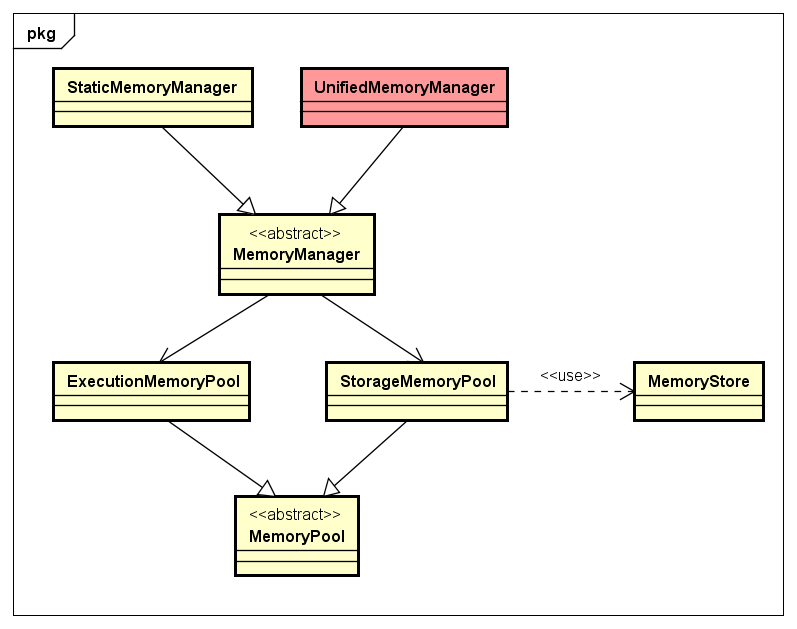
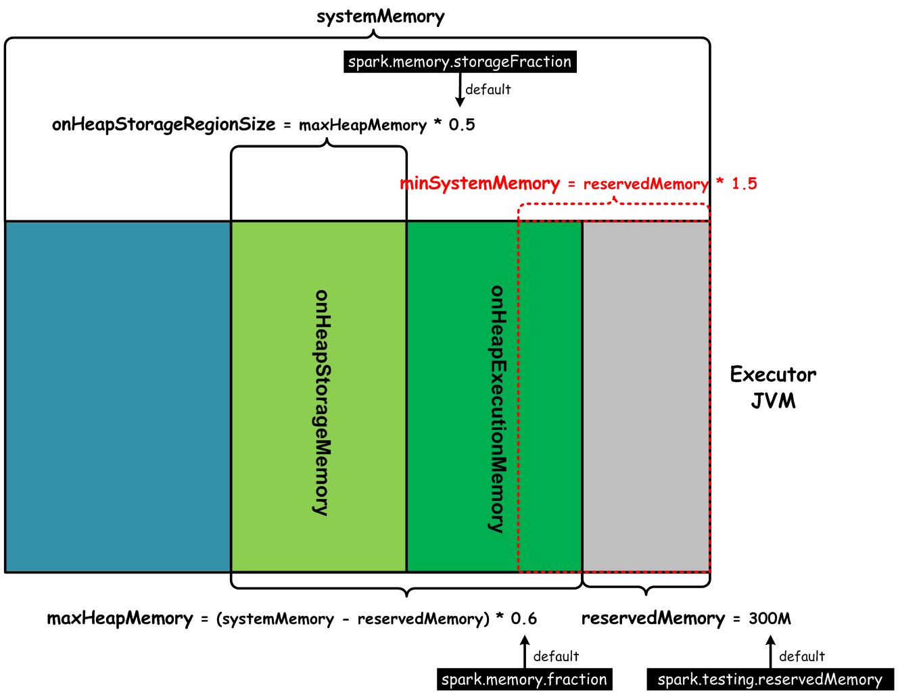
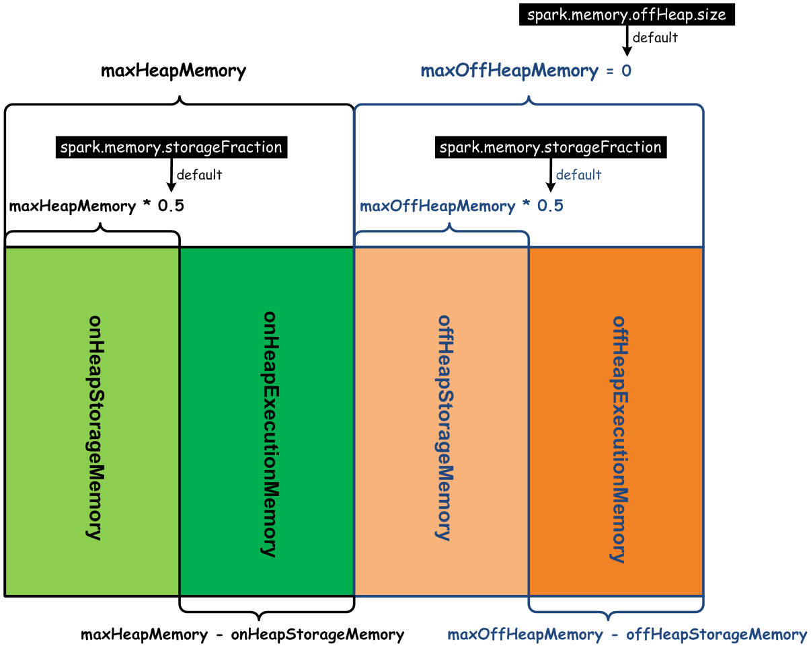

# Spark UnifiedMemoryManager内存管理模型分析

http://shiyanjun.cn/archives/1585.html

Spark的内存使用，大体上可以分为两类：Execution内存和Storage内存。在Spark 1.5版本之前，内存管理使用的是StaticMemoryManager，该内存管理模型最大的特点就是，可以为Execution内存区与Storage内存区配置一个静态的boundary，这种方式实现起来比较简单，但是存在一些问题：

1. 没有一个合理的默认值能够适应不同计算场景下的Workload
2. 内存调优困难，需要对Spark内部原理非常熟悉才能做好
3. 对不需要Cache的Application的计算场景，只能使用很少一部分内存

为了克服上述提到的问题，尽量提高Spark计算的通用性，降低内存调优难度，减少OOM导致的失败问题，从Spark 1.6版本开始，新增了UnifiedMemoryManager（统一内存管理）内存管理模型的实现。UnifiedMemoryManager依赖的一些组件类及其关系，如下类图所示：

从上图可以看出，最直接最核心的就是StorageMemoryPool 和ExecutionMemoryPool，它们实现了动态内存池（Memory Pool）的功能，能够动态调整Storage内存区与Execution内存区之间的Soft boundary，使内存管理更加灵活。下面我们从**内存布局**和**内存控制**两个方面，来分析UnifiedMemoryManager内存管理模型。

**内存布局**

UnifiedMemoryManager是MemoryManager的一种实现，是基于StaticMemoryManager的改进。这种模型也是将某个执行Task的Executor JVM内存划分为两类内存区域：

- Storage内存区：**用来缓存Task数据、在Spark集群中传输（Propagation）内部数据**。
- Execution内存区：**用于满足Shuffle、Join、Sort、Aggregation计算过程中对内存的需求**。

这种新的内存管理模型，在Storage内存区与Execution内存区之间抽象出一个**Soft boundary**，能够满足当某一个内存区中内存用量不足的时候，可以从另一个内存区中借用。我们可以理解为，上面Storage内存和Execution堆内存是受Spark管理的，而且每一个内存区是可以动态伸缩的。这样的好处是，当某一个内存区内存使用量达到初始分配值，如果不能够动态伸缩，不能在两类内存区之间进行动态调整（Borrow），或者如果某个Task计算的数据量很大超过限制，就会出现OOM异常导致Task执行失败。应该说，在一定程度上，UnifiedMemoryManager内存管理模型降低了发生OOM的概率。
我们知道，在Spark Application提交以后，最终会在Worker上启动独立的Executor JVM，Task就运行在Executor里面。在一个Executor JVM内部，基于UnifiedMemoryManager这种内存管理模型，堆内存的布局如下图所示：

上图中，systemMemory是Executor JVM的全部堆内存，在全部堆内存基础上reservedMemory是预留内存，默认300M，则用于Spark计算使用堆内存大小默认是：

```scala
maxHeapMemory = (systemMemory - reservedMemory) * 0.6 
```

受Spark管理的堆内存，使用去除预留内存后的、剩余内存的百分比，可以通过参数`spark.memory.fraction`来配置，默认值是0.6。Executor JVM堆内存，去除预留的reservedMemory内存，默认剩下堆内存的60%用于execution和storage这两类堆内存，默认情况下，Execution和Storage内存区各占50%，这个也可以通过参数spark.memory.storageFraction来配置，默认值是0.5。比如，在所有参数使用默认值的情况下，我们的Executor JVM内存为指定为2G，那么Unified Memory大小为(1024 * 2 – 300) * 0.6 = 1048MB，其中，Execution和Storage内存区大小分别为1048 * 0.5 = 524MB。
另外，还有一个用来保证Spark Application能够计算的最小Executor JVM内存大小限制，即为minSystemMemory = reservedMemory * 1.5 = 300 * 1.5 = 450MB，我们假设Executor JVM配置了这个默认最小限制值450MB，则受Spark管理的堆内存大小为(450 – 300) * 0.6 = 90MB，其中Execution和Storage内存大小分别为90 * 0.5 = 45MB，这种情况对一些小内存用量的Spark计算也能够很好的支持。
上面，我们详细说明了受Spark管理的堆内存（OnHeap Memory）的布局，UnifiedMemoryManager也能够对非堆内存（OffHeap Memory）进行管理。Spark堆内存和非堆内存的布局，如下图所示：

通过上图可以看到，非堆内存（OffHeap Memory）默认大小配置值为0，表示不使用非堆内存，可以通过参数spark.memory.offHeap.size来设置非堆内存的大小。无论是对堆内存，还是对非堆内存，都分为Execution内存和Storage内存两部分，他们的分配大小比例通过参数spark.memory.storageFraction来控制，默认是0.5。

**内存控制**

通过上面，我们了解了UnifiedMemoryManager这种内存管理模型的内存布局状况。接下来，我们看一下，通过UnifiedMemoryManager的API，如何对内存进行控制（分配/回收）。内存的控制，也对应于Execution内存与Storage内存，分别有一个StorageMemoryPool 和ExecutionMemoryPool，在实现类UnifiedMemoryManager中可以看到通过这两个MemoryPool实现来控制内存大小的伸缩（Increment/Decrement）。
获取当前堆上的最大可用Storage内存，如下maxOnHeapStorageMemory方法所示：

```scala
override def maxOnHeapStorageMemory: Long = synchronized {
  maxHeapMemory - onHeapExecutionMemoryPool.memoryUsed
}
```

可以看到，maxHeapMemory表示堆上可用的Execution内存与Storage内存总量之和，减去Execution内存中已经被占用的内存，剩余的都是堆上的最大可用Storage内存。
在UnifiedMemoryManager中，两类最核心的操作，就是申请/释放Storage内存、申请/释放Execution内存，分别说明如下：

- 申请Storage内存

申请Storage内存的逻辑，实现代码如下所示：

```scala
override def acquireStorageMemory(
    blockId: BlockId,
    numBytes: Long,
    memoryMode: MemoryMode): Boolean = synchronized { // 为blockId申请numBytes字节大小的内存
  assertInvariants()
  assert(numBytes >= 0)
  val (executionPool, storagePool, maxMemory) = memoryMode match { 
    // 根据memoryMode值，返回对应的StorageMemoryPool与ExecutionMemoryPool
    case MemoryMode.ON_HEAP => (
      onHeapExecutionMemoryPool,
      onHeapStorageMemoryPool,
      maxOnHeapStorageMemory)
    case MemoryMode.OFF_HEAP => (
      offHeapExecutionMemoryPool,
      offHeapStorageMemoryPool,
      maxOffHeapMemory)
  }
  if (numBytes > maxMemory) { 
    // 如申请的内存大于最大的Storage内存量（对应maxOnHeapStorageMemory()返回的内存大小），则申请失败
    // Fail fast if the block simply won't fit
    logInfo(s"Will not store $blockId as the required space ($numBytes bytes) exceeds our " +
      s"memory limit ($maxMemory bytes)")
    return false
  }
  if (numBytes > storagePool.memoryFree) { 
    // 如果Storage内存块中没有足够可用内存给blockId使用，则计算当前Storage内存区缺少多少内存，
    // 然后从Execution内存区中借用
    // There is not enough free memory in the storage pool, so try to borrow free memory from
    // the execution pool.
    val memoryBorrowedFromExecution = Math.min(executionPool.memoryFree, numBytes)
    executionPool.decrementPoolSize(memoryBorrowedFromExecution) // Execution内存区减掉借用内存量
    storagePool.incrementPoolSize(memoryBorrowedFromExecution) // Storage内存区增加借用内存量
  }
  storagePool.acquireMemory(blockId, numBytes) 
  // 如果Storage内存区可以为blockId分配内存，直接成功分配；
  // 否则，如果从Execution内存区中借用的内存能够满足blockId，则分配成功，不能满足则分配失败。
}
```

如果Storage内存区可用内存满足申请大小，则直接成功分配内存；如果Storage内存区可用内存大于0且小于申请的内存大小，则需要从Execution内存区借用满足分配大小的内存，如果借用成功，则直接成功分配内存，否则分配失败；如果申请的内存超过了Storage内存区的最大内存量，则分配失败。
另外，UnifiedMemoryManager.acquireUnrollMemory()方法提供了对Unroll内存的申请，Unroll内存就是Storage内存：

```scala
override def acquireUnrollMemory(
    blockId: BlockId,
    numBytes: Long,
    memoryMode: MemoryMode): Boolean = synchronized {
  acquireStorageMemory(blockId, numBytes, memoryMode)
}
```

Unroll内存 ，被用来在Storage内存中Unroll（展开）指定的Block数据。

- 释放Storage内存

释放Storage内存比较简单，只需要更新Storage内存计量变量即可，如下所示：

```scala
def releaseMemory(size: Long): Unit = lock.synchronized {
  if (size > _memoryUsed) {
    logWarning(s"Attempted to release $size bytes of storage " +
      s"memory when we only have ${_memoryUsed} bytes")
    _memoryUsed = 0
  } else {
    _memoryUsed -= size
  }
}
```

- 申请Execution内存

申请Execution内存，相对复杂一些，调用acquireExecutionMemory()方法可能会阻塞，直到Execution内存区有可用内存为止。UnifiedMemoryManager的acquireExecutionMemory()方法实现如下所示：

```scala
    override private[memory] def acquireExecutionMemory(
    numBytes: Long,
    taskAttemptId: Long,
    memoryMode: MemoryMode): Long = synchronized {
  ... ...
  executionPool.acquireMemory(
    numBytes, taskAttemptId, maybeGrowExecutionPool, computeMaxExecutionPoolSize)
}
```

上面代码，调用了ExecutionMemoryPool的acquireMemory()方法，该方法的参数需要2个函数（maybeGrowExecutionPool函数用来控制如何增加Execution内存区对应Pool的大小，computeMaxExecutionPoolSize函数用来获取当前Execution内存区对应Pool的大小）。ExecutionMemoryPool的acquireMemory()方法签名，如下所示：

```scala
private[memory] def acquireMemory(
    numBytes: Long,
    taskAttemptId: Long,
    maybeGrowPool: Long => Unit = (additionalSpaceNeeded: Long) => Unit,
    computeMaxPoolSize: () => Long = () => poolSize): Long = lock.synchronized {
```
在UnifiedMemoryManager内部，实现了如何动态增加Execution内存区对应Pool大小的函数，即为maybeGrowExecutionPool函数，代码如下所示：
```scala
def maybeGrowExecutionPool(extraMemoryNeeded: Long): Unit = {
  if (extraMemoryNeeded > 0) {
    // execution pool中没有足够的可用内存，因此请尝试从storage pool回收内存。 我们可以从storage pool
    // 回收任何可用内存。 如果storage pool已经增长到大于`storageRegionSize`，可以evict block，
    // 收回storage pool向execution pool借用的内存。
    val memoryReclaimableFromStorage = 
      math.max( storagePool.memoryFree,  storagePool.poolSize - storageRegionSize) 
    // 这里memoryReclaimableFromStorage大于0，说明当前Storage pool有可用内存，可以Shrink该Pool的
    // 内存，作为Execution pool的可用内存使用
    if (memoryReclaimableFromStorage > 0) { 
      // 只收回必要和可用的空间:如果可用内存大于请求内存extraMemoryNeeded，则Storage pool缩小的内存量
      // 为extraMemoryNeeded，否则将Storage pool全部可用内存贡献出去
      val spaceToReclaim = storagePool.freeSpaceToShrinkPool( 
                               math.min(extraMemoryNeeded, memoryReclaimableFromStorage)) 
      storagePool.decrementPoolSize(spaceToReclaim) // Storage内存区减掉借用内存量
      executionPool.incrementPoolSize(spaceToReclaim)  // Execution内存区增加借用内存量
    }
  }
}
```

==需要说明的是，上面的`storagePool.poolSize`的大小可能大于**Storage pool**初始最大内存大小==，主要是通过借用**Execution pool**的内存导致的。这里，`storagePool.freeSpaceToShrinkPool()`方法会Shrink掉Storage pool可用内存，我们可以看下StorageMemoryPool中如何Shrink Storage内存，方法如下所示：

```scala
def freeSpaceToShrinkPool(spaceToFree: Long): Long = lock.synchronized {
  val spaceFreedByReleasingUnusedMemory = math.min(spaceToFree, memoryFree)
  // Storage内存区需要释放remainingSpaceToFree大小的内存
  val remainingSpaceToFree = spaceToFree - spaceFreedByReleasingUnusedMemory 
  // 大于0表示当前Storage内存区已经无可用内存，需要通过清理Storage内存区的block来实现Shrink操作
  if (remainingSpaceToFree > 0) { 
    // If reclaiming free memory did not adequately shrink the pool, begin evicting blocks:
    // 通过清理Storage内存区的block释放的内存大小
    val spaceFreedByEviction =  
       memoryStore.evictBlocksToFreeSpace(None, remainingSpaceToFree, memoryMode)  
    // When a block is released, BlockManager.dropFromMemory() calls releaseMemory(), so we do
    // not need to decrement _memoryUsed here. However, we do need to decrement the pool size.
    spaceFreedByReleasingUnusedMemory + spaceFreedByEviction
  } else { 
    // remainingSpaceToFree<=0说明当前Storage内存区可用内存足够，不需要通过清理缓存的Block来释放内存
    spaceFreedByReleasingUnusedMemory
  }
}
```

MemoryStore如何evictBlocksToFreeSpace，可以查阅MemoryStore类源码，这里暂时不做说明。
最后，我们说明ExecutionMemoryPool.acquireMemory()方法与ExecutionMemoryPool.releaseMemory()方法的实现。在说明方法实现逻辑之前，我们先说明一下Execution内存区内存分配的基本原则：

**==如果有N个活跃（Active）的Task在运行，ExecutionMemoryPool需要保证每个Task在将中间结果数据Spill到磁盘之前，至少能够申请到当前Execution内存区对应的Pool中1/2N大小的内存量，至多是1/N大小的内存。这里N是动态变化的，因为可能有新的Task被启动，也有可能Task运行完成释放资源，所以ExecutionMemoryPool会持续跟踪ExecutionMemoryPool内部Task集合memoryForTask的变化，并不断地重新计算分配给每个Task的这两个内存量的值：1/2N和1/N。==**

为了代码紧凑清晰，我把ExecutionMemoryPool.acquireMemory()方法源码中不必要的注释去掉了，代码如下所示：

```scala
private[memory] def acquireMemory(
    numBytes: Long,
    taskAttemptId: Long,
    maybeGrowPool: Long => Unit = (additionalSpaceNeeded: Long) => Unit,
    computeMaxPoolSize: () => Long = () => poolSize): Long = lock.synchronized {
  assert(numBytes > 0, s"invalid number of bytes requested: $numBytes")

  // ExecutionMemoryPool内部维护了一个HashMap<TaskAttempID, 内存占用字节数>
  if (!memoryForTask.contains(taskAttemptId)) { 
    memoryForTask(taskAttemptId) = 0L
    // This will later cause waiting tasks to wake up and check numTasks again
    lock.notifyAll()
  }

  while (true) {
    val numActiveTasks = memoryForTask.keys.size // 当前活跃的Task数量
    val curMem = memoryForTask(taskAttemptId) // 当前Task使用的内存量

    // 如果需要，通过Shrink Storage内存区对应的Pool内存来增加Execution内存区内存大小
    maybeGrowPool(numBytes - memoryFree) 

    val maxPoolSize = computeMaxPoolSize() // 计算当前Execution内存区对应Pool的大小
    
    // 计算1/N：将当前Execution内存区对应Pool的大小，平均分配给所有活跃的Task，
    // 得到每个Task能够获取到的最大内存大小
    val maxMemoryPerTask = maxPoolSize / numActiveTasks 
    
    // 计算1/2N：每个Task能够获取到的最小内存大小
    val minMemoryPerTask = poolSize / (2 * numActiveTasks) 
    
    // 允许当前Task获取到最大内存（范围：0 <= X <= 1 / numActiveTasks ）
    val maxToGrant = math.min(numBytes, math.max(0, maxMemoryPerTask - curMem)) 
    val toGrant = math.min(maxToGrant, memoryFree) // 计算能分配给当前Task的内存大小

    // 如果当前Task无法获取到1 / (2 * numActiveTasks)的内存，并且能分配给当前Task的内存大小
    // 无法满足申请的内存量，则阻塞等待其他Task释放内存后在lock上通知
    if (toGrant < numBytes && curMem + toGrant < minMemoryPerTask) {
      logInfo(s"TID $taskAttemptId waiting for at least 1/2N of $poolName pool to be free")
      // 在ExecutionMemoryPool.releaseMemory()方法中会通知等待内存分配的Task，有内存释放
      lock.wait() 
    } else {
      // 当前Task获取到内存，需要登记到memoryForTask表中
      memoryForTask(taskAttemptId) += toGrant 
      return toGrant
    }
  }
  0L  // Never reached
}
```

- 释放Execution内存

相对应的，ExecutionMemoryPool.releaseMemory()方法实现了对Execution内存的释放操作，方法实现代码如下所示：

```scala
def releaseMemory(numBytes: Long, taskAttemptId: Long): Unit = lock.synchronized {
  val curMem = memoryForTask.getOrElse(taskAttemptId, 0L)
  var memoryToFree = if (curMem < numBytes) { // 计算释放内存大小
    logWarning( s"Internal error: release called on $numBytes bytes but task only has $curMem bytes " +
        s"of memory from the $poolName pool")
    curMem
  } else {
    numBytes
  }
  if (memoryForTask.contains(taskAttemptId)) { // Task执行完成，从内部维护的memoryForTask中移除
    memoryForTask(taskAttemptId) -= memoryToFree
    if (memoryForTask(taskAttemptId) <= 0) {
      memoryForTask.remove(taskAttemptId)
    }
  }
  lock.notifyAll() // 通知调用acquireMemory()方法申请内存的Task内存已经释放
}
```

**总结**

需要注意的，每个Executor JVM中只存在一个UnifiedMemoryManager实例，该对象统一控制该JVM内对Storage和Execution内存的申请和释放操作。
通过上面的分析，UnifiedMemoryManager可以看做一个统一的内存管理控制器，底层通过StorageMemoryPool 与ExecutionMemoryPool提供的申请内存、释放内存的功能，实现最基本的bookkeeping功能。再向底层，实际操作Block及其Java对象等数据的功能，都是在MemoryStore中进行的，MemoryStore被用来在内存中存储数据，主要包括block、反序列化的Java对象数组、序列化的ByteBuffer，同时它提供了存取内存中各种格式数据的操作。关于MemoryStore的基本结构和原理，我们后续会单独分析。

**参考内容**

- Spark-2.0.0源码
- [https://issues.apache.org/jira/browse/SPARK-10000](https://issues.apache.org/jira/browse/SPARK-10000)