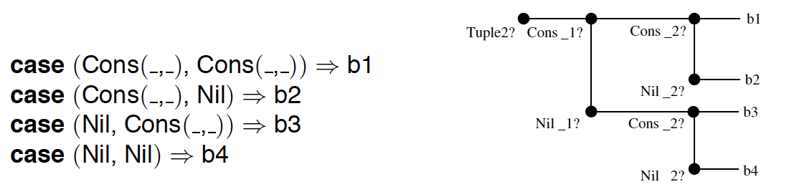

# Matching Objects With Patterns

**Abstract**. Data in object-oriented programming is organized in a hierarchy of classes. The problem of object-oriented pattern matching is how to explore this hierarchy from the outside. This usually involves classifying objects by their run-time type, accessing their members, or determining some other characteristic of a group of objects. In this paper we compare six different pattern matching techniques: object-oriented decomposition, visitors, type-tests/type-casts, typecase, case classes, and extractors. The techniques are compared on nine criteria related to conciseness, maintainability and performance. The paper introduces case classes and extractors as two newpattern-matching methods and shows that their combination works well for all of the established criteria.

> **摘要**。面向对象编程中的数据按类的层次结构组织。面向对象模式匹配的问题是如何从外部探索这种层次结构。这通常涉及到按对象的运行时类型对其进行分类、访问其成员或确定一组对象的某些其他特征。本文比较了六种不同的模式匹配技术：面向对象的分解、访问者、类型测试/类型转换、typecase、 样例类和提取器。在简洁性、可维护性和性能的九个标准上对这些技术进行了比较。本文介绍了模式匹配的两种新方法：**样例类**和**提取器**，并表明它们的组合适用于所有既定标准。

## 1 引言

Data in object-oriented programming is organized in a hierarchy of classes. The problem of object-oriented pattern matching is how to explore this hierarchy from the outside. This usually involves classifying objects by their run-time type, accessing their members, or determining some other characteristic of a group of objects. Here, we take a very general view of patterns. A pattern is simply some way of characterizing a group of objects and binding local names to objects that match some property in the classification.

> **面向对象编程中，==需要==按类的层次结构来组织数据**。面向对象的模式匹配要解决的是**如何从外部探索这种层次结构**。这通常涉及到按对象的运行时类型对其进行分类、访问其成员或确定一组对象的某些其他特征。这里，我们对模式有一个非常一般的看法。==模式==**不过是描述一组对象的某种方式，并将==与分类中某些属性匹配的对象绑定到本地名称==**。

A number of functional languages are built on patterns as an essential syntactic construct. Examples are SML, OCaml or Haskell. In object-oriented languages, patterns are much less common, even though some research exists [1–4]. Mainstream object-oriented languages propose to do pattern matching through encodings, such as virtual classification methods, visitors, or type-tests and type-casts.

> 许多函数式语言都将模式匹配作为一种基本的句法结构。 例如SML，OCaml或Haskell。 即使存在一些研究[1-4]，面向对象语言中的模式==匹配==也不太常见。 主流的面向对象语言建议通过编码进行模式匹配，例如虚拟分类方法，**访问者**或类型测试和类型转换。

The reason why patterns have so far played a lesser role in object-oriented languages might have to do with the object-oriented principle which states that behavior should be bundled with data and that the only form of differentiation should be through virtual method calls. This principle works well as long as (1) one can plan from the start for all **patterns** that will arise in an application, and (2) one only needs to **decompose** one object at a time.

> 迄今为止，模式在面向对象语言中所起的作用较小的原因可能与面向对象原则有关，该原则规定行为应与数据捆绑在一起，通过虚拟方法调用是<u>区分不同数据的唯一形式</u>。这个原则可以很好地工作，只要（1）一开始就可以为应用程序中出现的所有模式进行计划，（2）每次只需要分解一个对象。

However, these two assumptions do not always hold. The extensive literature on the expression problem [5–8] has explored many situations where access patterns are constructed a-posteriori, after the interface of the base class is fixed. Furthermore, there are access patterns where the result depends on the kinds of several objects.

> 然而，这两个假设并不总是成立。关于表达式问题[5–8]的大量文献探讨了许多情况，即，访问模式是在基类接口固定之后构建的。此外，还有一些访问模式，其结果取决于几个对象的类型。

-----

^2^

Consider for instance symbolic manipulation of expressions. We assume a hierarchy of classes, rooted in a base class Expr and containing classes for specific forms of expressions, such as Mul for multiplication operations, Var for variables, and Num for numeric literals. Different forms of expressions have different members: Mul has two members left and right denoting its left and right operand, whereas Num has a member value denoting an integer. A class hiercharchy like this is expressed as follows (we use Scala as programming notation throughout the paper).

> 例如，考虑表达式的符号操作。 假设类的层次结构是以`Expr`为基类，用不同的子类表示特定的表达式，例如用于乘法运算的`Mul`，用于变量的`Var`和用于数字字面量的`Num`。 不同的表达式有不同的成员：`Mul`有`left` 和`right`两个成员，表示其左右操作数；而`Num`有一个`value`成员表示整数值。 像这样的类等级表示如下（在整篇论文中，我们使用Scala作为编程语言）。

```scala
class Expr
class Num(val value : int) extends Expr
class Var(val name : String) extends Expr
class Mul(val left : Expr, val right : Expr) extends Expr
```

A particular expression would then be constructed as follows

> 按下面的方式构造一个具体的表达式:

```scala
new Mul(new Num(21), new Num(2))
```

Let’s say we want to write a simplifier for arithmetic expressions. This program should try to apply a set of simplification rules, until no more rewrites are possible. An example simplification rule would make use of the right-neutrality of the number one. That is,

> 假设我们想为算术表达式编写一个简化器，简化器将**<u>尝试应用</u>**一组简化规则，直到不能再重写为止。 比如某个简化规则利用数字1的==<u>中立性</u>==，也就是：

```java
new Mul(x, new Num(1)) is replaced with x .
```

The question is how simplification rules like the one above can be expressed. This is an instance of the object-oriented pattern matching problem, where objects of several variant types connected in possibly recursive data structures need to be classified and decomposed from the outside. We will review in this paper the six techniques for this task: (1) classical object-oriented decomposition, (2) visitors, (3) type-tests/type-casts, (4) typecase, (5) case classes, and (6) extractors. Of these, the first three are well known in object-oriented languages. The fourth technique, typecase, is well known in the types community, but its extensions to type patterns in Scala is new. The fifth technique, case classes, is specific to Scala. The sixth technique,extractors, is new. It has been proposed independently by JohnWilliams for Scala [9] and by Don Syme under the name “active patterns” for F# [10]. The basic F# design is in many ways similar to the Scala design, but Scala’s treatment of parametricity is different. Every technique will be evaluated along nine criteria. The first three criteria are concerned with conciseness of expression:

> 如何表达<span style='color:red'>像上面这样的</span>简化规则？这是**面向对象语言中模式匹配**的一个==**难题**==，此时，需要从外部提取**数据结构中相互连接的、不同类型的**多个对象，并且这个数据结构有可能是递归的。我们将在本文中回顾这项任务的六种技术：（1）经典的面向对象分解，（2）访问者，（3）类型测试/类型转换，（4）typecase，（5）样例类，以及（6）提取器。其中，前三个在面向对象语言中众所周知。第四种技术**typecase**在类型社区中众所周知，但在Scala中，它对类型模式的扩展是**新方法**。第五种技术是Scala特有的**样例类**。第六种是新技术**提取器**，由 John Williams和Don Syme各自在Scala [9]和F＃[10]独立提出，但在F#中被称之为“活动模式”，F#的基本设计在许多方面和Scala类似，但Scala对参数化的处理不同。每项技术都将根据九项标准进行评估。前三个是表达简洁性的标准：

1. Conciseness/framework: How much “boilerplate” code needs to be written to enable classifications?

2. Conciseness/shallow matches: How easy is it to express a simple classification on the object’s type?

3. Conciseness/deep matches: How easy is it to express a deep classification involving several objects?

>1. 简洁/框架：需要编写多少“样板”代码才能实现分类？
>2. 简洁/浅层匹配：如何表达按对象类型进行简单分类？有多容易？
>3. 简洁/深度匹配：如何表达涉及多个对象的深层分类？有多容易？

The next three criteria assess program maintainability and evolution. In big projects, their importance often ranks highest.

4. Representation independence: How much of an object’s representation needs to be revealed by a pattern match?

>接下来的三个标准评估可维护性和演化。大型项目中，它们的重要性通常排在首位。
>
>4. 表示独立性：在模式匹配中，对象的内部数据需要被暴露多少？
>

~2~

-------

^3^

5. Extensibility/variants: How easy is it to add new data variants after a class hierarchy is fixed?

6. Extensibility/patterns: How easy is it to add new patterns after a class hierarchy is fixed? Can new patterns be expressed with the same syntax as existing ones?

>5. 扩展性/变量：在类层次结构固定后，添加新的数据变量有多容易？
>6. 扩展性/模式：在类层次结构固定后，添加新模式有多容易？新模式是否可以用与现有模式相同的语法来表示？

Note that all presented schemes allow extensions of a system by new processors that perform pattern matching (one of the two dimensions noted in the expression problem). After all, this is what pattern matching is all about! The last three considered criteria have to do with performance and scalability:

7. Base performance: How efficient is a simple classification?

8. Scalability/breadth: How does the technique scale if there are many different cases?

9. Scalability/depth: How does the technique scale for larger patterns that reach several levels into the object graph? Here it is important that overlaps between several patterns in a classification can be factored out so that they need to be tested only once.

> 请注意，上述所有方案都允许通过==**新处理器执行模式匹配**==来扩展系统（表达式问题中指出的两个维度之一）。毕竟，这就是模式匹配的全部意义！最后三个考虑的标准与性能和可扩展性有关：
>
> 7. 基本性能：简单分类的效率如何？
> 8. 可扩展性/广度：技术上，如何针对各种不同的情况扩展？
> 9. 可伸缩性/深度：技术上，如何扩展到对象图中到达多层的较大模式？这里重要的是，要提取出<u>==分类的几个模式之间的==</u>重叠部分，以便它们仅需要测试一次。

Our evaluation will show that a combination of case classes and extractors can do well in all of the nine criteria.

>我们将表明，**样例类**和**提取器**的组合在所有九个标准的评测中都表现良好。

A difficult aspect of decomposition is its interaction with static typing, in particular type-parametricity. A subclass in a class hierarchy might have either fewer or more type parameters than its base class. This poses challenges for the precise typing of decomposing expressions which have been studied under the label of ”generalized algebraic data-types”, or GADT’s [11, 12]. The paper develops a new algorithm for recovering static type information from patterns in these situations.

> 分解的一个困难方面是与静态类型的交互，特别是类型参数。 类层次结构中的子类可能具有比其基类更少或更多的类型参数。 这对于<u>==在“泛型代数数据类型”或GADT [11,12]的标签下研究的分解表达式的精确分类==</u>提出了挑战。 本文开发了一种新的算法，用于模式匹配在这些情况下恢复静态类型信息。

### 相关的工作

Pattern matching in the context of object-oriented programming has been applied to message exchange in distributed systems [13], semistructured data [14] and UI event handling [15].

Moreau, Ringeissen and Vittek [1] translate pattern matching code into existing languages,without requiring extensions. Liu and Myers [4] add a pattern matching construct to Java by means of a backward mode of execution.

Multi-methods [16–19] are an alternative technique which unifies pattern matching with method dispatch. Multi-methods are particularly suitable for matching on several arguments at the same time. An extension of multi-methods to predicate-dispatch [20, 21] can also access embedded fields of arguments; however it cannot bind such fields to variables, so support for deep patterns is limited.

Views in functional programming languages [22, 23] are conversions from one data type to another that are implicitly applied in pattern matching. They play a role similar to extractors in Scala, in that they permit to abstract from the concrete data-type of the matched objects. However, unlike extractors, views are anonymous and are tied to a particular target data type. Erwig’s active patterns [24] provide views for non-linear patterns with more refined computation rules. Gostanza et al.’s active destructors [25] are closest to extractors; an active destructor corresponds almost exactly to an unapply method in an extractor. However, they do not provide data type injection, which is handled by the corresponding apply method in our design. Also, being tied to traditional algebraic data types, active destructors cannot express inheritance with varying type parameters in the way it is found in GADT’s.

> 面向对象编程环境下的模式匹配，已经应用于分布式系统中的消息交换[13]、半结构化数据[14]和UI事件处理[15]。
>
> Moreau，Ringeissen和Vittek[1]将模式匹配代码翻译成现有语言，无需扩展。 Liu和Myers[4]通过反向执行的方法，向Java添加模式匹配构造。
>
> **多方法**[16–19]是一种将模式匹配与方法分派相结合的替代技术。多方法特别适合同时匹配多个参数。对谓词分派[20，21]的**多方法**扩展可以访问参数的嵌入字段；但是它不能将这些字段绑定到变量，因此对深层模式的支持是有限的。
>
> 函数式编程语言[22，23]中的视图是从一种数据类型到另一种数据类型的转换，这些类型转换在模式匹配中隐式应用。它们在Scala中扮演类似于**提取器**的角色，因为它们允许<u>==从匹配对象的具体数据类型中==</u>抽象出来。但与提取器不同，视图是匿名的，并且绑定到特定的目标数据类型。Erwig的活动模式[24]为有更精确计算规则的非线性模式提供了视图。Gostanza等人的主动析构函数[25]最接近提取器; 主动析构函数几乎完全对应于提取器中的`unapply`方法；但是，它们不提供数据类型注入，在我们的设计中由相应的`apply`方法处理。此外，由于与传统的代数数据类型相关联，主动析构函数不能用在GADT中找到的方式，来表示具有不同类型参数的继承。

> [Chang] Scala语言中的语法构造：
>
> | 英文       | 翻译   | scala中的语法                                             |
> | ---------- | ------ | --------------------------------------------------------- |
> | Views      | 视图   | 视图边界，参见Praogramming Scala(Scala 程序设计) 第14.4节 |
> | Extractor. | 提取器 | 提取器，参见Praogramming in Scala(Scala 编程) 第26章      |

~3~

------

```scala
// Class hierarchy:
trait Expr {
  def isVar : boolean = false
  def isNum : boolean= false
  def isMul : boolean = false
  def value : int = throw new NoSuchMemberError
  def name : String = throw new NoSuchMemberError
  def left : Expr = throw new NoSuchMemberError
  def right : Expr = throw new NoSuchMemberError
}

class Num(override val value : int) extends Expr {
  override def isNum = true }

class Var(override val name : String) extends Expr {
  override def isVar = true }

class Mul(override val left : Expr, override val right : Expr) extends Expr {
override def isMul = true }

// Simplification rule:
  if (e.isMul) {
    val r = e.right
    if (r.isNum && r.value == 1) e.left else e
  } else e
```

Fig. 1. 表达式简化，使用面向对象分解

## 2 标准技术

In this section, we review four standard techniques for object-oriented pattern matching. These are, first, object-oriented decomposition using tests and accessors, second, visitors, third, type-tests and type-casts, and fourth, typecase. We explain each technique in terms of the arithmetic simplification example that was outlined in the introduction. Each technique is evaluated using the six criteria for conciseness and maintainability that were developed in the introduction. Performance evaluations are deferred to Section 5.

> 在本节中，我们将介绍面向对象模式匹配的四种标准技术。 首先，使用测试和访问器进行面向对象的分解，其次是访问者，第三种，类型测试和类型转换，第四种是typecase。 我们根据引言中概述的算术简化示例解释每种技术。 每种技术都使用引言中开发的六个简洁性和可维护性标准进行评估。 性能评估推迟到第5节。

### 2.1 面向对象分解

In classical OO decomposition, the base class of a class hierarchy contains test methods which determine the dynamic class of an object and accessor methods which let one refer to members of specific subclasses. Some of these methods are overridden in each subclass. Figure 1 demonstrates this technique with the numeric simplification example.

> 在经典的OO分解中，基类包含**测试方法**，用于确定对象的运行时类型；及**访问器方法**，用于引用特定的子类成员。部分方法会在每个子类中被重载。图1用数字简化的示例来演示这种技术。

~4~

------
^5^

The base class Expr contains test methods isVar, isNum and isMul, which correspond to the three subclasses of Expr (a trait is roughly a Java interface with methods optionally having default implementations). All test methods return false by default. Each subclass re-implements “its” test method to return true. The base class also contains one accessor method for every publicly visible field that is defined in some subclass. The default implementation of every access method in the base class throws a NoSuchMemberError exception.Each subclass re-implements the accessors for its own members. Scala makes these re-implementations particularly easy because it allows one to unify a class constructor and an overriding accessor method in one syntactic construct, using the syntax **override val …** in a class parameter.

> 基类`Expr`包含测试方法`isVar`，`isNum`和`isMul`，它们对应于`Expr`的三个子类（**trait**大致是Java的接口，但是其方法可以有默认实现）。默认情况下，所有测试方法都返回*false*。每个子类重载“其”测试方法以返回true。子类中定义的每个公开可见字段，基类都包含一个**访问器**方法。基类中每个访问方法的默认实现都抛出`NoSuchMemberError`异常。每个子类都为其自己的成员重新实现访问器。在Scala中重载访问器方法特别容易，因为它允许在类参数中使用`override val …`这样的语法，同时定义了类的构造函数和重载的访问器方法。

Note that in a dynamically typed language like Smalltalk, the base class needs to define only tests, not accessors, because missing accessors are already caught at run-time and are turned into NoSuchMethod messages. So the OO-decomposition pattern becomes considerably more lightweight. That might be the reason why this form of decomposition is more prevalent in dynamically typed languages than in statically typed ones. But even then the technique can be heavy. For instance, Squeak’s Object class contains 35 test methods that each inquire whether the receiver is of some (often quite specific) subclass.

> 请注意，像Smalltalk这样的动态类型语言，基类只需定义测试方法，而不用定义访问器，因为运行时会捕获缺少的访问器，并将其转换为`NoSuchMethod`消息。因此，OO分解模式变得更加轻量级。这可能是为什么这种形式的分解在动态类型语言中比在静态类型语言中更普遍的原因。但即便如此，这项技术也可能很重。例如，Squeak的`Object`类包含35个测试方法，每个方法都询问接收器是否属于某些（通常非常具体）子类。

Besides its bulk, the object-oriented decomposition technique also suffers from its lack of extensibility. If one adds another subclass of Expr, the base class has to be augmented with new test and accessor methods. Again, dynamically typed languages such as Smalltalk alleviate this problem to some degree using meta-programming facilities where classes can be augmented and extended at run-time.

The second half of Figure 1 shows the code of the simplification rule. The rule inspects the given term stepwise, using the test functions and accessors given in class Expr.

> 除了体积庞大之外，面向对象分解技术还缺乏可扩展性。如果添加了另一个`Expr`子类，则必须使用新的测试和访问器方法来扩充基类。同样，动态类型语言（如Smalltalk）使用元编程工具，在某种程度上缓解了这个问题，这时可以在运行时进行扩充和扩展类。
>
> 图1的后半部分显示了简化规则的代码。该规则使用Expr类中给出的测试函数和访问器逐步检查给定的元素。

*Evaluation*: In a statically typed language, the OO decomposition technique demands a high notational overhead for framework construction, because the class-hierarchy has to be augmented by a large number of tests and accessor methods. The matching itself relies on the interplay of many small functions and is therefore often somewhat ad-hoc and verbose. This holds especially for deep patterns. Object-oriented decomposition maintains complete representation independence. Its extensibility characteristics are mixed. It is easy to add new forms of matches using existing tests and accessors. If the underlying language has a concept of open classes or mixin composition, these matches can sometimes even be written using the same method call syntax as primitive matches. On the other hand, adding new subclasses requires a global rewrite of the class-hierarchy.

> **评估**：在静态类型语言中，OO分解技术需要为框架构造太多的符号，因为类层次结构必须由大量的测试和访问方法进行扩充，因此开销很高。匹配本身依赖于许多小函数的相互作用，因此通常有点特殊和冗长。<u>==深层模式中这点特别明显==</u>。面向对象的分解完整地保持了表示独立性。 它的可扩展性特征是混合的。 使用现有的测试方法和访问器很容易添加新的匹配形式。如果底层语言具有开放类或者**mixin组合**的概念，则有时甚至可以使用与原始匹配相同的调用方法来编写这些匹配。 另一方面，添加新子类需要全局重写类层次结构。

### 2.2 Visitors

Visitors [26] are a well-known design pattern to simulate pattern matching using double dispatch. Figure 2 shows the pattern in the context of arithmetic simplification. Because we want to cater for non-exhaustive matches, we use visitors with defaults [3] in the example. The Visitor trait contains for each subclass X of Expr one case-method named caseX. Every caseX method takes an argument of type X and yields a result of type T, the generic type parameter of the Visitor class. In class Visitor every case-method has a default implementation which calls the otherwise method.

The Expr class declares a generic abstract method matchWith, which takes a visitor as argument. Instances of subclasses X implement the method by invoking the corresponding caseX method in the visitor object on themselves.

~5~

------
^6^

```scala
// Class hierarchy:
trait Visitor[T] {
  def caseMul(t : Mul): T = otherwise(t)
  def caseNum(t : Num): T = otherwise(t)
  def caseVar(t : Var): T = otherwise(t)
  def otherwise(t : Expr): T = throw new MatchError(t)
}

trait Expr {
  def matchWith[T](v : Visitor[T]): T }

class Num(val value : int) extends Expr {
  def matchWith[T](v : Visitor[T]): T = v.caseNum(this) }

class Var(val name : String) extends Expr {
  def matchWith[T](v : Visitor[T]): T = v.caseVar(this) }

class Mul(val left : Expr, val right : Expr) extends Expr {
  def matchWith[T](v : Visitor[T]): T = v.caseMul(this) }

// Simplification rule:
  e.matchWith {
    new Visitor[Expr] {
      override def caseMul(m: Mul) =
        m.right.matchWith {
          new Visitor[Expr] {
            override def caseNum(n : Num) =
              if (n.value == 1) m.left else e
             override def otherwise(e : Expr) = e
          }
        }
      override def otherwise(e : Expr) = e
    }
  }
```
Fig. 2. 表达式简化，使用访问者

The second half of Figure 2 shows how visitors are used in the simplification rule. The pattern match involves one visitor object for each of the two levels of matching. (The third level match, testing whether the right-hand operand’s value is 1, uses a direct comparison). Each visitor object defines two methods: the caseX method corresponding to the matched class, and the otherwise method corresponding to the case where the match fails.

*Evaluation*: The visitor design pattern causes a relatively high notational overhead for framework construction, because a visitor class has to be defined and matchWith methods have to be provided in all data variants. The pattern matching itself is disciplined but very verbose, especially for deep patterns. Visitors in their standard setting do not maintain representation independence, because case methods correspond one-to-one to data alternatives. However, one could hide data representations using some ad-hoc visitor dispatch implementation in the matchWith methods. Visitors are not extensible, at least not in their standard form presented here. Neither new patterns nor new alternatives can be created without an extensive global change of the visitor framework. Extensible visitors [6] address the prob lem of adding new alternatives (but not the problem of adding new patterns) at the price of a more complicated framework.

~6~

----

^7^
### 2.3 Type-Test/Type-Cast

```scala
// Class hierarchy:
trait Expr
class Num(val value : int) extends Expr
class Var(val name : String) extends Expr
class Mul(val left : Expr, val right : Expr) extends Expr

// Simplification rule:
  if (e.isInstanceOf[Mul]) {
    val m = e.asInstanceOf[Mul]
    val r = m.right
    if (r.isInstanceOf[Num]) {
       val n = r.asInstanceOf[Num]
       if (n.value == 1) m.left else e
    } else e
  } else e
```
Fig. 3. Expression simplification using type-test/type-cast

The most direct (some would say: crudest) form of decomposition uses the type-test and type-cast instructions available in Java and many other languages. Figure 3 shows arithmetic simplification using this method. In Scala, the test whether a value x is a non-null instance of some type T is expressed using the pseudo method invocation x.isInstanceOf[T], with T as a type parameter. Analogously, the cast of x to T is expressed as x.asInstanceOf[T]. The long-winded names are chosen intentionally in order to discourage indiscriminate use of these constructs.

*Evaluation*: Type-tests and type-casts require zero overhead for the class hierarchy. The pattern matching itself is very verbose, for both shallow and deep patterns. In particular, every match appears as both a type-test and a subsequent type-cast. The scheme raises also the issue that type-casts are potentially unsafe because they can raise ClassCastExceptions. Type-tests and type-casts completely expose representation. They have mixed characteristics with respect to extensibility. On the one hand, one can add new variants without changing the framework (because there is nothing to be done in the framework itself). On the other hand, one cannot invent new patterns over existing variants that use the same syntax as the type-tests and type-casts.

~7~

----

^8^

### 2.4 Typecase
```scala
// Class hierarchy:
trait Expr
class Num(val value : int) extends Expr
class Var(val name : String) extends Expr
class Mul(val left : Expr, val right : Expr) extends Expr

// Simplification rule:
  e match {
    case m : Mul =>
      m.right match {
        case n : Num =>
          if (n.value == 1) m.left else e
       case _ => e
    }
    case _ => e
  }
```
Fig. 4. Expression simplification using typecase

The typecase construct accesses run-time type information in much the same way as typetests and type-casts. It is however more concise and secure. Figure 4 shows the arithmetic simplification example using typecase. In Scala, typecase is an instance of a more general pattern matching expression of the form `expr match { cases }.` Each case is of the form `case p => b`; it consists of a pattern p and an expression or list of statements b. There are several kinds of patterns in Scala. The typecase construct uses patterns of the form `x : T` where `x` is a variable and `T` is a type. This pattern matches all non-null values whose runtime type is (a subtype of) `T`. The pattern binds the variable `x` to the matched object. The other pattern in Figure 4 is the wildcard pattern `_`, which matches any value.

*Evaluation*: Pattern matching with typecase requires zero overhead for the class hierarchy. The pattern matching itself is concise for shallow patterns but becomes more verbose as patterns grow deeper, because in that case one needs to use nested match-expressions. Typecase completely exposes object representation. It has the same characteristics as type-test/typecast with respect to extensibility: adding new variants poses no problems but new patterns require a different syntax.

## 3 样例类（Case Classes）

Case classes in Scala provide convenient shorthands for constructing and analyzing data. Figure 5 presents them in the context of arithmetic simplification.

A case class is written like a normal class with a case modifier in front. This modifier has several effects. On the one hand, it provides a convenient notation for constructing data without having to write new. For instance, assuming the class hierarchy of Fig. 5, the expression `Mul(Num(42), Var(x))` would be a shorthand for `new Mul(new Num(42), new Var(x))`. On the other hand, case classes allow pattern matching on their constructor. Such patterns are written exactly like constructor expressions, but are interpreted “in reverse”. For instance, the pattern `Mul(x, Num(1))` matches all values which are of class Mul, with a right operand of class Num which has a value field equal to 1. If the pattern matches, the variable x is bound the left operand of the given value.

> Scala的样例类为构建和分析**==数据==**提供了方便的快捷方式。图5展示了如何使用样例类来简化算术表达式。
>
> 样例类就像普通类一样，只不过前面有一个`case`修饰符。此修饰符有几个效果，一方面，它提供了方便的表示法，无需用`new`就可以创建对象。 例如按图5的类层次结构，表达式`Mul(Num(42), Var(x))`是`new Mul(new Num(42), new Var(x))`的简写。另一方面，样例类允许在其构造函数上进行模式匹配。 这些模式的编写方式与**构造函数表达式**完全相同，但“反向”解释。 例如，模式`Mul(x, Num(1))`将匹配这样的`Mul`类，其右操作数的类型是`Num`，并且其`value`字段的值是1，如果模式匹配成功，变量`x`将绑定到匹配对象的左操作数。
>
> - [ ] 貌似本文的data表达的意思是对象。

~8~

----
^9^

```scala
// Class hierarchy:
trait Expr
case class Num(value : Int) extends Expr
case class Var(name : String) extends Expr
case class Mul(left : Expr, right : Expr) extends Expr

// Simplification rule:
  e match {
    case Mul(x, Num(1)) => x
    case _ =>  e
 }
```

Fig. 5. Expression simplification using case classes

### 模式（Patterns）

A pattern in Scala is constructed from the following elements:

- Variables such as `x` or `right`. These match any value, and bind the variable name to the value. The wildcard character is used as a shorthand if the value need not be named.
- Type patterns such as `x : int` or `: String.` These match all values of the given type, and bind the variable name to the value. Type patterns were already introduced in Section 2.4.
- Constant literals such as 1 or ”abc”. A literal matches only itself.

- Named constants such as None or Nil, which refer to immutable values. A named constant matches only the value it refers to.
- Constructor patterns of the form `C(p1, . . . , pn)`, where `C` is a case class and `p1, . . . , pn` are patterns. Such a pattern matches all instances of class `C` which were built from values `v1, . . . , vn` matching the patterns `p1, . . . , pn`. It is not required that the class instance is constructed directly by an invocation `C(v1, . . . , vn)`. It is also possible that the value is an instance of a subclass of `C`, from where a super-call constructor invoked `C`’s constructor with the given arguments. Another possibility is that the value was constructed through a secondary constructor, which in turn called the primary constructor with arguments `v1, . . . , vn`. Thus, there is considerable flexibility for hiding constructor arguments from pattern matching.
- Variable binding patterns of the form `x@p` where `x` is a variable and `p` is a pattern. Such a pattern matches the same values as p, and in addition binds the variable x to the matched value.

> Scala中的模式由以下元素构成：
>
> - **变量模式**，如`x`或`right`，它们匹配任何值，并将变量名绑定到该值。 如果不需要命名值，则使用通配符作为简写。
> - **类型模式**，例如`x:int`或`:String`。 它们匹配给定类型的所有值，并将变量名称绑定到值。 第2.4节已经介绍了类型模式。
> - **常量模式**，如`1`或`"abc"`。字面量只匹配自身。
> - **命名常量**，如`None`或`Nil`，它们引用不可变值。 命名常量仅匹配它引用的值。
> - **构造函数模式**，形式为 `C(p1, . . . , pn)`，其中`C`是样例类，`p1, . . . , pn`是模式。 这样的模式匹配从值`v1, . . . , vn`构建而来，匹配模式`p1, . . . , pn`的所有C类实例。请注意，类实例不需要通过调用`C(v1, . . . , vn)`直接构造。 该值也可能是`C`子类的实例，使用给定参数调用超类的构造函数；另一种可能性是通过辅助构造函数构造该值，辅助构造函数又使用参数`v1, . . . , vn`调用主构造函数。因此，从模式匹配中隐藏构造函数参数具有相当大的灵活性。
> - **变量绑定模式**，形式为`x@p` ，其中`x`是变量，`p`是模式。这样的模式匹配与`p`相同的值，并且另外将变量x绑定到匹配的值。
>

~9~ 

----
^10^

To distinguish variable patterns from named constants, we require that variables start with a lower-case letter whereas constants should start with an upper-case letter or special symbol. There exist ways to circumvent these restrictions: To treat a name starting with a lower-case letter as a constant, one can enclose it in back-quotes, as in `case ‘x‘ => ...`. To treat a name starting with an upper-case letter as a variable, one can use it in a variable binding pattern,as in `case X@_ => ....`

>  为了区分**变量模式**和**命名常量**，我们要求变量以小写字母开头，而常量应以大写字母或特殊符号开头。存在绕过这些限制的方法：把==**小写字母开头的名称**==括在反引号中，例如 `case ‘x‘ => …`，将被视为==**命名**==常量。可以在变量绑定模式中使用==**以大写字母开头的名称**==，如， `case X@_ => ....`，此时，`X`被视为变量。

### 优化匹配表达式（Optimizing Matching Expressions）

A pattern match has usually several branches which each associate a pattern with a computation. For instance, a slightly more complete realistic simplification of arithmetic expressions might involve the following match:

> 模式匹配通常有几个分支，每个分支将一个模式与一个计算相关联。例如实际中，稍微更完整的算术表达式的简化规则可能涉及以下匹配：

```scala
t match {
  case Mul(Num(1), x) => simplify(x)
  case Mul(x, Num(1)) => simplify(x)
  case Mul(Num(0), x) => Num(0)
  case Mul(x, Num(0)) => Num(0)
  case _ => t 
}
```

A possible implementation for this match would be to try patterns one by one. However, this strategy would not be very efficient, because the same type tests would be performed multiple times. Evidently, one needs to test not more than once whether t matches Mul, whether the left operand is a Num, and whether the right operand is a Num. The literature on pattern matching algebraic data types discusses identification and removal of superfluous tests [27]. We adapt these results to an object-oriented setting by replacing constructor-tests with subtyping [28].

> 一种可能的实现方式是每个模式逐个进行匹配。但是，因为会多次执行相同类型的测试，这种策略效率不高。显然，只需要测试一次`t`是否匹配`Mul`，左操作数是否为`Num`，以及右操作数是否为`Num`。 关于模式匹配代数数据类型的文献讨论了多余测试的识别和删除[27]。我们通过用**子类型替换构造函数测试**[28]，使这些结果适应面向对象的设置。
>
>  注：最新的编译器貌似没有优化

Fig. 6. 优化嵌套模式

The principle is shown in Fig. 6 for a match on a pair (tuple types are explained in  detail below). After preprocessing, a group of nested patterns is expressed as a decision tree. During execution of the generated code, a successful test leads to the right branch, where as a failing one proceeds downwards. If there is no down path, backtracking becomes necessary until we can move down again. If backtracking does not yield a down branch either, the whole match expression fails with a `MatchError` exception. Note that for this match, match failure is excluded by the pattern in the last case.

> 图6显示了匹配（包含两个对象的）元组的原理（元组类型在下面详细说明）。在预处理之后，一组嵌套模式被表示为决策树。在执行生成的代码的过程中，成功的测试会导致右分支，失败的测试会向下进行。如果没有下行路径，则必须进行回溯，直到我们再次向下移动为止。 如果回溯也不会产生向下分支，则整个匹配表达式将失败并出现`MatchError`异常。 请注意，对于此匹配，最后一种情况中的模式排除了匹配失败。

A vertically connected line in the decision tree marks type tests on the same value (the selector). This can be implemented using **type-test** and **type-case**. However, a linear sequence of type tests could be inefficient: in matches with n cases, on average n/2 cases might fail. For this reason, we attach integer tags to case class and translates tests on the same selector to a lookup-switch. After having switched on a tag, only a constant number of type tests (typically one) is performed on the selector. We review this decision in the performance evaluation. 

> 决策树中垂直连接的行表示对同一个（选择器的）值进行类型测试。这可以使用**类型测试**和**type-case**来实现。但是，线性序列的类型测试可能效率低下：在与n个模式匹配时，平均n/2个模式可能会失败。 因此，我们将整数标记附加到样例类，并将同一选择器上的类型测试转换为[lookup-switch]()。切换到标签后，只对选择器执行一定数量（通常为一次）的类型测试，我们将在性能评估中回顾这个决定。
>
> 注：关于lookup-switch：
>
> 1. [JVM指令集中tableswitch和lookupswitch指令的区别](https://github.com/aCoder2013/blog/issues/7)
> 2. [Difference between JVM's LookupSwitch and TableSwitch?](https://stackoverflow.com/questions/10287700/difference-between-jvms-lookupswitch-and-tableswitch)

~10~

----
^11^
### 样例类示例（Examples of Case Classes）

Case classes are ubiquitous in Scala’s libraries. They express lists, streams, messages, symbols, documents, and XML data, to name just a few examples. Two groups of case classes are referred to in the following section. First, there are classes representing optional values:

> 样例类在Scala的库中无处不在，试举几个例子：它们表达了列表，流，消息，符号，文档和XML数据。下面将引用==**标准库中的**==两组样例类。 首先是`Option`类型，表示一个值可能存在：

```scala
trait Option[+T]
case class Some[T](value : T) extends Option[T]
case object None extends Option[Nothing]
```

Trait `Option[T]` represents optional values of type `T`. The subclass `Some[T]` represents a value which is present whereas the sub-object None represents absence of a value. The ‘+’ in the type parameter of Option indicates that optional values are covariant: if S is a subtype of T, then Option[S] is a subtype of Option[T]. The type of None is Option[Nothing], where Nothing is the bottom in Scala’s type hierarchy. Because of covariance, None thus conforms to every option type.

For the purpose of pattern matching, None is treated as a named constant, just as any other singleton object. The case modifier of the object definition only changes some standard method implementations for None, as explained in Section 4. A typical pattern match on an optional value would be written as follows.

> 特质`Option[T]`表示类型`T`的值可能存在。子类`Some [T]`表示值存在，而子对象`None`表示值不存在。类型参数中的`'+'`表示`Option`是**协变类型**：如果`S`是`T`的子类型，则`Option [S]`是`Option [T]`的子类型。`None`的类型是`Option [Nothing]`，`Nothing`是Scala类型层次结构中==**为所有类型兜底的类型**==，因此由于协变，`None`是所有`Option[T]`的子类。
>
> 在模式匹配中，像其他单例对象一样，`None`被视为命名常量。如第4节所述，`object`前的`case`修饰符只更改了`None`的一些标准方法的实现。`Option`典型的模式匹配如下：
>
> 注：
>
>  1. **兜底类型**，参见 Programming in Scala 11.4 节

```scala
v match {
  case Some(x) => “do something with x”
  case None => “handle missing value”
}
```

`Option` types are recommended in Scala as a safer alternative to `null`. Unlike with `null`, it is not possible to accidentally assume that a value is present since an optional type must be matched to access its contents. 

> Scala建议使用`Option`类型作为`null`值更安全的替代方法。 与`null`不同，由于必须匹配`Option`才能访问其内容，因此不可能意外地假设值存在。

Tuples are another group of standard case classes in Scala. All tuple classes are of the form:

> Scala中另一组标准样例类是元组，所有元组类的形式如下：

```scala
case class Tuplei[T1, ..., Ti]( _1 : T1, ..., _i : Ti)
```

There’s also an abbreviated syntax: `(T1, ..., Ti)` means the same as the tuple type Tuplei[T1,..., Ti] and analogous abbreviations exist for expressions and patterns.

> 还有一个缩写语法：`(T1, ..., Ti)`，与`Tuplei[T1，...，Ti]`表达的意思相同。元组在模式和表达式都存在类似缩写。

*Evaluation*: Pattern matching with case classes requires no notational overhead for the class hierarchy. As in functional programming languages, the matching code is concise for shallow as well as for nested patterns. However, also as in functional programmin, case classes expose object representation. They have mixed characteristics with respect to extensibility. Adding new variants is straightforward. However, it is not possible to define new kinds of patterns, since patterns are in a one to one correspondence with (the types of) case classes. This shortcoming is eliminated when case classes are paired with extractors.

> **评估**：**样例类**的模式匹配不需要类层次结构的**符号开销**。对于浅层和嵌套模式，**样例类**的匹配代码都很简洁，但公开了对象表示，这些与函数式编程语言一样。 可扩展性方面，**样例类**具有混合特性，添加新的变体很简单，但无法定义新的模式类型，因为模式与样例类的（类型）一一对应。 当案例类与提取器配对时，就消除了这个缺点。

~11~

----
^12^

## 4 提取器

An extractor provides a way for defining a pattern without a case class. A simple example is the following object Twice which enables patterns of even numbers:

>  提取器提供了一种==在没有样例类的情况下==定义模式的方法。一个简单的例子是如下的`Twice`对象，匹配偶数：

```scala
object Twice {
  def apply(x :Int) = x*2
  def unapply(z :Int) = if(z%2==0) Some(z/2) else None
}
```

This object defines an `apply` function, which provides a new way to write integers: `Twice(x)` is now an alias for `x*2`. Scala uniformly treats objects with apply methods as functions, inserting the call to apply implicitly. Thus, `Twice(x)` is really a shorthand for `Twice.apply(x)`. 

The `unapply` method in `Twice` reverses the construction in a pattern match. It tests its integer argument `z`. If z is even, it returns `Some(z/2)`. If it is odd, it returns None. The unapply method is implicitly applied in a pattern match, as in the following example, which prints “42 is two times 21”:

> 这个对象定义了一个`apply`函数，它提供了一种写整数的新方法：`Twice(x)`现在是`x*2`的别名。Scala将带有`apply`方法的对象统一视为函数，==**插入代码以**==隐式调用之。 所以，`Twice(x)`实际上是 `Twice.apply(x)`的简写。
>
> `Twice`中的`unapply`方法在模式匹配中==<u>反转</u>==构造。 它测试整数参数`z`，`z`是偶数返回`Some(z/2)`。 是奇数返回`None`。 `unapply`方法在模式匹配中隐式应用，如下例所示，它打印`"42 is two times 21"`：

```scala
val x = Twice(21)
x match {
  case Twice(y) => Console.println(x+” is two times ”+y)
  case _ => Console.println(”x is odd”) }
```

In this example, apply is called an injection, because it takes an argument and yields an element of a given type. unapply is called an extraction, because it extracts parts of the given type. Injections and extractions are often grouped together in one object, because then one can use the object’s name for both a constructor and a pattern, which simulates the convention for pattern matching with case classes. However, it is also possible to define an extraction in an object without a corresponding injection. The object itself is often called an extractor, independently of the fact whether it has an apply method or not.

It may be desirable to write injections and extractions that satisfy the equality `F.unapply(F.apply(x)) == Some(x)`, but we do not require any such condition on user defined methods. One is free to write extractions that have no associated injection or that can handle a wider range of data types. 

Patterns referring to extractors look just like patterns referring to case classes, but they are implemented differently. Matching against an extractor pattern like `Twice(x)` involves a call to `Twice.unapply(x)`, followed by a test of the resulting optional value. The code in the preceding example would thus be expanded as follows:

> 在本例中，`apply`称为**注入**，因为它接受一个参数并生成给定类型的元素；`unapply`称为**提取**，因为它从给定类型中提取部分内容。注入和提取通常在一个`object`中组合在一起，就可以同时为构造函数和模式使用`object`的名称，这模拟了使用样例类进行模式匹配的方式。但是，还可以在没有对应注入方法的情况下，在`object`中定义提取方法。对象本身通常称为**提取器**，与是否定义了`apply`方法无关。
>
> 可能需要编写满足等式`F.unapply(F.apply(x)) == Some(x)`的注入和提取方法，但在用户定义的方法上，这不是必须的条件。可以自由编写提取器，无论是否有对应的注入方法，或处理更广泛数据类型。
>
> 提取器模式用起来就像使用样例类模式，但实现方式不同。匹配`Twice(x)`这样的提取器模式，涉及对`Twice.unapply(x)`的调用，然后测试生成的`Option`值。 因此，前面示例中的代码将扩展如下：

```scala
val x = Twice.apply(21) // x = 42
Twice.unapply(x) match {
  case Some(y) => Console.println(x+” is two times ”+y)
  case None => Console.println(”x is odd”)
}
```

Extractor patterns can also be defined with numbers of arguments different from one. A nullary pattern corresponds to an `unapply` method returning a boolean. A pattern with more than one element corresponds to an unapply method returning an optional tuple. The result of an extraction plays the role of a ”representation-object”, whose constituents (if any) can be bound or matched further with nested pattern matches.

> 提取器模式的参数不止一个：nullary模式（指对应的`apply`方法无参数）对应于返回布尔值的`unapply`方法； 具有多个元素的模式对应于返回`Option[Tuplei[T1, ..., Ti]]`的`unapply`方法，提取的结果起到“==**表示对象**==”的作用，其组成部分（如果有的话）可以通过嵌套模式做进一步绑定或匹配。

~12~

----
^13^

Pattern matching in Scala is loosely typed, in the sense that the type of a pattern does not restrict the set of legal types of the corresponding selector value. The same principle applies to extractor patterns. For instance, it would be possible to match a value of Scala’s root type `Any` with the pattern `Twice(y).` In that case, the call to `Twice.unapply(x)` is preceded by a type test whether the argument `x` has type int. If `x` is not an int, the pattern match would fail without executing the `unapply` method of `Twice`. This choice is convenient, because it avoids many type tests in `unapply` methods which would otherwise be necessary. It is also crucial for a good treatment of parameterized class hierarchies, as will be explained in Section 6.

> Scala的模式匹配中的类型是松散的，因为模式的类型不限制相应选择器值的合法类型集。同样的原理适用于提取器模式。例如，可将Scala根类型`Any`的值与模式`Twice(y)`匹配。此时，调用`Twice.unapply(x)`之前，先对参数`x`做类型测试，看是否是整数类型。如果`x`不是整数，则模式匹配失败，不会执行`Twice`的`unapply`方法。这种选择很方便，因为它避免了在`unapply`中进行各种类型测试，否则这些测试是必要的。如第6节所述，它对于良好地处理参数化类层次结构也是至关重要的。

### Representation Independence

Unlike case-classes, extractors can be used to hide data representations. As an example consider the following `trait` of complex numbers, implemented by case class `Cart`, which represents numbers by Cartesian coordinates.

> 与样例类不同，提取器可用于隐藏数据表示。 作为一个例子，考虑下面复数的`trait`，由样例类`Cart`实现，采用笛卡尔坐标系表示数字。

```scala
trait Complex
case class Cart(re : double, im : double) extends Complex
```

Complex numbers can be constructed and decomposed using the syntax `Cart(r, i)`. The following injector/extractor object provides an alternative access with polar coordinates:

> 可以使用语法`Cart(r, i)`构造和分解复数。 下面的==**注入器**==/==**提取器**==对象使用极坐标，提供了另一种方法：

```scala
object Polar {
  def apply(mod : double, arg : double): Complex =
    new Cart(mod * Math.cos(arg), mod * Math.sin(arg))
  
  def unapply(z : Complex): Option[(double, double)] = z match {
    case Cart(re, im) =>
      val at = atan(im / re)
      Some(sqrt(re * re + im * im), 
        if (re < 0) at + Pi else if (im < 0) at + Pi * 2 else at)
  }
}
```

With this definition, a client can now alternatively use polar coordinates such as `Polar(m, e)` in value construction and pattern matching.

> 有了这个定义，用户现在可以使用极坐标，例如`Polar(m, e)`，来构造复数和模式匹配。

### Arithmetic Simplification Revisited

Figure 7 shows the arithmetic simplification example using extractors. The simplification rule is exactly the same as in Figure 5. But instead of case classes, we now define normal classes with one injector/extractor object per each class. The injections are not strictly necessary for this example; their purpose is to let one write constructors in the same way as for case classes.

Even though the class hierarchy is the same for extractors and case classes, there is an important difference regarding program evolution. A library interface might expose only the objects Num, Var, and Mul, but not the corresponding classes. That way, one can replace or modify any or all of the classes representing arithmetic expressions without affecting client code.

> 图7显示了使用提取器的算术简化规则示例。与图5中的简化规则完全相同。但是，我们现在定义的是普通类，而非样例类，每个类都有一个==**注入器**==/==**提取器**==对象。对于这个例子，注入不是严格必需的；它们的目的是让构造对象的方式和样例类相同。
>
> 尽管提取器和样例类的类层次结构相同，但程序演进存在重要差异。库接口可能只公开`Num`，`Var`和`Mul`的==**伴生**==对象，但不公开相应的类。这样，就可以替换或修改表示算术表达式的任何类，而不会影响客户端代码。
>
> - [ ] 不理解这段话，怎么可能只公开伴生对象，不公开类？

~13~

----
^14^

```scala
// Class hierarchy:
trait Expr
class Num(val value : int) extends Expr
class Var(val name : String) extends Expr
class Mul(val left : Expr, val right : Expr) extends Expr

object Num {
  def apply(value : int) = new Num(value)
  def unapply(n : Num) = Some(n.value)
}
object Var {
  def apply(name : String) = new Var(name)
  def unapply(v : Var) = Some(v.name)
}
object Mul {
  def apply(left : Expr, right : Expr) = new Mul(left, right)
  def unapply(m: Mul) = Some (m.left, m.right)
}

// Simplification rule:
  e match {
    case Mul(x, Num(1)) => x
    case _ => e
  }
```

Fig. 7. 表达式简化，使用提取器

Note that every `X.unapply` extraction method takes an argument of the alternative type X, not the common type Expr. This is possible because an implicit type test gets added when matching on a term. However, a programmer may choose to provide a type test himself:

> 请注意，每个`X.unapply`方法的入参是替代类型`X`，而不是通用类型`Expr`。 这是可以的，因为在匹配==**元素**==时会添加隐式地类型测试。 但是，程序员可以选择自己提供类型测试：

```scala
def unapply(x : Expr) = x match {
  case m:Mul => Some (m.left, m.right)  // 这里手写类型测试代码
  case _ => None
}
```

This removes the target type from the interface, more effectively hiding the underlying representation.

> 这就从接口中删除了目标类型，从而更有效地隐藏了内部数据。

*Evaluation*: Extractors require a relatively high notational overhead for framework construction, because extractor objects have to be defined alongside classes. The pattern matching itself is as concise as for case-classes, for both shallow and deep patterns. Extractors can maintain complete representation independence. They allow easy extensions by both new variants and new patterns, since patterns are resolved to user-defined methods.

> **评估**：提取器需要相对较高的符号开销用于框架构造，因为提取器对象必须与类一起定义。对于浅层和深度模式匹配，匹配本身和样例类一样简洁。提取器可以保持完全的**表示独立性**。因为模式被解析为用户定义的方法，允许通过增加新的变体和模式轻松扩展。

~14~

----
^15^
### 样例类和提取器（Case Classes and Extractors）

```scala
class Mul( _left : Expr, _right : Expr) extends Expr {
  // Accessors for constructor arguments
  def left = _left
  def right = _right
  
  // Standard methods
  override def equals(other : Any) = other match {
    case m: Mul => left.equals(m.left) && right.equals(m.right)
    case _ => false
  }
  
  override def hashCode = hash(this.getClass, left.hashCode, right.hashCode)
  override def toString = ”Mul(” + left + ”, ” + right + ”)”
}

object Mul {
  def apply(left : Expr, right : Expr) = new Mul(left, right)
  def unapply(m: Mul) = Some(m.left, m.right)
}
```
Fig. 8. 展开样例类`Mul`

For the purposes of type-checking, a case class can be seen as syntactic sugar for a normal class together with an injector/extractor object. This is exemplified in Figure 8, where a syntactic desugaring of the following case class is shown:

> <u>出于类型检查的目的</u>，样例类可以看作普通类的语法糖，==**自动生成伴生对象，加入**==注入器/提取器。图8显示的是下面这个样例类“去糖化”后的定义：

```scala
case class Mul(left : Expr, right : Expr) extends Expr
```

Given a class `C`, the expansion adds accessor methods for all constructor parameters to `C`. It also provides specialized implementations of the methods `equals`, `hashCode` and `toString` inherited from class `Object`. Furthermore, the expansion defines an object with the same name as the class (Scala defines different name spaces for types and terms; so it is legal to use the same name for an object and a class). The object contains an injection method apply and an extraction method unapply. The injection method serves as a factory; it makes it possible to create objects of class `C` writing simply `C(. . .)` without a preceding `new`. The extraction method reverses the construction process. Given an argument of class `C`, it returns a tuple of all constructor parameters, wrapped in a `Some`.

However, in the current Scala implementation case classes are left unexpanded, so the above description is only conceptual. The current Scala implementation also compiles pattern matching over case classes into more efficient code than pattern matching using extractors. One reason for this is that different case classes are known not to overlap, i.e. given two patterns `C(. . .)` and `D(. . .)` where `C` and `D` are different case classes, we know that at most one of the patterns can match. The same cannot be assured for different extractors. Hence, case classes allow better factoring of multiple deep patterns.

> 展开样例类`C`，会为`C`的构造函数的每个参数都增加一个访问器方法，还提供从类`Object`继承的`equals`，`hashCode`和`toString`的专用实现。此外，展开定义了一个与类同名的==**伴生**==对象（Scala为类型和==**元素**==定义了不同的名称空间；因此对于对象和类使用相同的名称是合法的）。该对象包含注入方法`apply`和提取方法`unapply`。 ==**注入方法**==作为一个工厂，使得创建`C`的对象时， 用`C(. . .)`即可 ，而不用在其前面加`new`。提取方法“**逆转**”构造过程，给定类`C`的实例，返回该实例构造函数的参数元组，用`Some`包装。
>
> 但是当前的实现，Scala并未展开样例类，因此上述描述仅是概念性的。此外，在当前的实现中，样例类上的模式匹配比提取器的模式匹配更高效。其中一个原因是，已知不同的样例类不会重叠，即给定两个模式`C(. . .)`和`D(. . .)`， 如果`C`和`D`是不同的样例类，我们知道最多有一个模式可以匹配。对于不同的提取器，这样的假设不成立。因此，样例类允许更好地分解多个深度模式。

~15~

----
^16^

~16~

----
^17^

~17~

----
^18^

## 6 Parametricity

Up to now, we have studied only hierarchies of monomorphic classes. The problem becomes more interesting once we consider classes with type parameters. An example is the typed evaluator for lambda expressions given in Figure 11.

There is an abstract base trait Term with subclasses Var for variables, Num for numbers, Lam for lambda abstractions, App for function applications, and Suc for a predefined successorfunction. The abstract base trait is now parameterized with the type of the term in question. The parameters of subclasses vary. For instance Var is itself generic with the same type parameter as Term, whereas Num is a Term of int, and Lam is a Term of b ) c where both b and c are type parameters of Lam.

The challenge is now how to write – in a statically type-safe way – an evaluation function that maps a term of type Term[a] and an environment to a value of type a. Similar questions have been explored in the context of “generalized algebraic data types” (GADT’s) in functional languages such as Haskell [29] and Omega [30]. Kennedy and Russo [12] have introduced techniques to simulate GADT’s in an extension of C# using visitors and equational constraints on parameters. We show here how GADT’s can be simulated using typecase as the decomposition technique. This provides a new perspective on the essence of GADTs by characterizing them as a framework for exploiting type-overlaps. It goes beyond previous

~18~

----
^19^

```scala
//Class hierarchy
trait Term[a]
class Var[a]    (val name : String)                    extends Term[a]
class Num       (val value : int)                      extends Term[int]
class Lam[b, c] (val x : Var[b], val e : Term[c])      extends Term[b => c]
class App[b, c] (val f : Term[b ) c], val e : Term[b]) extends Term[c]
class Suc       ()                                     extends Term[int => int]

// Environments:
abstract class Env {
  def apply[a](v : Var[a]): a
  
  def extend[a](v : Var[a], x : a) = new Env {
    def apply[b](w: Var[b]): b = w match {
      case _: v.type => x      // v eq w, hence a = b
      case _         => Env.this.apply(w)
     }
  }
}

object empty extends Env {
  def apply[a](x : Var[a]): a = throw new Error(”not found : ”+x.name) }

// Evaluation:
def eval[a](t : Term[a], env : Env): a = t match {
  case v : Var[b]    => env(v)                                     // a = b
  case n : Num       => n.value                                    // a = int
  case i : Suc       => { y : int => y + 1 }                       // a = int => int
  case f : Lam[b, c] => { y : b => eval(f.e, env.extend(f.x, y)) } // a = b=>c
  case a : App[b, c] => eval(a.f, env)(eval(a.e, env))             // a = c
}
```

Fig. 11. Typed evaluation of simply-typed lambda calculus

work by also providing a way to write updateable polymorphic functions. Such functions are used in several forms in denotational and operational semantics, for instance they can implement stores or environments.

Figure 11 shows an evaluation function eval which uses typecase for pattern matching its term argument t. The first observation from studying this function is that we need to generalize our previous concept of a typed pattern. Given a term of type Term[a] and pattern of form f : App[...], what type arguments should be provided? In fact, looking at a term’s static type we can determine only the second type argument of App (which must be equal to a), but not the first one. The first type argument needs to be a fresh, completely undeterminedtype constant. We express this by extending the syntax in a type pattern:

A type pattern can now consist of types and type variables. As for normal patterns, we have the convention that type variables start with a lower-case letter whereas references to existing types should start with an upper-case letter. (The primitive types int, char, boolean, etc are excepted from this rule; they are treated as type references, not variables).

~19~

----
^20^

However, Scala currently does not keep run-time type information beyond the top-level class, i.e. it uses the same erasure module for generics as Java 1.5. Therefore, all type arguments in a pattern must be type variables. Normally, a type variable represents a fresh, unknown type, much like the type variable of an opened existential type. We enforce that the scope of such type variables does not escape a pattern matching clause. For instance, the following would be illegal:

```scala
def headOfAny(x : Any) = x match {

case xs : List[a] ) xs.head // error: type variable ‘a’ escapes its scope as

} // part of the type of ‘xs.head’
```

The problem above can be cured by ascribing to the right-hand side of the case clause a weaker type, which does not mention the type variable. Example:

```scala
def headOfAny(x : Any): Any = x match {

case xs : List[a] ) xs.head // OK, xs.head is inferred to have type ‘Any’, the

} // explicitly given return type of ‘headOfAny’
```

In the examples above, type variables in patterns were treated as fresh type constants. However, there are cases where the Scala type system is able to infer that a pattern-bound type variable is an alias for an existing type. An example is the first case in the eval function in Figure 11.

```scala
def eval[a](t : Term[a], env : Env): a = t match {
  case v : Var[b] => env(v) ...
```

Here, the term t of type Term[a] is matched against the pattern v :Var[b]. From the class hierarchy, we know that Var extends Term with the same type argument, so we can deduce that b must be a type alias for a. It is essential to do so, because the right-hand side of the pattern has type b, whereas the expected result type of the eval function is a. Aliased type variables are also not subject to the scoping rules of fresh type variables, because they can always be replaced by their alias.

A symmetric situation is found in the next case of the eval function:

``` scala
case n : Num => n
```

Here, the type system deduces that the type parameter a of eval is an alias of int. It must be, because class Num extends Term[int], so if a was any other type but int, the Num pattern could not have matched the value t, which is of type Term[a]. Because a is now considered to be an alias of int, the right-hand side of the case can be shown to conform to eval’s result type.

Why is such a reasoning sound? Here is the crucial point: the fact that a pattern matched  a value tells us something about the type variables in the types of both. Specifically, it tells us that there is a non-null value which has both the static type of the selector and the static type of the pattern. In other words, the two types must overlap. Of course, in a concrete program run, the pattern might not match the selector value, so any deductions we can draw from type overlaps must be restricted to the pattern-matching case in question.

We now formalize this reasoning in the following algorithm overlap-aliases. Given two types t1, t2 which are known to overlap, the algorithm yields a set E of equations of the form a = t where a is a type variable in t1 or t2 and t is a type.

~20~

----
^21^

### Algorithm: overlap-aliases

The algorithm consists of two phases. In the first phase, a set of type equalities is computed. In the second phase, these equalities are rewritten to solved form, with only type variables on the left-hand side. We consider the following subset of Scala types:

1. Type variables or parameters, a.

2. Class types of form p.C[t]. Here, p is a path, i.e. an immutable reference to some object, C names a class which is a member of the object denoted by p, and t is a (possibly empty) list of type arguments for C.

3. Singleton types of form p.type where p is a path. This type denotes the set of values consisting just of the object denoted by p.


Every type t has a set of basetypes denoted basetypes(t). This is the smallest set of types which includes t itself, and which satisfies the following closure conditions:

- if t is a type variable with upper bound u, basetypes(t)  basetypes(u),
- if t is a singleton type p.type, where p has type u, basetypes(t)  basetypes(u),
- if t is a class type p.C[u], basetypes(t) includes all types in the transitive supertype relation of t [31].

The class extension rules of Scala ensure that the set of basetypes of a type is always finite. Furthermore, it is guaranteed that if p.C[t] and q.C[u] are both in the basetypes of some type t0, then the two prefix paths are the same and corresponding type arguments are also the same, i.e. p = q and t = u.

This property underlies the first phase of the algorithm, which computes an initial set of type equalities E:

```
for − all t of form p.C[t] 2 basetypes(t1)
  for − all u of form q.D[u] 2 basetypes(t2)
    if C = D
      E := E [ {t = u}
```

The second phase repeatedly rewrites equalities in E with the following rules, until no more rules can be applied.

```
p.C[t] = q.C[u] −! {p = q} [ {t = u}
p = q −! t = u if p : t, q : u
t = a −! a = t if t is not a type variable
```

Note that intermediate results of the rewriting can be path equalities as well as type equalities. A path equality p = q is subsequently eliminated by rewriting it to a type equality between the types of the two paths p and q. 2

Returning to the type-safe evaluation example, consider the first clause in function eval. The type of the selector is Term[a], the type of the pattern is Var[b]. The basetypes of these two types have both an element with Term as the class; for Var[b] the basetype is Term[b], whereas for Term[a] it is Term[a] itself. Hence, the algorithm yields the equation Term[b] = Term[a] and by propagation b = a.

~21~

----
^22^

Now consider the second clause in function eval, where the type of the pattern is Num. A basetype of Num is Term[int], hence overlap-aliases(Num, Term[a]) yields the equation Term[int] = Term[a], and by propagation a = int.

As a third example, consider the final clause of eval, where the type of the pattern is App[b, c]. This type has Term[c] as a basetype, hence the invocation  overlap-aliases(App[b, c], Term[a]) yields the equation Term[c] = Term[a], and by propagation  c = a. By contrast, the variable b in the pattern rests unbound; that is, it constitutes a fresh type constant.

In each case, the overlap of the selector type and the pattern type gives us the correct constraints to be able to type-check the corresponding case clause. Hence, the type-safe evaluation function needs no type-cast other than the ones implied by the decomposing pattern matches.

### Polymorphic updateable functions

The evaluator in question uses environments as functions which map lambda-bound variables to their types. In fact we believe it is the first type-safe evaluator to do so. Previous type-safe evaluators written in Haskell [29], Omega [30] and extended C# [12] used lambda expressions with DeBrujn numbers and represented environments as tuples rather than functions. 

In Figure 11, environments are modeled by a class Env with an abstract polymorphic apply method. Since functions are represented in Scala as objects with apply methods, instances of this class are equivalent to polymorphic functions of type 8a.Var[a] ) a. Environments are built from an object empty representing an empty environment and a method extend which extends an environment by a new variable/value pair. Every environment has the form

```
empty.extend(v1, x1). ... .extend(vn, xn)
```

for n  0, where each vi is a variable of type Var[Ti] and each xi is a value of type Ti.

The empty object is easy to define; its apply method throws an exception every time it is called. The implementation of the extend method is more difficult, because it has to maintain the universal polymorphism of environments. Consider an extension env.extend(v, x), where v has type Var[a] and x has type a. What should the apply method of this extension be? The type of this method is 8b.Var[b] ) b. The idea is that apply compares its argument w (of type Var[b]) to the variable v. If the two are the same, the value to return is x. Otherwise the method delegates its task by calling the apply method of the outer environment env with the same argument. The first case is represented by the following case clause:

```scala
case _ : v.type => x 
```

This clause matches a selector of type Var[b] against the singleton type v.type. The latter has Var[a] as a basetype, where a is the type parameter of the enclosing extend method. Hence, overlap-aliases(v.type, Var[b]) yields Var[a] = Var[b] and by propagation a = b. Therefore, the case clause’s right hand side x of type a is compatible with the apply method’s declared result type b. In other words, type-overlap together with singleton types lets us express the idea that if two references are the same, their types must be the same as well.

~22~

----
^23^

A pattern match with a singleton type p.type is implemented by comparing the selector value with the path p. The pattern matches if the two are equal. The comparison operation to be used for this test is reference equality (expressed in Scala as eq). If we had used userdefinable equality instead (which is expressed in Scala as == and which corresponds to Java’s equals), the type system would become unsound. To see this, consider a definition of equals in some class which equates members of different classes. In that case, a succeeding pattern match does no longer imply that the selector type must overlap with the pattern type.

### Parametric case-classes and extractors

Type overlaps also apply to the other two pattern matching constructs of Scala, caseclasses and extractors. The techniques are essentially the same. A class constructor pattern C(p1, ..., pm) for a class C with type parameters a1, . . . , an is first treated as if it was a type pattern : C[a1, . . . an]. Once that pattern is typed and aliases for the type variables a1, . . . , an are computed using algorithm overlap-aliases, the types of the component patterns (p1, ..., pm) are computed recursively. Similarly, if the pattern C(p1, ..., pn) refers to a extractor of form

```scala
object C {
  def unapply[a1, . . . , an](x : T) ...
  ...
} ,
```

it is treated as if it was the type pattern : T. Note that T would normally contain type variables a1, . . . , an.

As an example, here is another version of the evaluation function of simply-typed lambda calculus, which assumes either a hierarchy of case-classes or extractors for every alternative (the formulation of eval is the same in each case). 

```scala
def eval[a](t : Term[a], env : Env): a = t match {
  case v @ Var(name)      => env(v)
  case Num(value)         => value
  case Suc                => { y : int => y + 1 }
  case Lam(x : Var[b], e) => { y : b => eval(e, env.extend(x, y)) }
  case App(f, e)          => eval(f, env)(eval(e, env))
}
```

~23~

----
^24^

~24~

----


# 参考

1. injector：注入。参见 Programming in Scala 第三版，翻译版，==**第26.2节，593页**==。
2. [What is the advantage of using scala pattern matching instead of java switch case?](https://stackoverflow.com/questions/21355060/what-is-the-advantage-of-using-scala-pattern-matching-instead-of-java-switch-cas) 
> [**pattern matching** is not somehow an alternative of **switch statement**, I consider it to be another way of doing **dynamic dispatch** in oop. They try to do the same thing: calling a different version of the function based on the dynamic type of the arguments](https://stackoverflow.com/questions/21355060/what-is-the-advantage-of-using-scala-pattern-matching-instead-of-java-switch-cas/21358937#21358937).
>
> 模式匹配不是以某种方式替换`switch`语句，我认为它是**在oop中进行动态分派的另一种方式**。 他们尝试做同样的事情：根据参数的动态类型调用函数的不同版本。
3. 
4. 
