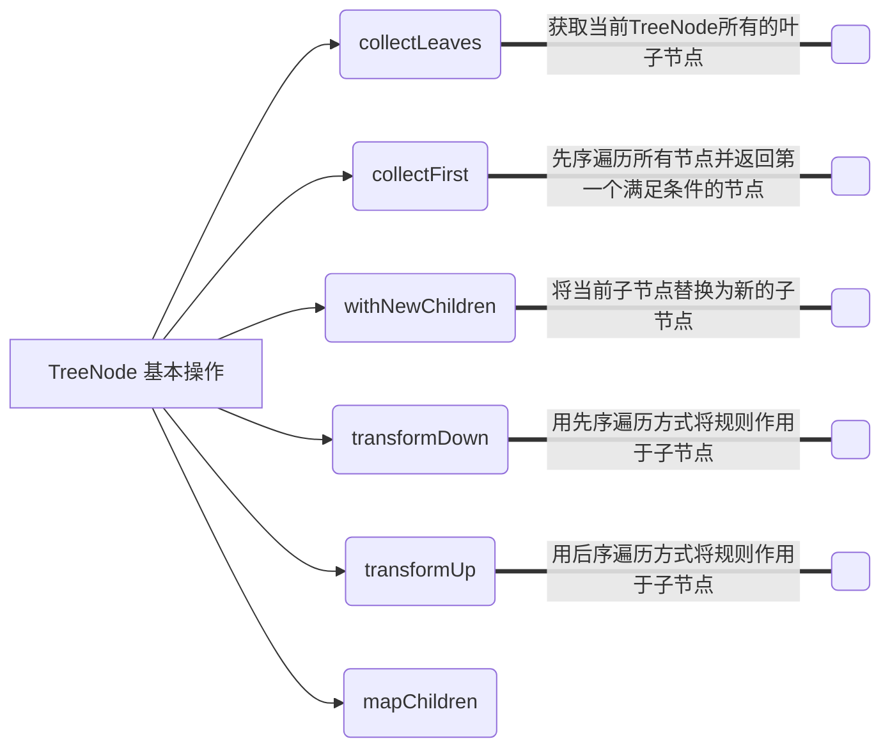
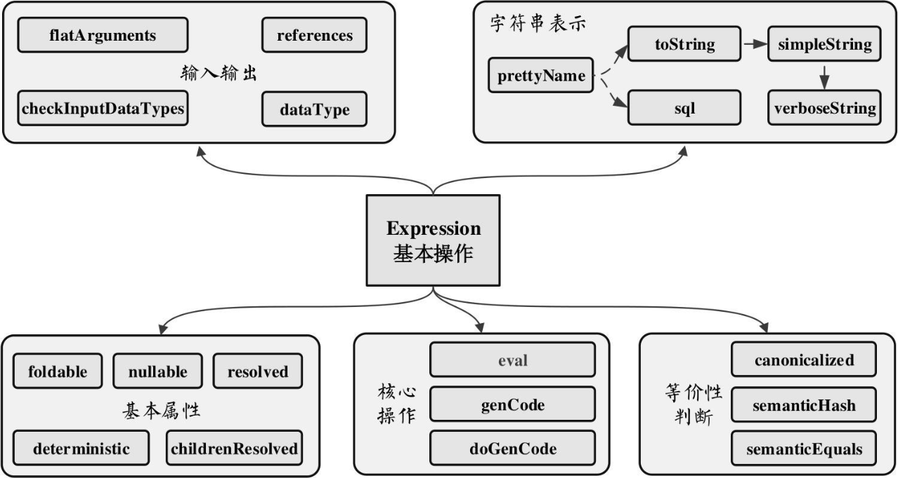
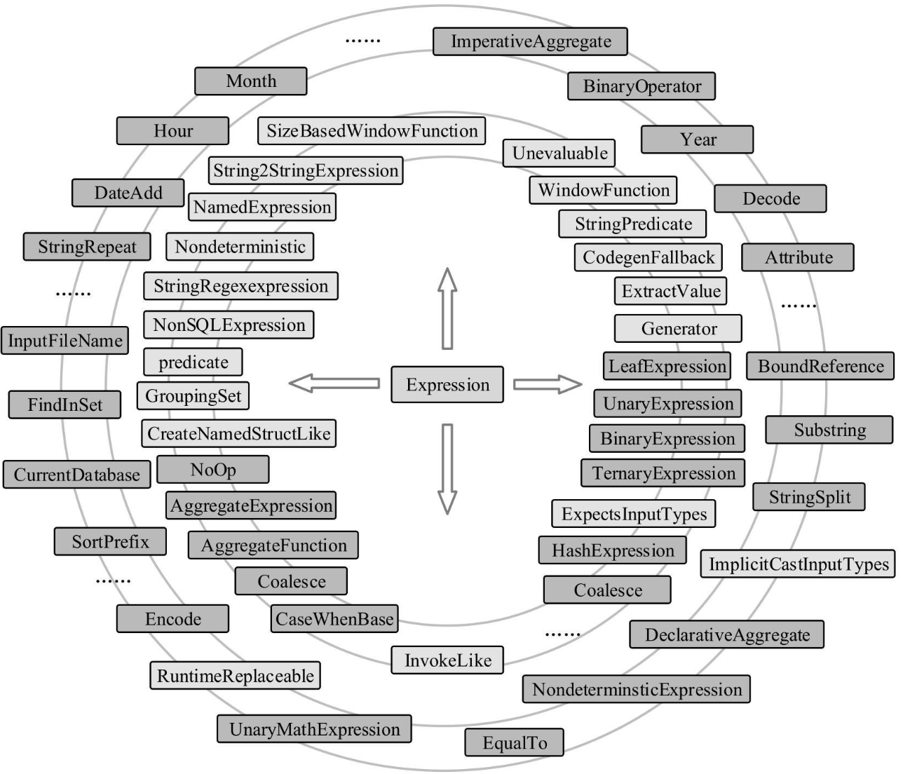

## `InternalRow`体系


## `TreeNode` 体系


作为基础类，`TreeNode`本身仅提供了最简单和最基本的操作，下图列举了`TreeNode`中现有的一些方法，如不同遍历方式的`transform`系列方法、用于替换新子节点的`withNewChildren`方法等。


## `Expression` 体系

表达式一般指的是不需要触发执行引擎而能够直接进行计算的单元，例如加减乘除四则运算、逻辑操作、转换操作、过滤操作等。如果说`TreeNode`是框架，那么就是`Expression`灵魂。在各种SQL引擎中，表达式都起着重要的作用。

Catalyst实现了完善的表达式体系，与各种算子（`QueryPlan`）占据同样第地位。算子执行前通常都会进行绑定操作，将表达式与输入的属性对应起来，同时算子也能够调用各种表达式处理相应的逻辑。在`Expression`类中主要定义了5个方面的操作，包括基本属性、核心操作、输入输出、字符串表示和等价性判断，如图3.7所示。

 图3.7 Expression基本操作

核心操作的`eval`函数实现了表达式对应的处理逻辑，也就是其他模块调用该表达式的主要接口，而`genCode`和`doGenCode`用于生成表达上对应的**Java**代码（这部分内容将在第9章介绍）。字符串表示用于查看该Expression的具体内容，表达式名和输入参数等。下面对Expression包含的基本属性和操作进行简单介绍。

- **foldable**：该属性用来标记表达式能否在查询之前直接静态计算。目前，`foldable`为`true`的情况有两种，第一种是该表达式为`Literal`类型（==字面量==，例如常量等），第二种是当且仅当其子表达式中`foldable`都为`true`时。当`foldable`为`true`时，在算子树中，表达式可以预先直接处理（折叠）。
- **deteministic**：该属性用来标记表达式是否为确定性的，即每次执行`eval`函数的输出是否相同。考虑到Spark分布执行环境中数据的**Shuffle**操作带来的不确定性，以及某些表达式（如`Rand`等）本身具有不确定性，该属性对于算子树优化中的谓词能否下推等很有必要。  
- **nullable**：该属性用来标记表达式是否可能输出`Null`值，一般在生成的Java代码中对相关的条件进行判断。
- **references**：返回值为`AttributeSet`类型，表示该`Expression`中会涉及的属性值，默认情况下为所有子节点中**属性值的集合**。
- **canonicalized**：返回经过规范化处理后的表达式。规范化处理会在确保输出结果相同的前提下通过一些规则对表达式进行重写，具体逻辑可以参见`Canonicalize`工具类。
- **sematicEquals**：判断两个表达式在语义上是否等价。基本的判断条件是两个表达式都是确定性的（**deteministic**为true），且两个表达式经过规范化（canonicalized）处理后仍然相同。

在SparkSQL中，`Expression`本身也是`TreeNode`类的子类，因此能够调用所有`TreeNode`的方法，例如`transform`等，也可以通过多级的子`Expression`组合成复杂的`Expression`。表达式涉及范围广且数目庞大，相关的类或接口将近300个（如图3.8所示），这里列举一些比较常用的`Expression`来介绍。

 图3.8 Expression体系

- **`Nondeterministic`**特质：具有不确定性的`Expression`，其中`deteministic`和`foldable`属性都返回**false**，经典的实现包括`MonotonicallyIncreasingID`、`Rand`和`Randn`等表达式。
- **`Unevaluable`**特质：不可执行的表达式，即调用`eval`函数会抛出异常。该特质主要用于生命周期不超过逻辑计划解析和优化阶段的表达式，例如`Star`表达式（*）在解析阶段就会被展开成具体的列集合。
- **`CodegenFallback`**特质：不支持代码生成的表达式。某些表达式涉及第三方实现（例如Hive的UDF）等情况，无法生成Java代码，此时通过`CodegenFallback`直接调用，该接口实现了具体的调用方法。
- **`LeafExpression`**：
- **`UnaryExpression`**：
- **`BinaryExpression`**：
- **`TernaryExpression`** ：

An expression in Catalyst. If an expression wants to be exposed in the function registry (so users can call it with "name(arguments...)", the concrete implementation must be a case class whose constructor arguments are all Expressions types. See Substring for an example. There are a few important traits: 

- Nondeterministic: an expression that is not deterministic. 
- Unevaluable: an expression that is not supposed to be evaluated. 
- CodegenFallback: an expression that does not have code gen implemented and falls back to interpreted mode. 
- LeafExpression: an expression that has no child. 
- UnaryExpression: an expression that has one child. 
- BinaryExpression: an expression that has two children. 
- TernaryExpression: an expression that has three children. 
- BinaryOperator: a special case of BinaryExpression that requires two children to have the same output data type. 

```scala
abstract class TreeNode[BaseType <: TreeNode[BaseType]] extends Product {
  self: BaseType =>
}
abstract class Expression extends TreeNode[Expression] {}
```

----

```scala
abstract class InternalRow {}
class UnsafeRow extends InternalRow{}
abstract class BaseGenericInternalRow extends InternalRow {}
class JoinedRow extends InternalRow {}
class SpecificInternalRow extends BaseGenericInternalRow {}
class MutableUnsafeRow extends BaseGenericInternalRow {}
class GenericInternalRow extends BaseGenericInternalRow {}
```

```scala
abstract class TreeNode {}
abstract class Expression extends TreeNode{}
abstract class QueryPlan extends TreeNode{}
abstract class LogicalPlan extends QueryPlan{}
abstract class SparkPlan extends QueryPlan{}
```