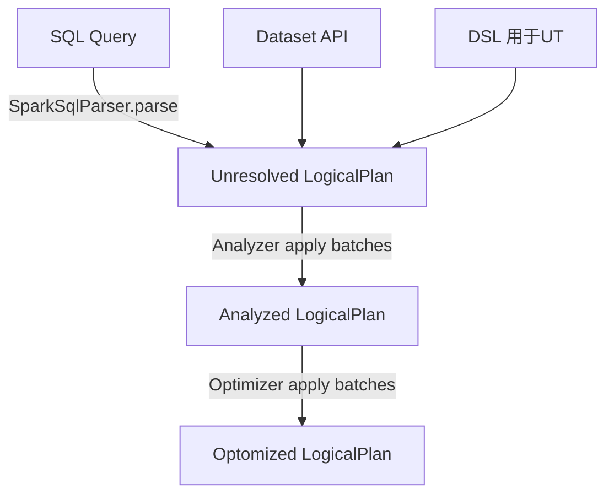
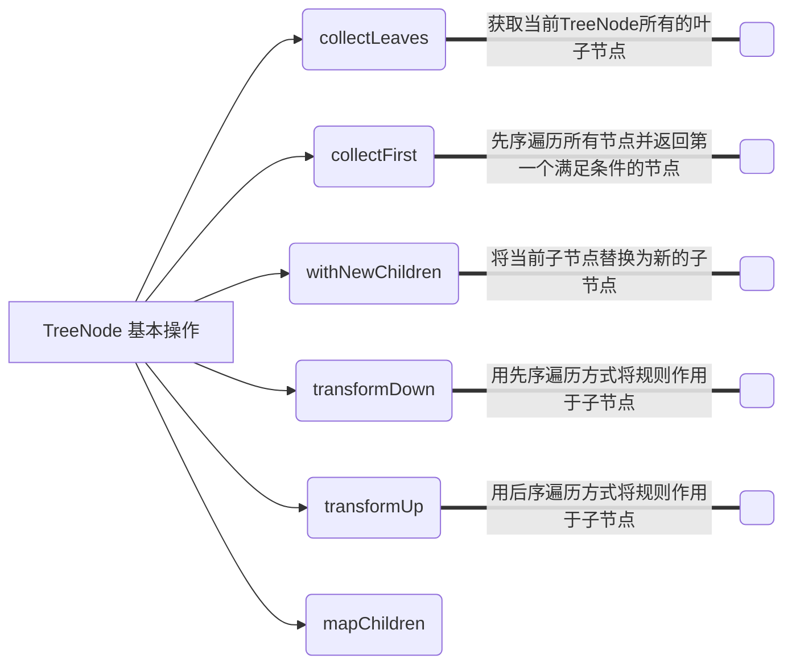

# 从 Spark中学Scala

## Spark SQL



### Row


### Aanlyer 机制


### `InternalRow`体系


### `TreeNode` 体系

TreeNode的定义如下：

```scala
abstract class TreeNode[BaseType <: TreeNode[BaseType]] 
     extends Product {    // 1.
  self: BaseType =>       // 2. 
}
```
这里有两个语法构造：
1. **自递归类型**：`BaseType <: TreeNode[BaseType]`，即**F-Bounded Type**。
2. **自类型标记**：`self: BaseType =>`，即**self-type annotation**。


作为基础类，`TreeNode`本身仅提供了最简单和最基本的操作，下图列举了`TreeNode`中现有的一些方法，如不同遍历方式的`transform`系列方法、用于替换新子节点的`withNewChildren`方法等。


### `Expression` 体系

表达式一般指的是不需要触发执行引擎而能够直接进行计算的单元，例如加减乘除四则运算、逻辑操作、转换操作、过滤操作等。如果说`TreeNode`是框架，那么就是`Expression`灵魂。在各种SQL引擎中，表达式都起着重要的作用。

Catalyst实现了完善的表达式体系，与各种算子（`QueryPlan`）占据同样第地位。算子执行前通常都会进行绑定操作，将表达式与输入的属性对应起来，同时算子也能够调用各种表达式处理相应的逻辑。在`Expression`类中主要定义了5个方面的操作，包括基本属性、核心操作、输入输出、字符串表示和等价性判断，如图3.7所示。

 图3.7 Expression基本操作

核心操作的`eval`函数实现了表达式对应的处理逻辑，也就是其他模块调用该表达式的主要接口，而`genCode`和`doGenCode`用于生成表达上对应的**Java**代码（这部分内容将在第9章介绍）。字符串表示用于查看该Expression的具体内容，表达式名和输入参数等。下面对Expression包含的基本属性和操作进行简单介绍。

- **foldable**：该属性用来标记表达式能否在查询之前直接静态计算。目前，`foldable`为`true`的情况有两种，第一种是该表达式为`Literal`类型（==字面量==，例如常量等），第二种是当且仅当其子表达式中`foldable`都为`true`时。当`foldable`为`true`时，在算子树中，表达式可以预先直接处理（折叠）。
- **deteministic**：该属性用来标记表达式是否为确定性的，即每次执行`eval`函数的输出是否相同。考虑到Spark分布执行环境中数据的**Shuffle**操作带来的不确定性，以及某些表达式（如`Rand`等）本身具有不确定性，该属性对于算子树优化中的谓词能否下推等很有必要。  
- **nullable**：该属性用来标记表达式是否可能输出`Null`值，一般在生成的Java代码中对相关的条件进行判断。
- **references**：返回值为`AttributeSet`类型，表示该`Expression`中会涉及的属性值，默认情况下为所有子节点中**属性值的集合**。
- **canonicalized**：返回经过规范化处理后的表达式。规范化处理会在确保输出结果相同的前提下通过一些规则对表达式进行重写，具体逻辑可以参见`Canonicalize`工具类。
- **sematicEquals**：判断两个表达式在语义上是否等价。基本的判断条件是两个表达式都是确定性的（**deteministic**为true），且两个表达式经过规范化（canonicalized）处理后仍然相同。

在SparkSQL中，`Expression`本身也是`TreeNode`类的子类，因此能够调用所有`TreeNode`的方法，例如`transform`等，也可以通过多级的子`Expression`组合成复杂的`Expression`。表达式涉及范围广且数目庞大，相关的类或接口将近300个（如图3.8所示），这里列举一些比较常用的`Expression`来介绍。

 图3.8 Expression体系

- **`Nondeterministic`**特质：具有不确定性的`Expression`，其中`deteministic`和`foldable`属性都返回**false**，经典的实现包括`MonotonicallyIncreasingID`、`Rand`和`Randn`等表达式。
- **`Unevaluable`**特质：不可执行的表达式，即调用`eval`函数会抛出异常。该特质主要用于生命周期不超过逻辑计划解析和优化阶段的表达式，例如`Star`表达式（*）在解析阶段就会被展开成具体的列集合。
- **`CodegenFallback`**特质：不支持代码生成的表达式。某些表达式涉及第三方实现（例如Hive的UDF）等情况，无法生成Java代码，此时通过`CodegenFallback`直接调用，该接口实现了具体的调用方法。
- **`LeafExpression`**：叶子节点类型的表达式，即不包含任何子节点，因此其`children`方法通常默认返回`Nil`值。该类型的表达式目前大约有**30**个，包括`Star`、`CurrentDate`、`Pi`等。
- **`UnaryExpression`**：一元类型的表达式，只含有一个子节点。这种类型的表达式总量**110**多种，较为庞大。其输入涉及一个子节点，例如，`Abs`操作、`UpCast`表达式等。
- **`BinaryExpression`**：二元类型的表达式，包含两个子节点。这种类型的表达式数目也比较庞大，大约80种。比较常用的是一些二元的算数表达式，例如加减乘除操作、`RLike`函数等。另外`BinaryExpression`有一个`BinaryOperator`特例，它要求两个子节点具有相同的输出数据类型。
- **`TernaryExpression`** ：三元类型的表达式，包含三个子节点。这种类型的表达式数目不多，大约10种，大部分都是一些字符串操作函数，非常典型的例子可以参考Substring函数，其子节点分别是字符串、下标和长度的表达式。

Catalyst中的表达式如果想要在函数注册表中公开（用户因此可以使用`name(arguments...)`的方式调用它），具体实现必须是一个`case`类，其构造函数的参数都必须是`Expression`s类型。有关示例，请参阅Substring。

```scala
abstract class TreeNode[BaseType <: TreeNode[BaseType]] extends Product {
  self: BaseType =>
}
abstract class Expression extends TreeNode[Expression] {}
```
`Attribute` is the Catalyst name for an input column from a child operator. An `AttributeReference` has been resolved, meaning we know which input  column in particular it is referring too.  An `AttributeReference` also has a known DataType.  In contrast, before analysis there might still exist `UnresolvedReferences`, which are just string identifiers from a parsed query.

An Expression can be more complex (like you suggested,  `a + b`), though  technically just `a` is also a very simple Expression.  The following console session shows how these types are composed:

```bash
$ build/sbt sql/console
import org.apache.spark.SparkContextimport
org.apache.spark.sql.SQLContextimport
org.apache.spark.sql.catalyst.analysis._import
org.apache.spark.sql.catalyst.plans.logical._
import org.apache.spark.sql.catalyst.dsl.expressions._import
org.apache.spark.sql.catalyst.dsl.plans._

sc: org.apache.spark.SparkContext = org.apache.spark.SparkContext@5adfe37d
sqlContext: org.apache.spark.sql.SQLContext =
org.apache.spark.sql.SQLContext@20d05227import
sqlContext.implicits._import sqlContext._Welcome to Scala version
2.10.4 (Java HotSpot(TM) 64-Bit Server VM, Java 1.7.0_45).Type in
expressions to have them evaluated.Type :help for more information.

scala> val unresolvedAttr: UnresolvedAttribute = 'a
unresolvedAttr: org.apache.spark.sql.catalyst.analysis.UnresolvedAttribute = 'a

scala> val relation = LocalRelation('a.int)
relation: org.apache.spark.sql.catalyst.plans.logical.LocalRelation =
LocalRelation [a#0]

scala> val parsedQuery = relation.select(unresolvedAttr)
parsedQuery: org.apache.spark.sql.catalyst.plans.logical.LogicalPlan =
'Project ['a]
 LocalRelation [a#0]

scala> parsedQuery.analyze
res11: org.apache.spark.sql.catalyst.plans.logical.LogicalPlan = Project [a#0]
 LocalRelation [a#0]
```
The `#0` after `a` is a unique identifier (within this JVM) that says where the data is coming from, even as plans are rearranged due to optimizations.

## 5.2 LogicalPlan 简介
`LogicalPlan` 作为数据结构记录了对应逻辑算子树节点的基本信息和基本操作，包括输入输出和各种处理逻辑等。在第 3 章中已经介绍过， `LogicalPlan` 属于 `TreeNode` 体系，继承自 `QueryPlan` 父类。

### 5.2.1 QueryPlan 概述
在介绍 `LogicalPlan` 之前，有必要先介绍一下其父类 `QueryPlan` 。为了从整体视角了解 `QueryPlan` 的所有功能，图 5.2 列举了其全部操作，并进行了简单的类型划分。

图 5.2 将 `QueryPlan` 的主要操作分为 6 个模块，分别是**输入输出**、**字符串**、**规范化**、**表达式操作**、**基本属性**和**约束**。下面简单介绍这 6 个模块，读者可结合实际代码阅读。

- **输入输出**： `QueryPlan` 的输入输出定义了 5 个方法，其中：
  -  `output` 是返回值为 `Seq[Attribute]`的虚函数，具体内容由不同子节点实现，
  - 而 `outputSet` 是将 `output` 的返回值进行封装，得到 `AttributeSet` 集合类型的结果。
  - 获取输入属性的方法 `inputSet` 的返回值也是 `AttributeSet` ，节点的输入属性对应所有子节点的输出； 
  - `producedAttributes` 表示该节点所产生的属性； 
  - `missingInput` 表示该节点表达式中涉及的但是其子节点输出中并不包含的属性。

- **基本属性**：表示 `QueryPlan` 节点中的一些基本信息，

  - 其中 `schema` 对应 `output` 输出属性的 `schema` 信息，
  - `allAttributes` 记录节点所涉及的所有属性（`Attribute`）列表，
  - `aliasMap` 记录节点与子节点表达式中所有的别名信息， 
  - `references` 表示节点表达式中所涉及的所有属性集合，
  - `subqueries` 和 `innerChildren` 都默认实现该 QueryPlan 节点中包含的所有子查询。

- **字符串**：这部分方法主要用于输出打印 QueryPlan 树型结构信息，其中 schema 信息也会以树状展示。需要注意的一个方法是 statePrefix ，用来表示节点对应计划状态的前缀字符串。在 QueryPlan 的默认实现中，如果该计划不可用（invalid），则前缀会用感叹号（“！”）标记。

- **规范化**：类似 `Expression` 中的方法定义，对 `QueryPlan` 节点类型也有规范化（ *Canonicalize* ）的概念。在 QueryPlan 的默认实现中， `canonicalized` 直接赋值为当前的 `QueryPlan` 类；此外，在 `sameResult` 方法中会利用 `canonicalized` 来判断两个 QueryPlan 的输出数据是否相同。

  > 注: `sameResult` 在 `CacheManager` 中有用到

- **表达式操作**：在第 3 章中已经介绍过 Spark SQL 丰富的表达式体系，其典型的特点就是不需要驱动，直接执行。而在 QueryPlan 各个节点中，包含了各种表达式对象，各种逻辑操作一般也都是通过表达式来执行的。在 QueryPlan 的方法定义中，表达式相关的操作占据重要的地位，其中 expressions 方法能够得到该节点中的所有表达式列表，其他方法很容易根据命名了解对应功能，具体的实现细节可以参看代码。

- **约束（ Constraints ）**：本质上也属于数据过滤条件（Filter）的一种，同样是表达式类型。相对于显式的过滤条件，约束信息可以「推导」出来，例如，对于「a>5」这样的过滤条件，显然 a 的属性不能为 null，这样就可以对应地构造 isNotNull （a）约束；又如「a=5」和「a=b」的谓词，能够推导得到「b=5」的约束条件。在实际情况下，SQL 语句中可能会涉及很复杂的约束条件处理，如约束合并、等价性判断等。在 QueryPlan 类中，提供了大量方法用于辅助生成 constraints 表达式集合以支持后续优化操作。例如， validConstraints 方法返回该 QueryPlan 所有可用的约束条件，比较常用的 constructIsNotNullConstraints 方法，会针对特定的列构造 isNotNull 的约束条件。

<p align="center">
 
 图 5.2 QueryPlan 基本操作
</p>

### 5.2.2 LogicalPlan 基本操作与分类
本小节进行 `LogicalPlan` 类的分析，介绍**逻辑算子树节点**都有哪些功能。同样的，在内容上首先从整体列出 `LogicalPlan` 中的所有方法，使读者对 `LogicalPlan` 有一个宏观的概念。<u>读者可结合代码阅读</u>。

如图 5.3 所示， `LogicalPlan` 继承自 `QueryPlan` ，包含了**两个成员变量**和 **17 个方法**。两个成员变量一个是 `resolved`，用来标记该 `LogicalPlan` 是否为经过了解析的布尔类型值；另一个是 `canonicalized` ，重载了 `QueryPlan` 中的对应赋值，<u>默认实现消除了子查询别名之后的 `LogicalPlan`</u> 。

<p align="center">
 
 图 5.3 LogicalPlan 基本操作
</p>

图 5.3 中的方法根据操作的内容进行了分类，前 3 个方法与 `resolved` 成员变量相关，其中 `childrenResolved` 标记子节点是否已经被解析。中间的 5 个方法设定了该 `LogicalPlan` 中的一些基本信息，其中 `statePrefix` 重载了 QueryPlan 中的实现，如果该逻辑算子树节点未经过解析，<u>则输出的字符串前缀会加上单引号（『）</u>； `isStreaming` 方法用来表示当前逻辑算子树中是否包含流式数据源； `statistics` 记录了当前节点的统计信息，例如默认实现的 `sizeInBytes` 信息，一般来讲如果当前节点不包含子节点，则必须重载实现该方法；`maxRows` 记录了当前节点可能计算的最大行数，一般常用于 `Limit` 算子；`refresh` 方法<u>会递归地刷新当前计划中的元数据等信息</u>。剩下的则是 `LogicalPlan` 中定义的与 `resolve` 相关的 9 个分析方法，用来执行对数据表、表达式、**schema** 和列属性等类型的解析，具体实现可以参见代码。

同样的， `LogicalPlan` 仍然是抽象类，根据子节点数目，绝大部分的 `LogicalPlan` 可以分为 3 类，即叶子节点 `LeafNode` 类型（不存在子节点）、一元节点 `UnaryNode` 类型（仅包含一个子节点）和二元节点 `BinaryNode` 类型（包含两个子节点）。此外，还有几个子类直接继承自 LogicalPlan ，不属于这 3 种类型，将在后面单独介绍。

### 5.2.3　LeafNode 类型的 LogicalPlan
在 `LogicalPlan` 所有类型的节点中，`LeafNode` 类型的数目最多，共有 70 多种。为了便于进行分析，本小节将这些子类按照其所属的包进行了分类，如图 5.4 所示。

<p align="center">
 
 图 5.4　LeafNode 类型的 LogicalPlan
</p>

根据图 5.4 中的关键字可以看到，`LeafNode` 类型的 `LogicalPlan` 节点对应<u>数据表</u>和<u>命令</u>（`Command`）相关的逻辑，因此这些 `LeafNode` 子类中有很大一部分都属于 *datasources* 包和 *command* 包。值得一提的是，实现 `RunnableCommand` 特质（Trait）的类共有 40 多个，是数量最为庞大的 `LogicalPlan` 类型。顾名思义， `RunnableCommand` 是直接运行的命令，主要涉及 12 种情形，包括 *Database* 相关命令、*Table* 相关命令、*View* 相关命令、*DDL* 相关命令、*Function* 相关命令和 *Resource* 相关命令等。例如，Database 相关命令有两个，分别是 `ShowDatabasesCommand` 和 `SetDatabaseCommand` ，用于显示当前数据库名称和切换当前数据库到相应的数据库。

以 `SetDatabaseCommand` 命令为例，其实现比较简单，如以下代码所示，该 Command 对应 SQL 中的「 `usedatabase` 」语句。可以看到，该命令直接调用的是 Catalog 中的 set 方法。Catalog 相关的内容会在 5.4 节中进行介绍。

```scala
/**
 * Command for setting the current database.
 * {{{
 *   USE database_name;
 * }}}
 */
case class SetDatabaseCommand(databaseName: String) extends RunnableCommand {
  override def run(sparkSession: SparkSession): Seq[Row] = {
    sparkSession.sessionState.catalog.setCurrentDatabase(databaseName)
    Seq.empty[Row]
  }
}
```

### 5.2.4 UnaryNode 类型的 LogicalPlan

在 `LogicalPlan` 所有类型的节点中， `UnaryNode` 类型的节点应用非常广泛，共有 **34** 种，常见于对数据的逻辑转换操作，包括过滤等，如图 5.5 所示。

<p align="center">
 
 图 5.5 UnaryNode 类型的 LogicalPlan
</p>

根据节点所起的不同作用，图 5.5 中的所有节点可以分为 4 个类别。

- 用来定义重分区（ *repartitioning* ）操作的 3 个 `UnaryNode` ，即 `RedistributeData` 及其两个子类 `SortPartitions` 和 `RepartitionByExpression` ，主要针对现有分区和排序的特点不满足的场景。

- 脚本相关的转换操作 `ScriptTransformation` ，用特定的脚本对输入数据进行转换。

- `Object` 相关的操作，即 `ObjectConsumer` 这个特质（Trait）和其他 10 个类，包括 `DeserializeToObject` 、 `SerializeFromObject` 和 `FlatMapGroupsInR` 等。

- 基本操作算子（ *basicLogicalOperators* ），数量最多，共有 19 种，涉及 `Project`、`Filter`、`Sort` 等各种常见的关系算子。

这里以 `Sort` 节点为例，根据以下代码中的类的定义可以看到，其实现同样非常简单，不涉及额外的逻辑处理；基本上只保存了 `Sort` 操作中所需要的相关信息，包括排序的规则（<u>升序</u>或<u>降序</u>表达式）、是否全局等。类似的，其他基本操作对应逻辑算子的实现也比较简单，具体可参见代码。

```scala
/**
 * @param order  The ordering expressions
 * @param global True means global sorting apply for entire data set,
 *               False means sorting only apply within the partition.
 * @param child  Child logical plan
 */
case class Sort(
    order: Seq[SortOrder],
    global: Boolean,
    child: LogicalPlan) extends UnaryNode {
  override def output: Seq[Attribute] = child.output
  override def maxRows: Option[Long] = child.maxRows
  override def outputOrdering: Seq[SortOrder] = order
}
```

### 5.2.5 BinaryNode 类型的 LogicalPlan

在 `LogicalPlan` 所有类型的节点中， `BinaryNode` 类型的节点很少，只定义了 5 种，常见于对数据的组合关联操作，包括 `Join` 算子等，如图 5.6 所示。

<p align="center">
 
 图 5.6 BinaryNode 类型的 LogicalPlan
</p>

从图 5.6 中可以看到， `BinaryNode` 类型的逻辑算子树节点包括连接（`Join`）、集合操作（ `SetOperation` ）和 `CoGroup` 3 种，其中 `SetOperation` 包括 `Except` 和 `Intersect` 两种算子。

同样的，以 `Except` 算子为例，根据以下代码的实现可以看到，其传入参数是 `left` 和 `right` 两个 `LogicalPlan` ，重载实现的 `output` 方法、 `validContraints` 方法甚至 `statistics` 方法都只需直接调用输出 left 的方法。 `BinaryNode` 类型节点中比较复杂且重要的是 `Join` 算子，这部分内容会在第 8 章单独介绍。

```scala
case class Except(
    left: LogicalPlan,
    right: LogicalPlan,
    isAll: Boolean) extends SetOperation(left, right) {
  override def nodeName: String = getClass.getSimpleName + ( if ( isAll ) "All" else "" )
  /** We don't use right.output because those rows get excluded from the set. */
  override def output: Seq[Attribute] = left.output

  override protected def validConstraints: Set[Expression] = leftConstraints
}
```

### 5.2.6　其他类型的 LogicalPlan

除上述 3 种类型的 `LogicalPlan` 外，在 Spark SQL 中还有 3 种直接继承自 `LogicalPlan` 的逻辑算子节点，如图 5.7 所示。

<p align="center">
 
 图 5.7　其他类型的 LogicalPlan
</p>

这 3 种类型的 `LogicalPlan` 分别是 `ObjectProducer` 、`Union` 和 `EventTimeWatermark` 逻辑算子。其中， `EventTimeWatermark` 主要针对 *Spark Streaming* 中的 *watermark* 机制，一般在 SQL 中用得不多； `ObjectProducer` 为特质（Trait），与前面的 `ObjectConsumer` 相对应，用于产生只包含 Object 列的行数据；`Union` 算子的使用场景比较多，其子节点数目不限，是一系列 `LogicalPlan` 的列表。

总体来讲， `LogicalPlan` 中主要记录了该**逻辑节点处理逻辑的相关属性**，包括<u>输入输出</u>、<u>约束条件</u>、<u>算子逻辑</u>和<u>统计信息</u>等。本节对 LogicalPlan 的直接父类 QueryPlan 和各种子类进行了概述，旨在从宏观层面给出整体横向的视角，后续章节中会用特定的算子在纵向进行深入的分析。

## 5.4　Analyzer 机制： Analyzed LogicalPlan 生成

经过上一个阶段 `AstBuilder` 的处理，已经得到了 Unresolved `LogicalPlan` 。从图 5.10 中可以看到，该逻辑算子树中未被解析的有 `UnresolvedRelation` 和 `UnresolvedAttribute` 两种对象。实际上，*Analyzer* 所起到的主要作用就是将这两种节点或表达式解析成有类型的（Typed）对象。在此过程中，需要用到 *Catalog* 的相关信息。这也可以从 *Analyzer* 的构造参数看出。在分析 *Analyzer* 之前，本节先对 Spark SQL 中随处都会用到的 *Catalog* 体系和 *Rule* 体系进行介绍。

### 5.4.1　Catalog 体系分析

按照 **SQL** 标准的解释，在 **SQL** 环境下 *Catalog* 和 *Schema* 都属于抽象概念。在关系数据库中，Catalog 是一个宽泛的概念，通常可以理解为<u>一个容器或数据库对象命名空间中</u>的一个层次，主要用来**解决命名冲突等问题**。

在 **Spark SQL** 系统中，*Catalog* 主要用于**各种函数资源信息**和**元数据信息**（数据库、数据表、数据视图、数据分区与函数等）的统一管理。 Spark SQL 的 Catalog 体系涉及多个方面，不同层次所对应的关系如图 5.11 所示。

<p align="center">
 
 图 5.11　Catalog 体系
</p>

具体来讲， Spark SQL 中的 *Catalog* 体系实现以 `SessionCatalog` 为主体，通过 `SparkSession` （Spark 程序入口）提供给外部调用。一般一个 `SparkSession` 对应一个 `SessionCatalog` 。本质上， `SessionCatalog` 起到了一个代理的作用，对底层的**元数据信息**、**临时表信息**、**视图信息**和**函数信息**进行了封装。如图 5.11 所示， `SessionCatalog` 的构造参数包括 6 部分，除传入 Spark SQL 和 Hadoop 配置信息的 CatalystConf 与 Configuration 外，还涉及以下 4 个方面的内容。

- GlobalTempViewManager （全局的临时视图管理）：对应 DataFrame 中常用的 createGlobal-TempView 方法，进行跨 Session 的视图管理。 GlobalTempViewManager 是一个线程安全的类，提供了对全局视图的原子操作，包括创建、更新、删除和重命名等。在 GlobalTempViewManager 内部实现中，主要功能依赖一个 mutable 类型的 HashMap 来对视图名和数据源进行映射，其中的 key 是视图名的字符串，value 是视图所对应的 LogicalPlan （一般在创建该视图时生成）。需要注意的是， GlobalTempViewManager 对视图名是大小写敏感的。

- FunctionResourceLoader （函数资源加载器）：在 Spark SQL 中除内置实现的各种函数外，还支持用户自定义的函数和 Hive 中的各种函数。这些函数往往通过 Jar 包或文件类型提供， FunctionResourceLoader 主要就是用来加载这两种类型的资源以提供函数的调用。需要注意的是，对于 Archive 类型的资源，目前仅支持在 YARN 模式下以 spark-subm it 方式提交时进行加载。

- FunctionRegistry （函数注册接口）：用来实现对函数的注册（Register）、查找（Lookup）和删除（Drop）等功能。一般来讲， FunctionRegistry 的具体实现需要是线程安全的，以支持并发访问。在 Spark SQL 中默认实现是 SimpleFunctionRegistry ，其中采用 Map 数据结构注册了各种内置的函数。

- ExternalCatalog （外部系统 Catalog）：用来管理数据库（Databases）、数据表（Tables）、数据分区（ Partitions ）和函数（Functions）的接口。顾名思义，其目标是与外部系统交互，并做到上述内容的非临时性存储，同样需要满足线程安全以支持并发访问。如图 5.11 所示， ExternalCatalog 是一个抽象类，定义了上述 4 个方面的功能。在 Spark SQL 中，具体实现有 InMemoryCatalog 和 HiveExternalCatalog 两种。前者将上述信息存储在内存中，一般用于测试或比较简单的 SQL 处理；后者利用 Hive 原数据库来实现持久化的管理，在生产环境中广泛应用（这部分内容会在第 10 章进行详细介绍）。

总体来看， SessionCatalog 是用于管理上述一切基本信息的入口。除上述的构造参数外，其内部还包括一个 mutable 类型的 HashMap 用来管理临时表信息，以及 currentDb 成员变量用来指代当前操作所对应的数据库名称。 SessionCatalog 在 Spark SQL 的整个流程中起着重要的作用，在后续逻辑算子阶段和物理算子阶段都会用到。


## 5.5 Spark SQL 优化器 Optimizer

经过上一个阶段 **Analyzer** 的处理， *Unresolved LogicalPlan* 已经解析成为 *Analyzed LogicalPlan* 。从图 5.17 中可以看出， *Analyzed LogicalPlan* 中自底向上节点分别对应 `Relation`、`Subquery`、`Filter` 和 `Project` 算子。

*Analyzed LogicalPlan* 基本上是根据 *Unresolved LogicalPlan* 一对一转换过来的，对于 SQL 语句中的逻辑能够很好地表示。然而，在实际应用中，很多低效的写法会带来执行效率的问题，需要进一步对 *Analyzed LogicalPlan* 进行处理，得到更优的逻辑算子树。于是，针对 **SQL** 逻辑算子树的优化器 **Optimizer** 应运而生。

### 5.5.1 Optimizer 概述

在分析 *Rule* 体系时就已经提到， *Optimizer* 同样继承自 `RuleExecutor` 类，本身没有重载 `RuleExecutor` 中的 `execute` 方法，因此其执行过程仍然是调用其父类 `RuleExecutor` 中实现的 `execute` 方法。在 `QueryExecution` 中， **Optimizer** 会对传入的 *Analyzed LogicalPlan* 执行 `execute` 方法，启动优化过程。

```scala
val optimizedPlan: LogicalPlan = optimizer.execute(analyzed)
```

与 **Analyzer** 类似， **Optimizer** 的主要机制也依赖重新定义的一系列规则，同样对应 `RuleExecutor` 类中的成员变量 `batches`，因此在 `RuleExecutor` 执行 `execute` 方法时会直接利用这些规则 `Batch`。

如图 5.18 所示， `Optimizer` 继承自 `RuleExecutor` ，而 `SparkOptimizer` 又继承自 `Optimizer` 。在上述代码中， `optimizer` 即是构造的 `SparkOptimizer` 类。从图 5.18 中可以看出， `Optimizer` 本身定义了 12 个规则 `Batch`，在 `SparkOptimizer` 类中又添加了 4 个 Batch。

<p align="center">
 
 图 5.18 Optimizer 规则
</p>

### 5.5.2 Optimizer 规则体系

根据 5.5.1 小节的总结，Spark 2.1 版本的 `SparkOptimizer` 中共实现了 **16** 个 `Batch`，其中包含了 53 条优化规则，本节对这些优化规则进行系统的分析。

#### （ 1 ） Batch Finish Analysis

该 `Batch` 包含 5 条优化规则，分别是 `EliminateSubqueryAliases` 、 `ReplaceExpressions` 、 `ComputeCurrentTime` 、 `GetCurrentDatabase` 和 `RewriteDistinctAggregates` ，这些规则都**只执行一次**。

- `EliminateSubqueryAliases` ：消除子查询别名，对应逻辑算子树中的 SubqueryAlias 节点。一般来讲， Subqueries 仅用于提供查询的视角范围（Scope）信息，一旦 Analyzer 阶段结束，该节点就可以被移除，该优化规则直接将 SubqueryAlias 替换为其子节点。
- `ReplaceExpressions` ：表达式替换，在逻辑算子树中查找匹配 RuntimeReplaceable 的表达式并将其替换为能够执行的正常表达式。这条规则通常用来对其他类型的数据库提供兼容的能力，例如，可以用「coalesce」来替换支持「nvl」的表达式。
- `ComputeCurrentTime` ：计算与当前时间相关的表达式，在同一条 SQL 语句中可能包含多个计算时间的表达式，即 CurrentDate 和 CurrentTimestamp ，且该表达式出现在多个语句中。为避免不一致， ComputeCurrentTime 对逻辑算子树中的时间函数计算一次后，将其他同样的函数替换成该计算结果。

- `GetCurrentDatabase` ：获取当前数据库，在 SQL 语句中可能会调用 CurrentDatabase 函数来获取 Catalog 中的当前数据库，而这个方法没必要在执行阶段再进行计算。 GetCurrentDatabase 规则执行 CurrentDatabase 并得到结果，然后用此结果替换所有的 CurrentDatabase 表达式。

- `RewriteDistinctAggregates` ：重写 Distinct 聚合操作，对于包含 Distinct 算子的聚合语句，这条规则将其转换为两个常规的聚合表达式。这条规则主要面向聚合查询，在第 7 章会对其进行详细分析。

严格来讲， **Finish Analysis** 这个 `Batch` 中的一些规则更多的是为了得到正确的结果（例如 ComputeCurrentTime ），并不涉及优化操作，从逻辑上更应该归于 Analyzer 的分析规则中。但是考虑到 Analyzer 中会进行一些规范化的操作，因此将 `EliminateSubqueryAliases` 和 `ComputeCurrentTime` 规则放在优化的部分，实际上真正的优化过程从下一个 Batch 开始。

#### （ 2 ） Batch Union ⇒ CombineUnions

针对 Union 操作的规则 Batch，中间包含一条 `CombineUnions` 优化规则。在逻辑算子树中，当相邻的节点都是 Union 算子时，可以将这些相邻的 Union 节点合并为一个 Union 节点。在该规则中， flattenUnion 是核心方法，用栈实现了节点的合并。需要注意的是，后续的优化操作可能会将原来不相邻的 Union 节点变得相邻，因此在后面的规则 Batch 中又加入了 CombineUnions 这条规则。

#### （ 3 ） Batch Subquery ⇒ OptimizeSubqueries

该 Batch 目前只包含 `OptimizeSubqueries` 这一条优化规则。当 SQL 语句包含子查询时，会在逻辑算子树上生成 SubqueryExpression 表达式。 OptimizeSubqueries 优化规则在遇到 Subquery-Expression 表达式时，进一步递归调用 Optimizer 对该表达式的子计划并进行优化。

#### （ 4 ） Batch ReplaceOperators

该 Batch 中的优化规则主要用来执行算子的替换操作。在 SQL 语句中，某些查询算子可以直接改写为已有的算子，避免进行重复的逻辑转换。 Replace Operators 中包含 `ReplaceIntersectWithSemiJoin` 、 `ReplaceExceptWithAntiJoin` 和 `ReplaceDistinctWithAggregate` 这 3 条优化规则。

- `ReplaceIntersectWithSemiJoin` ：将 **Intersect** 操作算子替换为 Left-Sem i Join 操作算子，从逻辑上来看，这两种算子是等价的。需要注意的是， `ReplaceIntersectWithSemiJoin` 优化规则仅适用于 INTERSECT DISTINCT 类型的语句，而不适用于 INTERSECT ALL 语句。此外，该优化规则执行之前必须消除重复的属性，避免生成的 Join 条件不正确。

- `ReplaceExceptWithAntiJoin` ：将 Except 操作算子替换为 Left-Anti Join 操作算子，从逻辑上来看，这两种算子是等价的。与上一条优化规则一样， `ReplaceExceptWithAntiJoin` 优化规则仅适用于 EXCEPTDISTINCT 类型的语句，而不适用于 EXCEPT ALL 语句。此外，该优化规则执行之前必须消除重复的属性，避免生成的 Join 条件不正确。

- `ReplaceDistinctWithAggregate` ：该优化规则会将 Distinct 算子转换为 Aggregate 语句。在某些 SQL 语句中，Select 直接进行 Distinct 操作，这种情况下可以将其直接转换为聚合操作。 `ReplaceDistinctWithAggregate` 规则会将 Distinct 算子替换为对应的 Group By 语句。

从以上描述中可以看出， ReplaceOperators 主要针对的是集合类型的操作算子。

#### （ 5 ）Batch Aggregate

该 Batch 主要用来处理聚合算子中的逻辑，包括 `RemoveLiteralFromGroupExpressions` 和 `RemoveRepetitionFromGroupExpressions` 两条规则。 `RemoveLiteralFromGroupExpressions` 优化规则用来删除 `Group By` 语句中的常数，这些常数对于结果无影响，但是会导致分组数目变多。此外，如果 `Group By` 语句中全部是常数，则会将其替换为一个简单的常数 0 表达式。 `RemoveRepetitionFromGroupExpressions` 优化规则将重复的表达式从 Group By 语句中删除，同样对结果无影响。

#### （ 6 ） Batch Operator Optimizations

类似 Analyzer 中的 *Operator* 解析规则，该 `Batch` 包含了 **Optimizer**中数量最多同时也是最常用的各种优化规则，共 31 条。从整体来看，这 31 条优化规则（如表 5.4 所示）可以分为 3 个模块：**算子下推**（ *Operator Push Down* ）、**算子组合**（ *Operator Combine* ）、**常量折叠与长度削减**（ *Constant Folding and Strength Reduction* ）。

- **算子下推**：算子下推是数据库中常用的优化方式，表 5.4 中所列的前 8 条规则都属于算子下推的模块。顾名思义，算子下推所执行的优化操作主要是将逻辑算子树中上层的算子节点尽量下推，使其靠近叶子节点，这样能够在不同程度上减少后续处理的数据量甚至简化后续的处理逻辑。以常见的列剪裁（ `ColumnPruning` ）优化为例，假设数据表中有 A、B、C 3 列，但是查询语句中只涉及 A、B 两列，那么 ColumnPruning 将会在读取数据后剪裁出这两列。又如 `LimitPushDown` 优化规则，能够将 `LocalLimit` 算子下推到 `Union All` 和 `Outer Join` 操作算子的下方，减少这两种算子在实际计算过程中需要处理的数据量。
- **算子组合**：算子组合类型的优化规则将逻辑算子树中能够进行组合的算子尽量整合在一起，避免多次计算，以提高性能。表 5.4 中间 6 条规则（从 `CollapseRepartition` 到 `CombineUnions` ）都属于算子组合类型的优化。可以看到这些规则主要针对的是重分区（ `repartition` ）算子、投影（`Project`）算子、过滤（`Filter`）算子、`Window` 算子、`Limit` 算子和 `Union` 算子，其中 `CombineUnions` 在之前已经提到过。需要注意的是，这些规则主要针对的是算子相邻的情况。

| 优化规则                            | 优化操作                   |
| ----------------------------------- | -------------------------- |
| `PushProjectionThroughUnion`        | 列剪裁下推                 |
| `ReorderJoin`                       | Join 顺序优化              |
| `EliminateOuterJoin`                | OuterJoin 消除             |
| `PushPredicateThroughJoin`          | 谓词下推到 Join 算 子      |
| `PushDownPredicate`                 | 谓词下推                   |
| `LimitPushDown`                     | Limit 算子下推             |
| `ColumnPruning`                     | 列剪裁                     |
| `InferFiltersFromConstraints`       | 约束条件提取               |
| `CollapseRepartition`               | 重分区组合                 |
| `CollapseProject`                   | 投影算子组合               |
| `CollapseWindow`                    | Window 组合                |
| `CombineFilters`                    | 过滤条件组合               |
| `CombineLimits`                     | Limit 操作组合             |
| `CombineUnions`                     | Union 算子组合             |
| `NullPropagation`                   | Null 提取                  |
| `FoldablePropagation`               | 可折叠算子提取             |
| `OptimizeIn`                        | In 操作优化                |
| `ConstantFolding`                   | 常数折叠                   |
| `ReorderAssociativeOperator`        | 重排序关联算子优化         |
| `LikeSimplification`                | Like 算子简化              |
| `BooleanSimplification`             | Boolean 算子简化           |
| `SimplifyConditionals`              | 条件简化                   |
| `RemoveDispensableExpressions`      | **Dispensable** 表达式消除 |
| `SimplifyBinaryComparison`          | 比较算子简化               |
| `PruneFilters`                      | 过滤条件剪裁               |
| `EliminateSorts`                    | 排序算子消除               |
| `SimplifyCasts`                     | Cast 算子简化              |
| `SimplifyCaseConversionExpressions` | case 表达式简 化           |
| `RewriteCorrelatedScalarSubquery`   | 标量依赖子查询重 写        |
| `EliminateSerialization`            | 序列化消除                 |
| `RemoveAliasOnlyProject`            | 消除别名                   |

<p align="center">
 
 表 5.4 Batch OperatorOptimizations 中的规则
</p>

- **常量折叠与长度削减**：对于逻辑算子树中涉及某些常量的节点，可以在实际执行之前就完成静态处理。常量折叠与长度削减类型的优化规则主要针对的就是这种情况。表 5.4 中的后 17 条优化规则都属于这种类型。例如，在 `ConstantFolding` 规则中，对于能够 *foldable*（可折叠）的表达式会直接在 `EmptyRow` 上执行 `evaluate` 操作，从而构造新的 `Literal` 表达式； `PruneFilters` 优化规则会详细地分析过滤条件，对总是能够返回 true 或 false 的过滤条件进行特别的处理。

#### （ 7 ） Batch Check Cartesian Products ⇒ CheckCartesianProducts

该 Batch 只有 `CheckCartesianProducts` 这一条优化规则，用来检测逻辑算子树中是否存在**笛卡儿积类型**的 Join 操作。如果存在这样的操作，而 SQL 语句中没有显示地使用 cross join 表达式，则会抛出异常。 `CheckCartesianProducts` 规则必须在 ReorderJoin 规则执行之后才能执行，确保所有的 Join 条件收集完毕。需要注意的是，当「 `spark.sql.crossJoin.enabled` 」参数设置为 true 时，该规则会被忽略。

#### （ 8 ） Batch DecimalOptimizations ⇒ DecimalAggregates

该 Batch 只有 `DecimalAggregates` 这一条优化规则，用于处理聚合操作中与 Decimal 类型相关的问题。一般情况下，如果聚合查询中涉及浮点数的精度处理，性能就会受到很大的影响。<u>对于固定精度的 Decimal 类型， `DecimalAggregates` 规则将其当作 **unscaled Long** 类型来执行，这样可以加速聚合操作的速度</u>。

#### （ 9 ） Batch Typed Filter Optim ization *⇒* CombineTypedFilters

该 Batch 仅包含 `CombineTypedFilters` 这一条优化规则，用来对特定情况下的过滤条件进行合并。当逻辑算子树中存在两个 `TypedFilter` 过滤条件且针对同类型的对象条件时， `CombineTypedFilters` 优化规则会将它们合并到同一个过滤函数中。

#### （ 10 ） Batch LocalRelation ⇒ ConvertToLocalRelation | PropagateEmptyRelation

该 Batch 主要用来优化与 LocalRelation 相关的逻辑算子树，包含 ConvertToLocalRelation 和 PropagateEmptyRelation 两条优化规则。 ConvertToLocalRelation 将 LocalRelation 上的本地操作（不涉及数据交互）转换为另一个 LocalRelation ，目前该规则实现较为简单，仅处理 Project 投影操作。 PropagateEmptyRelation 优化规则会将包含空的 LocalRelation 进行折叠。

#### （ 11 ） Batch OptimizeCodegen ⇒ OptimizeCodegen

该 Batch 只有 `OptimizeCodegen` 这一条优化规则，用来对生成的代码进行优化。代码生成技术会在与 Tungsten 相关的章节中讲解。 `OptimizeCodegen` 规则主要针对的是 `case when` 语句，当 `case when` 语句中的分支数目不超过配置中的最大数目时，该表达式才能执行代码生成。实际上，Spark 2.1 版本中的代码生成还存在许多不足之处，更加完善的实现可以参考 2.3 版本。

#### （ 12 ） Batch RewriteSubquery ⇒ RewritePredicateSubquery | CollapseProject

该 Batch 主要用来优化子查询，目前包含 `RewritePredicateSubquery` 和 `CollapseProject` 两条优化规则。 `RewritePredicateSubquery` 将特定的子查询谓词逻辑转换为 left-sem i /anti-join 操作。其中，**EXISTS** 和 **NOTEXISTS** 算子分别对应 semi 和 anti 类型的 Join，过滤条件会被当作 Join 的条件；IN 和 NOT IN 也分别对应 semi 和 anti 类型的 Join，过滤条件和选择的列都会被当作 join 的条件。 `CollapseProject` 优化规则比较简单，类似 `CombineTypedFilters` 优化规则，会将两个相邻的 Project 算子组合在一起并执行别名替换，整合成一个统一的表达式。

#### （ 13 ） Batch OptimizeMetadataOnly Query ⇒ OptimizeMetadataOnlyQuery

该 Batch 仅执行一次，只有 `OptimizeMetadataOnlyQuery` 这一条规则，用来优化执行过程中只需查找分区级别元数据的语句。需要注意的是， `OptimizeMetadataOnlyQuery` 优化规则适用于扫描的所有列都是分区列且包含聚合算子的情形，而且聚合算子需要满足以下情况之一：聚合表达式是分区列；分区列的聚合函数有 DISTINCT 算子；分区列的聚合函数中是否有 DISTINCT 算子不影响结果。

#### （ 14 ） Batch Extract Python UDF from Aggregate ⇒ `ExtractPythonUDFFromAggregate`

该 Batch 仅执行一次，只有 `ExtractPythonUDFFromAggregate` 这一条规则，用来提取出聚合操作中的 **Python UDF** 函数。该规则主要针对的是采用 PySpark 提交查询的情形，将参与聚合的 Python 自定义函数提取出来，在聚合操作完成之后再执行。

#### （ 15 ） Batch Prune FileSource TablePartitions ⇒ PruneFileSourcePartitions

该 Batch 仅执行一次，只有 `PruneFileSourcePartitions` 这一条规则，用来对数据文件中的分区进行剪裁操作。当数据文件中定义了分区信息且逻辑算子树中的 LogicalRelation 节点上方存在过滤算子时， `PruneFileSourcePartitions` 优化规则会尽可能地将过滤算子下推到存储层，这样可以避免读入无关的数据分区。

#### （ 16  ） Batch User Provided Optim izers ⇒ ExperimentalMethods.extraOptimizations

顾名思义，该 Batch 用于支持用户自定义的优化规则，其中 ExperimentalMethods 的 extraOptimizations 队列默认为空。可以看到， Spark SQL 在逻辑算子树的转换阶段是高度可扩展的，用户只需要继承 `Rule[LogicalPlan]` 虚类，实现相应的转换逻辑就可以注册到优化规则队列中应用执行。

### 5.5.3 Optimized LogicalPlan 的生成过程

上述内容对 `SparkOptimizer` 中的优化规则进行了系统概述，现在回到案例对应的 Analyzed LogicalPlan 。接下来，将会重点分析 **Optimzer** 对该逻辑算子树进行优化处理的具体流程。

对于案例生成的 Analyzed LogicalPlan ，首先执行的是 Finish Analysis 这个 Batch 中的 `EliminateSubqueryAliases` 优化规则，用来消除子查询别名的情形。

`EliminateSubqueryAliases` 优化规则的实现逻辑如以下代码所示，可以看到，该规则的实现非常简单，直接将 SubqueryAlias 逻辑算子树节点替换为其子节点。经过 `EliminateSubqueryAliases` 规则优化后的逻辑算子树如图 5.19 所示。可见 `SubqueryAlias` 节点被删除，Filter 节点直接作用于 Relation 节点。

```scala
/**
 * Removes [[SubqueryAlias]] operators from the plan. Subqueries are only required to provide
 * scoping information for attributes and can be removed once analysis is complete.
 */
object EliminateSubqueryAliases extends Rule[LogicalPlan] {
  // This is also called in the beginning of the optimization phase, and as a result
  // is using transformUp rather than resolveOperators.
  def apply(plan: LogicalPlan): LogicalPlan = AnalysisHelper.allowInvokingTransformsInAnalyzer {
    plan transformUp {
      case SubqueryAlias(_, child) => child
    }
  }
}
```

<p align="center">
 
 图 5.19 Optimized LogicalPlan 生成的<B>第 1 步</B>
</p>

**第 2 步**优化将匹配 *Operator Optimizations* 这个 `Batch` 中的 `InferFiltersFromConstraints` 优化规则，用来增加过滤条件。 `InferFiltersFromConstraints` 优化规则会对<u>当前节点</u>的**约束条件**进行分析，生成额外的过滤条件列表，这些过滤条件不会与当前算子或其子节点现有的过滤条件重叠，具体实现如以下代码片段所示（注：案例逻辑算子树中不涉及 Join 查询语句，因此这里的代码片段中未包含 Join 算子的匹配部分）。

```scala
object InferFiltersFromConstraints extends Rule[LogicalPlan]
  with PredicateHelper with ConstraintHelper {
    
  def apply(plan: LogicalPlan): LogicalPlan = {
    case filter @ Filter(condition, child) =>
      val newFilters = filter.constraints --
        (child.constraints ++ splitConjunctivePredicates(condition))
      if (newFilters.nonEmpty) {
        Filter(And(newFilters.reduce(And), condition), child)
      } else {
        filter
      }
  }
}
```

从上述代码逻辑可知，对于上一步生成的逻辑算子树中的 `Filter` 节点，会构造新的过滤条件（`newFilter`）。当新的过滤条件不为空时，会与现有的过滤条件进行整合，构造新的 `Filter` 逻辑算子节点。

经过 `InferFiltersFromConstraints` 规则优化之后的逻辑算子树如图 5.20 所示，`Filter` 逻辑算子树节点中多了「 `isnotnull(age# 0L)`」这个过滤条件。该过滤条件来自于 Filter 中的约束信息，用来确保筛选出来的数据 age 字段不为 null。

最后一步，上述逻辑算子树会匹配 *Operator Optimizations* 这个 `Batch` 中的 `ConstantFolding` 优化规则，对 `LogicalPlan` 中可以折叠的表达式进行静态计算直接得到结果，简化表达式。

```scala
/**
 * Replaces [[Expression Expressions]] that can be statically evaluated with
 * equivalent [[Literal]] values.
 */
object ConstantFolding extends Rule[LogicalPlan] {
  def apply(plan: LogicalPlan): LogicalPlan = plan transform {
    case q: LogicalPlan => q transformExpressionsDown {
      // Skip redundant folding of literals. This rule is technically not necessary. Placing this
      // here avoids running the next rule for Literal values, which would create a new Literal
      // object and running eval unnecessarily.
      case l: Literal => l

      // Fold expressions that are foldable.
      case e if e.foldable => Literal.create(e.eval(EmptyRow), e.dataType)
    }
  }
}
```

<p align="center">
 
 图 5.20 Optimized LogicalPlan 生成的<B>第 2 步</B>
</p>

在 **ConstantFolding** 规则中，如果 `LogicalPlan` 中的表达式**可以折叠**（foldable 为 true），那么会将 `EmptyRow` 作为参数传递到其 `eval` 方法中直接计算，然后根据计算结果构造 `Literal` 常量表达式。经过该规则优化后的逻辑算子树如图 5.21 所示。

<p align="center">
 
  图 5.21 Optimized LogicalPlan 生成的<B>第 3 步</B>
</p>

可见，Filter 过滤条件中的「cast(18，bigint)」表达式经过计算成为「Literal(18，bigint)」表达式，即输出的结果为 18。在原来的 Cast 表达式中，其子节点 Literal 表达式的 foldable 值为 true，因此 Cast 表达式本身的 foldable 值也为 true，在匹配该优化规则时，Cast 表达式会被直接计算。

经过上述步骤， Spark SQL 逻辑算子树生成、分析与优化的整个阶段都执行完毕。最终生成的逻辑算子树包含 Relation 节点、Filter 节点和 Project 节点，同时每个节点中又包含了由对应表达式构成的树。这棵逻辑算子树将作为 Spark SQL 中生成物理算子树的输入，开始下一个阶段。

----


# UML代码

```scala
abstract class InternalRow {}
class UnsafeRow extends InternalRow{}
abstract class BaseGenericInternalRow extends InternalRow {}
class JoinedRow extends InternalRow {}
class SpecificInternalRow extends BaseGenericInternalRow {}
class MutableUnsafeRow extends BaseGenericInternalRow {}
class GenericInternalRow extends BaseGenericInternalRow {}
```

```scala
abstract class TreeNode {}
abstract class Expression extends TreeNode{}
abstract class QueryPlan extends TreeNode{}
abstract class LogicalPlan extends QueryPlan{}
abstract class SparkPlan extends QueryPlan{}
```
``` java
interface Row {}
class GenericRow  implements Row{}
class GenericRowWithSchema extends GenericRow{}
abstract class MutableAggregationBuffer implements Row{}
class MutableAggregationBufferImpl extends MutableAggregationBuffer{}
class InputAggregationBuffer implements Row{}
```


