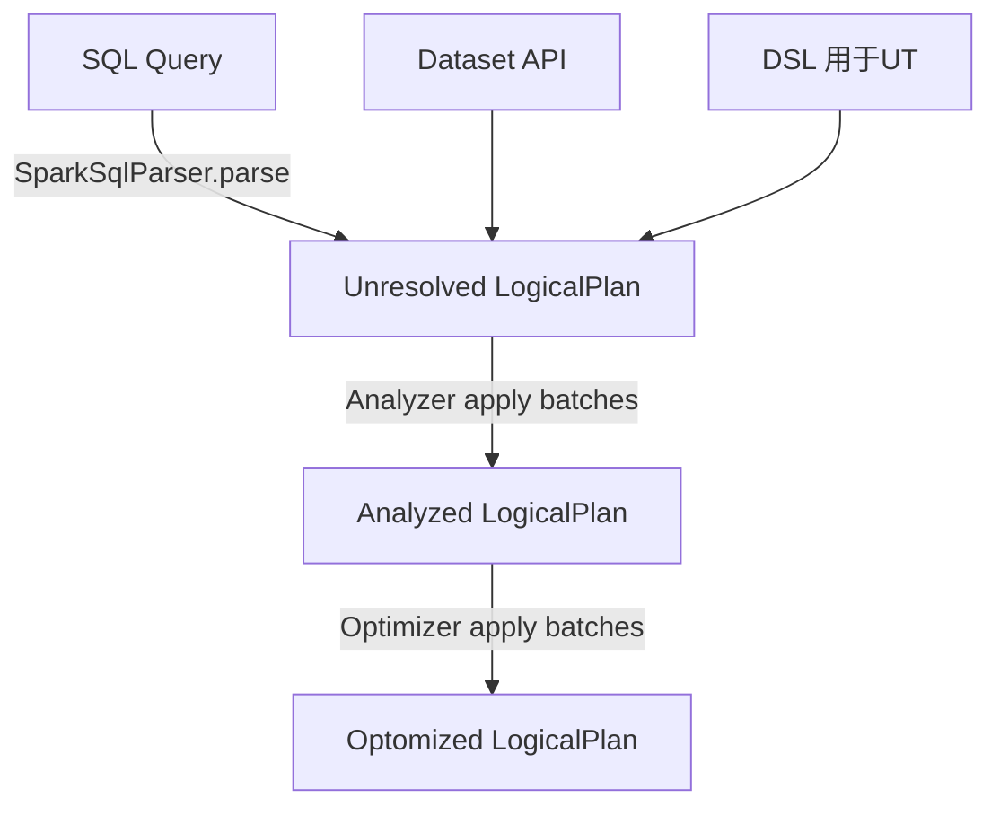
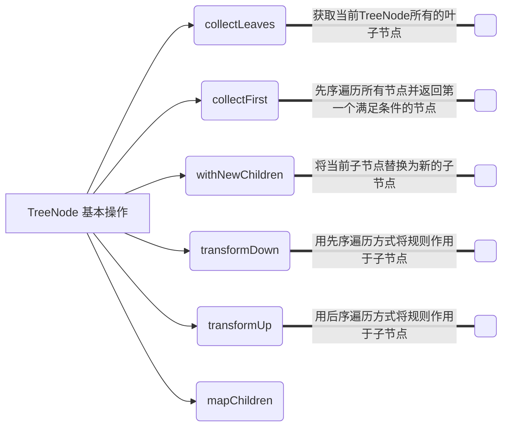
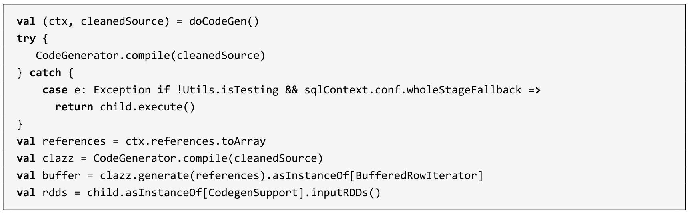
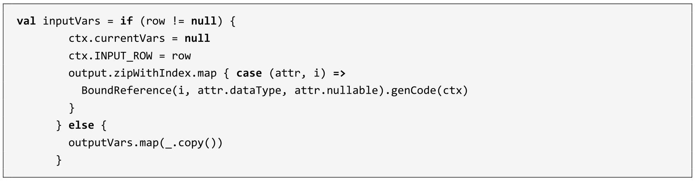
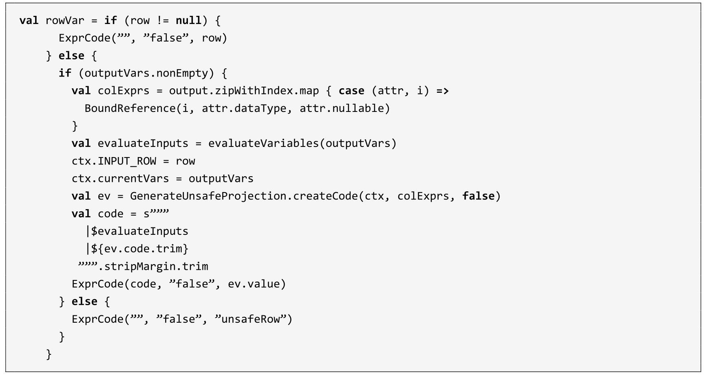
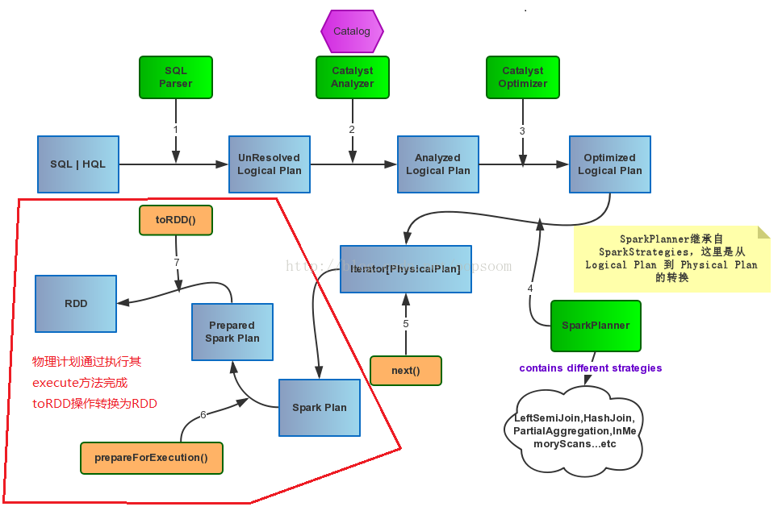

# 从 Spark中学Scala

## Spark SQL


### Row


### Aanlyer 机制
### `InternalRow`体系


### `TreeNode` 体系

TreeNode的定义如下：

```scala
abstract class TreeNode[BaseType <: TreeNode[BaseType]] 
     extends Product {    // 1.
  self: BaseType =>       // 2. 
}
```
这里有两个语法构造：
1. **自递归类型**：`BaseType <: TreeNode[BaseType]`，即 **F-Bounded Type**。
2. **自类型标记**：`self: BaseType =>`，即 **self-type annotation**。


作为基础类，`TreeNode`本身仅提供了最简单和最基本的操作，下图列举了`TreeNode`中现有的一些方法，如不同遍历方式的`transform`系列方法、用于替换新子节点的`withNewChildren`方法等。


### `Expression` 体系

**<u>表达式一般指的是不需要触发执行引擎而能够直接进行计算的单元</u>**，例如加减乘除四则运算、逻辑操作、转换操作、过滤操作等。如果说`TreeNode`是框架，那么就是`Expression`灵魂。在各种SQL引擎中，表达式都起着重要的作用。

Catalyst 实现了完善的表达式体系，与各种算子（`QueryPlan`）占据同样第地位。算子执行前通常都会进行绑定操作，将表达式与输入的属性对应起来，同时算子也能够调用各种表达式处理相应的逻辑。在`Expression`类中主要定义了5个方面的操作，包括基本属性、核心操作、输入输出、字符串表示和等价性判断，如图3.7所示。

<p align="center">
 
图3.7 Expression基本操作
</p>

核心操作的`eval`函数实现了表达式对应的处理逻辑，也就是其他模块调用该表达式的主要接口，而`genCode`和`doGenCode`用于生成表达上对应的**Java**代码（这部分内容将在第9章介绍）。字符串表示用于查看该Expression的具体内容，表达式名和输入参数等。下面对Expression包含的基本属性和操作进行简单介绍。

- **foldable**：该属性用来标记表达式能否在查询之前直接静态计算。目前，`foldable`为`true`的情况有两种，第一种是该表达式为`Literal`类型（==字面量==，例如常量等），第二种是当且仅当其子表达式中`foldable`都为`true`时。当`foldable`为`true`时，在算子树中，表达式可以预先直接处理（折叠）。

- **deteministic**：该属性用来标记表达式是否为确定性的，即每次执行`eval`函数的输出是否相同。考虑到Spark分布执行环境中数据的 **Shuffle** 操作带来的不确定性，以及某些表达式（如`Rand`等）本身具有不确定性，该属性对于算子树优化中的谓词能否下推等很有必要。 

  - 对于**子表达式固定的输入**，如果**当前表达式**总是返回相同的结果，那么`deteministic` 返回 `true`。注意，这意味着如果出现以下情况，则表达式将被视为**非确定性表达式**：

    - 依赖于某种可变的内部状态，例如 `SparkPartitionID` 依赖于 `TaskContext` 返回 **partition id**
    - 依赖于一些不属于**子表达式列表**的隐式输入，比如继承 `Stateful trait` 的类。
    - 有一个或多个不确定的子表达式
    - 假定输入**通过子运算符**满足某些特定条件

    由于`Nil.forall(_.deterministic)` 返回 `true`，所以叶子表达式缺省为**确定性**，比如 `current_date`

- **nullable**：该属性用来标记表达式是否可能输出`Null`值，一般在生成的Java代码中对相关的条件进行判断。

- **references**：返回值为`AttributeSet`类型，表示该`Expression`中会涉及的属性值，默认情况下为所有子节点中**属性值的集合**。

- **canonicalized**：返回经过规范化处理后的表达式。规范化处理会在确保输出结果相同的前提下通过一些规则对表达式进行重写，具体逻辑可以参见`Canonicalize`工具类。

- **sematicEquals**：判断两个表达式在语义上是否等价。基本的判断条件是两个表达式都是确定性的（**deteministic**为true），且两个表达式经过规范化（canonicalized）处理后仍然相同。

在SparkSQL中，`Expression`本身也是`TreeNode`类的子类，因此能够调用所有`TreeNode`的方法，例如`transform`等，也可以通过多级的子`Expression`组合成复杂的`Expression`。表达式涉及范围广且数目庞大，相关的类或接口将近300个（如图3.8所示），这里列举一些比较常用的`Expression`来介绍。

 图3.8 Expression体系

- **`Nondeterministic`**特质：具有不确定性的`Expression`，其中`deteministic`和`foldable`属性都返回**false**，经典的实现包括`MonotonicallyIncreasingID`、`Rand`和`Randn`等表达式。
- **`Unevaluable`**特质：不可执行的表达式，即调用`eval`函数会抛出异常。该特质主要用于生命周期不超过逻辑计划解析和优化阶段的表达式，例如`Star`表达式（*）在解析阶段就会被展开成具体的列集合。
- **`CodegenFallback`**特质：不支持代码生成的表达式。某些表达式涉及第三方实现（例如Hive的UDF）等情况，无法生成Java代码，此时通过`CodegenFallback`直接调用，该接口实现了具体的调用方法。
- **`LeafExpression`**：叶子节点类型的表达式，即不包含任何子节点，因此其`children`方法通常默认返回`Nil`值。该类型的表达式目前大约有**30**个，包括`Star`、`CurrentDate`、`Pi`等。
- **`UnaryExpression`**：一元类型的表达式，只含有一个子节点。这种类型的表达式总量**110**多种，较为庞大。其输入涉及一个子节点，例如，`Abs`操作、`UpCast`表达式等。
- **`BinaryExpression`**：二元类型的表达式，包含两个子节点。这种类型的表达式数目也比较庞大，大约80种。比较常用的是一些二元的算数表达式，例如加减乘除操作、`RLike`函数等。另外`BinaryExpression`有一个`BinaryOperator`特例，它要求两个子节点具有相同的输出数据类型。
- **`TernaryExpression`** ：三元类型的表达式，包含三个子节点。这种类型的表达式数目不多，大约10种，大部分都是一些字符串操作函数，非常典型的例子可以参考Substring函数，其子节点分别是字符串、下标和长度的表达式。

Catalyst 中的表达式如果想要在函数注册表中公开（用户因此可以使用`name(arguments...)`的方式调用它），具体实现必须是一个`case`类，其构造函数的参数都必须是`Expression`s类型。有关示例，请参阅Substring。

```scala
abstract class TreeNode[BaseType <: TreeNode[BaseType]] extends Product {
  self: BaseType =>
}
abstract class Expression extends TreeNode[Expression] {}
```
> [Re: What does Attribute and AttributeReference mean in Spark SQL](http://mail-archives.apache.org/mod_mbox/spark-user/201508.mbox/%3CCAAswR-59+2Fz1HNfVAUmM1Oc_uWaHki24=vrGuB3oh7x_cUG7A@mail.gmail.com%3E)
>
> `Attribute` is the Catalyst name for an input column from a child operator. <u>An `AttributeReference` has been resolved, meaning we know which input  column in particular it is referring too.</u>  An `AttributeReference` also has a known DataType.  In contrast, before analysis there might still exist `UnresolvedReferences`, which are just string identifiers from a parsed query.
>
> An Expression can be more complex (like you suggested,  `a + b`), though  technically just `a` is also a very simple Expression.  The following console session shows how these types are composed:
>
> ```bash
> $ build/sbt sql/console
> import org.apache.spark.SparkContextimport
> org.apache.spark.sql.SQLContextimport
> org.apache.spark.sql.catalyst.analysis._import
> org.apache.spark.sql.catalyst.plans.logical._
> import org.apache.spark.sql.catalyst.dsl.expressions._import
> org.apache.spark.sql.catalyst.dsl.plans._
> 
> sc: org.apache.spark.SparkContext = org.apache.spark.SparkContext@5adfe37d
> sqlContext: org.apache.spark.sql.SQLContext =
> org.apache.spark.sql.SQLContext@20d05227import
> sqlContext.implicits._import sqlContext._Welcome to Scala version
> 2.10.4 (Java HotSpot(TM) 64-Bit Server VM, Java 1.7.0_45).Type in
> expressions to have them evaluated.Type :help for more information.
> 
> scala> val unresolvedAttr: UnresolvedAttribute = 'a
> unresolvedAttr: org.apache.spark.sql.catalyst.analysis.UnresolvedAttribute = 'a
> 
> scala> val relation = LocalRelation('a.int)
> relation: org.apache.spark.sql.catalyst.plans.logical.LocalRelation =
> LocalRelation [a#0]
> 
> scala> val parsedQuery = relation.select(unresolvedAttr)
> parsedQuery: org.apache.spark.sql.catalyst.plans.logical.LogicalPlan =
> 'Project ['a]
>  LocalRelation [a#0]
> 
> scala> parsedQuery.analyze
> res11: org.apache.spark.sql.catalyst.plans.logical.LogicalPlan = Project [a#0]
>  LocalRelation [a#0]
> ```
> The `#0` after `a` is a unique identifier (within this JVM) that says where the data is coming from, even as plans are rearranged due to optimizations.
>
> `BoundReference`
> 
> 

## 5.2 LogicalPlan 简介
`LogicalPlan` 作为数据结构记录了对应逻辑算子树节点的基本信息和基本操作，包括输入输出和各种处理逻辑等。在第 3 章中已经介绍过， `LogicalPlan` 属于 `TreeNode` 体系，继承自 `QueryPlan` 父类。

### 5.2.1 QueryPlan 概述
在介绍 `LogicalPlan` 之前，有必要先介绍一下其父类 `QueryPlan` 。为了从整体视角了解 `QueryPlan` 的所有功能，图 5.2 列举了其全部操作，并进行了简单的类型划分。

图 5.2 将 `QueryPlan` 的主要操作分为 6 个模块，分别是**输入输出**、**字符串**、**规范化**、**表达式操作**、**基本属性**和**约束**。下面简单介绍这 6 个模块，读者可结合实际代码阅读。

- **输入输出**： `QueryPlan` 的输入输出定义了 5 个方法，其中：
  -  `output` 是返回值为 `Seq[Attribute]`的虚函数，具体内容由不同子节点实现，
  - 而 `outputSet` 是将 `output` 的返回值进行封装，得到 `AttributeSet` 集合类型的结果。
  - 获取输入属性的方法 `inputSet` 的返回值也是 `AttributeSet` ，节点的输入属性对应所有子节点的输出； 
  - `producedAttributes` 表示该节点所产生的属性； 
  - `missingInput` 表示该节点表达式中涉及的但是其子节点输出中并不包含的属性。

- **基本属性**：表示 `QueryPlan` 节点中的一些基本信息，

  - 其中 `schema` 对应 `output` 输出属性的 `schema` 信息，
  - `allAttributes` 记录节点所涉及的所有属性（`Attribute`）列表，
  - `aliasMap` 记录节点与子节点表达式中所有的别名信息， 
  - `references` 表示节点表达式中所涉及的所有属性集合，
  - `subqueries` 和 `innerChildren` 都默认实现该 QueryPlan 节点中包含的所有子查询。

- **字符串**：这部分方法主要用于输出打印 QueryPlan 树型结构信息，其中 schema 信息也会以树状展示。需要注意的一个方法是 statePrefix ，用来表示节点对应计划状态的前缀字符串。在 QueryPlan 的默认实现中，如果该计划不可用（invalid），则前缀会用感叹号（“！”）标记。

- **规范化**：类似 `Expression` 中的方法定义，对 `QueryPlan` 节点类型也有规范化（ *Canonicalize* ）的概念。在 QueryPlan 的默认实现中， `canonicalized` 直接赋值为当前的 `QueryPlan` 类；此外，在 `sameResult` 方法中会利用 `canonicalized` 来判断两个 QueryPlan 的输出数据是否相同。

  > 注: `sameResult` 在 `CacheManager` 中有用到

- **表达式操作**：在第 3 章中已经介绍过 Spark SQL 丰富的表达式体系，其典型的特点就是不需要驱动，直接执行。而在 QueryPlan 各个节点中，包含了各种表达式对象，各种逻辑操作一般也都是通过表达式来执行的。在 QueryPlan 的方法定义中，表达式相关的操作占据重要的地位，其中 expressions 方法能够得到该节点中的所有表达式列表，其他方法很容易根据命名了解对应功能，具体的实现细节可以参看代码。

- **约束（ Constraints ）**：本质上也属于数据过滤条件（Filter）的一种，同样是表达式类型。相对于显式的过滤条件，约束信息可以「推导」出来，例如，对于「a>5」这样的过滤条件，显然 a 的属性不能为 null，这样就可以对应地构造 isNotNull （a）约束；又如「a=5」和「a=b」的谓词，能够推导得到「b=5」的约束条件。在实际情况下，SQL 语句中可能会涉及很复杂的约束条件处理，如约束合并、等价性判断等。在 QueryPlan 类中，提供了大量方法用于辅助生成 constraints 表达式集合以支持后续优化操作。例如， validConstraints 方法返回该 QueryPlan 所有可用的约束条件，比较常用的 constructIsNotNullConstraints 方法，会针对特定的列构造 isNotNull 的约束条件。

<p align="center">
 
 图 5.2 QueryPlan 基本操作
</p>

### 5.2.2 LogicalPlan 基本操作与分类
本小节进行 `LogicalPlan` 类的分析，介绍**逻辑算子树节点**都有哪些功能。同样的，在内容上首先从整体列出 `LogicalPlan` 中的所有方法，使读者对 `LogicalPlan` 有一个宏观的概念。<u>读者可结合代码阅读</u>。

如图 5.3 所示， `LogicalPlan` 继承自 `QueryPlan` ，包含了**两个成员变量**和 **17 个方法**。两个成员变量一个是 `resolved`，用来标记该 `LogicalPlan` 是否为经过了解析的布尔类型值；另一个是 `canonicalized` ，重载了 `QueryPlan` 中的对应赋值，<u>默认实现消除了子查询别名之后的 `LogicalPlan`</u> 。

<p align="center">
 
 图 5.3 LogicalPlan 基本操作
</p>

图 5.3 中的方法根据操作的内容进行了分类，前 3 个方法与 `resolved` 成员变量相关，其中 `childrenResolved` 标记子节点是否已经被解析。中间的 5 个方法设定了该 `LogicalPlan` 中的一些基本信息，其中 `statePrefix` 重载了 QueryPlan 中的实现，如果该逻辑算子树节点未经过解析，<u>则输出的字符串前缀会加上单引号（『）</u>； `isStreaming` 方法用来表示当前逻辑算子树中是否包含流式数据源； `statistics` 记录了当前节点的统计信息，例如默认实现的 `sizeInBytes` 信息，一般来讲如果当前节点不包含子节点，则必须重载实现该方法；`maxRows` 记录了当前节点可能计算的最大行数，一般常用于 `Limit` 算子；`refresh` 方法<u>会递归地刷新当前计划中的元数据等信息</u>。剩下的则是 `LogicalPlan` 中定义的与 `resolve` 相关的 9 个分析方法，用来执行对数据表、表达式、**schema** 和列属性等类型的解析，具体实现可以参见代码。

同样的， `LogicalPlan` 仍然是抽象类，根据子节点数目，绝大部分的 `LogicalPlan` 可以分为 3 类，即叶子节点 `LeafNode` 类型（不存在子节点）、一元节点 `UnaryNode` 类型（仅包含一个子节点）和二元节点 `BinaryNode` 类型（包含两个子节点）。此外，还有几个子类直接继承自 LogicalPlan ，不属于这 3 种类型，将在后面单独介绍。

### 5.2.3　LeafNode 类型的 LogicalPlan
在 `LogicalPlan` 所有类型的节点中，`LeafNode` 类型的数目最多，共有 70 多种。为了便于进行分析，本小节将这些子类按照其所属的包进行了分类，如图 5.4 所示。

<p align="center">
 
 图 5.4　LeafNode 类型的 LogicalPlan
</p>

根据图 5.4 中的关键字可以看到，`LeafNode` 类型的 `LogicalPlan` 节点对应<u>数据表</u>和<u>命令</u>（`Command`）相关的逻辑，因此这些 `LeafNode` 子类中有很大一部分都属于 *datasources* 包和 *command* 包。值得一提的是，实现 `RunnableCommand` 特质（Trait）的类共有 40 多个，是数量最为庞大的 `LogicalPlan` 类型。顾名思义， `RunnableCommand` 是直接运行的命令，主要涉及 12 种情形，包括 *Database* 相关命令、*Table* 相关命令、*View* 相关命令、*DDL* 相关命令、*Function* 相关命令和 *Resource* 相关命令等。例如，Database 相关命令有两个，分别是 `ShowDatabasesCommand` 和 `SetDatabaseCommand` ，用于显示当前数据库名称和切换当前数据库到相应的数据库。

以 `SetDatabaseCommand` 命令为例，其实现比较简单，如以下代码所示，该 Command 对应 SQL 中的「 `usedatabase` 」语句。可以看到，该命令直接调用的是 Catalog 中的 set 方法。Catalog 相关的内容会在 5.4 节中进行介绍。

```scala
/**
 * Command for setting the current database.
 * {{{
 *   USE database_name;
 * }}}
 */
case class SetDatabaseCommand(databaseName: String) extends RunnableCommand {
  override def run(sparkSession: SparkSession): Seq[Row] = {
    sparkSession.sessionState.catalog.setCurrentDatabase(databaseName)
    Seq.empty[Row]
  }
}
```

### 5.2.4 UnaryNode 类型的 LogicalPlan

在 `LogicalPlan` 所有类型的节点中， `UnaryNode` 类型的节点应用非常广泛，共有 **34** 种，常见于对数据的逻辑转换操作，包括过滤等，如图 5.5 所示。

<p align="center">
 
 图 5.5 UnaryNode 类型的 LogicalPlan
</p>

根据节点所起的不同作用，图 5.5 中的所有节点可以分为 4 个类别。

- 用来定义重分区（ *repartitioning* ）操作的 3 个 `UnaryNode` ，即 `RedistributeData` 及其两个子类 `SortPartitions` 和 `RepartitionByExpression` ，主要针对现有分区和排序的特点不满足的场景。

- 脚本相关的转换操作 `ScriptTransformation` ，用特定的脚本对输入数据进行转换。

- `Object` 相关的操作，即 `ObjectConsumer` 这个特质（Trait）和其他 10 个类，包括 `DeserializeToObject` 、 `SerializeFromObject` 和 `FlatMapGroupsInR` 等。

- 基本操作算子（ *basicLogicalOperators* ），数量最多，共有 19 种，涉及 `Project`、`Filter`、`Sort` 等各种常见的关系算子。

这里以 `Sort` 节点为例，根据以下代码中的类的定义可以看到，其实现同样非常简单，不涉及额外的逻辑处理；基本上只保存了 `Sort` 操作中所需要的相关信息，包括排序的规则（<u>升序</u>或<u>降序</u>表达式）、是否全局等。类似的，其他基本操作对应逻辑算子的实现也比较简单，具体可参见代码。

```scala
/**
 * @param order  The ordering expressions
 * @param global True means global sorting apply for entire data set,
 *               False means sorting only apply within the partition.
 * @param child  Child logical plan
 */
case class Sort(
    order: Seq[SortOrder],
    global: Boolean,
    child: LogicalPlan) extends UnaryNode {
  override def output: Seq[Attribute] = child.output
  override def maxRows: Option[Long] = child.maxRows
  override def outputOrdering: Seq[SortOrder] = order
}
```

### 5.2.5 BinaryNode 类型的 LogicalPlan

在 `LogicalPlan` 所有类型的节点中， `BinaryNode` 类型的节点很少，只定义了 5 种，常见于对数据的组合关联操作，包括 `Join` 算子等，如图 5.6 所示。

<p align="center">
 
 图 5.6 BinaryNode 类型的 LogicalPlan
</p>

从图 5.6 中可以看到， `BinaryNode` 类型的逻辑算子树节点包括连接（`Join`）、集合操作（ `SetOperation` ）和 `CoGroup` 3 种，其中 `SetOperation` 包括 `Except` 和 `Intersect` 两种算子。

同样的，以 `Except` 算子为例，根据以下代码的实现可以看到，其传入参数是 `left` 和 `right` 两个 `LogicalPlan` ，重载实现的 `output` 方法、 `validContraints` 方法甚至 `statistics` 方法都只需直接调用输出 left 的方法。 `BinaryNode` 类型节点中比较复杂且重要的是 `Join` 算子，这部分内容会在第 8 章单独介绍。

```scala
case class Except(
    left: LogicalPlan,
    right: LogicalPlan,
    isAll: Boolean) extends SetOperation(left, right) {
  override def nodeName: String = getClass.getSimpleName + ( if ( isAll ) "All" else "" )
  /** We don't use right.output because those rows get excluded from the set. */
  override def output: Seq[Attribute] = left.output

  override protected def validConstraints: Set[Expression] = leftConstraints
}
```

### 5.2.6　其他类型的 LogicalPlan

除上述 3 种类型的 `LogicalPlan` 外，在 Spark SQL 中还有 3 种直接继承自 `LogicalPlan` 的逻辑算子节点，如图 5.7 所示。

<p align="center">
 
 图 5.7　其他类型的 LogicalPlan
</p>

这 3 种类型的 `LogicalPlan` 分别是 `ObjectProducer` 、`Union` 和 `EventTimeWatermark` 逻辑算子。其中， `EventTimeWatermark` 主要针对 *Spark Streaming* 中的 *watermark* 机制，一般在 SQL 中用得不多； `ObjectProducer` 为特质（Trait），与前面的 `ObjectConsumer` 相对应，用于产生只包含 Object 列的行数据；`Union` 算子的使用场景比较多，其子节点数目不限，是一系列 `LogicalPlan` 的列表。

总体来讲， `LogicalPlan` 中主要记录了该**逻辑节点处理逻辑的相关属性**，包括<u>输入输出</u>、<u>约束条件</u>、<u>算子逻辑</u>和<u>统计信息</u>等。本节对 LogicalPlan 的直接父类 QueryPlan 和各种子类进行了概述，旨在从宏观层面给出整体横向的视角，后续章节中会用特定的算子在纵向进行深入的分析。

## 5.4　Analyzer 机制： Analyzed LogicalPlan 生成

经过上一个阶段 `AstBuilder` 的处理，已经得到了 Unresolved `LogicalPlan` 。从图 5.10 中可以看到，该逻辑算子树中未被解析的有 `UnresolvedRelation` 和 `UnresolvedAttribute` 两种对象。实际上，*Analyzer* 所起到的主要作用就是将这两种节点或表达式解析成有类型的（Typed）对象。在此过程中，需要用到 *Catalog* 的相关信息。这也可以从 *Analyzer* 的构造参数看出。在分析 *Analyzer* 之前，本节先对 Spark SQL 中随处都会用到的 *Catalog* 体系和 *Rule* 体系进行介绍。

### 5.4.1　Catalog 体系分析

按照 **SQL** 标准的解释，在 **SQL** 环境下 *Catalog* 和 *Schema* 都属于抽象概念。在关系数据库中，Catalog 是一个宽泛的概念，通常可以理解为<u>一个容器或数据库对象命名空间中</u>的一个层次，主要用来**解决命名冲突等问题**。

在 **Spark SQL** 系统中，*Catalog* 主要用于**各种函数资源信息**和**元数据信息**（数据库、数据表、数据视图、数据分区与函数等）的统一管理。 Spark SQL 的 Catalog 体系涉及多个方面，不同层次所对应的关系如图 5.11 所示。

<p align="center">
 
 图 5.11　Catalog 体系
</p>

具体来讲， Spark SQL 中的 *Catalog* 体系实现以 `SessionCatalog` 为主体，通过 `SparkSession` （Spark 程序入口）提供给外部调用。一般一个 `SparkSession` 对应一个 `SessionCatalog` 。本质上， `SessionCatalog` 起到了一个代理的作用，对底层的**元数据信息**、**临时表信息**、**视图信息**和**函数信息**进行了封装。如图 5.11 所示， `SessionCatalog` 的构造参数包括 6 部分，除传入 Spark SQL 和 Hadoop 配置信息的 CatalystConf 与 Configuration 外，还涉及以下 4 个方面的内容。

- GlobalTempViewManager （全局的临时视图管理）：对应 DataFrame 中常用的 createGlobal-TempView 方法，进行跨 Session 的视图管理。 GlobalTempViewManager 是一个线程安全的类，提供了对全局视图的原子操作，包括创建、更新、删除和重命名等。在 GlobalTempViewManager 内部实现中，主要功能依赖一个 mutable 类型的 HashMap 来对视图名和数据源进行映射，其中的 key 是视图名的字符串，value 是视图所对应的 LogicalPlan （一般在创建该视图时生成）。需要注意的是， GlobalTempViewManager 对视图名是大小写敏感的。

- FunctionResourceLoader （函数资源加载器）：在 Spark SQL 中除内置实现的各种函数外，还支持用户自定义的函数和 Hive 中的各种函数。这些函数往往通过 Jar 包或文件类型提供， FunctionResourceLoader 主要就是用来加载这两种类型的资源以提供函数的调用。需要注意的是，对于 Archive 类型的资源，目前仅支持在 YARN 模式下以 spark-subm it 方式提交时进行加载。

- FunctionRegistry （函数注册接口）：用来实现对函数的注册（Register）、查找（Lookup）和删除（Drop）等功能。一般来讲， FunctionRegistry 的具体实现需要是线程安全的，以支持并发访问。在 Spark SQL 中默认实现是 SimpleFunctionRegistry ，其中采用 Map 数据结构注册了各种内置的函数。

- ExternalCatalog （外部系统 Catalog）：用来管理数据库（Databases）、数据表（Tables）、数据分区（ Partitions ）和函数（Functions）的接口。顾名思义，其目标是与外部系统交互，并做到上述内容的非临时性存储，同样需要满足线程安全以支持并发访问。如图 5.11 所示， ExternalCatalog 是一个抽象类，定义了上述 4 个方面的功能。在 Spark SQL 中，具体实现有 InMemoryCatalog 和 HiveExternalCatalog 两种。前者将上述信息存储在内存中，一般用于测试或比较简单的 SQL 处理；后者利用 Hive 原数据库来实现持久化的管理，在生产环境中广泛应用（这部分内容会在第 10 章进行详细介绍）。

总体来看， SessionCatalog 是用于管理上述一切基本信息的入口。除上述的构造参数外，其内部还包括一个 mutable 类型的 HashMap 用来管理临时表信息，以及 currentDb 成员变量用来指代当前操作所对应的数据库名称。 SessionCatalog 在 Spark SQL 的整个流程中起着重要的作用，在后续逻辑算子阶段和物理算子阶段都会用到。


## 5.5 Spark SQL 优化器 Optimizer

经过上一个阶段 **Analyzer** 的处理， *Unresolved LogicalPlan* 已经解析成为 *Analyzed LogicalPlan* 。从图 5.17 中可以看出， *Analyzed LogicalPlan* 中自底向上节点分别对应 `Relation`、`Subquery`、`Filter` 和 `Project` 算子。

*Analyzed LogicalPlan* 基本上是根据 *Unresolved LogicalPlan* 一对一转换过来的，对于 SQL 语句中的逻辑能够很好地表示。然而，在实际应用中，很多低效的写法会带来执行效率的问题，需要进一步对 *Analyzed LogicalPlan* 进行处理，得到更优的逻辑算子树。于是，针对 **SQL** 逻辑算子树的优化器 **Optimizer** 应运而生。

### 5.5.1 Optimizer 概述

在分析 *Rule* 体系时就已经提到， *Optimizer* 同样继承自 `RuleExecutor` 类，本身没有重载 `RuleExecutor` 中的 `execute` 方法，因此其执行过程仍然是调用其父类 `RuleExecutor` 中实现的 `execute` 方法。在 `QueryExecution` 中， **Optimizer** 会对传入的 *Analyzed LogicalPlan* 执行 `execute` 方法，启动优化过程。

```scala
val optimizedPlan: LogicalPlan = optimizer.execute(analyzed)
```

与 **Analyzer** 类似， **Optimizer** 的主要机制也依赖重新定义的一系列规则，同样对应 `RuleExecutor` 类中的成员变量 `batches`，因此在 `RuleExecutor` 执行 `execute` 方法时会直接利用这些规则 `Batch`。

如图 5.18 所示， `Optimizer` 继承自 `RuleExecutor` ，而 `SparkOptimizer` 又继承自 `Optimizer` 。在上述代码中， `optimizer` 即是构造的 `SparkOptimizer` 类。从图 5.18 中可以看出， `Optimizer` 本身定义了 12 个规则 `Batch`，在 `SparkOptimizer` 类中又添加了 4 个 Batch。

<p align="center">
 
 图 5.18 Optimizer 规则
</p>

### 5.5.2 Optimizer 规则体系

根据 5.5.1 小节的总结，Spark 2.1 版本的 `SparkOptimizer` 中共实现了 **16** 个 `Batch`，其中包含了 53 条优化规则，本节对这些优化规则进行系统的分析。

#### （ 1 ） Batch Finish Analysis

该 `Batch` 包含 5 条优化规则，分别是 `EliminateSubqueryAliases` 、 `ReplaceExpressions` 、 `ComputeCurrentTime` 、 `GetCurrentDatabase` 和 `RewriteDistinctAggregates` ，这些规则都**只执行一次**。

- `EliminateSubqueryAliases` ：消除子查询别名，对应逻辑算子树中的 SubqueryAlias 节点。一般来讲， Subqueries 仅用于提供查询的视角范围（Scope）信息，一旦 Analyzer 阶段结束，该节点就可以被移除，该优化规则直接将 SubqueryAlias 替换为其子节点。
- `ReplaceExpressions` ：表达式替换，在逻辑算子树中查找匹配 RuntimeReplaceable 的表达式并将其替换为能够执行的正常表达式。这条规则通常用来对其他类型的数据库提供兼容的能力，例如，可以用「coalesce」来替换支持「nvl」的表达式。
- `ComputeCurrentTime` ：计算与当前时间相关的表达式，在同一条 SQL 语句中可能包含多个计算时间的表达式，即 CurrentDate 和 CurrentTimestamp ，且该表达式出现在多个语句中。为避免不一致， ComputeCurrentTime 对逻辑算子树中的时间函数计算一次后，将其他同样的函数替换成该计算结果。

- `GetCurrentDatabase` ：获取当前数据库，在 SQL 语句中可能会调用 CurrentDatabase 函数来获取 Catalog 中的当前数据库，而这个方法没必要在执行阶段再进行计算。 GetCurrentDatabase 规则执行 CurrentDatabase 并得到结果，然后用此结果替换所有的 CurrentDatabase 表达式。

- `RewriteDistinctAggregates` ：重写 Distinct 聚合操作，对于包含 Distinct 算子的聚合语句，这条规则将其转换为两个常规的聚合表达式。这条规则主要面向聚合查询，在第 7 章会对其进行详细分析。

严格来讲， **Finish Analysis** 这个 `Batch` 中的一些规则更多的是为了得到正确的结果（例如 ComputeCurrentTime ），并不涉及优化操作，从逻辑上更应该归于 Analyzer 的分析规则中。但是考虑到 Analyzer 中会进行一些规范化的操作，因此将 `EliminateSubqueryAliases` 和 `ComputeCurrentTime` 规则放在优化的部分，实际上真正的优化过程从下一个 Batch 开始。

#### （ 2 ） Batch Union ⇒ CombineUnions

针对 Union 操作的规则 Batch，中间包含一条 `CombineUnions` 优化规则。在逻辑算子树中，当相邻的节点都是 Union 算子时，可以将这些相邻的 Union 节点合并为一个 Union 节点。在该规则中， flattenUnion 是核心方法，用栈实现了节点的合并。需要注意的是，后续的优化操作可能会将原来不相邻的 Union 节点变得相邻，因此在后面的规则 Batch 中又加入了 CombineUnions 这条规则。

#### （ 3 ） Batch Subquery ⇒ OptimizeSubqueries

该 Batch 目前只包含 `OptimizeSubqueries` 这一条优化规则。当 SQL 语句包含子查询时，会在逻辑算子树上生成 SubqueryExpression 表达式。 OptimizeSubqueries 优化规则在遇到 Subquery-Expression 表达式时，进一步递归调用 Optimizer 对该表达式的子计划并进行优化。

#### （ 4 ） Batch ReplaceOperators

该 Batch 中的优化规则主要用来执行算子的替换操作。在 SQL 语句中，某些查询算子可以直接改写为已有的算子，避免进行重复的逻辑转换。 Replace Operators 中包含 `ReplaceIntersectWithSemiJoin` 、 `ReplaceExceptWithAntiJoin` 和 `ReplaceDistinctWithAggregate` 这 3 条优化规则。

- `ReplaceIntersectWithSemiJoin` ：将 **Intersect** 操作算子替换为 Left-Sem i Join 操作算子，从逻辑上来看，这两种算子是等价的。需要注意的是， `ReplaceIntersectWithSemiJoin` 优化规则仅适用于 INTERSECT DISTINCT 类型的语句，而不适用于 INTERSECT ALL 语句。此外，该优化规则执行之前必须消除重复的属性，避免生成的 Join 条件不正确。

- `ReplaceExceptWithAntiJoin` ：将 Except 操作算子替换为 Left-Anti Join 操作算子，从逻辑上来看，这两种算子是等价的。与上一条优化规则一样， `ReplaceExceptWithAntiJoin` 优化规则仅适用于 EXCEPTDISTINCT 类型的语句，而不适用于 EXCEPT ALL 语句。此外，该优化规则执行之前必须消除重复的属性，避免生成的 Join 条件不正确。

- `ReplaceDistinctWithAggregate` ：该优化规则会将 Distinct 算子转换为 Aggregate 语句。在某些 SQL 语句中，Select 直接进行 Distinct 操作，这种情况下可以将其直接转换为聚合操作。 `ReplaceDistinctWithAggregate` 规则会将 Distinct 算子替换为对应的 Group By 语句。

从以上描述中可以看出， ReplaceOperators 主要针对的是集合类型的操作算子。

#### （ 5 ）Batch Aggregate

该 Batch 主要用来处理聚合算子中的逻辑，包括 `RemoveLiteralFromGroupExpressions` 和 `RemoveRepetitionFromGroupExpressions` 两条规则。 `RemoveLiteralFromGroupExpressions` 优化规则用来删除 `Group By` 语句中的常数，这些常数对于结果无影响，但是会导致分组数目变多。此外，如果 `Group By` 语句中全部是常数，则会将其替换为一个简单的常数 0 表达式。 `RemoveRepetitionFromGroupExpressions` 优化规则将重复的表达式从 Group By 语句中删除，同样对结果无影响。

#### （ 6 ） Batch Operator Optimizations

类似 Analyzer 中的 *Operator* 解析规则，该 `Batch` 包含了 **Optimizer**中数量最多同时也是最常用的各种优化规则，共 31 条。从整体来看，这 31 条优化规则（如表 5.4 所示）可以分为 3 个模块：**算子下推**（ *Operator Push Down* ）、**算子组合**（ *Operator Combine* ）、**常量折叠与长度削减**（ *Constant Folding and Strength Reduction* ）。

- **算子下推**：算子下推是数据库中常用的优化方式，表 5.4 中所列的前 8 条规则都属于算子下推的模块。顾名思义，算子下推所执行的优化操作主要是将逻辑算子树中上层的算子节点尽量下推，使其靠近叶子节点，这样能够在不同程度上减少后续处理的数据量甚至简化后续的处理逻辑。以常见的列剪裁（ `ColumnPruning` ）优化为例，假设数据表中有 A、B、C 3 列，但是查询语句中只涉及 A、B 两列，那么 ColumnPruning 将会在读取数据后剪裁出这两列。又如 `LimitPushDown` 优化规则，能够将 `LocalLimit` 算子下推到 `Union All` 和 `Outer Join` 操作算子的下方，减少这两种算子在实际计算过程中需要处理的数据量。
- **算子组合**：算子组合类型的优化规则将逻辑算子树中能够进行组合的算子尽量整合在一起，避免多次计算，以提高性能。表 5.4 中间 6 条规则（从 `CollapseRepartition` 到 `CombineUnions` ）都属于算子组合类型的优化。可以看到这些规则主要针对的是重分区（ `repartition` ）算子、投影（`Project`）算子、过滤（`Filter`）算子、`Window` 算子、`Limit` 算子和 `Union` 算子，其中 `CombineUnions` 在之前已经提到过。需要注意的是，这些规则主要针对的是算子相邻的情况。

| 优化规则                            | 优化操作                   |
| ----------------------------------- | -------------------------- |
| `PushProjectionThroughUnion`        | 列剪裁下推                 |
| `ReorderJoin`                       | Join 顺序优化              |
| `EliminateOuterJoin`                | OuterJoin 消除             |
| `PushPredicateThroughJoin`          | 谓词下推到 Join 算 子      |
| `PushDownPredicate`                 | 谓词下推                   |
| `LimitPushDown`                     | Limit 算子下推             |
| `ColumnPruning`                     | 列剪裁                     |
| `InferFiltersFromConstraints`       | 约束条件提取               |
| `CollapseRepartition`               | 重分区组合                 |
| `CollapseProject`                   | 投影算子组合               |
| `CollapseWindow`                    | Window 组合                |
| `CombineFilters`                    | 过滤条件组合               |
| `CombineLimits`                     | Limit 操作组合             |
| `CombineUnions`                     | Union 算子组合             |
| `NullPropagation`                   | Null 提取                  |
| `FoldablePropagation`               | 可折叠算子提取             |
| `OptimizeIn`                        | In 操作优化                |
| `ConstantFolding`                   | 常数折叠                   |
| `ReorderAssociativeOperator`        | 重排序关联算子优化         |
| `LikeSimplification`                | Like 算子简化              |
| `BooleanSimplification`             | Boolean 算子简化           |
| `SimplifyConditionals`              | 条件简化                   |
| `RemoveDispensableExpressions`      | **Dispensable** 表达式消除 |
| `SimplifyBinaryComparison`          | 比较算子简化               |
| `PruneFilters`                      | 过滤条件剪裁               |
| `EliminateSorts`                    | 排序算子消除               |
| `SimplifyCasts`                     | Cast 算子简化              |
| `SimplifyCaseConversionExpressions` | case 表达式简 化           |
| `RewriteCorrelatedScalarSubquery`   | 标量依赖子查询重 写        |
| `EliminateSerialization`            | 序列化消除                 |
| `RemoveAliasOnlyProject`            | 消除别名                   |

<p align="center">
 
 表 5.4 Batch OperatorOptimizations 中的规则
</p>

- **常量折叠与长度削减**：对于逻辑算子树中涉及某些常量的节点，可以在实际执行之前就完成静态处理。常量折叠与长度削减类型的优化规则主要针对的就是这种情况。表 5.4 中的后 17 条优化规则都属于这种类型。例如，在 `ConstantFolding` 规则中，对于能够 *foldable*（可折叠）的表达式会直接在 `EmptyRow` 上执行 `evaluate` 操作，从而构造新的 `Literal` 表达式； `PruneFilters` 优化规则会详细地分析过滤条件，对总是能够返回 true 或 false 的过滤条件进行特别的处理。

#### （ 7 ） Batch Check Cartesian Products ⇒ CheckCartesianProducts

该 Batch 只有 `CheckCartesianProducts` 这一条优化规则，用来检测逻辑算子树中是否存在**笛卡儿积类型**的 Join 操作。如果存在这样的操作，而 SQL 语句中没有显示地使用 cross join 表达式，则会抛出异常。 `CheckCartesianProducts` 规则必须在 ReorderJoin 规则执行之后才能执行，确保所有的 Join 条件收集完毕。需要注意的是，当「 `spark.sql.crossJoin.enabled` 」参数设置为 true 时，该规则会被忽略。

#### （ 8 ） Batch DecimalOptimizations ⇒ DecimalAggregates

该 Batch 只有 `DecimalAggregates` 这一条优化规则，用于处理聚合操作中与 Decimal 类型相关的问题。一般情况下，如果聚合查询中涉及浮点数的精度处理，性能就会受到很大的影响。<u>对于固定精度的 Decimal 类型， `DecimalAggregates` 规则将其当作 **unscaled Long** 类型来执行，这样可以加速聚合操作的速度</u>。

#### （ 9 ） Batch Typed Filter Optim ization *⇒* CombineTypedFilters

该 Batch 仅包含 `CombineTypedFilters` 这一条优化规则，用来对特定情况下的过滤条件进行合并。当逻辑算子树中存在两个 `TypedFilter` 过滤条件且针对同类型的对象条件时， `CombineTypedFilters` 优化规则会将它们合并到同一个过滤函数中。

#### （ 10 ） Batch LocalRelation ⇒ ConvertToLocalRelation | PropagateEmptyRelation

该 Batch 主要用来优化与 LocalRelation 相关的逻辑算子树，包含 ConvertToLocalRelation 和 PropagateEmptyRelation 两条优化规则。 ConvertToLocalRelation 将 LocalRelation 上的本地操作（不涉及数据交互）转换为另一个 LocalRelation ，目前该规则实现较为简单，仅处理 Project 投影操作。 PropagateEmptyRelation 优化规则会将包含空的 LocalRelation 进行折叠。

#### （ 11 ） Batch OptimizeCodegen ⇒ OptimizeCodegen

该 Batch 只有 `OptimizeCodegen` 这一条优化规则，用来对生成的代码进行优化。代码生成技术会在与 Tungsten 相关的章节中讲解。 `OptimizeCodegen` 规则主要针对的是 `case when` 语句，当 `case when` 语句中的分支数目不超过配置中的最大数目时，该表达式才能执行代码生成。实际上，Spark 2.1 版本中的代码生成还存在许多不足之处，更加完善的实现可以参考 2.3 版本。

#### （ 12 ） Batch RewriteSubquery ⇒ RewritePredicateSubquery | CollapseProject

该 Batch 主要用来优化子查询，目前包含 `RewritePredicateSubquery` 和 `CollapseProject` 两条优化规则。 `RewritePredicateSubquery` 将特定的子查询谓词逻辑转换为 left-semi /anti-join 操作。其中，**EXISTS** 和 **NOTEXISTS** 算子分别对应 semi 和 anti 类型的 Join，过滤条件会被当作 Join 的条件；IN 和 NOT IN 也分别对应 semi 和 anti 类型的 Join，过滤条件和选择的列都会被当作 join 的条件。 `CollapseProject` 优化规则比较简单，类似 `CombineTypedFilters` 优化规则，会将两个相邻的 Project 算子组合在一起并执行别名替换，整合成一个统一的表达式。

#### （ 13 ） Batch OptimizeMetadataOnly Query ⇒ OptimizeMetadataOnlyQuery

该 Batch 仅执行一次，只有 `OptimizeMetadataOnlyQuery` 这一条规则，用来优化执行过程中只需查找分区级别元数据的语句。需要注意的是， `OptimizeMetadataOnlyQuery` 优化规则适用于扫描的所有列都是分区列且包含聚合算子的情形，而且聚合算子需要满足以下情况之一：聚合表达式是分区列；分区列的聚合函数有 DISTINCT 算子；分区列的聚合函数中是否有 DISTINCT 算子不影响结果。

#### （ 14 ） Batch Extract Python UDF from Aggregate ⇒ `ExtractPythonUDFFromAggregate`

该 Batch 仅执行一次，只有 `ExtractPythonUDFFromAggregate` 这一条规则，用来提取出聚合操作中的 **Python UDF** 函数。该规则主要针对的是采用 PySpark 提交查询的情形，将参与聚合的 Python 自定义函数提取出来，在聚合操作完成之后再执行。

#### （ 15 ） Batch Prune FileSource TablePartitions ⇒ PruneFileSourcePartitions

该 Batch 仅执行一次，只有 `PruneFileSourcePartitions` 这一条规则，用来对数据文件中的分区进行剪裁操作。当数据文件中定义了分区信息且逻辑算子树中的 LogicalRelation 节点上方存在过滤算子时， `PruneFileSourcePartitions` 优化规则会尽可能地将过滤算子下推到存储层，这样可以避免读入无关的数据分区。

#### （ 16  ） Batch User Provided Optim izers ⇒ ExperimentalMethods.extraOptimizations

顾名思义，该 Batch 用于支持用户自定义的优化规则，其中 ExperimentalMethods 的 extraOptimizations 队列默认为空。可以看到， Spark SQL 在逻辑算子树的转换阶段是高度可扩展的，用户只需要继承 `Rule[LogicalPlan]` 虚类，实现相应的转换逻辑就可以注册到优化规则队列中应用执行。

### 5.5.3 Optimized LogicalPlan 的生成过程

上述内容对 `SparkOptimizer` 中的优化规则进行了系统概述，现在回到案例对应的 Analyzed LogicalPlan 。接下来，将会重点分析 **Optimzer** 对该逻辑算子树进行优化处理的具体流程。

对于案例生成的 Analyzed LogicalPlan ，首先执行的是 Finish Analysis 这个 Batch 中的 `EliminateSubqueryAliases` 优化规则，用来消除子查询别名的情形。

`EliminateSubqueryAliases` 优化规则的实现逻辑如以下代码所示，可以看到，该规则的实现非常简单，直接将 SubqueryAlias 逻辑算子树节点替换为其子节点。经过 `EliminateSubqueryAliases` 规则优化后的逻辑算子树如图 5.19 所示。可见 `SubqueryAlias` 节点被删除，Filter 节点直接作用于 Relation 节点。

```scala
/**
 * Removes [[SubqueryAlias]] operators from the plan. Subqueries are only required to provide
 * scoping information for attributes and can be removed once analysis is complete.
 */
object EliminateSubqueryAliases extends Rule[LogicalPlan] {
  // This is also called in the beginning of the optimization phase, and as a result
  // is using transformUp rather than resolveOperators.
  def apply(plan: LogicalPlan): LogicalPlan = AnalysisHelper.allowInvokingTransformsInAnalyzer {
    plan transformUp {
      case SubqueryAlias(_, child) => child
    }
  }
}
```

<p align="center">
 
 图 5.19 Optimized LogicalPlan 生成的<B>第 1 步</B>
</p>

**第 2 步**优化将匹配 *Operator Optimizations* 这个 `Batch` 中的 `InferFiltersFromConstraints` 优化规则，用来增加过滤条件。 `InferFiltersFromConstraints` 优化规则会对<u>当前节点</u>的**约束条件**进行分析，生成额外的过滤条件列表，这些过滤条件不会与当前算子或其子节点现有的过滤条件重叠，具体实现如以下代码片段所示（注：案例逻辑算子树中不涉及 Join 查询语句，因此这里的代码片段中未包含 Join 算子的匹配部分）。

```scala
object InferFiltersFromConstraints extends Rule[LogicalPlan]
  with PredicateHelper with ConstraintHelper {
    
  def apply(plan: LogicalPlan): LogicalPlan = {
    case filter @ Filter(condition, child) =>
      val newFilters = filter.constraints --
        (child.constraints ++ splitConjunctivePredicates(condition))
      if (newFilters.nonEmpty) {
        Filter(And(newFilters.reduce(And), condition), child)
      } else {
        filter
      }
  }
}
```

从上述代码逻辑可知，对于上一步生成的逻辑算子树中的 `Filter` 节点，会构造新的过滤条件（`newFilter`）。当新的过滤条件不为空时，会与现有的过滤条件进行整合，构造新的 `Filter` 逻辑算子节点。

经过 `InferFiltersFromConstraints` 规则优化之后的逻辑算子树如图 5.20 所示，`Filter` 逻辑算子树节点中多了「 `isnotnull(age# 0L)`」这个过滤条件。该过滤条件来自于 Filter 中的约束信息，用来确保筛选出来的数据 age 字段不为 null。

最后一步，上述逻辑算子树会匹配 *Operator Optimizations* 这个 `Batch` 中的 `ConstantFolding` 优化规则，对 `LogicalPlan` 中可以折叠的表达式进行静态计算直接得到结果，简化表达式。

```scala
/**
 * Replaces [[Expression Expressions]] that can be statically evaluated with
 * equivalent [[Literal]] values.
 */
object ConstantFolding extends Rule[LogicalPlan] {
  def apply(plan: LogicalPlan): LogicalPlan = plan transform {
    case q: LogicalPlan => q transformExpressionsDown {
      // Skip redundant folding of literals. This rule is technically not necessary. Placing this
      // here avoids running the next rule for Literal values, which would create a new Literal
      // object and running eval unnecessarily.
      case l: Literal => l

      // Fold expressions that are foldable.
      case e if e.foldable => Literal.create(e.eval(EmptyRow), e.dataType)
    }
  }
}
```

<p align="center">
 
 图 5.20 Optimized LogicalPlan 生成的<B>第 2 步</B>
</p>

在 **ConstantFolding** 规则中，如果 `LogicalPlan` 中的表达式**可以折叠**（foldable 为 true），那么会将 `EmptyRow` 作为参数传递到其 `eval` 方法中直接计算，然后根据计算结果构造 `Literal` 常量表达式。经过该规则优化后的逻辑算子树如图 5.21 所示。

<p align="center">
 
  图 5.21 Optimized LogicalPlan 生成的<B>第 3 步</B>
</p>

可见，Filter 过滤条件中的「cast(18，bigint)」表达式经过计算成为「Literal(18，bigint)」表达式，即输出的结果为 18。在原来的 Cast 表达式中，其子节点 Literal 表达式的 foldable 值为 true，因此 Cast 表达式本身的 foldable 值也为 true，在匹配该优化规则时，Cast 表达式会被直接计算。

经过上述步骤， Spark SQL 逻辑算子树生成、分析与优化的整个阶段都执行完毕。最终生成的逻辑算子树包含 Relation 节点、Filter 节点和 Project 节点，同时每个节点中又包含了由对应表达式构成的树。这棵逻辑算子树将作为 Spark SQL 中生成物理算子树的输入，开始下一个阶段。

## 9.3　动态代码生成（ Code generation ）

Spark 引入代码生成主要用于 SQL 和 DataFrames 中的表达式求值（ Expression evaluation ） [43] 。表达式求值的过程是在特定的记录上计算一个表达式的值。当然，这里指的是运行时，而不是在一个缓慢的解释器中逐行做单步调试。对比解释器，代码生成去掉了原始数据类型的封装，更重要的是，避免了昂贵的多态函数调度。


### 9.3.1　漫谈代码生成

当今绝大多数数据库系统处理 SQL 查询的方式都是将其翻译成一系列的关系代数算子或表达式，然后依赖这些关系代数算子逐条处理输入数据并产生结果。从本质上看，这是一种迭代的模式 [44] ，某些时候也被称为 Volcano 形式的处理方式，由 Graefe 在 1993 年提出。

该模式可以概括为：每个物理关系代数算子反复不断地调用 `next` 函数来读入数据元组（*Tuple*）作为算子的输入，经过表达式处理后输出一个数据元组的流（ *Tuplestream* ）。这种模式简单而强大，能够通过任意组合算子来表达复杂的查询。

这种迭代处理模式提出的背景是减轻查询处理的 IO 瓶颈，对 CPU 的消耗则考虑较少 [43] 。首先，每次处理一个数据元组时，next 函数都会被调用，在数据量非常大时，调用的次数会非常多。最重要的是，`next` 函数通常实现为虚函数或函数指针，这样每次调用都会引起 CPU 中断并使得 CPU 分支预测（ Branch Prediction ）下降，因此相比常规函数的调用代价更大。此外，迭代处理模式通常会导致很差的代码本地化能力，并且需要保存复杂的处理信息。例如，表扫描算子在处理一个压缩的数据表时，在迭代模式下，需要每次产生一个数据元组，因此表扫描算子中需要记录当前数据元组在压缩数据流中的位置，以便根据压缩方式跳转到下一条数据元组的位置。

正是基于这些考虑及实际性能上的观察，一些现代的数据库系统开始尝试摆脱单纯的迭代模式，考虑面向数据块（Block）的方式 [45] （一次读取一批数据）来获得数据向量化的处理优势。具体包含两方面，<u>一方面</u>是**每次解压一批数据元组，然后每次迭代读取数据时只在这批数据中读取**；<u>另一方面</u>是**直接在 `next` 函数读取数据时就读取多个数据元组，甚至一次性读取所有的数据元组**。

上述面向数据块的处理方式在一定程度上确实能够消除在大数据量情况下的调用代价，然而在另一方面却丢掉了迭代模式一个重要的优点，即所谓的能够按照管道方式传输数据（ Pipelining data ）。管道方式意味着数据从一个算子传输到另一个算子不需要进行额外复制或序列化处理。例如，select 就是一个具有管道方式的算子，能够在不修改数据的前提下传输数据元组到下一个算子。然而，在面向数据块的处理方式中，一次产生多条数据元组往往需要序列化保存，虽然能够带来向量化处理的优势 [46] ，但是破坏了管道方式的优点，并且在通常情况下会消耗更多的内存与网络带宽。

因此，当内存与 IO 不再成为瓶颈后，CPU 成为现代数据库系统的主要瓶颈。MonetDB 系列的数据库处理系统采用的是面向数据块的思路。另一个思路则是将查询编译成中间可执行的格式，即动态代码生成（ Codegeneration ），来取代解释性的结构。在实际数据处理中，比较有意思的一个发现是开发人员手写的程序明显比向量化的数据库系统性能高 [47] 。

总的来讲，动态代码生成能够有效地解决 3 个方面的问题。

- 大量虚函数调用，生成的实际代码不再需要执行表达式系统中统一定义的虚函数（如 `Eval`、`Evaluate` 等）。
- 判断数据类型和操作算子等内容的大型分支选择语句。
- 常数传播（ Constants propagation ）限制，生成的代码中能够确定性地折叠常量。

近年来，在代码生成方面，学术界与企业界也做了大量的工作。例如，文献 [48] 中将查询逻辑转换为 Java 字节码、HIQUE 系统将查询翻译为 C 代码。代码生成技术在大数据系统中的应用也非常广泛，例如，Impala 中采用 LLVM（ Low-LevelVirtualMachine ）作为中间代码加速数据处理、 Spark SQL 生成 Java 中间代码来提升效率。

### 9.3.2　Janino 编译器实践

在 *Spark* 中，生成的代码由 **Janino** 进行编译。**Janino** 是一个小且快的 *Java* 编译器，它不仅能像 *javac* 工具那样将一组源文件编译成字节码文件，还可以对一些 **Java** 表达式、代码块、类中的文本（**Classbody**）或内存中的源文件进行编译，并把编译后的字节码直接加载到同一个 JVM 中运行。**Janino** 不是一个开发工具，而是运行时的嵌入式编译器，比如作为表达式求值的翻译器或类似 JSP 的服务端页面引擎。

下面的案例展示了 **Janino** 中 `ExpressionEvaluator` 的用法，将符合 Java 语法的字符串表达式（“a+b”）进行编译（Cook），然后加载使用，读者可仔细体会其中的调用方式。

```java
import java.lang.reflect.InvocationTargetException;
import org.codehaus.commons.compiler.CompileException;
import org.codehaus.janino.ExpressionEvaluator;
 
public class Main {
 
    public static void
    main(String[] args) throws CompileException, InvocationTargetException {
 
        // Now here's where the story begins...
        ExpressionEvaluator ee = new ExpressionEvaluator();
 
        // The expression will have two "int" parameters: "a" and "b".
        ee.setParameters(new String[] { "a", "b" }, new Class[] { int.class, int.class });
 
        // And the expression (i.e. "result") type is also "int".
        ee.setExpressionType(int.class);
 
        // And now we "cook" (scan, parse, compile and load) the fabulous expression.
        ee.cook("a + b");
 
        // Eventually we evaluate the expression - and that goes super-fast.
        int result = (Integer) ee.evaluate(new Object[] { 19, 23 });
        System.out.println(result);
    }
}
```

此外，Janino 还支持编译更加复杂的 Java 代码模块。典型的案例如下，`method1` 和 `method2` 都是静态方法， `ScriptEvaluator` 执行 cook 方法来编译整个代码模块，然后调用 evaluate 执行该模块的处理逻辑。

```java
import java.lang.reflect.InvocationTargetException;
import org.codehaus.commons.compiler.CompileException;
import org.codehaus.janino.ScriptEvaluator;
 
public class Main {
 
    public static void
    main(String[] args) throws CompileException, NumberFormatException, InvocationTargetException {
        ScriptEvaluator se = new ScriptEvaluator();
        se.cook(
            ""
            + "static void method1() {\n"
            + "    System.out.println(1);\n"
            + "}\n"
            + "\n"
            + "method1();\n"
            + "method2();\n"
            + "\n"
            + "static void method2() {\n"
            + "    System.out.println(2);\n"
            + "}\n"
        );
        se.evaluate(new Object[0]);
    }
}
```
这里通过两个简单案例介绍了 Janino 的使用方式，以帮助读者对代码生成的相关工具有一个直观的了解，更加复杂的用法读者可进一步自行探索。

### 9.3.3　基本（表达式）代码生成

**Tungsten** 代码生成分为两部分，一部分是**最基本的表达式代码**生成，另一部分称为**全阶段代码**生成，用来将多个处理逻辑整合到单个代码模块中。

---
#### 补充

在 `CodegenContext` 中保留了代码的信息，如何生成具体的代码在 `CodeGenerator` 的派生类和 `Expression` 的`genCode` 和 `doGenCode` 中，代码框架一般如下，也可以参见[图 9.25]() 

```scala
//来自 GenerateUnsafeProjection
//  生成一个从 InternalRow 返回 UnsafeRow 的 Projection(实际是 UnsafeProjection )。
//  它为所有表达式生成代码，计算所有列的总长度（可以通过变量访问），然后将数据以 UnsafeRow 的形式
//  复制到暂存缓冲区空间中（暂存缓冲区将根据需要增长）。
//
//  注意：返回的 UnsafeRow 将指向 Projection 内部的暂存缓冲区。

val ctx  = newCodeGenContext()
val eval = createCode(ctx, expressions, subexpressionEliminationEnabled)

val codeBody =
  s"""
     |public java.lang.Object generate(Object[] references) {
     |  return new SpecificUnsafeProjection(references);
     |}
     |
     |class SpecificUnsafeProjection extends ${classOf[UnsafeProjection].getName} {
     |
     |  private Object[] references;
     |  ${ctx.declareMutableStates()}
     |
     |  public SpecificUnsafeProjection(Object[] references) {
     |    this.references = references;
     |    ${ctx.initMutableStates()}
     |  }
     |
     |  public void initialize(int partitionIndex) {
     |    ${ctx.initPartition()}
     |  }
     |
     |  // Scala.Function1 need this
     |  public java.lang.Object apply(java.lang.Object row) {
     |    return apply((InternalRow) row);
     |  }
     |
     |  public UnsafeRow apply(InternalRow ${ctx.INPUT_ROW}) {
     |    ${eval.code}
     |    return ${eval.value};
     |  }
     |
     |  ${ctx.declareAddedFunctions()}
     |}
   """.stripMargin
```

可以看到 Spark 如何**设计**和使用 `CodegenContext` ：

1. `declareXXX` 方法用于生成类的**成员变量**和**成员函数**
2. `initXXX` 方法用于生成**变量初始化的表达式**（在构造函数中调用）和**初始化分区相关的信息**（有专门的函数）
3. `INPUT_ROW`：保留当前运算符输入行的**变量名**，`BoundReference` 将使用它来生成代码。 请注意，如果 `currentVars` 不为 `null`，则 `BoundReference` 会优先使用 `currentVars` 而不是`INPUT_ROW` 来生成代码。 如果要确保生成的代码使用 `INPUT_ROW`，则需要在调用`Expression.genCode` 之前将 `currentVars` 设置为 `null`，或将某些列的 `currentVars(i)` 设置为 `null`。
4. `currentVars`：类型为 `Seq[ExprCode]`，持有**生成列的列表**作为当前运算符的输入，`BoundReference`将使用该列表生成代码。
5. 这里的 `eval` 的类型是 `ExprCode`：它表示**给定一个 `InternalRow` 输入**，用于计算 `Expression` 的Java源代码。有三个成员变量：
   - `code`：计算表达式所需的语句序列。 如果 `isNull` 和 `value` 已经存在，或者无需计算（常量），则它应该为空字符串。
   - `isNull`：包含布尔值的 Java 表达式（<u>看起来</u>就是一个变量），表示表达式的计算结果是否为空。
   - `value`：表达式计算结果的（可能是 **primitive** 类型）的 Java 表达式（<u>看起来</u>就是一个变量）。 如果 `isNull` 为 `true`，则无效。

`Expression` 的代码生成设计如下:

1. `genCode` : 为 `ExprCode` 的 `isNull` 和 `value` 在 `CodegenContext` 中生成新的变量名，然后调用`doGenCode`
2. `doGenCode` : 生成具体的处理逻辑，即生成 `ExprCode.code`，貌似在这里定义变量的类型。

---

代码生成的实现中 `CodegenContext` 可以算是最重要的类， `CodegenContext` 作为代码生成的上下文，记录了将要生成的代码中的各种元素，包括变量、函数等。如图 9.22 所示，可以将 `CodegenContext` 中的元素划分为几个大的类别。

<p align="center">
 
图 9.22 CodegenContext 类
</p>

**首先**是生成的代码中的所有变量 `mutableStates` ，类型为三元字符串**（javaType， variableName ，initCode）**构成的数组，其中的字符串分别代表 Java 类型、变量名称和变量初始化代码。例如，三元组（“int”，“count”，“count=0;”）将在生成的类中作为成员变量 count 即「 private int count; 」，同时在类的初始化函数中加入变量初始化的代码即「count=0」。

变量数组 `mutableStates` 相关的方法有 4 个，其中：

1. `addMutableState` 方法用来添加变量，需要指定 Java 类型、变量名称和变量初始化代码。 
2. `addBufferedState` 方法用来添加缓冲变量，与常规的状态变量的不同之处是，缓冲变量一般用来存储来自 `InternalRow` 中的数据，比如一行数据中的某些列等。因此，这些变量仅在类中声明，但是不会在初始化函数中执行，该方法返回的是 `ExprCode` 对象。
3. `declareMutableStates` 方法用来在生成的 Java 类中声明这些变量（默认均为 private 类型）。
4. `initMutableStates` 方法用来在类的初始化函数中生成变量的初始化代码，输出的元素都是每行一个。

除常见的变量外，对于 Spark RDD 的处理，有些处理逻辑中可能会涉及 RDD 分区的下标（ partition Index ）。针对这些内容， CodegenContext 中也会进行保存。图 9.22 中的 partition InitializationStatements ，作为字符串类型的数组，提供了添加相关代码的方法 addPartition InitializationStatement 和代码初始化相关的 initPartition 方法。同样的， references 也是一个数组，用来保存生成代码中的对象（objects），可以通过 addReferenceObj 方法添加。

除变量外，**生成的代码中另一个比较重要的部分是添加的函数**。在 `CodegenContext` 中， `addedFunctions` 类型为 Map[String，String]，提供了函数名和函数代码的映射关系。在代码生成的过程中，可以通过 `addNewFunction` 方法添加函数，并通过 `declareAddedFunctions` 方法声明函数。

从直接执行 Spark 到生成 Java 代码来执行，必然会涉及数据类型方面的对应关系。 `CodegenContext` 中提供了一系列的方法来完成数据类型的映射。如表 9.5 所示，javaType 方法能够根据 Spark 中的 `DataType` 得到 Java 中的数据类型。可以看到，有些类型属于多对一的关系，例如 `IntegerType` 和 `DateType` 都会生成「`int`」类型。

<p align="center">
 
表 9.5　Spark 数据类型与 Java 数据类型
</p>

**此外**， CodegenContext 还提供了大量的辅助方法与变量。例如，类型为 Seq[ExprCode]的 currentVars ，用来记录生成的各列作为当前算子的输入； freshName 方法与类型为 HashMap[String，Int]的 freshNameIds 配合，用来生成具有唯一 ID 的变量名； `nullSafeExec` 可以对通常的代码添加 null 检测的逻辑。

----

<p align="center">
 
图 9.23　代码生成器（ CodeGenerator ）
</p>

**代码生成器**（ `CodeGenerator` ）完成代码生成的过程， `CodeGenerator` 是一个基类，对外提供生成代码的接口是 `generate`，如图 9.23 所示。在 Spark SQL 中， CodeGenerator 的子类共有 7 个，包括生成 `SpecificOrdering` 的 `GenerateOrdering` 类、生成 `Predicate` 用于谓词处理的 `GeneratePredicate` 类等，如表 9.6 所示。

<p align="center">
 
表 9.6 CodeGenerator 具体实现
</p>

经过 `CodeGenerator` 类生成后的代码，由其伴生对象提供的 compile 方法进行编译，得到 GeneratedClass 的子类。 GeneratedClass 仅仅起到封装生成类的作用，在具体应用时会调用 generate 方法显示地强制转换得到生成的类。

回顾之前的简单案例，如图 9.24 所示，该查询生成的物理计划包括 `FileSourceScanExec` 、 `FilterExec` 和 `ProjectExec` 3 个节点。为了考察基本的代码生成功能，需要在 Spark 中关闭全阶段代码生成，即将 `spark.sql.codegen.wholeStage` 设置为 false。

<p align="center">
 
图 9.24　代码生成案例
</p>

从各个不同节点的 `doExecute` 方法可知，执行计划中的 `FilterExec` 节点会调用 `GeneratePredicate` 对象的 `generate` 方法生成 `Predicate` 类，完成过滤算子的逻辑； `ProjectExec` 节点则会调用 `GenerateUnsafeProjection` 对象的 `generate` 方法生成 `UnsafeProjection` 类，完成投影算子的逻辑。

首先来看 `GeneratePredicate` 的代码生成过程，如[图 9.25]() 所示（注：[图 9.25]() 中去掉了 `generate` 函数）。代码生成先构造一个 `CodegenContext` 对象，然后 `FilterExec` 算子的谓词表达式 `predicate` 直接调用其内部的 `genCode` 方法（最终对应 `doGenCode` 方法）。案例中的 **predicate** 是 `isnotnull(age) && age >18`，其根节点为 `And` 表达式，两个子节点分别为 `IsNotNull` 表达式和 `GreaterThan` 表达式。

根据 `And` 表达式代码生成的实现逻辑，最终生成的代码如下。其中，`eval1` 是 `IsNotNull` 表达式生成的代码，`eval2` 是 `GreaterThan` 表达式生成的代码。该代码框架可以与图 9.25 中的实际代码一一对应。对于 `IsNotNull` 和 `GreaterThan` 这两个表达式，其代码生成逻辑都比较简单，这里不再赘述，读者可以参考具体源代码。因为 `IsNotNull` 不输出 `null` 值，所以其 `ExprCode` 的 `isNull` 为 `false`，也可以看到图中的 `value4` 对应最终不为 `null` 的 `age` 字段。

> 参见[NULL和三值逻辑的比较](https://zh.wikipedia.org/wiki/空值_(SQL)#NULL和三值邏輯的比較)，对于表达式 `exprL and exprR`，如果明确知道 exprL 和 exprR 都非空，代码生成逻辑为 `if(exprL){exprR}`，否则改成 `if(!exprL){}else{exprR}`，如此实现（取反）的具体原因未知，生成代码的执行逻辑如下：

> ```java
>  if (!exprL.isNull && !exprL) {  // exprL可能为空，所以要增加 !exprL.isNull   
>    // 明确知道 exprL 为 false，整个表达式为 false
>    // 无需计算 exprR
>  } else {
>    //此时 exprL.isNull or exprL is true
>    if (!exprR.isNull && !exprR){ // 增加 !exprR.isNull
>      // 明确知道 exprR 为 false，整个表达式为 false
>    } else if (!exprL.isNull && !exprR.isNull ){
>      // 明确知道表达式 exprL 和 exprR 都非空，整个表达式为 true
>    } else { // exprL 或者 exprL 有一个为 Null，另一个不为 false     
>      // 表达式为 Null
>    }
>  }
> ```

```java
$(eval1.code)
boolean ${ev.isNull} = false;
boolean ${ev.value} = false;
if (!${eval1.isNull} && !${eval1.value}) {
  // 明确知道表达式 eval1 是 false，整个表达式 false
} else {
  $(eval2.code)
  if (!${eval2.isNull} && !${eval2.value}) {
    // 明确知道表达式 eval2 是 false，整个表达式 false
  } else if (!${eval1.isNull} && !${eval2.Null}) {
    // 明确知道表达式 eval1 和 eval2 都非空，整个表达式为 true
    ${ev.value} = true;
  } else {
    // 表达式为 Null，
    ${ev.isNull} = true;
  }
}
```
<p align="center">

图 9.25 GeneratePredicate 代码生成
</p>

接下来，就是 `GenerateUnsafeProjection` 的代码生成，其代码如图 9.26 所示。实际调用的是 `GenerateUnsafeProjection` 类中的 `create` 方法，最终得到 `UnsafeProjection` 类。 `GenerateUnsafeProjection` 生成的 `SpecificUnsafeProjection` 类中定义了 3 个变量：首先是 `UnsafeRow` 类型的 `result` 变量，用来记录 `ProjectExec` 的执行结果；其次是 `BufferHolder` 类型的 `holder` 变量，即投影处理过程中的缓冲区，用于单数据行的缓存；最后是 `UnsafeRowWriter` 类型的 `rowWriter` 变量，用来执行写数据操作。

展开来讲， `SpecificUnsafeProjection` 类中的 `apply` 方法完成了以下 4 件事。

1. 重置 `BufferHolder` 对象（ resetBufferHolder ）。如果 ProjectExec 算子表达式的数据类型全都是固定长度的，那么此时无需再进行任何操作，否则对 Buffl erHolder 执行 reset 操作。

2. 子表达式评估（ evalSubexpr ）。本例中 CodegenContext 的 subexprFunctions 为空，因此生成的代码不包含任何内容。

3. 写入表达式（ writeExpressions ）。这部分是 ProjectExec 算子的操作核心，根据数据类型的不同，对应多种情况。图 9.26 展示的是投影算子选择 name 这一列的实际代码。可以看到，首先会判断这一列数据是否为 null，如果是，则直接写入 null；否则获取数据行中对应下标的列，然后用 rowWriter 写入。

4. 更新行变量（ updateRowSize ）。同样的，如果 ProjectExec 算子中表达式的数据类型全都是固定长度的，那么无需进行任何操作，否则执行 setTotalSize 方法来更新 result 对象的行数信息。

<p align="center">

图 9.26 GenerateUnsafeProjection 代码生成
</p>

基本的代码生成过程分析完毕，其他的表达式对应的 Java 代码可以参考源码，并且生成过程类似，都是集中由 7 种 `CodeGenerator` 在不同情形下触发，然后整合在一起。可以看到，基本的代码生成得到的都是一个个单独的处理模块。

### 9.3.4　全阶段代码生成（ WholeStageCodegen ）

<p align="center">

</p>

**Catalyst** 全阶段代码生成的入口是 `CollapseCodegenStages` 规则（参见 `QueryExectution` ）。当设置了支持全阶段代码生成的功能时（默认将 `spark.sql.codegen.wholeStage` 设置为 `true`）， `CollapseCodegenStages` 规则会将生成的物理计划中支持代码生成的节点生成的代码整合成一段，因此称为**全阶段代码生成**（ `WholeStageCodegen` ）。

回顾之前的简单案例，如图 9.27 所示，该查询生成的物理计划包括 `FileSourceScanExec` 、 `FilterExec` 和 `ProjectExec` 3 个节点。这 3 个节点都支持代码生成，因此 `CollapseCodegenStages` 规则会在 3 个物理算子节点上添加一个 `WholeStageCodegenExec` 节点，其主要功能就是将这 3 个节点生成的代码整合在一起。此外，打印物理计划输出时，不会打印加入的 `WholeStageCodegenExec` 物理本身，其所囊括的所有子节点在打印输出字符串（ `generateTreeString` ）时，都会统一加入特定的（“ *∗* ”）字符作为前缀，用来区别不支持代码生成的物理计划节点。

<p align="center">

图 9.27 CollapseCodegenStages 规则的作用
</p>

一般来讲，对于物理算子树， `CollapseCodegenStages` 规则会根据节点是否支持代码生成采用不同的处理方式。如[图 9.28]() 所示，在遍历物理算子树时，当碰到不支持代码生成的节点时，会在其上插入一个名为 `InputAdapter` 的物理节点对其进行封装。

<p align="center">

图 9.28 CollapseCodegenStages 规则采用的处理方式
</p>

在某种程度上，这些不支持代码生成的节点可以看作是分隔的点，可将整个物理计划拆分成多个代码段。而 `InputAdapter` 节点可以看作是对应 `WholeStageCodegenExec` 所包含子树的叶子节点，起到 `InternalRow` 的数据输入作用。每个 `WholeStageCodegenExec` 节点负责整合一个代码段，图 9.28 中就插入了 3 个 `WholeStageCodegenExec` 节点。

在 Spark 中， `CodegenSupport` 接口代表支持代码生成的物理节点。如 [图 9.29]() 所示， `CodegenSupport` 本身也是 `SparkPlan` 的子类，提供了 11 个方法和 1 个变量。首先， `variablePrefix` 返回 `String` 类型，表示对应的物理算子节点生成的代码中变量名的前缀。不同的节点类型其前缀不同，对应关系如[表 9.7]() 所示。例如， `SortMergeJoinExec` 节点生成的代码中的变量前缀缩写为「**smj**」，除特定的缩写外，默认均以 `nodeName` 的<u>小写</u>作为**变量前缀**，这样方便彼此之间的区别。

<p align="center">

图 9.29 CodegenSupport 接口
</p>

<p align="center">

表 9.7 SparkPlan 生成代码的变量名前缀
</p>

在 `CodegenSupport` 中比较重要的是 `consume`/ `doConsume` 和 `produce`/ `doProduce` 这两对方法，具体实现上，`consume` 和 `produce` 都是 `final` 类型。根据方法名很容易理解：

1. `produce` 和 `doProduce` 则用来「**生产**」，返回的是**该节点及其子节点所生成的代码**， `produce` 方法会调用 `doProduce` 方法。
2. `consume` 和 `doConsume` 用来「**消费**」，返回的是**该 CodegenSupport 节点处理数据核心逻辑所对应生成的代码**，`consume` 方法则会<u>调用其父节点</u>的 `doConsume` 方法。

此外， `CodegenSupport` 中还保存了其父节点 `parent` 作为变量，以及其他一些辅助的方法，如判断是否支持代码生成（ `supportCodegen` ）、获得产生输入数据的 `inputRDDs` 等，不再这里展开具体细节。

在大致了解了 `CodegenSupport` 和 `CodegenContext` 类的基础上， `WholeStageCodegenExec` 的执行方式就很好理解了。[图 9.30]() 展示了 `WholeStageCodegenExec` 的主要逻辑，可以看到其 `execute()` 方法具体分为数据获取与代码生成两部分。假设物理算子节点 A 支持代码生成，物理算子节点 B 不支持代码生成，因此 B 会采用 `InputAdapter` 封装。

<p align="center">

图 9.30 WholeStageCodegen 调用关系
</p>

<u>数据的获取比较直接，调用 `inputRDDs` 递归得到整段代码的输入数据</u>。代码生成可以看作是两个方向相反的递归过程：代码的整体框架由 `produce`/ `doProduce` 方法负责，父节点调用子节点；代码具体处理逻辑由 `consume`/ `doConsume` 方法负责，由子节点调用父节点。

节点的 `produce` 方法调用 `doProduce` 方法，而 `doProduce`递归调用子节点的 `produce` 方法，**叶子节点**或 `InputAdapter` 节点的 `doProduce` 方法生成代码框架。图 9.30中，  `InputAdapter` 节点的 `doProduce` 方法构造**代码生成的框架**，代码如下。可以看到，生成的代码框架基于 `while` 语句循环，不断地读入数据行（row），并将数据行的处理交给 `consume` 方法完成。

```scala
override def doProduce(ctx: CodegenContext): String = {
  // Right now, InputAdapter is only used when there is one input RDD.
  // Inline mutable state since an InputAdapter is used once in a task for
  // WholeStageCodegen
  // 内联可变状态，因为 WholeStageCodegen 的每个任务中一次使用一个 InputAdapter
  val input = ctx.addMutableState("scala.collection.Iterator", 
                                  "input",
                                  v => s"$v = inputs[0];",
                                  forceInline = true)
  val row = ctx.freshName("row")  // => row的变量名
  s"""
       | while ($input.hasNext() && !stopEarly()) {
       |   InternalRow $row = (InternalRow) $input.next();
       |   ${consume(ctx, null, row).trim}
       |   if (shouldStop()) return;
       | }
     """.stripMargin
}
```
<p align="center">
InputAdapter.doProduce()
</p>

**每个物理算子节点**的 `consume` 方法将生成相应的代码来完成该节点的数据处理逻辑。`consume` 方法将递归调用其父节点的 `doConsume` 方法，这样正好<u>对应</u>了**子节点处理逻辑先于父节点处理逻辑的顺序关系**。

`WholeStageCodegenExec` 生成代码的入口在 `doCodeGen` 方法中，首先构造一个 `CodegenContext` 对象；然后将此对象作为 `CodegenSupport` 中 `produce` 方法的参数，直接调用 `produce` 方法生成具体的处理代码片段；最终基于该代码片段和代码生成之后的 `CodegenContext` 对象，构造完整的代码段。

`WholeStageCodegenExec` 的代码框架如[图 9.31]() 所示。生成的代码中通过一个 `generate` 静态方法来构造 `GeneratedIterator` 对象。 `GeneratedIterator` 对象是 Spark 中 `BufferedRow Iterator` 对象的子类，重载实现了 `init` 方法（负责相关变量的初始化）和 `processNext` 方法（用于循环处理 RDD 中的数据行）。

<p align="center">

图 9.31 WholeStageCodegenExec 代码框架
</p>

可以看到， `GeneratedIterator` 类中会

1. 声明 `CodegenContext` 中保存的状态变量，
2. 初始化方法 `init` 中会加入 `initMutableStates` 与 `initPartition` 方法。
3. 同样的，也会加入 `declareAddedFunctions` 来声明 `CodegenContext` 中定义的相关函数。
4. 在核心的 `processNext` 方法中，直接加入 `WholeStageCodegenExec` 中 `produce` 方法生成的代码（<u>图 9.31 中</u>的 `code.trim` ）。

后续内容将会详细分析查询实例<u>物理算子树代码</u>生成的具体过程。在此之前，这里先展示由 **WholeStage** 的 `CodegenContext` 真正生成的完整 Java 代码，如[图 9.32]() 所示。在每个 **WholeStage** 的 `CodegenContext` 节点生成的 Java 代码中，包含一个静态的 `generate` 方法和一个 `GeneratedIterator` 类。

> TODO：
>
> 1. 和[图 9.25]() 比，我们要看到，这里的代码要精简很多，为什么这里可以优化成这样？

<p align="center">

图 9.32　查询实例生成代码概览
</p>

`WholeStageCodegenExec` 生成 Java 代码之后，就会交给 **Janino** 编译器进行编译。主要逻辑如以下代码片段所示： `doCodeGen` 方法返回 CodegenContext 对象与生成并格式化后的代码（ cleaned-Source ），Spark 首先尝试编译，如果编译失败且配置回退机制（参数 spark.sql.codegen.wholeStage 默认为 true），则代码生成将被舍弃转而执行 Spark 原生的逻辑。编译任务由 CodeGenerator 中的 doCompile 方法执行，调用的是 Jano 中的 ClassBodyEvaluator 对象。需要注意的是， ClassBodyEvaluator 类单独定义了一个 ParentClassLoader ，这样避免编译过程中抛出 ClassNotFoundException 异常。最终得到的是一个 GeneratedClass 类，提供了 generate 方法入口供外部调用。



如果顺利编译成功，则得到生成的对象（clazz），然后调用其 generate 方法得到 `BufferedRowIterator` 对象。接下来， `WholeStageCodegenExec` 的后续处理和其他物理算子节点（ `mapPartitionsWithIndex` ）类似。调用 `inputRDDs` 方法得到 *RDD* 列表后，会根据 *RDD* 的数量采取不同的处理逻辑。在现有的实现中，代码生成仅最多支持对两个 *RDD* 的处理。

#### 具体例子

上述内容从整体上分析了代码生成的技术实现，为了进一步加深理解，接下来将对实例查询生成代码的详细步骤展开分析。如[图 9.33]() 所示， `WholeStageCodegenExec` 执行时会调用其子节点 `ProjectExec` 中的 `produce` 方法得到生成的代码，因此 `ProjectExec` 的 `produce` 方法是整个代码生成过程的入口。

<p align="center">

图 9.33　代码生成步骤概览
</p>

##### CodegenSupport.produce()

[图 9.33]() 同时标出了完整的调用顺序， `ProjectExec` 节点的 `produce` 调用 `doProduce` 方法，继而调用 `FilterExec` 节点的 `produce` 方法。依此类推，一直到叶子节点 `FileSourceScanExec` 的 `doProduce` 方法，**构造出将要生成的 Java 代码框架**。实际上，`produce` 方法除设置当前 `CodegenSupport` 节点的 `parent` 节点和 `CodegenContext` 的变量前缀外，<u>只是添加注释</u>，然后直接调用 `doProduce` 方法，代码如下：

```scala
/**
 * Returns Java source code to process the rows from input RDD.
 */
final def produce(ctx: CodegenContext, parent: CodegenSupport): String = executeQuery {
  this.parent = parent
  ctx.freshNamePrefix = variablePrefix
  s"""
     |${ctx.registerComment(s"PRODUCE: ${this.simpleString}")}
     |${doProduce(ctx)}
   """.stripMargin
}
```
<p align="center">
CodegenSupport.produce()
</p>

##### FileSourceScanExec.doProduce()
下面将 `WholeStageCodegen` 的每一步展开来分析，具体看 `FileSourceScanExec` 节点的 `doProduce` 方法所进行的操作，如[图 9.34]() 所示：

1. 通过 `metricTerm` 方法在 `CodegenContext` 中加入一个变量名为 `scan_ numOutputRows` 的 `SQLMetric` 对象，用来记录从文件中读取的数据行数，以及 `Iterator` 类型的 `scan_input` 变量，用来不断读取数据。
2. 当前读取的数据行（ `InternalRow` ）在生成的代码中对应命名为 `scan_row` 的变量，同时将 `CodegenContext` 对象中的 `INPUT_ROW` 指向 `scan_row` 变量。
3. 有了该变量（ `scan_row` ）， `FileSourceScanExec` 节点读取的**数据列**就能够顺利地根据 `BoundReference` 生成 `ExprCode` 对象（ ==outputVars== 列表）。
4. 除读取数据 `scan_row` 和更新 `scan_ numOutputRows` 的值外，接下来继续交给 `FileSourceScanExec` 节点的 `consume` 方法。

<p align="center">

图 9.34 FileSourceScanExec 节点的 doProduce 代码生成
</p>

> 实际上来自于：ColumnarBatchScan.produceRows
```scala
// PhysicalRDD always just has one input
val input = ctx.addMutableState( "scala.collection.Iterator", 
                                "input",v => s"$v = inputs[0];")
ctx.INPUT_ROW = row
ctx.currentVars = null

// Always provide `outputVars`, so that the framework can help us 
// build unsafe row if the input row is not unsafe row,
// i.e. `needsUnsafeRowConversion` is true.
val outputVars = output.zipWithIndex.map { case (a, i) =>
  BoundReference(i, a.dataType, a.nullable).genCode(ctx)
}
val inputRow = if (needsUnsafeRowConversion) null else row
s"""
   |while ($input.hasNext()) {
   |  InternalRow $row = (InternalRow) $input.next();
   |  $numOutputRows.add(1);
   |  ${consume(ctx, outputVars, inputRow).trim}
   |  if (shouldStop()) return;
   |}
""".stripMargin
```

##### CodegenSupport.consume()

**由于是 `final` 类型，所以所有节点的 `consume` 处理逻辑均相同**。总体来讲， `CodegenSupport` 对象的 `consume` 方法所起到的作用是整合当前节点的处理逻辑，构造 `(ctx, inputVars, rowVar)` **三元组**并提交到下一步处理逻辑，即父节点的 `doConsume` 方法。`consume` 方法会检查当前生成 的代码中是否已经包含了下一步所需的变量，并完成 3 个方面的功能。

- 生成下一步逻辑处理的变量 `inputVars` ，类型为 `Seq[ExprCode]`，不同变量代表**不同的列**。
- 生成 `rowVar`，类型为 `ExprCode`，代表**整行数据的变量名**。
- 在构造上述对象的过程中，相应修改 `CodegenContext` 对象中的元素。

下一步要处理的**列变量** `inputVars` 生成逻辑如以下代码所示，其中 `row` 表示当前数据行对应的变量（`ExprCode`）， `outputVars` 对应列信息的变量列表（`Seq[ExprCode]`）。分为两种情况：

> ==这里逻辑有变==

1. 如果有行变量，那么将 `CodegenContext` 对象的 `INPUT_ROW` 指向该行变量，且 `currentVars` 设为 `null`，得到的 `inputVars` 为该节点的输出字段对应的 `BoundReference` 生成的代码；
2. 如果行变量为空，则直接将 `outputVars` 复制。



类似，下一步要处理的**行变量** `rowVar` 的生成逻辑代码如下：
> ==这里逻辑有变==

1. 如果传入的行变量不为空，则直接对应该行变量的 `ExprCode` 对象
2. 如果行变量为空，表示要构建`UnsafeRow`
   1. 但是传入的列变量不为空，那么根据 `output` 由 `GenerateUnsafeProjection` 生成<u>代码的主要内容（ createCode ）</u>
   2. 否则构造名为 `unsafeRow` 的 `ExprCode` 对象



**==此外==**，`consume` 方法中通常还会用到 `evaluateVariables` 和 `evaluateRequiredVariables` 两个辅助函数。这里的 `evaluate` 直接翻译为「**评价**」，体现在生成的代码中就是该代码片段已经声明。因此， `evaluateVariables` 方法得到按行分隔的所有 *code* 不为空的 `ExprCode` 代码，并将 `ExprCode` 对应的 *code* 设置为空；而 `evaluateRequiredVariables` 只是根据所需的列集合（ `AttributeSet` ）筛选出对应的 `ExprCode` 代码，其他操作和 `evaluateVariables` 方法中的逻辑相同。

对应 `FileSourceScanExec` 算子中的 `consume` 操作，产生的效果如[图 9.35]() 所示。经过 `consume` 操作后的变化主要有两个地方：

1.  `CodegenContext` 对象中的 `freshNamePrefix` 从「**scan**」变为「**filter**」，表示接下来的代码开始进入 `FilterExec` 的处理逻辑范围
2. 传递给 `doConsume` 的输入变量 `inputVars` ，可以看到 `scan_value2` 和 `scan_value3` 分别表示 `age` 与 `name` 两个字段。

<p align="center">

图 9.35 FileSourceScanExec 节点的 consume 代码生成
</p>

在 `consume` 的逻辑中，如果传入的变量 `row` 不为空（<u>对应数据源节点</u>），那么会根据 `output` 重新得到 `BoundReference` ，这里 `FileSourceScanExec` 节点就对应这种情况。如果传入的变量 `row` 为空，那么 `inputVars` 会对 `outputVars` 执行 `copy` 操作，因为这里的 `outputVars` 变量会用到 `CodegenContext` 中的 `currentVars` 来生成 `UnsafeRow` 代码。

##### FilterExec

接下来进入到 `FilterExec` 算子的 `doConsume` 操作，如[图 9.36]() 所示。同样的，在 `FilterExec` 中首先会通过 `metricTerm` 方法在 `CodegenContext` 中加入一个变量名为 `filter_ numOutputRows` 的 `SQLMetric` 对象，用来记录经过过滤处理之后的数据行数。此外， `CodegenContext` 中的 `currentVars` 会设置为当前传递进来的输入变量（`scan_value2` 和 `scan_value3`）所对应的 `ExprCode` 对象，其 `parent` 对象在 `produce` 方法中也会对应变为 `ProjectExec` 算子。

<p align="center">

图 9.36 FilterExec 节点的 doConsume 代码生成
</p>

从[图 9.36]() 中可以看到， `FilterExec` 算子的 `doConsume` 方法实际上完成了 4 件事，分别是实际过滤条件的代码生成（ **Predicated** ）、检测 **null** 代码的生成（ **nullChecks** ）、 `SQLMetric` 变量更新（ `numOutput.add( 1)`）和 `consume` 方法的调用。 `SQLMetric` 变量更新与 `consume` 方法的调用都比较简单，生成的代码很直观，如图 9.36 所示。

过滤条件与检测 `null` 是 `FilterExec` 算子代码生成的核心。在 `FilterExec` 算子中，会将过滤谓词分为 **notNull Preds** 和 **other Preds** 两部分， **notNull Preds** 是所有的 `IsNotNull` 表达式，**other Preds** 对应其它的过滤条件。例如，本例中的 **notNull Preds** 列表中只有一个表达式 `isnotnull(age)`， **other Preds** 列表中也只有一个过滤条件「`age>18`」。

具体来看， `FilterExec` 算子 `doConsume` 方法中实际过滤条件的代码生成（ **Predicated** ）针对的是 **other Preds** 谓词，即「`age>18」`过滤条件。需要注意的是，这里也会对过滤条件中的字段 **age** 进行 `null` 检查，并将记录某个字段是否执行了 `null` 检查的布尔数组（ *generated IsNotNullChecks* ）的下标设置为 `true`，避免 `null` 检测的代码生成（ `nullChecks` ）再次执行。图 9.36 中对 **age** 字段的 `null` 检查代码已经在 `predicated` 中体现，因此 **nullChecks** 为空。

深入 predicated 的具体实现，前 3 行（一直到第一个 continue）负责执行 null 的检查，剩下的 5 行代码负责表达式（age>18）的逻辑。此外，传递给 consume 方法的 `resultVars` 中，age 对应的 scan_value2 已经属于非 null 的字段，因此将其 isNull 设置为「false」；并且 `scan_value2` 相关的变量在代码中已经声明了（ evaluate Required Variables ），后面不需要再次出现，因此将其 *code* 设置为空。

`FilterExec` 算子完成了 `doConsume` 操作之后进入 `consume` 方法的操作，如图 9.37 所示。前面已经提到，`consume` 方法中主要完成 3 件事。首先传递给父节点 `doConsume` 方法的 `inputVars` 变量，对于 `FilterExec` 节点来讲，传递的 `row` 为空，**因此 inputVars 变量是 outputVars 的复制**，从生成的代码来看两者完全相同。

`FilterExec` 算子中的 `consume` 方法由 `GenerateUnsafeProjection` 类得到输出的行（rowVar）并传递给 `ProjectExec` 节点。跟踪其实现，可以知道 `CodegenContext` 中的 `INPUT_ROW` 会被设置为当前传入的 `row` 即 `null`，而 `currentVars` 则会被设置为 `outputVars` 变量。从图 9.37 右下角来看，rowVar 生成的代码包括两部分：输入列（age 与 name 列）变量的声明（evaluate），因为 age 列在之前已经声明过了，code 为空，因此这里会加上 name 列的相关代码； `GenerateUnsafeProjection` 类生成的代码，这部分内容在前面已经分析过。

<p align="center">

图 9.37 FilterExec 节点的 consume 代码生成
</p>

需要注意的是， `GenerateUnsafeProjection` 类在代码生成时会在 `CodegenContext` 中加入 3 个变量（`filter_holder`、`filter_ rowWriter` 和 `filter_result`）。经过这一步后，最终可以看到， `FilterExec` 算子的 `consume` 方法中得到的 `evaluated` 为空，因此在最终的代码中没有加入多的内容。

#### ProjectExec

接下来进入 `ProjectExec` 算子的 `doConsume` 方法的操作中，该方法的参数 `input` 为 `age` 和 `name` 两个变量对应的 `ExprCode`（`scan_value2` 和 `scan_value3`），参数 `row` 对应上一步 `FilterExec` 得到的 `filter_result` 变量。实际上， `ProjectExec` 的 `doConsume` 方法用不到 `row` 参数。

如[图 9.38]() 所示，这一步所做的操作也非常简单，根据需要输出的列（ *projectList* ）生成对应的代码，并封装为 `ExprCode(resultVars)`。这里的 resultVars 只包含 name 列，对应的变量为 `scan_value3`。最终输出的代码照样会执行 `evaluateRequiredVariables` 方法（针对的是不确定性的表达式），确保所有的变量都已经声明过了。因为这里不确定性表达式为空，所以不会输入额外的代码。因此， `ProjectExec` 节点的 `doConsume` 方法基本上没做比较复杂的事情，只是生成 `resultVars` ，作为参数传递给 `consume` 方法。

<p align="center">

图 9.38 ProjectExec 节点的 doConsume 代码生成
</p>

ProjectExec 算子的 consume 方法的代码生成如图 9.39 所示。类似 FilterExec 算子的效果， inputVars 直接复制传入的 outputVars 参数（ doConsume 中得到的 resultVars 变量）。同样的，consume 方法中生成的行变量（rowVar）由 GenerateUnsafeProjection 类生成。在此过程中，同样会在 CodegenContext 中增加 project_result、project_holder 和 project_rowWriter3 个变量，同时将 currentVars 设置为 outputVars ，并将变量字符串前缀改为父节点的名称（ wholestagecodegen ）。可以看到，rowVar 对应的代码和 FilterExec 节点执行 consume 方法时的代码类似。最终的结果是， ProjectExec 节点不直接产生代码，而是将得到的 inputVar 和 rowVar 传递给父节点的 doConsume 方法。此外，也可以看到， ProjectExec 算子不会在 CodegenContext 中构造 SQLMetric 变量记录输出的数据行数，这一点与 FileSourceScanExec 节点和 FilterExec 节点不同。实际上，在一些特殊的算子（例如 Aggregation 与 Join）中，都会添加辅助变量来记录一些关键信息。

<p align="center">

图 9.39 ProjectExec 节点的 consume 代码生成
</p>

#### WholeStageCodegenExec

全阶段代码生成（ WholeStageCodegen ）的最后一步都会落脚在 WholeStageCodegenExec 算子的 doConsume 方法。如图 9.40 所示，生成的代码首先会输出 row 变量的 code，对应 ProjectExec 中得到的 project_result 变量。

<p align="center">

图 9.40 WholeStageCodegenExec 节点的 doConsume 代码生成
</p>

需要注意的是，是否对得到的结果执行 `copy` 操作取决于 `CodegenContext` 对象中的 `copyResult` 变量。在上述例子中，不需要 `copy` 操作，因此最终添加结果的代码为 `append（project_result）`。至此，整个代码生成的过程结束，完整的代码可以参看[图 9.32]() 中的各个函数。

代码生成是数据处理中一项重要的技术，本节对 Spark SQL 中的具体实现进行了详细、逐步的分析。一般情况下，代码生成技术可以加速（接近一个量级）多种 TPC-DS 查询。**目前社区的开发方向**是让代码生成可以应用到所有的内置表达式上。此外，未来工作将提升代码生成的等级，从每次一条记录表达式求值到向量化表达式求值，使用 **JIT** 开发更好的作用于新型 **CPU** 的指令流水线，从而同时处理多条记录。除通过表达式求值优化内部组件的 CPU 效率外，还会将代码生成推广到更广泛的地方，其中一个就是 *Shuffle* 过程中将数据从内存二进制格式转换到 **==wire-protocol==** 。如前文所述，*Shuffle* 通常会因数据序列化出现瓶颈。通过代码生成，可以显著地提升序列化吞吐量，从而反过来作用到 *Shuffle* 网络吞吐量的提升。

----


# UML代码

```scala
abstract class InternalRow {}
class UnsafeRow extends InternalRow{}
abstract class BaseGenericInternalRow extends InternalRow {}
class JoinedRow extends InternalRow {}
class SpecificInternalRow extends BaseGenericInternalRow {}
class MutableUnsafeRow extends BaseGenericInternalRow {}
class GenericInternalRow extends BaseGenericInternalRow {}
```

```scala
abstract class TreeNode {}
abstract class Expression extends TreeNode{}
abstract class QueryPlan extends TreeNode{}
abstract class LogicalPlan extends QueryPlan{}
abstract class SparkPlan extends QueryPlan{}
```
``` java
interface Row {}
class GenericRow  implements Row{}
class GenericRowWithSchema extends GenericRow{}
abstract class MutableAggregationBuffer implements Row{}
class MutableAggregationBufferImpl extends MutableAggregationBuffer{}
class InputAggregationBuffer implements Row{}
```


