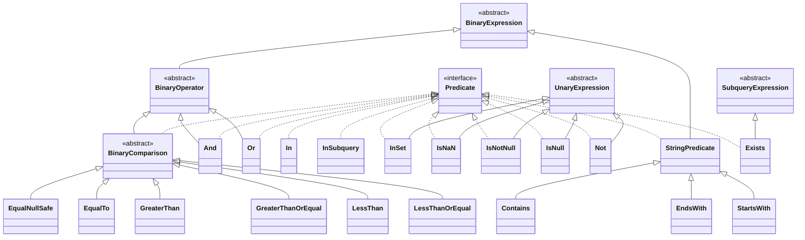

# 表达式之谓词

```Scala
/**
 *  返回布尔值的表达式。
 */
trait Predicate extends Expression {
  override def dataType: DataType = BooleanType
}
```

## 类体系



1. `Predicate` 返回布尔值的**表达式**
2. `BinaryExpression` 有**两个输入**和**一个输出**的表达式。如果任何输入的计算结果为 `null`，则默认情况下输出的计算结果为 `null`。
3. `BinaryOperator`  作为运算符的 `BinaryExpression`，具有两个属性：1  字符串表示形式是“x symbol y”，而不是 `funcName(x，y)`。2 两个输入应为**同一类型**。如果两个输入有不同的类型，分析器将找到<u>**==最紧密的公共类型==**</u>并进行适当的类型转换。

