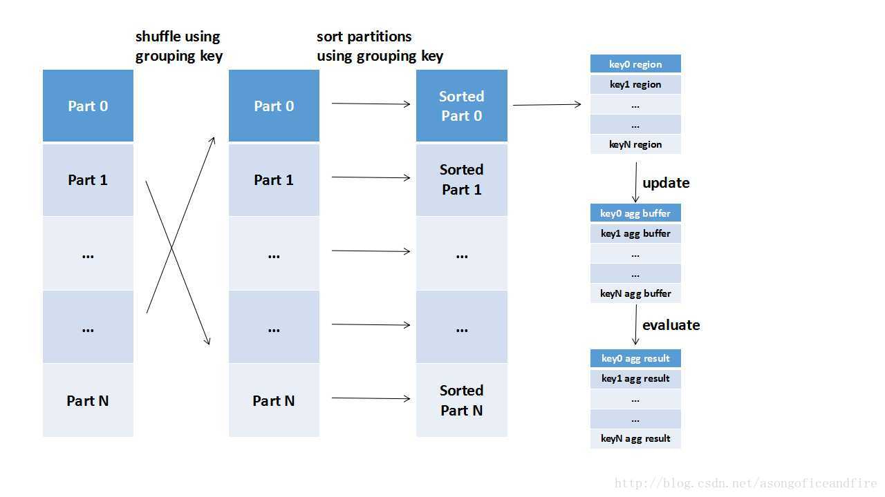
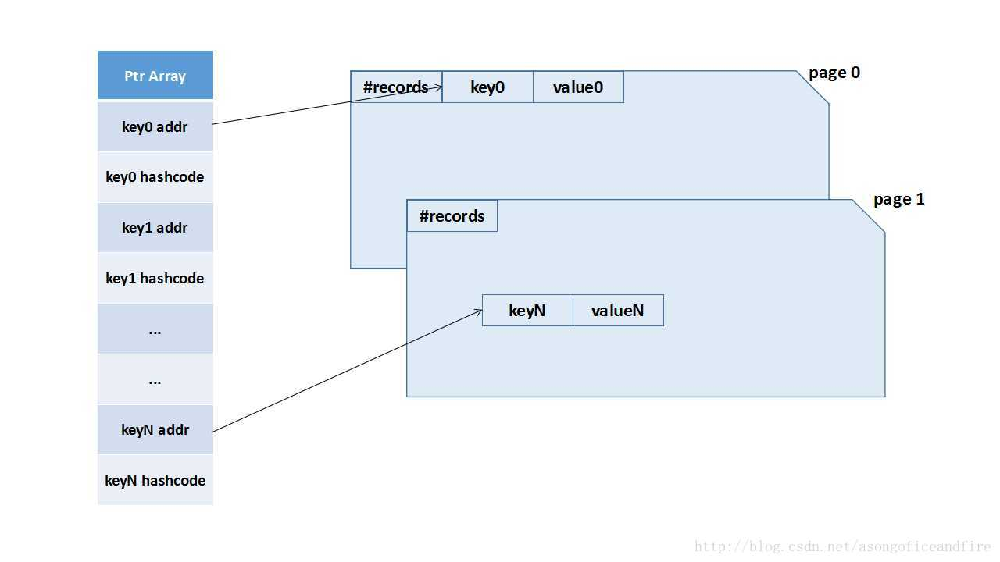
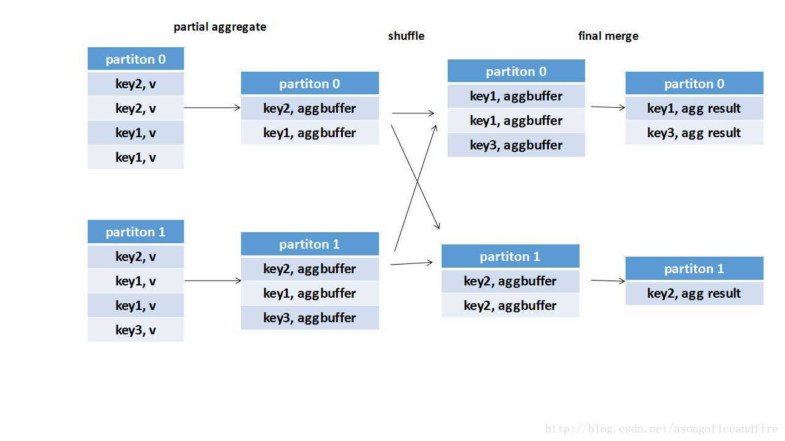

# [Spark SQL中的聚合（Aggregate）实现](https://blog.csdn.net/asongoficeandfire/article/details/69679684)

## Sort Based Aggregate

首先来说说实现比较简单（但实际执行起来却不简单）的Sort Based Aggregate。顾名思义，这是一种基于排序的聚合实现，在进行聚合之前，会根据grouping key进行分区以及分区内排序，将具有相同grouping key的记录都分布在同一个partition内且前后相邻，聚合时只需要顺序遍历整个分区内的数据，即可以得到聚合结果。如图：

途中可以看出清晰的执行流程，包括重分区和分区内排序，最后遍历每个分区，对每个key region做一个聚合，得到最终结果。

## Hash Based Aggregation
即基于Hash Map的聚合实现，一般情况下使用java的HashMap进行聚合即可，但java的内置类在使用上存在着冗余信息多、占用空间大、受GC影响的问题。故SparkSQL中实现了自己的一套HashMap，裁减掉不必要的功能，使空间利用更加充分，内存申请/释放也更有效率。

### 基于HashMap的数据聚合
这个HashMap的实现类为BytesToBytesMap，由两部分配合完成功能：存储地址和hash code的长整形数组，以及存储真实数据的一系列内存页（即Spark内存管理的基本单位）。如下图：

左边Ptr Array即保存指针的一个长整形数组，右边的内存页保存数据，当然，每条记录除了key和value之外，还保存着其他一些诸如长度等信息，此图中不详细标明。当有数据插入时，首先根据key的hash code判断Ptr Array相应的位置(keyN addr)是否已有数据填充：

1. 如果没有数据填充则在当前memory page追加一个字段，存储该key对相应的key和value值，并在Ptr Array中存储相应的地址和hash code；
2. 如果已有位置填充，则判断其hash code（存储在与keyN addr相邻的keyN hashcode中）以及key addr指向位置对应的key值是否相等，若两者均相等，则视为对本key的Aggregate Buffer的更新；
3. 若已有位置有填充且key值不相同，则视为hash值碰撞，使用基于三角数的二次探测法（关于二次探测法的更多信息，可以参考：Quadratic_probing）寻找下一个可用位置，直到取到可用位置为止。

### 聚合后的数据读取
当所有数据都处理完毕，根据数据的key值将其和相应位置的agg buffer进行聚合之后，就需要读取聚合后HashMap中所存储的内容了。

读取其实很简单，就是对memory pages逐页读取，每个page的开头都记录着本页所包含的记录总数。每个数据页读取完毕后释放本页占用的内存。每条记录读取出来之后，根据result projection生成结果记录。

### switch to sort base aggregation
正如上节所说，hash based aggregation是的后台是基于内存管理机制实现的一个HashMap，当内存不足时，HashMap无法存储更多的数据，此时就需要将记录溢出到磁盘上，用时间来交换空间。

### 溢出
溢出基于`UnsafeExternalSorter`和`UnsafeInMemorySorter`实现，是不是有些眼熟？这些实现机制和之前将的Spark SQL Join（参考：[SparkSQL中的Sort实现（二）](https://blog.csdn.net/asongoficeandfire/article/details/61668186)）是一致的，基于HashMap中的记录构建InMemSorter和ExternalSorter之后，就讲数据溢出到磁盘上，只在内存中保存溢出后的文件指针。

### 读取

此处即读取多个ExternalSorter中的记录，即读取溢出到各个磁盘上的文件中的记录。读取其实也很简单，因为各个文件中的记录都是有序的，所以可以从头开始处理文件中的记录，将属于同一个key的进行聚合，当前key的所有元素读取完毕后即可输出对应当前key的result projection。

总的来说，当内存不足时，需要借助磁盘空间来实现聚合。但溢出到磁盘面临的主要问题是从属于同一个key的记录可能被分散到不同的溢出文件中。Spark SQL使用溢出前排序，读取时顺序读取的方法很好的解决了这个问题。

### 预聚合（偏聚合）
为了减少shuffle数据量以及reduce端的压力，通常Spark SQL在map端会做一个partial aggregate（通常叫做预聚合或者偏聚合），即在shuffle前将同一分区内所属同key的记录先进行一个预结算，再将结果进行shuffle，发送到reduce端做一个汇总。如下图：

