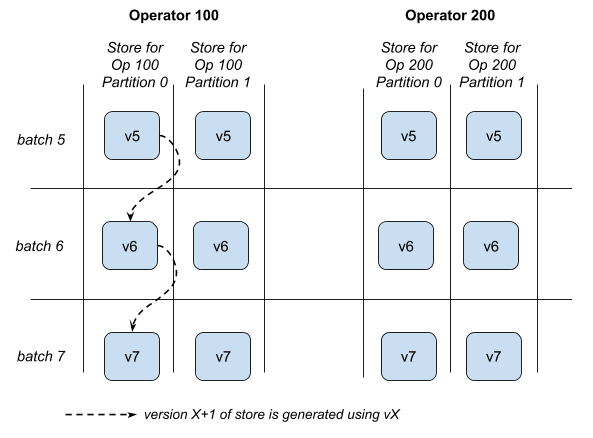

# State Store for Streaming Aggregations

## 目标

容错的**key-value**存储，能够可靠地存储**key-value**对，可用于在多个批次中，计算和持久化聚合的中间结果。

> A fault-tolerant key-value store that can reliably store key-value “Row” pairs, which can be used to compute and persist aggregates across multiple streaming batches.

## 动机

1. **流式聚合**要求以容错的方式持久化跨批次的聚合结果。此外，聚合结果需要持久保存到Spark应用程序的外部（例如HDFS，S3等容错文件系统），这样，即使Spark驱动和整个应用程序出现故障，也必须可以恢复。
2. 过去..
3. 我们建议将状态数据保存在RDD抽象之外，而不是RDD中；使用**key-value**形式的**状态存储**，每个**executor**都有一个**存储**，用于持久化**分组key**的聚合结果。每个存储将在**后端的文件系统**中管理自己的持久性，可以在不需要运行任务的情况下保存数据。

> - Streaming aggregation requires aggregates to be persisted in a fault-tolerant manner across batches. Furthermore, these aggregates need to be persisted externally to the Spark application (e.g. fault-tolerant file systems like HDFS, S3) as they must recoverable even if the Spark driver and the whole application fails. 
> - ==In past attempts (`updateStateByKey` and `mapWithState` in Spark Streaming), we have leveraged RDDs to store the state data, and RDD checkpoints to persist the data to external fault-tolerant file systems. This approach has a few drawbacks.==
>   - ==RDD checkpointing saves all the state data every time, even if only a small fraction of the data has changed since the last checkpoint. This lack of incremental checkpointing incurs a high resource usage even if the data rates and update rates are low. Ideally, only the data that have been updated should be persisted incrementally, thus allowing resources usages to scale proportional==
>   - ==The cost of full RDD checkpointing can be reduced by increasing the checkpoint interval. But that in turn increase the recovery time upon failures. This makes it hard a tradeoff to optimize.==
>   - ==RDD checkpointing needs to be done within the Spark’s jobs and tasks. This further couples of the data persistence to the constraints of tasks, that is, you have to synchronously run tasks that occupy compute slots to perform checkpointing (which is mostly I/O intensive).==
> - Instead of RDDs, we propose to save the state data outside the RDD abstraction. We propose State Store, a key-value store present in each executor for persistent keyed aggregates. RDD operations can access and update the data in the key stores. Each store will manage its own persistence in a backing file system; it can save data without the system having to run tasks. 
>

## 需求

 - **必须**能够插入和更新**key-value**键值对
 - **必须**能够获得当前所有记录的==迭代器==
 - **必须**版本化和容错
    - 每个批次的所有更新都将转换为新版本，而不会更改以前的版本。
    - 在一系列更新后提交版本后，应将其保存到后端容错存储上以**实现容错**。
    - 如果在更新新版本的过程中，任务出现故障，重启动的任务应能从旧版本中重新开始更新，最好是在同一个**executor**中（从内存缓存中恢复），或不同的**executor**（从文件中恢复）。
 - **必须**处理多个**executor**同时执行
 - **应该**给出合理的性能（设计的简单性现在更重要）。
 - 不要求
    - 稳定的数据存储格式，可兼容多个Spark版本。

> - MUST be able to insert and update key-value row pairs
> - MUST be able to get an iterator of all the present records
> - MUST be versioned and fault-tolerant
>   - All updates of a batch goes to a new version, without altering the previous version.
>   - When a version is committed after a bunch of updates, it should be persisted to a backing fault-tolerant store for fault-tolerance.
>   - If there is a failure in the task in the middle of updating new version, relaunched tasks should be able to restart updating from old version, preferably in the same executor (use in-memory cache), or in a different executor (recover from files).
> - MUST handle multiple executors handling
> - SHOULD give reasonable performance (simplicity in design more important for now).
> - NON-REQUIREMENTS
>   - Stable data format for persisting data across Spark versions.
>

## 设计

### 基本操作

1. 流式聚合将被划分为固定数量的分区。 **每个分区都有一个状态存储来处理该分区的数据**。 换句话说，每个状态存储因此用==**聚合运算符ID和分区ID**==来标识。
   
   
2. 每个状态存储都负责管理多个版本的数据，版本由自然数标识：0,1,2，...

3. 要在状态存储上执行RDD操作，需要定义新的**RDD job**，其中每个**task**将使用`StateStore`对象的方法，获取正确的==**状态存储**==（与每个分区对应），例如：
  ```scala
  val stateStoreForPartition = StateStore.get(operatorId, partitionId)
  ```
  
4. 要在==**获取的状态存储中**==修改数据，必须明确定义新版本。这可保证**状态存储**内部能正确加载老版本以便更新，例如：
  ```scala
  stateStore.newVersion(5)
  ```
  在内部，这就**确保更新**==版本4==的数据，如果版本4尚未在内存中，则必须从文件中加载它。这在后面讨论。

5. 现在完成了对新版本的更新。 但只有在显式提交之后，才算持久化了该版本。例如:
   ```scala
    stateStore.newVersion(5)
    stateStore.update(...)
    stateStore.remove(...)
    stateStore.commitVersion()   // commits the active version 5
   ```

> - Streaming aggregates will be partitioned into a fixed number of partitions. Corresponding to each partition, there will be a state store to handle the data of that partition. In other words, each state store is therefore identified with the aggregating operator id, and the partition id.
>
> 
>
> - Each state store is responsible for managing multiple versions of the data. Versions are identified by a natural numbers: 0, 1, 2, … 
>
> - To perform RDD operations on the state store, a new RDD job needs to be defined where each task will fetch the correct state store (corresponding to the partition) using StateStore object methods. E.g. 
>   ```scala
>   val stateStoreForPartition = StateStore.get(operatorId, partitionId)
>   ```
> - To update data in the retrieved state store, a new version has to be explicitly defined. This ensures that the state store internally loads the correct prior version to apply the updates on. E.g. 
>   ```scala
>   stateStore.newVersion(5)
>   ```
>   This internally makes sure that update are applied on version 4 of the data. If the version 4 is not already in memory, then it has to load it from the files. This is discussed later.
>   
> - All updates now made for the new version. But the version is made durable only after it is explicitly committed. E.g.
>     ```scala
>     stateStore.newVersion(5)
>     stateStore.update(...)
>     stateStore.remove(...)
>     stateStore.commitVersion()   // commits the active version 5
>     ```
>

### Fault-tolerance and Recovery

- 每个**状态存储**将确保**至少可恢复最后2个版本的数据**，因为由于失败而导致的重新计算最多可以引用1个早期版本。例如，当**批次5**处于活动状态时，意味着**批次4**已经完成并持久（当前的容错模型），后面的任务将永远不需要比**版本4**更早的数据。因此，维护版本4和5足以容错。
 - 对于每个状态存储，后台线程（即异步任务）将定期管理后台文件以优化恢复时间。
   - 生成快照文件以减少**有关联关系的增量文件的数量**。这可以通过直接**保存内存中最新版的数据**到快照文件中来完成。
   - 删除2个版本以前的文件，因为恢复不需要了。
 - 要加载特定版本的数据，存储可以
   - 加载相应的快照文件（如果存在），或者
   - 递归加载以前的版本，依次应用相应的增量文件，以恢复到**所需版本**。

> - Each state store will ensure that at least last 2 versions of the data is recoverable, because recomputations due to failures can refer to at most 1 of the earlier version. E.g when batch 5 is active, it means batch 4 has been completed and made durable (current fault-tolerance model), and future tasks will never require data older than version 4. So maintaining version 4 and 5 is sufficient for fault-tolerance.
> - For each state store, a background thread (i.e. asynchronous to tasks) will periodically manage the backing files to optimize recovery times.
>   - Generate Snapshot Files to reduce lineage of Delta Files. This can be simply done by taking the latest generated in-memory version of the data, and saving all the data into a Snapshot File.
>   - Delete files that are not needed for recovering version more than 2 versions older than the current one.
> - To load a particular version of data, the store can either
>   - Load it from the corresponding Snapshot File if it exists, OR
>   - Recursively load the previous version and apply the updates for the required version from the corresponding Delta File.
>

### 并发

- 假设：同一个**executor**中**不能有多个线程同时写同一个状态存储**。
   - 推测执行
 - 可以有多个**executor**在内存中加载**相同的状态存储**。因此：
   - 多个**executor**可能尝试同时管理同一个存储的文件，即创建快照和清理文件。
   - 根据推测执行是否关闭，多个**executor**可能会尝试<u>创建相同的增量文件</u>。
 - 因此，==**文件写入要同步**==，以便多个实例并发写入快照不会影响正确性。
 - 但是，如果同一存储的多个实例由于不必要地占用内存而持续浪费资源，且在尝试生成快照和清理文件时消耗资源，则效率很低。为了尽量减少这种资源浪费，**driver**中的`StateStoreCoordinator`可以尽最大努力指示**executor**卸载存储的冗余实例。请注意，不得依赖此**协调器**来确保正确性，这纯粹是一种优化。

> - Assumption: There cannot be multiple threads in the same executor attempting the write to the same state store at the same time.
>   - Speculative execution 
> - There can be multiple executors that have the same state store loaded in-memory. Therefore
>   - Multiple executors may attempt to concurrently manage files for the same store, i.e. create snapshots and clean up files.
>   - Depending on whether speculative execution is off, multiple executor may attempt to create the same delta file.
> - Therefore, writing of files needs to be done such that concurrent instance writing snapshots does not affect the correctness.
> - However, it is inefficient if multiple instances of same store continue to waste resources by unnecessarily occupying memory, and consuming resources while attempting to snapshot and cleanup. To minimize this resource waster, a **StateStoreCoordinator** in the driver can make a best-effort attempt to instruct redundant instances of the stores to be unloaded from the executors. Note that this coordinator must not be relied upon for ensuring correctness; this is purely an optimization.
>

### 调度和使用

 -  `StateStoreCoordinator`还用于跟踪每个存储的位置（即**ex ecutor**）。此信息用于为task设置其存储的首选位置。
 - 要在RDD中使用状态存储，可以通过将所有内容包装到`StateStoreRDD`中来简化操作，这需要以下输入：
    - 具有新批次数据的**RDD**，可用于更新**状态存储**中的聚合结果
    - 状态存储的新版本，典型的是**批次ID**。
    - **更新函数**
    - **协调器**，以获取存储的位置，以便根据存储的位置设置**task**的首选位置。

>
> - The **StateStoreCoordinator** is also used to keep track of the location (i.e. executor) of each store. This information used to set the preferred location of tasks using the stores.
> - To use the state store in RDD operations can be made easy by wrapping everything into a **StateStoreRDD**, which requires the following as input
>   - Other RDD having the new batch data to update the aggregates in state store
>   - New version of state store, typical batch id.
>   - Update function
>   - Coordinator, to get the location of the stores for setting preferred location of tasks based on location of the stores.
>

## Implementation
### Interfaces

下面的代码只是示意，和实际不符

```scala
case class StateStoreId(operatorId: Long, partitionId: Long)

class StateStore {
	def id: StateStoreId  // 语义上的唯一id 
  /**  
  * 将当前未提交更新的版本定义为newVersion。
  * 所有更新都基于版本newVersion-1的数据上。
  * 如果存在未提交的数据，则清除它们。
  * 
  * 如果无法加载newVersion-1的数据，throw IllegalStateException 
  */
  def newVersion(newVersion: Long): Unit
  
  // Update the value of a key in the current uncommitted version.
  def update(
    keyRow: Row, 
    updateFunc: Option[InternalRow] => InternalRow): Unit
  
  // Remove data in the current uncommitted version based on a condition. 
  def remove(condition: InternalRow => Boolean): Unit
  
  // Commit the current uncommitted version.
  def commitVersion(): Unit
  
  // Cancel the current uncommitted version, and clear temporary data.
  def cancelVersion(): Unit
  
  /** 
  * Return the data of a particular version. 
  * @throw IllegalStateException if data for version cannot be loaded. 
  */
  def getAll(): Iterator[InternalRow]
  
  def getUpdate		
}

object StateStore	{	
  // Get the state store of the particular operator and partition.	
  def get(stateStoreId: StateStoreId): StateStore
}

/**  
* Helper class for coordinating between multiple instance of state store,  
* and tracking their locations for preferred locations. 
*/
class StateStoreCoordinator {	
  def reportActiveInstance(storeId: StateStoreId, executor: String): Unit
	def verifyIfInstanceActive(storeId: StateStoreId, executor: String): Boolean
	def getLocation(storeId: StateStoreId): Option[String]
}

class  [INPUT, OUTPUT](
  otherRDD: RDD[T],
  operatorId: Long,	
  newStoreVersion: Long,
  storeUpdateFunction: (StateStore, Iterator[INPUT]) => Iterator[OUTPUT],	
  storeCoordinator: StateStoreCoordinator)    
extends RDD[OUTPUT] {
  // preferred location computed using coordinator	
  def preferredLocations(partition: Partition): Seq[String] = {	
    storeCoordinator.getLocation(
      StateStoreId(operatorId, partition.index))		
  }
	// Update store and return an iterator of the new version	
  def compute(partition: Partition, c: TaskContext): Iterator[..] = {	
    val store = StateStore.get(		
      StateStoreId(operatorId, partition.index))	
    try {  
      store.newVersion(newStoreVersion)  
      storeUpdateFunction(store, otherRDD.getOrCompute(partition,c))  
      store.commitVersion()  
      store.iterator(newStoreVersion) 
    } catch {
      store.cancelVersion()  
      // Throw again
    }
  }
}
```
### Implementation Details

- For simplicitly, each version of the data will be internally stored in a different scala HashMap or Java HashMap (not Spark’s OpenHashMap, as deletion needed). Each time a new version is defined, the data of the previous version is copied into a new map, and all subsequence updates go to the new map.
- Files of state store are saved in a directory unique to the store. **<base directory> / <operator id> / <partition id> /** The base directory could be the based on same directory as the file sink, or something else that the user configures. 
- Files are of the following format
  - Delta files: 		**<version id>.delta**		e.g. 5.delta
  - Snapshot files: 	 **<version id>.snapshot**	e.g. 5.snapshot
  - Delta file of uncommitted version:   **temp-<random>.delta  e.g. temp-123.delta**
- Data is serialized in the files using Kryo serialization.