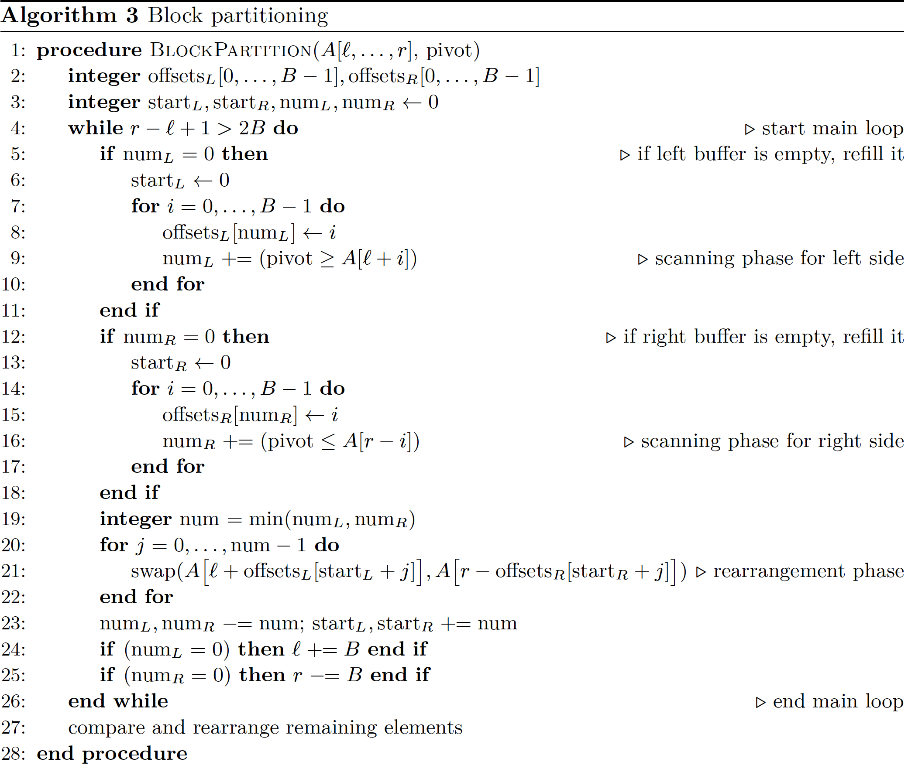

# Pattern-defeating Quicksort

**Abstract.** A new solution for the Dutch national flag problem is proposed, requiring no three-way comparisons, which gives quicksort a proper worst-case runtime of *O*(*nk*) for inputs with *k* distinct elements. This  is used together with other known and novel techniques to construct a hybrid sort that is never significantly slower than regular quicksort while speeding up drastically for many input distributions.

**==对抗模式的快速排序==**

**摘要** 提出了一种新的方案解决**荷兰国旗问题**， 无需进行三路比较，从而针对 *k* 个不同的输入元素，为**快速排序**提供了一个正确的、最坏情况下运行时间为 *O(nk)* 的算法。与其他已知的新技术一起使用，可以构建出一个永远不会比<u>普通快排</u>明显慢的混合排序，同时对于很多输入分布，会大大加快排序速度。

## 1    Introduction

Arguably the most used hybrid sorting algorithm at the time of writing is **introsort**[12]. A combination of insertion sort, heapsort[19] and quicksort[10], it is very fast and can be seen as a truly hybrid algorithm. The algorithm performs introspection and decides when to change strategy using some very simple heuristics. If the recursion depth becomes too deep, it switches to heapsort, and if the partition size becomes too small it switches to insertion sort.

The goal of pattern-defeating quicksort (or *pdqsort* ) is to improve on introsort’s heuristics to create a hybrid sorting algorithm with several desirable properties. It maintains quicksort’s logarithmic memory usage and fast^1^ average case, effectively recognizes and combats worst case behavior (deterministically), and runs in linear time for a few common patterns. It also unavoidably inherits ***in-place quicksort’s*** instability, so pdqsort can not be used in situations where stability is needed.

In section 2 we will explore a quick overview of pattern-defeating quicksort and related work, section 3 proposes our new solution for the Dutch national   flag problem and proves its *O*(*nk*) worst-case time for inputs with *k* distinct elements, section 4 describes other novel techniques used in pdqsort while section 5 describes various previously known ones. Our final section consists of an empirical performance evaluation of pdqsort.


This paper comes with an open source state of the art C++ implementation[14]. The implementation is fully compatible with std::sort and is released under a permissive license. Standard library writers are invited to evaluate and adopt the implementation as their generic unstable sorting algorithm. At the time of writing the Rust programming language has adopted pdqsort for sort unstable in their standard library thanks to a porting effort by Stjepan Glavina. The implementation is also available in the C++ Boost.Sort library.

> 1. Pattern-defeating quicksort is profiled and engineered around time spent on a modern processor. Various techniques used and described here are not optimal in terms of comparisons, but end up faster due to the complex nature of modern processor architecture (mainly cache effects).

---

撰写本文时，可以说最常用的混合排序算法是 **introsort** [12]。它结合了**插入排序**、**堆排序**[19]和**快速排序**[10]，速度非常快，可以看作是一种真正的混合算法。它使用一些非常简单的启发式方法进行自我检查、以决定何时更改策略。递归深度变得太深时，切换到堆排序；排序少量元素时，切换到插入排序。

*pdqsort* （***pattern-defeating quicksort***）的目标是改进 **introsort** 的启发式算法，以创建具有多个理想属性的混合排序算法。它保持了**quicksort** 对数使用率的内存需求，以及大多数情况下都很快^1^的性质，有效（确定性）地识别最坏情况的行为并战胜之，一些常见模式以线性时间运行。它也不可避免地继承了 ***in-place quicksort*** 的不稳定性，因此 *pdqsort* 不能用于需要稳定性的情况。

第 2 节，我们将快速概述 *pdqsort* 及相关工作，第 3 节提出了对荷兰国旗问题的新解决方案，并证明了对于有 *k* 个不同输入元素，它的最坏情况时间是 *O(nk)*，第 4 节描述了*pdqsort* 使用的其他新技术，第 5 节描述了各种已知的技术。最后一部分是对 *pdqsort* 的性能实测。

本文附带了最新的开源 C++ 实现[14]。该实现与 `std::sort` 完全兼容，根据许可授权发布。欢迎标准库作者评估并采用该实现作为其通用的不稳定排序算法。 编写本文时，由于 Stjepan Glavina 的移植工作，Rust 编程语言已采用 *pdqsort*用作其标准库中不稳定排序的实现。**<u>C++ Boost.Sort</u>** 库中也提供了该实现。

> 1. *pdqsort* 是围绕现代处理器结构进行分析和设计的。这里使用和描述的各种技术比较而言并非最佳，但由于现代处理器体系结构的复杂性（主要是缓存效果），最终的速度更快。

## 2    Overview and related work

Pattern-defeating quicksort is a hybrid sort consisting of quicksort[10], insertion sort and a fallback sort. In this paper we use heapsort as our fallback sort, but really any *O(nlogn)* worst case sort can be used - it’s exceptionally rare that the heuristics end up switching to the fallback. Each recursive call of pdqsort chooses either to fall back, use insertion sort or partition and recurse.

Insertion sort is used for small recursive calls as despite its *O(n^2^)*  worst case it has great constant factors and outperforms quicksort for small *n*. We later discuss (not novel but nevertheless important) techniques to properly implement insertion sort for usage in a hybrid algorithm. We have tried to use small sorting networks akin to Codish’s[5] approach as an alternative base case but were unable to beat insertion sort. We conjecture that the small code size of insertion sort  has sufficient positive cache effects to offset the slower algorithm when used in a hybrid sort.

For partitioning we use a novel scheme that indirectly ends up performing <u>==tripartite partitioning==</u>. This is used in conjunction with the very important technique from BlockQuicksort[7] that greatly speeds up partitioning with branchless comparison functions. In a sense our partitioning scheme is similar to Yaroslavskiy’s dual-pivot quicksort[18] <u>from the perspective of equal elements</u>. We did consider dual- and multi-pivot[2] variants of quicksort but chose to stick to traditional partitioning for simplicity, applicability of the techniques described here, and due to the massive speedup from BlockQuicksort, which does not trivially extend to multiple pivots (see IPS^4^o[3] for that).

We use the well-known median-of-3 pivot selection scheme, with John Tukey’s ninther[17] for sufficiently large inputs, which Kurosawa[11] finds has a near- identical number of comparisons to selecting the true median, but is significantly simpler.

Finally, we <u>**==beat patterns==**</u> with two novel additions. We diverge from introsort by no longer simply using the call depth to switch to a fallback. Instead we define a concept of a bad partition, and track those instead. This results in a more precise heuristic on bad sorting behavior, and consequently fallback usage. Whenever we detect a bad partition we also swap a couple well-selected elements, which not only breaks up common patterns and introduces ’noise’ similar to how a random quicksort would behave, it introduces new pivot candidates in the selection pool. We also use a technique (not known to us in previous literature) due to Howard Hinnant to optimistically handle ascending/descending sequences with very little overhead.

----
*pdqsort* 是一种混合排序，由快速排序[10]、插入排序和**后备排序**组成。本文使用**堆排序**作为后备排序，实际上最坏情况为 *O(nlogn)*  的排序都可以使用，启发式方法最终切换到后备排序将极为罕见。每次递归调用 *pdqsort*，要么选择回退，要么使用插入排序，要么分区后再递归。

插入排序用于小的递归调用，尽管最坏情况是 *O(n^2^)* ，但它有很好的常量因子，*n*  较小时优于快速排序。我们稍后将讨论在混合算法中正确实现**插入排序**的技术（不是新技术，但很重要）。<u>我们曾尝试使用类似于 Codish 方法[5]的小型排序网络作为替代的基本情况</u>，但无法击败插入排序。估计是插入排序的代码比较小，有足够的正缓存效应，抵消混合排序中较慢算法带来的影响。

我们使用一种新颖的划分方案，间接执行[三路划分](https://blog.csdn.net/jlqCloud/article/details/46939703)。与 BlockQuicksort[7] 中非常重要的技术结合使用，极大地加快了无分支比较函数的划分速度。在某种意义上，<u>从相等元素的角度来看</u>，我们的划分方案类似于 Yaroslavskiy 的双支点快速排序[18]。我们的确考虑过快速排序的双支点和多支点的变体[2]，但最终选择传统的划分方案是为了简化此处所述技术的适用性，并且由于 BlockQuicksort 的巨大提速，它并未轻易扩展到多支点（参见IPS^4^o[3]）。

我们使用众所周知的<u>**三数取中法**</u>选择**支点值**，对于足够大的输入采用 [John Tukey 的**<u>中位数的中位数</u>**](https://blog.csdn.net/mianshui1105/article/details/52691711)来选择**支点值**，Kurosawa [11]发现，与选择真实中位数相比，比较次数几乎相同，但要简单得多。

<u>==最后，在两个新颖的补充下，我们击败了模式==</u>。与 **introsort** 不同，我们不再简单地通过调用深度来切换到**后备排序**。而是定义了<u>坏分区的概念</u>，并跟踪它们。这样就可以更精确地发现不好地排序行为，从而回退到**后备排序**。每当我们检测到坏分区时，我们也会交换一些精心挑选的元素，这不仅会破坏常见的模式，而且会引入类似于随机快速排序的“噪声”，还会在选择池中引入新**支点值**的候选对象。我们还使用了 Howard Hinnant 提出的一种技术（在不为我们所知的文献中），以很少的开销乐观地处理升序和降序的序列。

## 3    A faster solution for the Dutch national flag problem

 

A naive quicksort implementation might trigger the *Θ*(*n^2^*) worst case on the all-equal input distribution by placing equal comparing elements in the same partition. A smarter implementation either always or never swaps equal elements, resulting in average case performance as equal elements will be distributed evenly across the partitions. However, an input with many equal comparing elements is rather common^2^, and we can do better. Handling equal elements efficiently requires tripartite partitioning, which is equivalent to Dijkstra’s Dutch national flag problem[6].

> 2. It is a common technique to define a custom comparison function that only uses a subset of the available data to sort on, e.g. sorting cars by their color. Then you have many elements that aren’t fundamentally equal, but do compare equal in the context of a sorting operation.

Pattern-defeating quicksort uses the fast ’approaching pointers’ method[4] for partitioning. Two indices are initialized, *i* at the start and *j* at the end of the sequence. *i* is incremented and *j* is decremented while maintaining an invariant, and when both invariants are invalidated the elements at the pointers are swapped, restoring the invariant. The algorithm ends when the pointers cross. Implementers must take great care, as this algorithm is conceptually simple, but is very easy to get wrong.

> TODO:
>
> 1. 图 一 Bentley-McIlroy 使用的不变式。分区后，将存储在开头和结尾处的相等元素交换到中间
>
> 2. Fig. 2. The invariant used by partition right of pdqsort, shown at respectively the initial, halfway and nished state. When the loop is done the pivot gets swapped into its correct position. p is the single pivot element. r is the pointer returned by the partition routine indicating the pivot position. The dotted lines indicate how i and j change as the algorithm progresses. This is a simplied representation, e.g. i is actually o by one.

Bentley and McIlroy describe an invariant for partitioning that swaps equal elements to the edges of the partition, and swaps them back into the middle after partitioning. This is efficient when there are many equal elements, but has a significant drawback. Every element needs to be explicitly checked for equality to the pivot before swapping, costing another comparison. This happens regardless of whether there are many equal elements, cost- ing performance in the average case.

Unlike previous algorithms, pdqsort’s partitioning scheme is not self contained. It uses two separate partition functions, one that groups elements equal to the pivot in the left partition (`partition_left`), and one that groups elements equal to the pivot in the right partition (`partition_right`). Note that both partition functions can always be implemented using a single comparison per element as $a<b \Leftrightarrow a \ngeqslant b$ and $a \nless b \Leftrightarrow a \geqslant b$.

For brevity we will be using a simplified, incomplete C++ implementation to illustrate pdqsort. It only supports int and compares using comparison operators. It is however trivial to extend this to arbitrary types and custom comparator functions. To pass subsequences^3^ around, the C++ convention is used of one pointer at the start, and one pointer at one-past-the-end. For the exact details refer to the full implementation[14].

> 3. Without exception, in this paper subsequences are assumed to be contiguous.

Both partition functions assume the pivot is the first element, and that it has been selected as a median of at least three elements in the subsequence. This saves a bound check in the first iteration.

Given a subsequence *α* let us partition it using `partition_right` using pivot *p*. We then inspect the right partition, calling its first element *q* and the remaining subsequence of elements *β*:

> TODO: 图x

If *p != q* we have *q > p*, and apply `partition_right` on *q*, *β*. Rename *q*, *β* to be the left  partition of  this operation (marked as *q^j^*, *β^j^* in the diagram  to emphasize renaming). The right partition is marked as ’*>*’, because in this process we have the perspective of pivot *p*, but it’s definitely possible for elements equal to *q* to be in the partition marked ’*>*’.

> TODO: 图y

We apply the above step recursively as long as *p = q*. If at some point *q*, *β* becomes empty, we can conclude there were no elements equal to *p* and the tripartite partitioning was done when we initially partitioned *α*. Otherwise, consider *p* = *q*. We know that  $\forall x\in β : x \geqslant p$, thus $\nexists x\in β : x < q$. If we were to partition *q, β* using `partition_left`, any element smaller than or equal to *q* would be partitioned left. However, we just concluded that *β* can not contain elements smaller than *q*. Thus, *β*’s left partition only contains elements equal to *q* (and thus equal to *p*), and its right partition only contains elements bigger than *q*:

> TODO: 图z

This leads to the partitioning algorithm used by pdqsort. The *predecessor* of a subsequence is the element directly preceding it in the original sequence. A subsequence that is *leftmost* has no predecessor. If a subsequence has a predecessor *p* that compares equal to the chosen pivot *q*, apply `partition_left`, otherwise apply `partition_right`. No recursion on the left partition of `partition_left` is needed, as it contains only equivalent elements.

---

在同一分区中放置相等的元素（比较函数返回相等），简单实现的快速排序可能会触发全等输入分布上的最坏情况 *Θ*(*n^2^*)。更聪明的实现要么总是交换相等的元素，要么从不交换相等的元素，因为相等的元素将均匀地分布在分区中，从而可以实现平均情况下的性能。但是相等元素比较多的输入相当常见^2^，我们应该能做得更好。高效处理相等元素需要三方划分，这相当于 Dijkstra 的荷兰国旗问题[6]。

> 2. 定义自定义比较功能的一种常见技术是只使用可用数据的子集进行排序，例如按颜色对汽车进行排序。然后，您有许多元素本质上并不相等，但是在排序操作的上下文中的确相等。

*pdqsort* 使用快速接近的指针[4]进行划分。初始化两个索引，*i* 在序列头，*j* 在序列尾。在维持不变式的情况下，*i* 递增，*j* 递减，当两个不变式失效时，交换指针处的元素，以恢复不变式。当指针交叉时，算法结束。实现者必须非常小心，这个算法在概念上很简单，但是很容易出错。

> Bentley-McIlroy 的算法如下 :
>
> ```C
> void qsort3(l, u) {
>     if (l >= u) 
>        return;
>     t = x[l]; i = l; j = u+1;
>     while (1) {
>        do { i++; } while ( i<=u && x[i] < t ); // 不变式 1
>        do { j--; } while ( x[j] > t );         // 不变式 2
>        if (i > j) 
>            break;
>        swap(i, j);
>     }
>     swap(l, j);
>     qsort3(l, j-1);
>     qsort3(j+1, u);
> }
> ```

Bentley 和 McIlroy 描述了一种分区不变式，将相等的元素交换到分区的边缘，并在分区后将它们交换回中间。在相等元素比较多时很有效，但有个明显缺点，在交换之前，需要显式检查每个元素与支点值是否相等，这会花费另一次比较。不管是否有很多相等的元素，都会发生这种情况，这在平均情况下会降低性能。

*pdqsort* 的划分方案与以前的算法不同，不是自包含的。它使用两个独立的划分函数，`partition_left ` 将与支点值相等的元素划分到左分区，`partition_right` 将与支点值相等的元素划分到右分区。注意，两个划分函数都通过<u>**元素的单个比较函数**</u>来实现，因为 $a<b \Leftrightarrow a \ngeqslant b$ 和 $a \nless b \Leftrightarrow a \geqslant b$。

为了简洁起见，我们将使用一个简化的、不完整的 C++ 实现来说明 *pdqsort*。它只支持 `int`，使用比较运算符进行比较。然而，将其扩展到支持任意类型和自定义比较器函数很简单。若要传递子序列^3^，则使用 C++ 约定：使用两个指针，指向第一个元素的指针和指向最后一个元素的下一个元素的指针。有关详细信息，请参阅完整实现[14]。

> 3. 无一例外，本文假定子序列是连续的。

两个划分函数均假定第一个元素为支点元素，并且已经在子序列中应用了<u>**三数取中法**</u>。这会节省第一次迭代时的边界检查。

给定一个子序列 *α*，使用 `partition_right` 基于支点 *p* 对其进行划分。我们然后检查右分区，<u>第一个元素称之为 *q* ，剩余子序列称之为 *β*</u>：

> TODO: 图x

如果 *p != q* ，则 *q > p*，在 *q* ，*β* 上应用 `partition_right`。将 *q* ，*β* 重命名为这次操作的左分区（在图中标记为 *q'*， *β'* 以强调重命名）。右分区被标记为 ’*>*’，因为在这个过程中，我们从 *p* 的角度观察，等于 *q* 的元素肯定有可能位于标记为 ’*>*’ 的分区中。

> TODO: 图y

只要 *p != q*，就递归应用上述步骤。如果在某个时刻 *q*，*β* 变为空，可以得出结论没有元素等于 *p*，我们最初对 *α* 的三方划分完成。否则考虑 *p = q*，我们知道 $\forall x\in β : x \geqslant p$，那么 $\nexists x\in β : x < q$，此时对 *q*，*β* 用 `partition_left` 进行划分，所有小于或等于 *q* 的元素都将在<u>**==左分区==**</u>。但我们刚刚得出结论，*β* 不包含小于 *q* 的元素，所以 *β* 的左分区只包含等于 *q* 的元素（因此等于 *p*），而它的右分区只包含大于 *q* 的元素：

> TODO: 图z

这就引出了 *pdqsort* 使用的分区算法。子序列的<u>前置</u>是原始序列中紧接其前的元素。**==最左子序列==**没有前置序列。如果子序列前置 *p* 与所选支点 *q* 相等，则应用 `partition_left`，否则应用 `partition_right`。无需对 `partition_left` 的左分区进行递归，因为它仅包含相等（等价）的元素。

### 3.1 *An O(nk) worst case of pdqsort with k distinct elements*

**Lemma 1.** *Any predecessor of a subsequence*^4^ *was the pivot of an ancestor.*

> 4. Assuming only those subsequences that are passed into recursive calls of *pdqsort*.

*Proof.* If the subsequence is a direct right child of its parent partition, its predecessor is the pivot of the parent. However, if the subsequence is the left child of its parent partition, its predecessor is the predecessor of its parent. Since our lemma states that our subsequence has a predecessor, it is not leftmost and there must exist some ancestor of which the subsequence is a right child.

**Lemma 2**. *The first time a distinct value <u>v</u> is selected as a pivot, it can’t be equal to its predecessor.*

*Proof.* Assume *v* is equal to its predecessor. By Lemma 1 this predecessor was the pivot of an ancestor partition. This is a contradiction, thus *v* is not equal to its predecessor.

**Corollary 1.** *The first time v is selected as a pivot, it is always used to partition with `partition_right`, and all elements x such that x = v end up in the right partition*.

**Lemma 3.** *Until an element equal to* *v* *is selected as a pivot again, for all* *x comparing equal to v, x must be in the partition directly to the right of v.*

*Proof*. By Corollary 1, *x* can not be in a partition to the left of *v* and thus any other partitions with pivot *w < v* are irrelevant. There also can’t be a partition with pivot *w > v* that puts any *x* equal to *v* in its right partition, as this would imply *x ≥ w > v*, a contradiction. So any elements *x = v* stay in a partition directly to the right of *v*.

**Lemma 4**. *The second time a value equal to v is selected as a pivot, all x = v are in the correct position and are not recursed upon any further*.

*Proof.* The second time another element *x* = *v* is selected as a pivot, Lemma 3 shows that *v* must be its predecessor, and thus it is used to partition with `partition_left`. In this partitioning step all elements equal to *x* (and thus equal to *v*) end up in the left partition, and are not further recursed upon. Lemma 3 also provides the conclusion we have just finished processing **all** elements equal to *v* passed to pdqsort.

**Theorem 1**. *pdqsort has complexity O(nk) when the input distribution has k distinct values*.^5^

> 5. Note that this is an upper bound. When *k* is big *O*(*n* log *n*) still applies.

*Proof.* Lemma 4 proves that every distinct value can be selected as a pivot at most twice, after which every element equal to that value is sorted correctly. Each partition operation has complexity *O*(*n*). The worst-case runtime is thus *O*(*nk*).

---

**引理 1**。<u>任何子序列的前置^4^都是其祖先的支点</u>。

> 4. 假设只考虑哪些用于 *pdqsort* 递归调用的子序列。

**证明**。如果子序列是其父分区的直接右子序列，则其前置是父分区的支点。但是如果子序列是其父分区的左子序列，则其前置是其父分区的前置。因为我们的引理指出我们的子序列有一个前置，所以它不是最左子序列，并且一定是某个祖先的右子序列。

> 注：最左子序列不存在前置

**引理 2**。<u>首次选择一个不同的值 *v* 作为 支点，它不能等于其前置</u>。

**证明**。假设 *v* 等于其前置。根据引理 1，该前置是祖先分区的支点。 这产生了矛盾，因此 *v* 不等于其前置。

**推论 1**。第一次选择 *v* 作为支点时，总是用 `partition_right` 作为划分函数，并且所有等于 *v* 的元素 *x* 最后都位于右分区。

**引理 3**。<u>直到再次选择等于 *v* 的元素作为支点，对于所有等于 *v* 的元素 *x*，肯定位于 *v* 的直接右分区中</u>。

**证明**。根据推论 1，*x* 不能在 *v* 的左分区中，因此所有支点 *w < v* 的其它分区都是不相关的。也不能有一个支点为 *w >v* 的分区，在其右分区中放置任何等于 *v* 的 *x*，因为这意味着 *x ≥ w > v*，这是一个矛盾。 因此，任何元素 *x = v* 都直接位于 *v* 的右分区中。

**引理 4**。第二次选择等于 *v* 的值作为支点时，所有等于 *v* 的元素 *x* 都位于正确的位置，并不再递归。

**证明**。第二次选择另一个等于 *v* 的元素 *x* 作为支点时，引理 3 表明 *v* 必须是它的前置，因此使用 `partition_left` 来划分分区。在这个划分步骤中，所有等于 *x*（因此等于 *v*）的元素最终都将位于左分区中，所以不用再次递归。引理 3 还提供了一个结论，我们已完成**所有**等于 *v* 的元素的处理。

**<u>==定理 1==</u>**。<u>当输入分布有 *k* 个不同值时，*pdqsort* 的复杂度为 *O(nk)*</u>^5^。

> 5. 

**证明**。引理 4 证明，每个不同的值最多可以选择被两次作为支点，此后，等于该值的每个元素都将正确排序。每次划分操作的复杂度为 *O(n)*。 因此，最坏的运行复杂度是 *O(nk)*

## 4   Other novel techniques

### 4.1    Preventing quicksort’s *O(n^2^)* worst case

Pattern-defeating quicksort calls any partition operation which is more unbalanced than *p* (where *p* is the percentile of the pivot, e.g. 1/2 for a perfect partition) a *bad* *partition*. Initially, it sets a counter to log *n*. Every time it encounters a bad partition, it decrements the counter before recursing^6^. If at the start of a recursive call the counter is 0 it uses heapsort to sort this subsequence, rather than quicksort.

> 6. This counter is maintained separately in every subtree of the call graph - it is  not a global to the sort process. Thus, if after the first partition the left partition degenerates in the worst case it does not imply the right partition also does.

**Lemma 5**. *At most O(n log n) time is spent in `pdqsort` on bad partitions*.

*Proof*. Due to the counter ticking down, after log *n* levels that contain a bad partition the call tree terminates in heapsort. At each level we may do at most *O(n)* work, giving a runtime of *O(n log n)*.

**Lemma 6**. *At most O(n log n) time is spent in `pdqsort` on good partitions*. 

*Proof*.  Consider a scenario where quicksort’s partition operation always puts *pn* elements in the left partition, and *(1 - p)n* in the right. This consistently forms the worst possible good partition. Its runtime can be described with the following recurrence relation:

*T (n, p) = n + T (pn, p) + T ((1 − p)n, p)*

For any *p ∈ (0, 1)* the Akra-Bazzi[1] theorem shows *Θ(T (n, p)) = Θ(n log n)*.

**Theorem 2**. *Pattern-defeating quicksort has complexity O(n log n)*.

*Proof*. Pattern-defeating quicksort spends *O(n log n)* time on good partitions, bad partitions, and degenerate cases (due to heapsort also being *O(n log n)*). These three cases exhaustively enumerate any recursive call to pdqsort, thus pattern-defeating quicksort has complexity *O(n log n)*.

We have proven that for any choice of *p ∈ (0, 1)* the complexity of pattern-defeating quicksort is *O(n log n)*. However, this does not tell use what a good choice for *p* is.

Yuval Filmus[8] solves above recurrence, allowing us to study the slowdown of quicksort compared to the optimal case of *p* = 1/2 . He finds that the solution is

$\displaystyle \lim_{x \,\rightarrow\, \infty} \frac {T(n,p)} {T(n, \frac 1 2)} = \frac 1 {H(p)}$

where *H* is Shannon’s binary entropy function:

*H*(*p*) = −*p* log~2~(*p*) − (1 − *p*) log~2~(1 − *p*)

Plotting this function gives us a look at quicksort’s fundamental performance characteristics:

> TODO: **Fig. 4**. Slowdown of *T(n, p)* compared to *T(n, 1/2)*. This beautifully shows why quicksort is generally so fast. Even if every partition is split 80/20, we’re still running only 40% slower than the ideal case.

From benchmarks we’ve found that heapsort is roughly about twice as slow as quicksort for sorting randomly shuffled data. If we then choose *p* such that *H(p)^−1^ = 2* a bad partition becomes roughly synonymous with ‘worse than heapsort’.

The advantage of this scheme is that *p* can be tweaked if the architecture changes, or you have a different worst-case sorting algorithm instead of heapsort. 

We have chosen *p = 0.125* as the cutoff value for bad partitions for two reasons:  it’s reasonably close to being twice as slow as the average sorting operation and it can be computed using a simple bitshift on any platform.

Using this scheme as opposed to `introsort`’s static <u>**logarithmic recursive call limit**</u> for preventing the worst case is more precise. While testing we noticed that `introsort` (and to a lesser extent pdqsort) often have a rough start while sorting an input with a bad pattern, but after some partitions the pattern is **<u>==broken up==</u>**. Our scheme then procedes to use the now fast quicksort for the rest of the sorting whereas introsort too heavily weighs the bad start and degenerates to heapsort.

*pdqsort* 把比 *p* （其中 *p* 是支点的百分位数，例如 1/2 表示完美分区）更不平衡的划分视为<u>**坏分区**</u>。计数器从  log *n* 开始，每遇到一个坏分区，在递归之前先递减计数器^6^。如果计数器在递归调用之前变为 0，则 `quicksort` 退化为 `heapsort` 。

> 6. 该计数器在调用栈的每个子树中单独维护 - 它不是排序过程的全局变量。因此，如果在第一次划分之后，左分区因为遇到最坏的情况而退化（为 `heapsort`），这并不意味着右分区也会退化。

**引理 5**。<u>坏分区上的 `pdqsort` 最多花费 *O(n log n)* 的时间</u>

**证明**。由于计数器不断减少，经过 *log~2~n* 层坏分区后，调用栈将以堆排序结束。每层的复杂度最多是 *O(n)*，因此整体运行时间为 *O(n log n)*。

**引理 6**。<u>好分区上的 `pdqsort` 最多花费 *O(n log n)* 的时间</u>

**证明**。考虑这样一中场景：快排的划分操作总是将 *pn* 个元素放在左分区，*(1 - p)n* 个元素放在右分区。这就形成了好分区的最坏情况。其运行时间可用以下递归关系来描述：

<u>***T (n, p) = n + T (pn, p) + T ((1 − p)n, p)***</u>

对于任意 *p ∈ (0, 1)*，Akra-Bazzi [1]定理表明 *Θ(T (n, p)) = Θ(n log n)*。

> 公式推导见算法导论

**<u>==定理 2==</u>**。***Pattern-defeating quicksort* 的复杂度是 *O(n log n)***。

**证明**。*Pattern-defeating quicksort* 在好分区、坏分区和退化情况上花费 *O(n log n)* （堆排序也是 *O(n log n)* ）的时间。这三种情况详尽地枚举了所有对 `pdqsort` 的递归调用，因此， *Pattern-defeating quicksort* 的复杂度为 *O(n log n)*。

我们已经证明，对于 *p ∈ (0, 1)* 的任何值，*Pattern-defeating quicksort* 的复杂度都是 *O(n log n)*。 但是，这并没有告诉我们 *p* 的好选择是什么。

Yuval Filmus[[8](https://cs.stackexchange.com/questions/31928/solving-recurrence-relation-with-two-recursive-calls/31930#31930)]<u>==解决了上述递归问题==</u>，使我们能够研究快速排序相对于最佳情况 *p*=1/2 的减速。他发现<u>==解决办法==</u>是

$\displaystyle \lim_{x \,\rightarrow\, \infty} \frac {T(n,p)} {T(n, \frac 1 2)} = \frac 1 {H(p)}$

其中 *H* 是 Shannon （香农）的二进制熵函数：

*H*(*p*) = −*p* log~2~(*p*) − (1 − *p*) log~2~(1 − *p*)

绘制此函数可以让我们了解快速排序的基本性能特征：

> TODO: **Fig. 4.** 与 *T(n, 1/2)* 相比，*T(n, p)* 慢的倍数。这很好地说明了为什么快速排序通常这么快。即使将每次分区按 80/20 划分，运行速度也只比理想情况下慢40％。
>

根据基准测试，对于随机混洗的数据，堆排序大约比快速排序慢两倍。选择 *p*，使得 *H(p)^−1^ = 2*，则坏分区上的快速排序将大致等同于**堆排序**。

选择 *p = 0.125* 为坏分区的截止值有两个原因：它大约比排序操作平均慢两倍，在任何平台上可以使用简单的位移来计算。

与 `introsort` 静态的<u>**==对数递归调用==**</u>限制相比，使用此方案可以更精确地防止最坏情况的发生。我们在测试过程中注意到，在对具有错误模式的输入进行排序时，`introsort`（以及在较小程度上， `pdqsort`）通常会有一个粗糙的开始，但是在进行一些分区之后，模式就<u>**==被分解了==**</u>。我们的方案继续使用快排进行剩余的排序，而 `introsort` 过于沉重地衡量了糟糕的开始，并退化为堆排序。

### 4.2    Introducing fresh pivot candidates on bad partitions

Some input patterns form some self-similar structure after partitioning. This can cause a similar pivot to be repeatedly chosen. We want to eliminate this. The reason for this can be found in Figure 4 as well. The difference between a good and mediocre pivot is small, so repeatedly choosing a good pivot has a relatively small payoff. The difference between a mediocre and bad pivot is massive. An extreme example is the traditional *O(n^2^)* worst case: repeatedly partitioning without real progress.

The classical way to deal with this is by randomizing pivot selection (also known as randomized quicksort). However, this has multiple disadvantages. Sorting is not deterministic, the access patterns are unpredictable and extra runtime is required to generate random numbers. We also destroy beneficial patterns, e.g. the technique in section 5.2 would no longer work for <u>**descending patterns**</u> and performance on ’mostly sorted’ input patterns would also degrade. 

Pattern-defeating quicksort takes a different approach. After partitioning we check if the partition was *bad*. If it was, we swap our pivot candidates for others. In our implementation *pdqsort* chooses the median of the first, middle and last element in a subsequence as the pivot, and swaps the first and last candidate for ones found at the 25% and 75% percentile after encountering a bad partition. When our partition is big enough that we would be using Tukey’s ninther for pivot selection we also swap the ninther candidates for ones at roughly the 25% and 75% percentile of the partition.

With this scheme pattern-defeating quicksort is still fully deterministic, and with minimal overhead breaks up many of the patterns that regular quicksort struggles with. If the downsides of non-determinism do not scare you and you like the guarantees that randomized quicksort provides (e.g. protection against DoS attacks) you can also swap out the pivot candidates with random candidates. It’s still a good idea to *only* do this after a bad partition to prevent breaking up beneficial patterns.

某些输入模式在分区后形成一些自相似的结构。这可能会导致重复选择相似的支点。我们要消除这一点。 其原因也可以在图4中找到。好的和中等的支点之间的差异很小，因此反复选择一个好的支点具有相对较小的收益。平庸和糟糕的支点之间的差异是巨大。 一个极端的例子是传统的 *O(n^2^)* 最坏的情况：重复划分而没有实际进展。

解决此问题的经典方法是随机选择支点（也称为随机化快速排序）。但有多个缺点：排序不是确定性的，访问模式不可预测，且需要额外的运行时才能生成随机数。还会破坏某些好的输入模式，例如，第 5.2 节中的技术不再适用于<u>**==降序模式==**</u>，也会降低排序“大多数输入已有序”的性能。

*Pattern-defeating quicksort* 采用了不同的方法。分区后，检查是否为**坏分区**。如果是的话，我们会将更换支点。在我们的实现中，*pdqsort* 选择子序列中<u>第一个</u>，<u>中间</u>和<u>最后一个</u>元素的中位数作为支点，并在遇到坏分区后将第一个和最后一个候选元素交换为  25％ 和 75％ 位置处的元素。当分区足够大时，我们将使用 Tukey 的中位数的中位数方法来选择支点，我们也会将 9 个支点候选的位置交换为分区大约  25％ 和  75％ 处的元素。

在这个方案中，*Pattern-defeating quicksort*  仍然是完全确定的，并且以最小的开销打破了常规快速排序所面临的许多模式。如果不确定性的缺点没有吓到你，并且你喜欢随机快速排序提供的保证（例如，防止 DoS 攻击），你也可以用随机的方式来选择替换的支点。**==只==**在发现坏分区之后再这样做仍是个好主意，以防止破坏有益的模式。

## 5    Previously known techniques

### 5.1    Insertion sort

Essentially all optimized quicksort implementations switch to a different algorithm when recursing on a small (  ≤ 16–32 elements) subsequence, most often insertion sort. But even the simple insertion sort is subject to optimization, as a significant amount of time is spent in this phase.  

It’s important to use a series of moves instead of swaps, as this eliminates a lot of unnecessary shuffling. Another big^7^ improvement can be made by eliminating bounds checking in the inner insertion sort loop. This can be done for any subsequence that is not leftmost, as there must exist some element before the subsequence you’re sorting that acts as a sentinel breaking the loop. Although this change is tiny, for optimal performance this requires an entirely new function as switching behavior based on a condition defeats the purpose of this micro-optimization. This variant is traditionally[13] called `unguarded_insertion_sort`. This is a prime example where introducing more element comparisons can still result in faster code.

> 7. 5-15% from our benchmarks, for sorting small integers.

基本上，所有优化的快速排序实现在小子序列上递归时（≤16–32个元素）都会切换到不同的算法，通常是**<u>==插入排序==</u>**。但是即使是简单的插入排序也要优化，因为在这个阶段花费了大量的时间。

重要的是使用一系列**==移动==**而不是**==交换==**，因为这样可以消除很多不必要的 <u>**shuffle**</u>。消除插入排序内部循环中的边界检查，是另一大改进^7^。可以对所有不是最左端的子序列执行此操作，因为此时在排序的子序列之前肯定存在一些元素，可作为中断循环的标记。尽管变化很小，但为了获得最佳性能，需要一个全新的函数，因为基于条件的切换行为会破坏这种微观优化。 传统上将此变体[13]称为 `unguarded_insertion_sort` 。这是一个很好的例子，引入更多的元素比较仍然可以提高代码速度。

> 7. 根据我们的基准测试，对小整数进行排序有 5-15% 的提高

### 5.2    Optimistic insertion sorting on a swapless partition

This technique is not novel, and is due to Howard Hinnants[9] `std::sort` implementation, but has to our knowledge not been described in literature before. After partitioning we can check whether the partition was *swapless*. This means we didn’t have to swap any element (other than putting the pivot in its proper place). Checking for this condition can be done with a single comparison as shown in Figure 3 with the variable `no_swaps`.

If this is the case and the partition wasn’t *bad* we do a partial insertion  sort over both partitions that aborts if it has to do more than a tiny number of corrections (to minimize overhead in the case of a misdiagnosed best case). However, if little to no corrections were necessary, we are instantly done and do not have to recurse.

If you properly choose your pivots^8^ then this small optimistic heuristic will sort inputs that are ascending, descending or ascending with an arbitrary element appended all in linear time. We argue that these input distributions are vastly overrepresented in the domain of inputs to sorting functions, and are well worth the miniscule overhead caused by false positives.

> 8. Frankly, this can be a bit fragile. Check the pdqsort source code for the exact procedure used to select pivots, and you notice we actually sort the pivot candidates and put the median one at the start position, which gets swapped back to the middle in the event of a swapless partition. A small deviation from the reference implementation here might lose you the linear time guarantee.

This overhead really is miniscule, as swapless partitions become exceedingly unlikely for large arrays to happen by chance. A hostile attacker crafting worst-case inputs is also no better off. The maximum overhead per partition is ≈ *n* operations, so it doubles performance at worst, but this can already be done to pdqsort by crafting a worst case that degenerates to `heapsort`. Additionally, the partial insertion sort is only triggered when the partition wasn’t *bad*, forcing an attacker to generate good quicksort progress if she intends to trigger repeated misdiagnosed partial insertion sorts.

该技术并不新，这是因为 Howard Hinnants[9] 已在`std:：sort` 中实现，但据我们所知，没有文献曾经对此描述过。划分时，我们可以检查是否为 *swapless* 的划分，这意味着无需交换任何元素（除了将支点放在适当的位置外）。通过一次单独的比较即可完成检查，如图3所示，用变量 `no_swaps` 表示。

如果是这种情况，并且不是一次坏的划分，我们会对两个分区进行部分插入排序，如果校正次数超过了一个很小的阀值，则会中止该操作（在误判的情况下尽量减少开销）。 但如果几乎不需要校正，排序将立即完成，而无需递归。

如果正确地选择了支点^8^，那么对升序、降序或部分升序，其后附加任意元素的输入分布，这种小的、乐观式启发方法可在线性时间完成排序。我们认为，这些输入分布在排序函数的输入域中所占比例极大，值得为误报引起的微小开销付出代价。

> 8. 坦白说，这可能有点脆弱。查看 *pdqsort* 源代码，以了解选择支点的确切过程，您会注意到我们实际上对候选支点进行了排序，并将中位数放在起始位置，如果发生了无交换分区，则将其交换回中间。与参考实现的微小偏差可能会失去线性时间保证。

这种开销确实很小，对于大型数组来说，偶然发生无交换划分的可能性非常小。恶意的攻击者制造最坏情况下的输入也没有更好的结果。每次划分的最大开销是 ≈*n* 个操作，因此它在最坏情况下会使性能恶化一倍，但是 `pdqsort` 在最坏情况下会退化为 `heapsort`，所以也没啥问题。此外，仅当分区不是坏分区时才触发**==部分插入排序==**，如果攻击者打算触发重复误诊而导致部分插入排序，则将迫使其产生好的快速排序进度。

### 5.3    Block partitioning

One of the most important optimizations for a modern quicksort is Edelkamp and Weiß’ recent work on BlockQuicksort[7]. Their technique gives a huge^9^ speedup by eliminating branch predictions during partitioning. In *pdqsort* it is only applied for `partition_right`, as the code size is significant and `partition_left` is rarely called.

> 9. 50-80% from our benchmarks, for sorting small integers.

Branch predictions are eliminated by replacing them with data-dependent moves. First some static block size is determined^10^. Then, until there are fewer than `2*bsize` elements remaining, we repeat the following process.

> 10. In our implementation we settled on a static 64 elements, but the optimal number depends on your CPU and cache architecture as well as the data you’re sorting.

We look at the first `bsize` elements on the left hand side. If an element in this block is bigger or equal to the pivot, it belongs on the right hand side. If not, it should keep its current position. For each element that needs to be moved we store its offset in `offsets_l`. We do the same for `offsets_r`, but now for the last `bsize` elements, and finding elements that are strictly less than the pivot:

 ```C
int  num_l = 0;	
for (int i =  0; i <  bsize; ++i) {
  if (*(l  +  i) >= pivot) {
    offsets_l[num_l] = i;
    num_l++;	
  }	
}	
// ---
int num_r = 0;
for (int i = 0; i < bsize; ++i) { 
	if (*(r - 1 - i) < pivot) {
    offsets_r[num_r] = i + 1;
    num_r++;
  }
}
 ```

But this still contains branches. So instead we do the following:

```C
int  num_l = 0;	
for  (int i =  0;  i <  bsize; ++i) {
  offsets_l[num_l] = i;	
  num_l +=  *(l +  i) >= pivot;	
}	
//---
int num_r = 0;
for (int i = 0; i < bsize; ++i) { 
	offsets_r[num_r] =  i +  1; 
	num_r += *(r - 1 - i) < pivot;
}
```

This contains no branches. Now we can **unconditionally** swap elements from the offset buffers:

```C++
for (int i = 0; i < std::min(num_l, num_r); ++i) { 
  std::iter_swap(l + offsets_l[i], r - offsets_r[i]);
}
```

Notice that we only swap `std::min(num_l, num_r)` elements, because we need to pair each element that belongs on the left with an element that belongs on the right. Any leftover elements are re-used in the next iteration^11^, however it takes a bit of extra code to do so. It is also possible to re-use the last remaining buffer for the final elements to prevent any wasted comparisons, again at the cost of a bit of extra code. For the full implementation^12^ and more explanation we invite the reader to check the Github repository, and read Edelkamp and Weiß’ original paper.

> 11. After each iteration at least one offsets buffer is empty. We fill any buffer that is empty.
> 12. We skip over many important details and optimizations here as they are more relevant to BlockQuicksort than to pattern-defeating quicksort. The full implementation has loop unrolling, swaps elements using only two moves per element rather than three and uses all comparison information gained while filling blocks.

The concept is important here: replacing branches with data-dependent moves followed by unconditional swaps. This eliminates virtually all branches in the sorting code, as long as the comparison function used is branchless. This means in practice that the speedup is limited to integers, floats, small tuples of those or similar. However, it’s still a comparison sort. You can give it arbitrarily complicated branchless comparison functions (e.g. `a*c > b-c`) and it will work. 

When the comparison function isn’t branchless this method of partitioning can be slower. The C++ implementation is conservative, and by default only uses block based partitioning if the comparison function is `std::less` or similar, and the elements being sorted are native numeric types. If a user wishes to get block based partitioning otherwise it needs to be specifically requested.

现代快速排序最重要的优化之一是 Edelkamp 和 Weiß 最近在 BlockQuicksort [7] 上所做的工作。他们通过消除划分时的分支预测，极大地提高了速度^9^。因为代码很大，并且很少调用 `partition_left`，*pdqsort* 只在 `partition_right` 中使用该算法。

> 9. 根据我们的基准测试，对小整数进行排序有 50-80% 的提高

通过将分支预测替换为数据相关的移动来消除之。先确定一些静态块大小^10^。 在剩余的元素少于 `2 * bsize` 前，我们重复以下过程。

> 10. 在我们的实现中，块大小确定为静态的 64 个元素，但最佳数量取决于 CPU 和缓存架构，以及要排序的数据。

我们查看左侧第一个 `bsize` 数量的元素。如果此块中某个元素大于或等于支点，该元素则属于右侧。如果不是，则保持其当前位置。对于每个需要移动的元素，我们将其偏移量存储在 `offsets_l` 中。对 `offsets_r` 执行相同的操作，但现在对于最后 `bsize` 个元素，找到严格小于支点的元素：

 ```C
int  num_l = 0;	
for (int i =  0; i <  bsize; ++i) {
  if (*(l  +  i) >= pivot) {
    offsets_l[num_l] = i;
    num_l++;	
  }	
}	
// ---
int num_r = 0;
for (int i = 0; i < bsize; ++i) { 
	if (*(r - 1 - i) < pivot) {
    offsets_r[num_r] = i + 1;
    num_r++;
  }
}
 ```

但这里仍然有分支。所以我们要做的是：

```C
int  num_l = 0;	
for  (int i =  0;  i <  bsize; ++i) {
  offsets_l[num_l] = i;	
  num_l +=  *(l +  i) >= pivot;	
}	
//---
int num_r = 0;
for (int i = 0; i < bsize; ++i) { 
	offsets_r[num_r] =  i +  1; 
	num_r += *(r - 1 - i) < pivot;
}
```

这不包含分支。现在我们可以**无条件**交换偏移缓冲区中的元素：

```C++
for (int i = 0; i < std::min(num_l, num_r); ++i) { 
  std::iter_swap(l + offsets_l[i], r - offsets_r[i]);
}
```

因为需要将左侧的每个元素与右侧的一个元素配对，所以只交换 `std::min(num_l, num_r)` 个元素。任何剩余元素将在下一次迭代^11^中重复使用，但这需要一些额外的代码。还可将最后剩余的缓冲区重用于最后的元素，以防止**==浪费==**<u>任何比较</u>，这同样需要一些额外代码。对于完整实现^12^和更多解释，请自行查看 Github 仓库，并阅读 Edelkamp 和 Weiß 的原始论文。

> 11. 每次迭代后，至少一个偏移量缓冲区为空。 我们填充所有空的缓冲区。
> 12. 这里跳过了许多重要的细节和优化，因为它们与 BlockQuicksort 而不是与 `pdqsort` 更相关。 完整的实现具有循环展开功能，只使用两次而不是三次移动来交换每个元素，并使用填充块时获得的所有比较信息。

这里的概念很重要：用数据相关的移动替换分支，然后进行无条件的交换。只要所使用的比较函数无分支，则实际上就消除了排序代码中的所有分支。这意味着在实践中，加速仅限于整数，浮点数或类似的小元组。但它仍然是一种比较排序。给它任意复杂的无分支比较函数（例如，`a*c > b-c`），它就可以工作。

对于有分支的比较函数，这种划分方法较慢。C ++ 比较保守，默认情况下，只在比较函数为 `std::less` 或类似函数，且被排序的元素是 native 的数字类型时，才使用基于块的划分。如果用户希望获得基于块的划分，则需要特别请求。

## 6    Experimental results
### 6.1    Methodology
We present a performance evaluation of pattern-defeating quicksort with (BPDQ) and without (PDQ) block partitioning, `introsort` from libstdc++’s implementation of  `std::sort` (STD), Timothy van Slyke’s C++ `Timsort`[[15](http://svn.python.org/projects/python/trunk/Objects/listsort.txt)] implementation[[16](https://github.com/tvanslyke/timsort-cpp)] (TIM), BlockQuicksort (BQ) and the sequential version of In-Place Super Scalar Samplesort[[3](https://arxiv.org/abs/1705.02257)] (IPS^4^O). The latter algorithm represents to our knowledge the state of the art in sequential in-place comparison sorting for large amounts of data.

In particular the comparison with BlockQuicksort is important as it is a benchmark for the novel methods introduced here. The code repository for BlockQuicksort defines many different versions of BlockQuicksort, one of which also uses Hoare-style crossing pointers partitioning and Tukey’s ninther pivot selection. This version is chosen for the closest comparison as it most resembles our algorithm. The authors of BlockQuicksort also proposed their own duplicate handling scheme. To compare the efficacy of their and our approach we also chose the version of BlockQuicksort with it enabled.


We evaluate the algorithms for three different data types. The simplest is **INT**, which is a simple 64-bit integer. However, not all data types have a branchless comparison function. For that reason we also have **STR**, which is a `std::string` representation of  INT (padded with zeroes such that lexicographic order matches the numeric order). Finally to simulate an input with an expensive comparison function we evaluate **BIGSTR** which is similar to **STR** but is prepended with 1000 zeroes to artificially inflate compare time. An algorithm that is more efficient with the number of comparisons it performs should gain an edge there.

The algorithms are evaluated on a variety of input distributions. Shuffled uniformly distributed values  (UNIFORM: *A[i] = i*), shuffled distributions with many duplicates (DUPSQ: $A[i]= i\bmod\sqrt{n}$, DUP8: *A[i] = i^8^ + n/2 mod n*, MOD8: *A[i] = i mod 8*, and ONES: *A[i] = 1*),  partially shuffled uniform distributions (SORT50, SORT90, SORT99 which respectively have the first 50%, 90% and 99% of the elements already in ascending order) and some traditionally notoriously bad cases for median-of-3 pivot selection (**ORGAN**: first half of the input ascending and  the second half descending, **MERGE**: two equally sized ascending arrays concatenated). Finally we also have the inputs ASC, DESC which are inputs that are already sorted.

The evaluation was performed on an AMD Ryzen Threadripper 2950x clocked at 4.2GHz with 32GB of RAM. All code was compiled with GCC 8.2.0 with flags `-march=native -m64 -O2`. To preserve the integrity of the experiment no two instances were tested simultaneously and no other resource intensive processes were run at the same time. For all random shuffling a seed was deterministically chosen for each size and input distribution, so all algorithms received the exact same input for the same experiment. Each benchmark was re-run until at least 10 seconds had passed and for at least 10 iterations. The mean number of cycles spent is reported, divided by *n* log2 *n* to normalize across sizes.

As the full results are quite large (12 distributions   ×  3 data types = 36 plots), they are included in Appendix A.

我们评估了几款排序算法的性能，支持块分区的 *pdqsort*（BPDQ），和不支持的（PDQ）；`introsort` 是 libstdc ++ 中 `std::sort`（STD）的实现；Timothy van Slyke 的 C ++`Timsort` [[15](http://svn.python.org/projects/python/trunk/Objects/listsort.txt)] 的实现[[16](https://github.com/tvanslyke/timsort-cpp)]（TIM）；BlockQuicksort （BQ）和就地超级标量 Samplesort 的串行化版本[[3](https://arxiv.org/abs/1705.02257)]（IPS^4^o）。 就我们所知，后一种算法代表了对大量数据就地串行比较排序的最新技术。

与 BlockQuicksort 的比较尤其重要，因为它是本文新方法的基准。BlockQuicksort 的实现定义了 BlockQuicksort 许多不同的版本，其中之一也是使用 Hoare 风格的交叉指针来划分元素，以及 Tukey 的中位数的中位数的支点选择方案。因为它与我们的算法最相似，选择该版本以进行最接近的比较。  BlockQuicksort 的作者还提出了他们自己处理重复的方案，为了和我们方案对比性能，BlockQuicksort 也启用了这个功能。

我们使用三种不同的数据类型评估算法。最简单的是 **INT**，是一个简单的 64 位整数。但是，并非所有数据类型都具有无分支比较功能。因此，我们还有 **STR**，它是INT 的 std :: string 表示形式（用零填充，以使字典顺序与数字顺序匹配）。最后，为了模拟具有昂贵比较功能的输入，我们也评估了 **BIGSTR** 类型，它与 **STR** 相似，但前面带有1000个零，人为地增加了比较时间。 如果一个算法在比较次数上更高效，那么它应该在这方面获得优势。

我们在各种输入分布上评估这些算法。均匀分布的数值数组（UNIFORM：*A[i] = i*，需要用[洗牌算法](https://gaohaoyang.github.io/2016/10/16/shuffle-algorithm/)生成等概率的随机排列），带有许多重复数值、经过均匀洗牌（shuffle）的数组（DUPSQ：$A[i]= i\bmod\sqrt{n}$，DUP8：*A[i] = i^8^ + n/2 mod n*，MOD8：*A[i] = i mod 8*，以及 ONES：*A[i] = 1*），部分洗牌均匀分布的数组（SORT50、SORT90、SORT99分别代表前50%、90%和99%的元素已按升序排列）以及传统上对<u>**三数取中法**</u>不友好的数据分布（众所周知的有：**ORGAN**，输入的前半部分递增，后半部分递减；**MERGE**，串联的两个大小相等的升序数组）。最后，还有 **ASC** 和 **DESC** 数据集，它们是已排好序的输入。

评估是在主频为 4. 2GHz 的 AMD Ryzen Threadripper 2950x 上进行的，内存为32GB。 所有代码都是在GCC 8.2.0 中使用标志 -march = native -m64 -O2 编译的。为了保持实验的完整性，没有同时测试两个实例，也没有同时运行其他资源密集型过程。对于所有的随机洗牌，为每种测试规模和输入分布选择了相同的种子，因此所有算法在同一个实验中接收到完全相同的输入。每个基准测试都会运行至少 10 秒，并且至少要进行 10 次迭代。报告所花费的平均周期数除以 *n*log2*n* ，以对大小进行归一化。

由于全部结果相当大（12个分布×3个数据类型= 36个图），因此将它们包含在附录A中。

### 6.2    Results and observations

First we’d  like to  note that  across all  benchmarks PDQ  and  BPDQ  are never significantly slower than their non-pattern defeating counterparts STD and BQ. In fact, the only regression at all is ≈ 4*.*5% for PDQ v.s. STD for large instances of  UNIFORM-INT (while being faster for smaller sizes and BPDQ being roughly twice as fast).

There is one exception, with BQ beating BPDQ for the ORGAN and MERGE distributions (and very slightly for SORT99) with the BIGSTR data type. It is unclear why exactly this happens here. Especially curious is that the former two distributions were very clearly bad cases for BQ with the INT data type when we compare the performance against UNIFORM. But in BIGSTR the roles have been reversed, BQ is significantly *faster*  on ORGAN and MERGE than it is on UNIFORM. So it’s not that BPDQ is slow here, BQ is just mysteriously fast. Regardless, we see that both PDQ and BPDQ maintain good performance (similar to UNIFORM) on these cases, effectively defeating the pattern.

With these observations it’s safe to say that the heuristics used in pattern-defeating quicksort come with minimal to no overhead.

Interesting to note is the behavior regarding cache. On this  system with `sizeof(std::string)` being 32 we see a drastic change of slope for all quicksort based algorithms in the STR benchmark around *n* = 2^16^, which is right when the 1.5MB L1 cache has filled up. It’s odd to see that this shift in slope never happens for INT, even when the input size well  exceeds any CPU cache. For BIGSTR the change of slope occurs slightly earlier, at around *n* = 2^12^. `Timsort` is seemingly barely affected by this, but the clear winner in this regard is IPS^4^o, which appears to be basically cache-oblivious.

<u>**==We already knew this, but block partitioning isn’t always beneficial==**</u>. However even for types where the comparison can be done without branches, it still isn’t always faster. In cases where the branch predictor would get it right nearly every time because the data has such a strong pattern (e.g. for PDQ in MERGE-INT), the traditional partitioning can still be significantly faster.

It should come at no surprise that for every input with long ascending or descending runs Timsort is in the lead. Timsort is based on mergesort, so it can fully exploit any runs in the data. In previous benchmarks however Timsort’s constant factor was too high to be practical in C++, being significantly slower for anything that does not have a pattern to exploit. Looking at the results now, we congratulate Timothy van Slyke on his excellent implementation, which is significantly more competitive. Especially for bigger or harder to compare types Timsort is now an excellent choice. 

We  observe  that our  scheme for  handling equal  elements is  very  effective. Especially when the number of equivalence classes approaches 1 (such as in MOD8 and ONES) the runtime goes down drastically, <u>but even in milder cases such as DUPSQ  we  see  that the  pattern-defeating sorts  build a  sizable lead  over  their counterparts when compared to their performance in UNIFORM</u>.

首先，我们要指出的是，在所有基准测试中，PDQ 和 BPDQ 永远不会比它们非对抗模式的对手 STD 和 BQ明显慢。事实上，PDQ 和 STD 相比唯一退化的场景是大数据集的 UNIFORM-INT ，约为 ≈ 4*.*5%（而对于较小的实例则更快，而 BPDQ 的速度大约是后者的两倍）。

但有一个例外，对于 BIGSTR 数据类型，在 ORGAN 和 MERGE 分布上（对于 SORT99，非常轻微），BQ 优于 BPDQ 。目前还不清楚为什么会发生这种情况。尤其奇怪的是，对于 INT 数据类型，当比较 BQ 在 ORGAN、MERGE 和 UNIFORM 分布上的性能时，前两种分布显然是非常糟糕的情况。但对于 BIGSTR 数据类型，角色颠倒，在 ORGAN 和 MERGE 上 分布上，BQ 比在 UNIFORM 分布快得多。所以这里并不是 BPDQ 慢，而是 BQ 神奇般的快。无论如何，我们看到 PDQ 和 BPDQ 在这些情况下都保持良好的性能（类似于 UNIFORM），有效地应对了这种模式。

有了这些观察，可以肯定地说，在 `pdqsort` 中使用的启发式方法的开销最小甚至没有。

有趣的是关于缓存的行为。在这个 `sizeof(std::string)` 为 32 的系统上，我们看到 STR 基准测试中所有基于快排算法的斜率在 *n*=2^16^ 左右发生了剧烈变化，此时 1.5MB 的一级缓存已满，这种变化是正确的。奇怪的是对于 INT，即使输入大小远远超过任何 CPU 缓存，这种斜率的变化从未发生过。对于 BIGSTR，斜率变化的稍早，大约在 *n*=2^12^ 左右。`Timsort`似乎几乎不受此影响，但在这方面，明显的赢家是IPS^4^o，它基本上似乎对缓存不敏感。

<u>**==我们已经知道这一点，但是块分区并不总是有益的==**</u>。然而，即使是对有无分支比较函数的类型，它也并不总是更快。在分支预测器几乎每次都正确的情况下（因为数据分布如此，例如，MERGE-INT中的 PDQ），传统的划分仍然明显更快。

毫无疑问，对于每个有长时上升或下降的输入，`Timsort` 都处于领先地位。`Timsort` 基于 `mergesort`，因此它可以充分利用数据中的任何序列。但在以前的基准中，`Timsort` 的常数因子太高，在 C++ 中不实用，而对于没有任何模式可利用的数据分布，它的速度则明显慢得多。从现在的结果来看，要祝贺 Timothy van Slyke，这明显更具竞争力。尤其是对于更大或更难比较的类型，`Timsort` 现在是一个很好的选择。

我们观察到我们处理相等元素的方案是非常有效的。特别是当等价元素的数量接近 1 时（比如在 MOD8 和 ONES 中），运行时间会急剧下降，<u>但是即使在比较温和的情况下，比如 DUPSQ ，也可以看到，与 UNIFORM 中的性能相比，对抗模式的排序在其对应的同类之间建立了相当大的领先优势</u>。

## 7    Conclusion and further research

We conclude that the heuristics and techniques presented in this paper have little overhead, and effectively handle various input patterns. Pattern-defeating quicksort is often the best choice of algorithm overall for small input sizes or data type sizes. It and other quicksort variants suffer from datasets that are too large to fit in cache, where IPS^4^o shines. The latter algorithm however suffers from bad performance on smaller sizes, future research could perhaps combine the best of these two algorithms.

我们的结论是，本文提出的启发式方法和技术开销很小，能够有效地处理各种输入模式。对于较小的输入或较小的数据类型，`pdqsort` 通常是算法的最佳选择。它和其他快速排序的变体都会遇到数据集太大，无法放入缓存的困境，这是 IPS^4^o 大放异彩的地方。但是，这种算法在规模较小的情况下性能较差，未来的研究可能会结合这两种算法的优点。

---

>Partitions [begin, end) around pivot `*begin` using comparison function `comp`. Elements equal to the pivot are put in the right-hand partition. Returns the position of the pivot after partitioning and whether the passed sequence already was correctly partitioned. Assumes the pivot is a median of at least 3 elements and that [begin, end) is at least insertion_sort_threshold long.
>
>Find the first element greater than or equal than the pivot (the median of 3 guarantees this exists).
>
>Find the first element strictly smaller than the pivot. We have to guard this search if there was no element before *first.
>
>Keep swapping pairs of elements that are on the wrong side of the pivot. Previously swapped pairs guard the searches, which is why the first iteration is special-cased above.
>
>> 使用比较函数comp围绕枢轴* begin进行分区[begin，end）。 等于枢轴的元素放在右侧分区中。 返回分区后枢轴的位置以及所传递的序列是否已正确分区。 假设枢轴为至少3个元素的中位数，并且[begin，end）至少为insert_sort_threshold长。
>>
>> 找到第一个大于或等于枢轴的元素（中位数3保证存在该元素）。
>>
>> 找到严格小于枢轴的第一个元素。 如果在* first之前没有元素，我们必须警惕此搜索。
>>
>> 继续交换对枢轴错误的元素对。 先前交换的对可保护搜索，这就是上面第一次迭代特殊的原因。


# TimSort

```
Intro
-----
This describes an adaptive, stable, natural mergesort, modestly called timsort (hey, I earned it <wink>).  It has supernatural performance on many kinds of partially ordered arrays (less than lg(N!) comparisons needed, and as few as N-1), yet as fast as Python's previous highly tuned samplesort
hybrid on random arrays.

In a nutshell, the main routine marches over the array once, left to right, alternately identifying the next run, then merging it into the previous runs "intelligently".  Everything else is complication for speed, and some hard-won measure of memory efficiency.


Comparison with Python's Samplesort Hybrid
------------------------------------------
+ timsort can require a temp array containing as many as N//2 pointers,   which means as many as 2*N extra bytes on 32-bit boxes.  It can be   expected to require a temp array this large when sorting random data; on data with significant structure, it may get away without using any extra heap memory.  This appears to be the strongest argument against it, but compared to the size of an object, 2 temp bytes worst-case (also expected-case for random data) doesn't scare me much.

  It turns out that Perl is moving to a stable mergesort, and the code for that appears always to require a temp array with room for at least N pointers. (Note that I wouldn't want to do that even if space weren't an issue; I believe its efforts at memory frugality also save timsort significant pointer-copying costs, and allow it to have a smaller working set.)

+ Across about four hours of generating random arrays, and sorting them under both methods, samplesort required about 1.5% more comparisons(the program is at the end of this file).

+ In real life, this may be faster or slower on random arrays than
  samplesort was, depending on platform quirks.  Since it does fewer
  comparisons on average, it can be expected to do better the more
  expensive a comparison function is.  OTOH, it does more data movement
  (pointer copying) than samplesort, and that may negate its small
  comparison advantage (depending on platform quirks) unless comparison
  is very expensive.

+ On arrays with many kinds of pre-existing order, this blows samplesort out
  of the water.  It's significantly faster than samplesort even on some
  cases samplesort was special-casing the snot out of.  I believe that lists
  very often do have exploitable partial order in real life, and this is the
  strongest argument in favor of timsort (indeed, samplesort's special cases
  for extreme partial order are appreciated by real users, and timsort goes
  much deeper than those, in particular naturally covering every case where
  someone has suggested "and it would be cool if list.sort() had a special
  case for this too ... and for that ...").

+ Here are exact comparison counts across all the tests in sortperf.py,
  when run with arguments "15 20 1".

  Column Key:
      *sort: random data
      \sort: descending data
      /sort: ascending data
      3sort: ascending, then 3 random exchanges
      +sort: ascending, then 10 random at the end
      ~sort: many duplicates
      =sort: all equal
      !sort: worst case scenario

  First the trivial cases, trivial for samplesort because it special-cased
  them, and trivial for timsort because it naturally works on runs.  Within
  an "n" block, the first line gives the # of compares done by samplesort,
  the second line by timsort, and the third line is the percentage by
  which the samplesort count exceeds the timsort count:

      n   \sort   /sort   =sort
-------  ------  ------  ------
  32768   32768   32767   32767  samplesort
          32767   32767   32767  timsort
          0.00%   0.00%   0.00%  (samplesort - timsort) / timsort

  65536   65536   65535   65535
          65535   65535   65535
          0.00%   0.00%   0.00%

 131072  131072  131071  131071
         131071  131071  131071
          0.00%   0.00%   0.00%

 262144  262144  262143  262143
         262143  262143  262143
          0.00%   0.00%   0.00%

 524288  524288  524287  524287
         524287  524287  524287
          0.00%   0.00%   0.00%

1048576 1048576 1048575 1048575
        1048575 1048575 1048575
          0.00%   0.00%   0.00%

  The algorithms are effectively identical in these cases, except that timsort does one less compare in \sort.

  Now for the more interesting cases.  lg(n!) is the information-theoretic
  limit for the best any comparison-based sorting algorithm can do on
  average (across all permutations).  When a method gets significantly
  below that, it's either astronomically lucky, or is finding exploitable
  structure in the data.

      n   lg(n!)    *sort    3sort     +sort   %sort    ~sort     !sort
-------  -------   ------   -------  -------  ------  -------  --------
  32768   444255   453096   453614    32908   452871   130491    469141 old
                   448885    33016    33007    50426   182083     65534 new
                    0.94% 1273.92%   -0.30%  798.09%  -28.33%   615.87% %ch from new

  65536   954037   972699   981940    65686   973104   260029   1004607
                   962991    65821    65808   101667   364341    131070
                    1.01% 1391.83%   -0.19%  857.15%  -28.63%   666.47%

 131072  2039137  2101881  2091491   131232  2092894   554790   2161379
                  2057533   131410   131361   206193   728871    262142
                    2.16% 1491.58%   -0.10%  915.02%  -23.88%   724.51%

 262144  4340409  4464460  4403233   262314  4445884  1107842   4584560
                  4377402   262437   262459   416347  1457945    524286
                    1.99% 1577.82%   -0.06%  967.83%  -24.01%   774.44%

 524288  9205096  9453356  9408463   524468  9441930  2218577   9692015
                  9278734   524580   524633   837947  2916107   1048574
                   1.88%  1693.52%   -0.03% 1026.79%  -23.92%   824.30%

1048576 19458756 19950272 19838588  1048766 19912134  4430649  20434212
                 19606028  1048958  1048941  1694896  5832445   2097150
                    1.76% 1791.27%   -0.02% 1074.83%  -24.03%   874.38%

  Discussion of cases:

  *sort:  There's no structure in random data to exploit, so the theoretical
  limit is lg(n!).  Both methods get close to that, and timsort is hugging
  it (indeed, in a *marginal* sense, it's a spectacular improvement --
  there's only about 1% left before hitting the wall, and timsort knows
  darned well it's doing compares that won't pay on random data -- but so
  does the samplesort hybrid).  For contrast, Hoare's original random-pivot
  quicksort does about 39% more compares than the limit, and the median-of-3
  variant about 19% more.

  3sort, %sort, and !sort:  No contest; there's structure in this data, but
  not of the specific kinds samplesort special-cases.  Note that structure
  in !sort wasn't put there on purpose -- it was crafted as a worst case for
  a previous quicksort implementation.  That timsort nails it came as a
  surprise to me (although it's obvious in retrospect).

  +sort:  samplesort special-cases this data, and does a few less compares
  than timsort.  However, timsort runs this case significantly faster on all
  boxes we have timings for, because timsort is in the business of merging
  runs efficiently, while samplesort does much more data movement in this
  (for it) special case.

  ~sort:  samplesort's special cases for large masses of equal elements are
  extremely effective on ~sort's specific data pattern, and timsort just
  isn't going to get close to that, despite that it's clearly getting a
  great deal of benefit out of the duplicates (the # of compares is much less
  than lg(n!)).  ~sort has a perfectly uniform distribution of just 4
  distinct values, and as the distribution gets more skewed, samplesort's
  equal-element gimmicks become less effective, while timsort's adaptive
  strategies find more to exploit; in a database supplied by Kevin Altis, a
  sort on its highly skewed "on which stock exchange does this company's
  stock trade?" field ran over twice as fast under timsort.

  However, despite that timsort does many more comparisons on ~sort, and
  that on several platforms ~sort runs highly significantly slower under
  timsort, on other platforms ~sort runs highly significantly faster under
  timsort.  No other kind of data has shown this wild x-platform behavior,
  and we don't have an explanation for it.  The only thing I can think of
  that could transform what "should be" highly significant slowdowns into
  highly significant speedups on some boxes are catastrophic cache effects
  in samplesort.

  But timsort "should be" slower than samplesort on ~sort, so it's hard
  to count that it isn't on some boxes as a strike against it <wink>.

+ Here's the highwater mark for the number of heap-based temp slots (4
  bytes each on this box) needed by each test, again with arguments
  "15 20 1":

   2**i  *sort \sort /sort  3sort  +sort  %sort  ~sort  =sort  !sort
  32768  16384     0     0   6256      0  10821  12288      0  16383
  65536  32766     0     0  21652      0  31276  24576      0  32767
 131072  65534     0     0  17258      0  58112  49152      0  65535
 262144 131072     0     0  35660      0 123561  98304      0 131071
 524288 262142     0     0  31302      0 212057 196608      0 262143
1048576 524286     0     0 312438      0 484942 393216      0 524287

Discussion:  The tests that end up doing (close to) perfectly balanced  merges (*sort, !sort) need all N//2 temp slots (or almost all).  ~sort  also ends up doing balanced merges, but systematically benefits a lot from  the preliminary pre-merge searches described under "Merge Memory" later.  %sort approaches having a balanced merge at the end because the random  selection of elements to replace is expected to produce an out-of-order  element near the midpoint.  \sort, /sort, =sort are the trivial one-run  cases, needing no merging at all.  +sort ends up having one very long run  and one very short, and so gets all the temp space it needs from the small  temparray member of the MergeState struct (note that the same would be  true if the new random elements were prefixed to the sorted list instead,  but not if they appeared "in the middle").  3sort approaches N//3 temp  slots twice, but the run lengths that remain after 3 random exchanges  clearly has very high variance.
```

A detailed description of timsort follows.

## Runs

count_run() returns the # of elements in the next run.  A run is either "ascending", which means non-decreasing:

    a0 <= a1 <= a2 <= ...

or "descending", which means strictly decreasing:

    a0 > a1 > a2 > ...

Note that a run is always at least 2 long, unless we start at the array's last element.

The definition of descending is strict, because the main routine reverses a descending run in-place, transforming a descending run into an ascending run.  Reversal is done via the obvious fast "swap elements starting at each end, and converge at the middle" method, and that can violate stability if the slice contains any equal elements.  Using a strict definition of descending ensures that a descending run contains distinct elements.

If an array is random, it's very unlikely we'll see long runs.  If a natural run contains less than minrun elements (see next section), the main loop artificially boosts it to minrun elements, via a stable binary insertion sort applied to the right number of array elements following the short natural run.  In a random array, *all* runs are likely to be minrun long as a result.  This has two primary good effects:

1. Random data strongly tends then toward perfectly balanced (both runs have  the same length) merges, which is the most efficient way to proceed when data is random.
2. Because runs are never very short, the rest of the code doesn't make heroic efforts to shave a few cycles off per-merge overheads.  For example, reasonable use of function calls is made, rather than trying to inline everything.  Since there are no more than N/minrun runs to begin with, a few "extra" function calls per merge is barely measurable.

---

如果数组是随机的，则不太可能看到长的 <u>**run**</u>。 如果自然的 <u>**run**</u> 包含少于 minrun 元素（见下节），主循环会通过稳定的二叉插入排序，将较短的自然 <u>**run**</u> 人为提升为 minrun 元素。对于随机数组，**所有**的 <u>**run**</u> 可能最终的元素个数都是 minrun 个。这有两个主要的好处：

1. 随机数据很容易趋向于达到完美平衡（两个 <u>**run**</u> 具有相同的长度）合并，这是在数据为随机数据时最有效的处理方式。
2. 由于 <u>**run**</u> 永远不会很短，因此代码的其余部分并没有做出巨大的努力来减少<u>**每次合并的开销**</u>。例如，合理地使用函数调用，而不是尝试内联所有函数。由于运行的次数不超过 N/minrun，因此每次合并的几个“额外”函数调用几乎无法测量。


## Computing minrun

If N < 64, minrun is N.  <u>**IOW**</u>, **<u>==binary insertion sort==</u>** is used for the whole array then; it's hard to beat that given the overheads of trying something fancier.

When N is a power of 2, testing on random data showed that minrun values of 16, 32, 64 and 128 worked about equally well.  At 256 the data-movement cost in binary insertion sort clearly hurt, and at 8 the increase in the number of function calls clearly hurt. Picking *some* power of 2 is important here, so that the merges end up perfectly balanced (see next section).  <u>**We pick 32 as a good value in the sweet range; picking a value at the low end allows the adaptive gimmicks more opportunity to exploit shorter natural runs**</u>.

Because sortperf.py only tries powers of 2, it took a long time to notice that 32 isn't a good choice for the general case!  Consider N = 2112:

```python
>>> divmod(2112, 32)
(66, 0)
```

If the data is randomly ordered, we're very likely to end up with 66 runs each of length 32.  The first 64 of these trigger a sequence of perfectly balanced merges (see next section), leaving runs of lengths 2048 and 64 to merge at the end.  The adaptive gimmicks can do that with fewer than 2048+64 compares, but it's still more compares than necessary, and-- mergesort's bugaboo relative to samplesort --a lot more data movement (O(N) copies just to get 64 elements into place).

If we take minrun=33 in this case, then we're very likely to end up with 64 runs each of length 33, and then all merges are perfectly balanced.  Better!

What we want to avoid is picking minrun such that in

    q, r = divmod(N, minrun)

q is a power of 2 and r>0 (then the last merge only gets r elements into place, and r < minrun is small compared to N), or q a little larger than a power of 2 regardless of r (then we've got a case similar to "2112", again leaving too little work for the last merge to do).

Instead we pick a minrun in range(32, 65) such that `N/minrun` is exactly a power of 2, or if that isn't possible, <u>**==is close to, but strictly less than==**</u>, a power of 2.  This is easier to do than it may sound:  take the first 6 bits of N, and add 1 if any of the remaining bits are set. In fact, that rule covers every case in this section, including small N and exact powers of 2; merge_compute_minrun() is a <u>**deceptively**</u> simple function.

如果 N <64，则 minrun 为 N。换句话说，**<u>==二叉插入排序==</u>**用于整个数组。 考虑到尝试一些高级技术的开销，很难击败插入排序。

当 N 为 2 的幂时，对随机数据的测试表明，minrun 值为 16、32、64 和 128 时效果差不多。在  256  时，二进制插入排序明显受损于数据移动的开销，而在8时，函数调用数量的增加显然会造成损害。在这里，选择为**某个** 2 的幂很重要，这样合并最终会达到完美平衡（见下一节）。<u>**我们选择 32 作为甜蜜区间的一个好值；在低端选择一个值可以使自适应噱头有更多机会利用较短的自然行程**</u>。

因为 sortperf.py 只尝试 2 的幂，所以花了很长时间才注意到在通常情况下，32 不是一个好选择！ 考虑 N = 2112：

```python
>>> divmod(2112, 32)
(66, 0)
```

如果数据是随机排序的，那么很可能最终得到 66 个 <u>**run**</u>，每个 <u>**run**</u> 的长度为32。其中前 64 个将触发一系列完全平衡的合并（请参见下一节），在最后留下长度为 2048 和 64 的 <u>**run**</u> 进行合并。自适应技巧可以用少于 `2048+64` 个比较来实现，但仍然比需要的多，且需要（`mergesort` 相对于 `samplesort` 的缺陷）更多的数据移动（ O(N) 拷贝，只是为了让64个元素就位）。

在这个例子中，如果我们取 `minrun = 33`，那么我们很可能最终得到 64 个 run，每个长度为 33，然后所有合并都是完全平衡的。更好！

我们要避免这样选择 `minrun`

    q, r = divmod(N, minrun)

q 是 2 的幂且 r > 0（最后一次合并只将 r 个元素放置其正确的位置，并且 r < minrun，与 N 相比很小），或者 q 稍大于 2 的幂，而不考虑 r（那么我们得到了一个类似于 2112 的情况，同样，留给最后一次合并的工作太少了）。

相反，`minrun` 在一个范围（32，65）中选择，使得 `N/minrun` 正好是 2 的幂，如果不可能的话，则<u>**==接近但严格小于==**</u> 2 的幂。这比听起来更容易：取 N 的前 6 位，剩余的位只要有 1，则加1。实际上，该规则涵盖了本节中的所有情况，包括小 N 和 2 的整数次幂； `merge_compute_minrun()` 是一个看似简单的函数。

```C
/* Compute a good value for the minimum run length; natural runs shorter
 * than this are boosted artificially via binary insertion.
 *
 * If n < 64, return n (it's too small to bother with fancy stuff).
 * Else if n is an exact power of 2, return 32.
 * Else return an int k, 32 <= k <= 64, such that n/k is close to, but
 * strictly less than, an exact power of 2.
 *
 * See listsort.txt for more info.
 */
static Py_ssize_t
merge_compute_minrun(Py_ssize_t n)
{
    Py_ssize_t r = 0;           /* becomes 1 if any 1 bits are shifted off */

    assert(n >= 0);
    while (n >= 64) {
        r |= n & 1;
        n >>= 1;
    }
    return n + r;
}
```

> 举例来说，比如 74998，minirun = 37，run 的个数为 2027 = 2^10.98513^。如果不加 1，则 run 的个数为 2084 = 2^11.02514^
>
> 74998~(2进制)~ = 1 0010 0100 1111 0110，假设前 6 位的值为 d，长度为 n，则 n = d * 2^k^ +  r，
>
> 1. r 的取值为 0，说明 run 的个数恰好等于 2 的幂，minrun = d，不用加 1，此时是完全平衡的合并，
> 2. r 的取值为 [1, 2^k^)
>    1. 如果 minrun 不加 1（minrun = d），则 d * 2^k^ 是完全平衡的合并，最后是元素个数分别为 d * 2^k^ 和 r 的两个 run 合并。
>   2. 如果 minrun = d + 1，那么 d * 2^k^ +  r = (d + 1) * 2^k^ + (r - 2^k^) = (d + 1) * 2^k-1^ * 2 + (r - 2^k^) = (d + 1) * 2^k-1^ + (d + 1) * 2^k-1^ + (r - 2^k^)  =  (d + 1) * 2^k-1^ + (d - 1) * 2^k-1^ + r， (d + 1) * 2^k-1^ 是完全平衡的合并，(d - 1) * 2^k-1^ + r 是接近平衡的合并，最后这两部份合并时， (d + 1) * 2^k-1^ 和 (d - 1) * 2^k-1^ + r  最多差 6%。
> 

## The Merge Pattern

In order to exploit regularities in the data, we're merging on natural run lengths, and they can become wildly unbalanced. That's a Good Thing for this sort!  It means we have to find a way to manage an assortment of potentially very different run lengths, though.

Stability constrains permissible merging patterns.  For example, if we have 3 consecutive runs of lengths

    A:10000  B:20000  C:10000

we dare not merge A with C first, because if A, B and C happen to contain a common element, it would get out of order wrt its occurrence(s) in B.  The merging must be done as (A+B)+C or A+(B+C) instead.

So merging is always done on two consecutive runs at a time, and in-place, although this may require some temp memory (more on that later).

When a run is identified, its base address and length are pushed on a stack in the `MergeState` struct.  `merge_collapse()` is then called to see whether it should merge it with preceding run(s).  We would like to delay merging as long as possible in order to exploit <u>**patterns**</u> that may come up later, but we like even more to do merging as soon as possible to exploit that the run just found is still high in the memory hierarchy.  We also can't delay merging "too long" because it consumes memory to remember the runs that are still unmerged, and the stack has a fixed size.

What turned out to be a good compromise maintains two invariants on the stack entries, where A, B and C are the lengths of the three righmost not-yet merged slices:

1.  A > B+C
2.  B > C

Note that, by induction, #2 implies the lengths of pending runs form a decreasing sequence.  #1 implies that, reading the lengths right to left, the pending-run lengths grow at least as fast as the Fibonacci numbers. Therefore the stack can never grow larger than about `log_base_phi(N)` entries, where `phi = (1+sqrt(5))/2 ~= 1.618`.  Thus a small # of stack slots suffice for very large arrays.

If A <= B+C, the smaller of A and C is merged with B (ties favor C, for the freshness-in-cache reason), and the new run replaces the A,B or B,C entries; e.g., if the last 3 entries are

    A:30  B:20  C:10

then B is merged with C, leaving

    A:30  BC:30

on the stack.  Or if they were

    A:500  B:400:  C:1000

then A is merged with B, leaving

    AB:900  C:1000

on the stack.

In both examples, the stack configuration after the merge still violates invariant #2, and merge_collapse() goes on to continue merging runs until both invariants are satisfied.  As an extreme case, suppose we didn't do the minrun gimmick, and natural runs were of lengths 128, 64, 32, 16, 8, 4, 2, and 2.  Nothing would get merged until the final 2 was seen, and that would trigger 7 perfectly balanced merges.

The thrust of these rules when they trigger merging is to balance the run lengths as closely as possible, while keeping a low bound on the number of runs we have to remember.  This is maximally effective for random data, where all runs are likely to be of (artificially forced) length minrun, and then we get a sequence of perfectly balanced merges (with, perhaps, some oddballs at the end).

OTOH, one reason this sort is so good for partly ordered data has to do with wildly unbalanced run lengths.

---

为了利用数据中的规律性，我们将<u>**自然行程**</u>的长度合并在一起，可能会变得非常不平衡。这是一件好事！ 但这意味着我们必须找到一种方法来管理各种可能<u>**非常不同的行程长度**</u>。

稳定性约束限制了可以合并的模式。例如，如果我们有3个连续的 run，其长度分别是：

    A:10000  B:20000  C:10000

我们不能先合并 A 和 C，因为如果A，B 和 C 碰巧包含了一个公共元素，则相对于 B 会变得混乱。 合并必须以（A + B）+ C 或 A +（B + C）的方式完成。

因此，合并总是一次就地在两个连续的 <u>**run**</u> 上完成，尽管这可能需要一些临时内存（稍后再介绍）。

识别出一个 run 后，其基址和长度被推到 `MergeState` 结构的堆栈中。然后调用 `merge_collapse()`，查看是否应将其与先前的 <u>**run**</u> 合并。我们希望尽可能长地延迟合并，以利用以后可能出现的<u>**模式**</u>，但我们更希望尽快合并，以利用刚刚发现的 <u>**run**</u>，它仍正处在较高的内存层次结构中。 也不能延迟合并太久，因为它消耗内存以记住仍未合并的 <u>**run**</u>，并且堆栈的长度是固定的。

事实证明一个很好的折衷方案是：堆栈上的条目保证两个不变式，其中 A，B 和 C 是最右边三个尚未合并的 run 的长度：

1.  A > B+C
2.  B > C

注意，通过归纳法，第 2 条表示待合并的 <u>**run**</u> 的长度形成递减序列。第 1 条意味着，从右到左读取长度，未合并的 run 的长度的增长至少与斐波那契数一样快。因此，堆栈永远不会增长到大于 `log_base_phi(N)` 个条目，其中 `phi = (1+sqrt(5))/2 ~= 1.618`。 因此，较少的堆栈长度足以容纳非常大的排序数组。

如果A <= B + C，则将 A 和 C 中较小的一个与 B 合并（出于高速缓存的原因，优先合并 C），并且新合并后的 run 替换 A，B 或B，C 条目；例如，堆栈最顶部3个条目是：

    A:30  B:20  C:10

那么 B 和 C 合并，合并后堆栈的顶部为：

    A:30  BC:30

或者如果长度为：

    A:500  B:400:  C:1000

那么 A 和 B 合并，合并后堆栈的顶部为：

    AB:900  C:1000

在这两个例子中，合并后的堆栈配置仍然违反了不变式 2，`merge_collapse()` 继续进行合并，直到两个不变式都满足为止。作为一个极端的例子，假设我们没有使用 minrun 技巧，自然长度为 128、64、32、16、8、4、2 和2 。在最后的 2 出现之前，什么都不会合并，之后则将触发 7 次完全平衡的合并。

这些规则触发合并时，其目的是在尽可能短地平衡行程长度，同时保持我们必须记住的游程数的下限。这对于随机数据最有效，在随机数据中，所有行程都有可能是（人为强迫）的最小游程长度，然后我们得到了一系列完美平衡的合并（可能在结尾有一些奇怪的东西）。

另一方面，对于部分排序的数据而言，这种排序之所以如此出色的原因之一，就在于其行程长度极为不平衡。


## Merge Memory

Merging adjacent runs of lengths A and B in-place is very difficult. Theoretical constructions are known that can do it, but they're too difficult and slow for practical use.  But if we have temp memory equal to `min(A, B)`, it's easy.

If A is smaller (function `merge_lo`), copy A to a temp array, leave B alone, and then we can do the obvious merge algorithm **left to right**, from the temp area and B, starting the stores into where A used to live.  There's always a free area in the original area <u>**comprising**</u> a number of elements equal to the number not yet merged from the temp array (trivially true at the start; proceed by induction).  The only tricky bit is that if a comparison raises an exception, we have to remember to copy the remaining elements back in from the temp area, lest the array end up with duplicate entries from B.  But that's exactly the same thing we need to do if we reach the end of B first, so the exit code is <u>**pleasantly common**</u> to both the normal and error cases.

If B is smaller (function `merge_hi`, which is `merge_lo`'s "mirror image"), much the same, except that we need to merge **right to left**, copying B into a temp array and starting the stores at the right end of where B used to live.	

A refinement:  When we're about to merge adjacent runs A and B, we first do a form of binary search (more on that later) to see where B[0] should end up in A.  Elements in A preceding that point are already in their final positions, effectively shrinking the size of A.  Likewise we also search to see where A[-1] should end up in B, and elements of B after that point can also be ignored.  This cuts the amount of temp memory needed by the same amount.

These preliminary searches may not pay off, and can be expected *not* to repay their cost if the data is random.  But they can win huge in all of time, copying, and memory savings when they do pay, so this is one of the "per-merge overheads" mentioned above that we're happy to endure because there is at most one very short run.  It's generally true in this algorithm that we're willing to gamble a little to win a lot, even though the net expectation is negative for random data.

就地合并长度为 A 和 B 的相邻两个 <u>**run**</u> 非常困难。众所周知，理论上可以做到这一点，但对于实际应用来说过于困难和缓慢。但是如果我们有一个等于 `min(A, B)` 的临时内存，就比较容易。

如果A较小（函数 `merge_lo`），将 A 复制到临时数组，B 不动，然后我们可以<u>**从左到右**</u>，从临时区域和 B 开始进行直白的合并，从原先存储 A 的地方开始存储合并后的元素。在原始区域中总是存在一个空闲区域，它可以容纳的元素数量等于尚未从临时数组合并而来的数量（在开始时通常是正确的；通过归纳法证明总是成立）。唯一棘手的一点是，如果比较抛出异常，我们必须记住将临时区域剩余的元素复制回来，以免数组包含来自 B 的重复数据。但是如果 B 先复制完，我们需要做的事情与此完全相同，因此，退出代码对于正常情况和错误情况都很常见。

如果 B 较小使用函数 `merge_hi`，这是 `merge_lo`的镜像，几乎相同，除了我们需要**<u>从右到左</u>**合并，将 B 复制到临时数组，从原先存储 B 的右端开始存储合并后的元素。 

细化：当我们要合并相邻的 <u>**run**</u> A 和 B 时，我们首先进行某种形式的二叉查找（稍后再讨论），以查看 B [0] 在A最终位于何处。A 中该点之前的元素已经处于其最终位置，从而有效地缩小了 A 的大小。同样，我们也会寻找 A[size -1] 应该在 B 中结束的位置，B 在该点之后的元素也可以被忽略。这样可以将所需的临时内存数量减少相同数量。

这些初步搜索可能不会奏效，并且如果数据是随机的，基本就是得不偿失。 但是当它回报时，它们可以在时间，复制和内存节省方面赢得巨大的收益，因此，这是上面提到的“每次合并开销”之一，我们很乐意忍受，因为最多只有一个非常短的 <u>**run**</u>。在这个算法中，即使随机数据的净期望为负，我们也愿意以小博大。

## Merge Algorithms

`merge_lo()` and `merge_hi()` are where the bulk of the time is spent.  `merge_lo` deals with runs where A <= B, and merge_hi where A > B.  They don't know whether the data is clustered or uniform, but a lovely thing about merging is that many kinds of clustering "reveal themselves" by how many times in a row the winning merge element comes from the same run.  We'll only discuss `merge_lo` here; `merge_hi` is exactly analogous.

Merging begins in the usual, obvious way, comparing the first element of A to the first of B, and moving B[0] to the merge area if it's less than A[0], else moving A[0] to the merge area.  Call that the "one pair at a time" mode.  The only <u>**twist**</u> here is keeping track of how many times in a row "the winner" comes from the same run.

If that count reaches `MIN_GALLOP`, we switch to "galloping mode".  Here we *search* B for where A[0] belongs, and move over all the B's before that point in one chunk to the merge area, then move A[0] to the merge area.  Then we search A for where B[0] belongs, and similarly move a slice of A in one chunk.  Then back to searching B for where A[0] belongs, etc.  We stay in galloping mode until both searches find slices to copy less than `MIN_GALLOP` elements long, at which point we go back to one-pair-at-a-time mode.

A refinement:  The `MergeState` struct contains the value of `min_gallop` that controls when we enter galloping mode, initialized to `MIN_GALLOP`. `merge_lo()` and `merge_hi()` adjust this higher when galloping isn't paying off, and lower when it is.

`merge_lo()` 和 `merge_hi()` 是花费大部分时间的地方。`merge_lo` 处理 A <= B 的两个 runs，而 `merge_hi` 处理 A > B的情况。==他们不知道数据是聚集的还是均匀分布的，但是关于合并的一件可爱的事情是，许多类型的聚集可以“揭示自己” 获胜的合并元素连续多次来自同一运行。 我们这里只讨论 `merge_lo`； `merge_hi `完全相似==。


## Galloping

Still without loss of generality, assume A is the shorter run.  In galloping mode, we first look for A[0] in B.  We do this via "galloping", comparing A[0] in turn to B[0], B[1], B[3], B[7], ..., B[2**j - 1], ..., until finding the k such that B[2**(k-1) - 1] < A[0] <= B[2**k - 1].  This takes at most roughly lg(B) comparisons, and, unlike a straight binary search, favors finding the right spot early in B (more on that later).

After finding such a k, the region of uncertainty is reduced to 2**(k-1) - 1 consecutive elements, and a straight binary search requires exactly k-1 additional comparisons to nail it.  Then we copy all the B's up to that point in one chunk, and then copy A[0].  Note that no matter where A[0] belongs in B, the combination of galloping + binary search finds it in no more than about 2*lg(B) comparisons.

If we did a straight binary search, we could find it in no more than ceiling(lg(B+1)) comparisons -- but straight binary search takes that many comparisons no matter where A[0] belongs.  Straight binary search thus loses to galloping unless the run is quite long, and we simply can't guess whether it is in advance.

If data is random and runs have the same length, A[0] belongs at B[0] half the time, at B[1] a quarter of the time, and so on:  a consecutive winning sub-run in B of length k occurs with probability 1/2**(k+1).  So long winning sub-runs are extremely unlikely in random data, and guessing that a winning sub-run is going to be long is a dangerous game.

OTOH, if data is lopsided or lumpy or contains many duplicates, long stretches of winning sub-runs are very likely, and cutting the number of comparisons needed to find one from O(B) to O(log B) is a huge win.

Galloping compromises by getting out fast if there isn't a long winning sub-run, yet finding such very efficiently when they exist.

I first learned about the galloping strategy in a related context; see:

    "Adaptive Set Intersections, Unions, and Differences" (2000)
    Erik D. Demaine, Alejandro López-Ortiz, J. Ian Munro

and its followup(s).  An earlier paper called the same strategy "exponential search":

   "Optimistic Sorting and Information Theoretic Complexity"   Peter McIlroy    SODA (Fourth Annual ACM-SIAM Symposium on Discrete Algorithms), pp467-474, Austin, Texas, 25-27 January 1993.

and it probably dates back to an earlier paper by Bentley and Yao.  The McIlroy paper in particular has good analysis of a mergesort that's probably strongly related to this one in its galloping strategy.

```
Galloping with a Broken Leg
---------------------------
So why don't we always gallop?  Because it can lose, on two counts:

1. While we're willing to endure small per-merge overheads, per-comparison overheads are a different story.  Calling Yet Another Function per comparison is expensive, and gallop_left() and gallop_right() are too long-winded for sane inlining.

2. Galloping can-- alas --require more comparisons than linear one-at-time search, depending on the data.

#2 requires details.  If A[0] belongs before B[0], galloping requires 1 compare to determine that, same as linear search, except it costs more to call the gallop function.  If A[0] belongs right before B[1], galloping requires 2 compares, again same as linear search.  On the third compare, galloping checks A[0] against B[3], and if it's <=, requires one more compare to determine whether A[0] belongs at B[2] or B[3].  That's a total of 4 compares, but if A[0] does belong at B[2], linear search would have discovered that in only 3 compares, and that's a huge loss!  Really.  It's an increase of 33% in the number of compares needed, and comparisons are expensive in Python.

index in B where    # compares linear  # gallop  # binary  gallop
A[0] belongs        search needs       compares  compares  total
----------------    -----------------  --------  --------  ------
               0                    1         1         0       1

               1                    2         2         0       2

               2                    3         3         1       4
               3                    4         3         1       4

               4                    5         4         2       6
               5                    6         4         2       6
               6                    7         4         2       6
               7                    8         4         2       6

               8                    9         5         3       8
               9                   10         5         3       8
              10                   11         5         3       8
              11                   12         5         3       8
                                        ...

In general, if A[0] belongs at B[i], linear search requires i+1 comparisons to determine that, and galloping a total of 2*floor(lg(i))+2 comparisons. The advantage of galloping is unbounded as i grows, but it doesn't win at all until i=6.  Before then, it loses twice (at i=2 and i=4), and ties at the other values.  At and after i=6, galloping always wins.

We can't guess in advance when it's going to win, though, so we do one pair at a time until the evidence seems strong that galloping may pay.  MIN_GALLOP is 7, and that's pretty strong evidence.  However, if the data is random, it simply will trigger galloping mode purely by luck every now and again, and it's quite likely to hit one of the losing cases next.  On the other hand, in cases like ~sort, galloping always pays, and MIN_GALLOP is larger than it "should be" then.  So the MergeState struct keeps a min_gallop variable that merge_lo and merge_hi adjust:  the longer we stay in galloping mode, the smaller min_gallop gets, making it easier to transition back to galloping mode (if we ever leave it in the current merge, and at the start of the next merge).  But whenever the gallop loop doesn't pay, min_gallop is increased by one, making it harder to transition back to galloping mode (and again both within a merge and across merges).  For random data, this all but eliminates the gallop penalty:  min_gallop grows large enough that we almost never get into galloping mode.  And for cases like ~sort, min_gallop can fall to as low as 1.  This seems to work well, but in all it's a minor improvement over using a fixed MIN_GALLOP value.

Galloping Complication
----------------------
The description above was for merge_lo.  merge_hi has to merge "from the other end", and really needs to gallop starting at the last element in a run instead of the first.  Galloping from the first still works, but does more comparisons than it should (this is significant -- I timed it both ways). For this reason, the gallop_left() and gallop_right() functions have a "hint" argument, which is the index at which galloping should begin.  So galloping can actually start at any index, and proceed at offsets of 1, 3, 7, 15, ... or -1, -3, -7, -15, ... from the starting index.

In the code as I type it's always called with either 0 or n-1 (where n is the # of elements in a run).  It's tempting to try to do something fancier, melding galloping with some form of interpolation search; for example, if we're merging a run of length 1 with a run of length 10000, index 5000 is probably a better guess at the final result than either 0 or 9999.  But it's unclear how to generalize that intuition usefully, and merging of wildly unbalanced runs already enjoys excellent performance.

~sort is a good example of when balanced runs could benefit from a better hint value:  to the extent possible, this would like to use a starting offset equal to the previous value of acount/bcount.  Doing so saves about 10% of the compares in ~sort.  However, doing so is also a mixed bag, hurting other cases.


Comparing Average # of Compares on Random Arrays
------------------------------------------------
[NOTE:  This was done when the new algorithm used about 0.1% more compares on random data than does its current incarnation.]

Here list.sort() is samplesort, and list.msort() this sort:

"""
import random
from time import clock as now

def fill(n):
    from random import random
    return [random() for i in xrange(n)]

def mycmp(x, y):
    global ncmp
    ncmp += 1
    return cmp(x, y)

def timeit(values, method):
    global ncmp
    X = values[:]
    bound = getattr(X, method)
    ncmp = 0
    t1 = now()
    bound(mycmp)
    t2 = now()
    return t2-t1, ncmp

format = "%5s  %9.2f  %11d"
f2     = "%5s  %9.2f  %11.2f"

def drive():
    count = sst = sscmp = mst = mscmp = nelts = 0
    while True:
        n = random.randrange(100000)
        nelts += n
        x = fill(n)

        t, c = timeit(x, 'sort')
        sst += t
        sscmp += c

        t, c = timeit(x, 'msort')
        mst += t
        mscmp += c

        count += 1
        if count % 10:
            continue

        print "count", count, "nelts", nelts
        print format % ("sort",  sst, sscmp)
        print format % ("msort", mst, mscmp)
        print f2     % ("", (sst-mst)*1e2/mst, (sscmp-mscmp)*1e2/mscmp)

drive()
"""

I ran this on Windows and kept using the computer lightly while it was running. time.clock() is wall-clock time on Windows, with better than microsecond resolution.  samplesort started with a 1.52% #-of-comparisons disadvantage, fell quickly to 1.48%, and then fluctuated within that small range.  Here's the last chunk of output before I killed the job:

count 2630 nelts   130906543
 sort    6110.80   1937887573
msort    6002.78   1909389381
            1.80         1.49

We've done nearly 2 billion comparisons apiece at Python speed there, and that's enough <wink>.

For random arrays of size 2 (yes, there are only 2 interesting ones), samplesort has a 50%(!) comparison disadvantage.  This is a consequence of samplesort special-casing at most one ascending run at the start, then falling back to the general case if it doesn't find an ascending run immediately.  The consequence is that it ends up using two compares to sort [2, 1].  Gratifyingly, timsort doesn't do any special-casing, so had to be taught how to deal with mixtures of ascending and descending runs efficiently in all cases.
```

# Engineering a Sort Function
## A COST MODEL

Before we speed up Program 4, we need an idea of the costs of the critical operations. Bentley, Kernighan and Van Wyk describe a program that generates cost estimates for common C operations on a particular hardware/software system^16^. We modified that program to measure the cost of about forty common sorting operations. Table I shows the cost of a dozen representative operations using the lcc compiler17 for ANSI C on a VAX 8550.

On this system, bookkeeping operations cost a few tenths of a microsecond, comparisons start at a few microseconds and go up from there, and swapping four-byte fields weighs in at a whopping dozen microseconds. (The strcmp time is for comparing two 10-byte strings that differ only in the last byte.)

The outlier is the swap function from Program 1. As the appendix reports, it is even more expensive on other systems. There are several reasons: four bytes are swapped in a loop, the loop maintains two pointers and a count, and the function calling sequence takes a couple of microseconds. As a benchmark, swapping two integers in inline code takes just under a microsecond. In the appendix, the swap code is tuned to exploit this common special case, using inline swaps for integer-sized objects and a function call otherwise. This reduces the cost of swapping two four-byte fields to around a microsecond.

The tuned swap costs about three times as much as bookkeeping operations, and comparisons cost about three times as much as swaps. These ratios differ dramatically from the costs of sorts specialized to integers, which figure heavily in textbook analyses. In the integer models, of which Knuth’s MIX programs are classic examples^12^, comparison costs about as much as bookkeeping, while swapping is a few times more expensive. The two cost models can be summarized as:

```
MIX:   overhead 约等于 comparisons < swaps
qsort: overhead < swaps < comparisons
```

The second model reflects the generality of the qsort interface, in which comparison is a function, not a machine primitive. The inappropriateness of the MIX model was pointed out by Linderman in discussing the Unix sort utility: ‘Because comparison ... is interpretive, it is generally more time-consuming than the standard paradigm of comparing two integers. When a colleague and I modified sort to improve reliability and efficiency, we found that techniques that improved performance for other sorting applications sometimes degraded the performance of sort.’^18^

# BlockQuicksort: How Branch Mispredictions don’t affect Quicksort

**Abstract.** Since the work of Kaligosi and Sanders (2006), it is well-known that Quicksort – which is commonly considered as one of the fastest in-place sorting algorithms – suffers in an essential way from branch mispredictions. We present a novel approach to address this problem by partially decoupling control from data flow: in order to perform the partitioning, we split the input in blocks of constant size (we propose 128 data elements); then, all elements in one block are compared with the pivot and the outcomes of the comparisons are stored in a buffer. In a second pass, the respective elements are rearranged. By doing so, we avoid conditional branches based on outcomes of comparisons at all (except for the final Insertionsort). Moreover, we prove that for a static branch predictor the average total number of branch mispredictions is at most en log n + O(n) for some small *e* depending on the block size when sorting n elements.

**Our experimental results are promisin**g: when sorting random integer data, we achieve an increase in speed (number of elements sorted per second) of more than 80% over the GCC implementation of C++ std::sort. Also for many other types of data and non-random inputs, there is still a significant speedup over std::sort. Only in few special cases like sorted or almost sorted inputs, std::sort can beat our implementation. Moreover, even on random input permutations, our implementation is even slightly faster than an implementation of the highly tuned Super Scalar Sample Sort, which uses a linear amount of additional space.

**摘要** 自从 Kaligosi 和 Sanders 的工作（2006），快速排序（通常被认为是最快的就地排序算法之一）在本质上遭受分支错误预测的困扰，已是众所周知。我们提出了一种新方法（部分解耦控制与数据流）来解决这一问题：为了实现划分，将输入分成固定大小的块（我们建议 128 个数据元素）；然后，将一个块中的所有元素与支点进行比较，并将比较的结果存储在缓冲区中。在第二遍中，相应的元素被重新排列。这样，完全避免了基于比较结果的**条件分支**（除了最后的 `Insertionsort` ）。此外，我们证明对于静态分支预测器，对于某些小 *e* 而言，分支错误预测的平均总数最多为 `en log n + O(n)`，具体取决于对 n 个元素进行排序时的块大小。

**我们的实验结果是有希望的**：当排序随机整数时，与 C ++ `std::sort` 的 GCC 实现相比，速度提高了80％以上（每秒排序的元素数）。同样，对于许多其他类型的数据和非随机输入，与 `std::sort` 相比仍然有显著的加速。只有在少数特殊情况下，例如已排序或几乎已排序的输入，`std::sort` 才能击败我们的实现。此外，即使是在随机输入排列上，我们的实现也比高度调优的 **Super Scalar Sample Sort** 的实现快一点，后者使用了线性数量的附加空间。

## Introduction

Sorting a sequence of elements of some totally ordered universe remains one of the most fascinating and well-studied topics in computer science. Moreover, it is an essential part of many practical applications. Thus, efficient sorting algorithms directly transfer to a performance gain for many applications. One of the most widely used sorting algorithms is Quicksort, which has been introduced by Hoare in 1962 [14] and is considered to be one of the most efficient sorting algorithms. For sorting an array, it works as follows: first, it chooses an arbitrary pivot element and then rearranges the array such that all elements smaller than the pivot are moved to the left side and all elements larger than the pivot are moved to the right side of the array – this is called partitioning. Then, the left and right side are both sorted recursively. Although its average^1^ number of comparisons is not optimal – `1.38nlog n+O(n)` vs. `nlogn + O(n)` for Mergesort –, its over-all instruction count is very low. Moreover, by choosing the pivot element as median of some larger sample, the leading term `1.38nlogn` for the average number of comparisons can be made smaller – even down to nlogn when choosing the pivot as median of some sample of growing size [21]. Other advantages of Quicksort are that it is easy to implement and that it does not need extra memory except the recursion stack of logarithmic size (even in the worst case if properly implemented). A major drawback of Quicksort is its quadratic worst-case running time. Nevertheless, there are efficient ways to circumvent a really bad worst-case. The most prominent is Introsort (introduced by Musser [22]) which is applied in GCC implementation of `std::sort`: as soon as the recursion depth exceeds a certain limit, the algorithm switches to Heapsort.

Another deficiency of Quicksort is that it suffers from branch mispredictions (or branch misses) in an essential way. On modern processors with long pipelines (14 stages for Intel Haswell, Broadwell, Skylake processors – for the older Pentium 4 processors even more than twice as many) every branch misprediction causes a rather long interruption of the execution since the pipeline has to be filled anew. In [15], Kaligosi and Sanders analyzed the number of branch mispredictions incurred by Quicksort. They examined different simple branch prediction schemes (static prediction and 1-bit, 2-bit predictors) and showed that with all of them, Quicksort with a random element as pivot causes on average `cnlogn+O(n)` branch mispredictions for some constant c = 0.34 (resp. c = 0.46, c = 0.43). In particular, in Quicksort with random pivot element, every fourth comparison is followed by a mispredicted branch. The reason is that for partitioning, each element is compared with the pivot and depending on the outcome either it is swapped with some other element or not. Since for an optimal pivot (the median), the probability of being smaller the pivot is 50%, there is no way to predict these branches.

Kaligosi and Sanders also established that choosing skewed pivot elements (far off the median) might even decrease the running time because it makes branches more predictable. This also explains why, although theoretically larger samples for pivot selection were shown to be superior, in practice the median-of three variant turned out to be the best. In [6], the skewed pivot phenomenon is confirmed experimentally. Moreover, in [20], precise theoretical bounds on the number of branch misses for Quicksort are given – establishing also theoretical superiority of skewed pivots under the assumption that branch mispredictions are expensive.

In [8] Brodal and Moruz proved a general lower bound on the number of branch mispredictions given that every comparison is followed by a conditional branch which depends on the outcome of the comparison. In this case there are <u>**==Ω(n logd n)==**</u> branch mispredictions for a sorting algorithm which performs **==O(dn log n)==** comparisons. As Elmasry and Katajainen remarked in [10], this theorem does not hold anymore if the results of comparisons are not used for conditional branches. Indeed, they showed that every program can be transformed into a program which induces only a constant number of branch misses and whose running time is linear in the running time of the original program. However, this general transformation introduces a huge constant factor overhead. Still, in [10] and [11] Elmasry, Katajainen and Stenmark showed how to efficiently implement many algorithms related to sorting with only few branch mispredictions. They call such programs <u>==*lean*==</u>. In particular, they present variants of Mergesort and Quicksort suffering only very little from branch misses. Their Quicksort variant (called Tuned Quicksort, for details on the implementation, see [16]) is very fast for random permutations – however, it does not behave well with duplicate elements because it applies Lomuto’s uni-directional partitioner (see e. g. [9]).

Another development in recent years is multi-pivot Quicksort (i. e. several pivots in each partitioning stage [4, 5, 18, 27, 28]). It started with the introduction of Yaroslavskiy’s dualpivot Quicksort [30] – which, surprisingly, was faster than known Quicksort variants and, thus, became the standard sorting implementation in Oracle Java 7 and Java 8. Concerning branch mispredictions all these multi-pivot variants behave essentially like ordinary Quicksort [20]; however, they have one advantage: every data element is accessed only a few times (this is also referred to as the number of scans). As outlined in [5], increasing the number of pivot elements further (up to 127 or 255), leads to Super Scalar Sample Sort, which has been introduced by Sanders and Winkel [24]. Super Scalar Sample Sort not only has the advantage of few scans, but also is based on the idea of avoiding conditional branches. Indeed, the correct bucket (the position between two pivot elements) can be found by converting the results of comparisons to integers and then simply performing integer arithmetic. In their experiments Sanders and Winkel show that Super Scalar Sample Sort is approximately twice as fast as Quicksort (`std::sort`) when sorting random integer data. However, Super Scalar Sample Sort has one major draw-back: it uses a linear amount of extra space (for sorting n data elements, it requires space for another n data elements and additionally for more than n integers). In the conclusion of [15], Kaligosi and Sander raised the question:

*However, an in-place sorting algorithm that is better than Quicksort with skewed pivots is an open problem*.

(Here, in-place means that it needs only a constant or logarithmic amount of extra space.) In this work, we solve the problem by presenting our block partition algorithm, which allows to implement Quicksort without any branch mispredictions incurred by conditional branches based on results of comparisons (except for the final Insertionsort – also there are still conditional branches based on the control-flow, but their amount is relatively small). We call the resulting algorithm BlockQuicksort. Our work is inspired by Tuned Quicksort from [11], from where we also borrow parts of our implementation. The difference is that by doing the partitioning block-wise, we can use Hoare’s partitioner, which is far better with duplicate elements than Lomuto’s partitioner (although Tuned Quicksort can be made working with duplicates by applying a check for duplicates similar to what we propose for BlockQuicksort as one of the further improvements in Section 3.2). Moreover, BlockQuicksort is also superior to Tuned Quicksort for random permutations of integers.

对有全序的数据排序仍然是计算机科学中最引人入胜和研究最多的主题之一。而且，它是许多实际应用中必不可少的部分。因此对于许多应用而言，高效的排序算法将直接转化为性能的提高。最广泛使用的排序算法之一是 Quicksort，它由 Hoare 于1962年引入[14]，被认为是最有效的排序算法之一。它排序的工作原理如下：首先任意选择一个支点元素，然后重排数组，所有小于支点的元素都移到左边，所有大于支点的元素都移到右边，这就是所谓的划分。然后，左边和右边再分别递归排序。尽管它的平均^1^比较次数不是最优的 —— `1.38nlogn+O(n)` 相对于 Mergesort 的 `nlogn+O(n)`，但它的总体指令计数非常低。此外，从较大样本中选择中位数作为支点元素，平均比较次数的前导项 `1.38nlogn` 可以变得更小 —— 当选择中位数的样本量不断增长时，甚至可以降到 `nlogn` [21]。Quicksort 的其他优点是易于实现，并且除了对数大小的递归堆栈（只要正确实现，即使在最坏的情况下也是），也不需要额外的内存，它的主要缺点是最坏情况下其两次方的运行时间。但有一些有效的方法可以避免真正糟糕的最坏情况。最突出的是 `Introsort`（由Musser引入[22]），该方法在 `std::sort` 的 GCC 实现中应用：一旦递归深度超过某个限制，算法便切换到 Heapsort。

Quicksort 的另一个缺陷是，它本质上会遭受分支预测失误（或分支未命中）的困扰。在流水线较长的现代处理器上（英特尔Haswell，Broadwell，Skylake处理器为14级，而较旧的奔腾 4处理器则为两倍多），由于必须重新填充流水线，每个分支预测失误都会中断相当长时间的执行。在[15]中，Kaligosi 和 Sanders 分析了 Quicksort 引起的分支预测失误的数量。他们研究了简单分支预测的不同方案（静态预测和1位，2位预测器），结果表明在所有这些方案中，以随机元素为支点的 Quicksort 的分支预测失误平均为 `cnlogn+O(n)`， 常数 c = 0.34（或分别为 c = 0.46、c = 0.43）。特别是在具有随机支点元素的 Quicksort 中，每四次比较之后都有一个错误预测的分支。原因是为了进行划分，将每个元素与支点进行比较，根据结果，要么将其与其他元素交换，要么不交换。对于最佳支点（中位数），由于小于支点的概率为 50％，因此无法预测这些分支。

Kaligosi 和 Sanders 还发现，选择倾斜的支点元素（远离中位数）甚至可以减少运行时间，因为它使分支更容易预测。这也解释了为什么理论上，在更多的样本中选择支点被证明是优越的，但在实践中选择三个元素的中位数被证明是最好的。在[6]中，实验证实了倾斜支点的现象。此外，在[20]中，给出了快速排序的分支未命中数的精确理论界，在分支预测失误代价高昂的假设下，也确立了倾斜支点的理论优势。

在[8]中，假设每个比较后都有一个依赖于比较结果的条件分支，Brodal 和 Moruz 证明了分支预测失误次数的一般下界。在这种情况下，对于执行 **==O(dn log n)==** 次比较的排序算法，存在 <u>**==Ω(n logd n)==**</u> 分支预测失误。正如 Elmasry 和 Katajainen 在[10]中所说，如果比较结果不用于条件分支，这个定理就不再成立。事实上，他们证明了每个程序都可以被转换成一个只导致恒定数量的分支不命中、且其运行时间与原始程序的运行时间呈线性关系的程序。然而，这种一般的转换引入了一个巨大的常量因子开销。不过在 [10] 和 [11]中， Elmasry，Katajainen 和 Stenmark 展示了如何高效地实现许多与排序相关的算法，而这些算法的分支预测失误很少。他们称这类程序为<u>**==精益==**</u>。特别是他们实现的 Mergesort 和 Quicksort 的变体，只受到很少分支预测失误的影响。他们的 Quicksort 变体（称为Tuned Quicksort，有关实现的详细信息请参见[16]）对于随机排列非常快，但因为使用 Lomuto 的单向划分法（参见[9] ），处理重复元素不佳。

近年来的另一项发展是多轴 Quicksort（即每个分区阶段中的多个轴[4、5、18、27、28]）。它始于 Yaroslavskiy 的双支点 Quicksort [30]，出人意料，它比已知的 Quicksort 变体快，因此成为 Oracle Java 7 和 Java 8 中排序的标准实现。关于分支预测失误，所有这些多支点变体的行为本质上与普通 Quicksort [20]相似；但它们有一个优点：每个数据元素只被访问几次（这也被称为扫描次数）。如[5]所述，进一步增加支点的数量（最多 127 或 255 ），就会产生由 Sanders 和 Winkel [24]引入的 Super Scalar Sample Sort，它不仅扫描次数少，且基于避免条件分支的思想。实际上，通过将比较结果转换为整数，然后简单地执行整数运算，可以找到正确的桶（两个支点元素之间的位置）。Sanders 和 Winke 通过实验表明，在对随机整数数据排序时，Super Scalar Sample Sort  的性能大约是 Quicksort（`std::sort`）两倍。但 Super Scalar Sample Sort有一个主要缺点：要使用额外的线性空间（对于 n 个的元素排序，它需要另外 n 个数据元素的空间和超过 n 个整数的空间）。在[15]的结论中，Kaligosi 和 Sander 提出了一个问题：

**然而，比带有倾斜支点 Quicksort 更好的就地排序算法是一个开放问题**。

（在这里，就地意味着仅需要常量或对数的额外空间）。在这项工作中，我们通过提出的块划分算法来解决这个问题，基于它实现的 Quicksort，没有任何基于比较结果的条件分支所导致的分支预测失误（除了最后的 Insertionsort 还存在基于控制流的条件分支，但其数量相对较小）我们将得到的算法称为 BlockQuicksort。我们的工作受到[11]中的 Tuned Quicksort 的启发，我们也从中借用了部分实现。区别在于，通过按块进行分区，我们可以使用 Hoare 划分方法，在有大量重复元素的情况下，比 Lomuto 划分方法好得多（尽管可以通过检查重复项来使 Tuned Quicksort 更好地处理重复元素，类似于在第 3.2 节针对 BlockQuicksort 提出的进一步优化点之一）。此外对于整数的随机排列，BlockQuicksort 也优于 Tuned Quicksort。

### Our Contributions

1. We present a variant of the partition procedure that only incurs few branch mispredictions by storing results of comparisons in constant size buffers. 
2. We prove an upper bound of `en log n + O(n)` branch mispredictions on average, where  `e < 1 / 16` for our proposed block size (Theorem 1).
3. We propose some improvements over the basic version.
4. We implemented our algorithm with an stl-style interface^2^.
5. We conduct experiments and compare BlockQuicksort with std::sort, Yaroslavskiy’s dual-pivot Quicksort and Super Scalar Sample Sort – on random integer data it is faster than all of these and also Katajainen et al.’s Tuned Quicksort.

> 2. Code available at https://github.com/weissan/BlockQuicksort

**Outline** Section 2 introduces some general facts on branch predictors and mispredictions, and gives a short account of standard improvements of Quicksort. In Section 3, we give a precise description of our block partition method and establish our main theoretical result – the bound on the number of branch mispredictions. Finally, in Section 4, we experimentally evaluate different block sizes, different pivot selection strategies and compare our implementation with other state of the art implementations of Quicksort and Super Scalar Sample Sort.

- 我们提出了一种划分的变体，通过将比较结果存储在恒定大小的缓冲区中而只引起很少的分支预测失误。

- 我们证明了平均 `en log n + O(n)` 分支预测错误的上限，其中我们建议的块大小为 `e <1/16`（定理1）。
- 我们对基本版本做了一些改进。
- 我们使用 stl 风格的接口^2^实现了我们的算法。
- 我们进行了实验，并将 BlockQuicksort 与 std::sort，Yaroslavskiy 的 双轴Quicksort 和 Super Scalar Sample Sort 进行比较 —— 在随机整数数据上，它比所有这些以及 Katajainen 等人的 Tuned Quicksort 都快。

**大纲** 第 2 节介绍了有关分支预测器和预测失误的一些基本事实，并简要介绍了快速排序的标准改进。第 3 节，详细地描述了块划分方法，并建立了我们的主要理论结果 —— 分支预测失误数的界。最后，第 4 节，实验性地评估了不同块大小、不同支点选择策略，并将我们的实现与 Quicksort 和 Super Scalar Sample Sort 的其他最新实现进行了比较。 

##  Preliminaries

Logarithms denoted by log are always base 2. The term *average case* refers to a uniform distribution of all input permutations assuming all elements are different. In the following `std::sort` always refers to its GCC implementation.

**Branch Misses** Branch mispredictions can occur when the code contains conditional jumps (i. e. `if` statements, loops, etc.). Whenever the execution flow reaches such a statement, the processor has to decide in advance which branch to follow and decode the subsequent instructions of that branch. Because of the length of the pipeline of modern microprocessors, a wrong predicted branch causes a large delay since, before continuing the execution, the instructions for the other branch have to be decoded.

**Branch Prediction Schemes** Precise branch prediction schemes of most modern processors are not <u>disclosed</u> to the public. However, the simplest schemes suffice to make BlockQuicksort induce only few mispredictions.

The easiest branch prediction scheme is the *static predictor*: for every conditional jump the compiler marks the more likely branch. In particular, that means that for every `if` statement, we can assume that there is a misprediction if and only if the `if` branch is not taken; for every loop statement, there is precisely one misprediction for every time the execution flow reaches that loop: when the execution leaves the loop. For more information about branch prediction schemes, we refer to [13, Section 3.3].

**How to avoid Conditional Branches** The usual implementation of sorting algorithms performs conditional jumps based on the outcome of comparisons of data elements. There are at least two methods how these conditional jumps can be avoided – both are supported by the hardware of modern processors:

- Conditional moves (`CMOVcc` instructions on x86 processors) – or, more general, conditional execution. In C++ compilation to a conditional move can be (often) triggered by 

  ```c++
  i = ( x < y ) ? j : i ;
  ```

- Cast Boolean variables to integer (`SETcc` instructions x86 processors). In C++: 

  ```c++
  int i = ( x < y ) ;
  ```

Also many other instruction sets support these methods (e. g. ARM [1], MIPS [23]). Still, the Intel Architecture Optimization Reference Manual [2] advises only to use these instructions to avoid unpredictable branches (as it is the case for sorting) since correctly predicted branches are still faster. For more examples how to apply these methods to sorting, see [11].

**Quicksort and improvements** The central part of Quicksort is the partitioning procedure. Given some pivot element, it returns a pointer p to an element in the array and rearranges the array such that all elements left of the `p` are smaller or equal the pivot and all elements on the right are greater or equal the pivot. Quicksort first chooses some pivot element, then performs the partitioning, and, finally, recurses on the elements smaller and larger the pivot – see Algorithm 1. We call the procedure which organizes the calls to the partitioner the *Quicksort main loop*.

```
Algorithm 1 Quicksort
1: procedure Quicksort(A[l, . . . , r])
2:   if r > l then
3:     pivot <-  choosePivot(A[l, . . . , r])
4:     cut <-  partition(A[l, . . . , r], pivot)
5:     Quicksort(A[l, . . . , cut − 1])
6:     Quicksort(A[cut, . . . , r])
7:   end if
8: end procedure
```

There are many standard improvements for Quicksort. For our optimized Quicksort main loop (which is a modified version of Tuned Quicksort [11, 16]), we implemented the following:

- A very basic optimization due to Sedgewick [26] avoids recursion partially (e. g. `std::sort`) or totally (here – this requires the introduction of an explicit stack).

- Introsort [22]: there is an additional counter for the number of recursion levels. As soon as it exceeds some bound (`std::sort` uses `2logn` – we use `2logn + 3`), the algorithms stops Quicksort and switches to Heapsort [12, 29] (only for the respective sub-array). By doing so, a worst-case running time of `O(nlogn)` is guaranteed.

- Sedgewick [26] also proposed to switch to Insertionsort (see e. g. [17, Section 5.2.1]) as soon as the array size is less than some fixed small constant (16 for std::sort and our implementation). There are two possibilities when to apply Insertionsort: either during the recursion, when the array size becomes too small, or at the very end after Quicksort has finished. We implemented the first possibility (in contrast to `std::sort`) because for sorting integers, it hardly made a difference, but for larger data elements there was a slight speedup (in [19] this was proposed as *memory-tuned* Quicksort).

- After partitioning, the pivot is moved to its correct position and not included in the recursive calls (not applied in `std::sort`).

- The basic version of Quicksort uses a random or fixed element as pivot. A slight improvement is to choose the pivot as median of three elements – typically the first, in the middle and the last. This is applied in `std::sort` and many other Quicksort implementations. Sedgewick [26] already remarked that choosing the pivots from an even larger sample does not provide a significant increase of speed. In view of the experiments with skewed pivots [15], this is no surprise. For BlockQuicksort, a pivot closer to the median turns out to be beneficial (Figure 2 in Section 4). Thus, it makes sense to invest more time to find a better pivot element. In [21], Martinez and Roura show that the number of comparisons incurred by Quicksort is minimal if the pivot element is selected as median of $\Theta(\sqrt{n})$ elements. Another variant is to choose the pivot as median of three (resp. five) elements which themselves are medians of of three (resp. five) elements. We implemented all these variants for our experiments – see Section 4.

Our main contribution is the block partitioner, which we describe in the next section.

由 `log` 表示的对数总是以 2 为底。术语**<u>平均情况</u>**是假设所有元素都不同，且所有输入排列为**<u>均匀分布</u>**的情况。下面的`std::sort` 总是指 GCC 的实现。

**分支预测失败**：代码包含条件跳转时（即 `if` 语句、循环等），可能会发生分支预测失误。每当执行流到达这样的语句时，处理器必须事先决定跟随哪个分支，并对该分支的后续指令进行解码。由于现代微处理器流水线的长度，错误的预测分支会导致很大的延迟，因为在继续执行之前，另一个分支的指令必须被解码。

**分支预测方案**：大多数现代处理器的精确分支预测方案并未公开。但是，最简单的方案足以使 `BlockQuicksort` 引起很少的错误预测。

最简单的分支预测方案是<u>**静态预测器**</u>：对于每个条件跳转，编译器都会标记出更可能的分支。特别是，这意味着对于每个  `if`  语句，我们可以假设只有当 `if` 分支没有被采用时，才会有预测失误；对于每个循环语句，每次执行流到达该循环时，都会存在一个预测失误：即<u>**当执行离开循环时**</u>。有关分支预测方案的更多信息，请参考[13，第3.3节]。

**如何避免条件分支**：排序算法的常规实现是基于数据元素比较的结果，在执行条件跳转。至少有两种方法可以避免这些条件跳转 —— 现代处理器硬件对两种方法都支持：

- **<u>条件移动</u>**（x86处理器上的 `CMOVcc` 指令）—— 或更一般地，条件执行。 在 C ++ 中，**<u>条件移动</u>**可（常）由下面触发：

  ```c++
  i = ( x < y ) ? j : i ;
  ```

- 将布尔变量转换为整数（x86处理器 的 `SETcc ` 指令）。在C++中：

  ```c++
  int i = ( x < y ) ;
  ```

其他指令集也支持这些方法（例如ARM[1]，MIPS[23]）。不过，英特尔体系结构优化参考手册[2]建议只使用这些指令来避免<u>**不可预测的分支**</u>（就像排序的情况一样），因为正确预测的分支仍然更快。有关如何将这些方法应用于排序的更多示例，请参见[11]。

**Quicksort 及其改进**：Quicksort 的核心部分是划分。给定某个支点元素，它返回指向数组中某个元素的指针 `p`，并重新排列数组，以使 `p` 左侧的所有元素都小于或等于支点，而右侧的所有元素都大于或等于支点。Quicksort 首先选择某个支点元素，然后执行划分，最后分别对小于和大于支点的元素递归执行该过程 —— 参见算法1。我们把调用划分方法的函数称为 **Quicksort 主循环**。

```
Algorithm 1 Quicksort
1: procedure Quicksort(A[l, . . . , r])
2:   if r > l then
3:     pivot <-  choosePivot(A[l, . . . , r])
4:     cut <-  partition(A[l, . . . , r], pivot)
5:     Quicksort(A[l, . . . , cut − 1])
6:     Quicksort(A[cut, . . . , r])
7:   end if
8: end procedure
```

Quicksort 有许多标准改进。 对于我们优化的Quicksort主循环（这是 Tuned Quicksort [11，16]的修改版），我们实现了以下内容：

- Sedgewick [26]提出的一个非常基本的优化可以部分避免（例如 `std:sort`）或完全避免（这需要引入堆栈）递归。

- Introsort [22]：有一个递归次数的计数器。 一旦超过一定范围（`std::sort` 使用 `2logn`，我们使用 `2logn + 3`），算法将停止 Quicksort 并切换到 Heapsort [12，29]（仅用于相应的子数组） 。 这可以保证最坏情况下的运行时间为 `O(nlogn)`。

- Sedgewick [26]还建议，一旦数组的大小小于某个固定的小常量（`std::sort` 和我们的实现为 16），就立即切换到 Insertionsort（参见[17，第5.2.1节]）。应用 Insertionsort 的时机有两个选择：当数组大小在递归过程中变得太小时，或者在 Quicksort 结束后。我们选择了第一种（与 `std::sort` 相反），因为对于整数排序几乎没有什么区别，但是对于较大的数据元素，则有轻微的加速（在[19]中，这被称为<u>**==内存调优==**</u>的 Quicksort）。

- 划分后，将支点元素移动到其正确位置，并且不包含在递归调用中（未应用于 `std::sort`）。

- Quicksort 的基本版本使用随机或固定元素作为支点。稍有改进的是将支点选择为三个元素 —— 通常是第一个、中间和最后一个元素 —— 的中位数。这已在 `std::sort` 和其他许多 Quicksort 的实现中应用。Sedgewick [26]已经指出，从更大的样本中选择支点不会显着提高速度，考虑到使用倾斜支点的实验[15]，这并不奇怪。更靠近中位数的支点对 BlockQuicksort 是有益的（第 4 节中的图2）。因此，花更多的时间来寻找更好的支点元素是有意义的。在 [21] 中，Martinez 和 Roura 表明，如果选择 $\Theta(\sqrt{n})$ 元素的中位数作为支点元素，则 Quicksort 产生的比较次数最少。另一个变体是选择支点作为三个（分别为五个）元素的中位数，而三个元素本身是另三个（分别为五个）元素的中位数。我们在实验中实现了所有这些变体 —— 见第 4 节。

我们的主要贡献是块划分器，在下一节中对其进行描述。

## Block Partitioning

The idea of block partitioning is quite simple. Recall how Hoare’s original partition procedure works (Algorithm 2): Two pointers start at the leftmost and rightmost elements of the array and move towards the middle. In every step the current element is compared to the pivot (Line 3 and 4). If some element on the right side is less or equal the pivot (resp. some element on the left side is greater or equal), the respective pointer stops and the two elements found this way are swapped (Line 5). Then the pointers continue moving towards the middle.

```
Algorithm 2 Hoare’s Partitioning
1: procedure Partition(A[l, . . . , r], pivot)
2:   while l < r do
3:     while A[l] < pivot do l++ end while
4:     while A[r] > pivot do r−− end while
5:     if l < r then swap(A[l],A[r]); l++; r−− end if
6:   end while
7:   return l
8: end procedure
```

The idea of BlockQuicksort (Algorithm 3) is to separate Lines 3 and 4 of Algorithm 2 from Line 5: fix some block size B; we introduce two buffers offsets~L~[0, . . . ,B − 1] and offsets~R~[0, . . . ,B −1] for storing pointers to elements (offsetsL will store pointers to elements on the left side of the array which are greater or equal than the pivot element – likewise offsetsR for the right side). The main loop of Algorithm 3 consists of two stages: the scanning phase (Lines 5 to 18) and the rearrangement phase (Lines 19 to 26).



Like for classical Hoare partition, we also start with two pointers (or indices as in the pseudocode) to the leftmost and rightmost element of the array. First, the scanning phase takes place: the buffers which are empty are refilled. In order to do so, we move the respective pointer towards the middle and compare each element with the pivot. However, instead of stopping at the first element which should be swapped, only a pointer to the element is stored in the respective buffer (Lines 8 and 9 resp. 15 and 16 – actually the pointer is always stored, but depending on the outcome of the comparison a counter holding the number of pointers in the buffer is increased or not) and the pointer continues moving towards the middle. After an entire block of B elements has been scanned (either on both sides of the array or only on one side), the rearranging phase begins: it starts with the first positions of the two buffers and swaps the data elements they point to (Line 21); then it continues until one of the buffers contains no more pointers to elements which should be swapped. Now the scanning phase is restarted and the buffer that has run empty is filled again.

The algorithm continues this way until fewer elements than two times the block size remain. Now, the simplest variant is to switch to the usual Hoare partition method for the remaining elements (in the experiments with suffix Hoare finish). But, we also can continue with the idea of block partitioning: the algorithm scans the remaining elements as one or two final blocks (of smaller size) and performs a last rearrangement phase. After that, some elements to swap in one of the two buffers might still remain, while the other buffer is empty. With one run through the buffer, all these elements can be moved to the left resp. right (similar as it is done in the Lomuto partitioning method, but without performing actual comparisons). We do not present the details for this final rearranging here because on one hand it gets a little tedious and on the other hand it does neither provide a lot of insight into the algorithm nor is it necessary to prove our result on branch mispredictions. The C++ code of this basic variant can be found in Appendix B.

---

块划分的思想非常简单。回想一下最初 Hoare 划分的工作原理（算法2）：两个指针从数组的最左和最右元素开始，向中间移动。每一步，当前元素都会与支点进行比较（第 3 行和第 4 行）。如果右侧的某些元素**<u>==小于或等于==</u>**支点（对应的，左侧的某些元素**<u>==大于或等于==</u>**），则相应的指针停止，并交换以此方式找到的两个元素（第 5 行）。然后指针继续向中间移动。
```
Algorithm 2 Hoare’s Partitioning
1: procedure Partition(A[l, . . . , r], pivot)
2:   while l < r do
3:     while A[l] < pivot do l++ end while
4:     while A[r] > pivot do r−− end while
5:     if l < r then swap(A[l],A[r]); l++; r−− end if
6:   end while
7:   return l
8: end procedure
```
BlockQuicksort 的思想（算法3）是将算法 2 中第 3 行和第 4 行与第 5 行分开：对于固定的块大小 B；引入两个缓冲区  offsets~L~ [0, . . . ,B − 1] 和 offsets~R~ [0, . . . ,B − 1] 用于存储指向元素的指针（offsets~L~ 存储指向数组左侧**==<u>大于或等于</u>==**支点的元素指针，offsets~R~ 类似存储右侧的元素指针）。 算法 3 的主循环包括两个阶段：扫描阶段（第 5 至 18 行）和重排阶段（第 19 至 26 行）。


与经典的 Hoare 划分一样，我们也从指向数组最左边和最右边元素的两个指针（或伪码中的索引）开始。首先，进行**<u>扫描阶段</u>**：重新填充空缓冲区。为此，我们将两个指针移向中间，并将每个元素与支点进行比较。但不是在第一次应该交换元素时停止，而是只在缓冲区中存储一个指向该元素的指针（分别是第 8 行和第 9 行以及第 15 行和第 16  行，实际上总是存储指针，但是缓冲区中表示指针数量的计数器根据比较结果来决定是否加 1），然后指针继续向中间移动。在扫描了 B 个元素之后（无论是在数组的两侧，还是只在一侧），开始**<u>重排阶段</u>**：它从两个缓冲区的第一个位置开始，交换它们指向的数据元素（第 21 行）；然后继续直到其中一个缓冲区不再包含交换元素的指针。然后，重新开始扫描阶段，并再次填充已为空的缓冲区。

算法持续直到剩下的元素少于块大小的两倍。现在对剩余元素的划分，最简单的变体是切换到常规的 Hoare 划分方法（后缀为 <u>Hoare finish</u> 的实验）。但是，我们也可以继续使用块划分的思想：算法将剩余的元素扫描为一个或两个（较小的）最终块，并执行最后一个重排阶段。之后，一个缓冲区可能仍然保留一些要交换的元素，而另一个是空缓冲区。通过缓冲区一次扫描，这些剩余的元素可以分别向左或右移动（类似于 Lomuto 划分，但不执行实际的比较）。我们不在这里介绍这个最后的重排细节，因为一方面它有点乏味，另一方面，它既不能提供对算法的深入了解，也没有必要证明我们对分支预测失误的结果。这个基本变体的 C++ 代码可以在附录 B 中找到。

### 3.1 Analysis

If the input consists of random permutations (all data elements different), the average numbers of comparisons and swaps are the same as for usual Quicksort with median-of-three. This is because both Hoare’s partitioner and the block partitioner preserve randomness of the array.

The number of scanned elements (total number of elements loaded to the registers) is increased by two times the number of swaps, because for every swap, the data elements have to be loaded again. However, the idea is that due to the small block size, the data elements still remain in L1 cache when being swapped – so the additional scan has no negative effect on the running time. In Section 4 we see that for larger data types and from a certain threshold on, an increasing size of the blocks has a negative effect on the running time. Therefore, the block size should not be chosen too large – we propose B = 128 and fix this constant throughout (thus, already for inputs of moderate size, the buffers also do not require much more space than the stack for Quicksort).

**Branch mispredictions** The next theorem is our main theoretical result. For simplicity we assume here that BlockQuicksort is implemented without the worst-case-stopper Heapsort (i. e. there is no limit on the recursion depth). Since there is only a low probability that a high recursion depth is reached while the array is still large, this assumption is not a real restriction. We analyze a static branch predictor: there is a misprediction every time a loop is left and a misprediction every time the if branch of an if statement is not taken.

**Theorem 1**. *Let C be the average number of comparisons of Quicksort with constant size pivot sample. Then BlockQuicksort (without limit to the recursion depth and with the same pivot selection method) with blocksize B induces at most 6/B · C+O(n) branch mispredictions on average. In particular, BlockQuicksort with median-of-three induces less then 8/B n log n+O(n) branch mispredictions on average*.

Theorem 1 shows that when choosing the block size sufficiently large, the n log n-term becomes very small and – for real-world inputs – we can basically assume a linear number of branch mispredictions. Moreover, Theorem 1 can be generalized to samples of non-constant size for pivot selection. Since the proof might become tedious, we stick to the basic variant here. The constant 6 in Theorem 1 can be replaced by 4 when implementing Lines 19, 24, and 25 of Algorithm 3 with conditional moves.

**Proof**. First, we show that every execution of the block partitioner Algorithm 3 on an array of length n induces at most 6 /B n + c branch mispredictions for some constant c. In order to do so, we only need to look at the main loop (Line 4 to 27) of Algorithm 3 because the final scanning and rearrangement phases consider only a constant (at most 2B) number of elements. Inside the main loop there are three for loops (starting Lines 7, 14, 20), four if statements (starting Lines 5, 12, 24, 25) and the min calculation (whose straightforward implementation is an if statement – Line 19). We know that in every execution of the main loop at least one of the conditions of the if statements in Line 5 and 12 is true because in every rearrangement phase at least one buffer runs empty. The same holds for the two if statements in Line 24 and 25. Therefore, we obtain at most two branch mispredictions for the if s, three for the for loops and one for the min in every execution of the main loop.

In every execution of the main loop, there are at least B comparisons of elements with the pivot. Thus, the number of branch misses in the main loop is at most 6 / B times the number of comparisons. Hence, for every input permutation the total number of branch mispredictions of BlockQuicksort is at most 6/B · #comparisons + (c + c0) · #calls to partition + O(n), where c0 it the number of branch mispredictions of one execution of the main loop of Quicksort (including pivot selection, which only needs a constant number of instructions) and the O(n) term comes from the final Insertionsort. The number of calls to partition is bounded by n because each element can be chosen as pivot only once (since the pivots are not contained in the arrays for the recursive calls). Thus, by taking the average over all input permutations, the first statement follows.

The second statement follows because Quicksort with median-of-three incurs 1.18n log n+O(n) comparisons on average [25].

# Engineering Radix Sort

**ABSTRACT** Radix sorting methods have excellent asymptotic performance on string data, for which comparison is not a unit-time operation. Attractive for use in large byte-addressable memories, these methods have nevertheless long been eclipsed by more easily prograÍrmed algorithms. Three ways to sort strings by bytes left to right-a stable list sort, a stable two-array sort, and an in-place "American flag" sort  - are illustrated with practical C programs. For heavy-duty sorting, all three perform comparably, usually running at least twice as fast as a good quicksort. We recommend American flag sort for general use.

## 1. Introduction

For sorting strings you can't beat radix sort  –  or so the theory says. The idea is simple. Deal the strings into piles by their first letters. One pile gets all the empty strings. The next gets all the strings that begin with A-; another gets B- strings, and so on. Split these piles recursively on second and further letters until the strings end. When there are no more piles to split, pick up all the piles in order. The strings are sorted.

In theory radix sort is perfectly efficient. It looks at just enough letters in each string to distinguish it from all the rest. There is no way to inspect fewer letters and still be sure that the strings are properly sorted. But this theory doesn't tell the whole story: it's hard to keep track of the piles.

Our main concern is bookkeeping, which can make or break radix sorting as a practical method. The paper may be read as a thorough answer to excercises posed in Knuth chapters 5.2 and 5.2.5, where the general plan is laid out^[1]^. Knuth also describes the other classical sorting methods that we refer to: radix exchange, quicksort, insertion sort, Shell sort, and little-endian radix sort.

### 1.1. Radix Exchange

For a binary alphabet, radix sorting specializes to the simple method of *radix exchange*^[2]^. Split the strings into three piles: the empty strings, those that begin with 0, and those that begin with 1. For classical radix exchange assume further that the strings are all the same length. Then there is no pile for empty strings and splitting can be done as in quicksort, with a bit test instead of quicksort's comparison to decide which pile a string belongs in.

Program 1.1 sorts the part of array A that runs from A[lo] to A[hi - 1]. All the strings in this range have the same *b*-bit prefix, say *x-*. The function `split` moves strings with prefix *x*0- to the beginning of the array, from A [0] through A[mid - 1], and strings with prefix *x*1- to the end, from A[mid] throtgh A[hi - 1].

```
// Program 1.1
RadixExchange(A, lo, hi, b)
  if hi-lo <= 1
    then return
  if b >= length(A[lo])
    then return
  mid : = Split(A, lo, hi, b)
  RadixExchange(A, lo, mid, b+1)
  RadixExchange(A, mid, hi, b+1)
```

To sort an n-element array, call `RadixExchange (A, 0, n, 0)`

When strings can have different lengths, a full three-way split isneeded, as in Program 1.2^[3]^. The pile of finished strings, with value *x*, say , begins at A[lo]; the *x*0- pile begins at A[*i*0]; the *x*1- pile begins at A[*i*1].

```
// Program 1.2
RadixExchange(A, lo, hi, b)
  if hi-lo <= 1
    then return
  (i0, i1): = Split3(A, lo, hi, b)
  RadixExchange(A, i0, i1, b+1)
  RadixExchange(A, i1, hi, b+1)
```

Three-way splitting is the famous problem of the Dutch national flag: separate three mixed colors into bands like the red, white and blue of the flag^[4]^. For us, the three colors are Ø (no bit), 0 and 1. A  recipe for splitting is given in Figure 1.1 and Program 1.3. The index *i*0 points to the beginning of the 0- pile, *i*1 points just beyond the end of the 0- pile, and *i*2 points to the beginning of the 1- pile. The notation <u>A[i].b</u> denotes the *bth* bit, counted from 0, in string A[i]. When `Split3` finishes, *i*1 points to the beginning of the 1- pile as desired. The test for Ø is figurative; it stands for a test for end of string.

> TODO: 图1

```fortran
// Program 1.3.
Split3(A, lo, hi, b) =
  (i0, i1, i2) := (lo, lo, hi)
  while i2 > i1 do
    case A[i1].b of
    Ø: (A[i0] , A[i1] , i0, i1) := (A[i1], [i0] , i0+1, i1+1)
    0: i1:=i1+1
    1: (A[i1], A[i2-1] , i2) := (A[i2-1] , A[i1] , i2-1)
  return (i0, i1)
```

### 1.2. Quicksort to the Fore

> Quicksort 脱颖而出

After enjoying a brief popularity, radix exchange was upstaged by quicksort^[5]^. Not only was radix exchange usually slower than quicksort, it was not good for programming in Fortran or Algol, which hid the bits that it depends on. Quicksort became known as simple and nearly unbeatable; radix sorting disappeared from textbooks.

**<u>Nevertheless, radix exchange cannot be bettered in respect to amount of data looked at. Quicksort doesn't even come close.</u>** Quicksort on average performs $\Theta(log n)$ comparisons per string and inspects $\Omega(log n)$ bits per comparison. By this measure the expected running time for quicksort is $\Omega(nlog^2n)$, for radix exchange only $\Omega(nlogn)$. Worse, quicksort can "go quadratic," and take time $\Omega(n^2logn)$ on unfortunate inputs. This is not just an abstract possibility. Production quicksort routines have gone quadratic on perfectly reasonable inputs^[6]^.

The theoretical advantages of radix exchange are usually swamped by the cost of bit picking. Quicksort is nimbler in several ways.

- Quicksort can use machine instructions to compare whole words or bytes instead of bits.

- Quicksort splits adaptively. Because it picks splitting values from the data, quicksort can be expected to get roughly 50-50 splits even on skewed data. Such splits are necessary to realize minimal expected times in either quicksort or radix exchange.

- Quicksort can sort anything, not just strings. Change the comparison routine and it is ready to handle different data. Because radix sort intrinsically assumes string data on a finite alphabet, it requires one to make the data fit the routine, not vice versa. For example, to sort dates with quicksort, one might provide code to parse ordinary notation (e.g. February 11,1732) as each key is looked at, while with radix sort one would preconvert all dates to a canonical form (e.g. 17320211).

In other ways, quicksort and radix exchange are quite alike. They both sort in place, using little extra space. Both need a recursion stack, which we expect to grow to size $\Theta(log n)$. In either method, if the strings are long or have different lengths, it is well to address strings through uniform descriptors and to sort by rearranging small descriptors instead of big strings.

The wisdom that blesses quicksort dates from the era of small memories. With bigger machines, the difference between nlogn and nlog^2^n becomes more significant. And with bigger machines we can afford more space. Thus the wisdom deserves to be reexamined.

在短暂流行之后，基数交换被快速排序^[5]^ 抢占了先机。基数交换不仅通常比快速排序慢，而且不利于用 Fortran 或 Algol 编程，因为它们隐藏了基数所依赖的位。快速排序因为简单变得闻名，几乎无敌；基数排序从教科书上消失了。

<u>**==然而，就所查看的数据量而言，无法优化基数交换。快速排序甚至还差得远==**</u>。快速排序平均对每个字符串执行 $\Theta(log n)$ 次比较，每次比较平均检查 $\Omega(log n)$ 位。通过这种度量方式，快速排序的预期运行时间为 $\Omega(nlog^2n)$，而基数仅为 $\Omega(nlogn)$。更糟糕的是，快速排序可能恶化为二次方，在某些不好的输入上耗时为 $\Omega(n^2logn)$。这不仅是一种抽象的可能性。 在完全合理的输入上，生产环境中的快速排序函数已经有二次方的运行时间了^[6]^。

基数交换的理论优势通常被位选择的成本所淹没。 快速排序在几种方面更加灵活。

- 快速排序可以使用机器指令来比较整个字或字节，而不是位。

- 快速排序自适应划分。因为快速排序从数据中选取划分值，所以即使在倾斜的数据上，快速排序也可以得到大约 50-50 的划分。为了在快速排序或基数交换中实现最小的预期时间，这种拆分是必需的。

- 快速排序可以排序任何内容，而不仅仅是字符串。更改比较函数，即可处理不同的数据。因为基数排序本质上是假设字符串数据使用的是有限字母，所以它要求数据适应排序函数，而不是相反。例如，要使用快速排序对日期进行排序，可以在比较每个键时提供代码以解析普通表示法（例如，1732年2月11日），而对于基数排序，则需要将所有日期预先转换为规范形式（例如17320211）。

在其他方面，快速排序和基数交换非常相似。它们都是就地排序，占用很少的额外空间。两者都需要一个递归堆栈，我们希望它最多能增长到 $\Theta(log n)$。在这两种方法中，如果字符串很长或长度不同，最好通过统一的描述符来处理字符串，并通过重新排列小描述符而不是大字符串进行排序。

优先考虑快速排序可以追溯到内存较少的时代。对于更大的机器，nlogn 和 nlog^2^n 之间的差异变得更加显著。有了更大的机器，我们可以负担更多的空间。因此，这种选择值得重新审视。

## 3. Two-Array Sort

Suppose the strings come in an array as for radix exchange. In basic radix exchange, the two piles live in known positions against the bottom and top of the array. For larger radixes, the positions of the piles can be calculated in an extra pass that tallies how many strings belong in each pile. Knowing the sizes of the piles, we don't need linked lists.

Program 3.1 gets the strings home by <u>==**moving them as a block**==</u> to the auxiliary array *ta*, and then moving each element back to its proper place. The upper ends of the places are precomputed in array *pile* as shown in Figure 4. 1. (This "backward" choice is for harmony with the programs in section 4.) Elements are moved stably; equal elements retain the order they had in the input. As in Program 2.2, the stack is managed explicitly; the stack has a third field to hold the length of each subarray.


```C
/* Program 3.1 Simple two-array sort */
typedef unsigned char* string;
void rsort(string *a, int n) {
  
  #define push(a, n, b) sp->sa=a, sp->sn=n, (sp++)->sb=b
  #define pop(a, n, b)  a=(--sp)->sa, n=sp->sn, b=sp->sb
  #define stackempty() (sp <= stack)
  #define splitable(c) c > 0 && count[c] > 1
  struct {stirng *sa; int sn, sb;} stack[SIZE], *sp = stack;
  string     *pile[256], *ak, *ta;
  static int count[256];
  int        i, b;
  ta = malloc(n*sizeof(string));
  
  push(a, n, 0);
  while(!stackempty()){
    pop(a, n, b);
    
    for(i=n; --i>=0;)            /* tally */
      count[a[i][b]]++;
    
    for(ak=a, i=0; i<256; i++){  /* find places */
      if(splitable(i))
        push(ak, count[i], b+1);
      pile[i] = ak+=count[i];
      count[i] = 0;
    }
    
    for(i=n; --i>=0;)            /* move to temp */
      ta[i] = a[i];
    
    for(i=n; --i>=0;)            /* move home */
      *--pile[ta[i][b]] = ta[i]  
  }
  free(ta);
}
```

Program 3.1 is amenable to most of the improvements listed in section 2; they appear in Program B. In addition, the piles are independent and need not be handled in order. Nor is it necessary to record the places of empty piles. These observations are embodied in the "find places" step of Program B.

As we observed in the introduction, radix sorting is most advantageous for large arrays. When the piles get small, we may profitably divert to a simple low-overhead comparison-based sorting method such as insertion sort or Shell sort. Diversion thresholds between 10 and 50 work well; the exact value is not critical. Program B in the appendix is such a hybrid two-array sort. It is competitive with list-based sort; which of the two methods wins depends on what computer, compiler, and test data one measures. For library purposes, an array interface is more natural than a list interface. But two-array sort dilutes that advantage by using O(n) working space and dynamic storage allocation. Our next variant overcomes this drawback.

假设字符串作为基数交换的数组。在基本的基数交换中，两个堆位于数组底部和顶部的已知位置。对于较大的基数，可以通过额外的一轮遍历来计算堆的位置，该轮计算出每个堆中有多少字符串。知道了堆的大小，我们就不需要链表了。

程序 3.1 把字符串放回原处的方法是：先将字符串**<u>==作为一个块==</u>**移至辅助数组 *ta*，再将每个元素移回其适当位置。位置的上界在数组  *pile* 中预先计算，如图 4.1 所示（此“向后”选择是为了与第 4 节中的程序保持一致）。元素被稳定移动； 相等的元素保持它们在输入中的顺序。 与程序 2.2 一样，堆栈显式管理； 堆栈第三个字段用来保存每个子数组的长度。

程序 3.1 适用于第 2 节中列出的大多数改进；它们出现在程序 B 中。此外堆是独立的，不需要按顺序处理。也不必记录空堆的位置。这些观察结果体现在程序B的“查找位置”步骤中。

正如我们在简介中观察到，基数排序对大数组最有利。当堆变小时，我们可以改用一种简单的基于比较的低开销排序方法，例如插入排序或 Shell 排序。准确的值并不重要，10 到 50 之间的某个转换阈值效果就不错。附录中的程序 B 就是这样一种混合的 *Two-array sort*。它可以和基于列表的排序竞争；这两种方法谁获胜取决于所测量的计算机、编译器和测试数据。对于库函数来说，数组接口比列表接口更自然。但是，因为使用 O(n) 的工作空间和动态存储分配，*Two-array sort* 削弱了这种优势。我们的下一个变种克服了这个缺点。

## 4. American Flag Sort

Instead of copying data to an auxiliary array and back, we can permute the data in place. The central problem, a nice exercise in practical algorithmics, is to rearrange into ascending order an array of n integer values in the range 0 to m - 1. Here m is a value of moderate size, fixed in our case at 256, and n is arbitrary. Special cases are the partition step of quicksort (m = 2) and the Dutch national flag problem (m = 3). By analogy with the latter, we call the general problem the American flag problem. (The many stripes are understood to be labeled distinctly, as if with the names of the several states in the original American union.)

American flag sort differs from the two-array sort mainly in its final phase. The effect of the "move to temp" and "move home" phases of Program 3.1 is attained by the "permute home" phase shown in Program 4.1 and Figures 4.1-4.4. This phase fills piles from the top, making room by cyclically displacing elements from pile to pile^*^.

> - A similar algorithm in Knuth chapter 5.2, exercise 13, does without the array count, but involves more case analysis and visits O(n) elements more than once. The speed and simplicity of Program 4.1 justify the cost of the extra array.

```C
// Program 4.1. In-place permutation to substitute in Program 3.1.

#define swap (p, q, r)  r = p, p = q, q = r
string           r, t;
int              k, c;
for(k=0; k < n; ) {
  r = a[k];                     // 图 4.2
  for(;;) {
    c = r[b];                   // 图 4.3
    if(--pile[c] <= a+k)
      break;
    swap(*pile[c], r, t);
  }
  a[k] = r;                     // 图 4.4
  K += count[c];
  count[c] = 0;
}
```

Let *a*[*k*] be the first element of the first pile not yet known to be completely in place. Displace this element out of line to *r* (Figure 4.2). Let c be the number of the pile the displaced element belongs to. Find in the c- pile the next unfilled location, just below *pile*[*c*] (Figure 4.3). This location is the home of the displaced element. Swap the displaced element home after updating *pile*[*c*] to account for it.

Repeat the operation of Figure 4.3 on the newly displaced element, following a cycle of the permutation until finally the home of the displaced element is where the cycle started, at *a*[*k*]. Move the displaced element to *a*[*k*]. Its pile, the current *c-* pile, is now filled (Figure 4.4). Skip to the beginning of the next pile by incrementing *k*. (Values in the *count* array must be retained from the "find places" phase.)  Clear the count of the just-completed pile, and begin another permutation cycle. It is easy to check that the code works right when a + k = *pile*[*c*] initially, that is, when the pile is already in place.

When all piles but one are in place, the last pile must necessarily be in place, too. Program 4.2, otherwise a condensed Program 4.1, exploits this fact. Program 4.2 and Program B form the the basis of Program C in the appendix.

```C
// Program 4.2. improved in-place permutation.
cmax = /* index of last occupied pile */;
n -= count[cmax];
count[cmax] = O;
for (ak = a; ak < a+n; ak += count [c] , count [c] = 0) { 
  r = *ak;
  while(--pile[c = r[b]] > ak)
    swap (*pile [c], r, t) ; 
  *ak = r;
}
```

我们可以就地置换数据，而不必将数据复制到辅助数组，然后再复制回来。这里的核心问题是一个不错的实用算法中练习题，将一个 0 到 m-1 范围内的 n 个整数值按升序重新排列。m 是一个中等大小的值，在我们的例子中固定为 256，n 是任意的。快速排序的划分（m=2）和荷兰国旗问题（m=3）是特例。与后者类似，我们将这个一般性问题称为美国国旗问题（**美国国旗**旗面有13道红白相间的宽条，代表最早建国时的[13个殖民地](https://zh.wikipedia.org/wiki/十三个殖民地)）。

美国国旗排序与双数组排序的区别主要体现在最后阶段。程序 3.1 的“移到临时<u>**地点**</u>”和“移回原位”阶段的效果通过程序 4.1 和图 4.1 - 4.4 所示的“置换回原点”阶段实现。此阶段从<u>**==顶部==**</u>填充块，通过在各个块之间移动循环元素来腾出空间。

> - Knuth 第 5.2 章练习 13 中的一个类似算法没有使用数组计数，但是涉及到更多的条件分析和多次访问 O(n)  元素。程序4.1 的速度和简单性证明了额外数组的成本是合理的。

令 *a*[*k*] 为尚未完全就位的第一堆的第一个元素。将该元素移到 *r* 处（图4.2）。令 c 为被移元素所属的堆号。在 c- 堆中找到下一个未填充位置是**<u>放</u>**置换元素的地方，正好位于 *pile*[*c*] 的右侧（图4.3）。 更新 *pile*[*c*] 以便 将置换的元素交换到原位。

在新置换的元素上重复图 4.3 的操作，经过多次置换，直到最后回到第一个置换元素开始的地方 *a*[*k*]。将替换的元素移动到 *a*[*k*]。现在 *a*[*k*] 所在的堆，即当前 *c-* 堆已完成填充（即置换，图4.4）。递增 *k* 跳到下一堆的开头（“查找位置”阶段构建的 *count* 数组的值必须保留），清除 *count*[*c*] （ 刚刚完成的堆）的计数，并开始另一个置换循环。如果当前堆已经完成置换，通过一开始检查 a+k=*pile*[*c*] ，就简单地让代码正确工作。

当除了一个堆外的所有堆都在适当的位置时，最后一个堆也必然在适当的位置。 程序 4.2（否则为精简程序4.1）利用了这一事实。 程序 4.2 和程序 B 构成附录 C 中程序 C 的基础。

### 4.1 Stack Growth

In the programs so far, the stack potentially grows linearly with running time. We can bound the growth logarithmically by arranging to split the largest pile at each level last-a trick well known from quicksort. This biggest-pile-last strategy is easy to install in array-based sorts, but inconvenient for list-based, where stack order matters and pile sizes are not automatically available. 

Even with a logarithmic bound, the stack can be sizable. In the worst case, a split produces no 0- piles, 253 little (size 2) piles, and two big piles of equal size for the rest of the data. One of the big piles is immediately popped from the stack and split similarfl. For n = 1,000,000, the worst-case stack has 2800 entries (33,000 bytes on a 32-bit machine). By contrast, a stack of about 254log~256~n entries (only 630 when n = 1,000,000) suffices for uniform data. Still smaller stacks work for realistic data. Instead of a worst-case stack, we may allocate a short stack, say enough for two levels of full 256-way splitting, and call the routine recursively in the rare case of overflow.

For completeness, both stacking tactics are shown in program C, though they will almost surely never be needed in practice. Stack control adds one-third to the executable code, but only about one percent to the running time.

### 4.2 Tricks for Tallying

The pile-span heuristic for coping with empty piles presupposes a not unfavorably distributed aflabet. Other ways to avoid looking at empty piles may be found in the literature. One is to keep a list of occupied piles. Each time a string goes into an empty pile, record that pile in the list. After the deal, sort the list of occupied piles by pile number. If the list is too long, ignore it and scan all the piles^[7]^. A version of Program C with this strategy instead of pile-span ran slightly faster on adverse data, but slower on reasonable data.

Alternatively, an occupancy tree may be superimposed on the array of piles. Then the amount of work to locate occupied piles will diminish with diminishing occupancy. The best of several tree-tallying schemes that we have tried is quite insensitive to the distribution of strings and beats pile-span decisively on adverse data, but normally runs about one-third to one-half slower than pile-span. 

Noting that only the identity and not the order of the piles matters in splitting, Paige and Tarjan propose to scan piles in one combined pass after all splits are done^[8]^. Their method favors large radixes; it runs faster with radix 64K than with radix 256, Unfortunately, overhead-from 4n to 8n extra words of memory-swamps the theoretical advantage.

Little-endian (last-letter first) sorting mitigates the problem of scanning empty piles. In little-endian sorts the number of splits is equal to the number of letters in the longest key, whereas in bigendian sorts like ours the number of splits typically exceeds the number of keys. Aho, Hopcroft, and Ullman show how to eliminate pile scanning at each deal of a little-endian sort by using a $\Theta$("total size") presort of all letters from all keys to predict what piles will occur^[9]^. A little-endian radix sort, however, must visit all letters of all keys instead ofjust the letters of distinguishing prefixes.

In practice, exotic tricks for tallying are rendered moot by diverting to an alternate algorithm for small *n*. For it is only when *n* is small that the time to scan piles is noticeable in comparison to the time to deal and permute. Nevertheless, we still like the extremely cheap pile-span heuristic as a supplemental strategy, for it can improve running times as much as 10% beyond diversion alone.