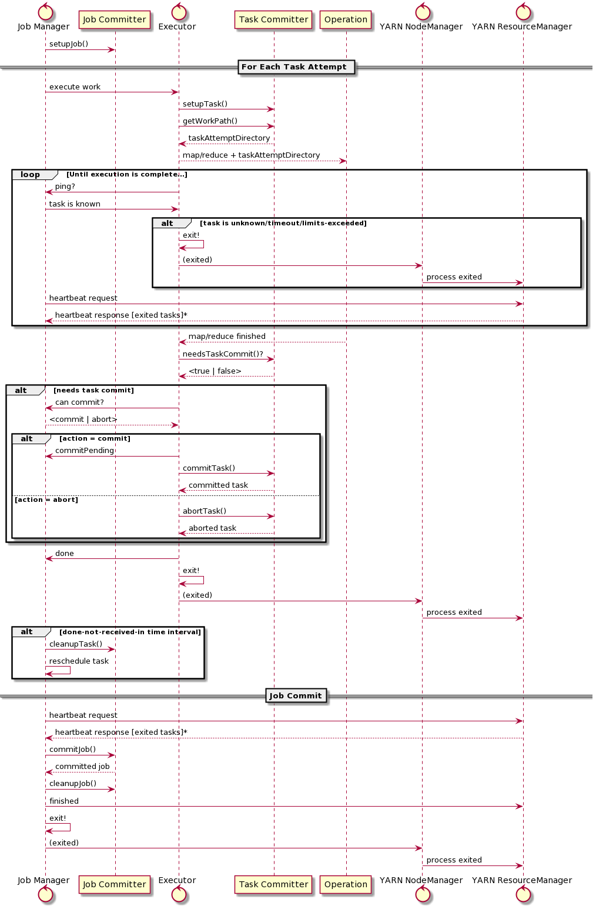

# Zero Rename 提交协议

## 1 简介

**长期以来，“大数据”计算平台的核心要求是数据的源和目标是完全一致的分布式文件系统**。

1. **分布式**，因为集群采用分布式进程执行单个查询，这些分布式进程需要读写数据。
2. **一致性**，因为集群中所有机器都要能够枚举和读取任何其他机器写入的数据。
3. 文件系统则是开发人员熟悉的分布式存储模型和 API。

POSIX 文件系统的完整语义并不总是必需的，文件的随机写入是存储中经常被忽略的特性，这迫使存储格式完全依赖于追加数据。

所需的关键语义在于文件系统提供了目录和文件模型，该模型具有一致的操作来枚举和读取这些目录及其内容，至少具有四个原子操作：

1. 将单个文件重命名到同一卷中的另一个位置。
2. 将目录及其内容重命名到同一卷中的另一个位置。
3. 如果文件或目录不存在，则创建之。
4. **递归删除目录**。

应用程序经常使用这些操作作为高级协调和提交协议的基础运算。

例如，`create()` 操作可用于获取对资源的锁：第一个创建文件的进程可以认为自己具有对该文件的独占访问权，因此隐式地认为自己已获取了该资源。

通常，`rename()` 操作对于提供原子性的输出至关重要：单个 `rename()`  调用可以将工作进程所有正在进行的输出<u>==提升为==</u>已完成的工作，只需将所有输出移到已知路径即可。并且，当 Job 完成时，可将其最终输出重命名到新位置，以让它变得公开可见。

如原始 [MapReduce 论文](https://dl.acm.org/doi/10.5555/1251254.1251264)所述：

>我们依赖底层文件系统提供的原子重命名操作来保证文件系统状态，最终只包含 **reduce** 任务一次执行所产生的数据。

Apache Hadoop 用自己的[分布式文件系统 HDFS](http://aosabook.org/en/hdfs.html)。

由于只能在当前文件的末尾直接追加数据，所以不可否认 HDFS 是 POSIX 系统子集。它提供文件系统的经典模型：目录和文件树，以及必须的原子操作，可让 MapReduce 安全地将 HDFS 用作工作目标。随后会看到，某些对象存储没有提供相同的保证，因此**即使一切看起来**都可以工作，也无法用标准协议将其安全地用作<u>**输出目的地**</u>。

## 2 Hadoop MapReduce 提交协议

在讨论将**对象存储**作为**工作目的地**的挑战和解决方案之前，必须先讨论分布式查询本身输出数据的问题，以及现有的协议和算法。

### 2.1 术语

首先，需要引入一些术语来描述协议。

**查询**。源数据到结果集的一种或多种转换； 以某种形式显示或保存的数据。查询可以用过程源代码描述，也可以使用诸如 SQL 的形式**声明性地描述**。

**Job**。由一个或多个分布式任务组成的并行查询。如果 Job 成功完成，则 Job 的输出对较大操作序列中的其他阶段或其他应用程序可见。一个复杂的查询可以由一系列 Job 组成，可以按顺序执行，也可以按 Job 的 DAG 执行。

**Job 尝试**。 一次 Job 执行的尝试。

**任务**。Job 的一部分，例如，在一部分输入数据上执行的的单个 Map 或 Reduce。

**任务尝试**。在集群某台主机上运行的一个进程完成任务的一次尝试。如果<u>任务尝试</u>生成所有输出，且没有失败，那么就为成功。如果执行引发异常，或者执行<u>任务尝试</u>的进程停止与管理 Job 的进程通信，则任务尝试**<u>失败</u>**。

一个任务可以有多次尝试执行：如果是任务失败后重新执行，则是顺序执行；如果是推测性地执行任务尝试，则是并行执行。<u>至关重要的是</u>，**只有一个<u>任务尝试</u>的输出会传播到 Job 的最终输出**。

**Job Manager**。调度<u>任务尝试</u>执行的进程，它跟踪<u>任务尝试</u>的成功或失败，确定 Job 何时完成并发布结果。 如果判断出  Job 已失败且无法恢复，此时将中止 Job。

**Executor**。由 Job Manager 管理，能够执行查询的过程。在 Hadoop MapReduce 中，每个分区数据创建一个唯一的执行程序，处理完成后销毁。在 Spark 中，**Executor** 的寿命很长，可以执行来自多个 Job 的<u>任务尝试</u>，通常是并行执行。

**Job 输出目录**。文件系统中放置 Job 输出的目录，成功完成 Job 后，输出数据必须在目标目录中可见。

**任务工作目录**。由单个<u>任务尝试</u>独占访问的目录，**<u>未提交的数据放置在该目录中</u>**。在这个目录下写入的所有数据都被认为是该任务尝试的输出。

**任务提交**。并将<u>任务尝试</u>的输出**提升**为当前 <u>Job 尝试</u>最终输出的一部分。当输出为文件系统时，这将包括把<u>任务工作目录</u>下的文件，移动至 <u>Job 输出目录</u>，并保留子目录的层次结构。

**Job 提交**。根据<u>Job 尝试</u>中所有已提交任务的输出，产生最终输出的操作。通常包括以聚合形式发布该输出；还可以生成额外的摘要数据。由于这通常是 <u>Job 尝试</u>结束时的序列化操作，因此可能成为性能瓶颈。

**任务中止**。 取消任务，未提交数据。

**Job 中止**。 取消 <u>Job 尝试</u>中的所有工作：不会提交任何任务。

**Job 上下文**。 `org.apache.hadoop.mapreduce.JobContext` 的实例，为 Job Driver 和任务提供 Job 的只读视图。

**任务尝试上下文**。`org.apache.hadoop.mapreduce.TaskAttemptContext` 的实例，它提供任务相关的操作，例如获取和设置任务尝试的状态、进度和计数器值。

### 2.2 提交协议的需求

Apache Hadoop 的 MapReduce 被设计支持长时间运行的大规模查询，这些查询需要几分钟到几小时才能完成。其要求包括：

1. 在单个 *Job* 中支持上万个单独调度的**任务**。

2. 支持不同的**输出目的地**，例如数据库和分布式文件系统。

3. 正确地将单个任务的输出传播为 Job 的最终汇总。什么是正确的在[这里](#正确性)介绍。

4. 通过重新调度任务，以从失败的<u>任务尝试</u>中恢复；可以在集群中的任何位置执行新的<u>任务尝试</u>。

5. 支持推测性执行<u>任务尝试</u>，以补偿执行过程中<u>**掉队者**</u>造成的延迟。

6. **可能**从失败的 <u>Job 尝试</u>中恢复，使用上一次失败的 Job 尝试中所有已提交任务的输出。

7. 对任务的分区和网络故障保持弹性，并且 **Job Manager** 本身与系统的其他部分隔离（因此可再次尝试重启作业）。

这导致了对实现有一些特定的需求，用于评估其正确性。

1. **独立**。单个任务不必与其他任务<u>直接协调</u>就能输出。
2. **提交前都是推测性任务。**多个任务必须能够在同一输入源上同时执行，以生成由该部分输入所产生的输出。这是恢复和推测执行所必需的。**<u>非需求：幂等输出</u>**（是否幂等交由具体的实现）。
3. **可伸缩通信协议**。任务与 **Job Manager** 之间提交协议（所产生）的通信必须支持数万个同时执行的任务。
4. **可终止**。必须能够中止未提交的任务或 Job。不应有剩余的输出。
5. **可恢复或可重新启动 Job**。提交协议可以声明其是否支持恢复 Job； 如果支持，则必须实实现恢复操作。 如果不支持，则必须从头开始重启新的 Job。

核心提交协议的UML序列图显示为：

提交算法被设计为可在 [YARN 集群](https://dl.acm.org/doi/10.1145/2523616.2523633)上工作。

由 *Node Manager* 负责在 YARN 集群的每个节点上启动应用程序，通常有内存和 CPU 限制。位于中心的**资源管理器**管理调度，并监控应用程序。提交应用程序时，**资源管理器**会调度其根进程 *Application Master*，它通过 `ApplicationMasterProtocol` 协议与资源管理器进行通信，应用程序显式使用该协议，用于请求集群中的新进程；资源管理器则隐式地使用该协议来探测应用程序是否存活。

启动的进程终止后，`NodeManager` 将进程的退出码附加在常规的心跳消息中传递给 `ResourceManager`。如果是 `ApplicationMaster` 自身终止，除非明确声明自己已完成，否则将认为应用程序失败。默认情况下终止所有工作进程，重新执行 `AM` 的新实例。如果是一个工作进程终止，则由 `AM` 选择如何响应。

在 MapReduce 中，YARN 的 ApplicationMaster 是 **Job Manager**，每个单独的<u>任务尝试</u>都在一个唯一的工作进程中执行，本文称之为 **executor**。**Job Manager** 与 **executor** 之间的 RPC 协议用于管理提交。除进程失败外，由 **Job Manager**  检测 **executor** 是否存活，这是基于 RPC 协议是否超时来完成检测。

### 2.3 可恢复的故障模式

#### 2.3.1 Job 恢复
当 YARN 感知到 **Job Manager** 进程失败时，会在集群中的某个地方重启一个新的 **Job Manager**，由其创建具体的 **Job Committer** 实例，并查询它是否支持恢复 Job。

如果 **Committer** 的确支持恢复，则通过读取 Job 历史记录文件来重建先前 <u>Job 尝试</u>的状态。该文件是执行期间保存的事件日志，包括**<u>成功提交并因此可以恢复的所有任务</u>**的记录。Job Committer 会为这些任务分别调用 `recoverTask(TaskAttempt)` 方法。所有未执行、未提交或不可恢复的任务都将被重新执行。

如果不支持恢复 Job，则将重新执行整个 Job。

由于 **Job Manager**  发生故障的可能性（排除代码本身中的错误）是 <u>Job 时间</u>而不是<u>规模</u>的函数，因此对于（持续多个小时）的长时 Job，从 Job 失败中恢复更为重要。

#### 2.3.2 坏记录
为了避免整个任务以及其 Job 因单个无法处理的记录而失败，<u>任务尝试</u>可以跳过引发异常的记录。如果<u>任务尝试</u>中跳过的记录数低于某个阈值，则这些记录不会导致<u>任务尝试</u>报告自己失败。这与提交协议没有直接关系，除非是<u>任务尝试</u>失败的原因。

## 3 Hadoop's `FileOutputCommitter`
任务提交和 Job 提交都在同一个类，即 `OutputCommitter` 的子类中实现。`FileOutputCommitter` 实现了对 HDFS 的写入，它实际上实现了两种提交算法，每种算法的性能和可伸缩性特征都不相同。

*v1* 算法被设计为通过原子的任务提交来处理失败和恢复，能够显式恢复失败的<u>Job 尝试</u>中已成功提交的任务所产生的输出。

*v2* 算法在 2015 年添加，因为它的前身被发现对具有上万个文件的 Job 存在[可伸缩性问题](https://issues.apache.org/jira/browse/MAPREDUCE-4815)。虽然 *v2* 算法可以提供更好的性能，但其代价是降低**输出隔离度**。

1. **v1** 提交<u>任务尝试</u>时，将重命名其<u>任务工作目录</u>到 <u>Job 尝试</u>目录下。提交 <u>Job 尝试</u>时，所有提交任务的目录都将（串行）合并到 Job 输出目录下。重新启动的 Job 会从上一次尝试中移动已提交任务的目录，以便恢复它们的输出。
2. **v2** 提交<u>任务尝试</u>时，其输出立即合并到作业输出目录中；作业提交操作只会创建一个标记文件。更快但中间结果可见。任务提交不再是原子操作，从而改变了故障模式。

### 3.1 公共变量
表 1: 算法中使用的变量
| name                | meaning                                                      |
| ------------------- | ------------------------------------------------------------ |
| ***fs***            | 目标文件系统                                                 |
| ***destPath***      | 目标文件系统中的 Job 输出目录                                |
| *jobId*             | 数值型的 Job ID ≥ 0；对于群集中的所有应用程序**实例**，应是唯一的。 |
| *jobAttemptId*      | *JobID*$*counter*；对于一个作业，计数器从0开始，每次尝试时递增。 |
| *jobAttemptPath*    | Job 尝试可以在其下存储任何数据的一个路径。                   |
| *partId*            | 要分配给任务的数据分区的数值。                               |
| *taskId*            | *jobAttemptId*$*partId*；Job 尝试中基于数据分区 *partId* 工作的任务。 |
| *taskAttemptId*     | *taskId*$*counter*；任务尝试的一次执行。                     |
| *taskAttemptPath*   | *jobAttemptPath* 下的路径，任务尝试可以将未提交的数据写入其中。 |
| *taskCommittedPath* | *jobAttemptPath* 下的路径，提交任务尝试时，*taskAttemptPath* 的内容移至这。 |

对于一个标记为 `jobAttemptId` 的 <u>Job 尝试</u>要成功，必须在一个或多个成功的任务中处理数据集的所有部分。每个任务必须只有一次<u>任务尝试</u>的输出包含在最终数据集中。

提交算法的功能是保证满足这个条件，即使在出现故障的情况下也是如此。算法不需要能够从所有故障中恢复；它可以通过使整个 Job 失败来对某些故障情况作出反应。

如果 Job 失败，通常并没有要求 Job 输出目录必须保持不变。总之，这意味着需要**<u>最多一次</u>**的语义，并且是在更高层级的工作流中处理失败的 Job。

### 3.2 Hadoop v1 提交算法

**Job Setup**

在输出目录 `destPath` 的 `_temporary` 目录下创建 `jobAttemptPath` 路径。

| Procedure `setupJob`                                         |
| ------------------------------------------------------------ |
| `jobAttemptPath` $\longleftarrow$ `destPath/_temporary/jobAttemptId` `mkdir (fs, jobAttemptPath)` |

注意 Hadoop 有一个约定，所有以 **”_“** 开头的路径都被视为“**<u>不可见</u>**”。 ==此目录下的所有内容均从目标路径的常规列表中排除==。对于任何启用了加密的 HDFS 群集，在目标目录的子目录中创建所有中间文件提供了一个隐式保证，即在同一个卷（多卷文件系统中）和同一加密区域中创建数据。

**Task Setup**

<u>任务尝试</u>在<u>Job 尝试</u>路径下指定一个目录作为其**任务工作目录**。

| Procedure `setupTask`                                        |
| ------------------------------------------------------------ |
| `taskAttemptPath` $\longleftarrow$ `jobAttemptPath/taskAttemptId` |

目录是按需创建的。

**Needs Task Commit**

只有生成了数据，才需要提交。

| Function `needsTaskCommit`   |
| ---------------------------- |
| `exists(fs,taskAttemptPath)` |

**如果对象存储的对象列表在这里存在最终一致性，会生成无数据可提交的错误结果**。

**Task Commit**

只需将<u>任务尝试</u>的工作目录重命名（移动）到<u>Job 尝试</u>目录下，即可提交<u>任务尝试</u>。

| Procedure `commitTask`                                       |
| ------------------------------------------------------------ |
| `if exists(fs,taskAttemptPath) then`     `delete(fs, taskCommittedPath, recursive)`     `rename(fs, taskAttemptPath, taskCommittedPath)` `end` |

在真实文件系统中，重命名是 $O(1)$ 原子操作。

**Task Abort**

通过删除<u>任务尝试</u>的路径来中止<u>任务尝试</u>。

| Procedure `abortTask`                    |
| ---------------------------------------- |
| `delete(fs, taskAttemptPath, recursive)` |

在真实文件系统中，这是 $O(1)$ 原子操作。

**Job Commit**

通过将所有任务提交路径中所有文件/目录合并到 Job 的最终输出目录中来提交 Job。可以选择在输出目录中创建一个零字节的 `_SUCCESS` 文件。

| Procedure `commitJob`                                        |
| ------------------------------------------------------------ |
| `for committedTask in listFiles(fs, jobAttemptPath) do`         `mergePathsV1 (fs, committedTask, destPath)` `end` `touch(fs, destPath/_SUCCESS)` `delete (fs, _temporary)` |

`mergePathsV1(FileSystem，Path，Path)` 是将已提交任务的所有输出递归移动到目标目录下的过程。

| Procedure `mergePathsV1(fs, src, dest)`                      |
| ------------------------------------------------------------ |
| `if isFile(fs, src) {`     `if exists(fs, dest) {`         `delete(fs, dest, recursive)`      `}`      `rename(fs, src, dest)` `} else {`      `if exists(fs, dest) {`          `if isFile(fs, dest) {`              `delete(fs, dest, recursive)`              `rename(fs, src, dest)`           `} else {`               `for f in listFiles(fs, src) `                    `mergePathsV1(fs, f, dest + f.name)`           `}`      `} else {`         `rename(fs, src, dest)`      `}` `}` |

所有文件和目录都被提升到目标目录。

1. 如果计算出的源文件或目录的目标路径不存在，则重命名源文件/目录。
2. 如果目标路径确实存在并且是文件，则将其删除，然后重命名源文件/目录。
3. 如果目标路径存在并且是目录，而源路径也是目录，则将 `mergePathsV1` 应用于源路径的子目录。

它们一起形成了目标树对源树的深度优先覆盖，特别是合并了所有目录的内容。执行合并的时间取决于源条目的数量和目标目录的状态。如果失败，则该操作的状态未知：无法简单地重复该操作。

| Function `v1.isCommitJobRepeatable` |
| ----------------------------------- |
| `false`                             |

因此：如果Job 尝试在提交过程中失败，则无法恢复：后续尝试将报告错误并中止。

| Procedure `v1.abortJob`                 |
| --------------------------------------- |
| `delete(fs, jobAttemptPath, recursive)` |

通过删除可能已进行的所有 Job 尝试的输出，来清除 Job 尝试。 这可以通过删除目标目录下的整个 `_temporary` 目录来实现。

| Procedure `cleanupJob`                       |
| -------------------------------------------- |
| `delete(fs, destPath/_temporary, recursive)` |

如果有 Job 正在向同一个目标目录写入数据，该 Job 将会失败。这要求只有一个 Job 可以主动写入特定的目标目录，在 submit Job 时会进行检查。

**Job Recovery**

v1 Commiter 可以从失败的 Job 尝试中恢复，第二次尝试可以重用上一次尝试中所有已提交任务的输出。

整体恢复 Job 尝试过程是一个复杂的过程；从 Committer 的角度来看，如果任务尝试是在上一次 Job 尝试中提交，则上一次任务尝试的 `taskCommittedPath` 可以移动到新 Job 尝试的 `jobAttemptPath` 下。

| Procedure `isRecoverySupported`                 |
| --------------------------------------- |
| `delete(fs, destPath/_temporary, recursive)` |

| Procedure `recoverTask(TaskAttemptContext)`                  |
| ------------------------------------------------------------ |
| `previousJobId = jobId - 1` `previousJobAttemptDir = getJobAttemptPath(previousJobId - 1)` `delete(fs, destPath/_temporary, recursive)` |

唯一丢失的工作是所有正在提交的任务尝试，即那些已生成数据但尚未提交的尝试。

使用 HDFS 时，算法的主要局限性是：Job 提交是 $O(tasks)$，任务的合并时间取决与文件数和目录深度。

由于这是在 Job 结束时序列化的，无论有多少工作进程，作业提交都是单点延迟和单点故障。任务越多，提交时需要做的事越多；提交的时间越长，失败的风险就越高。

### 3.2 Hadoop V2 提交算法

在提交任务时，*v2* 提交算法将<u>任务尝试</u>的输出传播到 Job 的输出目录中。这是在一个不同的 `mergePaths()` 算法 *v2* 中完成的，该算法被设计为支持对输出目录的并行写入。在 Hadoop 源代码中，这两个算法混合在一对共同递归过程中。为了清晰起见，此处将它们分开。

| Procedure `mergePathsV2(fs, src, dest)`                      |
| ------------------------------------------------------------ |
| `if isFile(fs, src) {`     `if exists(fs, dest) {`         `delete(fs, dest, recursive)`      `}`      `rename(fs, src, dest)` `} else {`      `if exists(fs, dest) {`          `if isFile(fs, dest) {`              `delete(fs, dest, recursive)`              `mkdirs(fs, dest)`              `for c in listFiles(fs, src) `                  `mergePathsV2(fs, c, dest + c.name)`           `} else {`               `for c in listFiles(fs, src) `                    `mergePathsV2(fs, c, dest + c.name)`           `}`      `} else {`          `mkdirs(fs, dest)`           `for c in listFiles(fs, src) `                `mergePathsV2(fs, c, dest + c.name)`      `}` `}` |

这里 `rename()` 操作仅限于提交一个文件：提交目录时，都是将它作为递归合并来完成。必须得这么做，因为可能同时提交多个任务，而这些任务可能正在写入同一目的地。当需要支持多个任务将它们的输出**<u>同时</u>**合并到同一目录树中时，目录重命名的原子排他性正是不需要的。

在性能方面，每当有要提交的目录时，`mergePathsV2`都会比 *v1* 算法慢。 但由于这些操作是在任务提交时进行，因此可以在整个集群中并行操作，并且通常不会直接降低 Job 的整体速度。

随着文件在任务中传播，Job 提交将简化为创建 `_SUCCESS` 文件并清理工作目录：

| Procedure v2 `commitJob`                                     |
| ------------------------------------------------------------ |
| `touch(fs, destPath/_SUCCESS)` `delete (fs, _temporary)` |

因此，提交 Job 的时间几乎可以忽略。

在故障恢复方面，*v2* 算法比 *v1* 算法要弱。任务提交现在是一项非原子操作。因此，如果<u>任务尝试</u>在提交时失败或者丢失，不可能安全地恢复。

因为已提交任务的输出是可见的，所以如果 Job 失败，则所有已提交任务的内容都是可见的。

*v2* 提交算法选择了速度而非弹性。

这通常是一个有效的决定，但是，**Committer** 的调用者需要知道自己做出的决定，并且流程中的某些部分（特别是任务提交）的失败是不可恢复的。

### 3.3 Hadoop MapReduce 提交协议的限制

除了一些实现细节外，比如，一个任务进程一旦被告知未知就立刻退出，而不会调用 `cleanupTask()` ，我们还必须考虑：Hadoop 提交协议是否存在任何基本问题？

一个主要的弱点是，没有向 **Job Committer** 传递成功的<u>任务尝试</u>列表，也没有传递已提交任务提交的文件列表。

**Committer** 自身必须实现某种机制，来枚举那些已提交的任务。

`FileOutputCommitter` 通过文件系统执行此操作，依赖于一致的目录列表操作来枚举要合并的任务输出，对于 *v1* 算法，要枚举必须在 Job 提交期间发布其输出的（已提交的）任务集。这就要求文件系统元数据列表保持一致，所有非对象存储都不能满足该要求。

由于没有直接传递给 `commitJob` 已完成任务的列表，因此 Job 提交者无法确定文件系统中实际提交的输出是否正确。

在客户端 sumbit Job 时验证目标目录是否存在，与在 `setupJob()` 操作期间创建该目录之间，似乎还存在竞争条件。在繁忙的集群中，Job 调度与其应用程序管理器实际开始执行之间可能存在延迟，此时，也可能会调度第二个相互冲突的作业。如果在 sumbit Job 时创建目标目录，则此窗口将几乎完全消除。

## 4 Spark 提交协议

Apache Spark 的执行模型与 Hadoop 的执行模型明显不同。 Spark 没有创建单个进程来对源数据的子集执行单个操作，而是创建了一组 **Executor**，每个 **Executor** 都可以用多个线程执行<u>任务尝试</u>。所以单个执行器可能同时执行多个任务尝试，每个任务的提交操作由**<u>一个作业管理器</u>**集中管理。

当 **Executor** 因失去心跳而被诊测为故障时，将重新调度所有活动任务。由于故障可能是网络分区，因此可能同时有多个<u>任务尝试</u>正在执行。因此，在真正提交<u>任务尝试</u>之前不**==升级==**任何数据。

Spark 的提交协议可以使用 Hadoop Committer，通常在将数据写入 HDFS 或其他集群文件系统时用到。

Spark 在 `OutputCommitCoordinator` 类中管理其<u>**只能提交一次任务尝试**</u>的需求；**Driver** 中的此实例将跟踪所有活动的<u>任务尝试</u>的状态，并授予或拒绝它们的提交权限。

<u>任务尝试</u>只有在满足下面的一组条件时才被授予提交权限：

1. <u>任务尝试</u>未记录为失败。
2. <u>任务尝试</u>位于已知的活动任务集中。
3. 请求的<u>任务尝试</u>已被授予过此权限，没有授予过其它<u>任务尝试</u>提交权限，或者先前的任务被授予了权限，但被认为已失败。

也就是说：它必须是有效的<u>任务尝试</u>，并且其他任何<u>任务尝试</u>都不能主动提交或此任务已提交过。

**Executor** 通过 RPC 调用请求此提交权限，并在收到成功的消息后继续进行提交。 RPC 通道超时或拒绝提交将导致 `abortTask()` 被调用。

一旦<u>任务尝试</u>被授予提交权限，则除非第一次<u>任务尝试</u>报告为失败，否则不会授予其他<u>任务尝试</u>。

> - [ ] `OutputCommitCoordinator` 对调度程序中的任务事件做出反应，但这是否涵盖了 **Executor** 故障？

Spark不会从失败的 **Job Manager** 中恢复；它恢复失败 Job 的机制是**重新运行整个查询**。

Spark 超过 Hadoop 协议的一块是，它新增 `newTaskTempFileAbsPath()` 来处理需要绝对路径的文件。用于解决 Apache Hive 的一个特殊情况，此时，数据集的某些部分并不会被写入到 Job 目标目录下的某个位置。在计算了输出的绝对路径之后，该操作将在 Job 提交时的最终目录下生成一个临时文件。

Spark 在标准 `FileOutputCommitter` 之上实现此操作，如下所示：

1. 在 Job 输出目录下创建一个**绝对路径的暂存目录**，即 `_temporary-$jobId`（貌似 `.spark-staging-$jobId` ）。
2. 调用 `newTaskTempFileAbsPath()` 时，将在此目录下生成路径，文件名中包含 `UUID`。
3. 在 **Task Committer** 中存储<u>绝对路径</u>到<u>临时文件</u>的映射关系 。
4. 在 `commitTask()` 中，传回所有要重命名文件的映射。
5. 在 `commitJob()` 中，调用 **Hadoop Committer** 的 `commitJob()` 调用后，将遍历文件聚合映射中要重命名为绝对路径的所有文件，依次将每个文件重命名为其最终路径。
6. 中止任务将删除该任务的文件，而中止 Job 将删除整个绝对路径的暂存目录。

当前，这个额外操作只在特定场景中使用，即 Hive 分区表数据位于活动 Job 同一文件系统中的其他位置（似乎是指 [Hive 自定义分区位置](https://cwiki.apache.org/confluence/display/Hive/LanguageManual+DDL#LanguageManualDDL-AlterTable/PartitionLocation)，另外参见 [SPARK-18185 PR](https://github.com/apache/spark/pull/15814)）。至少对于存储在对象存储中的数据来说，并不常见。因此，新的 Committer 不支持此操作。

Spark 的提交协议更灵活，因为文件名由 **Committer** 生成，而不是由应用程序生成。成功提交的任务可以将任意序列化的数据传回给 Driver，以便在提交 Job 时使用。这可能是唯一能够==将已写入的文件列表从<u>任务尝试</u>传回给 **Job Committer** 的==方法。<u>（尽管在保留排序顺序的同时）能够生成名称可能是有用的，我们最初决定不将它作为提交策略；其他人可能希望这样做</u>。

### 4.1 Spark 提交协议的限制

Spark Driver 中的提交时的协调工作通过 `OutputCommitCoordinator` 完成。它的状态包括跟踪<u>任务尝试</u>是否已被授予提交的权限。一旦一个<u>任务尝试</u>被获准提交，将拒绝同一任务的所有其它任务尝试。但是，如果被授予提交权限的<u>任务尝试</u>由于任何原因失败，则该尝试将被视为失败，会将提交权限授予给另一次<u>任务尝试</u>。

如果任务可重复提交，则此策略有效，即使首次尝试失败，或和 Spark Driver 存在网络分区也是如此。 `FileOutputCommitter` 的 *v1* 算法可以满足该要求，但 *v2* 算法或者其他算法可能无法满足这一要求。如果 Committer 表明它可以从失败的提交任务以及其他操作中恢复，则 `OutputCommitCoordinator` 可以决定是否允许重复尝试，或者使 Job 失败是更安全的结果。

与 Hadoop 协议不同，Spark Driver 不需要从集群调度器接收最近的活动性检查。一旦  Spark Driver 确定它已与任何底层集群调度进程隔离后，除非退出，否则存在这样的风险：即可能会和重启的替换集群将 Job 提交到同一地点。需要仔细检查 YARN 和 Mesos 的集成代码，以确保这种风险不存在。

Spark 的提交协议允许 **Task Committer**  将数据返回到 Spark Driver 中的 **Job Committer** ；可能会使用它来验证任务的输出。当前 **Committer** 的实现没有执行此操作，但是至少底层协议使这种改进成为可能。

## 5 对象存储的挑战
在介绍了经典的文件系统以及分布式提交协议和算法之后，我们来看下对象存储，例如 Amazon S3，Google Cloud Storage 和 Windows Azure Storage [@AWS-S3-intro; @Calder11]()。

最突出的一点是：对象存储不是文件系统。与传统的目录、子目录和路径的层次结构视图不同，**<u>对象存储</u>**存储的是一组对象，每个对象都有一个唯一的 **Key**，是创建对象时提供的字符序列。经典的路径分隔符“`/`”始终是有效字符集的一部分，因此允许创建具有目录中<u>**文件外观**</u>的对象。

作为示例，以下是Amazon，Google 和 Microsoft 存储中的所有有效的 **Key**：

    /entry
    /path1/path2/path3
    /path1/
    /path1

更微妙的是，对于对象存储容器（S3 上是**桶**），同时拥有所有这些名称的对象是有效的。如果一个对象的键会使它看起来<u>像“在”另一个对象之下</u>，或者显式地包含路径条目分隔符，都不是一个错误。

在创建或重命名对象后，通常不能追加数据，但可以被新对象替换或删除。允许某种形式的复制操作，使用不同的键创建一个新对象。这样的复制操作在存储基础架构内进行，复制速度以兆字节/秒为单位。

提供的操作集通常是HTTP动词的扩展集：

| 动词 |    含义  |
| ---- | ---- |
| PUT | 原子对象写入 |
| GET | 读取对象的部分或全部内容 |
| HEAD | 读取对象元数据 |
| LIST | 列出所有以给定前缀开头的对象 |
| COPY | 复制存储区内的单个对象，可能来自其他容器。 |
| DELETE | 删除对象 |

通常有两个额外的操作可以解决扩展问题：批量删除（可能会部分失败）和**==分段上传==**：一种上载大于 5GB 对象的方法，用 HTTP POST 即可支持。分段上载的<u>确切</u>性质因存储而异。对于 Amazon 来说，是一组 POST 调用序列，一个 POST 初始化上传，一个或多个 POST 调用上传数据，最后一个 POST 列出上传对象的（有序） etag。除最后一次上传的对象外，所有文件都必须为 5  MB或更大。

对象存储有不同层级的不一致性。Windows Azure 完全一致；Amazon S3 提供了新建对象的一致性，更新或删除对象没有一致性。它的枚举操作也不一致，新建对象在 List 中不可见，或新删对象在 List 中可见。

尽管对象存储的 API 和功能，与 Hadoop 文件系统所期望的之间存在明显的不匹配，但它们有一个共同点：可以存储 PB 级数据。因此，所有流行的云存储基础架构都具有来自 Hadoop 的连接器，从而可以连接像 Apache Hive，Apache HBase 和 Apache Spark 这样的应用。其中包括 Azure 的 `wasb` 连接器和 Amazon S3 的 `s3a` 连接器，是在 Apache 软件基金会自己的代码库中开发的。其他的则由外部维护 —— 尤其是 Amazon EMR 自己的 EMRFS（以 `s3 URL schema` 为人所知）和 Google Cloud Storage 的连接器 `gcs`。

无论是谁实现它们，它们都具有一个共同的目标：尝试在对象存储之上维护**==文件系统隐喻==**。

作为一个简单示例，`getFileStatus()` 调用模拟一个目录，并结合了零字节的“空目录”标记，因此必须先查找文件，然后查找标记，以及最昂贵的操作：枚举路径。

      GET path
      GET path/
      LIST path/

就算是使用连接池，每个 HTTPS 请求的性能差异会减慢所有的 RPC 操作：即使是个简单的探测，对于一个文件也可能需要数百毫秒的时间。其他类似操作也有相似的成本。

通过列出路径下的所有对象，然后分别对这些对象进行操作，可以模仿对**==目录的操作==**。**==递归删除==**实现为一个 HTTP 请求中返回最大文件数（5000或类似值），然后发出（如果支持）批量删除操作，或者回退为多个不同的单次删除调用。批量的枚举/删除操作的开销为每个页面大小（最大文件数）一个 HTTP 请求，例如 $O(1+文件数/5000)$； 如果必须执行顺序删除操作，则成本至少为 $O(1+文件数)$，并添加==<u>**至少**</u>==限定符，因为请求限速会进一步减慢请求速度。

文件和目录重命名的成本更高。文件重命名是将原始数据复制到新路径，然后删除原始数据。这使得复制单个文件的时间变成 $O(length(file))$ 操作[^3]。

目录重命名是分页列出所有的子项，每个子项都有一个复制和删除，这使得它的持续时间成为文件数和数据总量的函数。

这些是看得见的性能问题，是用户最容易发现的问题。然而，事实上，没有提供 POSIX 文件系统的原子性行为，才是最危险的。

`rename()` 调用不再是原子的：两个客户端可能开始重命名为同一目标目录。此外，如果任何重命名失败，则源目录和目标目录的状态是未知，数据可能分布在两个位置。最后，由于要复制的文件是通过 `LIST` 调用确定，因此如果对象存储不一致，则列表可能不完整或已过期。新创建的文件可能不可见，因此不会作为重命名操作的一部分进行复制。

**==目录重命名不能用于需要原子、独占或一致重命名的提交算法中==**。

`create(path，overwrite = false)` 操作也有缺陷。如果路径为空，将是一个原子操作，可以立即创建一个文件；否则，则要通过一序列的 `getFileStatus()`，并在客户端为输出创建缓冲区。在数据完全写入并关闭流之前，数据将不可见。因此，在此类存储中，不能用**<u>创建文件</u>**的方法来实现任何形式的锁或独占访问。

回到 MapReduce *v1* 和 *v2* 提交算法，如果对象存储没有原子重命名（*v1*）、一致的目录列表和存在性检查（*v1* 和 *v2*），则不适合使用者两种算法。

结果，这两种算法都不能直接用于 Amazon S3。通过一致的元数据层（例如 `S3mper` 或 `S3Guard` ），可以使用 *v2* 算法，尽管其任务提交时间将为 $O(data)$ [@ S3mper; @ HADOOP-13345]()。

为对象存储提供安全，高效的输出提交协议将迫使我们抛弃文件系统的隐喻，而使用对象存储本身的功能。

## 6 新的 S3A Committer：从一开始就与S3合作
既然 S3 不能提供**文件 Committer** 所期望的安全性和高性能操作，那么 Hadoop 和 Spark Job 如何安全地将其用作<u>**文件输出目的地**</u>？

这就是新的 **S3A committers** 要解决的问题。 之所以这么称呼它，是因为它们与 Hadoop 的 S3A 连接器紧密集成在一起，利用**==分段上传==**使**数据的写入**与**在最终位置显示数据**脱钩。

已经使用==**分段上传**==将大文件写入对象存储。写入文件时，文件最初会缓冲到磁盘或内存中，当缓冲区大小达到某个阈值时，用 `POST` 开始上传第一个块。S3 对  POST 操作的响应是上载数据的 MD5 校验和，即`实体标签`，与现有 HTTP 操作中使用的一样。上传完所有块之后，最后完成 MPU 的请求将实体标签的有序列表 `POST` 到 S3。只有在这个最后的 `POST` 之后，S3 才会显示上传的对象。如果这个最后的 POST 操作用于提交任务的输出，那么**提交者**对每个文件都有原子及实际上的 O(1) 操作。

**S3 Committer** 面临的挑战是：如何将数据写入目标目录，保存并传播 MPU 列表，以便由 Job 最后提交？

**这就是两个 Committer 所要解决的挑战**。

在底层，它们都使用 S3A 连接器提供的相同方法，以及相同的<u>持久化数据格式</u>来传播 MPU 列表。不同之处是任务如何输出数据，以及如何将列表传递给 Job 提交。

`Staging Committer`，每个任务都会将其数据写入执行该任务服务器的本地文件系统。任务提交时，其数据将上传到 S3 上的最终路径。使用共享的一致的集群文件系统（通常为 HDFS），通过 *v1 File Output Committer* 将 MPU 列表 传递给 Job tracker。Hadoop 或 Spark Job 提交时，`Staging Committer` 从 HDFS 读取已提交任务的清单，并完成其中列出的上载。

性能方面，所有数据都会在<u>**任务提交**</u>时上载到其最终目的地，**<u>Job 提交</u>**是在 HDFS 上执行 v1提交操作的时刻，之后是每个上传文件最后的那个 POST 调用。

`Magic Committer` 在 S3A 文件系统连接器内工作，它改变了文件增量写入 S3 的方式。在关闭任务的输出流时，最后的 POST 将延迟到提交 Job 时，==分段上传==并不是在任务写入时完成。相反，它编写一个清单来描述上传到 S3 的过程。提交任务后，该<u>任务的所有==单个==文件清单</u>都将汇总到该任务的**==单个==**清单中，然后将其 `PUT` 到已完成任务的 S3 目录中。 Job 提交过程是读取所有已提交任务的清单的过程之一，并且与一样 `Staging Committer`，完成其上载。

由于其输出数据块的增量上传，`Magic Committer` 能更快地上传大数据集：没有必要推迟到实际提交任务时再上传至 S3。除了尚未写入的数据块之外，不缓冲任何数据，因此本地存储量减少了，有可能避免耗尽本地磁盘容量。

>- [ ] manifest 是什么含义

### 6.1 The Staging Committer
`Staging Committer` 将<u>任务尝试</u>的工作目录声明为，由 `PathOutputCommitter.getWorkPath()` 返回的本地文件系统中的目录 `workPath`。在 `FileOutputFormat` 中，当调用方在<u>任务尝试</u>中创建文件时，使用该方法提供文件路径。

Table 2. Staging committer 使用的额外变量
| name                     | meaning                              |
| ------------------------ | ------------------------------------ |
| *localfs*                | 本地 "file:" 文件系统                |
| *localAttemptPath*       | 本地文件系统路径                     |
| *clusterfs*              | 集群文件系统                         |
| *wrappedCommitter*       | 集群文件系统的 **committer**         |
| *clusterJobAttemptPath*  | `wrappedCommitter` 的 job 尝试的路径 |
| *clusterTaskAttemptPath* | `wrappedCommitter` 的任务尝试的路径  |

**Job Setup**
创建并初始化<u>集群文件系统</u>的 Committer： `wrappedCommitter`，输出目录是 `clusterJobAttemptPath`，将其配置为集群文件系统内的唯一路径。 该 Committer 有自己的<u>Job 尝试</u>和<u>任务尝试</u>目录。将此 Committer 设置为使用 `v1` 提交算法。

| Procedure `StagingCommiter.setupJob`                         |
| ------------------------------------------------------------ |
| `jobUUID`  $\longleftarrow$ `newUUID` `clusterJobAttemptPath` $\longleftarrow$ `tempDirForStaging` + `getUsername` + `jobUUID` `taskAttemptPath` $\longleftarrow$ `jobAttemptPath/taskAttemptId` `wrappedCommitter.setupJob(clusterJobAttemptPath)` |

**Task Setup**
| Procedure `StagingCommiter.setupTask`                        |
| ------------------------------------------------------------ |
| `taskAttemptPath` $\longleftarrow$ `jobAttemptPath/taskAttemptId` `localAttemptPath` $\longleftarrow$ `uniquePath(localfs, taskAttemptId)` `clustertaskAttemptPath` $\longleftarrow$ `clusterjobAttemptPath` + `taskAttemptId` `wrappedCommitter.setupTask(clusterTaskAttemptPath)` |

函数 `uniquePath(filesystem, taskAttemptId)` 为<u>任务尝试</u>返回本地文件系统中的唯一路径。通常返回本地 `/tmp` 下的目录，在 `MapReduce` 操作期间，中间数据文件存储在该目录。 一个管理良好的 Hadoop 集群会将这些临时数据存储在<u>==非根卷==</u>上，并定期删除旧临时文件。

这个==本地文件系统==由<u>提交者</u>的 `getWorkPath()` 方法返回。

| Function StagingCommiter.getWorkPath |
| ------------------------------------ |
| `return localAttemptPath`            |

这是算法的关键。

返回到 MapReduce 和 Spark 中的<u>任务尝试</u>执行代码的工作路径是前缀为 `file://` 的本地目录，而不是对象存储中的目录。<u>任务尝试</u>提交过程是将这些地方的文件上传，而<u>作业提交</u>是使这些上传可见。

**Needs Task Commit**
如果数据在本地文件系统中生成，则需要提交。

| Function StagingCommiter.needsTaskCommit   |
| ------------------------------------------ |
| `return exists(localfs, localAttemptPath)` |

**Task Abort**

中止<u>任务尝试</u>首先删除所有临时数据，然后中止 `wrappedCommitter` 的任务。

| Procedure `StagingCommiter.abortTask`                        |
| ------------------------------------------------------------ |
| `delete(localfs, localAttemptPath, recursive)` `wrappedCommitter.abortTask()` |

**Task Commit**

如果授予<u>任务尝试</u>提交其输出的权限，那么它将开始==**分段上传**== `localAttemptPath` 下所有文件到最终的目标目录，但只上传数据，并不完成操作（不发出最后一步 POST请求）。

| Procedure `StagingCommitter.commitTask`                      |
| ------------------------------------------------------------ |
| `wrappedCommitter.commitTask()` $U \longleftarrow \emptyset$ `for f in listFiles(localfs, localAttemptPath) do {`         $U\longleftarrow U$ + `{uploadFileToPendingCommit(f , destPath)}` `}` `savePendingSet(clusterfs, clusterTaskAttemptPath, U)` |

完成这些<u>未完成上传所需的信息</u>被写入清单文件中，并保存在 `clusterTaskAttemptPath` 中。此后，调用 `wrappedCommitter` 的 `commitTask()`方法，将保存的清单文件重命名为实际任务的文件名，并放到 <u>Job 尝试</u>目录下，即 `$clusterJobAttemptPath/$taskId`。

> - [ ] 这里的代码似乎有错,`wrappedCommitter.commitTask()`应该在最后，而不是最前

**Job Commit**
Job 提交处理未完成上传的<u>清单文件</u>。

通过在集群 <u>Job 尝试</u>路径中（这是在任务提交时，通过重命名，放置<u>任务尝试</u>清单文件的目录）列出文件，可以找到上传列表。

| Procedure `StagingCommitter.commitJob`                       |
| ------------------------------------------------------------ |
| $Pending \longleftarrow \emptyset$ `for f in listFiles(clusterfs, clusterJobAttemptPath) do {`         $Pending \longleftarrow Pending$ + `loadPendingSet(clusterfs, f)` `}` `checkForConficts(fs, Pending)` `for p in Pending do {`         `completeUpload(p)` `}` |

`completeUpload()` 方法发出最后一个 POST 完成**分段上传**，这个请求含有先前上传块，按块号有序排列的 MD5 校验和。

注意，无需调用 `wrappedCommitter.commitJob()`，因为 <u>Job 尝试</u>放置清单文件的位置是已知的，可以直接读取它们。这是一个小优化。

**Job Abort**
要终止整个 Job，须按作业提交那样列出待处理的上传集，并依次中止每个上传，这时 Job 才中止。

| Procedure `StagingCommitter.abortJob`                        |
| ------------------------------------------------------------ |
| $Pending \longleftarrow \emptyset$ `for f in listFiles(clusterfs, clusterJobAttemptPath) do {`         $Pending \longleftarrow Pending$ + `loadPendingSet(clusterfs, f)` `}` `for p in Pending do {`         `abortUpload(p)` `}` `wrappedCommitter.abortJob()` |

**Job Cleanup**

要清理 Job，必须列出输出目录或在输出目录下所有不完整的上传，并中止之。可以通过 S3 API 列出未完成的上载并中止来达成。

必须删除<u>任务尝试</u>的本地目录以及集群中的共享目录。

| Procedure `StagingCommitter.cleanupJob`                      |
| ------------------------------------------------------------ |
| `for f in listPendingUploads(destPath) do {`         `abortUpload(f)` `}` `delete(localfs, localdirectoriesforjob, recursive)` `wrappedCommitter.cleanJob()` |

由于这些<u>任务尝试</u>的本地目录位于执行单个任务的节点上，因此不会在<u>作业清除</u>中删除它们，不过那些与调用 `cleanupJob()` 操作在同一主机上执行的任务除外。

#### 6.1.1 冲突解决
提交算法忽略了一块，即提交者如何解决与现有文件的冲突。因为 `FileOutputCommitter` 要求空输出目录，如果存在<u>==目标==数据</u>，提交会失败，

> - [ ] `FileOutputCommitter` 的提交代码

`Staging Committer` 支持另外的策略，可以配置为覆盖或将数据添加到目标目录。为了确保新添加的文件具有唯一的名称，上传的文件可以在其文件名中插入唯一的ID。

其中一个冲突解决选项明确针对 Spark SQL 查询，在 Apache Hive 流行的布局结构中输出数据，目录树中的不同层用于对数据进行分区。

可以按年、月、日对数据进行分区，例如 `/data/year=2017/month=12/day=21/`。在仅选择分区字段范围的情况下，分区提高了查询性能。任何针对 2017 年 12 月的查询只需查找 `/data/YEAR=2017/MONTH=12/`下的所有子目录，忽略所有相邻目录。

像这样的大型数据集，通常是随着时间的推移而建立起来，每晚或每小时添加一次数据。传统工作流，通常是通过在空目录中执行新查询来完成，Job 一旦成功，通过 `rename()` 将新数据移动到聚合数据集中。这种==**生成后再重命名**==策略可确保：无论何时启动 Job，如果 Job 失败，原始数据集都不会更改，并且应用程序可以继续使用当前文件集。

对象存储中，<u>重命名操作是另一个昂贵的复制操作，当然有自己的失败模式</u>。

怎么办？

Netflix 研发并利用的解决方案是一种特殊的提交模式： **Partitioned**，该模式希望将所有数据写入分区数据集的一个或多个子目录中，该分区数据集可能已经存在于目标目录中。

冲突解决仅限于目标分区，忽略现有数据集中所有其他分区。提交 Job 添加新文件时，仅当分区中存在现有文件时，“**<u>失败</u>**”冲突选项才会失败。 “<u>**覆盖**</u>”选项删除目标分区中的现有文件。

因此，`Partitioned Staging Committer` 允许Job 在其目标设置为活动共享数据集的情况下运行，而现有的工作查询能跨数据运行。通过消除查询结束后的数据复制，它可以加快==**生成后再重命名**==的工作流程。

### 6.2 The Magic Committer
`Magic committer` 允许<u>任务尝试</u>直接输出到对象存储，而不用在本地文件系统中缓存数据，但分段上传最后的请求将会被延迟。

该提交者的一个挑战是：如何确定客户端要启动延迟写入？

答案是每次将文件写入路径 `__magic` 下的目录时，都将其视为延迟的写入操作。该目录下的相对路径被映射为相对于Job 的目标目录 --- `__ magic` 路径的父目录。

> - [ ] 这里的映射为<u>相对于Job 的目标目录是</u>什么意思？
> - [ ] **<u>带有原始路径的 0 字节标记文件</u>**是什么意思？

要支持多个 Job 和<u>任务尝试</u>，每个<u>任务尝试</u>的输出必须相对于其 Job 的目标目录编写。因此，只要遇到名称为 `__base` 的目录，它就会声明其内容必须相对于目标目录进行映射。

Table 3. **magic** 路径和原始路径映射示例
| original                             | final                                |
| ------------------------------------ | ------------------------------------ |
| `dest`                                 | `dest`                               |
| `dest/__magic/1`                       | dest/1                               |
| `dest/__magic/1/2`                     | `dest/1/2`                           |
| `dest/__magic/job1/task003/__base/3`   | `dest/3`                             |
| `dest/__magic/job2/task004/__base/4/5` | `dest/4/5`                           |
| `dest/__magic/1/2.pending`             | `dest/__magic/1/2.pending`           |
| `dest/__magic/job1/task003.pendingset` | `dest/__magic/job1/task003.pendingset` |

关闭 **magic** 流时，单次上传的清单会保存为后缀是 `.pending` 的文件，放置到 `__magic` 目录下，且**<u>带有原始路径的 0 字节标记文件</u>**。 后者用于应用程序验证其输出文件的存在。

提交<u>任务尝试</u>时，将列出其<u>任务尝试</u>目录下所有 `.pending` 文件，并将他们保存到<u>Job 尝试</u>目录下后缀为 `.pendingset` 的单个文件中。

提交作业时，将加载其<u>Job 尝试</u>目录中所有的 `.pendingset` 文件，然后**提交**其中列出的未完成上载。

由于使用 `list` 操作来列出要提交的上载，因此 `Magic committer`  需要强一致的对象存储元数据列表。这由 S3A 的 S3Guard 扩展 （[@ HADOOP-13345]() ）提供，该扩展使用 **Amazon** 的 **DynamoDB** 数据库获取一致的元数据视图。 这大大加快了列表操作，因此加快了提交任务和作业。

Table 4. Magic committer 使用的额外变量
| name            | Meaning             |
| --------------- | ------------------- |
| ***magicPath*** | The magic directory |

**Job Setup**

| Procedure `MagicCommitter.setupJob`                          |
| ------------------------------------------------------------ |
| `magicPath`  $\longleftarrow$ `destPath/__magic` `jobAttemptPath` $\longleftarrow$ `magicPath/jobAttemptId` `taskAttemptPath` $\longleftarrow$ `jobAttemptPath/taskAttemptId` `mkdirs(fs, jobAttemptPath)` |

**Task Setup**

| Procedure `MagicCommitter.setupTask`                         |
| ------------------------------------------------------------ |
| `taskAttemptPath` $\longleftarrow$ `jobAttemptPath/taskAttemptId` `mkdirs(fs, taskAttemptPath)` |

**Needs Task Commit**

如果有待处理的文件（即如果有要上传的文件，则为 **true**），则需要提交。

| Function `MagicCommitter.needsTaskCommit` |
| ----------------------------------------- |
| `return exists(fs, taskAttemptPath)`      |

即使<u>任务尝试</u>路径下没有`.pending`文件，也将返回 **true**。完整的路径列表可以确定这一点，但是由于这本身可能是一个缓慢的操作，因此我们省略了它，而是在任务提交的时候来处理**未生成任何输出**的情况。

通过列出任务尝试目录下的所有单个 .`pending` 文件，读取内容并将其合并到此<u>任务尝试</u>发起的所有未完成上传的集合中，来提交<u>任务尝试</u>。然后将该文件另存为`.pendingset`文件到 Job 尝试目录中，它仍位于`__magic`目录下。

| Procedure `MagicCommitter.commitTask`                        |
| ------------------------------------------------------------ |
| $Pending \longleftarrow \emptyset$ `for f in listFiles(fs, taskAttemptPath, recursive) do {`         $Pending \longleftarrow Pending$ + `{loadPendingFile(fs, f)}` `}` `savePendingSet(fs, jobAttemptPath + taskId, Pending)` |

由于`.pendingset` 文件是用 PUT 上传的，PUT 是原子的，所以**单个任务尝试的提交也是原子的**。

<u>如果没有`.pendingset`文件，则保存的`.pendingset`文件将只包含一个未完成上传文件的空列表</u>。

**Task Abort**

通过在<u>任务尝试</u>目录中列出所有 `.pending` 文件来中止任务，然后中止与其相关的上传。

| Procedure `MagicCommitter.abortTask`                         |
| ------------------------------------------------------------ |
| `for f in listFiles(fs, taskAttemptPath, recursive) do {`         `abortUpload(loadPendingFile(fs, f))` `}` |

**Job Commit**

与 Staging Committer的 Job 提交非常相似，因为它们执行几乎相同的操作：从目录中加载 `.pendingset` 文件并完成其中列出的上传。

| Procedure `MagicCommitter.commitJob`                         |
| ------------------------------------------------------------ |
| $Pending \longleftarrow \emptyset$ `for f in listFiles(fs, jobAttemptPath) do {`         $Pending \longleftarrow Pending$ + `loadPendingSet(fs, f)` `}` `for p in Pending do {`         `completeUpload(p)` `}` |

Magic Committer 当前不支持**<u>分区提交</u>冲突解决机制**，因此省略了冲突处理操作。 否则应该相同，并具有相似的性能和（非）原子性特征。

**Job Abort / Job Cleanup**

通过中止所有未完成对目标目录的上传，将中止和/或清理 Job。

| Procedure `MagicCommitter.abortJob`                          |
| ------------------------------------------------------------ |
| `for p in listPendingUploads(destPath) do {`         `abortUpload(p)` `}` |

这里没有尝试列出任何 `.pending` 或 `.pendingset `文件。Magic Committer 不能依靠它们来列出所有上传的文件，特别是那些失败的<u>任务尝试</u>，因为它们可能没有保存那些未完成上传文件的信息。要求 S3 存储枚举所有未完成的上创，然后中止每个上创，可以保证中止所有不完整的上传。

## 7 与 Hadoop 和 Spark 集成
这项工作的主要挑战是将 **Committer** 与 MapReduce 和 Spark 集成在一起，而不需更改提交协议本身。由于使用何种 Committer 并不是由提交引擎直接决定，而是在使用 Hadoop 文件输出格式时，由方法 `OutputFormat.getOutputCommitter` 返回，这使得情况变得更复杂。基于 Hadoop 的输出格式都扩展了一个通用的 `FileOutputCommitter`，因此返回该 Committer，或其自定义子类。

> - [ ] 这里要看下 [MAPREDUCE-6956 FileOutputCommitter to gain abstract superclass PathOutputCommitter](https://issues.apache.org/jira/browse/MAPREDUCE-6956)

当使用对象存储作为目标时，如何切换现有 `FileOutputFormat` 的所有子类，从而可以使用新的提交器？

这是通过修改`FileOutputFormat`来实现的，因此，不仅可以使用标准的`FileOutputCommitter`，还可以为不同的文件系统声明不同的 Committer 工厂[@ MAPREDUCE-6823]()。 `s3a:` 被配置为引用特定于 S3A 的 Committer 工厂，该工厂返回由 Job 配置的 S3A Committer。

另一种方案是在 `FileOutputCommitter` 内部增加一个算法 3，这将实现一个插件接口，使得新的 Committer 可以被插入到任何子类下面，因此可以将其改编为诸如 `ParquetFileOutputCommitter` 这样的类。 我们没有选择这个方案：

1. 现有代码很复杂，包含两个混合的共递归算法。
2. 我们的更改可能会无意中破坏现有提交者的正确性。
3. 现有 Committer 可能已有子类，比如通过输出汇总，编写额外的文件等来实现扩展协议。更改超类行为，直到作业提交时才创建输出文件，存在破坏这些代码的风险。

工厂设计消除了这些风险，但代价是使 Spark / Parquet 集成变得复杂。

为了解决这个问题，最终实现了两个Committer， `PathOutputCommitProtocol`，扩展 Spark 的 `HadoopMapReduceCommitProtocol` 类，放宽了 Commiter 作为 `FileOutputCommitter` 子类的要求。

`BindingParquetOutputCommitter` 扩展 Parquet 的`ParquetOutputCommitter` ，将所有提交操作**中继**到通过工厂机制动态创建的 Committer。这使得工厂创建的 Committer 可以满足 Spark 的需求：`ParquetFileFormat` 需要一个 `ParquetOutputCommitter`

## 8 正确性

这两个 Committer 用不同的方式实现了相同的概念：延迟分段上传对外的可见性。新算法实际上**有效**吗？

### 8.1 定义提交的正确性
首先，必须定义什么是正确行为。

- **作业输出的完整性**。在成功调用 `commitJob()` 后，调用 `commitTask()` 成功返回的所有任务尝试，它们输出目录下写入的所有文件，都必须包含在目标目录树下。文件内容将完全包含用户写入的数据。**你提交了什么，你就得到什么**。
- **输出的独占性**。成功调用 `commitJob()` 后，目标目录树必须只能包含提交成功任务的输出。*"And not what wasn't"*。

- **提交的一致性**。必须能够可靠地提交任务或 Job，即使存在不一致的列表。解决此问题的方法有一些，比如通过对某些操作使用一致的存储，或是使用**清单机制**，然后依赖于创建新文件的一致性。与工作流中的后续查询保持一致是有价值的，否则需要**足够**的延迟才能使列表变得一致。**解决存储不一致的问题**。

- **并发**。同一 Job 中的多个任务必须能够同时提交。必须能在一个 Job 提交其工作的同时，其他的 Job 可将其工作**提交到存储中的不同目的地**。

- **中止的能力**。如果在调用 commitJob() 之前中止了某个 Job 尝试，并且调用了 cleanupJob()，则未来任何时候，这个Job 尝试的输出都不会出现在目标目录中。**已中止/清理的 Job 不再存在**。

- **正确性的连续性**。成功提交作业后，任何未完成的任务都不能将输出提升到目标目录。也就是说：如果<u>任务尝试</u>没有**失败**，只是以缓慢的速度进行，那么它的输出不能污染已成功 Job 的目录。 **失败的<u>任务尝试</u>保持沉默**。

**正确性的连续性**要排除失败的 Job。隐含的限制是要在预定义的时间间隔内从 YARN `ResourceManager` 接收到心跳，Job  才会提交其工作。假设所有时钟以大约相同的速率向前移动，如果 Job 在该间隔之外没有接收到或者响应心跳，我们可以得出结论，进程将不会再提交。这种对心跳的响应失败会触发 YARN 重新调度新建的 Job Manager 实例，并试图终止之前的尝试。第二个 Job 尝试可以基于自身已启动的事实得出结论，即先前的 Job 尝试将不会试图提交其工作[^ 5]。

正确性的定义<u>**省略**</u>了一些约束：

1. 在提交 Job 之前，已提交任务的输出不在输出目录中。**理由**：重要的是工作的最终状态，而不是中间状态。

2. 提交任务是原子的。**理由**：*v2* 提交算法不满足此要求。

3. 提交 Job 是原子的。 **理由**：*v1* 提交算法不满足此要求。

4. 并发向同一目的地写入的 Job 将成功，并生成相当于 Job 串行化提交的输出。**理由**：没有一个原始的提交算法提供这样的保证。

不需要这些约束的含义是，高层的提交协议必须对提交任务和 Job 的失败或超时做出反应。

**我们不打算提供算法正确性的形式证明**。在这个过程中创建了一致对象存储行为的 [TLA+ 规范](https://zhuanlan.zhihu.com/p/37686802)，但是我们还没有用[任何算法规范]([@s3tla])来完成这项工作。在某种程度上对最终的一致性进行建模是**颇具挑战性的**，同时，根本不可能通过测试来证明算法在不一致的情况下是正确的，因此强烈要求证明正确性。

在没有证据的情况下，下面是我们对这两种算法正确性的非正式断言。

### 8.2 Staging Committer 的正确性
在提交任务之前，所有<u>任务尝试</u>的输出都先写入本地文件系统，隐式地不在目标对象存储中。

提交任务时，本地尝试目录的内容将作为<u>**未完成的上载**</u>上传到目的地。因此：在只有在操作完分段上传后才能看到。

<u>任务尝试</u>的上传完成清单被保存到集群文件系统中，该文件使用 v1 算法提交。因此，在一致的 HDFS 文件系统上，上传数据的提交与 *v1* 提交算法具有相同的正确性。

提交 Job 时，v1 提交算法可确保 *clusterJobAttemptPath* 的内容仅包含已提交任务的清单。

由于 v1 算法满足**完整性**和**排他性**要求，因此我们可以确信，读入这些列表以构建提交文件的**汇总列表**，根据传递性，也具有完整性和排他性。

随后提交 Job 是完成这些上传，并取消目标目录树所有未完成的分段上传。即取消所有已上传暂存数据，但不知何故未，已提交任务列表中并没有包含的任务尝试。也就是说：它们在提交任务过程中失败了。

由于是使用 HDFS 将未提交文件的列表，从提交的<u>任务尝试</u>传递到 Job Committer，因此在**处理 Job 期间不需要对象存储的一致视图**。为了使一个成功 Job 的结果能被另一个应用程序安全地使用，某些东西仍然必须呈现出一致的结果视图，或者发布结果和使用结果之间的时间间隔必须足以让用户**确信**存储现在是一致的，或者至少是乐观的[@Bermbach:2014:BEC:2624303.2624662]()。

### 8.3 Magic Committer 的正确性
这很难证明，且取决于对象库的一致目录列表，即在对象库某个路径下创建的所有文件，在 `LIST` 操作中可见。对于 Amazon S3，这需要一个一致性层，例如 [S3mper](https://medium.com/netflix-techblog/s3mper-consistency-in-the-cloud-b6a1076aa4f8) 或 [S3Guard](https://issues.apache.org/jira/browse/HADOOP-13345)。实现一致的S3 `LIST` API没有风险。

所有任务尝试输出都会写入对象存储区，即最终（计算出的）目标。但是，直到提交 Job 后，写入才可见。

要满足**完整性**和**独占性**的要求，必须将已提交的<u>任务尝试</u>生成的待完成上传列表传播到 Job 提交阶段，并且未提交<u>任务尝试</u>中待完成的上传列表不能传递到 Job 提交阶段。

也就是：

1. 必须将**已提交**<u>任务尝试</u>写入的所有未完成的上传都包括在最终提交列表中，以提交 Job。
2. 列表中不能包含失败任务尝试未完成的上传。
3. ==分区==<u>任务尝试</u>的上传绝不能可见，即使在任务或 Job 提交后上传也是如此。

查看此代码，Job 提交中似乎存在一个小的竞争条件，其中在任务提交期间，从 Job Manager 分区的<u>任务尝试</u>为了提交，仍可以完成其上传列表（待完成的集合）的 **PUT** 请求，覆盖了认为自己成功的任务尝试。

我们不能用创建 `overwrite=false` 的传统策略来抵御这种情况，因为 S3 没有原子的**创建-不覆盖**操作。

相反，我们依赖于更高层次的要求，即任何已提交的<u>任务尝试</u>都必须构成有效的结果，并认为，任何一次<u>任务尝试</u>的待完成集合都必须构成任务的有效结果。

值得注意的是，如果提交 Job 时，提供了成功<u>任务尝试</u>的列表，则可以改进此过程。这将避免从文件系统推断出此状态，能够从目录列表重建其状态，从而能恢复 Job 的提交算法（即 *v1* 提交算法）除外。Spark 的协议已经允许这样做，但 Hadoop 的协议不允许。

关于安全中止的要求，在提交 Job 之前，所有写入操作都不可见，这意味着来自失败任务的任何写入操作都将保持为**待完成**。

**此状态下的数据仍按字节计费，因此不能忽略**。Job 提交所有成功的任务后，它将列出目标目录中所有未完成的上传，并取消它们。我们实现了一个命令行工具，可用于周期性的调度来列出和取消未完成上传，最后，可以在 S3 存储桶上设置一个规则，根据该规则，在创建后的特定时间间隔内删除未完成的上传。我们文档建议这里间隔为 24 小时，以便在不影响工作的情况下清理旧数据 —— 假设所有工作都能在一天内完成。

### 8.4 测试
尽管对算法正确性有信心，但仍然存在没有正确实现的问题。这是通过测试完成的：

1. Amazon S3 基础 IO 操作的功能测试。
2. 模拟 S3 服务端点测试提交。
3. 在正常和失败的操作序列中调用提交协议。
4. 在单个主机的 MapReduce 集群上进行集成测试。
5. 单个主机上进行 Spark 集成测试，这些测试源自 Spark 自己的 SQL 测试套件。
6. 虚拟测试集群中的大规模集成测试。
7. 同行评审。

为了有助于证明对元数据不一致操作和瞬间网络故障的恢复能力，Hadoop 的 `Hadoop aws` 模块现在包含一个特殊的注入了故障的 S3 连接器：幂等限流错误和延迟一致性都可以在下游测试中模拟；这用于集成测试。

撰写本文时，大规模集成测试并没有暴露出任何问题；更简单的测试套件是与代码共同开发的，发现新问题时马上就会解决。集成测试中的一个 bug 表明，Committer 的清理代码在枚举和取消目标目录上所有未完成上传时过于激进。

`cleanupJob()` 使用现有的 S3A 客户端命令 `listMultipartUploads(directory)` 来枚举更新，然后将其取消。在定位一个间歇性问题时，对该代码进行了详细的审查，清楚地表明现有例程存在一个长期存在的错误。它不仅列出目录中所有的上传，还包括路径上以相同字符串开头目录中所有的上传。即枚举和取消目录 `/output/dataset1` 中待完成的上传，也会删除 `/output/dataset10`， `/output/dataset11/work`  ... 等中的输出。幸运的是在发布之前发现了这个问题。但是，这的确突出了我们的实现要依赖现有代码库的正确性，以及设计一个证明存在 bug 的测试用例是多么困难。如果两个测试同时执行，当第二个测试至少提交了一个任务，还没有最后提交 Job时，第一测试此时执行 `cleanupJob()` ，谁会期望 `/output/dataset1`  运行的第一个测试会影响 `/output/dataset10` 中进行的独立测试？

同行评审是开发过程中不可或缺的一部分；让其他开发人员对此问题感兴趣并愿意贡献时间在自己的环境（包括与S3 兼容的商用存储系统）中检查代码并对其进行测试，这是非常宝贵的。

## 9 结果
数据少时看不到新 **Committer** 的性能提升，因为 HTTP 的请求数量占主因。随着数据量增加，因为消除复制操作，大大提高了新 **Committer** 的速度。S3 上测得的复制速率为 **6-10MB/s**，每提交10 MB数据节省 1 秒。

比较 Staging Committer 和 Magic Committer 很有趣：

**Staging Committer** 使用本地（通常是虚拟机）磁盘的写入带宽在本地写入所有数据。提交任务时，必须读取此数据并将其上传到 S3。服务器和 S3 之间的带宽通常是瓶颈，尽管让许多服务器同时写入同一目标目录树时会降低写入速度，[但这是 S3 限制对特定分片的请求](https://aws.amazon.com/premiumsupport/knowledge-center/s3-request-limit-avoid-throttling/?nc1=h_ls)，和带宽无关。如果单个任务生成了多个文件，或者同一 Job 的多个任务几乎同时提交，则可以观察到这一点。 [^ 6]

提交 Job 就是读取保存在集群文件系统（HDFS）中小的 `.pendingset` 文件，然后发出相关的 `POST`：每个上传的对象一个请求。这是并行的，不受带宽限制。此时，HTTP 1.1 本地连接池的容量、创建更多连接的时间以及潜在的限流是限制 IO 性能的主要因素。

**Magic Committer** 在输出时按块上传数据：单个任务创建的数据量越大，与 Staging Committer 的任务提交时上传相比，性能优势就越大。但是，提交任务时需要枚举<u>任务尝试</u>目录，并读取其中所有 `.pending` 文件，每个文件操作可能花费数百毫秒，而且可能会受到限流。由于只将一个摘要文件写回 S3，任务提交永远不会受到带宽限制。

提交 Job 的时间和 Staging Committer 一样，首先是枚举并读取每个已提交任务 `.pendingset` 文件的时间。 尽管并行化可以减少延迟，但每个文件又是几百毫秒。

忽略节流，**Magic Committer** 最适合于每次<u>任务尝试</u>会创建大量数据的任务。除了避免提交任务时上传，由于减少了虚拟机所需的存储量，可以请求存储量较小的虚拟机和容器实例，或者每个虚拟机请求执行更多的任务：让计算、RAM 和网络带宽成为瓶颈。

在生产中使用时，我们发现包含数千个文件的查询，HTTP 线程池的默认大小在提交 Job 阶段成为瓶颈。并行执行小负载的 POST 请求可提高吞吐量，但是 HTTP 连接数的默认限制为 15 限制了这种并行化。将此值增加到更大的数字（如50到100），可以显著加快查询的这一阶段。

最后要强调的一个特性是 Staging Committer 的 Partitioned Committer 变体，它旨在就地更新现有数据集，向数据分区真正输出时，只考虑和现有数据的冲突。**每天更新大型数据集的工作流**需要用到，这样 Job 完成后，不需要再将新的一天的数据复制到最终数据集中。如果现有工作流在维护如此大型的数据集时，涉及将新数据移动到聚合数据集中，则这些重命名本身会受到复制操作的性能约束。因此，这里的加速来自于整个工作流，而不是简单的查询。

## 10 限制
对新 Committer 的主要批评是 Job 提交不是原子的；是一个 $O(files)$ 操作，中途可能失败。我们回应说 Hadoop MapReduce *v1* 提交算法，本身在提交 Job 时也是非原子性的；Job Manager 提交协议检测先前 <u>Job 尝试</u>失败的提交，根据 Committer 提供的操作决定是恢复还是失败。一个更微妙的问题是非常大的 Job 所需的 POST 请求量，所有针对 S3 存储区的特定分片的请求都会触发 HTTP 限制。这降低了并行 POST 的好处。

Hadoop 任务进程可能在没调用 `abortTask()` 的情况下退出。具体地说，如果满足下面任一条件，它将在 Ping 和响应心跳过程中立即退出。这可能是 Hadoop 中的一个错误，很容易纠正。

1. 超出了任务预定义的限制（当前是写入本地文件系统字节数的限制，可配置）。
2. 与 Job Manager 通信失败，超出了配置的（超时）限制。
3. 对 `ping()` 调用的响应为 `false`，表示当前 Job Manager 未将该任务视为其活动任务集的一部分。

当进程输出数据到文件系统时，第一项检查用于防御错误进程；后面两条分别是对不同故障（丢失 Manager /网络故障），和重新启动的 Manager 不了解活动任务的反应。如果超过执行环境的限制，操作系统也会触发无警告故障：通常是内存分配。

虽然操作系统级的故障可能会在没有警告的情况下发生，但如果在心跳线程中触发退出时，<u>**托管系统**</u>能调用紧急情况下的任务清除操作，将非常有用。对于 S3A Committer，这包括中止所有待处理的上传，并删除所有本地数据。尽管预期 Job Committer 的 `cleanupJob()` 将清除所有任务尝试的输出，但任务的主动参与将减少清除不完整上传的时间（降低成本），并可能释放本地磁盘存储空间。

在我们看来，这似乎是对提交协议的增强，可以考虑。

**基于云的部署可能会出现的一个问题，Hadoop 提交协议假定时间在集群中的节点上单调增加**。 Job Manager 和任务可以使用上次心跳成功的时间和当前时间之间的间隔，作为判断彼此之间和系统服务之间是否失去联系的一种方法。<u>**云环境中的时钟可能会断断续续，以显著不同的速率进行，甚至可能向后进行，尤其是虚拟机在物理集群节点之间移动时**</u>。我们希望亚马逊新推出的[时间同步服务](https://aws.amazon.com/blogs/aws/keeping-time-with-amazon-time-sync-service/)能够在配置良好的系统上解决此问题。

## 11 对提交协议的改进
这项工作突出了提交协议的一些现有限制，特别是：

1. <u>任务尝试</u>缺少返回有关它们<u>**已提交输出**</u>的信息，这导致无法在提交 Job 时验证这一点。
2. Committer 没有方法表明他们是否可以从提交任务的故障中恢复。
3. 执行引擎的普遍期望是，中止 Job和中止任务不会失败，或者至少在有限的时间内成功并记录，而不是传播失败。

这些问题可以解决；Spark 提交协议已经完成了一部分，因为<u>任务尝试</u>可以将信息传回到 Job 提交阶段。

我们建议扩展底层输出 Committer，提供所需的信息，以增强协议的健壮性。扩展的 `commitTask()` 操作应返回 `commitJob()` 方法所需的（不透明）信息，以验证操作的正确性和完整性；然后 Job Committer 可以验证最终输出目录的内容。

如果 Committer 还声明它们能从失败的任务提交中恢复，就像它们为恢复 Job 所做的那样，那么查询引擎将能够在提交任务尝试失败和超时之后选择安全的动作。

我们还应该让对象存储连接器声明它们的一致性策略，这样文件 Committer 在针对不一致的存储执行时会快速失败。这可以在文件系统和提交层实现。

至于任务中止问题； 可以通过直接==**强化**==中止操作**及其**使用来解决。

最后，对 Committer 和底层存储基础结构进行检测。他们可以收集有关其运行的统计信息，这些信息可用于识别性能和扩展问题。同样，这可以从 Committer 返回查询引擎。 我们新的 Committer 的确收集了这些信息，并在提交 Job 的过程中对其进行了汇总，但只是将其发布在 `_SUCCESS` 文件中；没有与应用程序本身集成。

<u>所有这些问题都是很容易解决的</u>，这样查询引擎和设计出来的提交算法配合工作，可以安全地与备用数据存储交互，提高对查询引擎功能的信心。

## 12 相关的工作
### 12.1 Spark's Direct Output Committer 
Apache Spark（简要地）提供了一个无需重命名的 [Direct Output Committer](https://issues.apache.org/jira/browse/SPARK-6352)。 使用此 Committer，输出将直接写到目标目录。 任务和 Job 提交都减少为**无操作**。为避免并发问题，使用此 Committer 时，将**自动禁用推测性执行任务**。不幸的是，Committer 仍然无法抵抗失败：失败的任务因为其输出未知，无法重复。因此[已被删除](https://issues.apache.org/jira/browse/SPARK-10063)。

用户现在已经注意到它的缺失，表明即使它不能提供完整的提交语义，用户对无需重命名的 Committer 的重视程度也是如此。或者 性能容易观察到，而一致性和故障直到在生产系统中浮现出来才被认为是重要的。

### IBMs's Stocator

> - [ ] 翻译

### 12.3 Amazon's EMRFS S3-optimized Committer
2018年11月，Amazon 宣布他们已为 Apache Spark 实现了[自己的 S3 特定提交器](https://docs.aws.amazon.com/zh_cn/emr/latest/ReleaseGuide/emr-spark-s3-optimized-committer.html)，并于 2019 年 3月发表了[一篇文章](https://aws.amazon.com/blogs/big-data/improve-apache-spark-write-performance-on-apache-parquet-formats-with-the-emrfs-s3-optimized-committer/)，提供了有关算法的详细信息。

> 使用 Spark SQL，DataFrames 或 Datasets 输出 Parquet 文件的 Spark Job 可用针对 EMRFS S3 优化的 Committer。

文档包含三个假设：

1. 通过避免枚举和重命名操作提高应用程序性能。
2. 允许 Spark Job 安全地启用幂等任务的推测性执行，以帮助减少任务掉队者对性能的影响。
3. 避免在 Job 和任务提交阶段，Amazon S3最终一致性可能发生的问题，并有助于在任务失败情况下提高作业的正确性。

没有源代码可供检查，只能从文档和博客文章中推断其行为的各个方面。2019 年的文章是信息最丰富，有一些提示：

- 数据采用分段上传的形式，在输出时不可见。
- 待处理的上传列表由**任务 Committer** 建立，[因此会在工作进程中消耗内存](https://docs.aws.amazon.com/zh_cn/emr/latest/ReleaseGuide/emr-spark-committer-tuning.html)。
- 通过完成分段上传，文件的显示是在单个任务提交时执行。
- 提交 Job 变成只需输出 `_SUCCESS` 文件，另希望能：枚举且中止（目标路径下）正在进行，且尚未完成的分段上载。

因为在任务提交之前不会显示任何数据，所以任何正在进行的任务输出都是不可见的：推测性执行是安全的，重新尝试任何失败的任务，直到任务提交为止也是安全的。

但是，由于是在提交任务中完成上传，因此每个已提交任务的输出都可见。 此外，由于提交操作不是原子操作，因此可能会中途失败，这将触发新的任务尝试，然后任务尝试将其工作提交到未知状态的目标中。

令人失望的是选择了这种方法，因为 Spark 的协议支持简单地将提交文件列表传递给应用程序 Master，而且 Netflix 和 Apache 现有的技术也显示了可以这样做。

如前所述，扩展 Committer 的 API 和协议，允许任务声明其无法恢复**失败的提交**，Spark 至少可以知道任务提交失败，必须触发 Job 失败，而不是重新调度另一个任务尝试。

Table 5 不同提交算法的属性

|                                         | Direct | Stocator | S3A   | EMR   |
| --------------------------------------- | ------ | -------- | ----- | ----- |
| 推测执行                                | False  | True     | True  | True  |
| 可恢复的 Job                            | False  | False    | False | True  |
| 可终止任务                              | False  | True     | True  | True  |
| 可终止 Job                              | True   | True     | True  | True  |
| 可观察到未提交任务的输出                | True   | True     | False | False |
| 可观察到提交任务的输出                  | True   | True     | False | True  |
| 原子任务提交                            | True   | True     | True  | False |
| 原子Job提交                             | True   | True     | False | True  |
| **==Partitioned Executor resilience==** | False  | False    | True  | False |

经典文件输出 Committer 将其推迟到任务提交（*v2*）或 Job 提交（*v1*）之前，然后使用低成本的重命名来移到文件。

所有这些为对象存储优化的 Committer 都致力于消除重命名，并面临寻找替代算法的挑战，以允许在单个工作进程失败的情况下成功完成分布式查询。

Spark 的 Direct Committer 无法满足基本要求：支持推测执行或重启任务尝试。这就是为什么要把它从 ASF 代码库中删除。

Stocator 也会写入目标目录，但通过重命名输出文件，保留了清除<u>未提交任务输出</u>的能力。但它并不能满足我们要求的**==正确性的连续性==**。

提交 Job 后仍在执行的任务可能会在目标目录中生成输出。

提交任务时除了创建 `_SUCCESS` 标记（这个操作是原子且可重复的），两个 Committer 都不会执行任何操作，因此它们提交 Job 的操作既快速又安全。

EMR Committer 采用了相同的分段上传机制，推迟显示写入到其最终路径的文件，但选择在提交任务时显示，而不是将其推迟到提交任务时。在大型应用程序中会带来性能优势，代价是在提交任务过程中恢复故障的能力。这种情况下，要修改 Spark 以使整个 Job 失败，否则会面临损坏用户输出的风险。

这里经常出现的一个主题是，Job 的输出被定义为 **Job 输出目录的内容**，因此所有 Committer 都被迫在**某处**输出数据，并在提交过程中显示。这也是**元数据最终一致性**危险的原因：即使目录树是有效的，目录枚举也可能不正确。

如果应用程序趋向于在清单文件中声明 Job 的输出，而不是隐式地将其定义为目录树中所有不以 `.` 或 `_` 开头的文件。则提交 Job 只需编写和重新命名此清单。

S3A 和 Stocator Committer 已经在标准的 `_SUCCESS` 文件中生成清单数据。 对于我们的 Committer，最初是为了方便测试而做；后来它包含了进程文件系统的统计信息，有助于收集有关 IO 成本的数据。 但它的存在可以替代目录枚举操作。

如果所有相关的应用程序都同意使用单一的共享清单格式，那么就有可能使用一个更简单的结构，即直接输出到目的地，以及原子性地 `PUT` 定义输出的清单。

这实质上是 [Apache Iceberg](https://iceberg.apache.org/) 孵化项目的一个方面，使用清单文件来描述数据源，以及其他一些特性，支持 S3 和其他地方的高效运行

## 13 结论和下一步工作
对象存储正在成为 Apache Hadoop 和 Spark 分析数据的通用来源和目的地。客户端连接器使存储在 API 方面类似于文件系统，因此使现有代码无需修改即可与存储交互。然而，传统提交算法所需的核心语义，尤其是 $O(1)$ 原子重命名的核心语义，并不总是能得到满足。虽然现有的 Hadoop/Spark 提交算法似乎可以工作，但无法像工作在**真实**的文件系统之上时那样，可以提供所需的性能和正确性。

我们已经展示，使用对象存储特定的操作（此处是分段PUT，具有从不同主机完成上传的功能）允许实现对象存储感知的提交算法，这些算法确实满足了这些要求。

新的 Committer 在 [Apache Hadoop 3.1 中实现](https://issues.apache.org/jira/browse/HADOOP-13786)，并带有一个小的桥接库，以便与 Apache Spark 集成。

这些 Committer 表明，呈现给应用程序的隐喻**对象存储是文件系统**是无法持久的。作为允许现有应用程序使用存储作为数据源的一种方法，目录和文件的模拟是有效的，[尽管有时效率低下](https://issues.apache.org/jira/browse/HADOOP-13208)。不起作用的是那些需要 HDFS 和其他文件系统提供严格语义的代码 —— 原子创建和重命名算法。这个提交算法是故障点的一个关键示例，其他任何试图使用共享文件系统作为进程之间协调机制的算法也是如此。

Hadoop 项目长期以来一直在讨论明确公开对象存储库API的优点，[仅提供此类存储库中存在的动词集](https://issues.apache.org/jira/browse/HADOOP-9565)。 但是，由于不同存储之间的细微差别，我们无法取得进展[[@S3]()、[@WASB]()、[@ADL]()、[@GCS]()]。 正是这些细微差别在安全实现提交协议等方面被证明至关重要：任何提供最低公分母的 API 都可能证明自身不够充分。

与 Hadoop 和 Spark 提交协议的集成旨在为不同的目标文件系统支持不同的 Committer。希望看到 Committer 支持其他对象存储，都能够使用特定于存储的操作。可以为每种实现提供大部分的通用代码，新算法所需的知识以及用于验证其功能的测试套件。

这项工作显示出的一个经常出现的问题是，使用文件系统或对象存储将状态从<u>任务尝试</u>传回给 Job Committer，以及从 Job Committer 传给后续应用程序，是脆弱的。

没有理由不能向 Job Committer 传递来自 Job Manager 成功的<u>任务尝试</u>列表，以及（理想情况下）失败的<u>任务尝试</u>列表。这可以用于创建清单，并帮助清理失败的任务尝试。Spark 提交协议确实允许已提交的任务尝试将数据传递给 Spark Committer；应该探索这种用法。

最后，我们注意到 Hadoop 提交协议的文档不足。要了解它们，需要使用调试器逐步进行测试，并故意注入一些故障，以了解发生了什么。考虑到协议，Committer 和实现的正确性至关重要，以及其他项目也依赖于使用相同的代码，这是更好地说明协议和 API 的机会，并审查其使用。我们希望本文是一个开始，同时警告读者它不是规范性的。