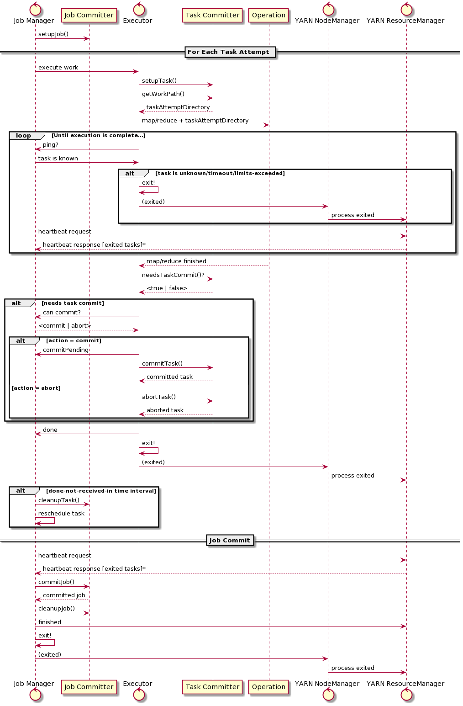
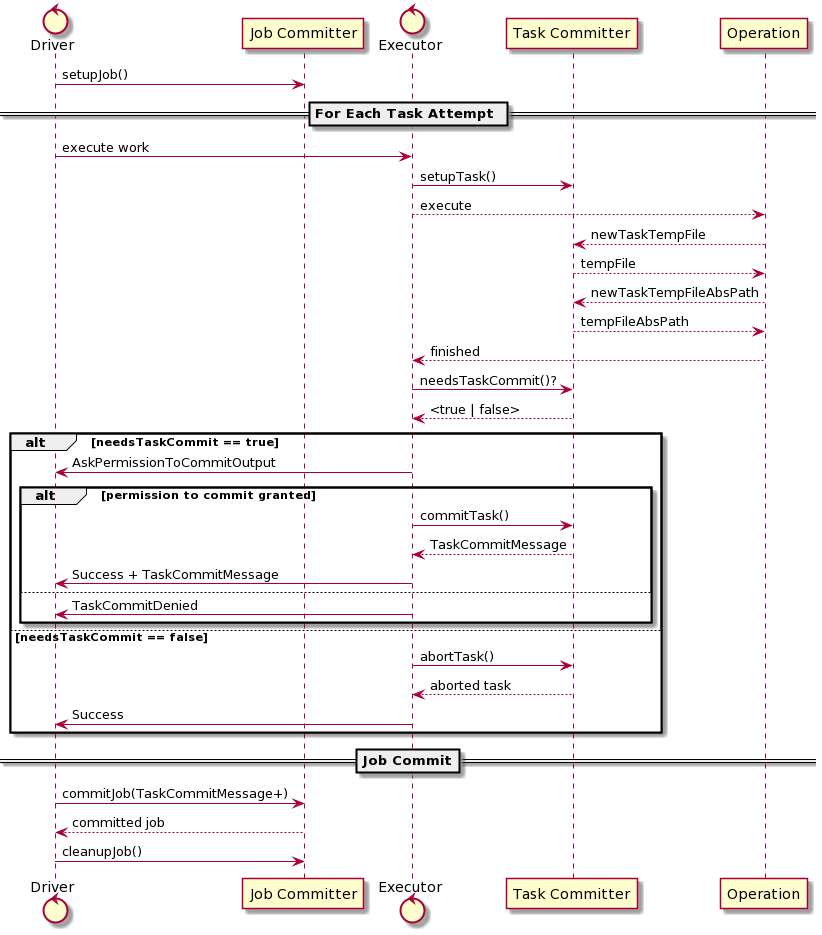

## 1 Introduction

It has long been a core requirement of "Big Data" computation platforms that the source and destination of data was a fully consistent distributed filesystem.

**Distributed**, because data needs to be readable and writable by the distributed processes executing a single query across the cluster of computers. **Consistent**, because all machines across the cluster need to be able to list and read data written by any of the others. As for "Filesystem", that's the model and API for distributed storage which developers are familiar with.

The full semantics of a POSIX filesystem are not always necessary; random write access to a file being an oft-omitted feature of the stores, forcing the persistence formats to rely purely on appending data.

What has been a critical part of the required semantics has been that the filesystem presents a model of directories and files with consistent operations to list and read those directories and their contents, with at least four atomic operations:

-   Rename of a single file to another location within the same volume.

-   Rename of a directory and its contents to another location within the same volume.

-   Create a file iff a file or directory does not exist at that part.

-   Recursive delete of a directory.

These operations are regularly used by applications as the foundational operators of higher-level co-ordination and commit protocols.

For example, the `create()` operation can be used to obtain a lock on a resource: the first process to create a file can consider itself having exclusive access to it, and so implicitly consider itself to have acquired the resource.

The `rename()` operation is generally critical to providing atomic promotion of output: a single `rename()` call can **<u>promote</u>** all in-progress output of a worker to become completed work, simply by moving all the output to a well known path. And, when the job completes, its final output may be renamed to a new location to become publicly visible.

As covered in the original MapReduce paper [@MapReduce]:

> We rely on the atomic rename operation provided by the underlying file system to guarantee that the final file system state contains just the data produced by one execution of the reduce task.

Apache Hadoop was written with its own filesystem, Hadoop Distributed File System (HDFS) [@Chansler2011].

It is <u>**self-admittedly**</u> sub-POSIX as data can only be appended directly to the end of the current file. What it does offer is the classic filesystem model of a tree of directories and files, and the atomic operations needed by MapReduce to safely use HDFS as **a destination of work**. As will be shown, some object stores do not provide the same guarantees, and so cannot be safely used as a destination with the standard protocol, even if everything *appears* to work.

## 2 The Hadoop MapReduce Commit Protocol

Before the challenge and solution of using an object store as a destination of work can be covered, the problem of outputting data from a distributed query itself must be covered, along with the existing protocols and algorithms.

### 2.1 Terminology

First, some terminology needs to be introduced to describe the protocols.

**Query**. One or more transformations of source data to a result; data presented or saved in some form. The query may be described in procedural source code, or declaratively in a form such as SQL.

**Job**. A parallelized query, composed of one or more distributed *tasks*. The output of a Job is made visible to other stages in a larger operation sequence or other applications iff the job *completes successfully*. A complex query may consist of a chain of Jobs, either executing in sequence or as a DAG of jobs.

**Job Attempt**. A single attempt at executing a job.

**Task**. Part of a job, such as a single Map or Reduce transformation applied to a fraction of the input data.

**Task Attempt**. A single attempt to complete a task on a single process running on a single host in the cluster. A task attempt is *successful* if it generates all its output without failing in some way. A task attempt has *failed* if the execution raises an exception, or if the process executing the task attempt stops communicating with the process managing the job.

Multiple attempts may be made to execute a task; sequentially, if addressing task failure, or in parallel when task attempts are executed speculatively. It is critical that only one task attempt's output is propagated to the final output of a job.

**Job Manager**. The application which schedules task attempt execution, tracks success/failures, determines when a job has been completed and publishes the results. It may also determine that a job has failed and cannot be recovered, in which case the job is aborted.

**Executor**. A process capable of executing work, as directed by the Job Manager. In Hadoop MapReduce, a unique executor is created for each partition of the data, destroyed when the processing is completed. In Spark, executors are long lived and can be allocated task attempts from multiple jobs to execute, often simultaneously.

**Job Output Directory**. The directory into which the output of a job writing to the filesystem is placed so as to be visible. After a successful job completion, the data MUST be visible in the destination directory.

**Task Working Directory**. A directory for exclusive access by a single task attempt, into which uncommitted work may be placed. All data written in and under this directory is considered the output of that task attempt.

**Task Commit**. The act of taking the output of a task attempt and promoting it to become part of the final output of the active job attempt. When the output is a filesystem, this consists of moving the files under the Task Working Directory and moving to the Job Output Directory, preserving the hierarchy of subdirectories.

**Job Commit**. The act of taking the output of all committed tasks of a job attempt, and generating the final output. This normally consists of publishing this output in an aggregate form; it can also include generating extra summary data. As this it is often a serialized operation at the end of a job attempt, its performance can be a bottleneck.

**Task Abort**. To cancel a task such that its data is not committed.

**Job Abort**. To cancel all work in a job attempt: no task's work is committed.

**Job Context**. An instance of the Java class `org.apache.hadoop.mapreduce.JobContext`, which provides a read-only view of the Job for the Job Driver and tasks.

**Task Attempt Context**. An instance of the class `org.apache.hadoop.mapreduce.TaskAttemptContext`, which provides operations for tasks, such as getting and setting status, progress and counter values.

### 2.2 Requirements of a Commitment Protocol

Apache Hadoop's MapReduce implementation is designed to support long-lived large-scale queries taking minutes to hours to complete. Its requirements include the following:

1.  Support for thousands to tens of thousands of individually scheduled *tasks* within a single *job*.

2.  Support different destinations of work, such as databases and distributed filesystems.

3.  "Correctly" propagate the output of individual tasks to the final aggregate of the job. What constitutes correctness is covered in [8](#sec:correctness){reference-type="ref" reference="sec:correctness"}.

4.  Recover from the failure of a task attempt by rescheduling the task; a new task attempt may be executed anywhere within the cluster.

5.  Support speculative execution of task attempts as a means of compensating for the delay caused by *stragglers* in the execution.

6.  Potentially: recover from a failure of a job attempt, using all the committed task output from the previous, failed attempt.

7.  Be resilient to network failures/partitions of tasks, and of the job manager itself becoming isolated from other parts of the system (<u>and hence: a second attempt at the job being started</u>).

This leads to some specific requirements of an implementation, requirements which can be used to assess its correctness.

**Independent.** Individual tasks must be able to output without directly co-ordinating that write with those of other tasks.

**Speculative tasks until committed.** Multiple tasks must be able to simultaneously execute on the same input source, to generate the required output of that part of the input. This is required for recovery, and for speculation. <u>Non requirement: idempotent output</u>; that is left to the implementors of the operations executed in the tasks.

**Scaleable communication protocol.** The commit protocol communications between task and job manager must be support tens of thousands of simultaneous tasks.

**Abortable.** It must be possible to abort an uncommitted task or job. There should be no leftover output.

**Recoverable or restartable job.** A committer can declare whether or not it supports job recovery; if it does, it must implement recovery. If not, the job must be restartable from the beginning.

An UML sequence diagram of the core commit protocol is shown as:

The commit algorithm is designed to work on the YARN cluster scheduler  [@Vavilapalli2013].

On each node in the YARN cluster, a *Node Manager* has the responsibility of launching the applications, usually within a memory-and-CPU-bounded environment. A central *Resource Manager* manages the scheduling liveness <u>and</u> monitoring of individual applications. When an application is submitted for execution, the Resource Manager schedules its root process, the *Application Master*. This communicates with the Resource Manager via an <u>**umbilical protocol**</u> which is explicitly used by the application for requesting new processes across the cluster, and implicitly used by the Resource Manager as a liveness probe of the application.

When a launched process terminates, the process exit code is passed to the *ResourceManager* within the regular status heartbeats between each NodeManager and the ResourceManager. If it is the Application Master itself which has terminated, unless it explicitly declared itself to be finished, the application is considered to have failed. All worker processes will be terminated (by default), and a new instance of the Application Master scheduled for execution. If it was a worker process, the Application Master chooses how to react.

In MapReduce, the YARN Application Master is the Job Manager, with every individual task attempt executed in a unique worker process, termed an "'executor'' in this paper. A direct RPC protocol between the Job Manager and the executors is used to manage the commit operation. Excluding process failures, all liveness detection must be performed by the Job Manager, which is done based on timeouts of this direct RPC protocol.

### 2.3 Recoverable Failure Modes

#### 2.3.1 Job Recovery

When YARN perceives the Job Manager process to have failed, it instantiates a new instance of the process somewhere within the cluster. This new Job Manager creates an instance of the specified Job Committer, and queries it as to whether job recovery is supported.

If a committer does support recovery., the state of the previous job attempt is rebuilt from reading the "Job History" file. This file is a log of the events saved during the execution, including a record of all tasks which successfully committed, and which could therefore be recovered. The Job Committer's `recoverTask(TaskAttempt)` method is called for each of these tasks. All unexecuted, uncommitted or unrecoverable tasks are scheduled for execution.

If job recovery is not support the entire job is re-executed.

As the probability of the Job Manager failing is, excluding bugs in the code itself, a function of job time, rather than scale, recovering from job failure is more important on long lived jobs ---those which last many hours.

#### 2.3.2 Bad Records

To avoid an entire task, and hence job, failing due to a single unprocesseable record, task attempts may skip records whose processing raises an exception. If the number of skipped records in a task attempt is below some threshold threshold, these records will not result in a task attempt reporting itself as having failed. This is not of direct relevance to the commit protocol except as a reason for a task attempt to fail.

## 3 Hadoop's `FileOutputCommitter`

The operations to commit the work, the Task Commit and the Job Commit, are all implemented in the same class, an implementation of `OutputCommitter`. For writing to HDFS, this is done in the `FileOutputCommitter` class.

This actually implements two separate algorithms for committing work: each with different performance and scalability characteristics.

The "v1" algorithm was designed to handle failure and recovery with an atomic task commit and the ability to explicitly recover the output generated by the committed tasks of a failed job attempt.

The "v2" algorithm was added in 2015, as its predecessor was found to have scalablity problems for jobs with tens of thousands of files  [@MAPREDUCE-4815]. While the v2 algorithm can deliver better performance, it comes at the price of reduced isolation of output.

1. **v1.** When a task attempt is committed, its task working directory is renamed into the job attempt directory. When the job attempt is committed, all committed task directories are merged (serially) into the job output directory. A restarted job move the directories of committed tasks from the previous attempt, so recovering their output.
2. **v2.** When a task attempt is committed, its output is immediately merged into the job output directory; the job commit operation does nothing but create a marker file. This is faster, but intermediate work is visible. The task commit operation is no longer atomic, changing failure modes.

### 3.1 Common Variables

Table 1: Variables used in the algorithms
| name                | meaning                                                      |
| ------------------- | ------------------------------------------------------------ |
| ***fs***            | Destination filesystem                                       |
| ***destPath***      | Job Output Directory in the destination filesystem.          |
| *jobId*             | Numeric Job ID ≥ 0; expected to be unique for all application instances in the cluster. |
| *jobAttemptId*      | *JobID*$*counter*; Counter starts at 0 for a job and increments on each attempt. |
| *jobAttemptPath*    | a path under which a job attempt may store any data.         |
| *partId*            | Numeric value of partition of data to be allocated to a task. |
| *taskId*            | *jobAttemptId*$*partId*; the task which works on part *partId* in the job attempt. |
| *taskAttemptId*     | *taskId*$*counter*; a single attempt to execute a task.      |
| *taskAttemptPath*   | a path under *jobAttemptPath* into which a task attempt may write uncommitted data. |
| *taskCommittedPath* | a path under *jobAttemptPath* where the contents of *taskAttemptPath* are moved when that attempt is committed. |

For a Job Attempt `jobAttemptId` to be successful, all parts of the dataset must be processed in one or more successful tasks. <u>**The output of exactly one task attempt for each task must be in the final dataset**</u>.

The function of a commit algorithm, then, is to guarantee that this condition is met, even in the presence of failures. It is not a requirement for an algorithm to be able to recover from all failures; it may react to some failure conditions by failing the entire job.

It is also not a general requirement that if a job fails, the job output directory must be unchanged. Together, this implies that <u>**at-most-once**</u> semantics are required, and that the task of handling job failures is to be handled by a higher-level workflow.

### 3.2 Hadoop V1 commit algorithm

**Job Setup**

This creates the path `jobAttemptPath`, under the directory `_temporary` of the output directory `destPath`.

| Procedure `setupJob`                                         |
| ------------------------------------------------------------ |
| `jobAttemptPath` $\longleftarrow$ `destPath/_temporary/jobAttemptId` `mkdir (fs, jobAttemptPath)` |

Note Hadoop has a convention that all paths starting with "\_" are not considered "visible"; everything under this directory is excluded from normal listings of the destination path. Creating all intermediate files in a subdirectory of the destination directory provides an implicit guarantee that the data is created in the same volume (in a multi-volume filesystem), and in the same encryption zone, for any HDFS cluster with encryption enabled.

**Task Setup**

The task attempt is given a directory under the job attempt path as its task working directory.

| Procedure `setupTask`                                        |
| ------------------------------------------------------------ |
| `taskAttemptPath` $\longleftarrow$ `jobAttemptPath/taskAttemptId` |

The actual directories are created on demand.

**Needs Task Commit**

> A commit is required iff data was generated.
>
> | Function `needsTaskCommit`   |
> | ---------------------------- |
> | `exists(fs,taskAttemptPath)` |
>
> This is somewhere where any eventual consistency of object listings in an object store can generate a false "no data to commit" negative result.
>

**Needs Task Commit**

只有生成了数据，才需要提交。

| Function `needsTaskCommit`   |
| ---------------------------- |
| `exists(fs,taskAttemptPath)` |

**如果对象存储的对象列表在这里存在最终一致性，会生成无数据可提交的错误结果**。

**Task Commit**

A task attempt is committed simply by renaming the task attempt working directory into the job attempt directory.

| Procedure `commitTask`                                       |
| ------------------------------------------------------------ |
| `if exists(fs,taskAttemptPath) then`     `delete(fs, taskCommittedPath, recursive)`     `rename(fs, taskAttemptPath, taskCommittedPath)` `end` |

In a true file system, the rename is an $O(1)$ atomic operation.

**Task Abort**

Abort a task attempt by deleting its task attempt path.

| Procedure `abortTask`                                        |
| ------------------------------------------------------------ |
| `delete(fs, taskAttemptPath, recursive)` |
On a genuine filesystem this is an $O(1)$ operation.

**Job Commit**

A Job is committed by merging all files/directories in from all the task committed paths into final job output directory. Optionally, it can create a zero-byte '`_SUCCESS` ' file in the output directory.

| Procedure `commitJob`                                        |
| ------------------------------------------------------------ |
| `for committedTask in listFiles(fs, jobAttemptPath) do`         `mergePathsV1 (fs, committedTask, destPath)` `end` `touch(fs, destPath/_SUCCESS)` `delete (fs, _temporary)` |

The `mergePathsV1(FileSystem, Path, Path)` procedure is a recursive move of all the output of a committed task into/underneath. the destination directory.

| Procedure `mergePathsV1(fs, src, dest)`                      |
| ------------------------------------------------------------ |
| `if isFile(fs, src) {`     `if exists(fs, dest) {`         `delete(fs, dest, recursive)`      `}`      `rename(fs, src, dest)` `} else {`      `if exists(fs, dest) {`          `if isFile(fs, dest) {`              `delete(fs, dest, recursive)`              `rename(fs, src, dest)`           `} else {`               `for f in listFiles(fs, src) {`                    `mergePathsV1(fs, f, dest + f.name)`                `}`           `}`      `} else {`         `rename(fs, src, dest)`      `}` `}` |

All the files and directories are promoted to the destination directory.

1.  If the calculated destination path of a source file or directory does not exist, the source files/directory renamed.
2.  If the destination path does exist and is a file, it is deleted and then the source files/directory renamed.
3.  If the destination path exists and is a directory, and the source is also a directory, then `mergePathsV1` is applied to the child entries of the source path.

Together, it forms a depth-first overwrite of the source tree by the destination tree, specifically merging the contents all directories. The time to execute the merge depends on the number of source entries and the state of the destination directory. If it fails, the state of the operation is unknown: it cannot simply be repeated.

| Function `v1.isCommitJobRepeatable`   |
| ---------------------------- |
| `false` |
Accordingly: if a job attempt fails during the commit process, it is unrecoverable: the subsequent attempt reports an error and aborts.

| Procedure `v1.abortJob`                 |
| --------------------------------------- |
| `delete(fs, jobAttemptPath, recursive)` |
A job attempt can be cleaned up by deleting the output of all job attempts which may have been made. This can be achieved by deleting the entire `_temporary` directory under the destination directory.

| Procedure `cleanupJob`                 |
| --------------------------------------- |
| `delete(fs, destPath/_temporary, recursive)` |
This would break with any other ongoing job which is writing to the same destination directory. It is a requirement that only one job may be actively writing to a specific destination, something which is checked for during job submission.

**Job Recovery**

The v1 committer can recover from a failed job attempt, with the second attempt being able to reuse the output of all committed tasks from the previous attempt.

This job whole attempt recovery process is a complex one; from the perspective of the committer, if the task attempt was committed in the previous job attempt, the `taskCommittedPath` of the previous attempt can be moved under the `jobAttemptPath` of the new job attempt.

| Procedure `isRecoverySupported`                 |
| --------------------------------------- |
| `delete(fs, destPath/_temporary, recursive)` |

| Procedure `recoverTask(TaskAttemptContext)`                  |
| ------------------------------------------------------------ |
| `previousJobId = jobId - 1` `previousJobAttemptDir = getJobAttemptPath(previousJobId - 1)` `delete(fs, destPath/_temporary, recursive)` |

The only lost work is that of all in progress task attempts ---those which had generated data but were not yet committed.

When working with HDFS, the main limitation of this algorithm is one of scale: job commit is an $O(tasks)$, with the time for each task's merge being a function of the number of files and the depth of the directory tree.

As this is serialized at the end of the job, irrespective of how many workers there were, the job commit is a single point of delay, and of failure. The more tasks, the more work to commit, the longer the commit, and the higher risk of that failure.

### 3.2 Hadoop V2 commit algorithm

The v2 commit algorithm propagates the task attempts output into the job's output directory in the task commit. This is done in a variant `mergePaths()` algorithm [v2](), designed to support parallel writers to the output directory. In the Hadoop source the two algorithms are intermixed within a pair of co-recursive procedures; they have been isolated here for clarity.

| Procedure `mergePathsV2(fs, src, dest)`                      |
| ------------------------------------------------------------ |
| `if isFile(fs, src) {`     `if exists(fs, dest) {`         `delete(fs, dest, recursive)`      `}`      `rename(fs, src, dest)` `} else {`      `if exists(fs, dest) {`          `if isFile(fs, dest) {`              `delete(fs, dest, recursive)`              `mkdirs(fs, dest)`              `for c in listFiles(fs, src) `                  `mergePathsV2(fs, c, dest + c.name)`           `} else {`               `for c in listFiles(fs, src) `                    `mergePathsV2(fs, c, dest + c.name)`           `}`      `} else {`          `mkdirs(fs, dest)`           `for c in listFiles(fs, src) `                `mergePathsV2(fs, c, dest + c.name)`      `}` `}` |

Here, the `rename()` operation is restricted to committing a single file: whenever a directory is to be committed, it is done as a recursive merge. This is necessary because multiple tasks may be committing simultaneously, tasks which may be writing to the same destination. The atomic exclusivity of a directory rename is precisely what is not wanted when trying to support multiple tasks merging their output into the same directory tree.

Performance-wise, the `mergePathsV2` operation is slower than the v1 algorithm whenever there are directories to commit. Yet, because these operations are taking place in task commits, work is parallelized across the cluster, and, often, not directly slowing down the overall job.

With the file propagation taking place in the tasks, the job commit operation is reduced to creating the `_SUCCESS` file and cleaning up working directories:

| Procedure v2 `commitJob`                                     |
| ------------------------------------------------------------ |
| `touch(fs, destPath/_SUCCESS)` `delete (fs, _temporary)` |

As a result, the time to commit a job is barely measurable.

In terms of failure resilience, the v2 algorithm is weaker than the v1 algorithm. Task commit is now a non-atomic operation; It is therefore not possible to safely recover from the failure or loss of a task attempt while it was committing work.

Because the output of committed tasks are visible, if the job fails the contents of all committed tasks are visible.

This commit algorithm has chosen speed over resilience.

This is often a valid decision to make, however, the callers of the committers need to be aware that this decision has been made, and that failures in certain parts of the process, specifically task commit, are not recoverable.

### 3.3 Limitations of the Hadoop MapReduce Commit Protocol
Alongside some implementation details, such as the fact that a task process will be exit without calling `cleanupTask()` once <u>it is informed that it is unknown</u>, we have to consider: are there any fundamental issues with the Hadoop commit protocol?

A key weakness is that the job committer is not passed the list of task attempts considered successful, and, from those committed tasks, their lists of files which were committed.

The committers themselves have to implement some mechanism to enumerate those committed tasks.

The File Output Committer does this through the filesystem, relying on consistent directory listings to enumerate task output to merge, and, for the v1 algorithm, to enumerate the set of committed tasks whose output must be published during job commit. This places a requirement for the filesystem metadata listings to be consistent, a requirement not met by all not object stores.

As no list of completed tasks is directly passed to the `commitJob` operation, the job committer cannot determine whether the actual committed output in the filesystem is correct.

There also appears to be a race condition between verification that the destination directory does not exist in the the client-side job submission, and the creation of that directory during the `setupJob()` operation. In a busy cluster there can be a delay between the scheduling of the job and its application manager actually starting to execute... a second, conflicting, job may also be scheduled at this point. If the destination directory were to be created during job submission, this window would be nearly completely eliminated.

## 4 The Spark Commit Protocol
Apache Spark's execution model is significantly different from that of Hadoop. Rather than dedicating a single process to executing a single operation across a subset of the source data, Spark creates a set of *Executors*, each of which can execute task attempts across a number of threads. As a result, a single executor may be executing many task attempts simultaneously, with each task's commit operations being centrally managed by the single Job Manager.

When a failure of an executor is detected by loss of its heartbeat, all active tasks will be rescheduled. As the failure may be a network partition, multiple task attempts may be active simultaneously. It is therefore a requirement that no data is promoted until a task attempt is actually committed.

Spark can use the Hadoop Committers within its commit protocol, which is usually done whenever writing data to HDFS or other cluster filesystem.

Spark manages its requirement of "only one task attempt may be committed" in its `OutputCommitCoordinator` class; an instance of this in the driver tracks the state of all active task attempts and grants or denies permission to commit.

A task attempt is only granted permission to commit if a set of conditions are met[^1]:

1.  The task attempt is not recorded as having failed.

2.  The task attempt is in the set of known-to-be active tasks

3.  <u>Either the requesting task attempt has already been granted this permission, no task attempt has been granted permission to commit, or a previous task was granted permission, but it is considered to have failed</u>.

That is: it must be a valid task attempt and no other task attempt can be actively committing or have committed this task.

The Executor requests this permission to commit via an RPC call and will proceed with the commit when it receives a successful message. A timeout on the RPC channel or a denial of commit permission will result in `abortTask()` being invoked.

Once a task attempt has been granted permission to commit, then no other attempt will be granted unless the first attempt is reported as having failed.

> - [ ] `OutputCommitCoordinator` reacts to task events from the scheduler, but does that cover executor failure?

Spark makes no attempt to recover from a failed Job Manager; its mechanism for recovering from a failed job is "rerun the entire query".

One area where Spark goes beyond Hadoop's protocol is that it adds a new operation to request a file with an absolute path, `newTaskTempFileAbsPath()`. It is needed to address the special case of Apache Hive, wherein some parts of the dataset are written to different locations than under the destination directory of a job. The operation, having calculated the absolute destination of the output, requests a temporary file which will be placed in the final destination directory on a job commit.

Spark implements this operation atop the standard `FileOutputCommitter` as follows:

1. An “absolute path staging directory” is created under the job output directory; this is `_temporary-$jobId`.

2. When a `newTaskTempFileAbsPath()` is invoked, a path under this directory is generated, with a `UUID` in the filename.

3. The mapping of absolute path to temporary file is stored in a map in the Task Committer.

4. In the `commitTask()` operation, the map of all files to rename is passed back.

5. In `commitJob()`, after invoking the Hadoop committer’s `commitJob()` call, all files in the aggregate map of files to rename to absolute paths is iterated through. Each file is renamed to its final path, in turn.

6. Task abort will delete files of that task, while Job abort will delete the whole absolute path staging directory.

This is extra operation is currently only used in that specific use case, "Hive table with partitions elsewhere in the same filesystem as the active job". This is not a common use case, at least with data stored in object stores. Accordingly, our new committers do not support this operation [^2].

Spark is more flexible in its commit protocol, because the name for a file is generated by the committer, not the application, and because successful task committers can pass arbitrary serialized data back to the driver, for use in the Job Commit operation. This could potentially be used as the sole mechanism for passing a list of written files from the task attempts to the job committer. <u>Being able to generate names (albeit while preserving a sort order), could also be potentially useful. We have initially chosen to not explore this as a commitment strategy; others may wish to do so</u>.

### 4. 1 Limitations of the Spark Commit Protocol

The standard commit coordination in the Spark Driver is with the `OutputCommitCoordinator`. this class's state includes tracking whether or not a task attempt has been granted permission to commit its work. Once one task attempt has been granted permission to commit, all other task attempts for the same task will be denied. However, if the task attempt granted permission to commit its work fails for any reason, the attempt is considered a failure, and another attempt will be granted permission to commit its work.

This strategy works, provided task commit is a repeatable operation, even if the first attempt has failed or become partitioned from the Spark Driver. That requirement is met for the `FileOutputCommitter` v1 algorithm, but possibly not by the v2 algorithm, or, potentially, others. If committers could declare their ability to recover from failed task commits, along with other aspects of their operation, the `OutputCommitCoordinator` would be able to decide whether a repeated attempt were permitted, or whether failing the Job was the safer outcome.

Unlike the Hadoop protocol, there is no requirement for the Spark Driver to have received a recent liveness check from the cluster scheduler. Unless the Spark Driver process exits once it determines that it has been isolated from any underlying cluster scheduler, there is a risk that a partitioned Spark cluster may commit a job to the same destination as a cluster instantiated as a replacement. Careful review of the YARN and Mesos integration code is required to be confident that this risk does not exist.

Spark's commit protocol permit task committers to return data to the Job Committer in the Spark Driver; it would be possible to use this to validate the output of the tasks. The current committer implementations do not do this, but at least the underlying protocol makes such an improvement possible.

## 5 The Challenge of Object Stores
Having introduced the classic filesystem and the commit protocols and algorithms used to commit the output of distributed computation, let us consider Object Stores such as Amazon S3, Google Cloud Storage and Windows Azure Storage [@AWS-S3-intro; @Calder11]().

The most **salient** point, is this: Object Stores are not filesystems. Rather than the classic hierarchical view of directories, subdirectories and paths, object stores store a set of objects, each with a unique key; a sequence of characters provided when the object was created. Classic path separators "`/`" are invariably part of the set of valid characters, so allowing objects to be created which have the appearance of files in a directory.

As examples, the following are all valid keys on the Amazon, Google and Microsoft stores

 /entry
 /path1/path2/path3
 /path1/
 /path1

More subtly, it is valid for an object store container (on S3:, a "bucket") to have objects with all of these names simultaneously. It is not an error to have an object whose key would make it appear to be "under" another object, nor to explicitly contain path entries separators.

Objects cannot generally be appended to once created, or renamed. They can be replaced by new objects or deleted. Some form of copy operation permits an object to be duplicated, creating a new object with a different key. Such copy operations take place within the storage infrastructure with a copy time measurable in megabytes/second.

The set of operations offered are normally an extended set of HTTP verbs:

PUT:   Atomic write of an object

GET:   retrieve all or part of an object

HEAD:   retrieve the object metadata

LIST:   list all objects starting with a given prefix

COPY:   copy a single object within the store, possibly from other containers.

DELETE:   Delete an object

There are usually two extra operations to address scale: a bulk delete call which may have partial failures, and *Multipart Upload*; a way to upload an object larger than the 5GB which a single HTTP POST can support. The exact nature of multipart uploads varies from store to store. For Amazon this is initiated as a sequence of POST calls, one to initiate, one or more POST calls with data, and a final POST listing the (ordered) etags of the uploaded object parts. All but the last upload in the object must be 5 MB or larger

Object store implementations can display different levels of inconsistency. Windows Azure Storage is fully consistent; Amazon S3 offers create consistency on new objects, but not updated or deleted ones. It also exhibits listing inconsistency, wherein a newly created object may not be visible in the results of a `LIST` call, or a newly deleted object still be listed as present.

Despite the clear mismatch between the capabilities and APIs of object storage, and that expected of a Hadoop filesystem, they have one key thing in common: they can store Petabytes of data. For that reason, all the popular cloud storage infrastructures have connectors from Hadoop, and thus transitively application such as Apache Hive, Apache HBase and Apache Spark. Many of these are developed within the Apache Software Foundation's own source repository, including the Azure "wasb" connector and the "s3a" connector to Amazon S3. Others are maintained externally ---particularly Amazon EMR's own "EMRFS", known by the `s3` URL schema, and the Google Cloud Storage connector, `gcs`.

Irrespective of where they are implemented, they all share a common objective: trying to maintain the filesystem metaphor atop an object store.

As an example of a simple case, the `getFileStatus()` call mimics a directory, in conjunction with zero-byte "empty directory" markers, so must look for a file, then a marker and the most expensive operation, a path listing.

   GET path
   GET path/
   LIST path/

The performance differences of every HTTPS request slows down all RPC operations, even with pooled collections: even this simple probe can for a file take hundreds of milliseconds. Other mimicked operations have similar costs.

Operations upon directories are mimicked by listing all objects under that path, and acting upon those objects individually. A recursive delete is implemented as a listing of the maximum number of files returned in one HTTP request (5000 or a similar value), then either issuing bulk DELETE operations, where supported, or falling back to individual DELETE calls. Bulk LIST/DELETE operations have a cost of one HTTP request/page size, such as $O(1 + descendants/5000)$; if sequential delete operations must be issued, then the cost is at least $O(1+ descendants)$, with the "at least" qualifier being added because request throttling can slow down the requests even further.

File and directory renaming is even more expensive. A file rename is implemented as a copy of the original data to a new path, followed by a delete of the original data. This makes the time to copy a single file an $O(length(file))$ operation [^3].

Directory rename is a paged listing of all children, and a copy and delete for each, which makes its duration a function the number of files and total amount of data.

These are the **tangible** performance issues, the ones which are most visible to users. However it is the fact that the atomicity behaviors of a POSIX filesystem are not provided which are most dangerous.

The `rename()` call is no longer atomic: two clients may start renaming into to the same destination directory. Furthermore, if any rename fails, the state of the source and destination directory is unknown: the data may be spread across both locations. Finally, because the files to be copied is determined from a LIST call, if the object store is not consistent, the listing can be incomplete or out of date. Newly created files may not be visible, so not copied as part of the rename operation.

*Directory rename cannot be used in a commit algorithm which requires atomic, exclusive or consistent renames*.

The `create(path, overwrite=false)` operation is also flawed. This is expected to be an atomic operation to immediately create a file iff there is no entry at that path; Instead may be mimicked by a sequence of the `getFileStatus()` call and the creation of a buffer on the client side for the output: the data will not be visible until the data is completely written and the stream closed. As a result, it is impossible to use file creation as a means of creating any form of lock or exclusive access in such a store.

Returning to the MapReduce v1 and v2 commit algorithms, they are unsuitable for use in any object store without atomic renames (v1), consistent directory listings and existence checks (v1 and v2).

As a result, neither can be used directly against Amazon S3 today. With a consistent metadata layer such as S3mper or S3Guard, the v2 algorithm can be used, though its task commit time will be $O(data)$ [@S3mper; @HADOOP-13345].

Providing a safe, performant output committer for object stores forces us to leave the metaphor of a filesystem behind, and embrace the capabilities of object stores themselves.

## 6 The new S3A Committers: working with S3 from the outset

Given that S3 does not deliver the safe and performant operations which the file committers expect, how can Hadoop and Spark jobs safely use it as a destination of their work?

This is the problem solved by the new `S3A committers`. These are called as they are closely integrated with Hadoop's S3A connector to S3, using the **==multipart upload==** operation to decouple writing the data from <u>manifesting it</u> at its final destination.

Multipart upload is already used for writing large files to the object store. When a file is written, it is initially buffered to disk or memory, when the buffer size reaches some threshold the upload is initiated, and first block uploaded in a `POST` operation. S3's response to the POST operation is an MD5-checksum of the uploaded data, the `entity tag`, as used in existing HTTP operations. After all the blocks of a stream have been uploaded, the ordered list of entity tags is POSTed to S3 in a final request completing the MPU. It is only after this final POST that the uploaded object is manifest in S3. If this final POST operation can be used to commit the output of a task, then the committer has atomic and effectively O(1) operation for each file.

The challenge for an S3 committer then becomes one of: how to have user code write to the destination directory, preserving and propagating the lists of MPUs to finally commit in the job commit operation?

**That is the challenge addressed in the two committers.**

Underneath, they both use the same methods offered by the S3A connector, and the same persistent data formats to propagate the lists of pending uploads. Where they differ is how tasks write data, and how the lists are passed to the job committer.

In the `Staging Committer`, each task attempt writes its data into the local filesystem of the server on which the attempt is executed. When a task attempt is committed, its data is uploaded to the final paths on S3. The manifest of the pending MPUs is passed to the job tracker via a shared consistent cluster filesystem (usually HDFS), *using the v1 File Output Committer*. When the Hadoop or Spark job is committed, the Staging committer reads in from HDFS the manifests written of the committed task attempts, and completes the uploads listed therein.

Performance-wise, all the data is uploaded to its final destination in the task commit, with the job commit being the time to execute the v1 commit operation within HDFS, followed by that of a POST call per uploaded file.

The `Magic Committer` works within the S3A `filesystem connector`, changing how files are incrementally written to S3. Rather than completing a multipart upload when the output stream being written by a task is closed, in the process doing the writing, the magic committer delays the final POST until the job is committed. <u>Instead it writes a manifest describing the upload to S3. When the task is committed, all the single file manifests of that attempt are aggregated into a single manifest for the task attempt, which is then PUT to S3 in the directory of completed tasks. The Job commit process is one of reading in the manifests of all committed tasks, and as with the Staging Committer, completing their uploads</u>.

Because of its incremental upload of blocks of the output data, the magic committer promises faster uploads of larger datasets: there is no need to postpone the upload to S3 until the task is actually committed. Because it does not buffer any data other than the yet-to-be-written blocks, the amount of local storage is reduced, so potentially avoiding running out of local disk capacity.

> and/or allow for VMs with less virtual disk to be used.

### 6.1 The Staging Committer

The staging committer declares the working directory of a <u>task attempt</u> to be in the local filesystem, the directory `workPath`. It is this which is returned in the method  `PathOutputCommitter.getWorkPath()`, which is then used in `FileOutputFormat` to provide the paths which callers use when creating files in a task attempt.

Table 2. Extra variables used by the staging committer
| name                     | meaning                                     |
| ------------------------ | ------------------------------------------- |
| $localfs$                | The local "file:" filesystem                |
| $localAttemptPath$       | A local filesystem path                     |
| $clusterfs$              | The cluster filesystem                      |
| $wrappedCommitter$       | The committer for the cluster filesystem.   |
| $clusterJobAttemptPath$  | the job attempt path of $wrappedCommitter$  |
| $clusterTaskAttemptPath$ | the task attempt path of $wrappedCommitter$ |

**Job Setup**
The cluster-filesystem committer, `wrappedCommitter`. is created and initialized, configured to use a unique path within the cluster filesystem as its `clusterJobAttemptPath` output directory. This committer will have its own job attempt and task attempt directories. This committer is set to use the `v1` commit algorithm.

| Procedure `StagingCommiter.setupJob`                         |
| ------------------------------------------------------------ |
| `jobUUID`  $\longleftarrow$ `newUUID` `clusterJobAttemptPath` $\longleftarrow$ `tempDirForStaging` + `getUsername` + `jobUUID` `taskAttemptPath` $\longleftarrow$ `jobAttemptPath/taskAttemptId` `wrappedCommitter.setupJob(clusterJobAttemptPath)` |

**Task Setup**
| Procedure `StagingCommiter.setupTask`                        |
| ------------------------------------------------------------ |
| `taskAttemptPath` $\longleftarrow$ `jobAttemptPath/taskAttemptId` `localAttemptPath` $\longleftarrow$ `uniquePath(localfs, taskAttemptId)` `clustertaskAttemptPath` $\longleftarrow$ `clusterjobAttemptPath` + `taskAttemptId` `wrappedCommitter.setupTask(clusterTaskAttemptPath)` |

The function `uniquePath(filesystem, taskAttemptId)` is required to return a unique path in the local filesystem for a task attempt. It does this under the local `/tmp` directory, which is where large intermediate datafiles are stored during MapReduce operations. A well managed Hadoop cluster has this temporary data stored on a non-root volume, along with a regularly scheduled job to delete old temporary files.

This local `filesystem` is returned by the committer's `getWorkPath()` method.

| Function StagingCommiter.getWorkPath |
| ------------------------------------ |
| `return localAttemptPath`            |

This is the crux of the algorithm.

The working path returned to the task attempt execution code in MapReduce and Spark is a `file://`-prefixed local directory, not one in the object store. The task attempt commit process is where these will be uploaded, and the job commit where the uploads are materialized.

**Needs Task Commit**

A commit is required iff data has been generated in the local filesystem.

| Function StagingCommiter.needsTaskCommit   |
| ------------------------------------------ |
| `return exists(localfs, localAttemptPath)` |

**Task Abort**

A task attempt is aborted by deleting all staged data, and aborting the wrapped committer's task.

| Procedure `StagingCommiter.abortTask`                        |
| ------------------------------------------------------------ |
| `delete(localfs, localAttemptPath, recursive)` `wrappedCommitter.abortTask()` |

**Task Commit**

If a task attempt is given permission to commit its output, it does so by initiating multipart uploads of all files under `localAttemptPath` to the <u>final destination directory</u>, uploading the data, but not completing the operation.

| Procedure `StagingCommitter.commitTask`                      |
| ------------------------------------------------------------ |
| `wrappedCommitter.commitTask()` $U \longleftarrow \emptyset$ `for f in listFiles(localfs, localAttemptPath) do {`         $U\longleftarrow U$ + `{uploadFileToPendingCommit(f , destPath)}` `}` `savePendingSet(clusterfs, clusterTaskAttemptPath, U)` |

The information needed to complete these pending uploads are then saved as a manifest file to `clusterTaskAttemptPath`, after which the wrapped committer has its `commitTask()` operation called. This will rename the saved file into the job attempt directory with the filename of the actual task., that is `$clusterJobAttemptPath/$taskId`.

**Job Commit**

The Job commit process manifests the pending uploads.

The list of uploads is found by listing the files in the cluster job attempt path. This is the directory into which the pending set files of task attempts are renamed during their task commits.

| Procedure `StagingCommitter.commitJob`                       |
| ------------------------------------------------------------ |
| $Pending \longleftarrow \emptyset$ `for f in listFiles(clusterfs, clusterJobAttemptPath) do {`         $Pending \longleftarrow Pending$ + `loadPendingSet(clusterfs, f)` `}` `checkForConficts(fs, Pending)` `for p in Pending do {`         `completeUpload(p)` `}` |

The `completeUpload()` operation completes the upload of a file by POST-ing a complete-multipart-upload requesting list the ordered MD5 checksums of every block previously uploaded.

Note that `wrappedCommitter.commitJob()` is not invoked; because the location of the pending set files of this job attempt is known, they can be read directly. This is a minor optimization.

**Job Abort**

To abort an entire job, the set of pending uploads must be enumerated as per job commit, only now the jobs are aborted.

| Procedure `StagingCommitter.abortJob`                        |
| ------------------------------------------------------------ |
| $Pending \longleftarrow \emptyset$ `for f in listFiles(clusterfs, clusterJobAttemptPath) do {`         $Pending \longleftarrow Pending$ + `loadPendingSet(clusterfs, f)` `}` `for p in Pending do {`         `abortUpload(p)` `}` `wrappedCommitter.abortJob()` |

**Job Cleanup**

To clean up a job all incomplete uploads targeted at or under the output directory must be enumerated and aborted, which can be done with a POST to S3 to list the outstanding uploads, and another POST per upload to abort.

Local task attempt directories must be deleted, as well as those in the shared cluster.

| Procedure `StagingCommitter.cleanupJob`                      |
| ------------------------------------------------------------ |
| `for f in listPendingUploads(destPath) do {`         `abortUpload(f)` `}` `delete(localfs, localdirectoriesforjob, recursive)` `wrappedCommitter.cleanJob()` |

As those local task attempt directories are local to the nodes executing individual tasks, they will not be deleted in the job cleanup, except for those tasks which were executed on the same host as that where the `cleanupJob()` operation is invoked.

#### 6.1.1 Enhancing conflict resolution for a zero-rename workflow

One aspect of the commit algorithm omitted is how this committer resolves conflict with existing files. The `FileOutputCommitter` algorithms fail if there is destination data; they are required to have an empty output directory.

The Staging Committer supports alternative policies, and may be configured to overwrite or add to data in the destination directory. To guarantee that newly added files have unique names, the uploaded files can have a unique ID inserted in their filenames.

One conflict resolution option is targeted explicitly at Spark SQL queries writing output in the layout structure popularized by Apache Hive, wherein different levels in the directory tree are used to partition data.

For example, data could be partitioned by year, month and day, such as `/data/YEAR=2017/MONTH=12/DAY=21/`. Partitioning increases query performance where only select field ranges are used; any query of December 2017 only needs to look under all subdirectories of `/data/YEAR=2017/MONTH=12/`, ignoring all adjacent directories.

Often large datasets like these are built up over time, with nightly or hourly results being added. In a traditional workflow, this is normally by done by executing the new query into an empty directory, then, once the job has succeeded, moving the new data into the aggregate dataset through 'rename()' operations. This generate-then-rename strategy ensures that if a job fails, no matter when it happened, original dataset is unchanged, and that applications can continue to use the current set of files.

In an object store, that rename operation is of course, another expensive copy operation, with its own failure modes.

What to do?

The solution as developed and utilized at Netflix is to have a special mode of the committer, "**Partitioned**", which expects all data to be written into one or more subdirectories of a partitioned dataset, a dataset which may already exist in the destination directory.

Conflict resolution is scoped purely to that of the destination partitions, ignoring all other partitions in the existing dataset. In the Job Commit operation, the "fail" conflict option will only fail if there are existing files in the partitions to which new files are added; the "overwrite" option will cause the existing files in the destination partitions to be deleted.

Thus, "the Partitioned Staging Committer" permits jobs to be run with their destination set to the actively shared dataset, while existing work queries can be run across the data. By eliminating the need to copy data at the end of an isolated query, it can speed up a workflow of execute-then-rename.

### 6.2 The Magic Committer

Rather than stage data in the local filesystem, the magic committer allows task attempts to write directly to the object store as delayed multipart uploads.

One challenge of the committer is : how to determine when a client wants to initiate a delayed-visibility write operation?

Whenever a file is written to a directory under the path `__magic`, it is considered to be a delayed write operation. The relative path under the this directory is mapped as being relative to the job's destination directory ---the parent directory of the `__magic` path.

To support multiple job and task attempts, the output of every task attempt must be written as to be relative to the Job's destination directory. Accordingly, whenever a directory with the name `__base` is encountered, it declares that its contents must be mapped relative to the destination directory.

Table 3. Example magic path mappings original
| original                             | final                                |
| ------------------------------------ | ------------------------------------ |
| dest                                 | dest                                 |
| dest/__magic/1                       | dest/1                               |
| dest/__magic/1/2                     | dest/1/2                             |
| dest/__magic/job1/task003/__base/3   | dest/3                               |
| dest/__magic/job2/task004/__base/4/5 | dest/4/5                             |
| dest/__magic/1/2.pending             | dest/__magic/1/2.pending             |
| dest/__magic/job1/task003.pendingset | dest/__magic/job1/task003.pendingset |

When the a magic output stream is closed, the manifest of the single upload is saved to a `.pending`-suffixed file saved under the `__magic` path, **<u>along with a 0-byte marker file of the original path</u>**. The latter is required to satisfy applications which verify the existence of their written file.

When a task attempt is committed, all `.pending` files under its task attempt directory are listed and saved into a single `.pendingset` file into the job attempt directory.

When the job is committed, all `.pendingset` files in its job attempt directory are loaded, and the outstanding uploads listed therein committed.

Because of its use of list operations to enumerate uploads to commit, this committer needs consistent metadata listings of the object store. This is provided by the S3Guard extension to S3A [@HADOOP-13345](), which uses **Amazon's DynamoDB** database for the consistent metadata view. This significantly speeds up the listing operations, so speeding up the task and job commit operations.

Table 4. Extra variables used by the magic committer
| name            | Meaning             |
| --------------- | ------------------- |
| ***magicPath*** | The magic directory |

**Job Setup**

| Procedure `MagicCommitter.setupJob`                          |
| ------------------------------------------------------------ |
| `magicPath`  $\longleftarrow$ `destPath/__magic` `jobAttemptPath` $\longleftarrow$ `magicPath/jobAttemptId` `taskAttemptPath` $\longleftarrow$ `jobAttemptPath/taskAttemptId` `mkdirs(fs, jobAttemptPath)` |

**Task Setup**

| Procedure `MagicCommitter.setupTask`                         |
| ------------------------------------------------------------ |
| `taskAttemptPath` $\longleftarrow$ `jobAttemptPath/taskAttemptId` `mkdirs(fs, taskAttemptPath)` |

**Needs Task Commit**

A commit is required iff files are pending, which is true if there are files to upload.

| Function `MagicCommitter.needsTaskCommit` |
| ----------------------------------------- |
| `return exists(fs, taskAttemptPath)`      |

This will return true even if there are no `.pending` files under the task attempt path. A full path listing could determine this, but as this itself is potentially a slow operation, we have omitted it, relying on the task commit process to handle the case of no output being generated.

A task attempt is committed by listing all the single `.pending` files under a the task attempt directory, reading in the contents and merging it into the set of all pending uploads initiated by this task attempt. This file is then saved as a `.pendingset` file into the job attempt directory, which is still in the `__magic` directory.

| Procedure `MagicCommitter.commitTask`                        |
| ------------------------------------------------------------ |
| $Pending \longleftarrow \emptyset$ `for f in listFiles(fs, taskAttemptPath, recursive) do {`         $Pending \longleftarrow Pending$ + `{loadPendingFile(fs, f)}` `}` `savePendingSet(fs, jobAttemptPath + taskId, Pending)` |

Because the `.pendingset` file is written in a single atomic PUT, the commit of an individual task attempt is atomic.

<u>If there are no .`.pendingset` files, the saved `.pendingset` file will simply contain an empty list of pending uploads.</u>

**Task Abort**

A task is aborted by listing all `.pending` files in the task attempt directory, then aborting the upload associated with it

| Procedure `MagicCommitter.abortTask`                         |
| ------------------------------------------------------------ |
| `for f in listFiles(fs, taskAttemptPath, recursive) do {`         `abortUpload(loadPendingFile(fs, f))` `}` |

**Job Commit**
The Job commit operation is very similar to that of the Staging Committer, because they are doing nearly the same operation: loading in the `.pendingset` files from a directory and completing the uploads listed within.

| Procedure `MagicCommitter.commitJob`                         |
| ------------------------------------------------------------ |
| $Pending \longleftarrow \emptyset$ `for f in listFiles(fs, jobAttemptPath) do {`         $Pending \longleftarrow Pending$ + `loadPendingSet(fs, f)` `}` `for p in Pending do {`         `completeUpload(p)` `}` |

This committer does not currently support the "partitioned commit" conflict resolution mechanism, so omits the conflict handling operation. Otherwise it is identical, and has the similar performance and (non-) atomicity characteristics.

**Job Abort / Job Cleanup**

A job is aborted and/or cleaned up by aborting all outstanding uploads pending against the destination directory.

| Procedure `MagicCommitter.abortJob`                          |
| ------------------------------------------------------------ |
| `for p in listPendingUploads(destPath) do {`         `abortUpload(p)` `}` |

No attempt is made here to list any `.pending` or .`.pendingset` files. We committer cannot rely on those to enumerate all uploaded files, specifically those of failed task attempts, where the information about the pending uploads may not have been not saved. Asking the S3 store to enumerate all pending uploads, and then aborting each one guarantees that all incomplete uploads will be aborted.

## 7 Integration with Hadoop and Spark

A major challenge with this work is integrating the committers with MapReduce and Spark, without making changes to their commit protocols themselves. This is complicated by the fact that the choice of committer to use is not made directly by their commit engines, but, when the Hadoop file output formats are used, returned by the method `OutputFormat.getOutputCommitter`. Hadoop-based output formats all extend a common `FileOutputCommitter`, so return its committer or a custom subclass thereof, the `FileOutputCommitter`.

How to switch all the existing subclasses of `FileOutputFormat` to using a new committer when using an object store as a destination?

This was achieved by modifying `FileOutputFormat`, so that rather than only working with the standard `FileOutputCommitter`, it was possible to declare a different committer factory for different filesystem schemas [@MAPREDUCE-6823](). The `s3a:` schema is configured to refer to an S3A-specific factory, which returns the specific S3A committer chosen on the job configuration.

An alternative strategy would have been to retrofit an "algorithm 3" inside the `FileOutputCommitter`, which would have implemented the plugin point. This would have permitted the new committers to be inserted underneath any subclass, so retrofit it to classes such as the `ParquetFileOutputCommitter`. We chose not to do this

1.  The existing code is complex, containing two intermixed co-recursive algorithms.

2.  Our changes could unintentionally break the correctness of the existing committer.

3.  Subclasses of the existing committer may have been implemented to extend the protocol, perhaps by summarizing the output, writing extra files, etc. Changing the superclass behavior to not create output files until job commit ran the risk of breaking all this code.

The factory design eliminated these risk at the expense of complicating Spark/Parquet integration.

To address this, we ultimately implemented two committers The `PathOutputCommitProtocol`, which extended Spark's `HadoopMapReduceCommitProtocol` class, relaxing the requirement of a committer to be a subclass of `FileOutputCommitter`.

The `BindingParquetOutputCommitter` then extends Parquet's `ParquetOutputCommitter` class, relaying all commit operations to that of whichever committer was committer dynamically created through the factory mechanism. This allows Spark's requirement "ParquetFileFormat requires a ParquetOutputCommitter" to be satisfied with any of the factory-created committers.

## 8 Correctness

The two new committers implement variants of the same concept: delaying manifesting of multipart uploads. Do the new algorithms actually *work*?

### 8.1 Defining Correctness of Committed work

First, a definition of correct behavior must be defined.

- **Completeness of job output.** After a successful invocation of `commitJob()`, the destination directory tree will contain all files written under the output directory of all task attempts which successfully returned from an invocation of `commitTask()`. The contents of these files will contain exactly the data written by the user code. *"You get what was committed"*

- **Exclusivity of output.** After a successful invocation of `commitJob()`, the destination directory tree must only contain the output of successfully committed tasks. *"And not what wasn't"*.

- **Consistency of the commit.** The task or job must be able to reliably commit the work, even in the presence of inconsistent listings. This could be addressed, for example, by using a consistent store for some operations, or a manifest mechanism and a reliance on create consistency. Consistency with subsequent queries in a workflow is encouraged, else a "sufficient" delay is needed for the listings to become consistent. *"Addresses store inconsistencies, somehow"*

- **Concurrent.** Multiple tasks in the same job must be able to commit concurrently. A job must be able to commit its work while other jobs are committing their work *to different destinations in the store*.

- **Ability to abort.** If a job attempt is aborted before `commitJob()`, is invoked, and `cleanupJob()` called, then the output of the attempt will not appear in the destination directory at any point in the future. *"An aborted/cleaned up job no longer exists"*
- **Continuity of correctness.** After a job has been successfully committed, no outstanding task may promote output into the destination directory. That is: if a task attempt has not "failed" mid-commit, merely proceeded at a slow rate, its output will not contaminate the directory of the already-successful job. *"A dead task attempt stays dead"*

The *continuity-of-correctness* requirement excludes that of a failed job. We depend here upon the restriction that a job will not commit its work unless a heartbeat has been received in a predefined time interval from the YARN `ResourceManager`. Assuming all clocks move forward at approximately the same rate, if a job has not received/responded to heartbeats outside that interval, we can can conclude that the process will no longer commit work. This failure to respond to heartbeats triggers YARN rescheduling a new instance of the Job Manager and an attempt to kill the previous attempt. A second job attempt may conclude from the very fact that it has been launched that the previous job attempt will not attempt to commit its work [^5].

This definition of correctness omits some constraints:

-   The output of committed tasks not being present in the output directory until the job is committed. Rationale: It is the final state of the job which matters, not intermediate states.

-   That task commit operation is atomic. Rationale: The v2 commit algorithm does not meet this requirement.

-   The job commit operation is atomic. Rationale: The v1 commit algorithm does not meet this requirement.

-   Concurrent jobs writing to the same destination will succeed and produce output equivalent to a serialized commit of the the jobs. Rationale: none of the original commit algorithm offers such guarantees.

The implication of not requiring these constraints is that the higher-level commit protocol must react to failures or timeouts of the task and job commit operations.

We do not attempt provide a formal proof of the correctness of the algorithms. A TLA+ specification of the behavior of a consistent object store was created during the process, however we have not completed that with any algorithm specifications [@s3-tla](). Modelling an eventually consistent somewhat is "somewhat challenging" At the same time, it is fundamentally impossible to demonstrate through testing that the algorithms are correct in the presence of inconsistency ---so arguing strongly for that correctness proof.

In the absence of proofs, here are our informal assertions about the correctness of the two algorithms.

### 8.2 Correctness of the Staging Committer

All task attempt output is written to the local filesystem; it is implicitly not in the destination object store until task commit.

In task commit, the contents of the local attempt directory are uploaded to the destination, as incomplete uploads. Hence: not visible until an operation completes the multipart upload.

A task attempt's manifest of uploads to complete is saved to the cluster filesystem, where the v1 commit algorithm is used to commit this file. Thus the commitment of upload data has the same correctness as the v1 commit algorithm on a consistent HDFS filesystem.

In the job commit, the v1 commit algorithm ensures that the contents of *clusterJobAttemptPath​* contains only the manifest of committed tasks.

As the v1 algorithm satisfies the completeness and exclusivity requirements, we can be confident that reading in these lists will build an aggregate list of files to commit, a list which is, transitively, complete and exclusive.

The subsequent job commit action is to complete these uploads, then cancel all other multipart uploads pending against the directory tree. This will cancel the pending work of all tasks attempts which have uploaded staged data, but which were somehow not included in the list of committed tasks. That is: they failed during the task commit process.

Because HDFS is used to propagate the lists of uncommitted files from committed task attempts to the job committer, there is no requirement for a consistent view of the object store during the actual job. For the results of a successful job to be safely used by another application, something must still present a consistent view of the results, or the interval between the publishing of the results and their use must be sufficient for the users to be *confident* that the store is now consistent, or at least **optimistic** [@Bermbach:2014:BEC:2624303.2624662]().

### 8.3 Correctness of the Magic Committer

This is harder to demonstrate, and depends on consistent directory listings of the object stores, that is: all files created under a path in the object store are visible to the LIST operation. For Amazon S3, this requires a consistency layer, such as [S3mper](https://medium.com/netflix-techblog/s3mper-consistency-in-the-cloud-b6a1076aa4f8) or [S3Guard](https://issues.apache.org/jira/browse/HADOOP-13345). Implementations of the S3 Store API which offer consistent listings are not at risk.

All task attempt output is written to the object store, to the final (calculated) destination. However, the writes are not made visible until the job is committed.

The requirements of completeness and exclusivity must be met by having the lists of pending uploads generated by committed task attempts propagated to the Job Commit phase, and the list of pending uploads from uncommitted attempts not propagated to the Job Commit.

That is:

1.  All pending uploads written by a committed task attempt must be included in the final list of uploads for the job to commit.

2.  No pending uploads by a failed task attempt must be included in this list.

3.  A partitioned task attempt's uploads must never become visible, even if uploaded after task or job commit.

Reviewing this code, there appears to be a small race condition in job commit, wherein a task attempt partitioned from the Job Manager during task commit can still complete its **PUT** of its list of uploads to commit, the "pending set", overwriting that of the task attempt which had considered itself successful.

We cannot defend against that with the traditional strategy of creating a file with `overwrite=false`, because against S3, there is no atomic "create-no-overwrite" operation.

Instead we rely on the higher level requirement that any committed task attempt must constitute a valid outcome, and argue that the pending set from either attempt must constitute a valid result of a task.

It's notable that this process could be improved were the job commit operation supplied with a list of successful task attempts; <u>this would avoid inferring this state from the filesystem, except in the case of job recovery from a commit algorithm capable of rebuilding its state from a directory listing (i.e. the v1 committer).</u> Spark's protocol already permits this, but not Hadoop's.

Regarding the requirement to abort safely, the fact that all writes are not manifest until job commit means that the any writes from failed tasks will remain "pending".

**Data in this state is still billed by byte, so must not be neglected**. After the job commits all successful tasks it lists all outstanding uploads against the destination directory and cancels them. We implemented a command line tools to list and cancel pending uploads for <u>**scheduled workloads**</u>, and, finally, it is possible to set a rule on an S3 bucket whereby uncompleted pending uploads are deleted a specific time interval after their creation. Our documentation recommends an interval of twenty-four hours here, to clean out old data yet without affecting jobs ---assuming that all jobs take less than a day to complete.

### 8.4 Testing

Confidence in the correctness of the algorithms notwithstanding, there is still the issue of the correctness of the implementation.

This was done through testing:

1.  Functional tests of the underlying IO operations against Amazon S3.

2.  Tests of the commit operation against a mock S3 service endpoint.

3.  Invocations of the commit protocols in the normal and failing sequences of operations.

4.  Integration tests on a single host MapReduce cluster.

5.  Single-host integration tests of Spark integration, tests derived from Spark's own SQL test suites.

6.  Large scale integration tests in virtual test clusters.

7.  Peer review.

To aid in demonstrating resilience to metadata inconsistency operations and transient network failures, Hadoop's `hadoop-aws` module now contains a special fault-injecting S3 connector: idempotent throttling errors and delayed consistency can both be simulated in the downstream tests; this was used in integration testing.

The large-scale integration tests have not, at the time of writing, highlighted any problems; the simpler test suites were co-developed with the code, and exposing issues and being expanded as new issues were discovered. One bug the integration tests did show that our committers' cleanup code was over-aggressive in listing and cancelling all outstanding uploads pending on the destination directory.

The `cleanupJob()` procedure used the existing S3A client command `listMultipartUploads(directory)` to enumerate the updates, which were then cancelled. A detailed review of this code while trying to identify an **intermittent** problem made clear that this existing routine had a long standing bug in it. Rather than just list all uploads under a directory, it also included all uploads in directories whose paths began with the same string. That is, listing and cancelling pending work in the directory `/output/dataset1`, would also delete the output in `/output/dataset10`, `/output/dataset11/work`, \...etc. We are fortunate that this was found before the product shipped. This does, however highlight our implementation's dependencies on the correctness of the existing codebase, and how hard it is to imagine test cases which can demonstrate the existence of bugs. Who would have expected a test running in `/output/dataset1` to cause an independent test in `/output/dataset10` iff the two tests executions overlapped, and the first test executed is `cleanupJob()` operation when the second had committed at least one task but not committed the final job?

Peer review is an integral part of the development process; It was invaluable to have other developers interested in this problem and willing to contribute time reviewing the code and testing it in their own environments, including a commercial S3-compatible storage system.

## 9 Results

The performance of the new committers is not visible with small amounts of data, as the number of HTTP requests is the dominant factor. As the amount of data increases, the elimination of the copy operations delivers a significant speedup to the new committers. With a measured in-S3 copy time of  6-10MB/s, the saving is 1 second per 10 MB of data committed.

Comparing the staging and magic committers is interesting.

The Staging committer writes all data locally, with the write bandwidth of the local (usually virtual) disk. In task commit, this data must be read and uploaded to the S3 service. Usually it is the bandwidth between the server and S3 which is the bottleneck, though as S3 throttles requests to specific shards, having many servers trying to write to the same destination directory tree can slow down the write, irrespective of bandwidth.  [[@AWS-S3-throttling](https://docs.aws.amazon.com/zh_cn/AmazonS3/latest/dev/optimizing-performance.html)]. If a single task has generated many files, or many tasks of the same job are committing nearly simultaneously, this may be observed. [^6]

Job commit is a matter of reading the small `.pendingset` files saved in the cluster filesystem (HDFS), and then issuing the relevant POSTs: one per uploaded object. This is parallelized, and not constrained by bandwidth. Capacity in a local pool of HTTP1.1 connections, the time to create more, and potentially throttling are the primary limits on IO performance at this point.

The Magic Committer uploads data in blocks as it is written: the larger the amount of data created by a single task, the greater the performance benefit over the Staging committer's task-commit-time upload. However, task commit does list the task attempt directory and read all `.pending` files within, an operation which can take a few hundred milliseconds per file, and again, potentially throttled. With only a single summary file written back to S3, task commit is never bandwidth constrained.

Job commit time is that of the Staging Committer, proceeded by a listing of and reading in of the pending files of every committed task. This is again a few hundred milliseconds per file, though parallelization can reduce the delay.

Ignoring throttling, the Magic Committer is best with tasks which create large amounts of data in each task attempt. As well as avoiding the upload in the task commit, by reducing the amount of storage needed in the virtual machine, VM and Container instances with smaller amounts of storage can be request, or simply more tasks executed per VM: computation, RAM and network bandwidth are the bottlenecks.

In production use, we have found that the default size of the HTTP thread pool becomes a bottleneck in the job commit phase for any queries containing many thousands of files. The small-payload POST requests are executed in parallel for higher throughput, but the default limit on the number of HTTP connections, 15, limits that parallelization. Increasing this value to a larger number, such as 50 to 100, significantly speeds up this phase of a query.

One final feature to highlight is the "partitioned committer" variant of the Staging Committer, which is designed to update an existing dataset in-place, only considering conflict with existing data in those partitions for which data is actually generated. This supports workflows where large datasets are updated on a daily basis, without the need for any post-job copy of the new day's data into the final dataset. If the existing workflow for maintaining such large datasets involved moving the new data into the aggregated dataset, those renames themselves suffer from the performance constraints of the store's COPY operation. Here, then, the speedup comes from the overall workflow, rather than simply the query.

## 10 Limitations

A key criticism of the new committers is that the job commit operation is not atomic; it is an $O(files)$ operation which may fail partway through. We respond that as Hadoop's MapReduce v1 commit algorithm it itself non-atomic in job commit; the Job Manager commit protocol detect failures in job commits of previous attempts, and either recover or fail, according to the actions offered by the committer. A more subtle issue is the volume of POST requests required of a significantly large job, all against a specific shard of the S3 store can trigger HTTP throttling. This reduces the benefit of parallelized issuing of the POST requests.

A Hadoop task process may exit without `abortTask()` being invoked. Specifically, it exits immediately during the ping/response heartbeat process if any of a number of conditions are met. This is probably a bug in Hadoop ---and straightforward to correct.

1.  Predefined task limits are exceeded (currently an optional limit on the number of bytes written to the local filesystem).

2.  Communications with the Job Manager have failed beyond configured limits.

3.  The response to the `ping()` call is `false`, indicating the current Job Manager does not consider the task to part of its set of active tasks.

The first check is a defense against an errant process filling the local filesystem with data; the latter are symptoms of ---and reaction to--- different failures (loss of manager/network failure) and restarted manager with no knowledge of active task, respectively. There is also the without-warning failures triggered by the operating system if limits on the execution environment are exceeded: usually memory allocation.

While OS-level failures can occur without warning, it would be useful if the "managed" system exits triggered in the heartbeat thread were to invoke an emergency task cleanup operation. For the S3A committers, this would consist of aborting all pending uploads, and deleting any local data. While the Job committer's `cleanupJob()` operation is expected to clean up the output of all task attempts, active participation of the tasks would reduce the time incomplete uploads were pending (reducing costs) and potentially free up local disk storage.

This appears to us to be an enhancement to the commit protocol which could be considered.

One problem which may manifest itself in cloud-based deployments, is that the Hadoop commit protocol assumes that time increases monotonically on individual machines in the cluster. The job manager and workers can use the interval between the last successful heartbeat and the current time as the means by which they can consider themselves to have lost contact with each other and system services. In cloud environments clocks may stutter, proceed at significantly different rates, and indeed, may even proceed backwards, especially if the VMs are moved between physical cluster nodes. We hope that Amazon's newly introduced *Time Sync Service* can address this on well-configured systems [@AWS-clock-service].

## 11 Improvements to the Commit Protocols

This work has highlighted some of the existing limitations of the commit protocols, specifically:-

-   Lack of information returned by task attempts as to what output they have committed, prevents this from being validated in the job commit.

-   Lack of information declared by the committers as to whether they can recover from a failure during the task commit.

-   A general expectation in the execution engines that job and task abort do not fail, or at least, succeed in a bounded time and log rather than propagate failures.

These can be addressed; the Spark commit protocol is already partway to doing so, as tasks attempts can propagate information to the job commit phase.

We recommend extending the underlying output committers, to provide the information needed to enhance the protocols robustness. An extended `commitTask()` operation should return the (opaque) information needed for the `commitJob()` method to validate the correctness and completeness of the operation; The job committer can then validate the content of the final output directory.

Were the committers also declare their ability to recover from a failed task commit, as they do for job recovery, then query engines would be able to choose the safe actions following the failure/timeout of a task attempt commit.

We should also have the object store connectors declare their consistency policy, so have the file committers fail fast when executed against an inconsistent store. This can be implemented at the filesystem and committer layers.

As for the task abort issues; that can be addressed with a straightforward hardening of the abort operations, *and* their use.

Finally, the committers and the underlying storage infrastructures are instrumented; they can and collect statistics about their operations, information which can be useful in identify performance and scale problems. Again, this could be propagated back from the committers to to the query engine. Our new committers do collect this information, and aggregated it in the job commit process, but only to publish it in the `_SUCCESS` file; it is not integrated with the applications themselves.

All these problems are **tractable**, and will improve confidence in the ability of the query engines to safely interact with alternate data stores and commit algorithms written to work with them.

## 12 Related Work
### 12.1 Spark's Direct Output Committer 
Apache Spark (briefly) offered a zero rename committer, the *Direct Output Committer* [@SPARK-6352]. With this committer, output was written directly to the destination directory; both task and job commit operations were reduced to no-ops. To avoid concurrency issues, speculative execution of tasks was automatically disabled when this committer was used. Unfortunately, the committer was still not resilient to failure: a failed task could not be repeated, as its output was unknown. For this reason it was removed [@SPARK-10063].

It's absence is now noted by users, showing how a much zero-rename committer was valued by users, even if one which failed to offer the complete semantics of a commit protocol. Alternatively: performance is observable, whereas consistency and failures are not considered important until they surface in production systems.

### IBMs's Stocator

IBM's Stocator eliminates renames by also having a direct write to the destination [@Stocator]. As with the *the Magic Committer*, it modifies the semantics of write operations into the temporary directories of work, here the standard `_temporary` directory used by the classic `FileOutputCommitter`. To avoid the failure semantics of Spark's `Direct Output Committer`, every remapped file is given a name which inserted the job and task attempt IDs, while still preserving the sort order. Failed and aborted tasks and jobs can then be cleaned up by their successors. Stocator also generates a JSON-formatted `_SUCCESS` file, which offers the ability to obtain a consistent list of the final files committed by a job, even in the presence of listing inconsistency.

With this design, Stocator makes the output of work immediately visible; there is no task commit, and the job commit is a matter of writing the `_SUCCESS` file.

The actual implementation is achieved by misleading the classic committer, changing the semantics of file creation under the task attempt directories under the `_temporary` path. The committer believes that it tasks are writing files to a temporary destination and renaming them, when in fact they are being written direct to the final destination directory, with a task-attempt-specific filename.

The filesystem `rename()` operations of the the committer are then implicitly omitted: there is no work to rename.

Stocator's task commit operation becomes a no-op, thus trivially repeatable. Job commit is a listing of the output and generation of the manifest; as the manifest PUT is atomic, the job commit itself is atomic.

What is critical for Stocator is that the output of all failed tasks is cleaned up, *TODO* *WHERE?*. This cannot be guaranteed in the failure case of: partitioned task attempt continues to execute and write new files. When that task attempt attempts to commit, it will fail to be granted permission, and presumably clean up. *TODO* : verify commit $\rightarrow$ fail triggers cleanup Before that commit and cleanup phase, the destination directory will contain data from the ongoing, uncommitted task.

Compared to the other designs, this is unique in that it retrofits an object-store-optimized committer under the MapReduce V1 and V2 commit algorithms. Thus existing applications can switch to the new committer without needing explicit changes. This makes it significantly easier to adopt.

The closest of the two S3A committers is the Magic Committer. It too modifies the object store connector to write the output to a different destination than the path requested in the user's code `createFile(path)` call.

The Magic Committer, does not attempt to work underneath the existing committer, instead we provide our own store-aware committer which ensures that output is not actually manifest until the final job is committed. Thus it provides the standard semantics of task and job commit: no data is visible until the job is committed, and partitioned task attempts will never make changes to the visible file set.

### 12.3 Amazon's EMRFS S3-optimized Committer 

In November 2018, Amazon announced they had implemented their own S3-specific committer for Apache Spark [@AWS-EMR-committer], with an article in March 2019 providing some details on the algorithm [@AWS-EMR-committer-blog].

> *The EMRFS S3-optimized committer is used for Spark jobs that use Spark SQL, DataFrames, or Datasets to write Parquet files.*

The documentation contains three assertions:-

-   \"Improves application performance by avoiding list and rename operations\"

-   \"Lets you safely enable the speculative execution of idempotent tasks in Spark jobs to help reduce the performance impact of task stragglers.\"

-   \"Avoids issues that can occur with Amazon S3 eventual consistency during job and task commit phases, and helps improve job correctness under task failure conditions.

Without the source being available to examine, we can only infer aspects of its behaviour from the documentation and blog post. The 2019 article is the most informative, as are some hints in.

- Data is uploaded as multipart uploads, which are not made visible at the time of writing.

- The list of pending uploads is built up the task committers, hence consumes memory in the worker process [17].

- The manifestation of the files, by completing the multipart upload, is performed in the individual task commit operations.

- The job commit operation simply becomes one of writing the `_SUCCESS` file, and, hopefully, listing and aborting any incomplete multipart uploads in progress under the destination path.

Because no data is made visible until the task commit is executed, the output of any in-progress tasks is not visible: speculative execution is safe, as is reattempts of any task which failed up to the point of the task commit.

However, because the uploads are completed in the task commit operation, the output of each committed task is visible. Furthermore, because the commit operation is not-atomic, the operation may fail partway through, which will trigger a new task attempt, which will then commit its work into a destination of unknown state.

It's disappointing that this approach has been chosen, given that passing a list of files to commit to the application master is straightforward in the spark protocol, and also that the Netflix and Apache prior art showed what could be done.

As discussed previously, extending the committer API/protocol to allow tasks to declare when task commit was unrecoverable, so Spark would at least know when a task commit failure must trigger a job failure, rather than rescheduling of another task attempt.

Table 5 Attributes of the different committer algorithms
|                                    | Direct | Stocator | S3A   | EMR   |
| ---------------------------------- | ------ | -------- | ----- | ----- |
| Speculative Tasks                  | False  | True     | True  | True  |
| Recoverable Job                    | False  | False    | False | True  |
| Abortable Task                     | False  | True     | True  | True  |
| Abortable Job                      | True   | True     | True  | True  |
| Uncommitted task output observable | True   | True     | False | False |
| Committed task output observable   | True   | True     | False | True  |
| Atomic Task Commit                 | True   | True     | True  | False |
| Atomic Job Commit                  | True   | True     | False | True  |
| Partitioned Executor resilience    | False  | False    | True  | False |

The classic file output committers postpone this until task (v2) or job (v1) commit, and use rename as the low-cost operation to promote the files.

All these object-store-optimized committers focus on eliminating renames, and are left with the challenge of finding alternative algorithms to allow for distributed queries to complete successfully in the presence of failures of individual worker processes.

The Direct Committer fails at the foundational requirement: ability to support speculative or restarted task attempts. This is why it was removed from the ASF codebase.

Stocator also writes to the destination directory, but by renaming the output files retains the ability to clean up the output of uncommitted tasks. It does however, fail to meet our requirement "Continuity of correctness."

A task which is still in progress after the job commit may generate output into the destination directory.

Neither committer is performing any operation in task commit other than creating a `_SUCCESS` marker, which is both atomic and repeatable, therefore their job commit operations are both fast and safe.

The EMR Committer has adopted the same multipart upload mechanism to postpone manifesting files written to their ultimate paths, but has chosen to materialize those files in the task commit rather than postponing it until the job is committed. This will deliver performance benefits in larger applications ---at the cost of resilience to failures during that task commit operation. Without modifying Spark to fail the entire job in such an event, it is placing users at risk of corrupted output.

One recurrent theme here is that the output of a job is defined as "the contents of the job output directory", thus all committers are forced to output data "somewhere" and manifest it in the commit process. It is also the reason that eventually consistent metadata operations are dangerous: even when the directory tree is valid, a listing may be incorrect.

If applications **moved towards** declaring the output of a job in a manifest file, rather than implicitly defining it as "all files in the directory tree which do not begin with '.' or '\_"', then the writing/renaming of this manifest would be all that is needed to commit a job.

The S3A committers and Stocator already generate manifest data in the standard `_SUCCESS` file. For our committers, this was done initially for testing; later it included the filesystem statistics of the process, so helping collect data on IO costs. However, it is present, and it could perhaps be used as an alternative to a directory listing.

<u>Provided all relevant applications agree to use a single, shared manifest format, it may be possible to move to a simpler structure of output being written straight to the destination, and the atomic PUT of the manifest defining the output</u>.

This is essentially one aspect of the in-incubation Apache Iceberg project, which uses manifest files to describe a data source, amongst its other features designed to support efficient operation in S3 and elsewhere [@iceberg; @iceberg:slides].

## 13 Conclusions and Further Work 

Object Stores are becoming a common source and destination of data analyzed through Apache Hadoop and Spark. The client connectors make the stores resemble filesystems in terms of the API exposed to applications, so enabling existing code to interact with the stores without modification. However, the core semantics required by conventional commit algorithms, particularly that of an $O(1)$ atomic rename, are not always met. While the existing Hadoop/Spark commit algorithms appear to work, they lack both the performance and correctness delivered when used with a "real" filesystem.

We have demonstrated that the use of object-store specific operations --here the multipart PUT with its ability to complete the upload from a different host-- allow for object-store aware commit algorithms to be implemented, algorithms which do meet these requirements.

The new committers are implemented in Apache Hadoop 3.1, with a small bridging library to aid integration with Apache Spark [@HADOOP-13786].

These committers have shown that the metaphor presented to applications, *Object Stores are File Systems* cannot be **sustained**. As means of allowing existing applications to use stores as a source of data the mimicking of directories and files works, **albeit** sometimes inefficiently [@HADOOP-13208]). What does not work is code which expects the strict semantics offered by HDFS and other filesystems --atomic creation and rename algorithms. This commit algorithm is one key example of a failure point, as is any other algorithm attempting to use a shared filesystem as a coordination mechanism between process.

The Hadoop project has long discussed the merits of explicitly exposing an API for object stores, offering only the limited set of verbs such stores present [@HADOOP-9565]. However, we have been unable to progress because of the nuanced details between the different stores [@S3; @WASB; @ADL; @GCS]. It is these nuances which prove critical in safely implementing commit protocols and suchlike: any API which offered a lowest-common-denominator would likely prove itself inadequate.

The integration with the Hadoop and Spark commit protocols is intended to support different committers for different destination filesystems. We hope to see committers supporting other object stores, each able to use store-specific operations. What can be offered is common code for much of each implementation, knowledge of the new algorithms needed, and with the suites of tests used to validate their functionality.

One recurrent issue which this work has shown is that using the filesystem or object store to communicate state from task attempts to the job committer, and from the job committer to successor applications, is brittle.

There is no reason why the job committer cannot be passed the list of successful task attempts from the job manager, as well as, ideally, the list of failed attempts. This can be used for the creation of a manifest, and for aiding cleanup of failed task attempts. The Spark commit protocol does permit committed task attempts to pass data to the Spark committer; use of this should be explored.

Finally, we note that the Hadoop commit protocols are woefully under-documented; understanding them involved stepping through tests with a debugger and some deliberate fault injection to see what happened. Given how critical the correctness of the protocol and committers and implementations are, and how other projects depend also use the same code, there are opportunities to better specify the protocol and APIs, and review their use. We hope this document is a start, while warning readers that it is non-normative.